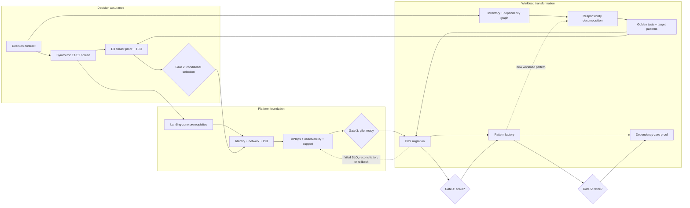
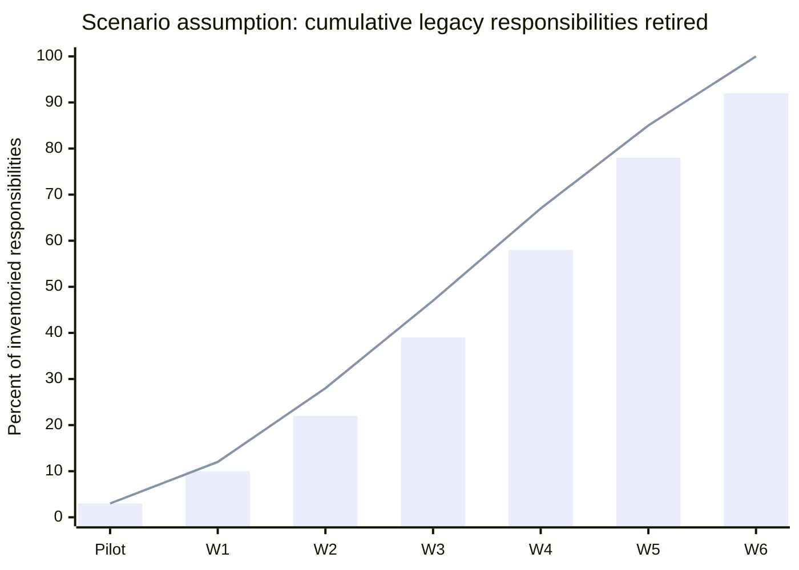

<!-- study-contract: principal -->

# Assessment-to-decommission delivery roadmap

| Field | Value |
|---|---|
| Artifact type | principal-study |
| Decision question | What sequence, capacity, evidence, and decision rights are required to move from an unscored platform study to reversible production migration and verified legacy retirement? |
| Decision owner | Executive sponsor and API platform product owner |
| Primary audiences | Executives, directors, architecture, platform engineering, SRE, security, integration, finance, and delivery leads |
| Scope | Comparative assessment, platform foundation, representative pilots, pattern-based migration, and decommission; procurement lead time is modelled but not approved |
| Evidence state | Planning model based on scenario assumptions; no organization schedule or funding commitment |
| Reference case | [Synthetic enterprise reference case](41-enterprise-reference-case.md), case ID `RE-1` |
| As-of date | 2026-08-17 |
| Next gate | Gate 0 approves the decision contract, authoritative inventory plan, workstream capacity, and evidence calendar |

## Provisional answer

The work is not a linear “select, install, migrate” programme. It is a gated portfolio with three coupled critical paths:

1. **decision assurance** must define exact deployable options and close non-compensable gates before a commercial commitment;
2. **platform and operating readiness** must prove identity, network, configuration, observability, support, and recovery before a production workload is admitted; and
3. **workload decomposition** must discover what Mule and PCF components actually do before a migration wave can be costed or sequenced.

These paths can run partly in parallel, but none can be skipped. The defensible planning range is **12–20 weeks to a conditional platform decision**, **another 14–28 weeks to evidence from representative production pilots**, and **two to six quarters for migration and retirement**. Every duration is a **scenario assumption**, not an organizational forecast. Inventory completeness, environment lead time, contract timing, scarce specialist capacity, and integration-workload complexity are the primary schedule sensitivities.

A purchase decision made before the Gate 2 evidence package creates expensive rework risk. Conversely, waiting for a perfect inventory before starting symmetric E1/E2 screening wastes elapsed time. The roadmap therefore uses bounded parallelism and explicit stop conditions.

## Roadmap boundary

This roadmap begins with decision mobilization and ends when the legacy platform has no remaining traffic, dependency, compliance, data-retention, support, or commercial obligation. It does not treat contract signature, first production traffic, or last application deployment as “done.”

The [repository roadmap](39-repository-roadmap.md) separately matures this public study system. The two roadmaps interact—better evidence automation reduces decision and migration toil—but publication engineering is not on the organization migration critical path.

## Delivery mechanism and integrated workstream model

**Figure ROAD-1 — Decision assurance, platform foundation and workload transformation advance in parallel only through explicit dependencies and gates.**

- **Depicted scope:** E1/E2/E3 decision assurance, landing-zone/identity/network/PKI/APIops/observability/support foundation, workload inventory/decomposition/patterns/pilot/factory/dependency-zero work, gate dependencies and recycle paths.
- **Excluded scope:** calendar schedule, staffing and funding, vendor/product choice, detailed task ownership, commercial lead times, production evidence and any claim that a gate has passed.
- **Diagram source, evidence state and as-of:** inline roadmap synthesis from synthetic RE-1, the phase/dependency tables and repository gate model; planning hypothesis, not an approved baseline or progress report; 2026-08-17.
- **Accessible equivalent:** decision assurance moves from contract through symmetric screen and E3/TCO to conditional selection. Foundation work moves from reversible landing-zone prerequisites through identity/network/PKI and APIops/observability/support to pilot readiness. Workload transformation moves from inventory through decomposition and golden patterns to pilot, factory and dependency zero. Cross-links prevent selection without target-pattern evidence, pilot without foundation, and scale/retirement without Gate 4/5; failed work recycles to its responsible stream.

**Figure interpretation:** decision, foundation, and workload work proceed concurrently only where their inputs are stable. The long poles are not document production; they are authoritative inventory, representative environments, cross-team security/network decisions, repeatable failure evidence, and safe workload decomposition. A failed pilot returns to the responsible workstream rather than being averaged into a programme-wide “green” status.

**Figure limitation:** The topology expresses dependencies, not elapsed time or resource feasibility. Lead times, specialist capacity, procurement, environment access and unresolved evidence can move the critical path and must be baselined by accountable owners.

## Phase model and exit evidence

| Phase | Scenario planning range | Work performed | Exit evidence—not activity |
|---|---:|---|---|
| 0. Mobilize and discover | 4–6 weeks | Approve decision contract; establish option schema; identify owners; collect API, Mule, PCF, AKS, network, identity, cost, and contract inventories; choose representative journeys | Signed decision contract, governed option IDs, inventory coverage report with uncertainty, named reviewer roles, environment and evidence plan |
| 1A. Symmetric E1/E2 screen | 3–4 weeks | Apply identical questions to every exact option; produce comparable physical views; disposition mandatory gates; define finalist PoC | Source/version/topology matrix, gate decisions, documented exclusions, counter-hypotheses, approved finalist and scenario matrix |
| 1B. E3 finalist proof | 6–10 weeks | Run equivalent security, hybrid, failure, performance, APIops, portal, operations, migration, export, and support scenarios; build TCO and sensitivity | Reproducible result bundles, independently reviewed pass/fail/inconclusive outcomes, five-year scenario model, residual risks, conditional recommendation or deferral |
| 2. Select with conditions and found | 8–16 weeks | Contract with conditions; build landing-zone integration; establish identity, PKI, private networking, policy baseline, configuration authority, telemetry, support, backup, and recovery | Approved ADR and contract conditions, production architecture, threat model, runbooks, on-call/RACI, recovery and rollback exercises, admission controls |
| 3. Representative E4 pilots | 8–16 weeks | Migrate at least one gateway-dominant and one integration-dominant workload; run production under expected controls and support | Measured SLO, cost, incident, deployment, reconciliation, consumer, rollback, and operator-toil evidence; accepted pattern or explicit redesign |
| 4. Pattern-based migration factory | 2–6 quarters | Execute waves by dependency and pattern; control WIP; measure lead time, escapes, rollback, benefits, and retirement blockers | Per-wave production-readiness records, stable patterns, capacity burn-up, benefits evidence, residual dependency map |
| 5. Decommission and optimize | 1–2 quarters after final cutover | Prove dependency and traffic zero; archive records; revoke credentials; close network and support paths; terminate contracts; revalidate controls | Zero-use evidence over approved observation window, owner attestations, archived audit/data artifacts, removed routes/secrets/jobs, closed costs and obligations |

The ranges overlap. For example, landing-zone network and identity prerequisites can begin after Gate 1 if they are vendor-neutral and reversible; candidate-specific production build waits for Gate 2.

## Scenario capacity model

The following is a **scenario assumption** used to expose resource contention. It is not a staffing recommendation or cost estimate.

| Role pool | Mobilize / screen | E3 proof | Foundation / pilots | Factory | Capacity risk |
|---|---:|---:|---:|---:|---|
| Decision and enterprise architecture | 1.5 FTE | 1.0 | 0.5 | 0.25 | Fragmented attendance causes unresolved option and exception decisions |
| API platform engineering | 1.0 | 3.0 | 5.0 | 6.0 | Same engineers cannot build every candidate PoC and the production foundation concurrently |
| Security, IAM, PKI, privacy | 1.0 | 2.0 | 2.0 | 1.0 | Review queues and certificate/identity dependencies become the critical path |
| Network / DNS / edge | 0.5 | 1.5 | 2.0 | 1.0 | Firewall, private connectivity, and failover changes have long lead times |
| SRE / observability | 0.5 | 1.5 | 3.0 | 2.0 | Day-two evidence arrives too late if SRE joins only after build |
| Integration and Mule specialists | 2.0 | 2.0 | 3.0 | 4.0 | Scarce incumbent knowledge constrains decomposition and golden tests |
| Domain/application teams | 1.0 | 1.5 | 3.0 | 4–10 | Pilot and wave throughput is bounded by consumer/backend change capacity |
| Commercial / finance / vendor management | 0.5 | 1.0 | 0.5 | 0.25 | Pricing and support evidence can lag technical evaluation |
| Programme, change, training | 1.0 | 1.0 | 2.0 | 3.0 | Migration work in progress grows faster than adoption and support readiness |

The reference case assumes the integration and platform teams share a small number of specialists. Starting six candidate environments, an AKS foundation, and Mule discovery simultaneously would exceed capacity and reduce evidence quality. The portfolio caps concurrent E3 candidates at the number that can receive equivalent engineering and independent review.

## Critical-path dependencies

| Dependency | Earliest phase | Lead-time assumption | Failure consequence | Control |
|---|---|---:|---|---|
| Decision rights and mandatory-gate semantics | 0 | 2–4 weeks | Evidence is collected but cannot resolve a dispute | Gate 0 decision contract and exception authority |
| Authoritative workload/dependency inventory | 0 | 6–12 weeks, then continuous | Pilot is unrepresentative; retirement blockers appear late | Coverage metric, uncertainty register, owner attestations, runtime traffic correlation |
| Vendor environments and licensed capability | 1A | 3–10 weeks | “Equivalent” PoC substitutes an OSS or trial feature | Version/edition/entitlement bill of materials before test acceptance |
| Private connectivity, DNS, certificates, identity integration | 1A | 6–16 weeks | Hybrid and security tests use unrealistic shortcuts | Reversible shared prerequisites start after Gate 1 |
| Representative upstream and fault controls | 0 | 3–6 weeks | Performance and resilience claims cannot be repeated | Deterministic fixtures, latency/fault injection, immutable configuration |
| Commercial scenario and support boundary | 1A | 4–10 weeks | Gate 2 compares engineering only and hides cost/toil | TCO and joint support exercise are mandatory Gate 2 inputs |
| Golden behavior and reconciliation corpus | 0 | 6–16 weeks | Mule decomposition cannot prove parity or safe rollback | Select and capture representative workloads before pilot build |
| Production change, risk, and records approvals | 2 | 4–12 weeks | Pilot waits after technical readiness | Admission checklist and forum calendar agreed at Gate 0 |

## Migration throughput model

Application count is a poor forecast unit. One routing-only API and one integration application with twelve connectors, state, batch schedules, and compensating logic are not comparable. The factory forecasts **pattern points**:

| Pattern | Scenario points | Typical work | Primary bottleneck |
|---|---:|---|---|
| P1. Gateway policy/facade only | 1 | Route, identity/policy parity, consumer cutover | Consumer credentials and test coordination |
| P2. Bounded mapping or adapter | 3 | Extract transformation, golden corpus, service deployment | Behavior parity and schema ownership |
| P3. Stateful orchestration | 8 | Redesign workflow, idempotency, compensation, reconciliation | Domain decision and production proving |
| P4. Messaging/batch/file integration | 5 | Target runtime, replay, schedule, file/control reconciliation | Platform dependency and operational handoff |
| P5. Shared library/domain dependency | 2–13 | Untangle consumers and version contracts | Cross-wave dependency coordination |

Assume one mature migration pod can complete **6–10 pattern points per six-week wave** after patterns are proven. Before that, throughput is deliberately lower. A wave enters execution only when its dependency graph, target pattern, golden tests, rollback, data reconciliation, operations owner, and consumer communication are ready.

**Chart ROAD-2 — Accepted retirement can lag planned cutover because residual dependencies survive application movement.**

- **Depicted scope:** two synthetic cumulative series across Pilot and waves W1–W6: planned cutover progress and accepted legacy-responsibility retirement.
- **Excluded scope:** application counts, pattern points, calendar dates, confidence bands, staffing, benefit/cost realization, residual-dependency types and observed programme progress.
- **Chart source, evidence state and as-of:** synthetic roadmap scenario values defined in this study; planning illustration, not a forecast, commitment or observed burn-up; 2026-08-17.
- **Accessible equivalent:** planned cutover percentages are 3, 12, 28, 47, 67, 85 and 100; accepted retirement percentages are 3, 10, 22, 39, 58, 78 and 92 for Pilot through W6. The migration-throughput table defines pattern-point complexity, while decommission gates define why accepted retirement can remain below cutover.

**Chart interpretation:** the bars represent accepted retirement and the line represents planned cutover, illustrating a plausible lag between them. The final accepted percentage is deliberately below 100 because shared schedules, connectors, credentials, data-retention duties or consumer dependencies can outlive the last application cutover.

| Series legend and accessible values | Pilot | W1 | W2 | W3 | W4 | W5 | W6 |
|---|---:|---:|---:|---:|---:|---:|---:|
| Accepted responsibility retirement — bars | 3 | 10 | 22 | 39 | 58 | 78 | 92 |
| Planned cutover trajectory — line | 3 | 12 | 28 | 47 | 67 | 85 | 100 |

**Chart limitation:** Both series are scenario assumptions without uncertainty ranges and cannot be used as a delivery baseline. Actual values must be generated from governed dependency, cutover and decommission registers using one accepted definition of “retired.”

## Gate decisions and stop conditions

| Gate | Decision | Minimum evidence | Stop or recycle condition |
|---|---|---|---|
| 0. Decision contract | Fund comparative evidence | Scope/non-goals, option schema, gate semantics, owners, capacity, scenario, evidence threshold | No accountable decision owner; options or non-compensable gates undefined |
| 1. Finalist down-select | Fund symmetric E3 proof | Equivalent E1/E2 coverage, physical views, mandatory-gate disposition, testability, documented exclusions | Candidate evidence too asymmetric; exact edition/topology unavailable; critical gate unknown without an approved plan |
| 2. Conditional selection | Select with enforceable conditions or defer | E3 results, TCO/support, sensitivity, risks, exit, contract conditions, independent review | Failed mandatory gate; material unknown without time-bound condition; rank unstable under plausible sensitivity; support/exit unacceptable |
| 3. Pilot readiness | Admit controlled production workload | Production controls, runbooks, on-call, observability, capacity, recovery, rollback, change/risk approvals | Unowned dependency; recovery or rollback not exercised; production support unavailable |
| 4. Factory approval | Scale accepted patterns | E4 SLO/cost/toil/incident evidence, two representative patterns, trained teams, benefit baseline | Pilot succeeds only through heroics; reconciliation incomplete; rollback unsafe; operating cost or toil exceeds threshold |
| 5. Decommission | Remove legacy capability and cost | Dependency/traffic zero, observation window, owner acceptance, records and contract closure | Any live consumer, schedule, credential, integration, legal retention, audit, support, or recovery dependency remains |

## Failure and replanning scenarios

### Candidate fails a mandatory gate

Stop investment in that exact option; do not translate failure into a low weighted score. If the failure is topology-specific, define a new exact option and assess its changed cost and operating boundary. Do not silently switch editions or deployment modes inside an existing scorecard.

### Reference pilot misses latency or availability SLO

Freeze scale-up. Determine whether the defect is gateway processing, identity dependency, network path, upstream behavior, capacity configuration, telemetry backpressure, or client retry amplification. Re-run from a controlled baseline. A tuned rerun preserves the failed result and records what changed.

### Mule inventory expands during execution

Recalculate pattern points, specialist capacity, contract horizon, and benefit timing. Do not hide scope growth by increasing “applications migrated” while shared responsibilities remain. Newly discovered shared domains or connectors may reorder waves and delay decommission even when application cutovers continue.

### Vendor environment or entitlement is late

Continue vendor-neutral discovery, fixture engineering, security/network prerequisites, and E1/E2 closure. Do not accept substitute OSS results for licensed capabilities. If lateness threatens a decision window, mark the option inconclusive or extend the gate explicitly.

### Platform team becomes the bottleneck

Cap concurrent waves and prioritize reusable patterns, paved-road automation, documentation, and domain-team enablement. Increasing work in progress without on-call, review, and environment capacity raises incident and escape risk.

## Decision implications

- Fund the work as a portfolio of evidence, foundation, and transformation streams rather than one gateway implementation project.
- Authorize vendor-neutral discovery and prerequisite work before selection, but prevent candidate-specific production commitments before Gate 2.
- Forecast migration with responsibility patterns and dependencies, not API or application count alone.
- Reserve independent reviewer, security, network, SRE, and incumbent-integration capacity at mobilization; they are not late-stage approvers.
- Keep an explicit stop option at Gates 1–4. Sunk PoC or foundation cost does not justify a failed platform choice or unsafe migration.
- Tie benefit realization to accepted responsibility retirement and closed recurring cost, not traffic moved.

## Falsification and proof plan

| Proof ID | Procedure | Measure | Threshold | Evidence artifact | Independent reviewer |
|---|---|---|---|---|---|
| PLAN-001 | Reconcile inventory against repositories, runtime traffic, schedules, network flows, and owner attestations | Coverage and unowned items | Steering-approved coverage floor; zero unowned critical items | Versioned inventory coverage report | Enterprise architecture |
| PLAN-002 | Resource-load the roadmap by named role pools and calendar constraints | Peak allocation and queued critical work | No critical role above approved capacity; conflicts explicitly resolved | Capacity-loaded plan | Portfolio governance |
| PLAN-003 | Dry-run Gates 1–5 using one candidate, pilot, wave, and decommission record | Missing evidence and ambiguous rights | Every gate produces a deterministic decision or named escalation | Gate rehearsal record | Internal assurance |
| PLAN-004 | Simulate a failed pilot and a newly discovered shared Mule dependency | Replan time and traceability | Impact reflected in dependencies, dates, cost, risk, and decision status within agreed SLA | Scenario exercise bundle | Programme risk |
| PLAN-005 | Compare planned and actual pattern-point throughput after two waves | Forecast error and work in progress | Forecast recalibrated; no unbounded work or hidden carryover | Wave metrics and revised model | Finance / delivery assurance |

## Risks and limitations

- All durations, capacities, pattern points, and chart values are scenario assumptions. No staffing plan, vendor lead time, inventory, change calendar, or budget has been confirmed.
- Product contracting, privacy assessment, security review, network provisioning, and production change approval may run sequentially in some organizations even when this model shows overlap.
- A public roadmap cannot contain named people, commercial quotes, restricted evidence locations, or private topology. The accountable operational plan must maintain those in controlled systems.
- Migration throughput varies more with dependency, behavior, data, and consumer complexity than with code size.
- The plan does not assume every Mule responsibility moves to AKS or the selected gateway. Some capabilities may remain, retire, move to SaaS, or require a separate integration platform decision.
- A successful gateway pilot does not validate integration-heavy migration patterns; both archetypes are required before Gate 4.

## Open evidence requests

| Request | Owner role | Due gate | Decision impact if unresolved |
|---|---|---|---|
| Authoritative workload and dependency coverage | Integration portfolio owner | Gate 0, refreshed at every gate | Schedule, TCO, pilot representativeness, and decommission date remain unreliable |
| Decision forums and exception authority | Executive sponsor | Gate 0 | No deterministic response to failed or unknown mandatory gates |
| Environment and vendor lead times | Platform and vendor management | Gate 1 | E3 calendar and conditional-selection date remain provisional |
| Specialist and domain-team capacity | Portfolio governance | Gate 0 | Parallel plan may be infeasible |
| Production admission and records requirements | Risk, security, operations | Gate 2 | Pilot cannot enter production even if technically ready |
| Current recurring and exit costs | Finance and commercial | Gate 2 | Benefit and decommission economics cannot be accepted |

## Next gate

Gate 0 approves only when the decision contract, exact-option schema, scenario, inventory method, critical-role capacity, evidence calendar, gate authority, and restricted/public evidence boundary are accepted. Until then, the roadmap is a challenge model for planning—not a delivery commitment.
