# Assessment-to-decommission delivery roadmap

## Roadmap boundary

This is the organization delivery roadmap: it begins with decision mobilization and ends with legacy decommissioning. Stages 0–1B are comparative evidence work; Stage 2 begins only after a conditional selection at Gate 2. Representative production pilots remain mandatory before Gate 4 authorizes migration at scale. The [repository roadmap](39-repository-roadmap.md) separately matures the reusable evidence system, content, automation, and portal.

| Phase | Indicative duration | Exit criteria |
|---|---:|---|
| 0. Mobilize + discover | 4–6 weeks | Scope, decision contract, owners, inventories, representative APIs, test environments |
| 1A. E1/E2 broad screen | 3–4 weeks | Equivalent official/vendor evidence, mandatory-gate screen, comparable candidate views, approved finalists |
| 1B. E3 finalist proof | 4–6 weeks | Symmetric lab evidence, security/performance/resilience results, TCO/support model, sensitivity, conditional recommendation |
| 2. Select with conditions and found | 6–12 weeks | Conditional ADR/contract, landing zone, identity/network/PKI, API operations, observability, support, tested rollback |
| 3. E4 production pilots | 8–16 weeks | Two or more representative production pilots, runbooks, trained teams, measured SLO/cost |
| 4. Migration factory | 2–6 quarters | Pattern-based waves, quality gates, benefit/risk tracking |
| 5. Decommission | 1–2 quarters after last wave | No dependencies/traffic, archives complete, contracts closed, controls revalidated |

Durations are planning ranges, not commitments. Re-plan after inventory and vendor environment lead times are known.

## Phase and gate flow

```mermaid
flowchart LR
  P0["0 · Mobilize / discover<br/>4–6 weeks"] --> G0{"Gate 0<br/>decision contract approved"}
  G0 --> P1A["1A · E1/E2 broad screen<br/>3–4 weeks"] --> G1{"Gate 1<br/>approve finalists"}
  G1 --> P1B["1B · E3 finalist proof + TCO<br/>4–6 weeks"] --> G2{"Gate 2<br/>conditional selection"}
  G2 --> P2["2 · Select with conditions + found<br/>6–12 weeks"] --> G3{"Gate 3<br/>production-pilot ready"}
  G3 --> P3["3 · E4 production pilots<br/>8–16 weeks"] --> G4{"Gate 4<br/>scale factory?"}
  G4 --> P4["4 · Migration factory<br/>2–6 quarters"] --> G5{"Gate 5<br/>dependency zero"}
  G5 --> P5["5 · Decommission / optimize<br/>1–2 quarters"]
  G1 -->|"screen incomplete"| P1A
  G2 -->|"not selection-ready"| P1B
  G3 -->|"foundation conditions unmet"| P2
  G4 -->|"pilot conditions unmet"| P3
  G5 -->|"dependencies remain"| P4
```

## Decision rights

| Gate | Accountable role | Required reviewers | Approval evidence | Decision unlocked |
|---|---|---|---|---|
| 0. Decision contract | Executive sponsor and decision owner | Architecture, security, operations, commercial, programme | Approved scope/non-goals, gates, weights, evidence threshold, calendar, dissent and exception rules | Fund and start comparative evidence work |
| 1. Finalist down-select | Decision owner | Independent evidence reviewers plus architecture, security, operations, commercial, programme | Equivalent E1/E2 screen of all seven variants, mandatory-gate dispositions, comparable candidate views, approved evidence plan | Fund symmetric finalist proof or remove a candidate |
| 2. Conditional selection | Decision owner | Independent evidence reviewers plus architecture, security, operations, commercial, programme | Symmetric E3 proof, criterion/variant ledger, TCO/support model, sensitivity, risks, dissent, conditions, and exit path | Select with conditions and fund platform foundation, extend evidence, or stop |
| 3. Production-pilot readiness | Platform product owner | Security, SRE, domain owner, change authority | Landing-zone controls, runbooks, support RACI, tested rollback, production-readiness record | Admit representative E4 production pilots |
| 4. Migration-factory approval | Programme sponsor | Platform, domain, integration, SRE, finance | E4 pilot SLO/cost results, trained teams, pattern acceptance, capacity and benefits baseline | Scale pattern-based migration waves |
| 5. Decommission authorization | Service and application owners | Operations, security, records, commercial | Zero traffic/dependencies, archives, control revalidation, contract closure | Retire legacy runtime and cost |

Track owner assignments, capacity, dependencies, target dates, status, exit evidence, approver, and decision impact in the [assessment action register template](../templates/assessment-action-register-template.csv). Public copies use roles or anonymized IDs; named-person mappings remain restricted.
