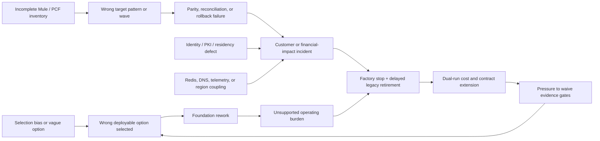

# Decision and delivery risk register

This is an operational register, not a list of generic concerns. Each risk has an observable trigger, treatment, target gate, residual target, and evidence requirement. Ratings below apply only to the [synthetic enterprise reference case](41-enterprise-reference-case.md), case `RE-1`; they are **scenario assumptions**, not an assessment of a real organization.

## Rating model

- Likelihood and impact use 1 (rare/minor) through 5 (almost certain/severe).
- Exposure is likelihood × impact: low 1–4, moderate 5–9, high 10–16, critical 17–25.
- A mandatory-gate risk is not accepted merely because its numeric exposure falls. The authorized forum must disposition the underlying criterion.
- “Mitigation planned” does not lower residual exposure. Residual rating changes only when evidence shows the control works.

## Portfolio view

**Figure interpretation:** the largest programme risk is a reinforcing loop. Incomplete evidence produces the wrong option or migration pattern; rework and dual-run cost then create schedule pressure to waive the same evidence controls. The treatment is not a larger contingency reserve alone. It is hard stage gates, explicit WIP limits, reversible pilots, and benefit measures tied to accepted responsibility retirement.

## Active risk register

| ID | Risk event and consequence | Inherent L×I | Early indicator / trigger | Treatment and contingency | Owner role | Due gate | Residual target | Closure evidence |
|---|---|---:|---|---|---|---|---:|---|
| R-01 | Gateway policy absorbs transformation, branching, state, or orchestration and becomes the next integration monolith; releases couple to business logic and exit cost rises | 4×5 = **20 critical** | Policies exceed complexity limits; custom scripts branch on domain data; gateway change cadence follows application releases | Enforce capability boundary; architecture lint/review; route complex behavior to domain/integration services; maintain a dated exception and extraction plan | Integration architecture | Gate 2 and every wave | 2×4 = 8 | Policy inventory, complexity report, accepted target-pattern ADR |
| R-02 | A Kong-first test order distorts requirements, evidence, or scoring and produces a biased down-select | 4×5 = **20 critical** | Criteria or weights change after a vendor demo; unequal source depth; candidate-specific scenarios | Freeze option schema and gate semantics at Gate 0; symmetric E1/E2 and E3 matrices; independent evidence reviewers; sensitivity analysis | Assessment lead | Gate 1 | 1×5 = 5 | Versioned criteria/weights, coverage matrix, reviewer record, sensitivity output |
| R-03 | Configuration, consumer metadata, analytics, telemetry, support data, or backups cross an unapproved residency/trust boundary | 3×5 = **15 high** | Data map has “unknown” fields; vendor support bundle or SaaS endpoint is outside approved region; payload appears in telemetry | Field-level data-flow and retention map; contract and subprocessor review; redaction; egress controls; negative telemetry tests; topology-specific gate | Security/privacy | Gate 1 for screen, Gate 2 for closure | 1×5 = 5 | Approved data-flow model, packet/log evidence, contract reference, negative-test bundle |
| R-04 | Required policy, portal, analytics, identity, or governance capability is unavailable in the selected edition or topology | 4×4 = **16 high** | PoC uses a substitute; entitlement is “TBD”; feature matrix changes between managed and hybrid variants | Exact version/edition/topology bill of materials; vendor attestation; licensed E3 execution; contract condition; explicit fallback cost | Platform product | Gate 2 | 1×4 = 4 | Entitlement matrix, vendor evidence, executed result, contract condition |
| R-05 | A distributed counter or cache becomes a shared request-path failure and causes latency, incorrect quotas, or broad outage | 3×5 = **15 high** | Redis/counter latency grows; cross-zone chatter; retry spikes; local/global counts diverge | Classify which limits need global consistency; isolate stores; bound timeouts/retries; choose fail-open/closed by API; inject slow/partitioned store under load | SRE | Gate 2 | 2×4 = 8 | Failure-injection result, policy decision, SLO dashboard, recovery runbook |
| R-06 | Mule inventory misses DataWeave, shared domains, queues, schedules, files, connectors, or side effects; migrated behavior diverges or retirement fails | 5×5 = **25 critical** | Owner and repository inventories disagree; runtime traffic has no mapped owner; golden corpus omits side effects | Combine static analysis, runtime telemetry, repository scan, scheduler/queue/network inventory, owner walkthroughs, golden behavior and reconciliation tests | Integration portfolio | Gate 0 baseline; Gate 4 closure | 2×5 = 10 | Coverage report, responsibility graph, golden corpus, owner acceptance, dependency-zero evidence |
| R-07 | PCF/Mule coexistence becomes permanent and dual-run cost, certificates, routes, and support remain indefinitely | 4×4 = **16 high** | Cutovers increase while retired responsibilities and contracts do not; rollback routes have no expiry | Benefits tied to responsibility retirement; expiry on coexistence routes; per-wave decommission tasks; executive exception for missed retirement gate | Programme sponsor | Gate 4 per wave; Gate 5 final | 2×4 = 8 | Retirement burn-up, expired routes/credentials, cost closure, decommission record |
| R-08 | Portal, product, access, credential, and onboarding operations are underestimated; manual queue and security exceptions grow | 4×3 = **12 high** | Onboarding lead time rises; orphan consumers; manual credential rotation; portal content diverges | Test complete developer journeys; product/consumer inventory; lifecycle automation; service-level objective and staffing model; measure exception toil | API product owner | Gate 2 | 2×3 = 6 | Journey results, lead-time distribution, lifecycle audit, workload model |
| R-09 | Vendor, cloud, Kubernetes, CNI, firewall, identity, and application teams bounce incidents across support boundaries | 4×4 = **16 high** | Severity case is reassigned repeatedly; no owner for packet capture or control-plane evidence | Joint fault-domain RACI; support contract mapping; severity exercise crossing vendor/platform boundaries; timestamped evidence handoff; escalation clock | Operations director | Gate 2 contract; Gate 3 exercise | 2×4 = 8 | Joint support exercise, RACI, escalation timings, contractual reference |
| R-10 | Logs, traces, metrics, analytics, or support bundles expose tokens, identifiers, or regulated payload data | 3×5 = **15 high** | High-cardinality labels; payload/body capture; raw Authorization headers; unrestricted debug mode | Default-deny field policy; collector redaction; synthetic canary secrets; automated negative tests; time-bound debug approval; retention/access controls | Security operations | Gate 3 | 1×5 = 5 | Canary scan, redaction tests, configuration, access/retention evidence |
| R-11 | Multi-region architecture doubles cost but shares DNS, PKI, control, data, or operator dependencies and cannot meet recovery objectives | 3×5 = **15 high** | DR diagram has no state map; failover relies on manual undocumented steps; stale consumer/data state after switch | Per-plane RTO/RPO; dependency and state inventory; scheduled regional exercise; reconcile configuration/consumer/audit state; measure client convergence | Resilience lead | Gate 2 design; Gate 3 exercise | 2×5 = 10 | Regional exercise bundle, state reconciliation, client convergence, cost model |
| R-12 | Proprietary policy, product, consumer, analytics, or automation constructs make exit slower and costlier than modelled | 4×4 = **16 high** | Exports are partial; policies require proprietary runtime; no restore into clean environment | Portability inventory; export/restore exercise; open-contract boundary; switching-cost model; contract exit and deletion obligations | Enterprise architecture | Gate 2 | 2×4 = 8 | Exported bundle, clean-room restore, portability exceptions, exit-cost scenario |
| R-13 | Control-plane interruption is mistaken for proven data-plane resilience; restarted or scaled replicas cannot obtain safe configuration | 3×5 = **15 high** | Tests cover existing proxy only; no restart/scale attempt; sync age not monitored | Separate request-path and change-plane SLOs; disconnect, restart, scale, rotate, and recover tests; define maximum stale age and emergency behavior | Platform/SRE | Gate 2 | 1×5 = 5 | `I-02`-derived test bundle, configuration hashes, sync-age and recovery evidence |
| R-14 | Timeout ambiguity and retries duplicate a non-idempotent payment or transfer during migration | 3×5 = **15 high** | Client retries after lost response; idempotency store differs across legacy and target; reconciliation lags | End-to-end idempotency ownership; gateway only propagates key; durable result lookup; bounded retries; golden side-effect and reconciliation tests | Domain owner | Gate 3 pilot | 1×5 = 5 | `J-01` / `I-01` result bundle, ledger reconciliation, retry traces, rollback proof |
| R-15 | Certificate rollover breaks disconnected gateways, pinned clients, partner mTLS, or long-lived connections | 4×4 = **16 high** | Single trust anchor; unknown partner rotation window; expiry alert without ownership | Overlapping trust bundles; automated issuance/distribution; inventory and expiry SLO; disconnected rotation exercise; partner rehearsal and rollback | PKI/IAM | Gate 3 | 2×4 = 8 | `I-03` exercise, inventory, old/new trust evidence, alert and rollback timestamps |
| R-16 | Telemetry exporter backpressure consumes memory/CPU or blocks request handling; dropping telemetry creates an audit gap | 3×4 = **12 high** | Export queue grows; collector throttles; pod memory and request latency correlate; missing spans/logs | Bound buffers and cardinality; asynchronous export; sampling/redaction policy; failure injection; gap detection and reconciliation procedure | Observability/SRE | Gate 2 | 1×4 = 4 | `I-05` load result, dropped-item metric, request SLO, gap record |
| R-17 | Noisy-neighbour traffic exhausts gateway, connection, counter, or upstream capacity and harms critical journeys | 4×5 = **20 critical** | Non-critical burst raises `J-01` latency/errors; HPA reacts after saturation; shared upstream pool maxes out | Failure-domain and capacity isolation; per-class limits/priorities; headroom with largest unit lost; queue/pool telemetry; burst and soak tests | SRE/platform | Gate 2 | 2×5 = 10 | `I-04` result, per-class SLOs, capacity model, isolation evidence |
| R-18 | Schema or contract drift passes gateway checks but breaks downstream mapping, event, batch, or consumer behavior | 4×4 = **16 high** | Provider deploys additive/semantic change; generated clients or DataWeave mappings diverge; replay fails | Contract compatibility rules; consumer-driven and golden-corpus tests; schema registry where applicable; versioned deprecation; replay/reconciliation test | API governance/domain | Gate 3 | 2×4 = 8 | `I-07` test, consumer matrix, compatibility result, rollback/deprecation record |
| R-19 | Code rollback succeeds while schema/data change is irreversible, leaving the API apparently healthy but business state inconsistent | 3×5 = **15 high** | Deployment dashboard green; reconciliation mismatch; old code cannot read new state | Expand/contract changes; backward-compatible windows; business reconciliation and compensating plan; rollback decision tree includes data state | Domain/SRE | Gate 3 | 1×5 = 5 | `I-08` exercise, compatibility proof, reconciliation, compensation record |
| R-20 | Technical success is declared while platform toil, support load, or skill scarcity makes the option unsustainable | 4×4 = **16 high** | Heroic manual operations; high alert load; vendor tickets; slow onboarding/upgrades; key-person dependency | Instrument toil and lead time; production pilot on-call; skill/RACI and training plan; support exercise; TCO includes internal labour and dual run | Platform product / operations | Gate 4 | 2×4 = 8 | Pilot toil log, staffing model, support outcomes, fully loaded scenario cost |

## Risk interaction scenarios

### Non-idempotent transfer under partial failure

Journey `J-01` receives a client request, the backend commits it, and the response is lost (`I-01`). If the client, edge, gateway, and service each retry independently, a second transfer may be created. Rate limiting and high availability do not solve the correctness problem. The control belongs to the domain transaction boundary: durable idempotency record, stable response lookup, explicit timeout semantics, and reconciliation. The gateway propagates the key and prevents obviously unsafe retries; it does not own the financial ledger.

### Control-plane disconnect plus capacity loss

During `I-02`, existing data planes may continue from cached state while a failed pod is replaced. The real question is whether a new or restarted replica obtains known-good configuration, what identity/certificate dependencies remain, how long stale state is acceptable, and whether operators can safely add capacity. The exercise must combine disconnection with pod loss and load; testing each in isolation understates R-13 and R-17 interaction.

### Regional failover with inconsistent state

`I-06` may restore request routing while consumer keys, product subscriptions, configuration, counters, analytics, or downstream data remain stale. DNS convergence alone is not recovery. Gate 3 evidence includes per-state RPO, configuration hashes, consumer authentication checks, business reconciliation, telemetry/audit gap recording, and a controlled failback plan.

## Governance and escalation

- Risk owners maintain triggers and evidence; programme management does not lower technical ratings without owner evidence.
- A risk at or above the approved mandatory-gate threshold blocks the dependent decision unless the named exception authority records rationale, compensating controls, expiry, and review date.
- Any critical incident, failed mandatory test, material product support change, or inventory expansion triggers re-rating and downstream impact tracing.
- Accepted risk is time-bounded. The residual target and monitoring signal remain active through migration and decommission.
- Restricted findings use a safe reference ID in this public register; raw vulnerabilities, topology, logs, commercial terms, and named people remain controlled.

## Decision implications

The first funding priority is to reduce R-02, R-03, R-06, R-13, R-14, and R-17 because they can invalidate platform selection or cause severe customer impact. R-07 and R-20 govern the economic outcome: a technically sound platform can still fail if the programme cannot retire responsibilities or sustain operations. Gate packs report both individual exposure and interaction scenarios; an average risk score is not used to override a non-compensable gate.

## Limitations

- Ratings are scenario assumptions and must be recalibrated using actual inventory, incidents, controls, contracts, and risk appetite.
- The table is public-safe and omits exploit detail, named owners, private dependencies, commercial exposure, and raw evidence.
- Residual targets are not accepted ratings. Only implemented and tested controls support a lower residual score.
- Risks outside API management—application defects, data migration, core platform recovery, regulatory interpretation, and programme funding—may dominate the final portfolio even where they appear here only as dependencies.

## Next gate

Gate 0 assigns accountable roles and organization-specific scoring rules. Gate 1 requires current triggers and treatments for all candidate-screening risks. Gate 2 may not conditionally select an option while a failed security, residency, support, or recovery gate is hidden behind a lower aggregate risk score.
