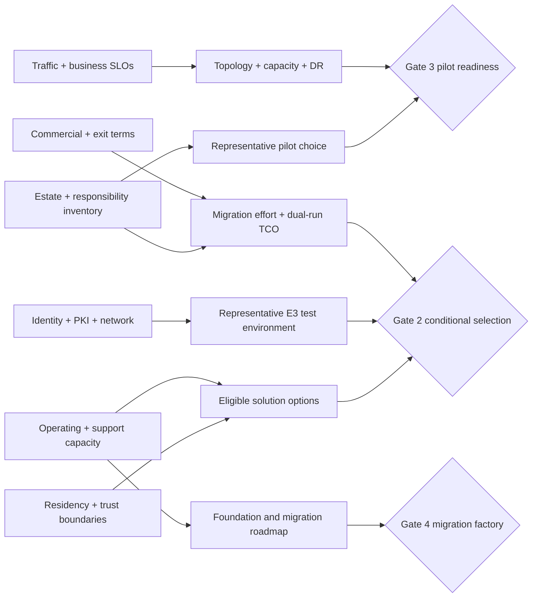

# Decision-critical open evidence register

An open question is useful only when its answer has an owner, required artifact, due gate, and defined decision impact. This register contains the small set of unknowns that can change the shortlist, architecture, proof scope, roadmap, or decommission decision. The complete discovery bank remains in [`workshops/question-bank.md`](../workshops/question-bank.md).

No question below is answered by a generic industry pattern or the [synthetic enterprise reference case](41-enterprise-reference-case.md). Scenario `RE-1` exercises the analysis; it does not describe an organization.

## How to close a question

An answer is accepted only when it records:

1. the accountable role and reviewing role;
2. the authoritative evidence artifact and as-of date;
3. applicability to specific environments, workloads, regions, products, editions, and topologies;
4. uncertainty, exceptions, and dissent;
5. affected criteria, risks, options, PoC scenarios, architecture decisions, and roadmap tasks; and
6. the approval forum and disposition.

“Confirmed in a meeting” is not durable evidence. Public records contain only sanitized conclusions and stable restricted-reference IDs where the evidence itself is sensitive.

## Dependency view

**Figure interpretation:** the unknowns are not independent. For example, a topology cannot be approved from a target-state diagram until traffic/SLO, residency, identity/network, and operating-model answers are known. A vendor feature demonstration cannot compensate for a missing authoritative estate inventory or support boundary.

## Gate 0 — decision contract and current-state evidence

| ID | Decision-critical question | Required evidence artifact | Accountable role | Due gate | Impact if unresolved |
|---|---|---|---|---|---|
| Q-01 | What does PCF mean in the estate—product/version, foundations, spaces, routes, shared services, support deadlines, owners, and retirement commitments? | Platform inventory reconciled to deployment APIs, route/traffic data, CMDB or equivalent, and owner attestation | Application platform owner | Gate 0 | PCF-to-AKS scope, routing coexistence, skills, costs, and retirement schedule remain unknown |
| Q-02 | Which Mule applications, APIs, flows, shared domains, DataWeave modules, connectors, queues, schedules, files, certificates, policies, and external dependencies exist by environment? | Responsibility-level inventory with repository/runtime evidence, dependency graph, owner, criticality, and confidence | Integration portfolio owner | Gate 0 baseline; refreshed through Gate 5 | Pilot representativeness, migration patterns, TCO, and decommission evidence are unreliable |
| Q-03 | Which APIs and integrations can retire, merge, remain, move to SaaS, or require a separate integration capability instead of gateway migration? | Product/domain disposition with usage, consumer, regulatory, and capability analysis | Business/domain portfolio | Gate 0 baseline | Programme may recreate obsolete workloads or force integration logic into a gateway |
| Q-04 | Which critical journeys, APIs, and workloads represent the decision, including non-idempotent, stateful, asynchronous, file, streaming, and partner behavior? | Representative-workload selection with population coverage and excluded-pattern analysis | Enterprise architecture and business service owners | Gate 0 | PoC evidence cannot generalize to the estate |
| Q-05 | What outcomes and deadlines make a platform change necessary, and which decisions are separable: API management, application platform, and integration capability? | Approved decision records with scope, alternatives, non-goals, value measures, authority, and calendar | Executive sponsor / decision owner | Gate 0 | One product selection may incorrectly absorb three distinct architecture decisions |
| Q-06 | What evidence coverage, mandatory-gate semantics, allowed unknowns, exception authority, sensitivity rule, and dissent process govern selection? | Decision contract and scoring/gate policy | Decision owner with independent assurance | Gate 0 | Evidence can be selectively interpreted and a failed gate can be averaged away |
| Q-07 | Which role pools and named restricted-record owners have capacity for assessment, security/network integration, incumbent discovery, E3 tests, foundation, pilots, and on-call? | Capacity-loaded plan and RACI, with conflicts and escalation | Portfolio governance | Gate 0 | Parallel roadmap is not executable and review queues become the hidden critical path |

## Gate 1 — eligible options and comparable proof

| ID | Decision-critical question | Required evidence artifact | Accountable role | Due gate | Impact if unresolved |
|---|---|---|---|---|---|
| Q-08 | Which exact product, edition, control-plane location, runtime topology, portal/analytics option, support tier, and version policy constitute each deployable solution option? | Governed option catalog and topology bill of materials | Enterprise architecture / vendor management | Gate 1 | Brand-level comparisons hide materially different residency, operations, feature, and cost profiles |
| Q-09 | Which Azure regions, private sites, other clouds, sovereign boundaries, clusters, zones, and trust segments must host gateways or management components? | Approved placement and trust-boundary map | Cloud and enterprise architecture | Gate 1 | Hybrid options and physical architectures cannot be evaluated consistently |
| Q-10 | Which request payload, configuration, consumer/product, credential, analytics, telemetry, support, backup, and audit data may leave each boundary? | Field-level data-flow, classification, retention, and subprocessor map | Privacy and security architecture | Gate 1 | Candidate eligibility and contract controls remain unknown |
| Q-11 | Which capabilities are mandatory by topology and entitlement—OIDC, mTLS, schema/threat controls, global quota, portal, monetization, federation, analytics, audit, policy, export, and automation? | Traceable requirement-to-option entitlement matrix | API product and security owners | Gate 1 | PoC may use substitutes and later discover a license or topology blocker |
| Q-12 | What Kubernetes, operating-system, database, network, service-mesh, and upgrade versions must be supported, and who owns every customer-managed component? | Supported-platform matrix and joint responsibility model | Platform engineering / vendor management | Gate 1 | A candidate may be technically installable but unsupported in the target lifecycle |
| Q-13 | What current source, vendor answer, or lab procedure can resolve every mandatory gate for every option, and where is evidence asymmetric? | Candidate × gate × evidence-level coverage heatmap | Evidence lead | Gate 1 | Finalists may be selected because one candidate was researched more deeply |
| Q-14 | What fact would falsify each named sequencing hypothesis, and what common evidence—if any—would justify an execution order? | Counter-hypothesis register with tests, common-evidence comparison and decision effect | Independent architecture reviewer | Gate 1 | Research becomes confirmatory rather than comparative |

## Gate 2 — conditional platform selection

| ID | Decision-critical question | Required evidence artifact | Accountable role | Due gate | Impact if unresolved |
|---|---|---|---|---|---|
| Q-15 | What are p50/p95/p99/p99.9 latency, steady/peak/burst throughput, payload, connection, protocol, seasonality, growth, and largest-failure-unit targets by traffic class? | Measured current baseline plus approved future profile and headroom rule | Business service owners and SRE | Gate 2 | Performance results, autoscaling, topology, capacity, and cost cannot be interpreted |
| Q-16 | What SLO, RTO, and RPO apply separately to request path, configuration change, administration, identity, portal, analytics, audit, and telemetry? | Business-impact analysis and per-plane service-level model | Service owners / resilience | Gate 2 | “Highly available” cannot be translated into design or pass/fail evidence |
| Q-17 | During control-plane or management disconnection, may existing and new/restarted replicas proxy; how stale may configuration become; which operations must remain available? | Approved degraded-mode policy and symmetric `I-02` test results | Platform product and security | Gate 2 | Hybrid fit and emergency capacity behavior remain unknown |
| Q-18 | Which identity providers, issuers, audiences, grants, scopes, claims, token lifetimes, JWKS/cache rules, mTLS trust domains, and administrator controls are approved? | Identity architecture, threat model, and negative test evidence | IAM/security | Gate 2 | Authentication and administration gates remain open; failure behavior may be unsafe |
| Q-19 | Which DNS, WAF, DDoS, load balancer, private-link, firewall, proxy, NAT, egress, original-client-IP, certificate, and time services are in each request/control path? | Packet-level logical/physical flow with owners and failure scenarios | Network and edge teams | Gate 2 | Latency, trust, source identity, support, and recovery claims are untestable |
| Q-20 | What failure behavior is required for identity, PKI, DNS, control plane, counter store, registry, secret delivery, telemetry, and upstream degradation? | Failure-mode policy defining fail-open/closed, timeout, retry, buffer, alert, recovery, and stop conditions | Security/SRE/domain owners | Gate 2 | Each candidate can be tuned to a different, incomparable behavior |
| Q-21 | What configuration authority, review, segregation, artifact signing, promotion, runtime verification, drift, rollback, and emergency-change process is required? | APIops control design and end-to-end executed evidence | Platform engineering / change authority | Gate 2 | A portal demo or Git repository does not prove governed runtime change |
| Q-22 | What complete developer and operator journeys must succeed, and what service levels apply to onboarding, access, publication, credential rotation, support, and retirement? | Journey maps, task measures, exception paths, and executed results | API product owner / operations | Gate 2 | Portal and operating effort remain hidden from feature comparison |
| Q-23 | What three-to-five-year scenario cost includes licenses, meters, overage, infrastructure, nonproduction, DR, support, staffing, training, migration, dual run, exit, and uncertainty? | Transparent TCO model using actual quotes in restricted evidence plus sensitivity analysis | Finance / vendor management | Gate 2 | Technical rank cannot be translated into an affordable option |
| Q-24 | What vendor and internal support boundaries, severity response, upgrade obligations, CVE process, diagnostic-data rules, and escalation path apply? | Contract/support matrix and timed joint incident exercise | Operations / vendor management | Gate 2 | Operational risk and staffing are materially understated |
| Q-25 | Can configuration, policies, products, consumers, credentials, analytics, and audit data be exported and restored into a clean environment within the exit objective? | Export inventory, clean-room restore result, gaps, and switching-cost model | Enterprise architecture | Gate 2 | Lock-in and recovery exposure remain unknown |

## Gate 3 — production-pilot readiness

| ID | Decision-critical question | Required evidence artifact | Accountable role | Due gate | Impact if unresolved |
|---|---|---|---|---|---|
| Q-26 | Which two or more production pilots cover gateway-dominant and integration-dominant patterns, critical dependencies, consumer diversity, and rollback complexity? | Pilot selection coverage matrix against the estate population | Architecture and portfolio owners | Gate 3 | Successful pilots may prove only the easiest workload |
| Q-27 | Who owns idempotency, ordering, retry, compensation, and reconciliation for `J-01` and equivalent stateful actions? | Domain transaction semantics, golden side-effect corpus, timeout/retry contract, and `I-01` evidence | Domain owner | Gate 3 | Partial failures may create duplicate or inconsistent business actions |
| Q-28 | Can old and new PKI trust overlap through `I-03`, including disconnected runtimes, pinned partners, and long-lived connections? | Certificate inventory, rotation/revocation exercise, rollback, and partner acceptance | PKI/IAM | Gate 3 | Routine rollover can become a broad outage |
| Q-29 | Can region failover meet request and state objectives when configuration, consumer identity, counters, analytics, audit, and downstream data differ? | `I-06` regional exercise with per-state reconciliation and client convergence | Resilience and domain owners | Gate 3 | Traffic restoration may mask lost access, state, or evidence |
| Q-30 | Can operations detect, diagnose, and own `I-04` noisy-neighbour saturation and `I-05` telemetry backpressure without vendor or platform escalation loops? | Load/failure results, dashboards, alerts, runbooks, on-call simulation, and support timestamps | SRE / operations | Gate 3 | Pilot may meet a happy-path SLO but remain unoperable |
| Q-31 | What production change, security, records, privacy, and business approval is required before pilot traffic, and who can stop or roll back it? | Production admission and rollback authority record | Change/risk authority | Gate 3 | A technically ready pilot cannot safely enter or exit production |

## Gates 4–5 — migration factory and retirement

| ID | Decision-critical question | Required evidence artifact | Accountable role | Due gate | Impact if unresolved |
|---|---|---|---|---|---|
| Q-32 | Which migration patterns are accepted, what evidence qualifies a new pattern, and how much pattern-point capacity can teams sustain without unsafe work in progress? | Pilot outcomes, pattern catalog, capacity and quality model | Migration lead / platform product | Gate 4 | Factory forecast and quality gates are not credible |
| Q-33 | How will consumer credentials, subscriptions, routes, contracts, analytics, quotas, and audit continuity move or coexist per wave? | Consumer/state migration and reconciliation plan | API product / security / domain | Gate 4 per wave | Traffic can move while access, product state, or evidence becomes inconsistent |
| Q-34 | What proves no transaction, message, file, schedule, or side effect was lost or duplicated during cutover and rollback? | Business reconciliation rules, observation window, variance threshold, and sign-off | Business/domain control owner | Gate 4 per wave | Technical health may hide material business loss |
| Q-35 | Which traffic, repository, scheduler, queue, certificate, DNS, firewall, support, records, legal, recovery, and contract evidence proves dependency zero? | Multi-source decommission bundle and owner attestations | Service/application owners | Gate 5 | Legacy cost or operational exposure remains after “last migration” |
| Q-36 | Which benefits are actually realized—retired responsibilities and cost, reduced lead time/toil/incidents, improved control coverage—and how are negative outcomes handled? | Baseline and post-wave benefit measures with finance/operations acceptance | Programme sponsor / finance | Gate 4 onward | Migration volume is reported as value while dual-run cost and risk persist |

## Escalation rules

- Any unanswered Gate 0 question prevents approval of the decision contract.
- An unanswered mandatory candidate question at Gate 1 yields `unknown`; it does not become a neutral score.
- Gate 2 may carry a question only through an explicitly authorized, time-bounded condition with owner, due date, compensating control, and consequence of non-closure.
- Gate 3 admits no production pilot with unowned rollback, reconciliation, on-call, security, or change authority.
- Gate 5 has no risk-acceptance shortcut for live dependencies. Retirement waits or the dependency is moved into an explicitly funded retained-service decision.

## Decision implications

The immediate evidence priority is Q-01 through Q-14. Without them, deeper product comparisons risk becoming precise answers to an undefined or unrepresentative problem. Q-15 through Q-25 convert candidate documentation into symmetric E3 proof. Q-26 through Q-36 stop pilot success and application counts from being mistaken for production readiness or legacy retirement.

## Limitations

- This register does not contain the answers and does not claim every question applies unchanged to every organization.
- Named owners, private evidence, commercial quotes, security findings, and organization topology remain outside the public repository.
- Due gates are the latest acceptable decision points, not target dates. The accountable plan must assign dates and escalation windows.
- Product documentation can answer capability questions but not organization-specific risk acceptance, support capacity, performance, or business recovery requirements.

## Next gate

Gate 0 requires accepted evidence for Q-01 through Q-07 and assigned evidence plans for Q-08 through Q-14. The decision owner must record which unanswered items block, defer, remove an option, or proceed under an authorized condition.
