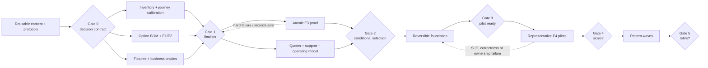

# API Management Studies repository roadmap

## Purpose

This roadmap matures the repository from a structured discovery baseline into a repeatable, decision-grade API management study system. It governs the assessment content, evidence model, PoCs, portal, and executive decision package.

It complements the [assessment-to-decommission delivery roadmap](36-implementation-roadmap.md). This roadmap governs the evidence system; the delivery roadmap governs organizational mobilization, platform establishment, migration, and decommissioning.

## Roadmap principles

1. Close decision-changing unknowns before expanding content volume.
2. Preserve a vendor-neutral logical architecture and candidate-specific physical views.
3. Apply equivalent evidence standards and test scenarios to every finalist.
4. Generate charts and presentation views from canonical repository data.
5. Keep product facts versioned, dated, attributable, and easy to revalidate.
6. Treat economics, staffing, support, migration, and exit as selection evidence.
7. Publish no final ranking below the approved evidence threshold.
8. Treat portal generation and deployment as technical publication controls, not proof of study maturity.
9. Place canonical diagrams and charts inside the studies whose arguments they support; the Visual Atlas remains a secondary index.
10. Apply the [principal content review](../reports/content-research-principal-review.md) and [remediation backlog](../reports/content-remediation-backlog.csv) as release-governance inputs.

## Phased plan

| Phase | Status | Primary outcome | Core deliverables | Exit gate |
|---|---|---|---|---|
| 0. Technical publication baseline | Complete | Searchable, reproducible publication shell | Sanitized public repository, GitHub Pages portal, source manifest, validation workflow, Mermaid gallery, six audience briefings, presentation mode | Main branch and Pages deployment pass technical validation; no editorial or decision-maturity claim is implied |
| 1. Principal content baseline | Implemented; independent acceptance open | Substantive, contract-governed public study corpus | Principal-study standard and template, 39 deep studies, reference case and public failure casebook, symmetric dossiers, point-of-use figures, decision-grade protocols, machine-readable remediation workflow | Repository validators and independent principal review pass; material PCR findings are disposed with committed closure evidence—not merely marked complete |
| 2. Gate-0 decision contract and calibration | Next | Organization-approved decision rules and representative inputs | Accountable sponsor/decision owner, scope/non-goals, bounded option catalog, Gate-1 resolution fields, mandatory gates, common-evidence/bounds/regret rules, calibrated journeys/inventory, evidence calendar, dissent and exception rights | Gate-0 ADR accepted; owners, capacity, representative inputs, evidence thresholds and stop rules are explicit |
| 3. Option resolution and symmetric E1/E2 | Planned | Comparable, exact deployable option records | Edition/version/topology/region/entitlement/support bills of materials, source-to-criterion-to-option mapping, equivalent physical views, vendor answers, mandatory dispositions, source promotion/freshness | Every finalist candidate is an exact option; equivalent category coverage and mandatory-gate evidence support a down-select or removal |
| 4. E3 proof, economics and operating model | Planned | Repeatable comparative behavior and fully allocated decision inputs | Equivalent environments and atomic protocols; security, failure, performance, portal, observability and migration result bundles; actual quotes; staffing/on-call/support/exit model; common-evidence, bounds, regret and sensitivity analysis | Gate 2 selects conditionally, requests targeted evidence or stops; no hard scenario is averaged into a preference score |
| 5. Foundation, E4 pilots and scale decision | Planned | Production evidence for supported patterns and accountable operations | Reversible foundation, identity/network/PKI, APIops, telemetry, support and recovery; gateway- and integration-dominant pilots; measured SLO, incident, rollback, reconciliation, toil and cost | Gates 3 and 4 accept supported patterns and funded ownership or recycle/stop the affected path |
| 6. Migration, decommission and living evidence | Planned; publication automation ongoing | Reusable study system tied to accepted responsibility retirement | Pattern waves, dependency-zero/decommission evidence, source revalidation, version drift, result archive, decision history, release notes, comparison deltas and reusable presentations | Each release records evidence delta and decision impact; retirement closes traffic, technical, operational, recovery, records and commercial obligations |

**Figure REPO-ROAD-1 — Repository maturity is an input to, not a substitute for, decision evidence.**

- **Depicted scope:** seven repository/evidence-system phases from technical publication through content acceptance, organization decision gates, E3/E4 proof, migration and living evidence.
- **Excluded scope:** organization-specific calendar, effort, product result, score, funding, named ownership and proof that a planned phase has started.
- **Diagram source, evidence state and as-of:** the preceding phased-plan table; repository implementation status plus planned decision work; 2026-08-17.
- **Accessible equivalent:** Phase 0 is complete; Phase 1 is implemented with independent acceptance open; Phase 2 is next; Phases 3–6 remain planned, with publication automation continuing inside Phase 6.

```mermaid
flowchart LR
  P0["0 · Publication baseline<br/>Complete"] --> P1["1 · Principal content baseline<br/>Implemented · review open"] --> P2["2 · Gate-0 contract + calibration<br/>Next"] --> P3["3 · Resolved options + E1/E2<br/>Planned"] --> P4["4 · E3 + economics + operations<br/>Planned"] --> P5["5 · Foundation + E4 pilots<br/>Planned"] --> P6["6 · Migration + living evidence<br/>Planned / ongoing"]
  classDef complete fill:#dce8df,stroke:#315a43,color:#152219
  classDef next fill:#f2dfd8,stroke:#8f341f,color:#35150d
  classDef planned fill:#f1eee5,stroke:#77736a,color:#2a2925
  class P0 complete
  class P2 next
  class P1,P3,P4,P5,P6 planned
```

**Figure interpretation:** the publication shell and principal content baseline exist, but independent acceptance and organization evidence remain open. Content volume cannot skip Gate 0, exact-option resolution, E3 proof or E4 pilots; “implemented” describes repository state, not decision confidence.

**Figure limitation:** phase order expresses evidence dependencies, not a promise that work is strictly sequential or that any product will advance; actual gates require accountable acceptance and committed artifacts.

## Integrated dependency-aware critical path

The repository and delivery roadmaps now use one gate sequence. The repository can prepare reusable methods, protocols and evidence structures ahead of organizational mobilization, but it cannot promise a Gate-2 date. **Elapsed time** below is a scenario calendar range after prerequisites are available. **Effort** is tracked separately as role pool × allocation × elapsed time in the capacity-loaded action register; this public roadmap invents no person-week commitment. Parallel work reduces elapsed time only when it has distinct capacity and stable inputs.

| Gate / release | Earliest start condition | Scenario elapsed range, not effort | Required exit evidence | Steering decision |
|---|---|---:|---|---|
| Content baseline acceptance | Principal corpus and validators implemented | Repository release; no organization-clock claim | Independent review disposition, figure/source/link/accessibility checks, committed backlog closure evidence | Accept the reusable evidence system or return specific PCR items |
| 0. Decision contract | Sponsor, decision owner and decision forum available | 4–6 weeks from mobilization | Scope/non-goals, bounded option schema, calibrated reference inputs, mandatory and uncertainty rules, owners/capacity, public/restricted boundary, exception/dissent process | Authorize organization-specific evidence closure |
| 1. Evidence-led down-select | Gate 0 plus vendor access and option-resolution owners | 7–10 weeks cumulative in the planning case; external prerequisites may extend it | Equivalent E1/E2 category coverage, exact option bills of materials, physical views, mandatory dispositions, counter-hypotheses and approved finalist set | Fund symmetric E3 proof or remove/hold an option |
| 2. Conditional selection | Gate 1 plus representative environments, fixtures, commercial and support inputs | 12–20 weeks cumulative in the planning case; not a 90-day promise | Atomic E3 results, hard-gate dispositions, quote-based TCO/support/exit model, common-evidence score, bounds, maximum regret, sensitivity, risks and independent review | Select with enforceable conditions, extend targeted evidence or stop |
| 3. Pilot readiness | Gate 2 plus production controls and accountable service ownership | 8–16 additional weeks, partly parallel where reversible | Production architecture, identity/network/PKI, APIops/telemetry, runbooks, on-call, recovery/rollback exercise and admission controls | Admit bounded E4 pilots or recycle foundation work |
| 4. Scale decision | Gate 3 plus representative gateway- and integration-dominant pilots | 8–16 additional weeks | Measured SLO, business correctness, incident, rollback, reconciliation, toil, support and cost outcomes | Accept supported patterns, redesign or stop scale-up |
| 5. Decommission | Accepted patterns, dependency graph and funded migration waves | 2–6 quarters plus 1–2 quarters after final cutover in the scenario model | Dependency/traffic zero, observation window, owner attestations, records, credentials, support and commercial closure | Retire the bounded legacy responsibility or keep it explicitly open |

These ranges reconcile to the [delivery roadmap](36-implementation-roadmap.md). Its 6–16-week identity/network/environment and golden-corpus prerequisites can extend the critical path; they are not hidden inside a content schedule. Use the [assessment action register](../templates/assessment-action-register-template.csv) to capacity-load work and record dependencies, target dates, status, exit evidence and approver without publishing named-person mappings.

**Figure REPO-ROAD-2 — Four independent evidence inputs converge before finalist proof and production authorization.**

- **Depicted scope:** content/protocol reuse, Gate 0, inventory/calibration, option resolution, fixtures, E3/TCO convergence, conditional selection, foundation, E4 pilots, migration waves and decommission gates.
- **Excluded scope:** approved dates, effort, candidate count, procurement sequence, detailed infrastructure tasks and any claim that a gate has passed.
- **Diagram source, evidence state and as-of:** the integrated critical-path table and delivery-roadmap dependencies; planning interpretation with scenario elapsed ranges; 2026-08-17.
- **Accessible equivalent:** Gate 0 releases inventory, option and fixture work; all feed Gate 1. E3 proof and commercial/operating evidence feed Gate 2. Foundation feeds pilot readiness, E4 evidence feeds scale, and accepted waves feed decommission; hard failures recycle to the responsible earlier gate.

**Figure interpretation:** inventory, exact-option resolution, test fixtures and commercial/operating evidence have independent owners but converge at explicit gates. The critical path is whichever prerequisite closes last; repository publication is an input, never a shortcut around evidence or service ownership.

**Figure limitation:** the dependency view intentionally omits capacity-loaded tasks and organization lead-time distributions; it cannot be converted into a date by summing node labels.

## Next execution packets

### Packet A: accept the reusable content system

- Independently review the principal-study corpus, protocols, figure contracts, source boundaries, navigation and presentations.
- Dispose material PCR items only with committed closure evidence and independent reviewer acceptance.
- Keep contextual official citations outside scoring until promoted into the authoritative source/finding chain.
- Publish a release delta that states what changed, what evidence level moved and what remains unobserved.

### Packet B: mobilize Gate 0

- Name the accountable sponsor, decision owner, evidence reviewers and restricted named-person map.
- Calibrate RE-1 journeys, traffic, identity, network, data authority, recovery, inventory, staffing and economic inputs against observed organization evidence.
- Approve bounded options, Gate-1 resolution fields, mandatory gates, category weights, common-evidence/bounds/regret rules, exceptions, dissent and stop conditions.
- Capacity-load the action register and book vendor access, representative environments and cross-functional reviewers.

### Packet C: close Gate 1 before E3 execution

- Resolve edition, version, topology, region, entitlement, support and commercial boundaries for every candidate that may be scored.
- Complete equivalent E1/E2 category coverage and mandatory dispositions without transferring evidence between archetypes.
- Freeze atomic workloads, business oracles, failure injections, validity/abort rules and immutable result bundles.
- Authorize only the number of E3 finalists that can receive equivalent engineering and independent review.

## Repository workstreams

| Workstream | Canonical assets | Next capability |
|---|---|---|
| Decision governance | `adr/`, assumptions, risks, open questions | Named ownership, due dates, approval state, and decision calendar |
| Requirements and scoring | `decision-matrix/` | Populated exact-option evidence ledger, common-evidence/category coverage, full-weight bounds, maximum regret, sensitivity and dissent report |
| Research | `research/` | Decision-bearing source promotion, criterion linkage, freshness monitoring, entitlement/version tracking and archived evidence references |
| Content architecture and editorial assurance | [Principal content review](../reports/content-research-principal-review.md), [remediation backlog](../reports/content-remediation-backlog.csv), `docs/`, `research/`, `reports/` | Independent acceptance of the implemented principal-study/figure contract and PCR closure with committed evidence |
| Architecture | `architecture/`, target and transition documents | Vendor-neutral logical model plus candidate physical topologies and verified data flows |
| PoC and pilots | `poc/`, `templates/poc-result-template.md` | Equivalent execution of the 28 atomic protocol cases, hard-gate dispositions, durable result artifacts and automated evidence summaries |
| Economics and operating model | operating-model and commercial criteria | Quote-based TCO, resource model, support RACI, benefits, and exit cost |
| Portal and presentation | `site/`, `scripts/build_site.py`, `docs/40-audience-guide.md` | Decision-readiness visualizations driven by populated scorecards and evidence coverage |
| Repository engineering | workflows and validation scripts | Schema validation, source freshness checks, accessibility tests, visual regression, and release automation |

## Prioritized product backlog

### Now

- Independent principal acceptance of the implemented study corpus, protocols, figure contracts, source boundary, site and presentation; close PCR items only with committed evidence.
- Gate-0 owner, decision-right, scope, calibrated reference-case, capacity and evidence-calendar approval.
- Approve the methodology ADR, mandatory/category thresholds, common-evidence, bounds, maximum-regret, exception and dissent rules.
- Promote every decision-bearing contextual citation into the authoritative source/finding chain; keep unpromoted citations explicitly non-scoring.
- Resolve exact edition, version, topology, region, entitlement, plugin, support and commercial fields for each option that may reach Gate 1.
- Reconcile observed journey, workload, identity, network, data-authority, recovery, inventory, staffing and economic inputs with RE-1.

### Next

- Equivalent E1/E2 screen and mandatory dispositions across resolved options.
- Execute the hard-gated 28-case E3 protocol set for approved finalists and preserve immutable comparative result bundles.
- Automate common-evidence/category coverage, bounds, maximum-regret and sensitivity views without making missing values look observed.
- Populate quote-based TCO, staffing/on-call, support, migration and exit models.
- Run source freshness/liveness checks and independent result review before conditional-selection publication.
- Risk heatmap using approved likelihood and impact scales.
- Decision-deck scenes driven by scorecard, TCO, and risk data.

### Later

- Production foundation and representative E4 pilot evidence after Gate 2.
- Versioned assessment releases and evidence-delta reports.
- Archived PoC/pilot result catalog with sanitized artifacts.
- Automated static exports for offline presentation and review.
- Contributor guidance for adding new products without weakening comparative rigor.
- Historical comparison views that show why conclusions changed over time.

## Roadmap governance

- Review this roadmap at each assessment gate and repository release.
- Record roadmap decisions in ADRs rather than silently changing evaluation rules.
- Mark work complete only when its public exit evidence is committed and reviewable, or its sensitive evidence is access-controlled and represented publicly by a sanitized reference or checksum.
- Keep the current decision state visible in the portal; activity counts must not substitute for evidence coverage.
- Portal completion, route coverage, presentation quality, and rendered figure counts never substitute for article maturity or accepted evidence.
- Re-run the [content and research principal review](../reports/content-research-principal-review.md) and [methodology review](../reports/methodology-review.md) before issuing a conditional selection and again before Gate 4 authorizes migration at scale.
