# API Management Studies repository roadmap

## Purpose

This roadmap matures the repository from a structured discovery baseline into a repeatable, decision-grade API management study system. It governs the assessment content, evidence model, PoCs, portal, and executive decision package.

It complements the [assessment-to-decommission delivery roadmap](36-implementation-roadmap.md). This roadmap governs the evidence system; the delivery roadmap governs organizational mobilization, platform establishment, migration, and decommissioning.

## Roadmap principles

1. Close decision-changing unknowns before expanding content volume.
2. Preserve a vendor-neutral logical architecture and candidate-specific physical views.
3. Apply equivalent evidence standards and test scenarios to every finalist.
4. Generate charts and presentation views from canonical repository data.
5. Keep product facts versioned, dated, attributable, and easy to revalidate.
6. Treat economics, staffing, support, migration, and exit as selection evidence.
7. Publish no final ranking below the approved evidence threshold.
8. Treat portal generation and deployment as technical publication controls, not proof of study maturity.
9. Place canonical diagrams and charts inside the studies whose arguments they support; the Visual Atlas remains a secondary index.
10. Apply the [principal content review](../reports/content-research-principal-review.md) and [remediation backlog](../reports/content-remediation-backlog.csv) as release-governance inputs.

## Phased plan

| Phase | Status | Primary outcome | Core deliverables | Exit gate |
|---|---|---|---|---|
| 0. Technical publication baseline | Complete | Searchable, reproducible publication shell | Sanitized public repository, GitHub Pages portal, source manifest, validation workflow, Mermaid gallery, six audience briefings, presentation mode | Main branch and Pages deployment pass technical validation; no editorial or decision-maturity claim is implied |
| 1. Decision and content contract | Next | Approved decision rules and editorial quality contract | Sponsor and decision owner, confirmed scope/non-goals, approved gates/weights/coverage threshold, content reclassification under the governed PCR-001 taxonomy, required metadata, evidence and inline-figure quality gates, dissent process | Methodology ADR accepted and every published asset has a governed content type and maturity state |
| 2. Evidence ledger and anchor studies | Planned | Solution-option traceability and substantive public research core | Source-to-criterion-to-solution-option map with component/variant lineage, version/topology fields, evidence owners, freshness and limitations, assumption closure, automated coverage dashboard, anchor studies, canonical inline diagrams/charts with provenance and interpretation | Every criterion and solution option has an evidence plan; anchor studies pass editorial/evidence review; decision-critical assumptions have disposition |
| 3. Symmetric dossiers and comparative proof | Planned | Equivalent E1–E3 treatment of end-to-end solution options | Symmetric solution-option dossiers and physical views with component/variant lineage, vendor responses, entitlement map, equivalent PoC environments, security/identity/PKI, disconnected-operation, API operations, performance, resilience, observability, developer-journey, and migration experiments | Dossiers meet the same article quality gate; mandatory criteria have comparable option-level evidence; no unmitigated critical test finding |
| 4. Economics and operating model | Planned | Decision-grade cost and support model | Actual quotes, infrastructure model, staffing/on-call demand, upgrade/support boundaries, migration effort, exit cost, service ownership, RACI, benefits baseline | Commercial, architecture, operations, and program owners approve inputs |
| 5. Decision assurance and independent review | Planned | Defensible conditional selection and publication | Populated end-to-end solution-option scorecards with component/variant lineage, evidence peer review, coverage report, sensitivity analysis, risk-adjusted TCO, dissent log, conditional recommendation, selection ADR, closed content backlog, and final independent principal review | Mandatory gates pass or have approved exceptions; evidence and article quality thresholds are met; independent review findings are disposed; conditional selection ADR accepted |
| 6. Living study platform | Planned | Reusable research and learning system | Scheduled source revalidation, version-drift alerts, reusable PoC result archive, comparison history, release notes, contribution workflow, presentation/PDF snapshots | Each release records evidence delta, decision impact, and next review date |

```mermaid
flowchart LR
  P0["0 · Technical publication baseline<br/>Complete"] --> P1["1 · Decision + content contract<br/>Next"] --> P2["2 · Ledger + anchor studies<br/>Planned"] --> P3["3 · Symmetric dossiers + proof<br/>Planned"] --> P4["4 · Economics + operating model<br/>Planned"] --> P5["5 · Assurance + independent review<br/>Planned"] --> P6["6 · Living study platform<br/>Planned"]
  classDef complete fill:#dce8df,stroke:#315a43,color:#152219
  classDef next fill:#f2dfd8,stroke:#8f341f,color:#35150d
  classDef planned fill:#f1eee5,stroke:#77736a,color:#2a2925
  class P0 complete
  class P1 next
  class P2,P3,P4,P5,P6 planned
```

## Assessment decision gates

| Gate | Indicative window | Accountable role | Required exit evidence | Steering decision |
|---|---:|---|---|---|
| 0. Decision contract | Days 0–30 | Executive sponsor and decision owner | Scope/non-goals, roles, approved mandatory gates and weights, evidence threshold, public/restricted boundary, exception and dissent process | Authorize evidence closure |
| 1. Evidence-led down-select | Days 31–60 | Decision owner | E1/E2 screen across the approved end-to-end solution-option catalog, criterion/option evidence plan with component/variant lineage, organization assumptions, comparable topology and entitlement facts, approved finalist set | Fund symmetric finalist proof or remove a solution option |
| 2. Conditional-selection readiness | Days 61–90 | Decision owner | E3 finalist solution-option PoCs, gate dispositions, TCO/support model, sensitivity, ranked risks, independent evidence review, recommendation conditions and exit path | Select an end-to-end option with conditions and fund foundation, extend targeted evidence, or stop |

The windows start only when accountable roles, vendor access, environments, and organization inputs are available. Use the [assessment action register](../templates/assessment-action-register-template.csv) to add capacity, dependencies, target dates, status, exit evidence, and approver without publishing named-person mappings.

## First 90 days

The timing below is indicative and starts when owners and environments are available.

### Days 0–30: establish decision control

- Accept the [principal content review](../reports/content-research-principal-review.md) as the editorial baseline and triage its [machine-readable backlog](../reports/content-remediation-backlog.csv).
- Reclassify every asset under the governed PCR-001 taxonomy; add audience, maturity, owner role, evidence date, review date, and canonical-figure metadata.
- Approve the article quality gate: decision question, evidence-at-point-of-claim, counterargument, limitations, decision implication, and inline canonical figures where they materially support the argument.
- Assign accountable public roles or anonymized owner IDs for assumptions, risks, open questions, evidence, and acceptance decisions; keep the named-person map restricted.
- Confirm the organizational context in [current-state assumptions](02-current-state-assumptions.md).
- Review and approve the 30 mandatory gates, category weights, and evidence-coverage threshold.
- Confirm the vendor-neutral logical target architecture and build equivalently framed candidate topology views from official evidence.
- Add an evidence-ledger dataset keyed by criterion ID and end-to-end solution-option ID while preserving component and deployment-variant lineage.
- Accept or revise the proposed methodology and architecture-principle ADRs.

### Days 31–60: balance research and prepare proof

- Complete the anchor studies that define the market landscape and decision archetypes, hybrid deployment alternatives, gateway-versus-integration boundary, and operating/economic model.
- Rewrite solution-option dossiers to an equivalent structure and depth; preserve component/variant evidence and embed canonical candidate, security, network, observability, API operations, resilience, and migration figures in the articles that interpret them.
- Map official sources and vendor confirmations to all decision-critical criteria.
- Close unsupported or stale findings and record product version, tier, topology, and entitlement.
- Freeze equivalent PoC workloads, policy chains, load profiles, failure scenarios, and evidence templates.
- Prepare finalist solution-option environments and the organization-specific identity, PKI, network, SIEM/APM, and test-data controls.
- Establish the TCO and staffing model with quote, infrastructure, support, migration, and exit inputs.
- Add likelihood, impact, residual exposure, status, and due date to the risk register.

### Days 61–90: execute and synthesize

- Run equivalent comparative security, disconnected-control-plane, API operations, developer-journey, performance, resilience, observability, and migration experiments for approved finalist solution options.
- Capture sanitized evidence using the [PoC result template](../templates/poc-result-template.md).
- Populate end-to-end solution-option scorecards from the ledger, retain component/variant lineage, and conduct independent evidence review.
- Calculate evidence coverage and run category-weight sensitivity at ±20 percent.
- Produce the conditional-selection pack: recommendation, alternative, trade-offs, conditions, exceptions, TCO, risks, implementation implications, and explicit steering ask.
- Run a final independent principal review of the content, evidence chain, comparative integrity, figures, recommendation, and audience narratives; dispose its material findings before publication.
- Decide whether evidence supports selection, another targeted evidence sprint, or removal of a candidate.

## Repository workstreams

| Workstream | Canonical assets | Next capability |
|---|---|---|
| Decision governance | `adr/`, assumptions, risks, open questions | Named ownership, due dates, approval state, and decision calendar |
| Requirements and scoring | `decision-matrix/` | Populated per-solution-option evidence ledger with component/variant lineage, coverage calculation, and sensitivity report |
| Research | `research/` | Criterion linkage, freshness monitoring, entitlement/version tracking, and archived evidence references |
| Content architecture and editorial assurance | [Principal content review](../reports/content-research-principal-review.md), [remediation backlog](../reports/content-remediation-backlog.csv), `docs/`, `research/`, `reports/` | Governed content types, anchor studies, article metadata, evidence-at-point-of-claim, canonical inline figures, quality gates, and independent review |
| Architecture | `architecture/`, target and transition documents | Vendor-neutral logical model plus candidate physical topologies and verified data flows |
| PoC and pilots | `poc/`, `templates/poc-result-template.md` | Equivalent multi-candidate execution, durable result artifacts, and automated evidence summaries |
| Economics and operating model | operating-model and commercial criteria | Quote-based TCO, resource model, support RACI, benefits, and exit cost |
| Portal and presentation | `site/`, `scripts/build_site.py`, `docs/40-audience-guide.md` | Decision-readiness visualizations driven by populated scorecards and evidence coverage |
| Repository engineering | workflows and validation scripts | Schema validation, source freshness checks, accessibility tests, visual regression, and release automation |

## Prioritized product backlog

### Now

- Content reclassification, article metadata schema, and publication quality gate from the [principal content review](../reports/content-research-principal-review.md).
- Anchor studies and symmetric dossier templates, with canonical diagrams/charts embedded inside the arguments they support.
- Evidence ledger schema and validator.
- Accountable-role/due-gate fields for assumptions, questions, risks, and actions, with private named-person mapping.
- Equivalent candidate topology views with ownership, data flows, persistence, locality, support boundary, assumptions, and required evidence.
- Approved methodology ADR and coverage threshold.
- E1/E2 screen across the approved solution-option catalog followed by a symmetric finalist PoC plan with component/variant lineage.

### Next

- Equivalent multi-candidate experiment contracts and durable comparative result records.
- Final independent principal content/evidence review before conditional-selection publication.
- Scorecard coverage and sensitivity automation.
- TCO/resource-model templates with validation.
- Evidence freshness and broken-source checks.
- Risk heatmap using approved likelihood and impact scales.
- Decision-deck scenes driven by scorecard, TCO, and risk data.

### Later

- Versioned assessment releases and evidence-delta reports.
- Archived PoC/pilot result catalog with sanitized artifacts.
- Automated static exports for offline presentation and review.
- Contributor guidance for adding new products without weakening comparative rigor.
- Historical comparison views that show why conclusions changed over time.

## Roadmap governance

- Review this roadmap at each assessment gate and repository release.
- Record roadmap decisions in ADRs rather than silently changing evaluation rules.
- Mark work complete only when its public exit evidence is committed and reviewable, or its sensitive evidence is access-controlled and represented publicly by a sanitized reference or checksum.
- Keep the current decision state visible in the portal; activity counts must not substitute for evidence coverage.
- Portal completion, route coverage, presentation quality, and rendered figure counts never substitute for article maturity or accepted evidence.
- Re-run the [content and research principal review](../reports/content-research-principal-review.md) and [methodology review](../reports/methodology-review.md) before issuing a conditional selection and again before Gate 4 authorizes migration at scale.
