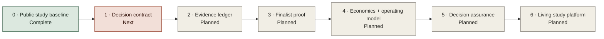

# API Management Studies repository roadmap

## Purpose

This roadmap matures the repository from a structured discovery baseline into a repeatable, decision-grade API management study system. It governs the assessment content, evidence model, PoCs, portal, and executive decision package.

It complements the [assessment-to-decommission delivery roadmap](36-implementation-roadmap.md). This roadmap governs the evidence system; the delivery roadmap governs organizational mobilization, platform establishment, migration, and decommissioning.

## Roadmap principles

1. Close decision-changing unknowns before expanding content volume.
2. Preserve a vendor-neutral logical architecture and candidate-specific physical views.
3. Apply equivalent evidence standards and test scenarios to every finalist.
4. Generate charts and presentation views from canonical repository data.
5. Keep product facts versioned, dated, attributable, and easy to revalidate.
6. Treat economics, staffing, support, migration, and exit as selection evidence.
7. Publish no final ranking below the approved evidence threshold.

## Phased plan

| Phase | Status | Primary outcome | Core deliverables | Exit gate |
|---|---|---|---|---|
| 0. Public study baseline | Complete | Searchable, reproducible study hub | Sanitized public repository, GitHub Pages portal, source manifest, validation workflow, Mermaid gallery, six audience briefings, presentation mode | Main branch and Pages deployment pass validation |
| 1. Decision contract | Next | Approved rules for making the decision | Named sponsor and decision owner, confirmed scope/non-goals, approved mandatory gates, weights, coverage threshold, decision calendar, dissent process | Steering approval recorded in an accepted methodology ADR |
| 2. Evidence ledger | Planned | Criterion-level traceability | Source-to-criterion map, version/topology fields, evidence owners, freshness dates, limitation records, assumption closure, automated coverage dashboard | Every criterion has an owner and evidence plan; decision-critical assumptions have disposition |
| 3. Finalist proof | Planned | Equivalent E2/E3 evidence for exact variants | Vendor responses, entitlement map, symmetric PoC environments, security/identity/PKI tests, disconnected-operation tests, API operations, performance, resilience, observability, and migration evidence | All mandatory gates have evidence; no unmitigated critical test finding |
| 4. Economics and operating model | Planned | Decision-grade cost and support model | Actual quotes, infrastructure model, staffing/on-call demand, upgrade/support boundaries, migration effort, exit cost, service ownership, RACI, benefits baseline | Commercial, architecture, operations, and program owners approve inputs |
| 5. Decision assurance | Planned | Defensible conditional selection | Seven populated variant scorecards, evidence peer review, coverage report, sensitivity analysis, risk-adjusted TCO, dissent log, conditional recommendation, selection ADR | Mandatory gates pass or have approved exceptions; coverage threshold met; conditional selection ADR accepted |
| 6. Living study platform | Planned | Reusable research and learning system | Scheduled source revalidation, version-drift alerts, reusable PoC result archive, comparison history, release notes, contribution workflow, presentation/PDF snapshots | Each release records evidence delta, decision impact, and next review date |

## Assessment decision gates

| Gate | Indicative window | Accountable role | Required exit evidence | Steering decision |
|---|---:|---|---|---|
| 0. Decision contract | Days 0–30 | Executive sponsor and decision owner | Scope/non-goals, roles, approved mandatory gates and weights, evidence threshold, public/restricted boundary, exception and dissent process | Authorize evidence closure |
| 1. Evidence-led down-select | Days 31–60 | Decision owner | E1/E2 screen across all seven variants, criterion/variant evidence plan, organization assumptions, comparable topology and entitlement facts, approved finalist set | Fund symmetric finalist proof or remove a candidate |
| 2. Conditional-selection readiness | Days 61–90 | Decision owner | E3 finalist PoCs, gate dispositions, TCO/support model, sensitivity, ranked risks, independent evidence review, recommendation conditions and exit path | Select with conditions and fund foundation, extend targeted evidence, or stop |

The windows start only when accountable roles, vendor access, environments, and organization inputs are available. Use the [assessment action register](../templates/assessment-action-register-template.csv) to add capacity, dependencies, target dates, status, exit evidence, and approver without publishing named-person mappings.

## First 90 days

The timing below is indicative and starts when owners and environments are available.

### Days 0–30: establish decision control

- Assign accountable public roles or anonymized owner IDs for assumptions, risks, open questions, evidence, and acceptance decisions; keep the named-person map restricted.
- Confirm the organizational context in [current-state assumptions](02-current-state-assumptions.md).
- Review and approve the 30 mandatory gates, category weights, and evidence-coverage threshold.
- Confirm the vendor-neutral logical target architecture and build equivalently framed candidate topology views from official evidence.
- Add an evidence-ledger dataset keyed by criterion ID and exact deployment variant.
- Accept or revise the proposed methodology and architecture-principle ADRs.

### Days 31–60: balance research and prepare proof

- Map official sources and vendor confirmations to all decision-critical criteria.
- Close unsupported or stale findings and record product version, tier, topology, and entitlement.
- Freeze equivalent PoC workloads, policy chains, load profiles, failure scenarios, and evidence templates.
- Prepare finalist environments and the organization-specific identity, PKI, network, SIEM/APM, and test-data controls.
- Establish the TCO and staffing model with quote, infrastructure, support, migration, and exit inputs.
- Add likelihood, impact, residual exposure, status, and due date to the risk register.

### Days 61–90: execute and synthesize

- Run the priority security, disconnected-control-plane, API operations, performance, resilience, observability, and migration scenarios.
- Capture sanitized evidence using the [PoC result template](../templates/poc-result-template.md).
- Populate exact-variant scorecards and conduct independent evidence review.
- Calculate evidence coverage and run category-weight sensitivity at ±20 percent.
- Produce the conditional-selection pack: recommendation, alternative, trade-offs, conditions, exceptions, TCO, risks, implementation implications, and explicit steering ask.
- Decide whether evidence supports selection, another targeted evidence sprint, or removal of a candidate.

## Repository workstreams

| Workstream | Canonical assets | Next capability |
|---|---|---|
| Decision governance | `adr/`, assumptions, risks, open questions | Named ownership, due dates, approval state, and decision calendar |
| Requirements and scoring | `decision-matrix/` | Populated per-variant evidence ledger, coverage calculation, and sensitivity report |
| Research | `research/` | Criterion linkage, freshness monitoring, entitlement/version tracking, and archived evidence references |
| Architecture | `architecture/`, target and transition documents | Vendor-neutral logical model plus candidate physical topologies and verified data flows |
| PoC and pilots | `poc/`, `templates/poc-result-template.md` | Equivalent multi-candidate execution, durable result artifacts, and automated evidence summaries |
| Economics and operating model | operating-model and commercial criteria | Quote-based TCO, resource model, support RACI, benefits, and exit cost |
| Portal and presentation | `site/`, `scripts/build_site.py`, `docs/40-audience-guide.md` | Decision-readiness visualizations driven by populated scorecards and evidence coverage |
| Repository engineering | workflows and validation scripts | Schema validation, source freshness checks, accessibility tests, visual regression, and release automation |

## Prioritized product backlog

### Now

- Evidence ledger schema and validator.
- Accountable-role/due-gate fields for assumptions, questions, risks, and actions, with private named-person mapping.
- Equivalent candidate topology views with ownership, data flows, persistence, locality, support boundary, assumptions, and required evidence.
- Approved methodology ADR and coverage threshold.
- E1/E2 screen across all variants followed by a symmetric approved-finalist PoC plan.

### Next

- Scorecard coverage and sensitivity automation.
- TCO/resource-model templates with validation.
- Evidence freshness and broken-source checks.
- Risk heatmap using approved likelihood and impact scales.
- Decision-deck scenes driven by scorecard, TCO, and risk data.

### Later

- Versioned assessment releases and evidence-delta reports.
- Archived PoC/pilot result catalog with sanitized artifacts.
- Automated static exports for offline presentation and review.
- Contributor guidance for adding new products without weakening comparative rigor.
- Historical comparison views that show why conclusions changed over time.

## Roadmap governance

- Review this roadmap at each assessment gate and repository release.
- Record roadmap decisions in ADRs rather than silently changing evaluation rules.
- Mark work complete only when its public exit evidence is committed and reviewable, or its sensitive evidence is access-controlled and represented publicly by a sanitized reference or checksum.
- Keep the current decision state visible in the portal; activity counts must not substitute for evidence coverage.
- Re-run the [methodology review](../reports/methodology-review.md) before issuing a conditional selection and again before Gate 4 authorizes migration at scale.
