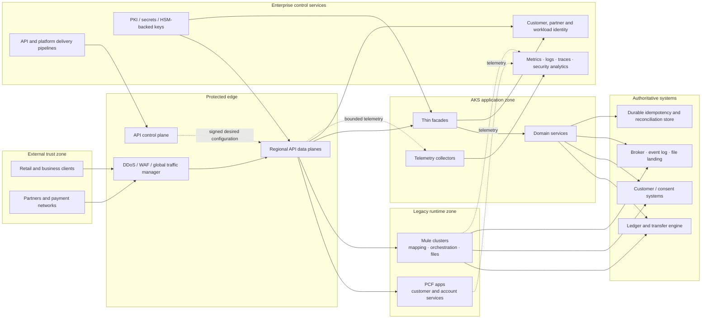
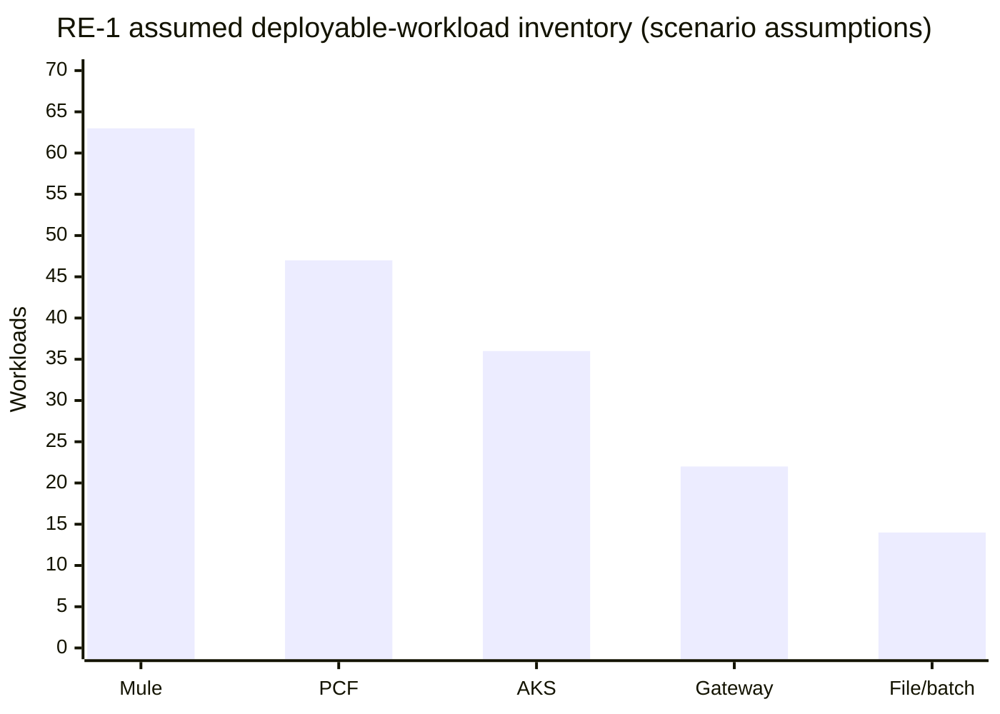
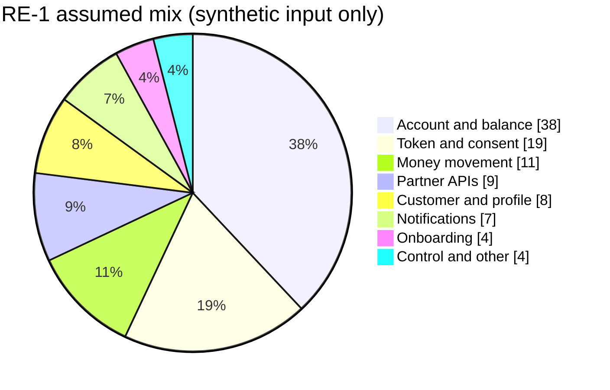
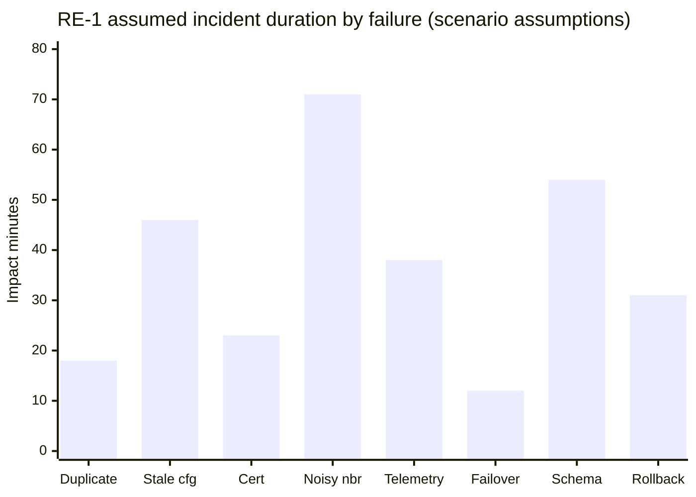
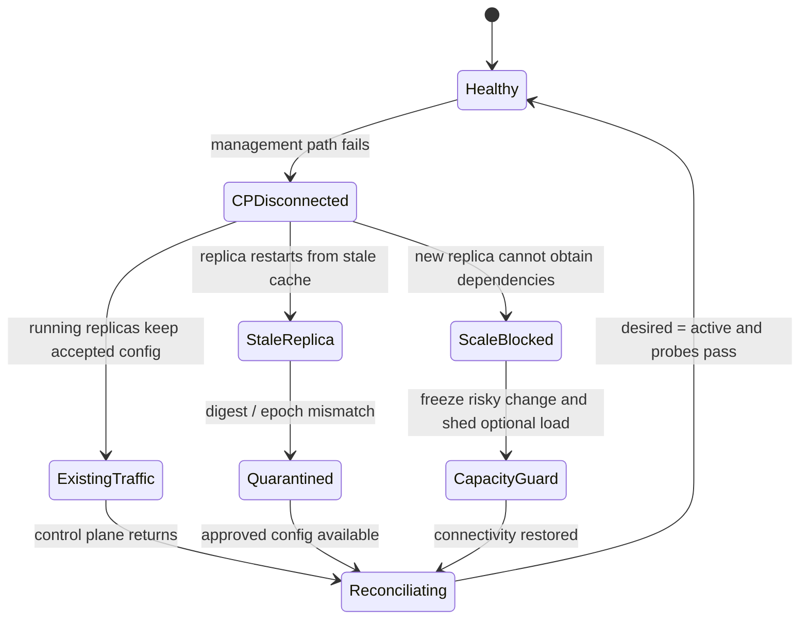
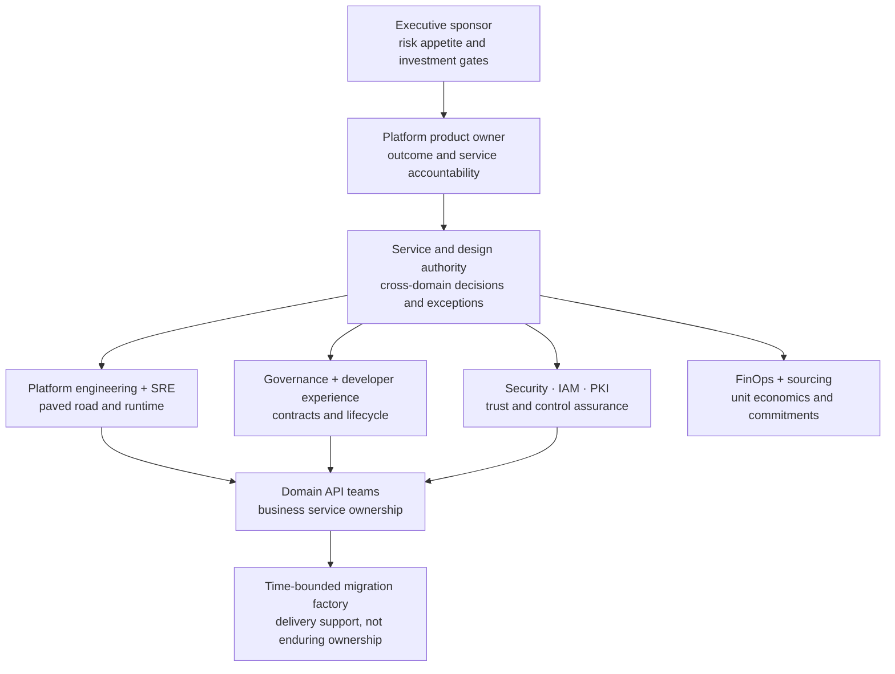
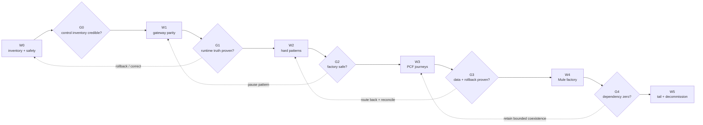
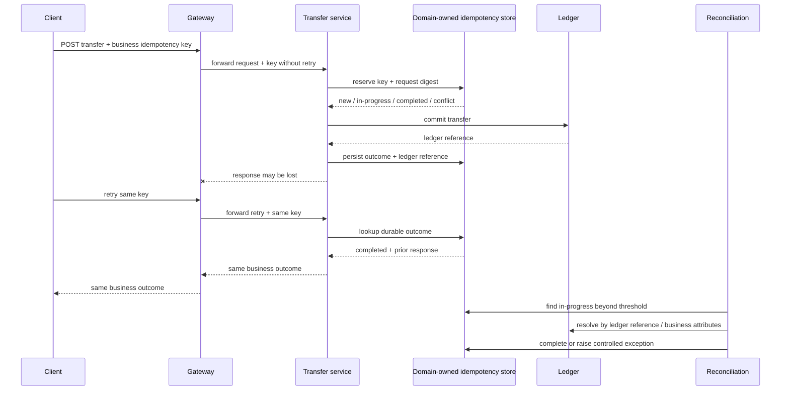

<!-- study-contract: principal -->

# Enterprise reference case: regulated hybrid API estate

| Field | Value |
|---|---|
| Artifact type | principal-study |
| Decision question | Is RE-1 a sufficiently complete, internally coherent scenario to test differentiating API-platform, operating-model, and migration decisions? |
| Decision owner | API-platform assessment decision owner with the service and design authority |
| Primary audiences | Executives, directors, platform and enterprise architects, developers, DevOps, SRE, security, data, operations, sourcing, and FinOps |
| Scope | Synthetic regulated hybrid API estate spanning gateway edge/control plane, identity/PKI, Mule, PCF, AKS, data, brokers/files, telemetry, teams, incidents, service objectives, capacity, cost, migration, rollback and decommission |
| Evidence state | Scenario assumptions plus documented general mechanisms; no current-state or observed candidate evidence |
| Reference case | RE-1; this document is the synthetic reference case |
| As-of date | 2026-08-17; factual source-review metadata, not a scenario assumption |
| Next gate | Assessment design authority accepts or calibrates RE-1 before candidate proof and production-shaped PoCs |

## Provisional answer

RE-1 is sufficiently textured to prevent a feature checklist or happy-path demo from masquerading as an enterprise decision: it joins workload mix, business effects, identity/network constraints, failure history, SLO/RTO/RPO, team ownership, migration, rollback, reconciliation, capacity, and economics. Confidence is high that it exposes the requested hard seams and deliberately **zero** that its invented values describe a real estate. The case can drive hypotheses and symmetric tests only after decision owners calibrate it; treating its values as facts could mis-size a platform, mis-rank candidates, or fund the wrong migration sequence.

## Scenario and assumptions: how to use this case

This is a **synthetic but operationally realistic case**, identified as **RE-1**. It is not a description of any organization. It exists so that platform comparisons, failure tests, migration plans, operating-model decisions, and cost models in this repository can be exercised against the same difficult facts.

> **Quantitative convention:** every count, date, duration, percentage, traffic value, service level, capacity threshold, and monetary amount in this article is a **scenario assumption**. None is observed evidence, an industry benchmark, a vendor claim, a regulatory minimum, or a delivery commitment. Replace the assumptions with measured inventory and telemetry before making a real decision.

The case borrows general control themes from current [OSFI technology and cyber-risk guidance](https://www.osfi-bsif.gc.ca/en/guidance/guidance-library/technology-cyber-risk-management), but the case and its controls do not demonstrate regulatory compliance.

## Executive situation

RE-1 is a deposit-taking and payments enterprise operating a mixed Mule, Cloud Foundry (PCF), and Azure Kubernetes Service (AKS) estate. Its public API hostname is stable, but policy, transformation, orchestration, and state are distributed across gateway appliances, Mule runtimes, PCF applications, AKS services, identity systems, shared caches, and two regional data estates.

The board-level problem is not “which gateway has the most features.” It is whether the enterprise can simplify the estate without creating an unrecoverable money-movement failure, weakening partner identity, centralizing a new operational bottleneck, or hiding cost in integration services and dual running.

The assumed decision outcomes are:

- preserve externally visible contracts and stable hostnames while backends move;
- separate gateway policy from transformation, workflow, messaging, and ledger state;
- survive a data-plane zone loss without breaching critical-journey objectives;
- provide an explicit response to regional loss, control-plane disconnection, stale configuration, certificate rollover, and telemetry backpressure;
- migrate by reversible business journeys, not by product or runtime inventory alone;
- retire Mule and PCF only after traffic, state, schedules, identities, certificates, support ownership, and financial dependencies reach zero.

## Mechanism analysis: estate and trust boundaries

**Figure RE1-1 — The reference case spans trust, runtime, data and control boundaries that can fail independently.**

- **Depicted scope:** external clients/partners, protected edge and regional gateways, API control plane, Mule/PCF legacy runtimes, AKS facades/domain services, authoritative ledger/CRM/broker/idempotency systems, identity/PKI/observability and delivery pipelines.
- **Excluded scope:** product-specific topology, region count and data replication, exact network flows, component sizing, portal/product lifecycle, support ownership and any availability or migration result.
- **Diagram source, evidence state and as-of:** inline architecture for the synthetic RE-1 scenario, informed by the official AKS control/workload separation cited below; scenario model and test boundary, not an observed estate; 2026-08-17.
- **Accessible equivalent:** retail and partner requests cross a protected edge into regional API data planes, which may route to PCF, Mule or AKS/domain services. Those runtimes reach authoritative data and messaging systems. Delivery configures a separate API control plane; identity and PKI support request trust; telemetry from gateway, Mule, PCF and AKS reaches enterprise observability through independent paths.

The diagram deliberately separates management connectivity from request processing. An unavailable control plane might block configuration and new provisioning while existing data-plane replicas continue proxying. That claim must be proven per candidate and per failure mode; it must never be inferred from an “HA” label. AKS itself separates a managed control plane from workload nodes, as described in Microsoft’s [AKS core concepts](https://learn.microsoft.com/en-us/azure/aks/core-aks-concepts).

**Figure interpretation:** RE-1’s risk sits across trust and runtime boundaries rather than inside one gateway box. The dotted management/telemetry paths make partial failure testable; the figure excludes product-specific topology and proves no availability claim.

**Figure limitation:** The figure deliberately abstracts versions, persistence, topology, field-level data movement and operational ownership. It cannot prove that a candidate matches the boundary or survives any failure; exact physical views and execution evidence are required.

## Workload inventory

The inventory unit is a deployable workload plus its triggers, state, consumers, identities, schedules, and dependencies. Counting only API specifications would miss file pollers, VM queues, object-store state, and scheduled reconciliation.

**All values in this table are RE-1 scenario assumptions.** A workload can expose several APIs or implement several responsibilities; therefore the columns are not interchangeable totals.

| Runtime or capability | Deployable workloads | API operations | Stateful or scheduled workloads | Primary hidden coupling |
|---|---:|---:|---:|---|
| Mule customer-hosted runtimes | 63 | 286 | 31 | Object Store keys, VM queues, SFTP locks, connector credentials |
| PCF application spaces | 47 | 214 | 8 | route mappings, user-provided services, platform certificates |
| AKS domain and integration services | 36 | 198 | 12 | Kubernetes Secrets, topics, schemas, database migrations |
| Gateway configuration only | 22 | 82 | 0 | custom plugins, shared rate counters, certificate bindings |
| Managed file, broker, and batch capabilities | 14 | 0 | 14 | schedules, replay offsets, file naming, operational handoffs |
| **Scenario inventory** | **182** | **780** | **65** | **cross-runtime identity, state, and recovery semantics** |

**Chart RE1-2 — Mule and PCF remain substantial assumed populations alongside AKS and gateway workloads.**

- **Depicted scope:** synthetic deployable-workload counts for Mule, PCF, AKS, gateway configuration and managed file/batch capabilities.
- **Excluded scope:** API-operation counts, state/schedule counts, complexity, dependency graph, current utilization, migration effort and observed inventory.
- **Chart source, evidence state and as-of:** values from the immediately preceding RE-1 scenario-inventory table; synthetic assumptions, not enterprise records; 2026-08-17.
- **Accessible equivalent:** Mule 63; PCF 47; AKS 36; Gateway 22; File/batch 14 deployable workloads, totaling 182. The source table also records 780 API operations, 65 stateful/scheduled workloads and hidden coupling by runtime.

**Chart interpretation:** Mule and PCF remain substantial assumed workload populations alongside AKS and gateway configuration, which makes coexistence and state discovery mandatory. Counts are scenario assumptions, not inventory evidence.

**Chart limitation:** Workload count is not a measure of migration difficulty or business consequence and hides shared state, schedules, consumers and support. Observed inventory must replace these values before sizing or sequencing.

### Responsibility decomposition

The assumed Mule inventory contains compound flows. The migration team decomposes each flow before choosing a target:

| Responsibility | Assumed occurrences | Typical target | Migration trap |
|---|---:|---|---|
| Authentication, throttling, routing | 121 | Gateway policy | copying backend orchestration into a plugin |
| Simple facade or canonical response mapping | 74 | Gateway plus thin integration service when needed | treating lossy mapping as “just routing” |
| Complex transformation | 96 | Tested integration service or function | semantic differences in decimal, date, null, and character handling |
| Multi-step orchestration | 53 | Domain or workflow runtime | losing compensation and correlation state |
| Messaging and event handling | 41 | Broker/event platform plus consumers | changing delivery, ordering, or replay semantics |
| Batch, file, and SFTP | 29 | Managed transfer or scheduled job | duplicate pickup after lock ownership changes |
| Connector-heavy adapter | 38 | Adapter, SaaS-native integration, or bounded coexistence | underestimating protocol and vendor-specific behavior |
| Candidate for retirement | 27 | Remove after owner and traffic evidence | deleting an apparent duplicate that is a recovery path |

Occurrences exceed the Mule workload count because one workload can contain several responsibilities.

## Traffic model and critical journeys

**Every traffic value and distribution below is a scenario assumption.** The mix is intentionally uneven: aggregate read traffic can conceal low-volume, high-consequence transfer failures.

| Traffic slice | Share of requests | Assumed steady rate | Assumed peak multiplier | Payload and connection characteristic |
|---|---:|---:|---:|---|
| Account and balance reads | 38% | 1,824 requests/s | 2.4× | small JSON; cacheable only where freshness policy permits |
| Token, consent, and session calls | 19% | 912 requests/s | 3.2× | identity round trips; burst follows login campaigns |
| Money movement | 11% | 528 requests/s | 2.1× | non-idempotent business effect behind POST; no blind retry |
| Partner and open APIs | 9% | 432 requests/s | 4.0× | mTLS plus OAuth; partner-specific quotas and certificates |
| Customer and profile | 8% | 384 requests/s | 2.0× | personally identifiable data; mixed PCF and AKS backends |
| Notification and webhook | 7% | 336 requests/s | 5.5× | outbound fan-out; receiver throttling and replay |
| Onboarding and verification | 4% | 192 requests/s | 2.6× | larger documents; long downstream latency |
| Control, batch, and other | 4% | 192 requests/s | 6.0× | scheduler-driven, file, and administrative bursts |

The assumed platform envelope is 4,800 requests/s at ordinary load, 13,500 requests/s at a busy-hour peak, and 22,000 requests/s during a three-minute burst. The assumed payload distribution is 2 KB at the median, 18 KB at the ninety-fifth percentile, and 1.5 MB at the ninety-ninth percentile; uploads are isolated from ordinary JSON routes. These are load-shape inputs, not achieved results.

**Chart RE1-3 — Aggregate traffic is dominated by reads and identity while lower-volume money movement carries higher consequence.**

- **Depicted scope:** assumed percentage request mix across account/balance, token/consent, money movement, partner, customer/profile, notification, onboarding and control/other traffic.
- **Excluded scope:** absolute rates beyond the adjacent table, peak multipliers, payload/connection characteristics, latency, concurrency, retries, criticality weighting and observed production traffic.
- **Chart source, evidence state and as-of:** values from the immediately preceding RE-1 traffic-slice table; synthetic workload assumption, not telemetry or benchmark; 2026-08-17.
- **Accessible equivalent:** Account/balance 38%; Token/consent 19%; Money movement 11%; Partner 9%; Customer/profile 8%; Notifications 7%; Onboarding 4%; Control/other 4%. The table adds steady rate, peak multiplier and payload/connection characteristics.

**Chart interpretation:** High-volume reads and identity calls dominate aggregate traffic while lower-volume money movement carries greater consequence. Aggregate throughput can therefore conceal a critical-journey failure; shares are scenario assumptions.

**Chart limitation:** A request-share pie does not express arrival shape, duration, payload, resource cost or business severity. It must not be used to allocate capacity or weight decision criteria without the journey and failure models.

### Journey objectives

Availability is measured at the consumer-visible transaction boundary, not at gateway process uptime. Latency budgets are end to end; the gateway receives only an allocated portion.

**All targets and budgets are scenario assumptions.** Error-budget minutes use an assumed thirty-day measurement window.

| Journey ID and name | Good event | Availability objective | End-to-end latency objective | Recovery objective | Data objective |
|---|---|---:|---:|---:|---|
| J-01 — confirmed money transfer | one accepted request produces exactly one durable business outcome and a queryable status | 99.99% | p95 ≤ 800 ms; p99 ≤ 1,800 ms | RTO ≤ 5 min | RPO = 0 after commitment receipt |
| J-02 — account summary | authorized response is correct and within allowed freshness | 99.95% | p95 ≤ 350 ms; p99 ≤ 900 ms | RTO ≤ 15 min | RPO ≤ 2 min for derived cache only |
| J-03 — partner payment initiation | authenticated, policy-compliant acceptance or deterministic rejection | 99.95% | p95 ≤ 1,000 ms | RTO ≤ 15 min | RPO = 0 after acceptance |
| J-04 — digital onboarding | resumable application reaches a durable checkpoint | 99.90% | p95 ≤ 3,000 ms excluding human review | RTO ≤ 4 h | RPO ≤ 15 min before final submission; zero after receipt |
| J-05 — settlement file | every accepted record is processed once or reconciled to an exception | 99.50% within window | complete by assumed cut-off | RTO ≤ 2 h | RPO = 0 for accepted file and processing journal |
| J-06 — platform configuration | approved change reaches intended data planes with attested version | 99.90% | p95 propagation ≤ 5 min | RTO ≤ 60 min | RPO ≤ 15 min for desired-state history |

The SRE response uses multi-window burn-rate alerts rather than a single process-up alarm. The mechanism follows the reasoning in Google’s official [SRE guidance on alerting from SLOs](https://sre.google/workbook/alerting-on-slos/); the actual thresholds above remain case assumptions.

## Identity, network, and cryptographic constraints

| Boundary | RE-1 scenario constraint | Consequence for design and test |
|---|---|---|
| Retail clients | OAuth authorization code with PKCE; short-lived access tokens; step-up for high-risk actions | preserve claims and assurance context across gateway and backend; test key rollover and clock skew |
| Partners | mutual TLS plus OAuth client credentials; several partners pin an intermediate CA | rotate server and client chains with an overlap window; prove old and new trust before removing either |
| Workloads | federated workload identity where supported; static client secrets remain in legacy flows | do not translate every identity to one shared gateway credential; migrate identity and ownership with the flow |
| Operators | enterprise SSO, phishing-resistant MFA, just-in-time privileged role, dual approval for emergency production policy | control-plane outage runbooks need break-glass access that is tested and audited |
| AKS | private API endpoints, default-deny ingress/egress, controlled private DNS, approved egress proxies | new nodes and controllers can fail even while existing traffic flows; test scale-out under partial network loss |
| PCF and Mule | fixed source-IP allowlists and older TLS clients remain for bounded coexistence | preserve egress identity until consumers and firewalls are changed; do not infer compatibility from a successful health check |
| Keys and certificates | HSM-backed issuer keys; leaf certificates delivered through several mechanisms | inventory reload behavior: mounted Secret update, process restart, connection-pool reuse, and partner trust are distinct |

The case applies the security mechanisms described by [OAuth security best current practice](https://www.rfc-editor.org/rfc/rfc9700.html) and [OAuth mutual-TLS client authentication](https://www.rfc-editor.org/rfc/rfc8705.html), but the chosen token lifetime and assurance rules remain scenario decisions. Kubernetes Secret projection is eventually consistent and `subPath` mounts do not receive automated updates, which is why certificate rollover must be observed at the serving process rather than inferred from a Secret update ([Kubernetes Secrets](https://kubernetes.io/docs/concepts/configuration/secret/)).

## Synthetic incident and failure history

The following history is invented to make trade-offs concrete. **Dates, frequency, duration, loss, and impact are scenario assumptions.**

| Incident | Assumed symptom and impact | Contributing conditions | Control that failed or was absent |
|---|---|---|---|
| I-01 | transfer client timed out; retry produced 37 duplicate submissions; 9 required manual reversal | POST retried by two layers after downstream commit but before response | no durable idempotency record spanning gateway and transfer engine |
| I-02 | regional control plane unreachable for 46 min; existing proxying continued, but a restarted data-plane replica loaded a configuration 3 versions old | local cache and desired-state store disagreed | readiness checked process health, not active configuration digest |
| I-03 | 14% partner authentication failure for 23 min during certificate rollover | one partner pinned the previous intermediate; a second reused long-lived TLS connections | no two-chain compatibility test or connection-drain step |
| I-04 | p99 latency exceeded objective for 71 min without a capacity alarm | onboarding document transforms consumed shared node CPU and memory | limits allowed noisy-neighbour throttling; gateway and transform pools shared nodes |
| I-05 | traces dropped for 38 min and gateway pods were CPU-throttled | analytics exporter slowed; in-process telemetry queue grew without bound | telemetry path shared request resources and lacked shedding |
| I-06 | failover returned stale account data for 12 min | secondary region promoted before replication-lag and cache-generation checks passed | traffic health checked HTTP response, not data readiness |
| I-07 | 4,600 settlement records entered an exception queue | producer added a required enum value not understood by the legacy Mule transform | syntactic schema passed; semantic compatibility and consumer lag were not gated |
| I-08 | PCF rollback restored code but not a database change, leaving profile writes partially incompatible | deployment unit and schema rollback were treated as one reversible action | no expand-contract migration or forward-fix decision rule |

**Chart RE1-4 — The synthetic incident set distributes impact across correctness, configuration, trust, capacity, telemetry, failover, schema and rollback.**

- **Depicted scope:** assumed impact duration in minutes for incidents I-01 through I-08, labelled by their primary failure theme.
- **Excluded scope:** incident frequency, affected customers/transactions, financial or regulatory loss, causal severity, recovery staffing, uncertainty and any historical or vendor benchmark.
- **Chart source, evidence state and as-of:** durations from the immediately preceding invented RE-1 incident table; scenario assumptions used to force operational texture, not observed history; 2026-08-17.
- **Accessible equivalent:** Duplicate 18; Stale configuration 46; Certificate 23; Noisy neighbour 71; Telemetry 38; Failover 12; Schema 54; Rollback 31 impact minutes. The source table supplies the assumed symptom, contributing conditions and failed control for I-01 through I-08.

**Chart interpretation:** The assumed incident set distributes impact across business correctness, control state, trust, capacity, telemetry, data, schema, and rollback. Durations compare scenario emphasis only and are not historical evidence or benchmarks.

**Chart limitation:** Duration alone does not represent severity, likelihood or risk exposure and the categories are not statistically comparable. The chart is a scenario-coverage prompt only.

HTTP defines idempotence in terms of intended server effect and warns against automatically retrying non-idempotent methods without knowledge that the semantics are safe ([RFC 9110](https://www.rfc-editor.org/rfc/rfc9110.html)). Therefore the transfer test requires a business idempotency key, durable outcome record, status lookup, and reconciliation—not merely a gateway retry toggle.

## Failure semantics that the platform must expose

**Figure RE1-5 — Control-plane loss separates existing service, stale restart and blocked scale-out into different operational states.**

- **Depicted scope:** healthy service, management-path disconnection, existing traffic, stale restarted replica, blocked new capacity, quarantine/capacity guard, reconciliation and return to desired=active state.
- **Excluded scope:** candidate cache and bootstrap mechanisms, stale-age thresholds, traffic-admission implementation, certificate/license/secret dependencies, telemetry loss and observed timings.
- **Diagram source, evidence state and as-of:** inline state model derived from synthetic RE-1 J-06/I-02 and the failure semantics listed below; candidate-test hypothesis, not a product claim or result; 2026-08-17.
- **Accessible equivalent:** when management connectivity fails, already-running replicas may continue with accepted state, a restarted replica may expose a stale digest, and scale-out may be blocked by missing dependencies. Stale capacity is quarantined and optional load is guarded; restored connectivity returns service to healthy only after desired and active state match and probes pass.

“Control plane unavailable” is decomposed into separately measured outcomes:

**Figure interpretation:** Control-plane loss can leave existing traffic apparently healthy while restart, scale-out, and configuration truth diverge. Recovery requires quarantine and desired/active-state reconciliation; the state machine is a hypothesis for candidate testing.

**Figure limitation:** The state model neither asserts that cached service is safe nor guarantees a quarantine/attestation feature. Each exact option must expose or compensate for these states and prove restart, new-node, change and recovery behavior.

- existing request processing on already-running replicas;
- restart of an existing replica;
- provisioning and readiness of a new replica;
- policy, credential, certificate, route, and revocation changes;
- persistence of rate-limit and idempotency state;
- buffering or shedding of analytics and audit events;
- reconciliation when connectivity returns, including conflict resolution and configuration attestation.

## Capacity and cost assumptions

**Every input and output in this section is a scenario assumption.** The values illustrate a model structure and must not be used as product price or sizing evidence.

| Capacity or cost driver | RE-1 assumption | Required sensitivity |
|---|---:|---|
| Ordinary platform demand | 4,800 requests/s | traffic mix, payload, policy chain, connection reuse |
| Busy-hour demand | 13,500 requests/s | authentication and partner concentration |
| Short burst | 22,000 requests/s for 3 min | queue limits, autoscaling delay, backend protection |
| Zone-loss design point | serve busy-hour load with one zone unavailable and 30% remaining headroom | pod spread, node quota, load-balancer convergence |
| Regional failover design point | serve 65% of busy-hour load immediately and 100% within 20 min | data readiness, warm capacity, DNS/global routing convergence |
| Gateway latency allocation | p95 ≤ 35 ms and p99 ≤ 80 ms at busy hour | policy chain, token introspection, shared counter latency |
| Annual legacy run cost | $9.8 million | license true-up, infrastructure, support, operations, audit |
| Annual target run-cost guardrail | $7.6 million after decommission | traffic growth, support tier, telemetry retention, egress |
| Transformation programme envelope | $12.4 million over 30 months | dual run, remediation, training, specialist capacity, contingency |
| Economic break-even guardrail | ≤ 48 months from first production wave | schedule slip, stranded license, delayed decommission |

The capacity gate is not “test reached the expected RPS.” It requires the workload mix, policy chain, downstream latency, retry state, telemetry condition, failure state, resource saturation, and cost per successful business transaction to be recorded together.

## Team topology and decision rights

**All team sizes and allocations are scenario assumptions.** Named-person assignments belong in restricted programme records.

| Team | Assumed capacity | Owns | Does not own |
|---|---:|---|---|
| API platform product and engineering | 16 FTE | paved road, gateway data/control plane, platform SLO, templates, upgrades | domain contract semantics and backend availability |
| Platform SRE | 8 FTE with shared on-call | capacity, observability, incident command, resilience tests, DR | accepting domain data loss |
| API governance and developer experience | 6 FTE | product taxonomy, contract rules, catalog, onboarding | manual approval of every low-risk change |
| Identity, PKI, and security engineering | 7 FTE allocated | trust patterns, key/certificate lifecycle, detection, exceptions | application-specific business authorization |
| Integration migration factory | 24 FTE at peak | Mule decomposition, patterns, test harnesses, wave execution | permanent ownership of migrated domain services |
| Domain API teams | 11 teams averaging 7 FTE | contract, service, data, consumer outcomes, runbook | shared platform internals |
| FinOps, sourcing, and vendor management | 4 FTE allocated | cost model, licenses, support contracts, benefit tracking | technical acceptance without engineering evidence |

**Figure RE1-6 — Domains own business journeys while the platform product supplies shared control, resilience and enablement.**

- **Depicted scope:** executive investment gates, platform product owner, service/design authority, platform engineering/SRE, security/IAM/PKI, governance/developer experience, FinOps/sourcing, domain teams and time-bounded migration support.
- **Excluded scope:** reporting lines, named roles, staffing sufficiency, time zones/on-call, vendor support, budget authority details and observed operating effectiveness.
- **Diagram source, evidence state and as-of:** inline organization-design synthesis from the RE-1 team-assumption table; synthetic accountability hypothesis, not an organizational fact or exercise result; 2026-08-17.
- **Accessible equivalent:** the sponsor sets investment/risk gates through a platform product owner and service/design authority. Shared platform, security, governance and finance functions support domain teams, which own business services. A temporary migration factory assists domains without becoming the enduring service owner.

**Figure interpretation:** The model places journey/service accountability with domains while the platform product supplies the paved road and shared resilience; a time-bounded factory supports but does not permanently own services. Assumed team sizes are not reporting-line evidence.

**Figure limitation:** The topology cannot demonstrate capacity, decision speed, escalation effectiveness or funded ownership. Organization-specific RACI, staffing and incident/change exercises must validate it.

## Migration waves and gates

Work moves by business journey and failure pattern. The assumed wave counts below are planning inputs, not commitments.

| Wave | Assumed scope | Entry condition | Exit evidence | Rollback horizon |
|---|---|---|---|---|
| W0 — inventory and safety controls | all 182 workloads; deep discovery of 28 high-consequence workloads | funded owners and access | traffic, contract, state, identity, schedule, certificate, dependency, cost, and support records have accountable owners | not applicable |
| W1 — gateway parity | 18 gateway-dominant APIs | stable hostname, baseline, reversible routing | policy parity, config attestation, control-plane disconnect result, no consumer-visible contract change | 14 days |
| W2 — representative patterns | 12 workloads covering transfer, transform, webhook, file, batch, and connector patterns | durable idempotency and reconciliation available | SLO, semantic comparison, failure injection, rollback and operator acceptance | 30 days |
| W3 — PCF journey slices | 21 PCF backends across account and profile journeys | database expand-contract plan and weighted routing | production canary plus data reconciliation and PCF dependency ledger | 45 days |
| W4 — Mule factory | 39 decomposed Mule workloads | pattern acceptance and domain capacity | state, schedule, message, file, partner, and license dependencies removed per workload | 60 days |
| W5 — tail and decommission | remaining exceptions and shared runtimes | zero unmanaged critical path | zero traffic/dependencies, archived evidence, control revalidation, contract closure | decision-specific |

**Figure RE1-7 — Migration waves unlock only after inventory, runtime, factory, data/rollback and dependency-zero gates close.**

- **Depicted scope:** W0 through W5 wave order, G0 through G4 decision gates and rollback/recycle paths to smaller scopes or bounded coexistence.
- **Excluded scope:** approved schedule, actual workload assignments, staffing, commercial dates, detailed gate evidence, production progress and any claim that the assumed waves are feasible.
- **Diagram source, evidence state and as-of:** inline roadmap synthesis from the RE-1 migration-wave table and gate rules; synthetic planning model, not a commitment or status report; 2026-08-17.
- **Accessible equivalent:** W0 inventory/safety must make the control inventory credible before W1 gateway parity; runtime truth unlocks W2 hard patterns; factory safety unlocks W3 PCF journeys; data/rollback proof unlocks W4 Mule factory; dependency zero unlocks W5 decommission. Gate failure returns to inventory, pauses a pattern, routes back/reconciles or retains bounded coexistence.

**Figure interpretation:** Each wave unlocks only after a decision gate closes a different risk class, and rollback returns to a smaller safe scope or bounded coexistence. Wave sizes and horizons remain scenario assumptions.

**Figure limitation:** This is decision sequencing, not elapsed-time or throughput evidence. Actual dependency discovery, platform prerequisites, domain capacity and contracts can reorder or extend the waves.

### Gate decision rules

A gate is a decision, not a status meeting. Each gate records **pass**, **conditional pass**, **hold**, or **stop**, the accountable approver, dissent, expiry of conditions, and the exact production scope unlocked.

| Gate | Must be true | Automatic hold condition |
|---|---|---|
| Control inventory credible | high-consequence journeys have owners; runtime and hidden-state inventory reconciles to observed traffic | unowned transfer, schedule, certificate, or file trigger |
| Runtime truth proven | active data-plane config digest equals approved desired state; disconnected restart and scale-out behavior measured | “HA” claim without degraded-state observation |
| Factory safe | each representative pattern has contract, semantic, performance, failure, rollback, and reconciliation evidence | non-idempotent path lacks durable status and duplicate resolution |
| Data and rollback proven | rollback unit separates routing, code, config, schema, data, and irreversible external effects | rollback restores code but leaves incompatible data or messages |
| Dependency zero | traffic, credentials, routes, topics, files, schedules, state, licenses, monitoring, and support queues are zero or transferred | any consumer or recovery path still depends on the retiring runtime |

## Rollback and reconciliation for money movement

Rollback is not “deploy the old version.” The assumed transfer design treats an accepted transfer as an irreversible external effect once the ledger commits.

**Figure RE1-8 — A lost transfer response is resolved by domain-owned outcome state and ledger reconciliation, never blind gateway replay.**

- **Depicted scope:** client/gateway/transfer-domain interaction, domain idempotency reservation and conflict state, ledger commit, persisted outcome, lost response, same-key retry and reconciliation of long-running in-progress state.
- **Excluded scope:** product-specific gateway/idempotency implementation, storage consistency/replication, actual timeout and retention values, regional failover, compensation policy and observed exactly-once outcome.
- **Diagram source, evidence state and as-of:** inline synthetic J-01/I-01 sequence informed by [RFC 9110](https://www.rfc-editor.org/rfc/rfc9110.html) retry semantics and RE-1 responsibility boundaries; required business design, not a product guarantee or executed result; 2026-08-17.
- **Accessible equivalent:** the gateway forwards a keyed request once to the transfer service. The domain reserves the key and request digest, commits the ledger and persists the outcome. If the response is lost, a client retry is forwarded with the same key; the domain returns the stored outcome. Reconciliation checks stale in-progress records against ledger truth and completes or raises a controlled exception.

The rollback unit is classified before release:

**Figure interpretation:** A lost response after commitment is resolved by the transfer domain from durable outcome and ledger truth rather than by replaying the transfer. The gateway propagates the key, preserves correlation, and does not independently retry; it neither owns the reservation nor determines the financial outcome. The sequence demonstrates required semantics, not a guarantee from any gateway or idempotency product.

**Figure limitation:** The sequence does not prove atomicity between idempotency state, ledger and downstream events or prescribe one storage product. Failure before/after each step, regional access, retention, conflict semantics and reconciliation authority require E3 and pilot proof.

- **route rollback:** shift new traffic to the prior backend;
- **code rollback:** only if schema and state remain backward compatible;
- **configuration rollback:** restore a signed version and confirm active digest;
- **data response:** forward-fix, compensate, or reconcile; never assume destructive reversal is safe;
- **message response:** stop consumption, retain offsets, drain/quarantine, and replay under an approved rule;
- **partner response:** preserve both certificate chains and endpoint behavior through the agreed overlap.

## Regional failover truth table

**All thresholds and capacity values are scenario assumptions.** The secondary is promoted only when traffic, identity, configuration, data, dependencies, and operational command are ready together.

| Condition | Primary action | Secondary action | Traffic decision | Reconciliation |
|---|---|---|---|---|
| edge or gateway fault; data primary healthy | isolate failed data plane | accept traffic if active config digest matches | weighted shift within region or to warm region | compare request and audit sequence gaps |
| primary region lost; data replication within gate | declare regional incident | promote services and permitted data roles | shift critical journeys first; shed optional onboarding/uploads | ledger and idempotency stores are authoritative; reconcile accepted-but-unanswered calls |
| primary region lost; data lag outside gate | keep public transfer acceptance closed | serve only explicitly stale-tolerant reads | do not route money movement based on HTTP health alone | business owner chooses wait, degraded read, or controlled manual procedure |
| identity issuer unreachable | continue only within validated cached-key and token-age policy | same bounded behavior | reject high-risk action when assurance cannot be established | audit cached-key use and late revocation exposure |
| both telemetry sinks unavailable | preserve security audit priority; sample/drop lower-priority telemetry | spool within bounded disk/memory | request path must not block on observability export | report data gap explicitly after recovery |

AKS clusters are regional rather than cross-region resources, so multi-region recovery requires more than spreading pods; Microsoft’s official guidance describes [multi-region AKS deployment models](https://learn.microsoft.com/en-us/azure/aks/reliability-multi-region-deployment-models). Kubernetes disruption budgets cover voluntary evictions but not every disruption or deployment behavior ([Kubernetes disruptions](https://kubernetes.io/docs/concepts/workloads/pods/disruptions/)).

## Linked studies and execution material

Use this case as the common fact base for:

- [Performance and resilience](32-performance-resilience.md): workload mixes, failure states, SLO evidence, and capacity economics.
- [Operating model](33-operating-model.md): decision rights, service ownership, incident command, and evidence operations.
- [PCF-to-AKS consolidation](34-pcf-aks-consolidation.md): journey slices, route transitions, schema/data safety, and coexistence.
- [Mule migration strategy](35-mule-migration-strategy.md): responsibility decomposition, state extraction, migration waves, reconciliation, and decommission.
- [Real-world PoC scenarios](../poc/real-world-scenarios.md): executable scenario cards and evidence contracts.

## Counter-hypotheses and non-fit conditions

RE-1 may overstate hybrid complexity for a cloud-native organization, understate batch/mainframe/streaming constraints for another, or select the wrong traffic, criticality, regional, staffing, and commercial sensitivities. A real estate may have a dominant SaaS control plane, stricter residency, additional protocols, or less migration tolerance. The case is falsified as a representative baseline when measured inventory and journey telemetry show that its differentiating failure and coexistence seams are immaterial. It is non-fit as a decision basis if owners cannot map real journeys, identities, data authority, failure tolerance, and cost to the scenario.

## Decision implications

- Use RE-1 to force equivalent candidate questions and PoC boundaries, not to pre-score products.
- Make J-01 through J-06 and I-01 through I-08 stable traceability IDs across studies, runs, risks, and gates.
- Require every synthetic value copied into another artifact to retain the **scenario assumption** label.
- Replace scenario values only through a controlled calibration record; never edit them to resemble achieved results.
- Hold candidate recommendation and factory funding until real inventory, entitlements, topology, raw test results, and owner decisions are attached separately.

## Official mechanism references

These sources support general mechanisms only; they do not validate RE-1 assumptions or any candidate product:

- [OSFI: Technology and Cyber Risk Management](https://www.osfi-bsif.gc.ca/en/guidance/guidance-library/technology-cyber-risk-management)
- [RFC 9110: HTTP Semantics](https://www.rfc-editor.org/rfc/rfc9110.html)
- [RFC 9700: Best Current Practice for OAuth Security](https://www.rfc-editor.org/rfc/rfc9700.html)
- [RFC 8705: OAuth Mutual-TLS Client Authentication](https://www.rfc-editor.org/rfc/rfc8705.html)
- [Kubernetes: Disruptions and PodDisruptionBudgets](https://kubernetes.io/docs/concepts/workloads/pods/disruptions/)
- [Kubernetes: Secrets](https://kubernetes.io/docs/concepts/configuration/secret/)
- [Microsoft: AKS core concepts](https://learn.microsoft.com/en-us/azure/aks/core-aks-concepts)
- [Microsoft: Reliability in AKS](https://learn.microsoft.com/en-us/azure/reliability/reliability-aks)
- [Microsoft: Multi-region deployment models for AKS](https://learn.microsoft.com/en-us/azure/aks/reliability-multi-region-deployment-models)
- [OpenTelemetry Collector internal telemetry](https://opentelemetry.io/docs/collector/internal-telemetry/)
- [OpenAPI Specification](https://spec.openapis.org/oas/latest.html)

## Falsification and proof plan

All thresholds and sample values in this table are RE-1 scenario assumptions.

| Proof ID | Procedure | Measure | Scenario threshold | Evidence artifact | Independent reviewer |
|---|---|---|---|---|---|
| CASE-P1 | triangulate API/catalog, runtime, route, traffic, CMDB, scheduler, state and cost records for a representative real scope | unmatched assets, owners, triggers, state and consumers | assumed sample has no unowned critical dependency and unexplained variance is dispositioned | versioned calibration workbook/register and source extracts | enterprise architecture/internal assurance |
| CASE-P2 | workshop J-01 through J-06 with business, data, security and operations owners | good-event definition, SLO/RTO/RPO, data authority and degraded action | every critical journey has one accountable owner and resolvable business truth | approved journey maps and decision log | business-continuity/risk reviewer |
| CASE-P3 | execute RW-01 through RW-12 against at least one representative candidate environment | validity, mandatory seam coverage and falsified assumptions | no critical scenario remains optimistic/unknown at its next gate | immutable PoC bundles, deviations and review dispositions | independent PoC panel |
| CASE-P4 | run cost/capacity sensitivity across measured low/base/high inputs | candidate rank, headroom, break-even and stranded cost | recommendation remains stable or exposes the switching variable | versioned model, inputs, formulas and review record | FinOps/sourcing reviewer |

## Risks and limitations

- RE-1 is wholly synthetic; it is neither a sanitized customer record nor evidence of a platform’s behavior.
- Scenario values may create false precision. Sensitivity and calibration matter more than matching them exactly.
- Official sources establish general mechanisms at the source-review date; product editions, entitlements, support, limits, and implementations remain candidate-specific and volatile.
- The case emphasizes HTTP APIs, integration, files, and events; highly specialized streaming, mainframe, edge/offline, AI-agent, or safety-critical workloads may need separate cases.
- Regulatory themes do not constitute legal advice, control design approval, or compliance evidence.

## Open evidence requests

| Request | Owner role | Due gate | Decision impact if unresolved |
|---|---|---|---|
| real API/runtime/route/state/schedule/consumer inventory and traffic distributions | Enterprise architecture and platform owners | case calibration | prohibit estate sizing and migration-wave claims |
| approved journey impact tolerances, SLO/RTO/RPO and data authority | Business service, risk and data owners | case calibration | exclude critical-tier recommendation |
| candidate edition, entitlement, topology, support and pricing facts | Candidate technical owner and sourcing | shortlist/PoC design | keep capability/cost claims hypothesis or indeterminate |
| staffing/on-call capacity and funded migration ownership | Platform product owner and domain directors | operating-model gate | do not scale factory or admit critical pilot |

## Next gate

The assessment design authority should accept RE-1 only after business, domain, platform, SRE, security, data, network/PKI, sourcing, and FinOps reviewers either calibrate the scenario or record why an assumption remains useful for sensitivity. Acceptance authorizes comparative testing—not a product recommendation, production approval, or current-state claim.
