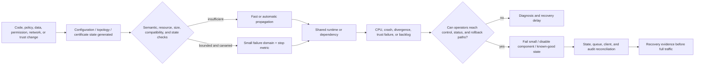

<!-- study-contract: principal -->

# Public failure casebook: tests derived from real incidents

| Field | Value |
|---|---|
| Artifact type | principal-study |
| Decision question | Which failure patterns from public production incidents must become non-negotiable architecture controls and comparative PoC scenarios? |
| Decision owner | Architecture review board and service reliability owner |
| Primary audiences | Executives, architects, platform engineering, SRE, security, API product, and migration teams |
| Scope | Public postmortems and certificate-transition guidance used to derive tests; no claim that a shortlisted API management product caused or would reproduce these incidents |
| Evidence state | Documented public facts plus explicit interpretation; no observed result for a shortlisted option |
| Reference case | [Synthetic enterprise reference case](41-enterprise-reference-case.md), case `RE-1` |
| As-of date | 2026-08-17 |
| Next gate | Gate 1 accepts the incident-derived scenario matrix; Gate 2 requires equivalent E3 evidence from every finalist |

## Provisional answer

Five recurring mechanisms matter more than a generic availability percentage:

1. globally distributed policy can turn change velocity into global blast radius;
2. a valid configuration can activate a latent runtime defect;
3. network failover can restore reachability while producing divergent state and a long reconciliation tail;
4. trust-chain transitions can break old, pinned, or slowly updated API clients even when server certificates are valid; and
5. data-derived configuration can exceed an untested structural limit and repeatedly re-poison a fleet.

The decision implication is immediate: a finalist cannot pass resilience, APIops, PKI, or hybrid gates with a pod-kill demo and a vendor uptime statement. The PoC must exercise configuration complexity and size, staged propagation, known-good rollback, data/state reconciliation, trust overlap, dependency loss, backlog recovery, and an operator path that remains usable when the gateway or access layer is impaired.

These incidents are not used to rank vendors. They are challenge evidence showing that plausible failure chains cross product, network, data, identity, process, and human boundaries.

## Scenario and evidence boundary

The casebook maps public incidents onto `RE-1` journeys and failures. Any workload rates, timeouts, error budgets, or thresholds used in a local reproduction remain **scenario assumptions** until Gate 0 approves them. Public incident timings and impacts are documented facts only where the linked primary postmortem states them.

| Case | Documented production mechanism | `RE-1` stress point | Test principle |
|---|---|---|---|
| CF-2019 | WAF rule caused fleet-wide CPU exhaustion after rapid global propagation | `J-01`–`J-05`, `I-04` | A policy change must be performance-bounded, canaried, and rapidly disabled outside the impaired path |
| FASTLY-2021 | Valid customer configuration triggered a latent deployed software bug | `J-06`, `I-07` | Valid syntax is insufficient; representative semantic/configuration combinations and safe isolation are required |
| GH-2018 | Brief partition caused cross-region database divergence and a 24-hour recovery/reconciliation tail | `J-01`, `J-03`, `I-06`, `I-08` | Failover must prove state integrity, backlog durability, degraded modes, and failback—not DNS alone |
| LE-2021 | Root/cross-sign expiry exposed old client and OpenSSL trust-path behavior | `J-03`, `J-05`, `I-03` | PKI testing must cover client population, alternate chains, overlap, pinned trust, and slow-update systems |
| CF-2025 | Database permission change duplicated rows in a generated feature file; oversized data propagated fleet-wide and exceeded a software limit | `J-06`, `I-04`, `I-05`, `I-07` | Generated configuration needs schema/cardinality/size limits, health mediation, last-known-good state, and bounded blast radius |

## Mechanism analysis

**Figure FAIL-1 — Fast propagation turns a locally valid change into systemic failure unless validation, blast radius and recovery access are independent.**

- **Depicted scope:** change generation, semantic/resource/size/compatibility validation, canary or insufficient-validation branches, propagation to shared runtime, failure modes, independent operator access, containment, reconciliation and recovery proof.
- **Excluded scope:** any one incident's exact topology/timeline, vendor-specific controls, probability/frequency, local RE-1 thresholds, commercial impact and proof that a candidate implements the controls.
- **Diagram source, evidence state and as-of:** inline cross-case synthesis from the five primary public postmortems listed in the preceding table and linked in this casebook; interpretation of documented mechanisms, not a claim that the incidents share one root cause; 2026-08-17.
- **Accessible equivalent:** a code, policy, data, permission, network or trust change generates runtime state. Bounded semantic/resource/compatibility checks can send it to a small canary with a stop metric; insufficient validation permits fast propagation into a shared runtime. Failure then depends on whether operators retain an independent path to contain or restore known-good state, followed by queue/state/client/audit reconciliation and recovery evidence before full traffic.

**Figure interpretation:** the common chain begins before request processing. A change is transformed into runtime state, passes incomplete validation, and propagates into a shared failure domain. Recovery depends on an independent operator path and ends only after state/backlog reconciliation. The architecture control is therefore not “more replicas”; identical replicas can fail together when they ingest the same policy, feature file, certificate chain, or topology decision.

**Figure limitation:** This synthesis does not establish causal equivalence, incident likelihood or candidate susceptibility. Each public case retains its own documented boundary, and local controls must be tested rather than inferred from analogy.

## Failure case 1 — policy performance and global blast radius

Cloudflare’s [July 2, 2019 postmortem](https://blog.cloudflare.com/details-of-the-cloudflare-outage-on-july-2-2019/) documents a WAF managed-rule update whose regular expression exhausted CPU across the HTTP/HTTPS serving fleet. The service was down for 27 minutes. The rule went through approval and tests, but the suite did not detect runaway CPU use, the WAF rule path bypassed the normal staged software rollout, and the rapid global configuration system distributed the defect in seconds. Access to internal tools was also impaired because some depended on the affected edge.

The deep lesson is not “regular expressions are dangerous.” It is that policy is executable production code even when configured in simulate mode, and a fast global control plane magnifies an unbounded rule. Governance controls—pull request, change ticket, CI, and rollback plan—were present, but the technical test oracle and deployment boundary were incomplete.

Required E3 challenge:

- apply worst-case schema, threat, and transformation inputs under the production policy chain;
- set CPU, memory, event-loop, and latency stop conditions per rule or plugin;
- promote to one isolated data-plane group before wider propagation;
- confirm a kill switch can disable one policy family without rebuilding the whole fleet;
- prove the emergency control path works when normal SSO, gateway, dashboard, or API access is unavailable; and
- preserve the failed artifact and telemetry rather than overwriting it with the rollback result.

## Failure case 2 — valid configuration activates latent software defect

Fastly’s [June 8, 2021 outage summary](https://www.fastly.com/blog/summary-of-june-8-outage) states that a software bug deployed in May remained latent until a valid customer configuration change triggered it. The event caused 85% of the network to return errors; Fastly detected disruption within one minute and reported 95% of the network operating normally within 49 minutes.

Syntax validation and a successful previous deployment could not exclude this failure because the defect lived in the interaction between software and a particular valid configuration. For an API platform, equivalent interactions include policy combinations, route cardinality, regex/schema complexity, plugin ordering, consumer/product state, upstream TLS settings, or an unusual but legal Gateway API object.

Required E3 challenge:

- generate boundary configurations—maximum route/policy/consumer counts, long names, large schemas, unusual ordering, conflicting and defaulted fields;
- replay a corpus of real sanitized configuration shapes across the exact candidate version;
- canary software and configuration combinations, not each independently;
- define which component can fail open, fail closed, or be bypassed by traffic class; and
- measure fleet recovery, configuration convergence, and operator action rather than only time to rollback the triggering object.

## Failure case 3 — failover restores traffic but not consistent state

GitHub’s [October 21, 2018 post-incident analysis](https://github.blog/news-insights/company-news/oct21-post-incident-analysis/) describes how a 43-second network interruption changed database leadership and left writes in both east and west data centres that were not present in the other. GitHub chose to prioritize data integrity over rapid availability, resulting in 24 hours and 11 minutes of degraded service. Recovery involved rebuilding replicas, managing cross-country write latency, catching up replication, and draining backlogs. The postmortem reports more than five million queued webhook events and 80,000 queued Pages builds; about 200,000 webhook payloads exceeded an internal TTL before processing was paused and corrected.

The API-platform analogue is broader than the gateway database. Configuration, consumer credentials, subscriptions, quotas, analytics, audit, webhook/event delivery, idempotency state, and downstream business data can have different replication and recovery properties. Routing traffic to another region may create an apparently healthy endpoint over stale or divergent state.

Required E3/E4 challenge:

- inventory every state domain and declare consistency, RPO, recovery authority, and failover behavior;
- inject a partition during `J-01` writes and `J-03` partner activity;
- prove whether each state fails forward, fails back, queues, rejects, or serves stale reads;
- include backlog TTL, downstream capacity, ordering, replay, and partner-rate effects in recovery;
- reconcile business side effects, credentials, configuration hashes, audit gaps, and dropped work; and
- keep service degraded until integrity and backlog exit criteria pass, even if request success has recovered.

## Failure case 4 — certificate validity is not client compatibility

Let’s Encrypt’s guidance for the [DST Root CA X3 expiration](https://letsencrypt.org/ca/docs/dst-root-ca-x3-expiration-september-2021/) warned API and IoT operators to verify that clients trusted ISRG Root X1 and noted problematic verification behavior in OpenSSL 1.0.x for the recommended Android-compatible chain. The transition was planned, publicly documented, and valid certificates continued to be issued; compatibility still depended on client trust stores and path-building behavior.

An enterprise API estate includes partner appliances, batch agents, pinned mobile applications, managed-file-transfer clients, old JVMs, service meshes, and disconnected gateways that update at different rates. A server-side “certificate renewed” check cannot prove the population will connect.

Required E3/E4 challenge:

- inventory client runtime and trust-store populations, including non-interactive and rarely used paths;
- overlap old and new issuing chains and trust bundles for the approved window;
- test alternate chain presentation, mTLS client certificates, revocation, clock skew, and pinned trust;
- rotate while a remote data plane is disconnected and while long-lived connections exist;
- expose handshake failure by client class without logging secrets; and
- rehearse rollback before removing old trust, then prove removal after the compatibility window.

## Failure case 5 — data-derived configuration repeatedly poisons the fleet

Cloudflare’s [November 18, 2025 postmortem](https://blog.cloudflare.com/18-november-2025-outage/) reports that a database permissions change caused duplicate rows in a Bot Management feature file, doubling its size. The file was propagated to the network, where it exceeded a software size limit and caused failures. During rollout across database nodes, a generator running every five minutes could emit good or bad files, producing intermittent recovery and failure that initially complicated diagnosis. The organization stopped bad generation/propagation and installed a known-good file before restarting affected services.

This mechanism is directly relevant to API systems that derive runtime state from databases, catalogs, policy generators, schemas, identity metadata, or Kubernetes controllers. A source change may be valid in isolation yet violate cardinality, size, uniqueness, or compatibility expectations downstream.

Required E3 challenge:

- validate generated artifacts for schema, uniqueness, cardinality, size, resource cost, and monotonic version before distribution;
- require a content hash and reject unexpected regression or expansion beyond an approved envelope;
- hold last-known-good state when generation or health checks fail;
- isolate optional policy/analytics components so they fail small instead of crashing core proxying;
- prevent a periodic generator from repeatedly reintroducing a rejected artifact; and
- exercise diagnosis where symptoms alternate and resemble external attack or dependency failure.

## Test matrix derived from the cases

| Test ID | Procedure | Measure | Pass / stop condition | Evidence artifact | Decision impact |
|---|---|---|---|---|---|
| CASE-001 | Promote an intentionally resource-expensive but syntactically valid policy through the normal path | Per-rule and request CPU/latency, canary blast radius, detection and disable time | Stop before non-canary SLO breach; one action disables policy without losing unrelated protection | Config, load, metrics, alert, timeline, rollback hash | Failing option cannot pass APIops/resilience gate without redesign |
| CASE-002 | Apply boundary-size and interaction configurations across old/new runtime versions | Crash/error rate, convergence, rejected artifacts, rollback | Invalid or unsafe combination rejected before broad propagation; known-good state preserved | Generated corpus, version matrix, logs, state hashes | Exposes unsafe version/topology combination |
| CASE-003 | Partition regions during writes, fail forward, restore, drain backlog, and fail back | RPO, inconsistent records, queue age/drop, recovery time, client errors | Per-state RPO/RTO met; no unexplained business variance; backlog and audit reconciled | Raw state snapshots, traffic, queue, reconciliation and timeline | Required for HA/DR and production-pilot approval |
| CASE-004 | Rotate server/client trust with old clients, pinned partners, disconnected runtime, and clock skew | Handshake success/failure by client class, rotation and rollback time | Approved population remains compatible; rejected clients are known and dispositioned; old trust removed after window | Trust inventory, handshake matrix, cert chain, timestamps | Required for security and partner-readiness gates |
| CASE-005 | Generate duplicate/oversized configuration repeatedly while request traffic runs | Artifact rejection, request SLO, restart count, component isolation, diagnostic time | Bad artifact never reaches broad fleet; optional component fails small; generator cannot re-poison | Source rows, artifact hashes, validation output, request metrics | Required for configuration safety and observability gates |
| CASE-006 | Disable normal SSO/dashboard/gateway access during an incident | Time to reach status, control, rollback, and communication paths | Authorized responders can diagnose, communicate, and contain using tested independent paths | Access exercise, role evidence, incident timeline | Required for operating-model and support acceptance |

## Decision implications

- Treat every globally propagated policy, schema, model, feature file, route, and certificate as executable production state with resource and compatibility limits.
- Require canary scope and automated stop metrics for both code and configuration; “simulate” mode does not remove compute risk.
- Separate request-path recovery from state integrity and backlog recovery. A green load balancer is not a completed regional exercise.
- Require an independent emergency operator and communication path that does not depend on the impaired gateway or identity edge.
- Add certificate client-population compatibility and disconnected rotation to the security gate.
- Demand proof that optional capabilities fail small and last-known-good configuration cannot be repeatedly replaced by a rejected generator output.
- Preserve negative results. A successful rollback after tuning does not erase the original failure or its decision impact.

## Falsification and proof plan

The casebook hypothesis is that these mechanisms are materially relevant to an enterprise API platform. It is falsified for a specific option only when architecture evidence proves the mechanism cannot apply in the stated topology—for example, an artifact is not distributed to the request path—or when a symmetric E3 test proves containment, recovery, and reconciliation meet approved thresholds. A vendor assertion that a feature is “highly available,” “validated,” or “automatically rolled back” is not sufficient.

Gate 1 maps CASE-001 through CASE-006 to every applicable exact option and records non-applicability with an independently reviewed mechanism explanation. Gate 2 stores raw result bundles; Gate 3 repeats stateful and trust cases in the production-like foundation; Gate 4 retains the incident patterns as game-day scenarios.

## Risks and limitations

- Cloudflare, Fastly, GitHub, and Let’s Encrypt operate different systems from the shortlisted platforms. The cases demonstrate failure mechanisms, not candidate defect history or comparative product quality.
- Public postmortems reflect what the publishing organization chose and was able to disclose. They are valuable primary accounts but not independent audits.
- Incident scale, architecture, and recovery times cannot be copied as `RE-1` thresholds. Local thresholds remain scenario assumptions until approved.
- The casebook emphasizes configuration, state, and trust. It does not replace threat modelling, capacity engineering, software supply-chain review, domain correctness, or commercial/support analysis.
- A lab can prove behavior only within its exact versions, configuration, topology, and workload. Production game days and continuous change controls remain necessary.

## Counter-hypotheses and non-fit boundaries

- **The failure mechanism is outside an option's request or control path.** This is credible only when the exact topology and state flow show that the triggering artifact, dependency, or state domain cannot affect the serving path. The reviewer records the mechanism-based non-applicability; a feature label is insufficient.
- **A managed service makes the experiment unnecessary.** Managed ownership can change who operates containment and recovery, but it does not remove consumer impact, client compatibility, configuration semantics, business-state reconciliation, or the need to understand evidence and escalation. The experiment may become a provider-supported exercise rather than a customer fault injection.
- **A lower propagation rate solves correlated failure.** Slower rollout reduces blast radius only when health signals are sensitive to the failure and can stop promotion. It can also lengthen mixed-state exposure. The test must prove the chosen rate and stop oracle.
- **Stateless gateway replacement solves regional recovery.** This is a non-fit assumption for journeys whose credentials, products, idempotency records, quotas, analytics, audit, or downstream data have state. The option may prove those domains are external and safely converged, but it may not omit them.
- **Public incidents are too different to guide selection.** Their impact figures and architectures are not transferred. The reusable subject is the causal mechanism. If a reviewer cannot map a mechanism to the proposed option, the case is marked non-applicable with the explicit reason rather than forced into scoring.

## Open evidence requests

| Evidence request | Owner role | Due gate | Decision impact |
|---|---|---|---|
| Map CASE-001 through CASE-006 to every exact shortlisted topology, including managed-service responsibility and unsupported injections | Candidate architecture lead | Gate 1 | Establishes applicable experiments and defensible non-applicability |
| Ratify local resource, blast-radius, RTO/RPO, compatibility, backlog, and recovery thresholds without copying public incident values | SRE and business service owners | Gate 1 | Defines pass/stop conditions before candidate results are visible |
| Identify the independent emergency status, control, rollback, and communication path for each option | Security and incident-management leads | Gate 1 | Blocks an option whose recovery controls share the failed dependency |
| Provide client/trust population evidence for partner, batch, mobile, MFT, JVM, and disconnected-runtime paths | PKI and consumer-platform owners | Gate 2 | Determines the real scope of CASE-004 and migration risk |
| Produce raw E3 bundles for every applicable case, including failed first runs and all tuning changes | PoC lead | Gate 2 | Prevents a tuned demonstration from erasing negative evidence |
| Review whether new external postmortems or product-version changes add or invalidate a challenge mechanism | Independent reliability reviewer | Before each finalist decision | Keeps the casebook current without treating it as a frozen incident list |

## Next gate

Gate 1 accepts this casebook only when every finalist has an applicability decision and equivalent test design for CASE-001 through CASE-006. Gate 2 cannot close resilience, APIops, PKI, or hybrid criteria when only replica failure and steady-state load have been demonstrated.
