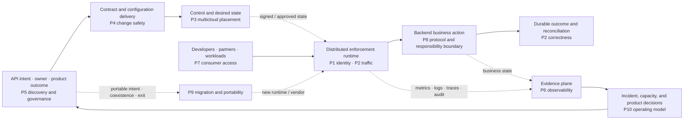
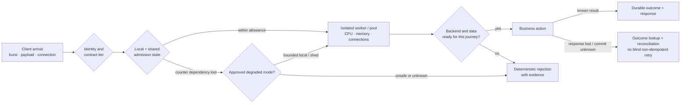
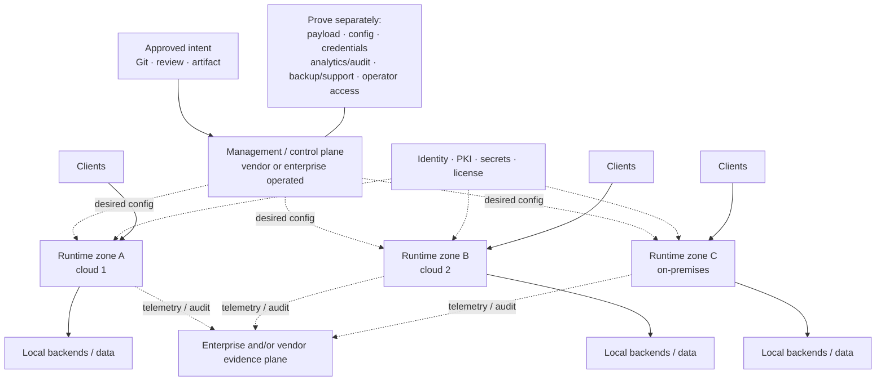
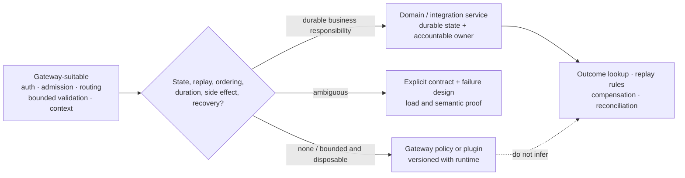
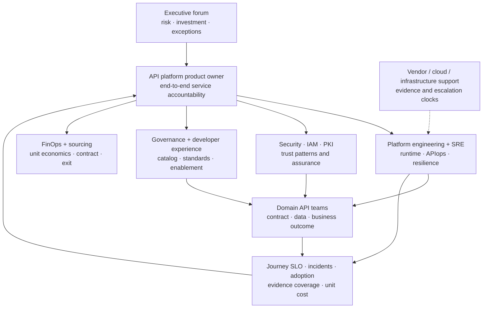
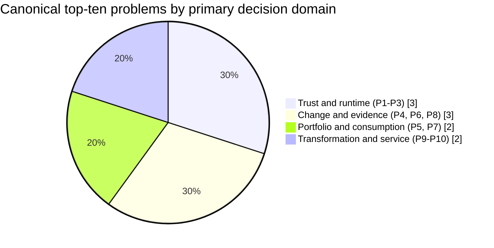
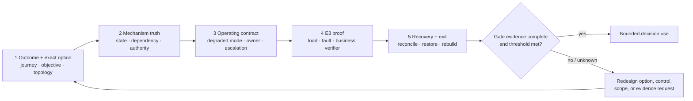

<!-- study-contract: principal -->

# The ten enduring API-management industry problems

| Field | Value |
|---|---|
| Artifact type | principal-study |
| Decision question | Which enduring problems should define the API-management research portfolio and proof agenda, independent of vendor feature packaging? |
| Decision owner | API-platform product owner with architecture, security, SRE, developer-experience, domain, and sourcing authorities |
| Primary audiences | Executives, directors, enterprise and platform architects, developers, DevOps, SRE, security, API product, FinOps, sourcing, and migration teams |
| Scope | Ten problem families evidenced across current Kong Gateway/Konnect and Microsoft Azure API Management/API Center documentation, Apigee hybrid 1.16/API hub, and MuleSoft Anypoint/Flex Gateway 1.12; standards context from Kubernetes Gateway API, OpenTelemetry, NIST, and the IETF; exact option versions/editions remain unresolved; no product ranking or market-share claim |
| Evidence state | Documented E1 mechanisms plus interpretation and RE-1 test hypotheses; no candidate has decision-grade E2 commercial evidence, E3 comparative result, or E4 production pilot evidence in this study |
| Reference case | [Synthetic regulated-enterprise reference case](41-enterprise-reference-case.md), case `RE-1`; every number inherited from it remains a scenario assumption |
| As-of date | 2026-08-17 |
| Next gate | Gate 0 accepts, amends, or rejects the problem taxonomy, outcome measures, and symmetric proof scope before vendor-specific roadmap or scoring work |

## Provisional answer

The durable industry problem is not choosing a gateway with the longest feature list. It is preserving **trustworthy, recoverable, observable business access to services while contracts, teams, identities, runtimes, clouds, and vendors change independently**. The ten problem families below are the smallest useful decomposition of that system problem for `RE-1`.

They are ranked by **potential business consequence, ubiquity across the API lifecycle, and power to change an architecture or investment gate**—not by vendor revenue, feature count, or a synthetic numeric score. Security, resilience, and multicloud control appear first because an error can create unauthorized access, duplicate business effects, or a large failure domain. Discovery, developer experience, and economics remain essential: the first three controls cannot be sustained when APIs are unowned, consumers route around the platform, or the operating model is unaffordable.

Across the four enterprise platform families examined, official documentation repeatedly productizes authentication and traffic policy, managed and customer-hosted runtime options, lifecycle automation, catalog/portal, analytics, and governance. That convergence is evidence that these are persistent customer problems; it is **not** evidence that implementations are equivalent. For example, Kong documents a gateway intended for decentralized hybrid and multicloud architectures, Microsoft distinguishes managed and self-hosted gateway capabilities, Apigee separates a Google-managed management plane from a customer-managed hybrid runtime, and MuleSoft distinguishes connected and mostly disconnected local configuration modes ([Kong Gateway](https://developer.konghq.com/gateway/), [Azure API Management gateways](https://learn.microsoft.com/en-us/azure/api-management/api-management-gateways-overview), [Apigee hybrid](https://docs.cloud.google.com/apigee/docs/hybrid/v1.16/what-is-hybrid), [MuleSoft Flex Gateway](https://docs.mulesoft.com/gateway/1.12/)). Each topology moves state, dependency, support, and failure responsibilities differently.

The immediate decision implication is to organize studies and PoCs by these problems and their outcomes. A vendor demo can illustrate a mechanism, but only a bounded option, representative workload, injected failure, business verifier, and recovery artifact can answer whether the mechanism fits. If the taxonomy is materially wrong, the roadmap can overfund visible gateway features while leaving a high-consequence trust, recovery, consumer, or operating-model failure untested; that is why Gate 0 can change the list before scoring or preferred-vendor sequencing.

## Boundary, ranking method, and evidence discipline

This is a **problem taxonomy**, not a market quadrant. “Industry” means recurring enterprise needs represented in the official product and standards material reviewed for the four platform families in scope. It does not mean every vendor, deployment edition, or emerging API style was exhaustively surveyed. “Top ten” means the ten highest-leverage problem families for `RE-1`; another reference case may change the order or split a family.

The rank uses three qualitative tests:

1. **Consequence:** can failure authorize the wrong actor, corrupt a business outcome, breach a mandatory boundary, or disable multiple journeys?
2. **Pervasiveness:** does the issue span design, delivery, runtime, consumption, incident response, and migration rather than one optional feature?
3. **Decision leverage:** would an answer change topology, isolation unit, responsibility, funding, shortlist, sequencing, or a mandatory gate?

No numerical score is assigned because there is no observed incident frequency, loss distribution, or calibrated risk appetite. The rank is an **interpretation** to structure work. Gate 0 can reorder it when decision owners supply evidence.

All external links in this study are current official or primary point-of-use sources. They are **contextual, non-scoring E1 support for the stated mechanism only**; they neither populate a candidate criterion nor close an evidence request. A source and its scoped claim must be promoted deliberately into the repository source/claim registers before later sessions use it as decision-bearing score evidence. Bulk registration would create volume, not assurance.

**Figure IP-1 — API management is a closed control system, so no isolated feature can solve the ten problems.**

- **Depicted scope:** API intent and ownership, delivery controls, distributed control/data planes, request-path enforcement, backend business outcome, telemetry/reconciliation, consumer feedback, and the ten problem families attached to those stages.
- **Excluded scope:** vendor products, exact topology, cloud regions, protocol detail, commercial packaging, staffing, control effectiveness, and any claim that all stages share one platform.
- **Diagram source, evidence state and as-of:** inline synthesis of the ten-problem taxonomy and `RE-1`; interpretation informed by the official sources cited throughout this study; 2026-08-17.
- **Accessible equivalent:** owners and contracts enter a controlled delivery path; approved desired state reaches distributed runtimes; clients cross identity, policy, and traffic enforcement to backends; business outcomes and telemetry must reconcile; catalog and consumer feedback change the next contract. Problems 1–4 govern trust and runtime truth, 5–7 govern portfolio and consumption, and 8–10 govern boundaries, change, and sustainability.

**Figure interpretation:** API management is a feedback system rather than a proxy box. Policy without inventory is incomplete, telemetry without business state cannot prove correctness, and a portable route without consumer or operational state does not create an exit path.

**Figure limitation:** The loop does not imply one control plane, one vendor, or synchronous telemetry. It does not prove that a platform covers any stage or that centralization is desirable; ownership and isolation are design decisions.

## The top 10 enduring industry problems

| Rank | Enduring problem | Mechanism vendors productize | RE-1 exposure | Decision implication |
|---:|---|---|---|---|
| 1 | Distributed policy and identity enforcement | Gateway policy, consumer/app identity, token and certificate validation, secrets, threat controls | `J-01`–`J-04`; `I-03` | Trust must remain correct across locations, caches, rotation, and partial identity failure; policy count is not proof. |
| 2 | Traffic resilience and backend protection | Rate limits, quotas, load balancing, isolation, health, retry/timeout, circuit and capacity controls | `J-01`–`J-05`; `I-01`, `I-04`, `I-06` | The gate is a business SLO and correctness result under failure, not gateway uptime or peak requests per second. |
| 3 | Hybrid/multicloud placement, sovereignty, and control-plane continuity | Managed, hybrid, self-hosted, and Kubernetes runtimes with centralized or local configuration | all journeys; `I-02`, `I-03`, `I-05`, `I-06` | Select an exact topology and responsibility boundary; “runs anywhere” does not establish locality, restart, revocation, or recovery. |
| 4 | Safe lifecycle change and configuration truth | Declarative configuration, revisions, validation, staged rollout, policy-as-code, audit, rollback | `J-06`; `I-02`, `I-07`, `I-08` | Prove desired-to-active state, semantic validation, blast-radius control, rollback/reconciliation, and writer authority. |
| 5 | Estate discovery, product ownership, and governance at scale | API catalog, inventory, metadata, linting, lifecycle, ownership and conformance views | all journeys; amplifies all incidents | Unknown and unowned endpoints cannot be secured, retired, costed, or governed; inventory reconciliation precedes coverage claims. |
| 6 | End-to-end observability and decision evidence | Metrics, logs, traces, analytics, alerts, audit, export and diagnostic context | all journeys; `I-02`, `I-04`–`I-06` | Correlate client, gateway, identity, backend, business outcome, and active config while keeping telemetry failure off the request path. |
| 7 | Consumer adoption and product access | Catalog/portal, documentation, try-it, app registration, credentials, subscriptions and usage insight | `J-02`–`J-05`; exposes ownership and access gaps | Measure safe time-to-first-success and support burden, not portal page count; product access must agree with runtime authorization. |
| 8 | Protocol expansion and the gateway/integration boundary | REST, gRPC, GraphQL, events/AsyncAPI, mediation and extensibility | `J-01`, `J-04`, `J-05`; `I-01`, `I-07`, `I-08` | Keep durable workflow, idempotency, files, ordering, and reconciliation in accountable services; test semantic—not merely syntactic—parity. |
| 9 | Portability, coexistence, migration, and exit | Standards-based contracts/routes, export APIs, Kubernetes controllers, adapters and side-by-side runtime | all journeys; `I-02`, `I-03`, `I-07`, `I-08` | Measure transformation and state reconciliation by layer; route portability alone does not move consumers, credentials, counters, history, or support. |
| 10 | Sustainable federated operating model and economics | Workspaces/teams/RBAC, managed service, automation, delegated ownership, analytics and consumption models | all journeys; determines response to all incidents | Choose a service and responsibility model that can be staffed, upgraded, supported, evidenced, and exited over the decision horizon. |

The list is intentionally coupled. A catalog can reveal an API but cannot identify a caller at runtime; a gateway can reject traffic but cannot resolve an ambiguous ledger outcome; a control plane can publish configuration but cannot make an unsupported Kubernetes/database topology recoverable. The following sections identify the mechanism, operating tension, failure signature, non-fit condition, and measurement for each problem.

## Mechanism and proof analysis

### 1. Distributed policy and identity enforcement

**Why the problem endures.** API trust is evaluated across a moving graph: human or workload identity, client application, authorization server, certificate authorities, secrets, gateway, backend authorization, and sometimes partner-specific controls. Network location alone is insufficient. NIST SP 800-207 moves trust decisions toward users, assets, and resources rather than a static perimeter, while SP 800-207A applies identity-tier policy across gateways, sidecars, and application identity infrastructure in hybrid and multicloud environments ([NIST SP 800-207](https://csrc.nist.gov/pubs/sp/800/207/final), [NIST SP 800-207A](https://csrc.nist.gov/pubs/sp/800/207/a/final)). RFC 9700 updates OAuth security practice because deployed OAuth ecosystems are dynamic and known implementation weaknesses remain exploited ([RFC 9700](https://www.rfc-editor.org/info/rfc9700/)). These are **documented standards mechanisms**, not proof that a gateway configuration conforms.

**Mechanism.** Vendors productize policy enforcement at the request boundary—authentication plugins/policies, consumer or application identity, scopes/claims, mutual TLS, rate tiers, transformations, and threat controls. Kong documents authentication and rate-limiting functions in its gateway; Microsoft describes credential verification, quotas, policies, caching, and telemetry at the gateway; Apigee groups policies into security, traffic management, and mediation; MuleSoft describes policy, encryption/authentication, analytics, and client contracts ([Kong Gateway](https://developer.konghq.com/gateway/), [Azure gateway role](https://learn.microsoft.com/en-us/azure/api-management/api-management-gateways-overview), [Apigee policies](https://docs.cloud.google.com/apigee/docs/api-platform/develop/policy-attachment-and-enforcement), [MuleSoft API Manager](https://docs.mulesoft.com/api-manager/latest/latest-overview-concept)). The common mechanism is a policy-enforcement point; the state, evaluation order, cache, failure mode, and entitlement are implementation-specific.

**Failure and operating-model tension.** Central policy promises consistency, but remote identity dependencies and cached keys create availability-versus-revocation tension. Fail closed can stop `J-03` during issuer/JWKS loss; fail static or cached can accept a key after a revocation objective. Certificate rotation can update a secret while long-lived connections or the serving process retain the old chain, reproducing `I-03`. A plugin may authenticate the client yet erase the assurance context before backend authorization. Global rules can reduce local autonomy, while local overrides can create invisible exception debt.

**Counter-hypothesis and non-fit.** A service-mesh or application authorization layer may be the better enforcement point for fine-grained business permission; an edge gateway should not own every east-west or row-level decision. A platform is non-fit when the exact topology cannot meet a mandatory revocation/rotation objective during control or identity degradation, cannot preserve identity context to the accountable service, or cannot evidence which policy and trust material made a decision.

**Measurable implication.** Run `J-03/I-03` with valid, expired, revoked, wrong-audience, wrong-issuer, clock-skewed, old-chain, and new-chain cases before, during, and after IdP/JWKS/CA degradation. Record the served certificate chain, token/key epoch, policy/config digest, identity forwarded to the backend, decision code, cache age, and recovery. Acceptance is zero unauthorized success, no unexplained fail-open, approved fail-closed/degraded behavior, and rotation/revocation inside the decision-owner threshold.

### 2. Traffic resilience and backend protection

**Why the problem endures.** Traffic management is a distributed-systems problem disguised as a limit setting. Arrival bursts, slow clients, large payloads, authentication calls, counter stores, telemetry, connection pools, upstream saturation, autoscaling, and retries compete for resources. A gateway can protect a backend, but it can also become a shared bottleneck or multiply a non-idempotent action.

**Mechanism.** Vendors expose rate and quota policies, health/load-balancing controls, timeouts, caching, routing, isolation, and autoscaling integration. Those features mediate admission; they do not create backend capacity or business idempotency. Kong's rate-limit documentation distinguishes targets, algorithms, and counter strategies; Azure's Well-Architected guidance explicitly treats shared colocation versus distributed instances as a blast-radius/cost decision ([Kong rate limiting](https://developer.konghq.com/gateway/rate-limiting/), [Azure API Management Well-Architected guidance](https://learn.microsoft.com/en-us/azure/well-architected/service-guides/azure-api-management)). A counter store or fallback strategy determines whether a quota is hard, approximate, local, or unavailable.

**Failure and operating-model tension.** In `I-04`, onboarding work can starve payment traffic even when average gateway capacity looks healthy. During a counter-store partition, local fallback can exceed a partner allowance; fail closed can turn a dependency outage into a total outage. Retry after a timeout can duplicate `J-01` because HTTP defines idempotence by intended server effect, and a gateway does not know whether a downstream commit occurred ([RFC 9110](https://www.rfc-editor.org/rfc/rfc9110.html)). Regional routing can restore reachability before data is ready, reproducing `I-06`.

**Figure IP-2 — Admission control protects capacity only when business correctness and dependency state participate in the decision.**

- **Depicted scope:** client arrival, identity/contract tier, local and shared traffic controls, gateway resource limits, backend readiness, durable business outcome, and degraded/failure branches.
- **Excluded scope:** one vendor's policy order, queue algorithms, retry defaults, exact counters, network design, autoscaler, or RE-1 numeric thresholds.
- **Diagram source, evidence state and as-of:** inline mechanism model derived from `RE-1` `J-01`, `I-01`, `I-04`, and `I-06`, RFC 9110, and official traffic-control sources cited above; test hypothesis, 2026-08-17.
- **Accessible equivalent:** a request is admitted only after identity/tier and capacity decisions. Shared-counter loss must choose an approved degraded mode. Resource limits protect gateway workers, while backend health includes data readiness. A timeout after an uncertain commit goes to status lookup and reconciliation, not an automatic retry.

**Figure interpretation:** a rate-limit feature solves only one admission decision. Business correctness depends on isolation, data readiness, and an outcome protocol after ambiguity; those controls span gateway and domain services.

**Figure limitation:** The figure does not prescribe fail-open/closed behavior, promise a distributed hard quota, or place durable idempotency in the gateway. The decision owner must approve the degraded mode per journey.

**Counter-hypothesis and non-fit.** A simple stateless public-information API may need only coarse protection and cloud load balancing; elaborate global quota infrastructure could add more failure risk than value. A platform is non-fit for a tier when it cannot isolate the largest credible noisy neighbour, makes mandatory counter consistency dependent on an unacceptable failure path, or obscures the component that rejected or timed out a request.

**Measurable implication.** Exercise the representative `J-01`–`J-05` mix through ordinary load, burst, largest allowed zone loss, slow upstream, slow client, large payload, counter-store partition, and telemetry sink outage. Measure accepted business transactions, duplicate effects, p50/p95/p99/p99.9, rejection attribution, saturation resource, counter divergence, recovery drain, and cost per successful transaction. Vendor benchmark throughput is contextual E1 evidence only; the decision uses reproducible RE-1-shaped E3 results.

### 3. Hybrid/multicloud placement, sovereignty, and control-plane continuity

**Why the problem endures.** Enterprises place APIs near backends, regulated data, acquired estates, or different clouds while seeking common management. The physical request path, desired-state authority, analytics path, identity dependencies, support boundary, and recovery store can each live in a different jurisdiction or failure domain. “Hybrid” therefore names a family of trade-offs rather than an outcome.

**Mechanism.** The four platforms offer materially different deployment archetypes. Kong documents control/data-plane hybrid mode and cached data-plane behavior during disconnection; Azure offers managed and customer-deployed self-hosted gateways controlled by an Azure service; Apigee hybrid uses a Google-managed management plane and a customer-operated multi-component Kubernetes runtime; MuleSoft Flex supports connected control-plane management and a mostly disconnected local declarative mode that still connects for registration and usage metrics ([Kong hybrid mode](https://developer.konghq.com/gateway/hybrid-mode/), [Azure self-hosted gateway](https://learn.microsoft.com/en-us/azure/api-management/self-hosted-gateway-overview), [Apigee hybrid](https://docs.cloud.google.com/apigee/docs/hybrid/v1.16/what-is-hybrid), [MuleSoft Flex Gateway](https://docs.mulesoft.com/gateway/1.12/)). These are documented product mechanisms; editions, versions, locations, limits, and contractual obligations remain unresolved for an exact option.

**Failure and operating-model tension.** Central control improves governance and reduces duplicate operations, but it can concentrate configuration authority and metadata. Local runtimes keep payload paths near backends, but transfer Kubernetes, network, registry, certificate, state-store, scaling, and diagnostic work to the enterprise. Existing replicas continuing during control disconnection does not prove clean restart, new-node scale-out, urgent revoke, telemetry durability, license behavior, or deterministic reconciliation—the exact distinction exposed by `I-02`.

**Figure IP-3 — “Local data plane” leaves six independent locality and continuity questions.**

- **Depicted scope:** source/configuration authority, SaaS or self-managed control, customer runtime zones across clouds/on-premises, request/backends, identity/secrets, telemetry/audit, and the six proof questions.
- **Excluded scope:** one candidate architecture, allowed jurisdictions, encryption, component versions, database topology, network ports, commercial terms, and achieved continuity.
- **Diagram source, evidence state and as-of:** inline cross-vendor hybrid synthesis from the official topology sources cited in this section and `RE-1/I-02`; interpretation and test model, 2026-08-17.
- **Accessible equivalent:** Git or another authority sends approved desired state to a control plane; customer runtime zones receive it and proxy local requests to local backends. Identity/secrets and telemetry/audit remain external dependencies. Reviewers must separately locate payload, configuration, credentials, analytics/audit, backups/support data and operator access, then test running, restart, scale-out, emergency change and reconciliation states.

**Figure interpretation:** request locality is only one data-location question, and warm runtime continuity is only one failure state. The target must specify where every state lives and who restores it.

**Figure limitation:** Dotted links do not assert asynchronous, outbound-only, encrypted, buffered, or failure-independent communication. Exact flow capture, vendor documentation, contract, and E3 execution are required.

**Counter-hypothesis and non-fit.** A single managed regional service can be more reliable and cheaper than a nominally portable multicloud platform when workloads, data, skills, and recovery already concentrate in one cloud. Multicloud is not a goal by itself. Conversely, a SaaS-control hybrid option is non-fit when metadata/support processing violates a mandatory boundary, and a self-managed option is non-fit when database/Kubernetes recovery and 24×7 ownership cannot be sustained.

**Measurable implication.** Build a field-level location/responsibility ledger, then test connected service, control-plane isolation with existing replicas, cached restart, clean-node scale-out, urgent credential/route revoke, incompatible change, reconnection, regional loss, failback, and support escalation. Each state needs its own objective, active configuration digest, dependency trace, telemetry-gap record, and named recovery owner.

### 4. Safe lifecycle change and configuration truth

**Why the problem endures.** API behavior is assembled from contracts, routes, policies, plugins, secrets, certificates, products, consumer entitlements, gateway binaries, controllers, and infrastructure. Several tools can write overlapping state. A syntactically valid change can be semantically wrong, resource-exhausting, incompatible with a runtime, or correctly deployed to the wrong scope.

**Mechanism.** Platforms offer revisions, declarative state, APIs, infrastructure as code, validation, governance rules, and automated deployment. Kong documents decK in CI/CD and Git-held configuration for audit and rollback; MuleSoft governance applies rules from design through deployment and exposes CLI automation; Gateway API defines role-oriented resources and version-specific conformance rather than promising that every implementation supports every extended or vendor-specific feature ([Kong decK CI](https://developer.konghq.com/deck/apiops/continuous-integration/), [MuleSoft API Governance](https://docs.mulesoft.com/api-governance/), [Gateway API roles](https://gateway-api.sigs.k8s.io/docs/concepts/roles-and-personas/), [Gateway API conformance](https://gateway-api.sigs.k8s.io/docs/concepts/conformance/)).

**Failure and operating-model tension.** Central pipelines can reduce drift but amplify a bad change. Federated teams need speed, while platform/security owners need bounded policy and evidence. Multiple configuration authorities—portal, API, Git sync, Kubernetes controller, and emergency admin—can race or silently overwrite. Rollback of declarative gateway state cannot reverse a database schema, issued credential, consumed message, or external business action, reproducing `I-08`. Schema linting can miss the semantic enum incompatibility in `I-07`.

**Counter-hypothesis and non-fit.** Manual administration can be adequate for a small, low-change sandbox; a complex GitOps platform may not earn its operational cost. It becomes non-fit for production when active state cannot be tied to an approved artifact, when partial application is invisible, when incompatible versions/plugins cannot be blocked before blast radius, or when emergency action bypasses audit without reconciliation.

**Measurable implication.** Introduce a syntactically invalid change, a valid-but-semantic contract break, an excessive-size/resource change, an incompatible plugin/policy, a certificate update, and a partial controller failure. Canary to the smallest failure domain, use business probes, stop on an approved signal, restore known-good state, and reconcile every runtime digest and audit record. Measure validation coverage, propagation distribution, affected traffic, detection time, stop time, rollback/recovery time, state convergence, and unresolved side effects.

### 5. Estate discovery, product ownership, and governance at scale

**Why the problem endures.** APIs exist outside the selected gateway: cloud-native gateways, integration runtimes, application frameworks, Kubernetes ingress/controllers, partner endpoints, SaaS, events, files, and endpoints still in design. A gateway inventory is therefore not an enterprise API inventory. Metadata decays, deployment truth diverges from catalog truth, and ownership changes faster than a centralized review team can manually track.

**Mechanism.** Current platforms increasingly separate inventory/catalog from runtime management. Microsoft describes API Center as a design-time, multigateway inventory complementary to API Management; Apigee API hub catalogs APIs, versions, dependencies, deployments, lifecycle data, and conformance information; Kong Catalog associates APIs, specifications, implementations, documentation, and portal publication; MuleSoft governance targets services by metadata and exposes organization-wide conformance views ([Azure API Center FAQ](https://learn.microsoft.com/en-us/azure/api-center/frequently-asked-questions), [Apigee API hub](https://docs.cloud.google.com/apigee/docs/apihub/what-is-api-hub), [Kong API Catalog](https://developer.konghq.com/catalog/apis/), [MuleSoft API Governance](https://docs.mulesoft.com/api-governance/)). This product convergence is documented; inventory completeness is not.

**Failure and operating-model tension.** Central catalog curation can become stale bureaucracy; passive discovery can find endpoints without accountable business meaning; federated ownership can create inconsistent taxonomy. “Governed” can mean a spec matched a ruleset while the deployed route, consumer contract, runtime policy, or undocumented endpoint differs. A team can improve conformance percentage by excluding unknown assets. Every `RE-1` incident becomes harder when owner, active version, dependency, identity, data class, and recovery tier are missing.

**Counter-hypothesis and non-fit.** A catalog is not automatically valuable. If it duplicates source repositories without measuring runtime truth or enabling a consumer action, it is another stale database. A platform is non-fit when discovery cannot accept multiple runtime sources, ownership has no escalation path, metadata has no freshness/provenance, or the governance score hides unregistered APIs.

**Measurable implication.** Reconcile at least source repositories, CI/CD, gateway/control-plane APIs, Kubernetes routes, cloud catalogs, runtime traffic, CMDB/service records, identity clients, DNS/certificates, and cost/license records. For the approved scope, account for every observed endpoint as registered, intentionally excluded with owner/expiry, or an incident. Measure unmatched assets, missing owners, stale metadata, version/deployment disagreement, governance coverage denominator, consumer reuse, and time to resolve an orphan.

### 6. End-to-end observability and decision evidence

**Why the problem endures.** A successful proxy status does not prove a correct business outcome; a gateway error does not identify whether DNS, TLS, identity, policy, counter store, runtime, network, backend, data, or telemetry failed. Cardinality, privacy, sampling, retention, clock alignment, and cost force trade-offs. The evidence plane can itself create backpressure on the request path.

**Mechanism.** Platforms emit gateway metrics, logs, traces, analytics, alerts, audit records, and integrations. Kong documents OpenTelemetry and Prometheus-compatible monitoring, Azure describes observability across managed and self-hosted gateways, Apigee API Monitoring offers traffic/performance diagnostics, and MuleSoft API Manager provides analytics and alerts ([Kong monitoring](https://developer.konghq.com/gateway/monitoring/), [Azure APIM observability](https://learn.microsoft.com/en-us/azure/api-management/observability), [Apigee API Monitoring](https://docs.cloud.google.com/apigee/docs/api-monitoring), [MuleSoft API Manager](https://docs.mulesoft.com/api-manager/latest/latest-overview-concept)). OpenTelemetry documents that in-memory queues can fill, retry windows can expire, and persistence or a message queue changes but does not eliminate data-loss conditions ([OpenTelemetry Collector resiliency](https://opentelemetry.io/docs/collector/resiliency/)).

**Failure and operating-model tension.** Rich per-consumer/payload telemetry can improve diagnosis but increase privacy exposure, cost, and request overhead. Central SaaS analytics can simplify operations while creating residency/egress questions. Local exporters reduce direct dependency but introduce queue, disk, and collector operations. In `I-05`, telemetry backpressure competes with gateway CPU; dropping all evidence preserves traffic but can make a security or financial incident unreconstructable.

**Counter-hypothesis and non-fit.** Vendor-native analytics may be sufficient for a bounded team and retention need; mandatory export of every signal can add needless complexity. It becomes non-fit when the platform cannot correlate active configuration and request decisions, cannot export required audit/SLI data within the allowed boundary, materially harms request handling during sink failure, or hides loss/backlog.

**Measurable implication.** Trace representative calls across client, edge, gateway, identity, backend, business state, and response with a stable correlation contract. Then slow and stop each telemetry sink, fill queues, restart a collector/runtime, restore export, and reconcile sent/received/dropped records. Measure request SLI impact, queue age/capacity, dropped data by class, recovery drain, trace linkage, active-config attribution, diagnostic time, retention, sensitive-field handling, and unit cost.

### 7. Consumer adoption and product access

**Why the problem endures.** An API creates value only when an authorized consumer can find the right version, understand the contract, obtain access, succeed safely, and get support. The consumer journey crosses catalog, documentation, identity, approval, credentials, product/package, quota/SLA, runtime enforcement, usage insight, and deprecation communication. A portal can look complete while access or runtime state is broken.

**Mechanism.** Each platform family offers catalog/portal and application access concepts. Kong's Dev Portal supports API discovery, specifications/documentation, application registration, credentials and access control; Azure's APIM portal supports managed APIs/products, request access and test calls while API Center covers a broader multigateway inventory; Apigee's integrated portal documents APIs and synchronizes registered developer apps; MuleSoft Exchange/API Manager links published assets, applications and contracts ([Kong Dev Portal](https://developer.konghq.com/dev-portal/), [Azure developer portal](https://learn.microsoft.com/en-us/azure/api-management/developer-portal-overview), [Apigee portal interaction](https://docs.cloud.google.com/apigee/docs/api-platform/publish/portal/portal-interact), [MuleSoft API Manager contracts](https://docs.mulesoft.com/api-manager/latest/latest-overview-concept)).

**Failure and operating-model tension.** Frictionless auto-approval can violate partner due diligence; manual approval can make teams bypass the platform. Catalog visibility, documentation visibility, product subscription, IdP application, credential, runtime consumer, and backend permission can drift. “Try it” may exercise a sandbox or CORS path unlike production. Portal customization can consume product capacity without improving time-to-first-success.

**Counter-hypothesis and non-fit.** Internal APIs with a small, known client set may be better served by repository documentation and automated workload identity than a portal. A portal/platform is non-fit when access state is not reconcilable with runtime enforcement, required identity flows cannot be automated/audited, consumers cannot distinguish versions/environments/support, or customization creates an unsupported product fork.

**Measurable implication.** Use three personas—new internal developer, regulated partner, and operations responder—to discover the authoritative API, select a version/environment, understand an error/retry contract, request and receive least-privilege access, rotate/revoke credentials, complete a first valid and invalid call, view usage, obtain support, and process deprecation. Measure median/p95 elapsed and active time, handoffs, failed attempts, orphaned access, entitlement-to-runtime mismatch, support tickets, task success, and accessibility/security defects.

### 8. Protocol expansion and the gateway/integration boundary

**Why the problem endures.** Enterprise interfaces span HTTP/REST, gRPC, GraphQL, webhooks, streaming, events, SOAP, files, and emerging agent/AI protocols. Their failure, identity, backpressure, ordering, schema, and lifecycle semantics differ. Vendors extend gateways with plugins/policies and mediation because customers need consistent controls, but extension makes it tempting to move durable business logic into the wrong lifecycle and failure domain.

**Mechanism.** Apigee documents REST, gRPC, SOAP, and GraphQL support; MuleSoft governance documentation now describes REST, AsyncAPI, HTTP, gRPC, Agent, and MCP service types; Kong Catalog/Portal documentation supports OpenAPI and AsyncAPI while the gateway exposes protocol- and plugin-specific mechanisms ([Apigee overview](https://docs.cloud.google.com/apigee/docs/api-platform/get-started/what-apigee), [MuleSoft API Governance](https://docs.mulesoft.com/api-governance/), [Kong API Catalog](https://developer.konghq.com/catalog/apis/)). Gateway API is protocol-aware and defines Core, Extended, and implementation-specific support, which is a useful portability warning: a common resource name does not imply universal behavior ([Kubernetes Gateway API](https://kubernetes.io/docs/concepts/services-networking/gateway/), [Gateway API conformance](https://gateway-api.sigs.k8s.io/docs/concepts/conformance/)).

**Failure and operating-model tension.** Centralizing lightweight authentication, routing, validation, and bounded transformation can reduce duplication. Putting orchestration, durable idempotency, file locks, message offsets, compensations, or ledger reconciliation in a gateway couples business recovery to plugin/runtime lifecycle. Buffering a large onboarding document can exhaust gateway memory; translating schemas can pass syntax while changing enum, decimal, null, ordering, or error semantics (`I-07`). A plugin deployment rollback cannot undo an external action (`I-08`).

**Figure IP-4 — The gateway boundary is set by state and recovery ownership, not by whether a plugin can execute code.**

- **Depicted scope:** suitable bounded request-path controls, ambiguous responsibilities requiring explicit design, durable integration/domain responsibilities, and the failure consequence of placing state in the gateway.
- **Excluded scope:** vendor plugin capability, specific protocol support, performance, one mandated architecture, and the possibility of a deliberately stateful gateway extension with an approved owner.
- **Diagram source, evidence state and as-of:** inline responsibility model derived from `RE-1` `J-01`, `J-04`, `J-05`, incidents `I-01`, `I-07`, `I-08`, and protocol sources cited above; interpretation, 2026-08-17.
- **Accessible equivalent:** the gateway normally owns bounded authentication, admission, routing, headers and telemetry context. Transformation, caching, aggregation and protocol bridging require explicit state/failure review. Durable workflows, business idempotency, ordering, file checkpoints, compensation and authoritative reconciliation remain in domain/integration services with persistent state and owners.

**Figure interpretation:** technical extensibility is not an ownership decision. State duration, business side effects, replay, and recovery determine where a responsibility belongs.

**Figure limitation:** “Gateway-suitable” is not free or universally safe; body access, external calls, policy order, custom code, and protocol conversion still require security, performance, compatibility, and failure proof.

**Counter-hypothesis and non-fit.** A controlled gateway extension may be the simplest valid solution for a bounded transformation, especially during coexistence. The hypothesis that all transformation must leave the gateway is falsified when the extension is stateless/bounded, versioned, observable, portable enough, and cheaper with no material failure amplification. The platform is non-fit when a mandatory protocol or semantic behavior is unsupported in the exact topology, or when required custom code creates an unstaffed security/upgrade boundary.

**Measurable implication.** Classify each responsibility by trigger, state, duration, replay/ordering, side effect, owner, recovery, and portability. Test representative REST/gRPC/event/file payloads, slow and malformed clients, schema evolution, duplicate/out-of-order messages, timeouts before/after commit, and rollback. Acceptance uses business invariants and semantic diffs, not only response-code parity.

### 9. Portability, coexistence, migration, and exit

**Why the problem endures.** Enterprises rarely replace every API, client, identity, runtime, and product at once. They coexist across old and new gateways, integration runtimes, clouds, and contract versions. “Standards-based” reduces some transformation but does not move operational or consumer state. Meanwhile, deep native capabilities can create value and switching cost simultaneously.

**Mechanism.** OpenAPI/AsyncAPI and Gateway API can preserve portions of interface and routing intent. Gateway API explicitly distinguishes Core, Extended, and implementation-specific features and uses conformance tests to improve predictable portability; policy attachment itself includes experimental patterns ([Gateway API conformance](https://gateway-api.sigs.k8s.io/docs/concepts/conformance/), [Gateway API policy attachment](https://gateway-api.sigs.k8s.io/reference/policy-attachment/)). Vendor APIs, declarative formats, Terraform providers, catalogs, and side-by-side gateways can support migration. None establishes semantic equivalence or a complete exit bundle.

**Failure and operating-model tension.** A lowest-common-denominator abstraction can suppress valuable native controls; unconstrained native usage can make exit infeasible. Dual run increases attack surface, credentials, certificates, routing complexity, license cost, and diagnostic ambiguity. Consumer identity and quota state can split across gateways. A route may be portable while plugin order, secret references, analytics history, app approvals, credential material, portal content, audit, and support procedures are not.

**Counter-hypothesis and non-fit.** Portability is not always worth equal implementation on two vendors. A credible bounded exit runbook and canonical intent may be more economical than active-active vendor diversity. A platform is non-fit when mandatory configuration or consumer state cannot be inventoried/exported, when coexistence cannot preserve contract/identity/business outcomes, or when proprietary dependence exceeds the approved switching-cost envelope without compensating value.

**Measurable implication.** Decompose portability into contract, routing, policy intent, consumer/product lifecycle, credential transition, telemetry/audit history, runtime substrate, operating procedures, and commercial exit. Rebuild a representative slice in a second empty environment without source control-plane access; run semantic and failure tests; reconcile every entity as restored, transformed, reissued, archived, or intentionally lost. Record engineer-hours, elapsed time, manual decisions, business downtime, history loss, credential impact, and residual source dependency.

### 10. Sustainable federated operating model and economics

**Why the problem endures.** API management is a service, not an installation. Someone must own platform SLOs, policy patterns, developer experience, domain contracts, identity, PKI, network, Kubernetes/databases, upgrades, incident command, evidence, capacity, vendor escalation, cost, exceptions, migration, and decommission. Central teams become bottlenecks; unconstrained federation creates drift and duplicated operations.

**Mechanism.** Vendors productize different responsibility and delegation models: SaaS management, customer-hosted runtimes, workspaces/teams/RBAC, catalog/governance profiles, automation, analytics, and support. Microsoft explicitly positions APIM workspaces as federated API management with centralized governance/observability and segregated team administration/runtime; Gateway API's role model separates infrastructure provider, cluster operator, and application developer concerns ([Azure APIM workspaces](https://learn.microsoft.com/en-us/azure/api-management/workspaces-overview), [Gateway API roles](https://gateway-api.sigs.k8s.io/docs/concepts/roles-and-personas/)). These mechanisms allocate permissions; they do not fund skills or make accountability effective.

**Failure and operating-model tension.** Shared platforms gain scale but can create broad blast radius and queueing for change/support. Distributed instances improve isolation but multiply upgrades, certificates, evidence, capacity and cost. Managed services reduce some customer tasks but do not remove network, identity, data, consumer, configuration, or incident responsibility. Self-managed control can satisfy a boundary while adding database/Kubernetes recovery and support seams. Consumption pricing can align with use yet expose burst/telemetry/egress uncertainty.

**Figure IP-5 — Sustainable federation separates decision rights while keeping one service outcome and evidence loop.**

- **Depicted scope:** executive risk/investment, platform product accountability, shared platform/SRE/security/governance/FinOps capabilities, domain ownership, vendor/cloud support, and feedback from SLO/cost/evidence.
- **Excluded scope:** reporting lines, staffing counts, geographic coverage, support contract, budget, product choice, and proof that the roles are funded or effective.
- **Diagram source, evidence state and as-of:** inline operating-model synthesis from `RE-1`, Microsoft workspace guidance, and Gateway API roles; organizational hypothesis, 2026-08-17.
- **Accessible equivalent:** an executive forum sets risk/investment; one platform product owner is accountable for service outcome. Platform engineering/SRE, security/identity, governance/developer experience, and FinOps/sourcing provide shared controls. Domain teams own contracts, data, business SLOs and outcomes. Vendor/cloud support has a defined escalation boundary. SLO, incident, adoption, evidence and unit-cost feedback changes the product backlog.

**Figure interpretation:** federation works when rights differ but evidence returns to one accountable product loop. A RACI without funded capacity, service objectives, escalation clocks, and decision data is not an operating model.

**Figure limitation:** The figure cannot show whether workload or staffing is viable. On-call simulations, change exercises, recovery runs, demand data, contract evidence, and a cost model must test it.

**Counter-hypothesis and non-fit.** A small estate can reasonably centralize platform and domain roles, and a managed gateway may be more economical than a broad platform program. A target is non-fit when mandatory responsibilities have no funded owner, the support boundary cannot meet incident clocks, required upgrades exceed change capacity, or fully allocated unit cost and exit risk violate the approved guardrail.

**Measurable implication.** Model five-year fully allocated cost and service capacity across licenses/consumption, infrastructure, egress, telemetry, support, platform/SRE/security/governance labour, migration, dual run, training, incident/recovery work, upgrades, and decommission. Pair it with queue/service measures: onboarding lead time, change lead time, deployment failure/recovery, toil, after-hours load, ticket handoffs, evidence coverage, adoption, cost per successful business transaction, and benefit realization. Run incident and emergency-change simulations across enterprise/vendor boundaries.

## Reference case application: RE-1 journey and incident traceability

The mapping below is a **scenario interpretation**, not historical frequency. “Primary” means the problem should be explicitly exercised for that journey or incident; every problem can have secondary effects elsewhere.

| Problem | Primary RE-1 journeys | Primary RE-1 incidents | Failure question that must be answered | Evidence gate |
|---|---|---|---|---|
| P1 distributed trust | `J-01` transfer, `J-02` account, `J-03` partner, `J-04` onboarding | `I-03` certificate rollover | Which identity, key, certificate and policy epoch authorized this request during normal, cached and degraded states? | Security/IAM E3 review |
| P2 traffic resilience | `J-01`–`J-05` | `I-01` duplicate, `I-04` noisy neighbour, `I-06` stale failover | Which resource or dependency saturated, what was admitted/rejected, and did each accepted request have one correct outcome? | Performance/resilience E3 review |
| P3 hybrid/multicloud | all journeys | `I-02` stale config, `I-03`, `I-05` telemetry, `I-06` failover | What continues, restarts, scales, changes, records evidence and reconciles when a boundary fails? | Architecture/residency/recovery E2+E3 review |
| P4 lifecycle/config truth | `J-06` configuration | `I-02`, `I-07` schema, `I-08` rollback | Does every runtime serve one approved compatible state, and can operators contain and reconcile side effects? | APIops/change E3 review |
| P5 inventory/governance | all journeys | amplifies `I-01`–`I-08` | Is every observed API/version/runtime/owner/dependency accounted for in the control denominator? | Inventory reconciliation review |
| P6 observability/evidence | all journeys | `I-02`, `I-04`, `I-05`, `I-06` | Can responders correlate client, policy/config, dependency and business outcome without harming traffic when telemetry fails? | Observability E3 review |
| P7 consumer access | `J-02`–`J-05` | exposes trust, contract and ownership gaps | Can each persona discover, understand, obtain least privilege, succeed, rotate/revoke and get support? | Developer-experience task review |
| P8 protocol/boundary | `J-01`, `J-04`, `J-05` | `I-01`, `I-07`, `I-08` | Which component owns state, ordering, replay, side effects and recovery for each protocol pattern? | Architecture/semantic E3 review |
| P9 migration/exit | all journeys | `I-02`, `I-03`, `I-07`, `I-08` | Can traffic and state move reversibly while contracts, identity, evidence, and business totals remain coherent? | Migration/exit rehearsal |
| P10 operating model/economics | all journeys | determines detection/recovery for all incidents | Are responsibilities funded and exercised, and is the service sustainable under growth, failure, upgrade and exit? | Operating-model and investment review |

**Chart IP-6 — The ten-problem taxonomy covers runtime, change, portfolio, consumption, migration, and service ownership rather than concentrating only on gateway traffic.**

- **Depicted scope:** number of top-ten problem families whose primary focus is trust/runtime (3), change/evidence (3), portfolio/consumption (2), or transformation/service sustainability (2).
- **Excluded scope:** relative risk, cost, effort, feature volume, incident frequency, journey count, and evidence maturity; the grouping is a communication aid.
- **Chart source, evidence state and as-of:** classification of the canonical ten-problem table in this study; author interpretation, 2026-08-17.
- **Accessible equivalent:** each problem is counted once. Trust/runtime contains P1–P3 (3); change/evidence contains P4, P6, and P8 (3); portfolio/consumption contains P5 and P7 (2); transformation/service sustainability contains P9–P10 (2).

**Chart interpretation:** a gateway-only research program would cover at most the first domain and fragments of the second. A decision-grade program must also prove portfolio truth, consumer outcomes, migration, and service sustainability.

**Chart limitation:** Equal counts do not imply equal weight. The grouping and ranking are hypotheses for Gate 0, not empirical industry statistics.

## Cross-vendor mechanism map

This table shows representative **documented E1 responses** to the problem set. It is evidence of recurring problem scope, not a feature parity matrix. Cells deliberately name a mechanism family rather than “yes/no”; exact edition, version, topology, entitlement, limit, responsibility, and observed behavior remain unresolved.

| Platform family | Runtime/control response | Lifecycle and portfolio response | Consumer/evidence response | Material interpretation to test |
|---|---|---|---|---|
| Kong Gateway / Konnect | Self-managed or Konnect-managed control options and distributed data planes; plugins for identity, traffic and telemetry ([Gateway](https://developer.konghq.com/gateway/), [hybrid mode](https://developer.konghq.com/gateway/hybrid-mode/)) | decK/API/Terraform workflows and Konnect Catalog ([decK CI](https://developer.konghq.com/deck/apiops/continuous-integration/), [Catalog](https://developer.konghq.com/catalog/apis/)) | Dev Portal/application registration and gateway/OTel monitoring ([Dev Portal](https://developer.konghq.com/dev-portal/), [monitoring](https://developer.konghq.com/gateway/monitoring/)) | Distributed runtime and automation can support a multicloud strategy, but configuration authority, plugin/topology compatibility, counter consistency, SaaS data location, cold recovery, entitlement and operations require exact-option proof. |
| Microsoft Azure API Management / API Center | Azure-managed gateway variants and customer-operated self-hosted gateway; workspace/runtime isolation choices ([gateway comparison](https://learn.microsoft.com/en-us/azure/api-management/api-management-gateways-overview), [workspaces](https://learn.microsoft.com/en-us/azure/api-management/workspaces-overview)) | APIM policies/revisions plus multigateway inventory/governance in API Center ([API Center FAQ](https://learn.microsoft.com/en-us/azure/api-center/frequently-asked-questions)) | APIM developer portal/products/subscriptions and Azure/self-hosted observability ([portal](https://learn.microsoft.com/en-us/azure/api-management/developer-portal-overview), [observability](https://learn.microsoft.com/en-us/azure/api-management/observability)) | Azure control-plane dependency and tier/topology differences must be reconciled with non-Azure placement, feature consistency, rate-counter scope, portal/catalog split, and enterprise-operated self-hosted runtime responsibility. |
| Google Apigee / API hub | Google-managed Apigee runtime or customer-operated Kubernetes runtime with Google-managed management plane ([Apigee overview](https://docs.cloud.google.com/apigee/docs/api-platform/get-started/what-apigee), [hybrid](https://docs.cloud.google.com/apigee/docs/hybrid/v1.16/what-is-hybrid)) | Proxy/policy lifecycle plus API hub catalog, dependency and conformance metadata ([policies](https://docs.cloud.google.com/apigee/docs/api-platform/develop/policy-attachment-and-enforcement), [API hub](https://docs.cloud.google.com/apigee/docs/apihub/what-is-api-hub)) | Integrated portal/apps and API Monitoring/analytics ([portal](https://docs.cloud.google.com/apigee/docs/api-platform/publish/portal/build-integrated-portal), [monitoring](https://docs.cloud.google.com/apigee/docs/api-monitoring)) | Managed breadth and hybrid local processing do not erase runtime-plane component operations, management/analytics location, supported Kubernetes topology, reconnection, cost, or recovery proof. |
| MuleSoft Anypoint / Flex Gateway | Connected and mostly disconnected local declarative gateway modes across deployment models ([Flex Gateway](https://docs.mulesoft.com/gateway/1.12/)) | API Manager plus design-to-runtime governance and Exchange assets ([API Manager](https://docs.mulesoft.com/api-manager/latest/latest-overview-concept), [API Governance](https://docs.mulesoft.com/api-governance/)) | Exchange/portal application contracts, analytics and alerts through Anypoint services | Gateway and integration-platform proximity can help coexistence, but it can also blur the gateway/integration boundary; exact control connectivity, local-mode residual calls, policy rights, analytics, migration state, and fully allocated cost require proof. |

No row is an endorsed option. The same problem, scenario, workload, failure, tuning opportunity, evidence level, and independent review must be applied to every bounded candidate.

## Problem interactions, failure propagation, and architectural tensions

The strongest designs resolve tensions explicitly rather than maximizing one side.

| Tension | Optimizing only the left creates | Optimizing only the right creates | Decision measure |
|---|---|---|---|
| Central consistency ↔ local autonomy | control-plane concentration and slow domain delivery | drift, exceptions, duplicate operations and evidence fragmentation | policy/config convergence, local change lead time, exception debt, failure-domain size |
| Fail closed ↔ fail available | identity/dependency outage becomes customer outage | stale/revoked trust or uncontrolled quota exposure | unauthorized success, approved degraded success, revocation time, dependency-outage availability |
| Shared efficiency ↔ isolation | noisy neighbour and wide configuration blast radius | duplicated capacity, certificates, upgrades and cost | largest failure unit, utilization, unit cost, recovery/upgrade workload |
| Native capability ↔ portability | deep lock-in and expensive exit | lowest-common-denominator controls and custom abstraction toil | differentiated value, transformation effort, semantic gaps, rebuild time, residual dependency |
| Rich telemetry ↔ request-path safety/privacy | cost, cardinality, sensitive data and backpressure | blind incidents, weak product insight and unverifiable audit | request SLI under sink loss, diagnostic time, evidence loss, sensitive-field violations, unit telemetry cost |
| Consumer self-service ↔ access assurance | overbroad/abandoned credentials and weak due diligence | manual queues, platform bypass and slow value | time-to-first-success, approval quality, orphaned access, runtime entitlement mismatch |
| Central gateway logic ↔ domain ownership | stateful plugin coupling and unsafe recovery | duplicated edge controls and inconsistent cross-cutting policy | business invariants, responsibility clarity, semantic parity, recovery authority |

**Figure IP-7 — A problem cannot close until mechanism, degraded behavior, owner, evidence, and exit are all explicit.**

- **Depicted scope:** five assurance layers and the recycle path from failed proof to option/topology/control redesign.
- **Excluded scope:** calendar sequence, procurement process, score weights, production authorization, and the claim that every test must be sequential.
- **Diagram source, evidence state and as-of:** inline decision-assurance model derived from the repository [principal study standard](STUDY-STANDARD.md) and this taxonomy; proposed method, 2026-08-17.
- **Accessible equivalent:** define the business outcome and exact option; document the mechanism/state/dependencies; approve degraded behavior and ownership; execute a representative failure and capture artifacts; rehearse recovery/reconciliation and exit. A failed or unknown layer returns to option/control design rather than being averaged into a score.

**Figure interpretation:** official capability documentation belongs at layer 2. It cannot skip the operating contract, failure execution, recovery, and exit layers that turn a capability into enterprise fit.

**Figure limitation:** The model does not set thresholds or guarantee that an E3 result generalizes. Every result remains bounded by versions, configuration, topology, load, fault, data, and reviewer.

## Decision implications

1. **Structure the research portfolio by problem and proof, then map vendors to it.** Vendor dossiers remain useful, but their claims should link back to P1–P10 and an `RE-1` scenario rather than becoming isolated feature tours.
2. **Treat topology as part of the option.** Managed, hybrid, self-hosted, local/declarative, Kubernetes-controller, and dedicated variants are separate options because they move state, dependency, entitlement, and operating responsibility.
3. **Make P1–P4 mandatory gates for critical journeys.** Unauthorized access, duplicate business effect, unsafe failover, stale configuration, or unbounded change blast radius cannot be averaged away by portal or feature strengths.
4. **Fund P5–P7 as control outcomes, not cosmetics.** Inventory denominator, ownership, evidence correlation, and consumer task success determine whether security and APIops controls reach the real estate.
5. **Keep the gateway boundary explicit.** P8 prevents a gateway-consolidation program from silently inheriting durable integration/domain responsibilities that it cannot recover safely.
6. **Demand a layer-by-layer exit demonstration.** P9 evaluates contracts, routes, policy semantics, consumers, credentials, telemetry, operating history, runtime and commercial obligations separately.
7. **Compare responsibility-adjusted economics.** P10 joins product price with infrastructure, telemetry, data transfer, labour, support, dual run, migration, incident/recovery, upgrade, and exit costs.
8. **Use the taxonomy to expose evidence gaps, not to manufacture a score.** The repository currently has no resolved option scorecard. Problem coverage without E2/E3 artifacts remains a research plan.

## Falsification and proof plan

The taxonomy is falsified or must be changed if Gate 0 finds a material decision problem that cannot be represented without distorting it, if two problems cannot be separated operationally, or if a lower-cost taxonomy predicts the same architecture/gate decisions with less ambiguity. Individual mechanism hypotheses are falsified by the procedures below.

All thresholds are decision-owner parameters. Any `RE-1` values used are **scenario assumptions**, not observed baselines or vendor commitments.

| Proof ID | Problem hypothesis to challenge | Symmetric procedure | Measures and threshold form | Required artifact and independent reviewer | Decision impact |
|---|---|---|---|---|---|
| IP-P01 | Distributed enforcement preserves correct trust during dependency and key/certificate change | Execute valid/invalid `J-03` cases; degrade IdP/JWKS/CA/secret paths; overlap then remove trust; revoke a client | Zero unauthorized success; approved availability/degradation; revoke/rotate inside owner-approved time; every decision attributable to identity/policy/key/config epoch | Request/decision corpus, packets, served chain, cache/config timeline; IAM/PKI and security reviewer | Failure blocks the exact topology for affected mandatory trust tier or requires a bounded compensating design. |
| IP-P02 | Traffic controls protect critical business outcomes under saturation and ambiguity | Run `J-01`–`J-05` mix; burst, slow client/upstream, payload shock, zone loss, counter partition; lose a response after commit | Journey SLO/error-budget form; zero unexplained/duplicate committed outcomes; counter divergence and shedding within approved tolerance; named saturation point | Load model, raw time series, per-tier decisions, durable business reconciliation; performance/SRE and business owner | Failure changes isolation/counter/retry design, capacity/cost, or excludes the option. |
| IP-P03 | The exact hybrid/multicloud option meets location and disconnected-state objectives | Trace data classes; isolate control; restart cached runtime; scale on clean node; urgent revoke; reconnect; lose region and fail back | 100% classified flows; each state meets separate approved objective; zero unknown/stale-ready runtime; deterministic convergence and accountable telemetry gap | Flow/storage ledger, topology/BOM, config hashes, dependency and fault timeline, recovery log; privacy, architecture, SRE | Unapproved flow or failed mandatory state blocks topology; self-managed duty enters P10 cost/capacity. |
| IP-P04 | Approved desired state becomes active safely and reversibly | Promote invalid, semantic-break, resource-heavy and incompatible changes through all authorities; canary, abort, recover and reconcile | Every active runtime maps to approved artifact; no silent partial success; blast radius and recovery within approved bounds; side effects reconciled | Commits/signatures, validation, controller/control logs, runtime digests, business probes; change assurance | Unknown authority or unsafe rollback blocks APIops gate and may require option redesign. |
| IP-P05 | Catalog/governance coverage represents the real approved estate | Reconcile repositories, gateways, Kubernetes/cloud catalogs, traffic, DNS/certs, identity, CMDB, schedules and cost records | Approved high-consequence scope has zero unowned/unexplained active endpoint; coverage denominator includes unknowns; freshness threshold met | Versioned entity graph, unmatched register, owner attestations, provenance/freshness; enterprise architecture/internal assurance | Incomplete denominator prevents governance percentage, migration scope, cost, or security coverage claims. |
| IP-P06 | Evidence supports diagnosis and audit without harming traffic | Correlate full transactions; degrade/stop sinks; overflow queues; restart collector; drain/reconcile | Request impact inside journey objective; required audit loss within approved limit; every drop/gap measurable; diagnosis time target met | Signal schema, raw traces/logs/metrics/audit, queue/drop counters, privacy scan; SRE/security/privacy | Failure changes telemetry architecture/retention/cost or blocks regulated journey evidence. |
| IP-P07 | Consumer self-service reduces safe time-to-value | Internal, partner and responder personas complete discovery, access, first call, rotation/revoke, usage, support and deprecation tasks | Owner-approved task completion; median/p95 active/elapsed time, handoffs and defects within targets; zero entitlement/runtime mismatch or abandoned secret outside policy | Task recordings/telemetry, accessibility/security results, support trail; independent UX, security, API product reviewer | Failure narrows portal investment, changes identity/workflow, or predicts platform bypass/support cost. |
| IP-P08 | Responsibilities are placed in a runtime that can preserve semantics and recover | Execute representative REST/gRPC/event/file patterns with schema changes, duplicates, ordering, large/slow payloads, commit ambiguity and rollback | Business invariants close; semantic diff accepted; state/replay/recovery owner named; no uncontrolled gateway resource or side-effect residue | Contract corpus, messages/files, outcome ledger, resource profiles, recovery log; domain/data/integration reviewer | Failure moves responsibility out of gateway, requires bounded coexistence, or excludes protocol/topology. |
| IP-P09 | Declared portable layers can be rebuilt and coexist without hidden source dependence | Export and recreate representative route/policy/product/consumer/telemetry slice in empty second environment; transition traffic and credentials; roll back | 100% entities dispositioned; approved semantic and SLO parity; bounded engineer-hours/downtime/history loss; zero unexplained source calls | Export bundle, transformation log, conformance/semantic tests, entity and business reconciliation; architecture/migration/sourcing | Hidden state or excessive effort changes exit-risk/TCO and can breach mandatory portability gate. |
| IP-P10 | The service can be operated and funded through growth, incident, upgrade and exit | Run incident/change/tabletop and one recovery; build five-year model under traffic, staffing, quote, egress, telemetry and decommission sensitivities | All mandatory duties staffed/escalatable; service queues/objectives met; cost and maximum downside within approved guardrails; benefit has accountable measure | Responsibility/OLA, exercise evidence, demand/capacity plan, restricted quotes and sensitivity model; operations, FinOps, sourcing, internal assurance | Unfunded duty or unstable economics changes managed/self-managed boundary, scope, sequence, or stops investment. |

## Risks and limitations

- This is a qualitative synthesis of four enterprise platform families and selected standards, not an exhaustive global vendor survey, analyst ranking, procurement recommendation, or proof of what “all vendors” implement.
- Product documentation is current E1 evidence as of 2026-08-17. Editions, versions, regions, entitlements, limits, support policies, deployment modes, previews, and terminology can change; revalidate at option freeze and before each gate.
- Official documentation describes intended mechanisms, not contractual obligations or `RE-1` behavior. E2 contracts/vendor attestations and E3 executions remain absent.
- The rank is an interpretation. No organization-specific incident frequency, loss magnitude, regulatory determination, appetite, demand, staffing, cost, or consumer research was supplied.
- `RE-1` is synthetic. Its six journeys, eight incidents, traffic, objectives, costs, team sizes and time limits are scenario assumptions and cannot be presented as an enterprise baseline.
- The problem families overlap. Overlap is intentional where a failure crosses control, runtime, evidence, and ownership; scoring each as statistically independent would double-count correlated risk.
- AI/LLM gateways, agent/MCP governance, event gateways, service mesh, monetization, and data-product management appear only where they stress an enduring problem. They require dedicated studies before option claims.
- Security standards cited here establish general architecture or protocol guidance, not compliance certification or a legal/regulatory conclusion.
- The cross-vendor map is asymmetric in product packaging because the vendors package catalog, portal, integration, runtime, and analytics differently. Symmetry is restored by the proof question and outcome, not by forcing identical feature names.

## Open evidence requests

| Evidence request | Owner role | Due gate | Decision impact if absent |
|---|---|---|---|
| Accept/reorder the P1–P10 taxonomy and define material problems explicitly excluded | Platform product owner plus architecture/security/SRE/domain/UX/FinOps authorities | Gate 0 | Research roadmap lacks an approved decision frame; “top ten” remains author interpretation. |
| Calibrate `RE-1` journeys, traffic, identity, failure, SLO/RTO/RPO and business-invariant assumptions against a representative real scope | Domain owners, SRE, security, data and performance engineering | Before PoC design | Procedures remain synthetic and no product fit/capacity conclusion is permitted. |
| Reconciled multigateway/runtime API inventory with owner, lifecycle, data class, consumer, identity, dependency, active version and recovery tier | Enterprise architecture, API governance, domain teams | Before coverage or migration scoring | P5 denominator unknown; security, cost, adoption and migration coverage claims are invalid. |
| Exact bounded option records per vendor variant: edition/version, CP/DP, state, topology, configuration authority, portal/analytics/identity, entitlement, support and responsibility | Architecture, platform engineering, vendor technical lead, sourcing | Gate 1 | Family-level mechanisms cannot be scored or compared. |
| Contracted data-processing/residency, SLA/remedy, support/escalation, audit/export, entitlement and exit terms | Privacy, legal, procurement, vendor management | Before shortlist/investment | Hybrid, observability, operations, commercial and exit claims remain unknown. |
| Approved degraded behaviors and thresholds for identity loss, counter partition, stale config, telemetry loss, regional loss, non-idempotent ambiguity and migration rollback | Security/risk, domain service owners, SRE, data authority | Test-design gate | E3 tests have no acceptance decision; mandatory states remain unknown. |
| Consumer research/tasks for internal, partner and operator personas, including accessibility and support evidence | API product/developer experience, security, support | Before portal/platform experience investment | P7 benefit and workflow design remain speculative. |
| Fully allocated baseline and five-year option model with labour, infrastructure, telemetry, egress, support, migration, dual run, incident, upgrade, decommission and exit sensitivity | FinOps, sourcing, platform operations, programme finance | Investment gate | Price comparisons are incomplete and operating-model choice cannot be sustained. |
| Reproducible IP-P01–IP-P10 evidence bundles with independent review and deviation/invalid-run log | PoC lead and named reviewers | Recommendation gate | No problem can move from documented/hypothesized to observed decision evidence. |

## Next gate

The next gate is a **Problem Taxonomy and Proof-Portfolio Review** chaired by the API-platform product owner with architecture, security, SRE, API product/developer experience, domain, data, privacy, FinOps, sourcing, migration, and internal-assurance representation.

It passes only when:

1. P1–P10 are accepted, reordered, split, merged, or explicitly rejected with rationale;
2. each material business journey and known incident pattern maps to at least one problem owner and proof case;
3. outcome measures, degraded modes, mandatory thresholds, invalid-run rules, and independent reviewers are assigned or recorded as blocking evidence requests;
4. every candidate will be represented as an exact deployment option rather than a vendor family;
5. E1 documentation, E2 commercial/contract evidence, E3 execution, and E4 pilot evidence retain separate decision uses;
6. the research roadmap sequences cross-vendor problem studies before preferred-vendor depth can be interpreted as selection evidence; and
7. the public repository contains only sanitized methods/conclusions while restricted topology, commercial, security, and raw execution artifacts use traceable reference IDs.

Passing Gate 0 authorizes problem-led vendor research and detailed PoC design. It does **not** approve a shortlist, select Kong or another vendor, establish multicloud value, or authorize production migration.

Related studies: [assessment methodology](03-assessment-methodology.md), [hybrid/multicloud comparison](27-hybrid-multicloud-comparison.md), [APIops governance](29-apiops-governance.md), [observability comparison](31-observability-comparison.md), [performance and resilience](32-performance-resilience.md), [operating model](33-operating-model.md), [enterprise reference case](41-enterprise-reference-case.md), [public failure casebook](42-public-failure-casebook.md), and the [industry-practices guide with realistic cases](45-api-management-industry-practices.md).
