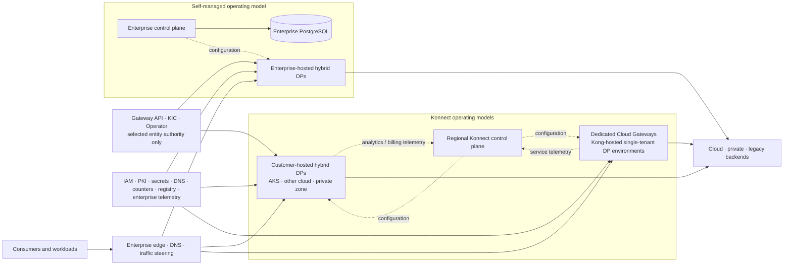
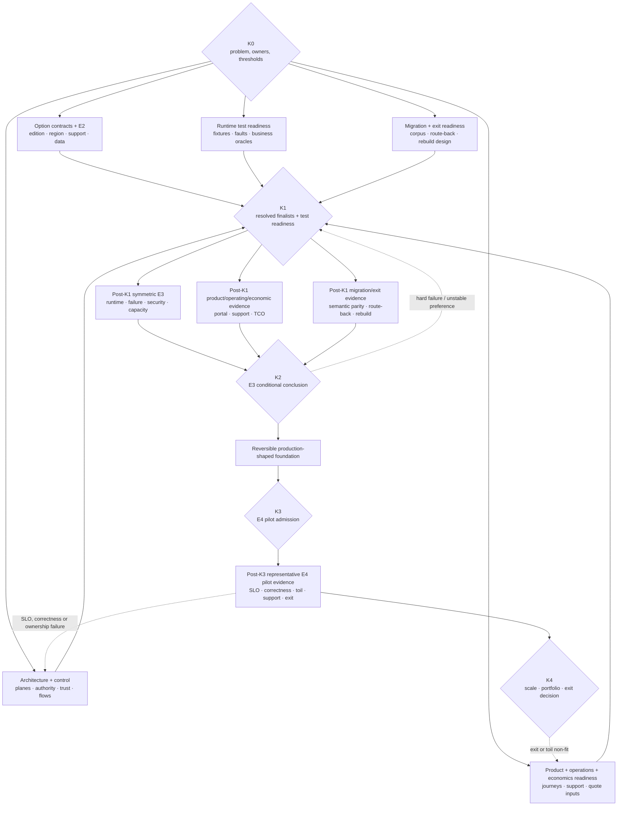
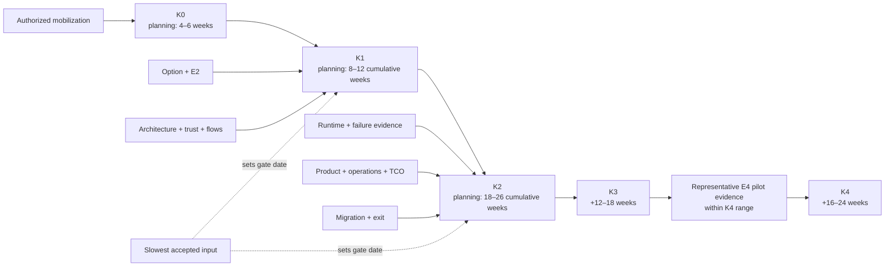

<!-- study-contract: principal -->

# Kong long-term multicloud study roadmap

| Field | Value |
|---|---|
| Artifact type | principal-study |
| Decision question | What sequenced evidence programme can determine whether one or more bounded Kong operating models should become a long-term multicloud API-management foundation without converting a promising architecture into an early product selection? |
| Decision owner | API-platform assessment decision owner with the enterprise architecture, security, resilience, product and commercial review forum |
| Primary audiences | Executives, directors, enterprise/platform/security architects, developers, DevOps, SRE, API product leaders, network engineering, operations, sourcing and FinOps |
| Scope | Konnect control plane with customer-hosted hybrid data planes; Konnect Dedicated Cloud Gateways; self-managed Kong Gateway Enterprise hybrid; KIC/Gateway API and Kong Operator authority patterns; bounded DB-less and Serverless screening; RE-1 multicloud, Kubernetes, sovereignty, migration, economics and exit questions |
| Evidence state | Falsifiable sequencing hypothesis supported by current official mechanism evidence (`E1`); no contractual (`E2`), reproducible lab (`E3`), representative pilot (`E4`), product score or selection |
| Reference case | Synthetic [RE-1 enterprise reference case](41-enterprise-reference-case.md), with every inherited count, threshold, duration and cost treated as a scenario assumption |
| As-of date | 2026-08-17; revalidate versions, geos, regions, hosting modes, plugins, entitlements, limits and support terms at every option freeze |
| Next gate | Gate K0 approves the problem ranking, exact-option fields, common evidence contract, owner capacity and stop rules; it authorizes study work, not a Kong implementation |

## Provisional answer

Continue the **symmetric Gate-1 screen of all seven canonical longlist archetypes**. This Kong roadmap is one candidate-specific projection of that common work; it grants Kong no build priority, finalist status, easier evidence burden or funding preference. Within the Kong portion of the screen, study a portfolio of separately resolved operating mechanisms rather than one product-shaped answer. Kong's documented plane separation and hosting choices shape falsifiable RE-1 tests only. They do not establish fit or justify earlier execution than the equivalent APIM, Apigee and MuleSoft-baseline work.

The Kong work therefore retains three mechanism hypotheses without ranking them:

1. **Konnect with customer-hosted hybrid data planes** may place request processing near regulated/private workloads while transferring control-plane lifecycle to Kong.
2. **Konnect with Dedicated Cloud Gateways** may provide adequate placement and private connectivity with materially less customer runtime toil, but is only a Gate-0-admitted hosting subvariant of the canonical Konnect-hybrid archetype.
3. **Self-managed Kong hybrid** may provide the required control and exit boundary when SaaS control-plane processing is unacceptable, but only if database, PKI, upgrade, backup, recovery and on-call ownership are affordable and demonstrable.

KIC/Gateway API and Kong Operator are authority and lifecycle choices layered onto those operating models; they are not generic proof of portability. DB-less and Serverless are bounded patterns, not evidence for hybrid or critical production service. Kong's AI and Event Gateway capabilities are separate workload hypotheses and must not be bundled into the core gateway decision merely because they share a vendor or control surface.

Confidence is **high** that the roadmap asks decision-bearing mechanism questions, **medium** that the two canonical Kong archetypes remain architecturally relevant within the same seven-record E1/E2 screen, **low** that either meets RE-1, and **zero** in a finalist position or ranking before Gate 1 records it. A false positive could create a multicloud fleet whose data path is distributed but whose configuration, identity, quota, telemetry, support or portal state remains an untested concentration. A false negative could reject a workable managed-control/local-runtime model because customer and vendor duties were not separated precisely.

This roadmap is therefore a **sequencing hypothesis**. It is falsified when a mandatory control, residency, recovery, operating, economic or exit condition fails; it is not rescued by feature breadth or by evidence from a different Kong topology.

## Decision boundary and RE-1 scenario

The study asks whether Kong can support a long-lived platform across Azure, another public cloud, private Kubernetes and legacy data-centre paths while keeping four things true at the same time:

- consumer-visible API contracts and identity semantics remain stable while backends move;
- request processing stays in approved workload zones without hiding control, telemetry, artifact or support flows;
- desired state, effective runtime state and business outcome remain independently provable during partial failure; and
- the enterprise can change hosting or exit the platform without recreating undocumented configuration, consumer, credential and operating state.

The RE-1 inputs used to size the proof include 4,800 ordinary, 13,500 busy-hour and 22,000 burst requests per second; J-01 money movement, J-03 partner initiation and J-06 configuration; and I-01 through I-08. These are all **scenario assumptions**, not current-estate measurements, vendor limits or pass thresholds. Gate K0 must replace or explicitly retain them before execution.

The roadmap narrows five decision tensions that a generic product review cannot resolve:

| Decision tension | Kong-shaped hypothesis | Consequence if wrong | Evidence that decides it |
|---|---|---|---|
| managed control versus enterprise control | Konnect reduces CP/database lifecycle without putting ordinary proxied payloads on the management path | metadata, support, telemetry or emergency-change rules may violate the boundary, or split support may increase incident time | field-level flow and contract ledger, control-path partition, joint support game day |
| customer-hosted versus Kong-hosted runtime | customer DPs maximize placement; Dedicated Cloud Gateways transfer runtime operations | self-hosted toil may exceed locality value, or managed network/region/plugin limits may exclude required workloads | equivalent private-path, zone/region fault, upgrade, capacity and TCO proof |
| central versus federated configuration | control-plane separation, KIC, teams and APIs may support domain autonomy | control-plane-group conflict, dual writers or global-plugin scope may create cross-domain blast radius | entity authority map, collision fixtures, effective-config attestation and recovery |
| native convenience versus portable intent | OpenAPI, Gateway API core, Git and normalized evidence may reduce switching cost | policies, consumers, portal state, analytics and credentials remain product-specific | clean rebuild and second-controller semantic-diff exercise |
| gateway consolidation versus bounded specialization | common policy/runtime can simplify REST, gRPC and selected AI/event traffic | plugins become a new integration monolith or emerging workload semantics enlarge failure/cost exposure | workload disposition, resource isolation and migration/route-back evidence |

## Top 10 industry problems and Kong hypotheses

“Top 10” means the repository’s canonical `P1`–`P10` taxonomy and order from [The ten enduring API-management industry problems](43-api-management-industry-problems.md), not a second Kong-specific ranking, market-share survey or claim that every vendor uses the same vocabulary. The canonical study derives the ordering from RE-1 consequence, pervasiveness and decision leverage, informed by the cross-vendor work in [security](25-security-comparison.md), [networking](26-networking-comparison.md), [hybrid/multicloud](27-hybrid-multicloud-comparison.md), [Kubernetes](28-kubernetes-comparison.md), [API operations](29-apiops-governance.md), [developer products](30-developer-portal-api-products.md) and [observability](31-observability-comparison.md). This table is the **Kong proof projection** of those ten problems. It preserves the canonical IDs, order and titles exactly; the Kong column identifies mechanisms to test, never achieved results.

| ID | Industry problem | Long-term multicloud consequence | Kong mechanism hypothesis | Strongest counter-hypothesis | Required proof | RE-1 mapping |
|---|---|---|---|---|---|---|
| P1 | Distributed policy and identity enforcement | identity, policy, PKI and secrets can diverge across clouds or preserve revoked access during dependency loss | OIDC, mTLS, vault references, local plugins and CP/DP mTLS may enforce a common trust contract close to workloads | application/service-mesh authorization may be the correct business-policy boundary; cached discovery, shared clustering trust or a vault/CA dependency can still violate revoke objectives | negative OAuth/JOSE/mTLS suite; CP/DP and client-certificate rotation; JWKS/vault outage; cold start; forwarded identity context; runtime denial and audit | J-01, J-03, I-02, I-03 |
| P2 | Traffic resilience and backend protection | counters, connections, retries, plugin chains and telemetry can saturate or diverge before gateway availability reveals a bad business outcome | local/Redis/eligible cluster strategies, data-plane placement and per-scope plugins may provide bounded admission and isolation | hybrid/DB-less exclude cluster strategy; Redis fallback can admit more than intended; gateway retries cannot resolve an ambiguous non-idempotent commit | mixed-journey burst and zone loss; quota correctness under replica scale/Redis partition; noisy neighbour; slow client/upstream; duplicate-outcome reconciliation; unit cost | J-01–J-05, I-01, I-04, I-06 |
| P3 | Hybrid/multicloud placement, sovereignty, and control-plane continuity | payload locality can hide configuration, credential, analytics, portal, support and recovery dependencies outside the approved boundary | Konnect regional CP plus self-hosted DPs, Dedicated Cloud Gateways or self-managed hybrid provide separately testable placement/responsibility patterns | one managed region may be safer and cheaper; Konnect geo/global-service rules may be non-fit; enterprise self-management may create a larger unowned failure domain | field-level locality ledger; connected/existing/restarted/clean-node/revoke/reconnect states; region loss/failback; E2 data/support terms and named recovery owners | all journeys; I-02, I-03, I-05, I-06 |
| P4 | Safe lifecycle change and configuration truth | automated multicloud change can delete unrelated entities, create dual writers, leave mixed versions or report success while a runtime is stale | decK, Terraform, Konnect APIs, KIC and Operator can be constrained to one declared authority and release manifest per entity class | tool surfaces have different ownership/deletion semantics; control-plane groups can conflict; rollback cannot reverse an external business or credential side effect | pinned-toolchain validation/diff/apply; deletion preview; collision and partial failure; canary/stop/rollback; per-DP effective digest; audit and clean rebuild | J-06, I-02, I-07, I-08 |
| P5 | Estate discovery, product ownership, and governance at scale | shadow routes, unowned interfaces and unknown dependencies survive migrations and make control coverage unverifiable | Konnect Catalog plus Gateway, Portal and external-system integrations may provide a governed discovery layer and API lifecycle view | a product catalog can be another incomplete registry; repository, runtime, identity, DNS and network evidence may remain authoritative elsewhere | reconcile catalog, Git, CI/CD, runtime routes, traffic, identities, DNS/certificates, products and owners; classify every mismatch and stale-detection lag | all journeys; I-07, I-08 |
| P6 | End-to-end observability and decision evidence | operators can trust an old heartbeat, miss a silent region or lose the rare trace needed to decide business correctness | local Prometheus/OpenTelemetry plus Konnect analytics/audit may provide independent operational and vendor evidence | signal gaps, queues, cardinality, sensitive data, locality and schema differences can make views costly or irreconcilable | correlation contract; produced/queued/dropped/delivered counts; sink failure and recovery; redaction/locality scan; active-config attribution; independent business query | all journeys; I-02, I-04–I-06 |
| P7 | Consumer adoption and product access | multigateway estates produce fragmented products, orphan applications and credentials that can survive unpublishing, owner departure or migration | Konnect Catalog/Dev Portal APIs, RBAC, application registration and geo-specific objects may automate a governed consumer lifecycle | portal geography, identity/application/Consumer mapping, credential export and self-managed parity may not satisfy the operating model or adoption need | internal, partner and machine journeys including approval, retry/partial DCR, first success, product change, rotation, stale-runtime revoke, offboarding, accessibility and exit | J-02–J-05; I-02, I-03 |
| P8 | Protocol expansion and the gateway/integration boundary | a “universal gateway” can accumulate stateful transformation, custom plugins and protocol-specific correctness it cannot responsibly own | Gateway/KIC may cover bounded REST/gRPC traffic; AI Gateway and Event Gateway remain separately deployed workload hypotheses | specialized integration, event, mesh, cloud-native or application components may better own files, ordering, idempotency, workflow and business reconciliation | responsibility matrix; gRPC/stream and semantic-compatibility tests; bounded AI/event pilots; resource isolation; unsupported transformation rejection and route-back | J-01, J-04, J-05; I-04, I-05, I-07, I-08 |
| P9 | Portability, coexistence, migration, and exit | portable routes alone leave policies, plugins, consumers, credentials, counters, portal history, telemetry and operations behind | OpenAPI, Gateway API core, Git-held intent, decK/Konnect APIs and parallel DPs may support layered coexistence and rebuild | Kong-specific policies and state can dominate effort; KIC conformance does not establish semantic parity; coexistence may become permanent duplicate operations | layer-by-layer export/rebuild; second-controller conformance/semantic diff; consumer re-issuance; active-state comparison; rollback/route-back and timed exit rehearsal | all journeys; I-02, I-03, I-07, I-08 |
| P10 | Sustainable federated operating model and economics | a distributed platform can become unaffordable or unsafe when central, domain, cloud, vendor and 24×7 responsibilities remain ambiguous | teams/RBAC, separate CPs, APIs, KIC role separation and selectively evaluated CP groups may enable federation; managed and self-managed options expose different toil/cost frontiers | CP-group merge/global effects and KIC incompatibility can enlarge blast radius; a simpler managed or cloud-native portfolio may deliver better risk-adjusted economics | concurrent cross-team changes; global-policy wave; RACI/on-call/support game day; upgrade and vulnerability drill; steady/failure/migration/exit cost model and concentration sensitivity | all journeys; all incidents |

The relevant official mechanisms are current but topology-specific. Kong documents hybrid CP/DP separation and customer-hosted data planes ([hybrid mode](https://developer.konghq.com/gateway/hybrid-mode/), [data-plane hosting options](https://developer.konghq.com/gateway/topology-hosting-options/)); Dedicated Cloud Gateways are Kong-managed data planes on single-tenant infrastructure while the Konnect control plane remains multi-tenant ([Dedicated Cloud Gateways](https://developer.konghq.com/dedicated-cloud-gateways/)); and Konnect geos make Gateway Services, Routes, Consumers, APIs, application registrations and portals geo-specific while authentication, billing and usage are shared ([Konnect geos](https://developer.konghq.com/konnect-platform/geos/)). These are **documented facts** used to design the work, not proof that `P1`–`P10` are solved.

Kong documents that KIC translates Kubernetes `Ingress` and `HTTPRoute` resources and treats Kubernetes state as authoritative, while upstream Gateway API defines role-oriented, portable but extensible routing resources ([KIC](https://developer.konghq.com/kubernetes-ingress-controller/), [Gateway API overview](https://gateway-api.sigs.k8s.io/docs/concepts/api-overview/)). Gateway API conformance distinguishes release channels and support levels; a core conformance report does not establish product-policy or enterprise-case equivalence ([Gateway API conformance](https://gateway-api.sigs.k8s.io/docs/concepts/conformance/)).

## Bounded Kong option register

The roadmap cannot score “Kong.” It studies a layered option space and attaches evidence only to exact combinations. The `KMC-*` identifiers below are **local evidence-track and subvariant identifiers**, not additions to the seven canonical longlist records in the [product longlist](09-product-shortlist.md). `KMC-1` and `KMC-2` are mutually exclusive customer-hosted and Kong-hosted runtime subvariants of canonical `K-KH` (labelled `K-KON` in the longlist); `KMC-3` elaborates canonical `K-SM`; and `KMC-4` through `KMC-7` are authority, lifecycle, edge or hosting experiments attached to one of those canonical records. In particular, `KMC-2` Dedicated Cloud Gateways may enter this roadmap only when Gate 0 admits it as a `K-KH` managed-runtime benchmark. It is **not an eighth candidate**, receives no separate longlist score, and cannot change candidate cardinality unless the decision owner formally amends both [the seven-option longlist](09-product-shortlist.md) and [the assessment method](03-assessment-methodology.md).

The version baseline for customer-hosted Gateway research remains the **3.14 LTS line**, consistent with the repository evidence ledger; the exact patch, image digest and support date must be frozen. Kong currently lists 3.14 as an active LTS and 3.15 as a supported non-LTS line, and warns that even patch releases can contain changes requiring changelog review ([Gateway support policy](https://developer.konghq.com/gateway/version-support-policy/)).

| Option ID | Bounded archetype | Plane placement and authority | Intended study role | Gate-1 unresolved fields | Evidence transfer prohibited |
|---|---|---|---|---|---|
| KMC-1 | `K-KH/K-KON` subvariant: Konnect regional control plane plus self-hosted Kong Gateway Enterprise hybrid DPs | Kong operates CP/database; enterprise operates DPs in AKS, another approved cloud and private zone; one approved Konnect API/decK/Terraform path per entity | customer-hosted-runtime proof track inside the canonical Konnect record; identical Gate-1 burden | Konnect edition/geo; DP patch/image/plugins; regions/clusters/network; portal/analytics; support, DPA and objectives | no result from Dedicated, Serverless, KIC DB-less or self-managed CP proves KMC-1 |
| KMC-2 | `K-KH/K-KON` Gate-0 subvariant: Konnect plus Dedicated Cloud Gateways | Kong operates CP and single-tenant DP environments in selected AWS/Azure/GCP regions; enterprise owns edge, private connectivity, upstreams, policy and evidence integration | managed-runtime benchmark inside the canonical Konnect record; not an eighth candidate or separate score | contracted regions/clouds; public/private pattern; peering/VWAN/transit/private endpoint/DNS; sizing/Autopilot; plugin constraints; upgrade/support/SLA | customer-hosted DP fault, plugin or cost results do not transfer |
| KMC-3 | `K-SM` elaboration: self-managed Kong Gateway Enterprise hybrid | enterprise operates CP, PostgreSQL, Admin API, CP/DP PKI and customer-hosted DPs across zones | enterprise-control proof track inside the canonical self-managed Kong record; identical Gate-1 burden | exact CP/DP/PostgreSQL versions, storage/backup, HA/DR, PKI, license, plugins, clusters/VMs, support and staffing | Konnect availability, audit, portal, upgrades and cost do not transfer |
| KMC-4A | KIC-managed Kubernetes routes attached to a separately resolved Konnect option | Kubernetes/Gateway API/Kong resources are authoritative for admitted entities; Konnect view is read-only for KIC-managed configuration | Kubernetes federation subvariant of KMC-1 | KIC/Gateway/Kubernetes/Gateway API versions; controller/watch scope; CRDs/policies; cluster/listener ownership; status oracle | decK-managed or control-plane-group entities cannot be assumed equivalent |
| KMC-4B | KIC-managed routes with a separately resolved self-managed CP/DP or DB-less runtime | Kubernetes resources drive KIC; runtime and CP ownership depends on the attached option | customer-controlled Kubernetes subvariant | full KIC/Gateway/CP/DB or DB-less matrix, authority partition, Admin API, support and recovery | KMC-4A Konnect behavior and KMC-3 non-KIC behavior do not transfer |
| KMC-5 | Kong Operator-managed Gateway/DataPlane/ControlPlane and optional Konnect CRDs | Operator reconciles lifecycle and, in managed-Gateway mode, creates ControlPlane and DataPlane resources from Gateway API | lifecycle-automation experiment, separate from KIC-only | Operator version/support, CRD maturity, feature gates/controllers, RBAC, certificate ownership, upgrade/rollback, KIC intersection | manual Helm/KIC operations do not prove Operator behavior |
| KMC-6 | self-managed DB-less Gateway with whole declarative configuration | enterprise owns artifact distribution; in-memory runtime state; Admin API read-only | isolated/simple edge or recovery pattern, not default enterprise topology | memory/entity bounds, whole-file promotion, secret/plugin packaging, reload, replica consistency and clean rebuild | decK `gateway` results and hybrid cached-state results do not transfer |
| KMC-7 | Konnect Serverless Gateway | Konnect provisions and places lightweight managed DPs | developer/pre-production screening only until production fit is proven | network, limits, payload, plugin, scaling, version, support, data handling and RE-1 eligibility | no critical-production or Dedicated result may be inferred |

Traditional database-backed Gateway remains an exception option only when a mandatory database-writing plugin or topology cannot be satisfied safely elsewhere. Kong documents that traditional mode connects every node to the database and is the only Kong topology supporting certain database-dependent strategies/plugins; DB-less stores whole declarative configuration in memory and has a read-only Admin API ([deployment topologies](https://developer.konghq.com/gateway/deployment-topologies/)). The exception owner must show why the added runtime database and larger compromise/recovery boundary are justified.

Current Kong documentation says Dedicated Cloud Gateways can run in AWS, Azure and GCP and provide public/private network choices, but exact features and regions are volatile and must be revalidated ([Dedicated Cloud Gateways](https://developer.konghq.com/dedicated-cloud-gateways/), [network architecture](https://developer.konghq.com/dedicated-cloud-gateways/network-architecture/)). Kong's Operator documentation describes Kubernetes custom resources and controllers for Gateway control/data-plane lifecycle; it does not establish that an admitted `KMC-5` version/feature set is supported or operationally fit ([Kong Gateway Operator](https://developer.konghq.com/operator/)). Serverless is described as a lightweight, automatically provisioned option suited to experiments and pre-production in the [data-plane hosting guide](https://developer.konghq.com/gateway/topology-hosting-options/); `KMC-7` stays out of critical production scope until the same production gates close.

**Figure KMR-1 — A long-term Kong strategy is a portfolio of separately resolved plane-placement options, not one hybrid topology.**

- **Depicted scope:** Konnect regional control, self-managed control/database, customer-hosted hybrid data planes, Dedicated Cloud Gateways, KIC/Operator authority overlays, enterprise edge/dependencies/backends and separate request/configuration/evidence paths.
- **Excluded scope:** exact editions, regions, versions, clusters, network addresses, plugin set, portal/analytics topology, commercial terms, AI/Event Gateway, achieved availability and a selected target.
- **Diagram source, evidence state and as-of:** inline synthesis from Kong's official deployment-topology, hosting, Dedicated Cloud Gateway, KIC and Operator documentation plus KMC-1 through KMC-7; E1 mechanism evidence and roadmap interpretation, no observed fit; 2026-08-17.
- **Accessible equivalent:** consumers reach an enterprise edge and then either customer-hosted DPs or Kong-hosted Dedicated DPs, which call cloud/private backends. Konnect configures both managed and customer DPs; alternatively, an enterprise CP/database configures customer DPs. KIC/Operator can own selected Kubernetes resources but must feed only the separately resolved target. Enterprise identity, PKI, DNS, counters, registries and telemetry remain dependencies.

**Figure interpretation:** KMR-1 changes the strategy question from “Kong or not” to which exact control owner, runtime owner and configuration authority is justified per workload zone. It also shows why Dedicated, self-hosted and self-managed results cannot be averaged into one Kong score.

**Figure limitation:** The figure does not show regional state, failover, Portal/Catalog, control-plane-group merge, network detail or support ownership. Every box remains an unresolved archetype until its option contract and E2/E3 evidence close.

## Mechanism analysis

The decision-bearing mechanism is the interaction of plane placement, state authority, trust, propagation, evidence and operating ownership. The following hypotheses trace those interactions before the roadmap assigns work or time.

## Plane-placement and failure-domain hypotheses

### Placement and state ledger

| State or path | KMC-1 Konnect + self-hosted DP | KMC-2 Dedicated | KMC-3 self-managed hybrid | KMC-4/5 Kubernetes authority | Mandatory evidence |
|---|---|---|---|---|---|
| desired Gateway entities | Konnect regional CP/API; pipeline is enterprise delivery authority | same Konnect authority | Admin API/PostgreSQL behind enterprise pipeline | selected Kubernetes resources are authority; Konnect/native UI must not become a writer | release ID, source commit, native receipt, object inventory and deletion scope |
| effective runtime configuration | DP memory plus local filesystem cache after receipt | Kong-managed DP copy; customer needs supported status/evidence interface | enterprise DP memory/cache | controller/Operator acceptance plus runtime configuration identity | every serving DP's effective digest/age, rejected state and known transaction |
| request payload | customer runtime zone to enterprise upstream | Dedicated DP region/network to enterprise upstream | customer runtime zone to enterprise upstream | unchanged by authority tool | packet path, field capture, latency and prohibited-destination proof |
| CP/DP trust | Konnect-issued or customer CA-signed mTLS; DP initiates connection | provider managed inside service boundary; E2/E3 details required | enterprise CP/DP PKI | Operator may manage certificate Secret lifecycle in selected pattern | chain/EKU/SNI, rotation, revoke, expiry, lost Secret and clean-node evidence |
| configuration history and administrative audit | Konnect plus source/release evidence | Konnect plus enterprise evidence | enterprise database/audit/source | Kubernetes audit/controller status plus source | actor, approval, before/after/hash, result and immutable export reconciliation |
| quota/counter | local or Redis by plugin/topology; external Redis usually required for shared accuracy | exact service/plugin strategy must be confirmed | enterprise local/Redis/eligible DB strategy | controller does not solve runtime counter state | consistency/fail policy during scale, region split and Redis recovery |
| telemetry | Konnect analytics/billing path and independent local collectors | service-native path plus approved enterprise export | enterprise collectors/storage | controller/cluster signals add another plane | produced/queued/dropped/delivered reconciliation and request-path isolation |
| portal/consumer state | geo-specific Konnect objects | same control service, regardless of managed DP | exact self-managed capability unresolved | not made portable by Gateway API | lifecycle state, location, runtime enforcement, export/rebuild and re-issuance |
| recovery authority | split vendor CP/customer DP/network/dependency | split vendor DP/CP and enterprise edge/upstream | enterprise end to end with vendor software support | split controller, cluster, CP and runtime owners | incident commander, evidence handoff, escalation clocks and recovery decision |

Kong documents that DPs initiate persistent mTLS connections, cache new configuration to local filesystem, then load from local cache, declarative fallback or empty state in that order ([CP/DP communication](https://developer.konghq.com/gateway/cp-dp-communication/)). It also documents continued cached proxying during CP disconnection, restart from cache, possible new-node provisioning paths, loss of older analytics when a buffer fills, and empty startup if neither cache nor declarative fallback exists ([hybrid mode](https://developer.konghq.com/gateway/hybrid-mode/)). These facts create **separate test states**; they do not establish an RE-1 stale-age, restart, scale or revoke result.

### Failure domains that must stay separate

1. **Request-plane availability** — listener, gateway worker, upstream, DNS, edge, identity enforcement and local dependencies.
2. **Change-plane availability** — source repository, pipeline, Konnect/Admin/Kubernetes API, controller, CP/DP link and acceptance evidence.
3. **Security-control freshness** — issuer/JWKS, consumer, CA, secret, plugin/config and emergency containment.
4. **State accuracy** — counter, product/consumer, cache, business data, idempotency, event/file and analytics state.
5. **Evidence availability** — local logs/metrics/traces, vendor telemetry, audit, collectors, SIEM and query access.
6. **Recovery supply chain** — image, chart, plugin, registry, license, secret, certificate, node/cluster capacity and supported versions.
7. **Operator access and support** — SSO, control APIs, emergency path, vendor support and cross-cloud diagnosis.

**Figure KMR-2 — Cached proxy continuity is only one state in the multicloud recovery decision.**

- **Depicted scope:** connected operation, CP/config partition, existing service, stale-age/revocation threshold, restart from cache, clean-node bootstrap, empty/unknown quarantine, reconnect, configuration reconciliation, telemetry-gap declaration and readmission.
- **Excluded scope:** exact Kong cache encryption/persistence, traffic-manager implementation, automatic quarantine, license/secret/registry behavior, elapsed thresholds, business-data readiness and observed recovery.
- **Diagram source, evidence state and as-of:** inline E3 test oracle derived from Kong's documented hybrid cache/start sequence and RE-1 J-06/I-02/I-03/I-06; E1-informed hypothesis, not a claim that Kong implements every guard automatically; 2026-08-17.
- **Accessible equivalent:** connected DPs may keep serving after the control path is partitioned. Existing, restarted and clean-node cases branch: a current cache may be admitted, an absent or unknown cache is quarantined, and excessive age or urgent revoke makes service unsafe. Reconnection is not recovery until desired/effective state agrees, the telemetry gap is declared and an outside-in transaction passes.

```mermaid
stateDiagram-v2
  [*] --> Connected
  Connected --> Isolated: CP or configuration path partitioned
  Isolated --> ExistingServing: existing DP uses accepted cache
  Isolated --> Restarting: DP restarts
  Isolated --> CleanNode: replacement or scale-out
  ExistingServing --> StaleUnsafe: age, revoke, certificate or policy limit exceeded
  Restarting --> CachedCandidate: local cache or approved fallback found
  Restarting --> UnknownEmpty: no accepted state available
  CleanNode --> CachedCandidate: governed seed plus identity and artifacts available
  CleanNode --> UnknownEmpty: bootstrap dependency absent
  CachedCandidate --> IsolatedServing: digest and readiness transaction pass
  UnknownEmpty --> Quarantined
  StaleUnsafe --> Quarantined
  IsolatedServing --> Reconciling: control path restored
  ExistingServing --> Reconciling: control path restored
  Quarantined --> Reconciling: approved recovery starts
  Reconciling --> Connected: desired equals effective; telemetry gap declared; transaction passes
```

**Figure interpretation:** KMR-2 prevents a successful call through an already-running DP from closing resilience. The mandatory evidence is safe admission of each state, especially the stale, restarted, clean-node and reconnect paths.

**Figure limitation:** The state machine does not prescribe cache copying, claim automatic quarantine or set an acceptable stale window. The organization must approve thresholds and prove any compensating traffic-admission mechanism.

### Identity, PKI and secret posture

Use four independent trust relationships: consumer-to-edge/gateway, gateway-to-identity material, gateway-to-backend and CP-to-DP. Do not reuse one certificate or identity merely because the platform permits it. Kong documents pinned and CA-signed CP/DP modes; PKI mode requires appropriate TLS server/client extended-key usages and chain handling ([CP/DP security](https://developer.konghq.com/gateway/cp-dp-communication/)). Shared keys simplify bootstrap but enlarge compromise and rotation blast radius; PKI mode is the leading enterprise hypothesis, not an approved design.

Kong's Enterprise OIDC plugin acts as resource server/relying party and caches discovery/JWKS metadata with configurable TTL and rediscovery behavior ([OIDC plugin](https://developer.konghq.com/plugins/openid-connect/)). The study must prove newly rotated, revoked and unavailable-key behavior in connected and isolated states. [RFC 9700](https://www.rfc-editor.org/info/rfc9700/) is the security baseline; product defaults do not replace issuer, audience, algorithm, replay, sender-constraint and client-credential decisions.

| Trust boundary | Leading hypothesis | Hard failure to inject | Stop condition |
|---|---|---|---|
| consumer OAuth/OIDC | external enterprise issuer; explicit issuer/audience/algorithm/scope; bounded cached discovery | wrong issuer/audience/algorithm, key rollover, issuer/JWKS outage, stale revoked key, clock skew | any fail-open, cross-tenant acceptance or unbounded stale trust |
| partner mTLS | route/SNI-specific client trust with old/new overlap and inventory by partner runtime | missing intermediate, pinned old CA, expired/revoked/wrong-EKU client, long-lived connection | unaccounted accepted old trust or partner failure outside approved rotation window |
| gateway workload identity | per-environment/zone identity to backend; backend authorizes it separately from caller | token/vault denial, audience error, identity rotation, policy-editor privilege attempt | shared credential destroys attribution or policy editor can exfiltrate unbounded backend authority |
| CP/DP mTLS | CA-signed per-node identity, automated but reviewable lifecycle | CP/DP cert rotation during partition, lost Secret, proxy/SNI change, compromised node | uncontrolled shared private key, false-ready node or no emergency revoke/replace procedure |
| secret references | eligible fields reference approved vault; cold start and refresh are explicit | vault latency/denial, expired cached value, clean Pod, export/log/support scan | secret appears in artifact/evidence or stale/denied behavior is unbounded |

### Configuration authority and propagation

One entity has one writer. A platform may use more than one tool only when entity ownership is non-overlapping and compiled into one release manifest.

| Entity class | Permitted leading authority | Prohibited overlap | Required acceptance oracle |
|---|---|---|---|
| canonical API contract | domain Git repository | mutable portal/control copy treated as canonical | contract digest, semantic compatibility corpus and published version |
| Kubernetes host/path/backend route | Gateway API/KIC in admitted KMC-4 option | decK or UI changing the same Route/Service | `Accepted`/`Programmed` or mapped status, runtime config identity and transaction |
| non-Kubernetes Gateway entity | Konnect API/decK/Terraform or self-managed Admin API path chosen per option | KIC and control API own same entity | diff, native receipt, per-DP acceptance and no unmanaged deletion |
| infrastructure/runtime | Terraform/cluster GitOps/Operator according to option | vendor UI and cluster reconciler mutate same resource without break-glass lease | image/chart/config digest, node placement, readiness and drift record |
| portal/catalog/product | Konnect API/Terraform where KMC-1/2 admitted | manual production UI state without export/reconciliation | object inventory, publication/registration state, runtime entitlement and journey test |
| emergency containment | time-bound edge/local/CP action defined before incident | permanent second writer or undocumented manual cache mutation | actor/approval, scope, effective deny, expiry and return to authority |

Kong documents `deck gateway` validation, diff, sync, apply and dump against running Admin/Konnect APIs, and explicitly excludes DB-less from that write workflow ([decK gateway](https://developer.konghq.com/deck/gateway/)). `deck gateway sync` deletes target entities absent from desired configuration unless scope is deliberately constrained ([decK sync](https://developer.konghq.com/deck/gateway/sync/)). The official Terraform provider can manage Konnect control planes, Dedicated Cloud Gateways, Gateway entities, teams and portals ([Kong Terraform](https://developer.konghq.com/terraform/)). Tool presence is E1 evidence; deletion safety, transaction boundaries, defaults, rate limits, API changes and recovery remain E3.

Control-plane groups are a **conditional federation experiment**, not the default. Kong documents that a group merges member configurations onto shared DPs; conflicts can prevent updates, global plugins affect the whole group, consumers/credentials have cross-member behaviors, KIC control planes cannot join, and the group itself is read-only ([control-plane groups](https://developer.konghq.com/gateway/control-plane-groups/)). Gate K1 must decide whether the real autonomy requirement is better met by separate runtime groups, repository/RBAC boundaries or a group with proved naming, global-policy and consumer controls.

### Observability, developer experience, sovereignty and economics

Kong's OpenTelemetry plugin can emit metrics, traces and logs to compatible backends, with signal/version and coverage qualifications; the Prometheus path remains node-oriented ([OpenTelemetry plugin](https://developer.konghq.com/plugins/opentelemetry/), [Prometheus plugin](https://developer.konghq.com/plugins/prometheus/)). The enterprise design should use a local Collector tier, explicit redaction/cardinality rules and collector internal telemetry. OpenTelemetry documents queued/retry mechanisms and produced/failed/queued/sent metrics for detecting loss ([Collector internal telemetry](https://opentelemetry.io/docs/collector/internal-telemetry/)). Neither OTLP nor a Konnect dashboard proves semantic completeness.

Konnect Dev Portal supports OpenAPI/AsyncAPI/Markdown publication, developer identity, RBAC and application registration; applications and API keys are geo-specific ([Dev Portal](https://developer.konghq.com/dev-portal/), [self-service registration](https://developer.konghq.com/dev-portal/self-service/)). The portal study therefore follows a consumer from discovery through approval, credential delivery, rotation, revoke, owner transfer and offboarding. Appearance and time-to-first-call are secondary to safe lifecycle and runtime reconciliation.

Economics must allocate the complete system:

- subscription, DP and separately entitled features;
- customer clusters/nodes, load balancers, private connectivity, DNS, NAT/egress and storage;
- Redis or other counter/cache dependencies;
- collectors, telemetry egress/ingestion/retention, SIEM and native analytics;
- PKI, vault, identity and certificate operations;
- CP/PostgreSQL lifecycle for KMC-3;
- KIC/Operator/CRD and cluster upgrades for KMC-4/5;
- platform/SRE/security/network/support labour, after-hours coverage and vendor escalation;
- dual run, migration, credential transition and decommission; and
- exit/rebuild, data/history gaps and switching cost.

The option is economically non-fit when its preference disappears under plausible demand, telemetry, staffing, egress, support or migration sensitivity, unless the steering forum explicitly accepts the switching condition.

## Study workstreams, sequencing and gates

Run the roadmap as five converging evidence streams: option/contract, architecture/control, runtime/failure, product/operations/economics, and migration/exit. Parallelism is permitted only when owners and environments are distinct. A fast Kong build must not establish a de facto production foundation before alternatives receive the same Gate-1 treatment.

**Figure KMR-3 — Pre-Gate-1 readiness, post-Gate-1 E3 execution and post-Gate-3 E4 evidence are separate decision states.**

- **Depicted scope:** Gate K0 decision contract; five pre-K1 readiness streams; K1 exact-option screen; separately authorized post-K1 E3 runtime, product/operations/economics and migration/exit execution; K2 conditional conclusion; reversible foundation; K3 pilot admission; explicit post-K3 E4 pilot evidence; K4 scale/portfolio decision and recycle/stop paths.
- **Excluded scope:** approved calendar, staffing, candidate count, environment design, procurement decision, production progress and a claim that a gate has passed.
- **Diagram source, evidence state and as-of:** inline dependency synthesis from the workstream and gate tables in this roadmap plus the repository/delivery roadmaps; planning hypothesis with scenario ranges, no committed programme; 2026-08-17.
- **Accessible equivalent:** K0 authorizes five parallel readiness streams. Exact option/E2, architecture/control, runtime fixtures, product/operating/economic inputs and migration/exit designs converge at K1. K1 may authorize separate symmetric E3 execution streams, whose evidence converges at K2. A reversible foundation can then reach K3 pilot admission. Representative E4 pilot evidence is collected only after K3 and must converge before K4 can scale, narrow or stop; failures recycle to the responsible earlier state.

**Figure interpretation:** KMR-3 removes any circular implication that runtime evidence both precedes and follows K1. Pre-K1 work establishes test readiness; K1 authorizes symmetric E3 execution; K3 authorizes production pilots; and explicit E4 evidence, rather than pilot admission alone, is required for K4. The slowest independent evidence stream remains the critical path.

**Figure limitation:** The figure does not assign people or dates, prove that any option reaches a gate, or imply that K2/K3 foundation work can bypass the canonical seven-option method. Its recycle links are governance logic rather than forecasted rework. The capacity-loaded action register and restricted commercial plan must provide the executable schedule.

### Gate model

| Gate | Decision unlocked | Minimum exit evidence | Automatic hold or stop |
|---|---|---|---|
| K0 — study contract | fund bounded research and reversible fixtures | accepted or calibrated canonical `P1`–`P10` taxonomy/order, RE-1 calibration plan, option schema, mandatory thresholds, owners/capacity, comparable alternatives, evidence/public boundary | no accountable decision owner; no representative workload; hard-gate or exception authority undefined |
| K1 — exact options and proof readiness | admit equivalent options to E3 | immutable option BOMs, E2 entitlements/data/support, physical views, one-writer map, common fixtures, independent reviewers, applicability of every mandatory protocol | undefined edition/topology; asymmetric evidence; trial substitutes for licensed need; prohibited field flow; unsupported version matrix |
| K2 — conditional technical/economic conclusion | select with enforceable conditions, request targeted proof or stop | raw E3 bundles, mandatory dispositions, support game day, scenario TCO/exit, common-evidence comparison, sensitivity and dissent | failed security/correctness/residency/recovery gate; unexplained state; preference unstable; unowned support seam |
| K3 — production-shaped pilot admission | admit bounded non-critical or approved critical pilot | reversible foundation, on-call/runbooks, config/evidence controls, capacity, recovery/route-back, product/consumer plan, change/risk approval | false-ready runtime, untested recovery, missing owner, no independent evidence, candidate-specific foundation creates unacceptable lock-in |
| K4 — long-term portfolio and scale | scale accepted patterns, retain bounded coexistence or exit | E4 SLO/correctness/toil/support/cost, two representative workload patterns, upgrade/rotation game day, clean rebuild/exit rehearsal, residual-risk acceptance | pilot succeeds by heroics, integration logic accumulates in plugins, upgrade/support burden exceeds capacity, exit is unreconstructable |

### Workstream roadmap

All ranges below are **scenario elapsed-time ranges after prerequisites and staffed owners exist**, not promises, forecasts or person-effort. Workstreams overlap.

| Workstream | Canonical problems | Study question | Exact evidence outputs | Owner | Dependencies | Entry gate | Exit gate | Scenario range |
|---|---|---|---|---|---|---|---|---|
| WS-01 problem calibration and comparative contract | `P1`–`P10` | Are canonical `P1`–`P10` representative, mandatory gates explicit and alternatives symmetric? | approved problem/criterion map; calibrated RE-1 deltas; decision/exception/dissent rights; alternative-archetype list; source freshness plan | assessment decision owner + enterprise architecture | business/SRE/security/product owners | mobilization | K0 | 2–4 weeks |
| WS-02 Kong option and entitlement resolution | `P3`, `P4`, `P7`, `P9`, `P10` | What exact purchasable/deployable KMC subvariants exist inside canonical `K-KH/K-KON` and `K-SM`? | canonical-record/subvariant map; option contracts; images/charts/tool versions; plugin/portal/analytics matrix; geos/regions; E2 DPA/SLA/support/order; exclusions | Kong technical owner + sourcing | vendor access, workload needs, WS-01 | K0 | K1 | 3–7 weeks |
| WS-03 plane, data and network architecture | `P1`, `P3`, `P6`, `P9` | Where do request, config, identity, telemetry, support and recovery paths run? | candidate physical views; field-flow/location ledger; restricted FQDN/port/initiator matrix; failure-domain and RACI map | platform/network/security/privacy architecture | WS-02, enterprise network/residency rules | K0 | K1 | 4–8 weeks |
| WS-04 identity, PKI, secrets and security control profile | `P1`, `P3` | Can trust be enforced and rotated in every state without fail-open or secret leakage? | canonical control profile; negative fixtures; trust/certificate inventory; secret treatment; CP/DP/client/backend rotation plan | IAM/PKI/security engineering | WS-02/03, issuer/vault test tenants | K0 | K1 design; K2 results | 5–10 weeks |
| WS-05 APIops, federation and configuration truth | `P4`, `P9`, `P10` | Can domain autonomy produce one approved effective state without destructive or competing writers? | entity-authority map; release-manifest schema; pinned decK/Terraform/KIC/Operator pipelines; collision/deletion/default fixtures; drift/recovery record | API platform + release engineering | WS-02, repository/cluster access, WS-03 | K0 | K2 | 6–12 weeks |
| WS-06 Kubernetes and runtime lifecycle | `P3`, `P4`, `P9`, `P10` | Which KIC/Operator/manual pattern is supportable across target clusters? | compatibility matrix; Gateway API conformance; RBAC/admission dump; controller/status tests; clean-node, disruption and upgrade bundle | container platform + SRE | exact clusters, WS-02/03/05 | K1 | K2 | 6–12 weeks |
| WS-07 resilience, performance and traffic economics | `P2`, `P3`, `P6`, `P10` | Do each placement/counter/plugin design and failure state meet approved journey objectives? | immutable load/fault bundles; per-state readiness/config; capacity saturation; quota consistency; zone/region recovery; cost per successful journey | performance/resilience engineering | representative backends, WS-03–06, calibrated thresholds | K1 | K2 | 8–14 weeks |
| WS-08 observability, audit and incident support | `P6` | Can responders reconstruct failure and declare missing evidence without exposing data? | normalized schema; dashboards/queries; redaction/cardinality scan; produced/dropped reconciliation; incident/support game-day record | SRE/observability + security operations | collector/SIEM capacity, WS-02/03/07 | K1 | K2 | 6–12 weeks |
| WS-09 developer/product lifecycle | `P7` | Does the admitted portal/catalog pattern close discovery through runtime offboarding across geos? | persona journeys; application/Consumer mapping; DCR/approval/rotation/revoke evidence; accessibility result; export/rebuild inventory | API product + developer experience + IAM | exact portal entitlement, WS-02/04/05 | K1 | K2 | 5–10 weeks |
| WS-10 operating model, support and economics | `P10` | Is each customer/vendor boundary staffed, supportable and stable under sensitivity? | service blueprint; on-call/RACI; joint diagnostic exercise; quote-based five-year TCO; low/base/high sensitivity; switching variables | platform product + service management + FinOps/sourcing | all BOM/flow/runtime inputs | K1 | K2 | 6–12 weeks |
| WS-11 migration, coexistence and exit | `P8`, `P9` | Can representative gateway- and integration-dominant workloads move and route back without lost state or hidden lock-in? | responsibility decomposition; semantic/golden corpus; route allocation; dual-run/credential plan; reconciliation; clean rebuild; decommission dependency register | migration/integration + domain teams | real workload access, WS-03–10 | K1 | K2 design; K3/4 result | 8–16 weeks E3; 12–20 additional pilot weeks |
| WS-12 emerging API, AI and event boundary | `P8` | Which AI/MCP/A2A, gRPC and Kafka needs belong on a Kong capability versus a separate platform? | workload disposition; exact AI/Event option; data/threat/cost model; protocol fixtures; resource-isolation and exit evidence | enterprise architecture + AI/event platform owners | observed demand, WS-01/02/04/07/08 | K1 only when material | K2 or separate decision | 6–12 weeks per admitted slice |
| WS-13 estate discovery, ownership and reconciliation | `P5` | Can the study establish a trustworthy estate denominator and accountable owner across sources before claiming governance coverage? | normalized asset inventory; catalog/Git/CI-CD/control/runtime-route/traffic/DNS-certificate/identity-client/product/owner reconciliation; matched, unmatched, excluded-with-owner-and-expiry and stale counts; provenance/freshness ledger; orphan escalation record | API portfolio governance + enterprise architecture | source connectors and owners, WS-01/02/03 | K0 | K1 baseline; K3/K4 refresh | 6–12 weeks, then continuous |

### Canonical problem-to-evidence crosswalk

This table is the controlling trace from the canonical problem taxonomy to work ownership, executable evidence and decision gate. A protocol may support several problems, but no problem can be marked covered merely because a workstream exists.

| Canonical problem | Owning workstream(s) | Required KMR protocol(s) | Decision gate |
|---|---|---|---|
| `P1` Distributed policy and identity enforcement | WS-04, enabled by WS-03/05 | KMR-P01, KMR-P03, KMR-P04, KMR-P05 | K1 design completeness; K2 E3 disposition |
| `P2` Traffic resilience and backend protection | WS-07 | KMR-P04, KMR-P07 | K2 |
| `P3` Hybrid/multicloud placement, sovereignty, and control-plane continuity | WS-03, WS-06, WS-07 | KMR-P01, KMR-P02, KMR-P04, KMR-P06, KMR-P11 | K1 option/flow readiness; K2 E3 disposition |
| `P4` Safe lifecycle change and configuration truth | WS-05, WS-06 | KMR-P02, KMR-P05, KMR-P06 | K2 |
| `P5` Estate discovery, product ownership, and governance at scale | WS-13 | KMR-P13 | K1 estate baseline; refresh at K3 and K4 |
| `P6` End-to-end observability and decision evidence | WS-08, enabled by WS-03/07 | KMR-P01, KMR-P08 | K2 |
| `P7` Consumer adoption and product access | WS-09 | KMR-P09 | K2 |
| `P8` Protocol expansion and the gateway/integration boundary | WS-11, WS-12 when material | KMR-P10, admitted KMR-P12 | K2 boundary disposition; K4 E4 confirmation |
| `P9` Portability, coexistence, migration, and exit | WS-11, enabled by WS-05/06 | KMR-P05, KMR-P06, KMR-P09, KMR-P10 | K2 design/result; K4 exit rehearsal |
| `P10` Sustainable federated operating model and economics | WS-10, enabled by WS-05/06/07 | KMR-P05, KMR-P07, KMR-P11 | K2 sensitivity/support disposition; K4 E4 confirmation |

Kong's current official documentation describes AI Gateway as a plugin-based governance/connectivity layer and Event Gateway as a separate Konnect-controlled, customer-hosted Kafka proxy ([AI Gateway](https://developer.konghq.com/ai-gateway/), [Event Gateway architecture](https://developer.konghq.com/event-gateway/architecture/)). Those documented surfaces justify WS-12 test design only. They do not establish that prompt/agent policy, Kafka semantics, data handling, latency, scale, economics or support belong inside the core APIM platform.

## PoC protocol portfolio

Every protocol uses the same bundle contract: exact option/BOM, source/config hashes, environment, workload and fault parameters, synchronized timeline, raw results, validity/abort decision, deviations, first-run failures, independent review and decision impact. A tuned rerun never overwrites the failed run.

| Protocol ID | Procedure | Measure and pre-run acceptance rule | Required evidence output | Stop/non-fit trigger | Accountable owner / reviewer |
|---|---|---|---|---|---|
| KMR-P01 — plane and field truth | trace tagged config, consumer, credential, request, telemetry, debug, support and backup data through KMC-1/2/3 | 100% of declared classes have observed or E2 location/operator/retention; zero unexplained prohibited transfer | packet/field/storage ledger, configuration and contract references | prohibited or unidentifiable mandatory data path | privacy/security / independent data-governance reviewer |
| KMR-P02 — disconnected-state matrix | partition CP/config DNS/TLS; exercise existing DP, restart, cache deletion, declarative fallback, clean node, new config/revoke and reconnect | zero empty/unknown/stale-beyond-rule DP serves; separately approved existing/restart/scale/change objectives close | cache/config/artifact, per-DP digest, request and timeline bundle | false-ready service, unbounded stale state or no sustainable emergency containment | SRE/platform / resilience reviewer |
| KMR-P03 — identity and PKI lifecycle | run OAuth/JOSE negative matrix; rotate issuer key, partner CA, backend and CP/DP certificates; deny IdP/vault and restart | zero fail-open/cross-tenant accept; approved revoke/overlap objectives; zero secret leakage | token/cert/handshake, config identity, vault and audit bundle | trust cannot be bounded or old access remains unaccounted | IAM/PKI/security / independent security tester |
| KMR-P04 — multicloud packet path and recovery | run public/partner/private paths; deny each flow; lose zone/region; inject stale backend/config and DNS/client cache delay | traffic enters only composite-ready region; no bypass; source/identity/route semantics and non-idempotent outcomes remain classifiable | DNS/LB/route/flow logs, config/data epochs, business reconciliation | HTTP health routes critical traffic to stale/unknown state or retry duplicates outcome | network/SRE/domain / resilience board |
| KMR-P05 — authority, collision and configuration safety | concurrent cross-repo routes; control-plane-group conflicts if admitted; decK omitted entity; incompatible/defaulted config; isolated runtime; rollback/forward fix | zero collision/exposure, destructive surprise or false-complete; every runtime maps to one approved release | signed release manifest, native receipts, diff/deletion set, runtime inventory | two writers, unbounded group blast radius or unreconstructable release | APIops/platform / release engineering reviewer |
| KMR-P06 — Kubernetes lifecycle | run Gateway API conformance plus unauthorized attachment, missing dependency, clean node, node drain + zone loss, CRD/KIC/Operator/Gateway upgrade and failed rollback | authorized intent only; no false `Programmed`; approved critical slice holds; one supported recovery authority | version matrix, manifests, status, RBAC/audit, scheduler/runtime results | unsupported version set, privilege boundary failure or recovery needs uncontrolled second writer | container platform / platform security and SRE reviewers |
| KMR-P07 — quota, capacity and noisy neighbour | ordinary/busy/burst plus high-cardinality tenant; scale DPs; add Redis latency/partition/recovery; compare local/shared strategy | journey SLO/headroom and approved quota semantics hold; all saturation/counter divergence and cost are visible | load profile, gateway/dependency resources, counter ledger, unit-cost model | critical financial/commercial quota weakens or shared dependency violates objective | performance/SRE/product risk / independent performance reviewer |
| KMR-P08 — telemetry backpressure and forensic completeness | throttle local and vendor destinations under burst/cardinality; fill queues; restart; recover/fail over; search tagged secrets | approved request-impact envelope; produced/queued/dropped/delivered reconcile; zero prohibited field; gap explicitly declared | raw signal counts, collector self-metrics, DLP report, incident query record | optional telemetry impairs critical traffic or loss/privacy is unknowable | observability/security / independent incident responder |
| KMR-P09 — consumer lifecycle | internal/partner/machine personas discover, request, retry DCR, approve, use, rotate, transfer owner, revoke during stale runtime, offboard and rebuild | one logical app/contract; no orphan credential; runtime state matches portal; accessibility and owner controls meet approved objective | portal/API/IdP/runtime inventories, persona evidence, audit and rebuild diff | portal state cannot prove runtime denial/ownership or requires unsafe secret handling | API product/IAM / consumer security reviewer |
| KMR-P10 — migration and exit | move one gateway-dominant and one integration-dominant workload; shadow where safe; weighted cutover; lose response; route back; reconcile; rebuild elsewhere | zero unexplained business variance; route-back and state reconciliation accepted; every non-secret entity restored/transformed/recreated | behavior corpus, allocation, transaction/event/file/state ledger, entity diff and effort | plugin/business-logic monolith, irrecoverable state or unsafe rollback | domain/integration/migration / architecture assurance |
| KMR-P11 — Dedicated versus self-hosted parity | implement same policy/identity/private-backend/telemetry workload on KMC-1 and KMC-2; run scale, upgrade, zone/region and support scenario | same mandatory outcomes; transferred duty and limitations reflected in TCO/support; no evidence transfer | option-specific results, provider service events, joint diagnostic and cost comparison | managed path lacks required region/network/plugin/evidence or self-hosted toil is unsustainable | platform/SRE/sourcing / service-management reviewer |
| KMR-P12 — emerging protocol boundary | run representative gRPC stream and, only when approved, one AI/agent and one Kafka/event case with failure/cost/privacy tests | semantics, data boundary, resource isolation, evidence and route-back meet workload-specific contract | protocol captures, model/event policy, latency/cost, privacy and exit artifacts | business state or volatile provider logic moves into plugins without sustainable owner | AI/event/domain platform / independent architecture review |
| KMR-P13 — estate truth and ownership reconciliation | snapshot and normalize Konnect Catalog/Portal, Git/spec repositories, CI/CD, Konnect/Admin/Kubernetes runtime routes, observed traffic, DNS/certificates, identity clients, products and CMDB/owner records; classify every observed endpoint and relationship | 100% of the approved observation denominator is classified as matched/current, intentional exclusion with accountable owner and expiry, or incident; source provenance/freshness and unmatched/stale/orphan counts are explicit; no pilot API lacks an accountable owner | immutable source extracts/hashes; normalized asset-and-relationship inventory; match/mismatch matrix; traffic/DNS/identity orphan list; owner/expiry attestations; coverage and freshness report | coverage is claimed by excluding an observed runtime, traffic, DNS or identity asset; denominator/provenance is unknown; an admitted pilot remains unowned; or critical mismatches have no bounded remediation owner/date | API portfolio governance / independent enterprise-architecture and audit reviewer |

The plugin matrix must be resolved per option. Kong's compatibility table shows that topology and hosting mode change plugin support and that hybrid/DB-less rate limiting excludes the cluster strategy ([plugin compatibility](https://developer.konghq.com/plugins/compatibility/)). Kong also documents Redis disconnection fallback to local counters, allowing more aggregate requests than the shared limit ([rate-limiting strategies](https://developer.konghq.com/gateway/rate-limiting/strategies/)). KMR-P07 treats that consequence as a correctness/security design decision, not merely a performance detail.

## Timeline scenarios, ownership and dependencies

The calendar is governed by the latest closing evidence stream. The following are **Kong-workstream internal scenario assumptions** after mobilization, access and owners exist; they are not additive promises and do not replace the enterprise Gate 0–4 calendar in the [repository roadmap](39-repository-roadmap.md) or [delivery roadmap](36-implementation-roadmap.md). `K0`–`K4` map to those enterprise gates only as local evidence checkpoints. Where a local and enterprise range differ, portfolio planning and the steering decision use the **later upper bound**; a Kong-local estimate can lengthen the critical path but can never accelerate candidate screening, conditional selection, pilot admission or scale. The optimistic minima below are therefore aligned to the canonical minima, while the planning/constraint cases expose extra Kong-specific evidence risk.

| Milestone | Optimistic learning case | Planning case | Constraint case | Primary switching variable |
|---|---:|---:|---:|---|
| K0 accepted | 4 weeks | 4–6 weeks | 6 weeks | decision-owner availability and RE-1 calibration |
| K1 exact options/test readiness, cumulative | 7 weeks | 8–12 weeks | 16 weeks | E2 vendor terms, environments, private connectivity and version matrix |
| K2 E3 conditional conclusion, cumulative | 12 weeks | 18–26 weeks | 34 weeks | equivalent fault/security/performance proof, specialist/reviewer capacity and failed reruns |
| K3 production-shaped pilot readiness after K2 | 8 weeks | 12–18 weeks | 26 weeks | identity/network/PKI, support/on-call, risk/change approval and reversible foundation |
| K4 representative E4 scale decision after K3 | 12 weeks | 16–24 weeks | 36 weeks | real workload change, consumer coordination, incident/upgrade observation and reconciliation |
| longitudinal strategy review | two quarters | three–four quarters | six quarters | seasonal demand, support behavior, platform toil, version drift and exit rehearsal |

**Figure KMR-4 — Elapsed time to a defensible conclusion is controlled by the last independent evidence stream, not by the fastest gateway build.**

- **Depicted scope:** scenario cumulative ranges for K0, K1 and K2, then additional K3 and K4 ranges; slowest-stream dependency and non-additive overlap.
- **Excluded scope:** approved start/date, effort, named staffing, procurement duration, alternative-candidate schedule, probability distribution and actual progress.
- **Diagram source, evidence state and as-of:** the immediately preceding Kong-local timeline table compared with the canonical repository and delivery roadmaps; synthetic planning ranges, with the later applicable upper bound governing, not a delivery commitment; 2026-08-17.
- **Accessible equivalent:** the Kong-local planning case reaches K0 in 4–6 weeks, K1 in 8–12 cumulative weeks and K2 in 18–26 cumulative weeks; K3 then needs 12–18 additional weeks and K4 16–24 additional weeks. The canonical plan remains authoritative, and the later upper bound applies. Optimistic and constraint ranges are shown in the table. Work overlaps, and the slowest accepted evidence stream controls each gate.

**Figure interpretation:** KMR-4 exposes why a two-week installation cannot create a two-week platform decision. Option contracts, field flows, runtime proof, operating economics and migration/exit evidence can run in parallel, but each gate waits for its last mandatory input.

**Figure limitation:** The ranges are uncalibrated Kong-local planning assumptions and do not model resource probability, rework or external procurement in detail. They cannot shorten the canonical enterprise gate range; the later bound governs. The organization must capacity-load tasks before publishing dates.

### Capacity and dependency rules

| Scarce capacity | Minimum responsibility in this study | Dependency that commonly arrives too late | Control |
|---|---|---|---|
| platform engineering | exact environments, pipelines, runtime lifecycle and evidence capture | same team builds alternatives and foundation simultaneously | cap concurrent options and preserve symmetric engineering time |
| SRE/performance | failure model, load validity, SLO and recovery review | joins after topology is fixed | co-own WS-03/06/07 from K0 |
| IAM/PKI/security/privacy | trust, field flow, secret, revoke and evidence acceptance | test IdP/vault/cert path unavailable | reserve representative tenants/certificates and reviewers before K1 |
| network/DNS/edge | restricted flow matrix, private paths, failover and capture | peering/firewall/proxy lead time | begin reversible discovery at K0; no broad internet shortcut |
| domain/integration teams | business oracle, state/retry/reconciliation and migration | toy echo API substitutes for representative journey | K1 requires named J-01/J-03/J-05 owners and fixtures |
| sourcing/FinOps/service management | E2 terms, TCO, support seam and exit | arrives after technical preference is visible | quote/support/sensitivity is a K2 mandatory input |
| independent reviewers | validity, negative results, dissent and gate disposition | implementer self-certifies | book reviewers and evidence-access boundary at K0 |

## Decision implications

1. Resolve **KMC-1, KMC-2 and KMC-3 as distinct evidence tracks** only when each can be given an exact option contract. KMC-1 is the customer-hosted-runtime track inside canonical `K-KH/K-KON`, KMC-2 its Gate-0-admitted managed-runtime benchmark subvariant and KMC-3 the enterprise-control track inside canonical `K-SM`; each retains the common Gate-1 burden, and no local track receives finalist status or a separate longlist score.
2. Resolve KIC and Operator as separate authority/lifecycle subvariants. Do not mix a KIC result, an Operator result and a manually managed hybrid result into one “Kubernetes-native” score.
3. Treat control-plane groups as a high-consequence federation experiment. Their merge, global-plugin, credential, analytics and conflict semantics must close before shared-fleet adoption.
4. Make CP partition, cold restart, clean-node scale, urgent revoke, reconnect, Redis failure, telemetry backpressure, certificate rotation and state-aware region recovery mandatory. Warm cached proxying alone cannot pass multicloud resilience.
5. Keep gateway plugins bounded to transport/policy concerns. Business idempotency, workflow, durable state, large transformation, file/batch and connector behavior stay in domain/integration capabilities unless a separately approved architecture says otherwise.
6. Maintain an enterprise canonical contract, control profile, consumer identity mapping, release manifest and normalized evidence schema outside any one vendor surface. Native artifacts remain necessary but replaceable.
7. Price the full dependency and support system. A customer-hosted DP is not cheaper because its container is small, and a Dedicated DP is not “fully managed” for enterprise edge, identity, backend, policy, evidence and incident responsibilities.
8. Admit AI Gateway and Event Gateway only through observed workload demand and separate decision contracts. Sharing Konnect is a possible operational advantage, not proof that combining API, AI and Kafka governance lowers total risk.
9. Preserve a symmetric APIM/Apigee/other managed benchmark through K2. Kong can be technically capable and still be the wrong operating/economic choice.
10. Update this study, its sources and site projection whenever a version, geo, hosting, plugin, Kubernetes, portal or support fact changes; stale product facts cannot carry forward silently.

## Counter-hypotheses, stop criteria and non-fit conditions

### Counter-hypotheses

| Counter-hypothesis | When it may be stronger | Equivalent proof required | Decision effect |
|---|---|---|---|
| provider-managed APIM/Apigee is better | most workloads and identity/network investment sit in one cloud and managed accountability outweighs runtime placement | same RE-1 security, failure, portal, APIops, private path, support, TCO and exit evidence | remove or narrow the exact Kong subvariant from finalist consideration at the common gate |
| per-cloud native gateways plus enterprise governance are better | physical locality/autonomy matters more than one runtime and the organization can govern multiple native implementations | common-control compilation, consumer/catalog mapping, evidence normalization, support and switching-cost proof | prefer a federated multi-runtime portfolio |
| Dedicated Cloud Gateways dominate KMC-1 | required regions/private paths/plugins fit and transferred upgrades/capacity materially reduce toil | KMR-P11 with E2 support/SLA and five-year sensitivity | if canonical `K-KH/K-KON` advances, condition its eligible-zone runtime on KMC-2 evidence; do not create another candidate |
| KMC-3 is necessary for sovereignty | Konnect metadata/operator/geo boundary fails a non-negotiable control and enterprise CP operations are funded | database/CP/PKI restore, upgrade, staffing, support and exit proof | retain canonical `K-SM` only with explicit operating conditions |
| KIC/Gateway API plus a simpler gateway is sufficient | primary need is Kubernetes routing and standard core semantics, not rich product/portal/analytics | second-controller conformance, security/product lifecycle and lower-cost operating proof | narrow Kong scope or choose a simpler runtime |
| retain bounded Mule/integration or specialized event/AI platforms | workload state, connector, file, event or AI semantics make gateway consolidation risky | responsibility inventory, representative migration, route-back, lifecycle and TCO | retain coexistence; prohibit plugin rewrite |
| no candidate fits | every option fails a mandatory security, residency, correctness, operability, support, economic or exit gate | equivalent gate record and independent review | stop, redesign requirements or approve explicitly reduced scope |

### Automatic stop or non-fit conditions

- a mandatory payload, credential, consumer, telemetry, backup or support data class has an unapproved or unknowable processor/location;
- any empty, unknown, expired or stale-beyond-policy DP can become ready and receive production traffic;
- urgent consumer/route/CA containment cannot meet the approved objective during isolation and no sustainable local/edge control exists;
- one entity can be mutated by overlapping KIC, decK, Terraform, Operator, UI or emergency writers without a bounded break-glass lease and reconciliation;
- a mandatory plugin/policy is unsupported in the exact topology or requires a database/custom agent that changes the option boundary;
- CP/DP, client or backend trust cannot rotate with attributable per-runtime state and removal of old trust;
- quota/counter degradation permits unacceptable financial, partner, tenant or backend-protection behavior;
- optional telemetry/export failure materially impairs critical request processing or its loss/privacy cannot be quantified;
- region promotion can occur on gateway HTTP health without current config, identity, backend data and business-state readiness;
- self-managed CP/PostgreSQL or customer-hosted Kubernetes lacks funded 24×7 ownership, isolated restore, supported upgrade and joint vendor escalation;
- the option preference changes under plausible labour, support, telemetry, egress, growth, migration or exit sensitivity without an accepted switching condition;
- representative migration requires durable business workflow/state/connector logic in custom gateway plugins;
- the non-secret configuration/product/consumer/evidence inventory cannot be rebuilt or intentionally transformed in a clean environment; or
- alternative candidates did not receive comparable questions, environments, evidence thresholds and independent review.

## Falsification and proof plan

This roadmap's provisional answer is falsified in two directions. A KMC subvariant fails Gate-1 eligibility or a later mandatory disposition when it cannot meet required mechanisms or its economic/operating conclusion is unstable. Conversely, a Kong subvariant closing its own tests faster remains insufficient for advancement until equivalent alternatives complete the common gate. Thresholds are approved before results are visible; the values in RE-1 remain scenario assumptions until calibrated.

| Proof ID | Procedure | Measure | Acceptance threshold | Evidence artifact | Independent reviewer |
|---|---|---|---|---|---|
| KMR-F1 — option precision, estate truth and comparative symmetry | resolve one immutable KMC subvariant and equivalent alternatives; execute KMR-P13; run category/evidence missingness review | unresolved option fields, E1/E2 coverage, test equivalence, excluded claims, estate denominator, mismatches, stale assets and owner gaps | zero unresolved field that changes a mandatory mechanism; no evidence transfer; equivalent hard-gate plan; every observed asset classified and every admitted pilot owned | option contracts, source/entitlement matrix, physical views, normalized estate reconciliation and review record | assessment assurance lead |
| KMR-F2 — safe multicloud control/runtime boundary | execute KMR-P01–P06 across every claimed zone and authority pattern | field locations, effective config, isolation states, trust, packet paths, writer conflicts, runtime acceptance | all mandatory field/trust/config/readiness rules close; zero false-ready or cross-tenant result | raw plane/security/APIops/Kubernetes bundles and sanitized index | architecture, privacy and security panel |
| KMR-F3 — resilient business and evidence outcomes | execute KMR-P07–P08 with J-01/J-03/J-06 and I-01–I-06 | journey SLO/correctness, saturation, counter divergence, telemetry loss, config/data readiness and operator action | approved business objectives hold or fail explicitly; zero unexplained business outcome or evidence-completeness claim | load/fault/business/signal timeline and reconciliation | resilience and business-risk panel |
| KMR-F4 — viable consumer/operating/economic model | execute KMR-P09/KMR-P11 plus support game day and low/base/high model | lifecycle closure, owner toil, incident handoffs, unit/five-year cost, sensitivity and regret | no orphan access/unowned seam; preference stable or switching variable accepted | persona/audit/support evidence and versioned financial model | API product, service management and FinOps |
| KMR-F5 — reversible modernization and exit | execute KMR-P10 and admitted KMR-P12; rebuild a clean target without source-control-plane access | semantic variance, durable outcome, manual transformations, missing history, effort, route-back and dependency zero | zero unexplained critical variance; all entities classified; rollback/forward-fix and credential reissue explicit | migration corpus, state/event/file ledger, rebuild diff and route-back record | domain/data/integration architecture |
| KMR-F6 — longitudinal sustainability | operate representative E4 pilots through upgrade, certificate rotation, incident, demand peak and support interaction | SLO/error budget, change failure, toil, upgrade/restore time, support response, cost and drift | K4-approved objectives and staffing envelope; no hero-only procedure or undisclosed exception | pilot service review, game-day bundles, incident/support and cost trend | independent operational-readiness board |

## Risks and limitations

- This study is intentionally Kong-focused and is susceptible to anchoring. Comparative alternatives must retain equivalent engineering and review capacity.
- Official documentation is E1 evidence. It does not establish contracted entitlement, regional availability, support duty, data processing, enabled configuration or achieved result.
- The KMC option list may change as Kong services, plugins, geos, Gateway/KIC/Operator versions and support policies change. Every freeze records the retrieval date and revalidation trigger.
- RE-1 is synthetic. Its traffic, estate, staffing, objectives and costs may overstate or understate a real organization's multicloud need.
- A successful E3 lab cannot prove rare vendor incident behavior, long-term staff sustainability, seasonal demand, enterprise adoption or exit. E4 and contract evidence remain required.
- Gateway API improves routing-intent role separation and portability, but policy attachment is extensible/implementation-specific; it does not make identity, products, portal, analytics or plugins portable.
- Cached request proxying can coexist with stale trust, wrong counters, unavailable backends, missing evidence or unsafe business data. Journey correctness remains the gate.
- Dedicated Cloud Gateway responsibilities and features vary by cloud/network mode. “Kong-managed DP” does not transfer enterprise edge, identity, upstream, product, evidence or incident accountability.
- Self-managed control can improve custody and forensic access while increasing database, PKI, upgrade, availability and support risk. Control is useful only when operational capacity exists.
- Control-plane groups can enable federated configuration but also introduce shared naming, credential, global-plugin and conflict semantics; their use is a hypothesis, not a target invariant.
- AI and event features evolve rapidly and can expand data, resource, safety, protocol and support boundaries. They remain separate option decisions until representative demand is proven.
- The public repository cannot contain private network addresses, raw credentials, commercial quotes, personal identities, production traces or support artifacts. Public evidence uses sanitized IDs/hashes linked to controlled records.

## Open evidence requests

| Evidence request | Owner role | Due gate | Decision impact if absent |
|---|---|---|---|
| exact KMC-1/2/3 editions, images/patches, plugins, portals/analytics, geos/regions, network modes, support and orderable entitlements | Kong technical owner + sourcing | K1 | option remains unscored and cannot enter E3 |
| E2 field-level processing/residency, privileged support access, backup, telemetry, SLA/remedy and exit terms | privacy/security/third-party risk + procurement | K1/K2 | exclude topology or retain mandatory unknown |
| observed estate journeys, traffic/payload/concurrency, regions, protocols, identities, data authorities and objectives to calibrate RE-1 | enterprise/domain architecture + SRE/product | K0 | no representative sizing, threshold or migration conclusion |
| approved Konnect versus self-managed CP boundary and conditions that require customer control | enterprise architecture + privacy/security/risk | K0 | hosting-subvariant sequence remains an unaccepted assumption and the comparison is unscorable |
| KIC/Operator/Gateway/Kubernetes/Gateway API compatibility set, authority map, RBAC and cluster standards | container platform + Kong technical owner | K1 | no Kubernetes subvariant or portability claim |
| private DNS/edge/LB/proxy/egress/peering/overlap constraints and Dedicated/self-hosted physical designs | network architecture | K1 | multicloud path and locality proof invalid |
| enterprise identity, PKI, vault, backend authorization, certificate population and urgent-containment rules | IAM/PKI/security | K1 | security protocol lacks auditable pass/fail criteria |
| common release manifest, control profile, entity model, route-reservation scope and normalized telemetry/evidence contract | API platform + governance + SRE | K1 | candidate tests collapse into native tool demos |
| representative portal consumers, product/approval/owner/credential policies and accessibility/support objectives | API product + IAM/legal/accessibility/service management | K1 | developer/product outcome remains subjective |
| quote-based subscription/support, fully allocated labour/infrastructure/telemetry/network model and switching assumptions | FinOps/sourcing/platform product | K2 | no preference, affordability or managed-versus-self-hosted conclusion |
| gateway- and integration-dominant workloads with golden behavior, durable outcome, state/event/file reconciliation and route-back owner | domain/integration/migration owners | K1/K3 | no migration, consolidation or exit conclusion |
| equivalent alternative-candidate option contracts and raw E3 results | alternative candidate owners + assessment assurance | K2 | prohibit Kong preference or recommendation |

## Next gate

Gate K0 is a **study-contract review**, chaired by the assessment decision owner with enterprise architecture, platform, domain/integration, SRE, security/privacy, IAM/PKI, network, API product/developer experience, procurement, service management and FinOps. It passes only when:

- the canonical `P1`–`P10` taxonomy and order are accepted or calibrated against observed organizational evidence;
- canonical `K-KH/K-KON` and `K-SM` have named option-resolution owners; KMC-1 and Gate-0-admitted-or-rejected KMC-2 are recorded as subvariants of the former, KMC-3 as an elaboration of the latter, and KMC-4 through KMC-7 have explicit attachment/admission conditions without changing the seven-option count;
- RE-1 assumptions, hard-gate semantics, stop rules, test validity/abort rules and independent reviewers are approved;
- alternative candidates receive equivalent E1/E2 and E3 treatment;
- specialist capacity, representative environments, vendor access and restricted evidence destinations are reserved; and
- the forum records what evidence would cause it to stop Kong work, switch operating model, retain coexistence or prefer an alternative.

Passing K0 authorizes the roadmap's evidence work. It does **not** authorize procurement, a Kong-first foundation, production traffic, product scoring or migration.
