<!-- study-contract: principal -->

# API-management industry practices: operating patterns, realistic cases, and proof

| Field | Value |
|---|---|
| Artifact type | principal-study |
| Decision question | Which operating practices should an enterprise fund and require so that API management produces safe business outcomes across multiple teams, runtimes, clouds, protocols, and platform products? |
| Decision owner | API-platform product owner with architecture, security, SRE, developer-experience, domain, risk, and sourcing authorities |
| Primary audiences | Executives, directors, enterprise and platform architects, developers, DevOps, SRE, security, API-product, FinOps, sourcing, and migration teams |
| Scope | Vendor-neutral operating practices for public, partner, private, east-west, event-driven, and emerging agent/AI interfaces; managed, hybrid, self-hosted, cluster-native, and coexistence patterns; no vendor ranking, market-share estimate, implementation benchmark, or claim that one topology is universally preferred |
| Evidence state | Documented standards and official product mechanisms; interpretation of recurring industry practices; eight synthetic practice cases calibrated only against the stated `RE-1` assumptions and explicit case-local assumptions; no E3 comparative execution or E4 production-pilot result |
| Reference case | The [synthetic regulated-enterprise reference case](41-enterprise-reference-case.md), case `RE-1`, extended by explicitly synthetic sector scenarios; all local rates, objectives, durations, costs, and thresholds are scenario assumptions |
| As-of date | 2026-08-18 |
| Next gate | Gate 0 approves the practice contract, scenario calibration, accountable owners, and proof thresholds; Gate 1 may then bind them symmetrically to exact platform options and the [Kong multicloud study roadmap](44-kong-multicloud-study-roadmap.md) without conferring preference |

## Provisional answer

The industry practice that matters is not “put every API behind one gateway.” It is to operate API access as a **closed, evidence-producing business control system**: a domain owns the business outcome and contract; a platform product supplies safe reusable paths; security defines trust decisions; SRE protects shared capacity and recovery; consumers receive a governed access journey; and independent evidence shows that the intended state reached each runtime and behaved correctly under failure. Gateways, portals, catalogs, service meshes, brokers, identity systems, and observability tools are mechanisms inside that system—not substitutes for it.

For the large, regulated, heterogeneous **`RE-1` scenario**, the provisional hypothesis is **federated delivery on a small number of paved-road runtime patterns, with centralized minimum controls and evidence**. Centralize policy intent, identity profiles, artifact provenance, taxonomy, SLO vocabulary, exception rules, and decision evidence. Distribute service contracts, business authorization, data correctness, consumer support, and day-two ownership to the domain closest to the outcome. Permit more than one runtime topology where residency, latency, failure independence, or migration requires it, but do not permit more than one unambiguous configuration authority for the same object at the same time. This is an interpretation, not an industry default: a central service/factory is the stronger counter-hypothesis for a small portfolio, scarce domain SRE capacity, or highly uniform risk boundary. The federation hypothesis is falsified if domains cannot staff recovery, mandatory controls or evidence cannot be enforced, exception drift exceeds the approved bound, or the platform's total operating cost and lead time are worse than a central alternative under symmetric proof.

That answer has **medium confidence as an industry synthesis and no confidence as proof of fit for an unresolved product option**. Standards and current official documentation establish mechanisms: OAuth security guidance deprecates unsafe modes and strengthens threat mitigations; NIST places identity-tier and network-tier enforcement across gateways and service identities in multicloud zero-trust designs; Gateway API explicitly separates infrastructure, cluster, and application responsibilities; OpenTelemetry defines interoperable context and exposes queue/retry/data-loss behavior; and major API-platform families document centralized and distributed runtime patterns. None of those sources proves that an enterprise has reconciled active state, survived a partition, protected a financial side effect, onboarded a partner, or met a cost guardrail.

The consequence of being wrong is asymmetric. Over-centralization creates a large policy, change, and organizational failure domain. Unbounded federation creates inconsistent trust, duplicated tooling, orphaned APIs, and evidence gaps. “Multicloud” without a field-level state ledger can move requests while configuration, credentials, audit, support data, or recovery authority remain in the wrong jurisdiction or failure domain. “Self-service” without product ownership can accelerate publication while leaving consumers unable to discover the authoritative contract or obtain usable access. The practices below therefore define **decision rights, failure behavior, measurable acceptance, artifacts, and reviewers**, not aspirational slogans.

This study extends the [ten enduring industry problems](43-api-management-industry-problems.md) rather than restating them. Document 43 defines **what must be solved** (`P1`–`P10`); this study defines **how a decision-grade program can organize and prove the work**. The [RE-1 reference case](41-enterprise-reference-case.md) supplies the common business and failure texture, the [public failure casebook](42-public-failure-casebook.md) supplies challenge mechanisms from real incidents, and the [Kong roadmap](44-kong-multicloud-study-roadmap.md) is one vendor-specific research projection that must inherit—not replace—this practice and proof contract.

## Decision boundary, evidence method, and what “industry” means

“Industry practice” here means a recurring operating pattern supported by current standards, public engineering guidance, and official documentation across multiple platform families. It does **not** mean universal adoption, analyst ranking, market share, or statistically measured prevalence. This study deliberately makes no claim that every vendor solves a problem in the same way or that every enterprise needs the same topology. Exact editions, entitlements, regions, support boundaries, limits, and prices remain unresolved until an option contract and commercial evidence close them.

Evidence labels follow the repository standard:

| Label | Use in this study | What it cannot prove |
|---|---|---|
| **Documented fact** | A current primary standard or official source describes a mechanism, responsibility, or published behavior | Enterprise fit, achieved performance, entitlement, local operational competence, or recovery |
| **Interpretation** | The study connects mechanisms to an operating practice or decision implication | Incident probability, market prevalence, or a comparative score |
| **Scenario assumption** | An invented but plausible rate, objective, topology, duration, staffing condition, or threshold makes a proof case executable | Current estate fact, benchmark, product limit, or observed result |
| **Hypothesis** | A mechanism or operating design is expected to meet a scenario | Gate closure without symmetric E3 execution and review |
| **Open question** | Missing evidence could change topology, funding, shortlist, or sequence | Permission to infer the favorable answer |
| **Observed result** | Reserved for a reproducible evidence bundle produced by later execution | Generalization beyond its recorded version, topology, load, fault, and data boundary |

The study uses four tests before calling a practice decision-grade:

1. **Outcome:** does it name the consumer-visible or business state that must remain correct?
2. **Mechanism:** does it expose configuration, identity, data, request, telemetry, and recovery paths rather than a feature label?
3. **Ownership:** are accountable roles unambiguous across desired state, platform service, business correctness, and the exception path, with one journey owner coordinating the consumer-visible outcome?
4. **Proof:** can an independent reviewer reproduce the normal, degraded, recovery, and exit behavior from retained artifacts?

The official sources are used at point of argument. For example, [RFC 9700](https://www.rfc-editor.org/info/rfc9700/) is an IETF Best Current Practice for OAuth 2.0 security, but it warns that upgrading existing ecosystems may break interoperability; it supports security-profile design and negative tests, not a claim that token validation is correctly deployed. [NIST SP 800-207A](https://csrc.nist.gov/pubs/sp/800/207/a/final) describes identity-tier and network-tier policy enforcement across gateways, sidecars, and service identities in hybrid/multicloud applications; it does not prescribe one vendor or prove an organization's policy consistency. The [Gateway API role model](https://gateway-api.sigs.k8s.io/docs/concepts/roles-and-personas/) deliberately separates infrastructure provider, cluster operator, and application developer concerns; it is evidence for distinct decision rights, not a required organization chart. Its [conformance model](https://gateway-api.sigs.k8s.io/docs/concepts/conformance/) further distinguishes Core, Extended, and implementation-specific behavior, so an API name alone is not portability proof.

## The API-management operating system

A proposed decision-grade operating system manages five coupled loops:

- the **product loop** turns consumer and business outcomes into owned contracts, service levels, lifecycle decisions, and support;
- the **trust loop** maps user, workload, client, resource, and transaction context to an explicit authorization and degraded-mode decision;
- the **delivery loop** converts reviewed intent into signed or otherwise attributable artifacts, validates semantics and resource cost, promotes through small failure domains, and reconciles active state;
- the **runtime loop** admits work against capacity and dependency state, protects backends, preserves business semantics, and exposes safe failure behavior; and
- the **evidence loop** correlates consumer, gateway, identity, service, data, and change state, then feeds incidents, cost, exceptions, and adoption signals back into the backlog.

**Figure AIP-1 — API management becomes governable when five operating loops share one outcome and evidence spine.**

- **Depicted scope:** product, trust, delivery, runtime, and evidence loops; the shared business outcome; approved intent, active state, consumer use, telemetry, incidents, cost, and improvement feedback.
- **Excluded scope:** one vendor architecture, physical topology, synchronous coupling, data residency, protocol-specific semantics, organization size, and proof that any loop is implemented effectively.
- **Diagram source, evidence state and as-of:** inline synthesis of `RE-1`, canonical problems `P1`–`P10`, NIST zero-trust guidance, Gateway API role separation, OpenTelemetry guidance, and the official sources linked in this study; interpretation, 2026-08-18.
- **Accessible equivalent:** the product loop defines an owned outcome and contract; trust and delivery turn policy and reviewed intent into deployable state; runtime enforces the contract against dependency and capacity conditions; the evidence loop correlates actual behavior, incidents, cost, and consumer use; findings return to product priorities and control design.

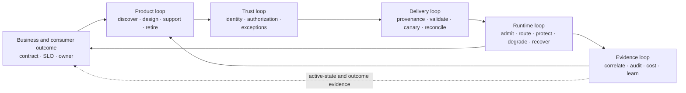

**Figure interpretation:** No isolated gateway feature closes the loop. Product intent without runtime reconciliation can be stale; runtime policy without domain outcome evidence can return a technically successful but incorrect result; telemetry without a funded improvement loop creates dashboards rather than control.

**Figure limitation:** The loops can be implemented by several tools and teams, and some feedback is asynchronous. The diagram does not imply one control plane, one organization, or one data store and cannot establish maturity without operating records.

### Recurring forces that shape the operating model

| Force | Why it changes the design | Best-practice response | Failure when ignored |
|---|---|---|---|
| Business consequence differs by journey | A balance read, money transfer, webhook, bulk upload, and model/tool invocation need different retry, freshness, and failure semantics | Tier by business outcome and failure contract, not only API visibility | Uniform retry or timeout creates duplicate side effects or hides uncertainty |
| Trust is distributed | Issuers, JWKS, workload identity, certificates, consent, risk signals, and backend authorization can fail independently | Version an identity/policy profile and test degraded modes per journey | Gateway accepts a token while object or transaction authorization is wrong |
| Runtime placement is plural | Managed, hybrid, Kubernetes, legacy, and SaaS paths coexist through long migrations | Use a bounded topology portfolio and a field-level state/responsibility ledger | “Local gateway” hides remote config, audit, secret, or support dependency |
| Change is executable state | Routes, policies, schemas, certificates, controllers, plugins, and generated files consume resources and interact | One authority per object, provenance, semantic/resource validation, canary, kill switch, reconciliation | A valid change activates a latent defect or propagates global load |
| Consumer journeys cross systems | Catalog, documentation, identity application, consent, product subscription, runtime consumer, and support state drift | Treat access as an end-to-end product workflow and reconcile its states | Portal says approved while runtime denies, or orphaned credentials remain active |
| Evidence has cost and failure modes | High-cardinality telemetry, privacy, sampling, queues, retention, and vendor export can harm the request path | Define a minimum evidence contract, bounded queues/shedding, privacy controls, and loss accounting | Telemetry outage consumes gateway capacity or erases incident evidence |
| Protocol semantics expand | REST, gRPC, events, files, GraphQL, webhooks, and agent/tool calls differ in state, replay, and authorization | Govern contract and state semantics; keep durable business recovery outside transient gateway plugins | Technical translation passes while ordering, scope, or business meaning changes |
| Organizations decentralize delivery | Central teams cannot hand-review every service; unconstrained domains duplicate controls | Federate within guardrails, automate evidence, fund a platform product, and expire exceptions | Governance becomes a queue or an optional document |
| Portfolios and vendors change | M&A, cloud strategy, contract renewal, and product evolution make coexistence normal | Keep migration units small; inventory non-route state; rehearse rollback and exit | Traffic moves but identities, consumers, analytics, and operational ownership do not |

### Ownership archetypes and runtime custody are orthogonal choices

An operating model answers **who owns decisions and outcomes**. A deployment topology answers **who operates which plane and where state runs**. Combining the two creates false conclusions—for example, that customer-hosted data planes imply domain autonomy, or that a managed runtime removes enterprise service ownership. A program chooses one or more ownership archetypes by product boundary, then separately resolves runtime custody by zone and journey.

| Ownership archetype | Accountable outcome owner | Central platform responsibility | Domain/ecosystem responsibility | Best-fit condition | Primary failure and non-fit condition |
|---|---|---|---|---|---|
| `OA-A` — central platform service and factory | Central platform/API-program owner for delivery, runtime, and platform-service outcome; domain owner remains accountable for contract, authorization, data, and business outcome | Design, delivery, runtime, support, standards, migration factory, evidence | Domain defines contract/business semantics, accepts authorization/data/correctness, and remains the journey owner | Small or early portfolio; scarce domain platform skills; strong commonality | Central queue becomes bottleneck and accidental business-service owner; non-fit when domains require independent release/recovery decisions |
| `OA-B` — guardrailed federation | Platform owner for paved road; domain product owner for each API outcome | Runtime classes, mandatory controls, trust profiles, automation, evidence, shared SLO and support | Contract, business authorization, service/data correctness, consumer outcome, bounded configuration, on-call | Large enterprise needing autonomy with consistent risk controls | Ambiguous seam creates “platform problem” versus “service problem”; non-fit when either side lacks funded day-two ownership |
| `OA-C` — domain-autonomous federation with shared fabric | Domain API-product owner | Contract/catalog vocabulary, trust and evidence fabric, minimum policy, cross-domain escalation | Runtime choice within guardrails, delivery, operation, cost, recovery, consumer support | Distinct business units with real engineering/SRE capability and heterogeneous needs | Standards drift and duplicate cost; non-fit when shared risk cannot be observed or enforced |
| `OA-D` — ecosystem/partner product operator | Ecosystem API-product owner with risk and partner-operations authority | Partner identity profiles, portal/access service, shared runtime controls, evidence and incident coordination | Domains own service semantics; partners own their clients, credentials, retry behavior, and change readiness | External B2B/open ecosystem with contracts, onboarding, certification, and coordinated change | Contractual and technical states diverge; non-fit when no owner can revoke, communicate, or reconcile across organizations |

| Runtime custody | Control/management custody | Request-runtime custody | Enterprise responsibility that remains | Typical reason to consider | Proof that cannot be skipped |
|---|---|---|---|---|---|
| `RC-1` — vendor-managed control and runtime | Vendor-managed, subject to contract and service boundary | Vendor-managed | API product, identity integration, configuration correctness, backend/data, consumer support, incident coordination and exit | Reduce infrastructure toil where region, connectivity, and service boundary fit | Regional/dependency failure, support escalation, configuration recovery, evidence export, data-location and exit proof |
| `RC-2` — split control with customer-hosted runtime | Vendor or central team manages control plane | Enterprise runs data planes in cloud, data center, edge, or cluster | Runtime capacity/patch/support seam, network, PKI, bootstrap/cache, telemetry, local recovery and reconciliation | Local request processing, sovereignty, backend proximity, or failure-domain separation | Existing/restart/new-node behavior during disconnection; revoke/change limits; version/plugin compatibility; flow ledger |
| `RC-3` — enterprise self-managed/sovereign | Enterprise operates control/management plane | Enterprise operates request runtimes | Full database/Kubernetes/backup/restore/upgrade/security/on-call/support integration plus product outcome | Mandatory control/data boundary or sufficiently valuable autonomy | Restore and upgrade at target scale; security patch clock; regional consistency; staff/on-call capacity; total operating economics |

Two overlays apply to any combination. A **multigateway catalog/evidence overlay** reconciles source, contracts, deployments, traffic, identity clients, DNS/certificates, owners, conformance, cost, and lifecycle across heterogeneous runtimes; it is not a gateway. A **migration coexistence cell** is a time-bounded old/new authority map with traffic slices, compatibility, rollback, support, and dependency-zero exit; it is not a permanent operating model. Gateway API's role separation and conformance levels support delegated infrastructure, cluster, and application responsibilities, but Core, Extended, and implementation-specific behavior still require versioned proof rather than API-name portability inference.

Documented product mechanisms show why custody choices exist without proving equivalence. Kong documents hybrid control-plane/data-plane operation, Azure distinguishes managed and self-hosted gateways, Apigee hybrid separates a Google-managed management plane from customer-managed runtime, and MuleSoft documents Connected and Local modes for current Omni Gateway 1.13 (formerly Flex Gateway) ([Kong hybrid mode](https://developer.konghq.com/gateway/hybrid-mode/), [Azure API Management gateways](https://learn.microsoft.com/en-us/azure/api-management/api-management-gateways-overview), [Apigee hybrid](https://docs.cloud.google.com/apigee/docs/hybrid/v1.16/what-is-hybrid), [MuleSoft Omni Gateway](https://docs.mulesoft.com/gateway/latest/)). These are **documented facts about mechanisms as of 2026-08-18**. Exact continuity, state location, entitlement, support, and operational burden remain open until E2/E3 evidence.

**Figure AIP-2 — Ownership and runtime custody form a matrix; neither axis is a maturity rank.**

- **Depicted scope:** four ownership archetypes, three runtime-custody classes, a shared catalog/evidence overlay, a temporary migration/coexistence overlay, and the requirement to resolve a bounded option per cell.
- **Excluded scope:** a preferred cell, chronological progression, product shortlist, entitlement, cost, physical topology, exact shared-responsibility contract, and proof that every combination is feasible.
- **Diagram source, evidence state and as-of:** inline synthesis of OA-A through OA-D, RC-1 through RC-3, Gateway API role separation, and the official platform topology sources linked above; interpretation and option-definition model, 2026-08-18.
- **Accessible equivalent:** organization ownership can be central service/factory, guardrailed federation, domain-autonomous federation, or ecosystem operator. Runtime custody can be vendor-managed, split control/customer-hosted runtime, or fully enterprise-managed. Any ownership row may in principle pair with any custody column if responsibility, skills, support, state, economics, and proof fit. Catalog/evidence can span cells; migration coexistence must have an expiry and exit.

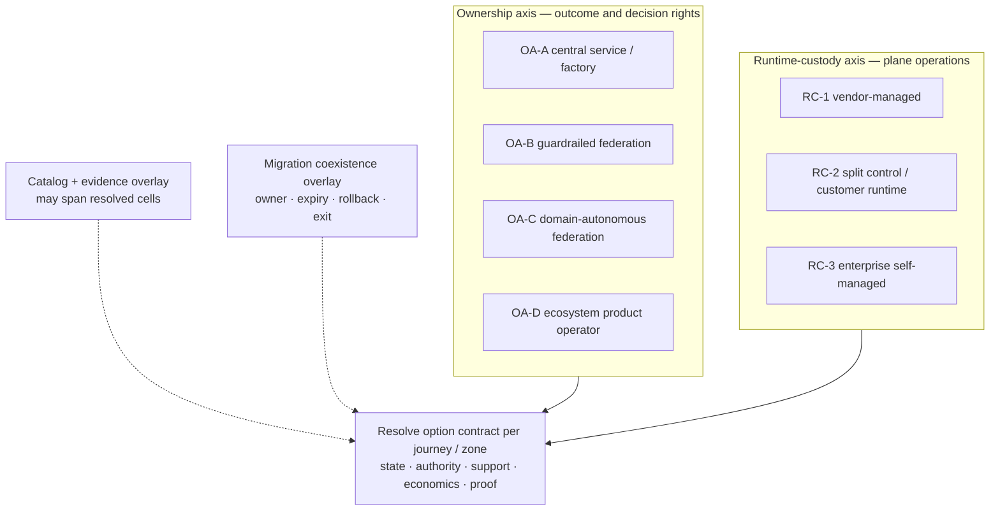

**Figure interpretation:** A federated organization can use a managed runtime, and a central platform team can operate self-managed infrastructure. Reviewers must assess the responsibility seam and operational capacity separately from runtime placement.

**Figure limitation:** Some combinations will be commercially or technically unavailable, and a single enterprise can use several cells. The matrix does not imply equal cost, risk, autonomy, or support and cannot replace exact option resolution.

## Best-practice framework mapped to P1–P10

The ten practices below are the minimum portfolio. They are intentionally outcome- and artifact-based so that different products can be evaluated symmetrically.

| Canonical problem | Required practice | Minimum implementation mechanism | Acceptance evidence | Reject or hold when |
|---|---|---|---|---|
| `P1` Distributed policy and identity enforcement | BP-1 — publish a versioned trust decision contract per journey | Issuer/audience/resource binding, client and workload identity, claim/attribute mapping, object/transaction authorization boundary, clock/key/certificate handling, fail-open/closed rule, revocation path | Positive/negative authorization corpus, key/certificate rotation, issuer/JWKS/clock fault results, active policy digest, business authorization reviewer | Network location or a valid token is treated as sufficient authorization; degraded behavior is implicit |
| `P2` Traffic resilience and backend protection | BP-2 — manage admission against business tier, dependency state, and known capacity | Per-tenant/journey isolation, concurrency and queue bounds, timeout budget, retry ownership/budget, circuit/load shedding, warm capacity, idempotency/outcome protocol | Load envelope, saturation signature, zone-loss and cold-start runs, retry amplification metric, business invariant and recovery trace | “Rate limiting” is the entire resilience design; non-idempotent work is retried blindly |
| `P3` Hybrid/multicloud placement, sovereignty, and control-plane continuity | BP-3 — maintain a field-level state, flow, and responsibility ledger | Locations for payload, config, credentials, telemetry/audit, backup/support data, operator access; existing/restart/new-node/revoke/reconcile states | Approved ledger, captured flows, control-plane partition run, cached restart, clean-node scale-out, regional recovery and attestation | “Data plane is local” substitutes for state/flow evidence; no owner can restore one state domain |
| `P4` Safe lifecycle change and configuration truth | BP-4 — enforce one authority per object and attest desired versus active state | Reviewed source, provenance, schema/semantic/resource/compatibility validation, small canary, automated stop, kill switch, known-good restore, drift reconciliation | Source/approval/build identity, artifact digest, promotion and runtime digests, negative-change runs, rollback/recovery record | UI, API, Git, controller, and emergency path can overwrite one another without detection |
| `P5` Estate discovery, product ownership, and governance at scale | BP-5 — reconcile source, catalog, deployment, traffic, identity, DNS/cert, and owner truth | Multisource discovery, authoritative product ID, owner/escalation/expiry, lifecycle and data class, provenance/freshness, exception workflow | Coverage denominator, unmatched endpoints, stale metadata, missing owners, deployment/version disagreement, resolved-orphan drill | Catalog entries are counted without observed-runtime denominator or freshness |
| `P6` End-to-end observability and decision evidence | BP-6 — define a minimum evidence spine and safe telemetry failure mode | Stable correlation, active-config attribution, consumer/journey/result dimensions, privacy/cardinality rules, bounded queues/retries/WAL where justified, loss accounting | Cross-boundary trace, SLI and business-state reconciliation, sink-slow/stop/restart run, queue/drop/drain metrics, evidence cost | Request safety depends on a remote telemetry sink; dropped evidence is invisible |
| `P7` Consumer adoption and product access | BP-7 — operate discovery-to-first-success and revoke as one product journey | Authoritative catalog/docs, environment/version clarity, access request, identity-client and runtime entitlement reconciliation, credential lifecycle, usage/support/deprecation | Task-based persona results, median/p95 elapsed and active time, entitlement mismatch, orphan access, rotation/revoke test, support outcome | Portal page completion is the adoption measure; approval and runtime access can drift |
| `P8` Protocol expansion and the gateway/integration boundary | BP-8 — place responsibility by state, side effect, replay, ordering, and recovery | Protocol contract, schema/semantic compatibility, bounded edge policy, durable workflow/idempotency/offset/compensation in owned services, extension lifecycle | REST/gRPC/event/file/agent cases as applicable; duplicate/out-of-order/slow/large/ambiguous-outcome tests; semantic diff | A plugin is chosen because it can run code, while durable business state has no owner |
| `P9` Portability, coexistence, migration, and exit | BP-9 — define migration as state movement with reversible cells and expiry | Route/policy/identity/consumer/cert/analytics/audit/support mapping, dual-run authority, traffic slices, rollback, reconciliation, dependency-zero and decommission evidence | Compatibility corpus, shadow or replay evidence where safe, slice results, rollback clock, residual dependency scan, archive/destruction record | Route parity is called migration complete; old runtime remains an undocumented recovery dependency |
| `P10` Sustainable federated operating model and economics | BP-10 — fund a platform product and make decision rights, service levels, exceptions, and unit economics observable | Product backlog, RACI/decision clock, on-call/support boundary, platform/domain SLOs, training, exception debt/expiry, cost allocation and demand model | Staffing/on-call simulation, change and incident exercises, adoption and satisfaction, cost per successful outcome, exception/decommission trend | A committee owns standards but nobody owns service recovery, product adoption, or cost |

The `P1` practice must follow the threat and interoperability boundary of the exact ecosystem. RFC 9700's documented recommendations include stronger redirect URI handling, sender-constrained tokens for relevant cases, and deprecation of less secure modes; the [FAPI 2.0 Security Profile](https://openid.net/specs/fapi-security-profile-2_0-final.html) defines a high-security OAuth profile for high-value APIs. Neither should be copied mechanically into a low-risk internal flow, and a gateway cannot infer object- or transaction-level authorization that belongs to the domain. The [OWASP API Security Project](https://owasp.org/www-project-api-security/) remains a useful threat-awareness source—especially for broken object authorization, resource consumption, and sensitive business flows—but is not a compliance certificate or architecture.

For `P2`, Google SRE's official guidance explains that overload and retries can create positive feedback and cascading failure, recommends realistic capacity/failure testing, load shedding, degraded service, and retry backoff/budgets ([addressing cascading failures](https://sre.google/sre-book/addressing-cascading-failures/), [handling overload](https://sre.google/sre-book/handling-overload/)). This supports the mechanism, not the local thresholds. For `P4`, OpenAPI 3.2.0 is the latest version listed by the [OpenAPI Specification site](https://spec.openapis.org/oas/) as of 2026-08-18, and that site explicitly notes that schemas do not catch every specification violation. Exact product/tool dialect support is unresolved; semantic compatibility, policy cost, and active-state attestation remain separate work. Supply-chain provenance can draw on the [SLSA 1.2 specification](https://slsa.dev/spec/v1.2/), whose levels and attestation formats describe increasing source/build assurance; SLSA does not prove runtime correctness.

For `P6`, W3C [Trace Context](https://www.w3.org/TR/trace-context/) standardizes request context propagation, and OpenTelemetry defines HTTP semantic conventions, while recording their stability state ([OpenTelemetry HTTP semantic conventions](https://opentelemetry.io/docs/specs/semconv/http/)). OpenTelemetry's [Collector resiliency guidance](https://opentelemetry.io/docs/collector/resiliency/) documents that in-memory queues, retry windows, WALs, and message queues each retain data-loss conditions and operational costs. Therefore “exports OpenTelemetry” is not evidence that telemetry cannot backpressure the gateway or that audit evidence is durable.

**Figure AIP-3 — Four linked artifacts turn policy intent into a recoverable control instead of a static checklist.**

- **Depicted scope:** outcome/trust contract, deployable artifact and provenance, active-state/flow ledger, evidence bundle, their accountable owners, and the feedback path from observed behavior to intent.
- **Excluded scope:** file formats, vendor APIs, artifact-signing implementation, exact RACI, commercial evidence, or proof that the artifacts are complete and current.
- **Diagram source, evidence state and as-of:** inline operating-model synthesis from BP-1 through BP-10, `RE-1`, SLSA provenance, standards and failure mechanisms cited above; interpretation, 2026-08-18.
- **Accessible equivalent:** a domain owner approves the business outcome and trust contract; platform/security turn it into an attributable deployable artifact; platform/SRE reconcile desired and active runtime state plus network/data flows; an independent reviewer uses raw observations, recovery records, cost, and limitations to accept, reject, or revise the contract.

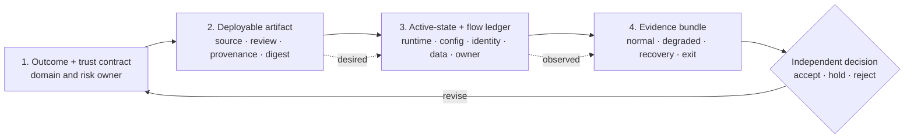

**Figure interpretation:** Controls become durable only when reviewers can trace business intent to an attributable artifact, confirm the active state and flows, and reproduce behavior. A policy checklist, CI success, or dashboard alone breaks that chain.

**Figure limitation:** The four artifacts can be stored in several systems and may have different confidentiality. The figure does not guarantee provenance integrity, inventory completeness, reviewer independence, or that a negative result is acted upon.

## Realistic enterprise scenarios

All eight cases below are **synthetic practice cases**, not customer histories, market benchmarks, or observed results. Calibration means only that a case reuses an explicitly identified `RE-1` journey/failure condition or declares its own exercise inputs; it does not mean statistical calibration to an industry population. Every rate, duration, objective, threshold, team condition, and cost is a **scenario assumption** proposed for review. Each case states a counterfactual because the best practice is the smallest control that protects the outcome—not the most elaborate architecture.

The compact matrix is the stable site projection; the detailed case cards carry the decision reasoning.

| Scenario | Failure mechanism | Best-practice control | Measurable acceptance | Owner |
|---|---|---|---|---|
| `S1` Regulated multiregion payments | Stale policy or issuer state admits/rejects incorrectly; a lost response invites duplicate transfer; failover restores reachability before ledger truth | `BP-1`, `BP-2`, `BP-3`, `BP-6` — local enforcement with explicit freshness, domain idempotency/outcome lookup, state-readiness gate, reconcile before failback | Zero duplicate committed outcomes; approved auth behavior during faults; RTO/RPO and config-digest convergence meet scenario thresholds | Payments domain owner, platform SRE, IAM/PKI, risk |
| `S2` B2B partner onboarding and rollover | Contract, IdP client, mTLS trust, product subscription, and runtime consumer drift; one certificate cutover creates TLS handshake failures or 401/403, depending on enforcement point | `BP-1`, `BP-4`, `BP-7` — reconciled access workflow, partner certification, overlapping trust, staged credential rotation and revoke | First-success time, entitlement mismatch, dual-trust success, rollback/revoke clock, zero unexplained active credentials | Ecosystem API-product owner with IAM/PKI and partner operations |
| `S3` Retail flash sale and backend protection | Retry amplification, shared queues/counters, expensive requests, cold capacity, and telemetry backpressure create cascade | `BP-2`, `BP-6` — per-journey/consumer budgets, bulkheads, bounded queues, retry ownership/budget, load shedding, warm recovery | Protected checkout invariant; bounded queue age; no cross-tenant SLO breach; recovery without retry storm | Checkout service owner and platform SRE |
| `S4` Federated domains on shared runtime | Global policy/config push or noisy neighbor consumes shared capacity; authority overlaps between domain and platform | `BP-2`, `BP-4`, `BP-10` — delegated scopes, mandatory inherited controls, cell/canary isolation, resource budgets, desired/active attestation | One-domain defect stays in cell; unaffected domain SLO holds; rollback and state convergence meet threshold | Platform product/SRE for cell; domain owner for API outcome |
| `S5` Acquisition and coexisting gateways | Hidden consumer or semantic policy difference turns route cutover into authorization, retry, analytics, or support incident | `BP-1`, `BP-5`, `BP-9` — strangler slices, contract/identity/policy equivalence, reversible waves, consumer discovery, dependency-zero exit | Approved semantic parity, unknown-consumer rate under threshold, rollback clock, no residual production dependency | Migration owner with domain, security, operations, FinOps |
| `S6` Disconnected regulated edge | WAN loss leaves stale config, key/cert/license dependency, failed restart, blocked revoke, operational-telemetry loss, and mandatory-audit journal pressure | `BP-1`, `BP-3`, `BP-4`, `BP-6` — last-known-good state, local trust policy, explicit fail-open/closed tiers, classed telemetry buffers, retained mandatory audit with write-stop rule, reconnect quarantine/reconcile | Existing/restart/clean-node matrix passes; stale window enforced; zero mandatory-audit loss; approved telemetry loss accounted; active state converges before traffic | Platform and site/OT owners with IAM/PKI, SRE, security/audit |
| `S7` Event, webhook, gRPC, and bulk-data boundary | Treating async/streaming work as synchronous REST loses ack, replay, order, job state, or authorization meaning | `BP-1`, `BP-6`, `BP-8` — protocol-specific contract, durable domain/integration state, poison/backlog handling, semantic compatibility and outcome query | Duplicate/out-of-order/poison cases preserve invariants; backlog and job state recover; no false synchronous success | Domain product owner with event/integration platform and security |
| `S8` GenAI and agent-tool mediation | Provider fallback changes semantics/data boundary; tool tokens are overbroad; prompt/output telemetry leaks sensitive data; spend runs away | `BP-1`, `BP-2`, `BP-6`, `BP-8` — model/tool identity and scope, data policy, token budgets, redacted evidence, evaluated routing/fallback, domain-owned authorization | Quality/safety and exfiltration suite passes; budget enforced; fallback equivalence bounded; privileged tool action remains attributable | AI platform, domain product owner, security/privacy/model risk |

### S1 — regulated multiregion money movement

**Context and scenario assumptions.** A financial institution exposes a partner payment-initiation API from two jurisdictions. Ordinary traffic is assumed at 520 requests/s, a 2.4× three-minute burst, p95 end-to-end latency at or below 900 ms, a five-minute recovery objective, and zero data loss after a commitment receipt. Request runtimes are local to each jurisdiction; a shared or vendor management plane may be remote. Partners use confidential OAuth clients with sender-constrained access tokens using mTLS or DPoP, with the selected profile's required client authentication. These values calibrate the exercise; they are not production facts or platform limits.

**Mechanism and failure path.** The gateway authenticates the client and enforces coarse authorization, route, schema, and admission policy. The payments service owns account/consent/transaction authorization, a durable idempotency record keyed to client and operation, the ledger commit, outcome query, and reconciliation. A plausible failure begins when control connectivity is lost: existing runtimes keep accepted configuration, one restarted replica loads older state, the issuer rotates a key, and a partner times out after the ledger commits but before receiving the response. Blind gateway or client retry can duplicate submission; sending all traffic to the other region can restore HTTP success over a lagging ledger or stale consent state.

RFC 9700 supplies current OAuth threat guidance, while the OpenID Foundation's final FAPI 2.0 Security Profile defines a high-security, sender-constrained profile for high-value APIs. [RFC 9449](https://www.rfc-editor.org/rfc/rfc9449.html) defines DPoP as an application-level proof-of-possession mechanism; [RFC 8705](https://www.rfc-editor.org/rfc/rfc8705.html) defines OAuth mutual-TLS client authentication and certificate-bound access tokens. These are **documented mechanisms**, not a mandate to use both or proof that token, key, certificate, consent, and domain authorization state remain coherent during a partition.

**Ownership and best practice.** The payments domain owner accepts business correctness and failover state; IAM/PKI owns issuer, key, and certificate lifecycle; platform SRE owns request runtime, capacity, active configuration, and traffic admission; risk approves the fail-open/closed rule and stale window. Use local validation where the threat model permits, explicit issuer/audience/resource and client binding, overlapping key/certificate trust, per-partner capacity isolation, no automatic retry of the financial POST, and a durable outcome endpoint. Regional traffic moves only after ledger, consent, identity, config, and dependency readiness pass; failback closes only after reconciliation.

**Anti-pattern.** “The gateway is active-active, so payments are active-active.” Gateway availability cannot establish authoritative ledger state, exactly-once business effect, or current authorization. Likewise, idempotency stored only in a gateway cache is not durable outcome truth.

**Measurable acceptance.** During issuer/JWKS delay, clock skew, certificate overlap, control-plane isolation, runtime restart, clean-node scale-out, regional partition, lost response, and reconnect, the scenario requires: zero duplicate committed outcomes; deterministic duplicate response from durable domain state; no unauthorized acceptance; an approved and visible reject/degrade mode; p95/p99 within the accepted fault budget; RTO at or below five minutes and RPO zero after commitment receipt; exact desired/active configuration digests after reconciliation; and no unexplained ledger, audit, or partner-access variance. Thresholds remain scenario assumptions until Gate 0.

**Artifacts and reviewer.** Retain sanitized requests, authorization decision inputs, issued-token metadata, key/certificate timeline, configs and digests, load/fault scripts, gateway/service/ledger traces, outcome and reconciliation records, alert/incident timeline, and rollback actions. Payments operations and security independently review correctness; platform SRE reviews runtime evidence; risk signs the degraded-mode and residual-risk decision.

**Counterfactual and non-fit.** If processing and evidence may remain in one approved managed region and the business accepts its recovery dependency, a managed regional gateway plus domain DR can be safer and cheaper than nominal multicloud. Split control/local runtime is non-fit when remote metadata/support paths breach the boundary, or when local teams cannot restore and attest runtime state. Full active-active is non-fit where the ledger cannot provide the required cross-region consistency; active-passive with controlled degradation may be the correct outcome.

[RFC 9110](https://www.rfc-editor.org/rfc/rfc9110.html) defines HTTP method idempotence and constrains automatic retry of non-idempotent requests. The practice also aligns with AWS's primary engineering guidance on [making retries safe with idempotent APIs](https://aws.amazon.com/builders-library/making-retries-safe-with-idempotent-APIs/) and Stripe's documented [idempotent-request behavior](https://docs.stripe.com/api/idempotent_requests?lang=curl). Those sources illustrate intent identifiers and repeat handling in their stated systems; they do not establish a universal retention window, transaction boundary, or exactly-once guarantee for S1.

**Figure AIP-4 — A payment retry is safe only when the domain returns the durable outcome behind the same idempotency key.**

- **Depicted scope:** partner request, gateway authentication/admission, domain idempotency reservation, ledger commit, lost response, repeated request, outcome lookup, and reconciliation.
- **Excluded scope:** one database transaction design, authorization-profile detail, regional consensus, exact timeouts, event publication atomicity, product behavior, and proof of exactly-once delivery.
- **Diagram source, evidence state and as-of:** inline sequence derived from synthetic scenario S1, `RE-1/J-01`, RFC 9110 retry semantics, OAuth/FAPI sources cited above, and public retry/idempotency engineering guidance; scenario hypothesis, 2026-08-18.
- **Accessible equivalent:** the partner sends a key; the gateway authenticates and forwards without inventing a retry; the payments service reserves the key, commits once to the ledger, and stores the result. If the response is lost, the partner repeats the same key and the service returns the stored outcome. Reconciliation confirms idempotency and ledger truth.

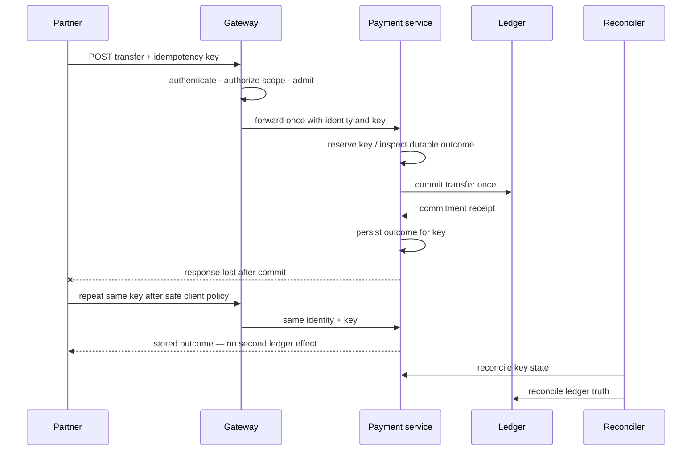

**Figure interpretation:** The gateway participates by preserving identity, key, correlation, and retry policy, but the service that owns the side effect owns durable deduplication and outcome. A successful gateway response is not the system of record.

**Figure limitation:** The sequence does not prove atomicity among idempotency, ledger, and event state or prescribe a storage engine. Each before/after-commit failure and regional consistency mode still requires E3 proof.

### S2 — B2B partner onboarding, identity, and certificate rollover

**Context and scenario assumptions.** A payments ecosystem has 140 partner organizations, three access packages, two environments, mTLS plus OAuth client credentials, and a quarterly release window. A new partner target is ten business days from accepted application to first production success; urgent revocation must take effect within fifteen minutes. Fifteen percent of partner clients are assumed to use older trust stores or pinned intermediates. All figures are scenario assumptions.

**Mechanism and failure path.** A usable entitlement spans commercial approval, partner organization, contacts, API product/package, contract/version, IdP client and scopes, certificate subject/trust, gateway consumer/application, backend permission, quota, portal documentation, support route, and deprecation notification. If systems are updated independently, the portal can report approval while runtime denies, or a revoked contract can leave an active IdP client. During certificate rollover, replacing rather than overlapping trust can turn a single expiration or intermediate mismatch into fleet-wide TLS handshake failures or HTTP 401/403 responses, depending on whether trust is enforced at transport, token, gateway, or backend layers. Manual exceptions then create shared credentials and undocumented trust.

The best practice follows an explicit access state machine and reconciliation job. OAuth protected resource metadata ([RFC 9728](https://www.rfc-editor.org/rfc/rfc9728.html)) can help a client discover authorization servers and resource scopes, but it does not create the enterprise's partner due diligence or runtime entitlement. Certificate-bound access tokens and DPoP provide different sender-constraining mechanisms and must be selected against client capability and threat model; mTLS is usually non-fit for public/mobile clients that cannot protect or rotate an application certificate consistently.

**Ownership and best practice.** An ecosystem API-product owner owns time-to-first-success, contract/version communication, support, and access-state outcome. IAM owns OAuth clients/scopes; PKI owns certificate lifecycle and trust overlap; platform owns product/consumer/runtime reconciliation; domains own backend authorization. Use a certification sandbox with positive/negative contract tests, per-partner credentials, automated expiry alerts, dual old/new trust, a staged rotation cohort, precise revocation, an independent partner contact register, and a machine-readable state comparison across commercial, identity, gateway, and backend systems.

**Anti-pattern.** “We have a developer portal, so onboarding is self-service.” A portal page is a user interface over several authorities. Auto-approving every access request is not self-service; it is unbounded delegation. Emailing a replacement certificate without population evidence is not rollover.

**Measurable acceptance.** Execute new onboarding, scope change, certificate addition, overlap, client cutover, old-trust removal, lost-key replacement, suspension, revoke, and version deprecation for a normal partner, slow-update partner, and incident responder. Measure median/p95 elapsed and active time, human handoffs, first-call success, entitlement-to-runtime mismatch, credential age/orphans, dual-trust handshake success by client class, revoke propagation, rollback time, and support resolution. Acceptance requires no unexplained active credential, an attributable state transition, and the approved fifteen-minute urgent-revoke target; all thresholds are assumptions.

**Artifacts and reviewer.** Retain partner state snapshots and transition log, contracts/spec versions, certificate chains and client matrix, IdP/gateway/backend entitlements, test calls, approvals, notices, support timeline, and revoke evidence. Ecosystem operations and the partner reviewer validate usability; IAM/PKI/security validate trust; the domain validates least privilege and business authorization.

**Counterfactual and non-fit.** A small internal machine-to-machine estate may need repository documentation and automated workload identity rather than a portal. mTLS is non-fit for consumer mobile/browser clients where certificate custody is unavailable; DPoP or another approved sender-constraining pattern may fit. A central partner service is non-fit if it cannot represent domain-specific authorization or contractual segregation, in which case shared identity and evidence should coexist with domain-owned approval.

**Figure AIP-5 — Partner access is complete only when contract, identity, runtime, backend, and support states reconcile.**

- **Depicted scope:** partner request, product/contract approval, IdP client and scopes, certificate/trust, gateway consumer/product, backend authorization, first success, ongoing reconcile, rotation/revoke/deprecation.
- **Excluded scope:** specific portal or identity product, legal due diligence, certificate format, OAuth grant selection, pricing, exact propagation time, and proof of partner-client compatibility.
- **Diagram source, evidence state and as-of:** inline state model from synthetic S2, RFC 8705/9449/9728, and `RE-1/J-03/I-03`; scenario and operating hypothesis, 2026-08-18.
- **Accessible equivalent:** a partner application is usable only after product/contract approval, identity/scopes, certificate trust where applicable, gateway subscription/consumer, and backend permission all point to one partner and version. First success starts the operating phase; periodic reconciliation detects drift. Rotation, revoke, and deprecation return through controlled state changes.

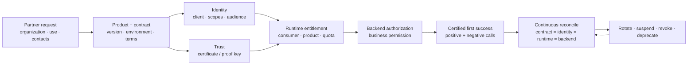

**Figure interpretation:** The access product is a distributed state machine. Automation should reduce handoffs while preserving separate risk decisions; reconciliation, not portal appearance, proves that approved and active access match.

**Figure limitation:** The figure does not assign one system of record for every state or prove propagation. Partner legal obligations, client software constraints, emergency communications, and privacy remain organization-specific.

### S3 — retail flash sale, admission, and recovery

**Context and scenario assumptions.** A retailer expects ordinary checkout at 2,800 requests/s, a 6× two-minute arrival spike, and a product-browse spike at 12×. Checkout has a p95 target below 650 ms and exactly one accepted order per client idempotency key. Inventory reservation supports 4,000 concurrent requests; a promotion service becomes inefficient above 2,500 requests/s. Thirty tenants share runtime cells, and telemetry export normally uses eight percent of gateway CPU. These are exercise assumptions, not sizing evidence.

**Mechanism and failure path.** Flash traffic contains cheap catalog reads, expensive personalized pricing, cart mutations, checkout, bots, client retries, webhook callbacks, and administrative calls. A per-IP or aggregate RPS limit cannot represent their resource cost or consequence. The failure chain begins when slow promotion responses increase in-flight work, queues consume memory, clients and gateways retry, autoscaling starts cold replicas, shared counters and telemetry exporters add latency, health checks fail, and load shifts to remaining cells. Checkout then competes with browsing and retries; dropping telemetry may hide the causal chain.

**Ownership and best practice.** The checkout service owner publishes capacity, concurrency, timeout, idempotency, and degraded-mode contracts. Platform SRE enforces per-journey, per-consumer, and per-cell budgets; uses bounded queues, bulkheads, short admission decisions, and telemetry shedding; keeps recovery capacity warm; and exposes `Retry-After` or equivalent semantics where safe. Client/API standards define one retry owner, exponential backoff with jitter, and a retry budget. The domain chooses whether to shed personalization, return a durable queued receipt, or reject; the gateway must not invent business degradation.

**Anti-pattern.** “Autoscaling plus rate limiting handles the sale.” Autoscaling can arrive after a cascade and can amplify cold-start dependency load. Uniform throttling can preserve cheap reads while starving high-value checkout, or the reverse. A retry at client, gateway, service mesh, and SDK layers multiplies work.

**Measurable acceptance.** Run representative request-cost distributions, slow promotion/inventory dependencies, one-zone loss, cold start, shared-counter delay, telemetry sink slowdown, and recovery while clients follow the defined retry policy. Measure useful business completions, per-journey p50/p95/p99, concurrency, queue depth/age, shed/reject reason, retry amplification, CPU/memory/connection/counter saturation, cross-tenant impact, telemetry loss, scale readiness, backlog drain, and recovery hysteresis. Acceptance requires the order invariant, an approved checkout success/degradation objective, no non-target tenant error-budget breach, bounded queues, visible evidence loss, and recovery without a second retry storm.

**Artifacts and reviewer.** Retain traffic model and generator seed, sanitized request classes, client retry configuration, platform and backend resource series, active policy digests, saturation and shedding events, order/idempotency reconciliation, telemetry queue/drop data, and incident timeline. Checkout engineering validates business correctness; performance engineering and platform SRE validate capacity/recovery; FinOps reviews cost per successful checkout.

**Counterfactual and non-fit.** If synchronous capacity cannot economically serve the peak, async admission with a durable queue and queryable order intent can be safer, but it changes the consumer contract. A dedicated high-criticality cell can be appropriate when shared isolation cannot pass. Aggressive gateway caching is non-fit for personalized prices, authorization-dependent data, or inventory whose freshness contract cannot tolerate it.

**Figure AIP-6 — Protect useful work by admitting against journey and dependency capacity before retries create positive feedback.**

- **Depicted scope:** request classification, identity and business tier, retry/idempotency validity, dependency readiness, capacity budget, accept/degrade/queue/reject outcomes, and feedback from completion/backlog.
- **Excluded scope:** one rate-limit algorithm, exact thresholds, distributed-counter consistency, autoscaler design, pricing/inventory semantics, and proof that a gateway can observe every decision input.
- **Diagram source, evidence state and as-of:** inline admission model from synthetic S3 and Google SRE overload/cascading-failure guidance linked above; scenario hypothesis, 2026-08-18.
- **Accessible equivalent:** classify the journey and consumer; reject unsafe duplicate/retry behavior; inspect relevant dependency readiness and the journey/cell capacity budget; accept within budget, use a domain-approved degraded response, place work in a durable domain queue, or reject cheaply. Completion and backlog state replenish or reduce the admission budget.

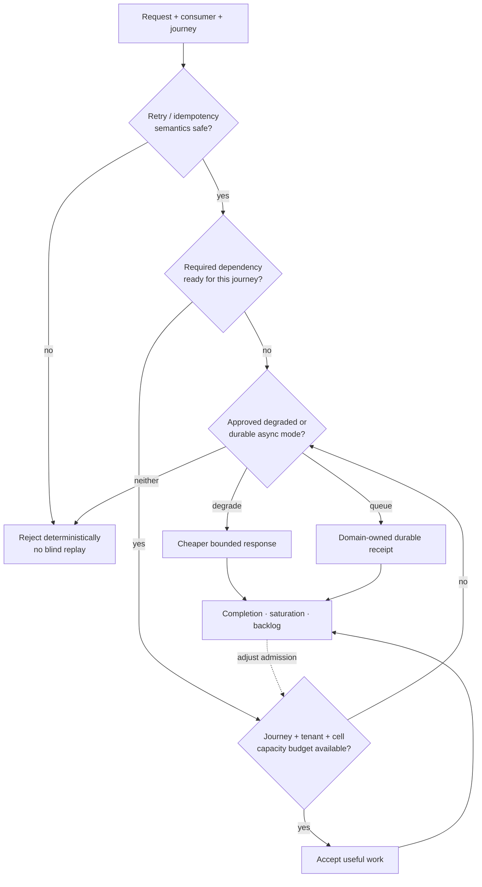

**Figure interpretation:** Admission is a business-tier and dependency decision, not a global request counter. Rejecting early, degrading explicitly, or queuing durably can preserve more useful work than accepting traffic that will time out and retry.

**Figure limitation:** The flow assumes reliable classification and timely capacity signals. Distributed counters, stale dependency health, adversarial traffic, and queued-work semantics require separate failure proof.

### S4 — federated domains on a shared runtime

**Context and scenario assumptions.** Twenty-two domain teams publish 310 APIs through six shared cells across two clouds. Each domain controls routes, upstreams, consumer products, and approved optional policies inside a delegated scope. Platform engineering controls runtime versions, base identity validation, network posture, mandatory telemetry, and policy bundles. A critical payments domain and a low-criticality content domain share a cloud but not a cell. The assumed goal is that one domain defect cannot consume more than twenty percent of another domain's reserved capacity or cause its SLO breach.

**Mechanism and failure path.** Delegation reduces the central queue, but shared runtime, controllers, policy packages, counters, configuration stores, secrets, and telemetry remain correlated. A domain can submit a syntactically valid high-cardinality route/policy set; a platform team can globally push an expensive rule; controller fan-out can reconcile partial state; one tenant's bodies or metrics can consume memory. A shared gateway may keep serving but with wrong or stale configuration for one namespace. Current Gateway API documentation makes this organizational tension explicit through separate infrastructure, cluster-operator, and application-developer roles, while conformance levels warn that some behavior is Extended or implementation-specific. Azure API Management's official [workspaces overview](https://learn.microsoft.com/en-us/azure/api-management/workspaces-overview) provides one documented product example: workspace gateways can share capacity and configuration dependencies, resource exhaustion can affect workspaces sharing gateway resources, and dedicated gateways change isolation and cost. That product mechanism is not evidence that every shared gateway behaves the same way or that dedicated capacity is automatically justified.

**Ownership and best practice.** Platform product/SRE owns cell health, runtime upgrades, resource isolation, mandatory policy, shared change, active-state attestation, and incident command. Each domain owns the API contract, service/data behavior, business authorization, consumer SLO, bounded route/policy changes, and after-hours response. Use delegated namespaces/workspaces with least-privilege write boundaries; admission controls for object count, configuration size/cardinality and policy resource cost; per-domain budgets; canary cells for global policy and runtime change; stable config digests; and an exception record with owner and expiry. Dedicated cells are an isolation choice, not a maturity award.

**Anti-pattern.** “Federation means domains can configure anything” abandons the shared-risk contract. The opposite—central review of every route—turns the platform into a ticket factory. A RACI without enforced scope, funded on-call, and measurable decision clocks does neither.

**Measurable acceptance.** Submit an expensive but valid policy, route explosion, oversized schema, bad upstream TLS, controller partial failure, secret rotation, one-domain traffic shock, and global base-policy rollback. Measure validation/rejection before propagation, config fan-out and convergence, canary scope, CPU/memory/counter/cardinality isolation, unrelated-domain SLI, time to identify owner, kill-switch/rollback time, exception use, and unresolved drift. The assumed pass condition keeps the defect inside one canary/cell, preserves unaffected-domain objectives, and reconciles every digest before promotion.

**Artifacts and reviewer.** Retain role and write-scope definitions, base/domain configs and provenance, admission output, runtime/controller versions, active digests, resource/traffic series by tenant, alerts, rollback, exceptions, and owner-response timeline. Platform SRE and an independent domain reviewer validate isolation; security reviews delegated privilege; the product council reviews decision time and adoption friction.

**Counterfactual and non-fit.** A small estate can rationally use central ownership. A high-consequence domain may warrant a dedicated gateway or runtime cell if shared isolation fails, but still benefits from common trust and evidence. Domain-autonomous runtime is non-fit when teams cannot own production recovery; central factory is non-fit when its queue prevents safe delivery or makes it the de facto owner of domain services.

### S5 — acquisition, coexisting gateways, and reversible migration

**Context and scenario assumptions.** An enterprise acquires a business with 180 APIs on two gateways, 65 known partner clients, mobile applications with slow update cycles, and 24 services that call an undocumented internal hostname. The target enterprise already operates a different gateway and identity platform. Contract renewal creates an eighteen-month planning horizon, but the decision gate does not assume that full migration is economically correct. The first wave is assumed to contain twelve low-to-medium-risk APIs and ten percent traffic slices; rollback must be possible within fifteen minutes before a business side effect or schema migration makes reversal unsafe. These are scenario assumptions.

**Mechanism and failure path.** Migration state includes hostnames and routes, methods/status/headers/body semantics, TLS and client certificates, token issuer/audience/claims, API keys, consumer/application/product/subscription state, quotas, transformations, CORS, cache behavior, retries/timeouts, analytics/audit, developer documentation, support contacts, billing, network allowlists, and backend assumptions. A route can return 200 through the target while a hidden client uses the old hostname, an authorization claim is mapped differently, a timeout triggers duplicate work, analytics loses the contractual consumer identifier, or support cannot identify which runtime served the request. A “big-bang” DNS cutover makes all those differences one failure domain.

**Ownership and best practice.** A time-bounded migration owner coordinates the program and evidence but does not inherit the domain service. Domain owners approve contract and business semantics; security/IAM approve identity and policy equivalence; platform teams operate old and new cells; consumer/partner owners approve client behavior; FinOps/sourcing validate dual-run cost and exit value. Build a canonical contract and sanitized compatibility corpus, observe actual consumers, map all state, define one authority for each object during coexistence, and move reversible traffic slices with explicit stop and rollback. Reconcile requests, business outcomes, access, telemetry, and support records before increasing the slice. Decommission only after dependency-zero evidence, archive/retention, credential revoke, traffic silence, contract exit, and owner acceptance.

**Anti-pattern.** “Import the configuration, change DNS, and watch errors.” Configuration translation does not prove semantic equivalence. Error-rate parity can hide different bodies, headers, authorization outcomes, latency tails, business side effects, or missing clients. Permanent dual-run without an authority map and expiry becomes an ungoverned operating model.

**Measurable acceptance.** Replay or synthetically generate the approved compatibility corpus; where privacy and side effects allow, shadow reads or mirror sanitized requests. Test success and every contractual error, malformed/large payloads, auth positive/negative cases, timeouts before/after commit, quota boundaries, certificate rotation, telemetry/support correlation, and rollback under load. Measure semantic diff, consumer discovery coverage, unknown-consumer rate, target/old business-outcome variance, auth decision parity, p95/p99 delta, rollback clock, stale credentials, support attribution, dual-run unit cost, and residual dependencies. A wave exits only when thresholds approved at Gate 0 pass and negative results are dispositioned; a green average error rate is insufficient.

**Artifacts and reviewer.** Retain the option and authority map, source/target configs and versions, consumer observations, contract and compatibility corpus, identity/policy mapping, traffic-slice record, semantic diff, business reconciliation, incident/rollback timeline, cost evidence, dependency scan, certificate/credential revoke, archive/destruction record, and signed domain/consumer acceptance. An independent architecture reviewer checks symmetry and residual lock-in; domain/security/operations approve their states; sourcing validates commercial exit.

**Counterfactual and non-fit.** Retain bounded coexistence when migration value is lower than remediation and outage risk, provided ownership, controls, evidence, support, and exit triggers are funded. A façade can reduce consumer change when it preserves semantics and does not become a permanent hidden integration engine. Migration is non-fit when the target lacks a mandatory protocol/control in the exact topology, an unmodifiable client cannot transition safely, or the organization cannot run old and new evidence paths without ambiguity. Replacement timing should follow business and support risk, not a slogan about vendor count.

**Figure AIP-7 — A migration wave advances only after contract, trust, behavior, evidence, rollback, and dependency states reconcile.**

- **Depicted scope:** inventory and owner, canonical contract, old/new option and authority map, compatibility proof, small traffic slice, business/access/evidence reconciliation, expand/rollback/hold, and dependency-zero decommission.
- **Excluded scope:** one migration tool, elapsed schedule, wave size, irreversible data/schema changes, commercial notice, exact thresholds, and proof that shadow traffic is safe or complete.
- **Diagram source, evidence state and as-of:** inline wave model from synthetic S5, `RE-1` migration gates, and `P9`; scenario and governance hypothesis, 2026-08-18.
- **Accessible equivalent:** discover consumers and owner; define canonical behavior and which old/new system owns each state; prove compatibility; move a small slice; compare business, authorization, telemetry, and support outcomes. Expand only when accepted, roll back while safe, or hold for remediation. Decommission after no production dependency remains and credentials, data, support, and contracts are closed.

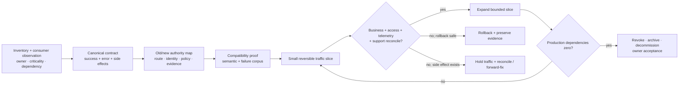

**Figure interpretation:** Traffic routing is one middle step. The wave is complete only when business and control state agree and the old path is demonstrably unnecessary; rollback is valid only before unhandled side effects make it unsafe.

**Figure limitation:** The flow cannot make an irreversible database or partner change reversible. Exact rollback versus forward-fix rules, privacy-safe traffic capture, contract notice, and retention require case-specific approval.

### S6 — disconnected regulated edge, plant, or retail site

**Context and scenario assumptions.** A regulated manufacturing network has 80 sites; each site proxies local control and telemetry APIs to local services. WAN loss is assumed to last up to 24 hours, with a separate severe exercise at 72 hours. Existing runtime service must support safety read/acknowledgement traffic locally, while remote administrative change and new consumer enrollment stop. A site has an eight-hour bounded buffer for approved lossy operational telemetry, a separate tamper-evident mandatory-audit journal sized for the full 72-hour severe exercise, and a 30-day certificate-warning horizon. If mandatory audit cannot be retained, affected writes must follow an approved fail/degrade/stop rule rather than continue without evidence. Some sites can be reached only during planned windows. These values are scenario assumptions, not product guarantees.

**Mechanism and failure path.** During WAN loss, an already-running proxy may continue with cached configuration, but a restarted runtime can expose a stale or absent cache, a clean node may fail bootstrap, a license or secret dependency may block readiness, an issuer/JWKS cache may age out, a certificate may expire, centralized quota state may diverge, and evidence queues may fill memory/disk. Operational telemetry may be sampled or dropped only by its approved class and with explicit loss accounting; mandatory security/business audit must use the retained journal or trigger the journey's fail/degrade/stop rule. Operators can mistake continued request success for recoverability. When connectivity returns, an old node and the control plane may each contain changes; immediately admitting traffic before state attestation can reintroduce revoked access or rejected configuration.

Official product documents illustrate different responsibility seams. Kong documents hybrid behavior, version/plugin compatibility constraints, cached configuration, and telemetry buffering in [hybrid mode](https://developer.konghq.com/gateway/hybrid-mode/) and mTLS communication between planes in [control-plane/data-plane communication](https://developer.konghq.com/gateway/cp-dp-communication/). Apigee's [hybrid shared-responsibility model](https://docs.cloud.google.com/apigee/docs/hybrid/shared-responsibility-model) assigns customer duties across Kubernetes, networking, load balancing, certificates, telemetry, business continuity, and upgrades. Azure's [self-hosted gateway support policies](https://learn.microsoft.com/en-us/azure/api-management/self-hosted-gateway-support-policies) distinguish Microsoft and customer support responsibilities. MuleSoft's [Runtime Fabric documentation](https://docs.mulesoft.com/runtime-fabric/latest/) describes customer infrastructure and shared operational duties. These volatile product claims are **documented as of 2026-08-18** and require edition/version revalidation; none proves S6 continuity.

**Ownership and best practice.** Platform engineering owns the runtime image/config cache, bootstrap, version compatibility, capacity, and reconnect protocol; the site/OT owner owns local network, hosts/clusters, safe service modes, physical access, and business continuity; IAM/PKI owns offline validation rules, key/certificate overlap, revocation tolerance, and break-glass; SRE owns operational telemetry buffering and recovery exercise; security/audit owns mandatory-journal classification, integrity, retention, export, and the write-stop rule. Classify journeys as fail closed, local continue, or read-only degrade; define a maximum accepted config/key/revocation age; package last-known-good state with attributable digest; maintain local dependency health; separate mandatory audit from approved lossy telemetry; pre-position trust; and quarantine restarted/new nodes until active state and time are attested.

**Anti-pattern.** “The data plane works disconnected.” That statement hides at least existing traffic, restart, clean-node scale-out, configuration change, revoke, certificate rollover, quota, telemetry, and reconnect states. Copying a cache directory manually without provenance can restore service with untrusted state.

**Measurable acceptance.** Execute 24- and 72-hour disconnects with existing traffic, runtime restart, node loss, clean-node bootstrap, issuer/JWKS unavailability, certificate overlap and expiry boundary, local clock drift, secret/license dependency loss, operational-telemetry sink stop/queue fill, mandatory-audit journal pressure/unavailability, emergency revoke request, local config rejection, reconnect conflict, and regional/site failover. Measure accepted/rejected journeys, stale age, active digest, bootstrap/restart result, certificate/key validity, quota drift, telemetry buffer capacity/age/drop by approved class, mandatory-journal capacity/integrity/retention/export, request SLI, incident access, reconciliation time, conflict disposition, and audit completeness. Acceptance requires approved behavior for every state, zero loss in the mandatory audit class, measured/dispositioned loss only in approved operational-telemetry classes, correct write stop/degrade when audit cannot be retained, and no full traffic before desired=active plus business probes.

**Artifacts and reviewer.** Retain signed/attributable last-known-good bundle, digest and version matrix, captured flows, dependency inventory, journey degraded-mode table, fault scripts, runtime/readiness records, identity and certificate evidence, operational-telemetry queue/WAL/drop metrics by class, mandatory-audit journal integrity/retention/export and stop-rule evidence, reconnect diff, operator timeline, and recovered audit. Site operations and safety/risk validate local behavior; platform SRE validates runtime; IAM/PKI validates trust; security/audit validates zero-loss mandatory evidence and stop behavior; an independent reviewer checks that remote support assumptions are not hidden.

**Counterfactual and non-fit.** A centrally managed-only service can be the simpler correct design when connectivity SLO, region, latency, and data boundary are demonstrably adequate and the site has no safe autonomous action. Offline continue is non-fit for high-risk writes when current revocation/authorization cannot be established. Customer-hosted runtime is non-fit when the site cannot patch, monitor, back up, or physically recover it; local autonomy without local ownership is only relocated risk.

**Figure AIP-8 — Disconnection creates distinct existing, restart, clean-node, revoke, telemetry, and reconcile states.**

- **Depicted scope:** connected accepted state, WAN loss, existing runtime, restarted runtime, clean-node bootstrap, urgent revoke/change, approved lossy telemetry buffering/loss accounting, mandatory-audit retention/stop behavior, reconnect quarantine, desired/active reconciliation, and traffic readmission.
- **Excluded scope:** one product's cache format, permitted stale interval, license behavior, configuration conflict algorithm, PKI profile, buffer sizing, and achieved continuity.
- **Diagram source, evidence state and as-of:** inline state model from synthetic S6, `RE-1/I-02/I-05`, the official shared-responsibility sources linked above, and OpenTelemetry Collector resiliency guidance; scenario hypothesis, 2026-08-18.
- **Accessible equivalent:** after WAN loss, existing service can continue within an approved stale window, restart may use attributable last-known-good state or quarantine, clean nodes may remain blocked, and urgent remote revoke/change follows the approved safety rule. Approved operational telemetry buffers until bounded capacity then records class-specific loss. Mandatory audit stays in a retained journal; if it cannot be retained, affected writes stop or degrade by approved rule. Reconnect enters quarantine, compares desired/active state, resolves conflict, exports/reconciles evidence, runs probes, and only then readmits traffic.

```mermaid
stateDiagram-v2
  [*] --> Connected: desired = active; probes pass
  Connected --> Disconnected: WAN / control path lost
  Disconnected --> Existing: accepted state within approved age
  Disconnected --> Restarted: runtime restarts
  Disconnected --> CleanNode: replacement has no trusted state
  Disconnected --> RevokePending: urgent remote change requested
  Existing --> EvidenceBounded: operational telemetry queues locally
  Existing --> AuditRetained: mandatory audit journal retained
  Restarted --> Existing: attributable LKG + dependencies valid
  Restarted --> Quarantine: stale / missing / invalid state
  CleanNode --> Quarantine: bootstrap unavailable
  RevokePending --> Quarantine: journey cannot satisfy safety rule
  EvidenceBounded --> EvidenceLoss: approved lossy class exceeds bound
  AuditRetained --> Quarantine: mandatory audit cannot be retained; stop / degrade writes
  Existing --> Reconcile: control returns
  Quarantine --> Reconcile: control returns
  EvidenceLoss --> Reconcile: account for approved class gap
  AuditRetained --> Reconcile: export retained mandatory audit
  Reconcile --> Connected: desired = active; conflicts closed; probes pass
```

**Figure interpretation:** Warm proxy success proves only one state. Operational continuity requires separately accepted behavior for restart, new capacity, security change, class-specific telemetry loss, mandatory-audit retention, and reconciliation; unsafe or unauditable write states stop, degrade, or quarantine rather than silently continue.

**Figure limitation:** The model does not promise that cached state exists, that restart is possible, or that offline write authorization is safe. Product behavior and local risk appetite must be proven for the exact version/topology.

### S7 — event, webhook, gRPC, and bulk-data boundary

**Context and scenario assumptions.** A healthcare and logistics portfolio exposes synchronous REST/gRPC queries, outbound partner webhooks, event streams, and an authorized bulk export. The bulk job can run for four hours and produce 120 GB in partitioned files; webhook receivers may be unavailable for six hours; event consumers can lag or replay; the gRPC stream can last twenty minutes. These values are scenario assumptions. They exist to prevent a short HTTP request/response model from defining every interface.

**Mechanism and failure path.** Protocol contracts differ: gRPC has streaming and status semantics; webhooks need delivery attempt identity, signature, retry/backoff, receiver ownership, and dead-letter/replay policy; brokered events need channel, message, schema, partition/order, acknowledgement, retention, poison handling, consumer offset, and replay; bulk export needs job authorization, durable status, file/object protection, expiry, resumability, and audit. A gateway can authenticate, admit, route, validate a bounded envelope, and add correlation. It should not pretend that an HTTP 202 means a durable job exists, that forwarding a publish request means every subscriber processed it, or that a plugin owns offsets, compensation, or a 120 GB object lifecycle.

AsyncAPI 3.1.0 defines a machine-readable interface for message-driven APIs, including channels, operations, messages, and security schemes ([AsyncAPI 3.1.0 specification](https://www.asyncapi.com/docs/reference/specification/v3.1.0)). The stable [CloudEvents 1.0.2 primer](https://github.com/cloudevents/spec/blob/ce%40v1.0.2/cloudevents/primer.md) defines format interoperability while explicitly leaving producer/consumer processing, persistence, authorization/integrity/confidentiality, semantic meaning, ordering, and versioning policy to the system. HL7's current published FHIR Bulk Data 3.0.0 [system export operation](https://hl7.org/fhir/uv/bulkdata/OperationDefinition-export.html) requires the FHIR asynchronous request pattern; current SMART App Launch 2.2.0 [backend services](https://hl7.org/fhir/smart-app-launch/STU2.2/backend-services.html) defines autonomous client authentication/authorization patterns. FHIR itself explicitly states that it is not a security protocol ([FHIR security](https://www.hl7.org/fhir/security.html)). These are protocol evidence as of 2026-08-18, not proof of an implementation; the HL7 guides retain their stated trial-use status and require version-specific conformance review.

**Ownership and best practice.** The domain product owner owns contract semantics, durable job/outcome state, privacy and consumer promise. The event/integration platform owns broker/webhook delivery infrastructure, retention, replay tooling, schema registry, and operational evidence. Security owns client/service identity, signature, data scope, and download access. The API platform owns edge authentication, bounded validation/admission, protocol-aware routing, and correlation where useful. Publish OpenAPI/AsyncAPI or relevant protobuf/FHIR profiles with semantic compatibility rules; retain durable operation IDs; implement idempotent consumer and outcome/reconciliation rules; isolate large bodies and long streams; bound retries and backlog; and version event meaning, not only schema syntax.

**Anti-pattern.** “Everything is an API, so one REST gateway policy covers it.” Wrapping an event or file job in HTTP does not remove durable state, replay, ordering, privacy, or operational ownership. Returning 200/202 before durable acceptance produces false success. Automatic schema transformation can preserve syntax while changing enum, decimal, null, ordering, or error meaning.

**Measurable acceptance.** Test duplicate, out-of-order, missing, delayed, poison, schema-forward/backward, unauthorized-scope, signature rotation, receiver 429/5xx, broker partition, consumer restart, retention expiry, bulk-job restart, expired download, partial file, slow stream, oversize message, and ambiguous acceptance. Measure business invariant, durable acknowledgement, backlog age/size, redelivery, dead-letter resolution, order where promised, semantic diff, authorization at job and download, recovery/replay time, data/audit completeness, and gateway resource isolation. Acceptance requires no false synchronous success, attributable outcomes, and an approved reconciliation path for every ambiguity.

**Artifacts and reviewer.** Retain contracts and compatibility rules, producer/consumer versions, message/job IDs, auth scopes, schemas and samples, fault scripts, broker/job/gateway configs, acknowledgements/offsets/dead letters, webhook attempts, object manifests/hashes, traces, business reconciliation, and privacy disposition. Domain and consumer representatives review semantics; event/integration SRE reviews recovery; security/privacy reviews access and retention.

**Counterfactual and non-fit.** Direct broker, service mesh, or domain endpoint access is preferable when the gateway adds no required trust, product, admission, or evidence value and only introduces latency/failure. A gateway extension is acceptable for bounded stateless mediation with tested resource/semantic behavior. It is non-fit as the owner of durable workflow, consumer offset, ledger reconciliation, or bulk-object lifecycle unless it is deliberately engineered and staffed as that stateful service rather than assumed to be a proxy feature.

**Figure AIP-9 — Protocol mediation stops where durable acceptance, replay, ordering, and business outcome ownership begin.**

- **Depicted scope:** client/producer, bounded edge controls, protocol-specific service or broker, durable acceptance/job/event state, consumer processing, outcome/reconciliation, and evidence returned across the boundary.
- **Excluded scope:** one protocol binding, broker, FHIR server, delivery guarantee, schema registry, gateway feature, storage design, and proof that direct access is preferable.
- **Diagram source, evidence state and as-of:** inline responsibility model from synthetic S7 and the AsyncAPI, CloudEvents, FHIR Bulk Data, and SMART sources cited above; interpretation and scenario hypothesis, 2026-08-18.
- **Accessible equivalent:** the gateway may authenticate, admit, route, perform bounded validation, and propagate correlation. A protocol-aware domain/integration service or broker durably accepts the job/message/stream state. Consumers process with explicit acknowledgement/replay/order rules. The domain resolves business outcome and reconciliation, while evidence links each stage.

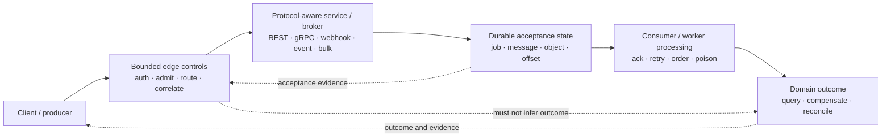

**Figure interpretation:** A gateway can make the edge safer without owning the long-lived state. Durable acceptance and outcome evidence prevent a transport-level success from being mistaken for completed business work.

**Figure limitation:** Some products combine gateway, broker, workflow, and storage roles. The responsibility tests still apply; the figure does not forbid combination, but it requires explicit state ownership, recovery, and proof.

### S8 — GenAI and agent-tool mediation

**Context and scenario assumptions.** An enterprise exposes three model providers and 40 internal tools to customer-service assistants. Ten percent of tasks may route to a secondary model during quota or regional pressure. Prompts can contain customer data; five tools can create refunds, modify orders, or retrieve regulated records. The assumed target is a per-task cost guardrail, zero unauthorized privileged tool actions in the test corpus, and a bounded quality decline under an approved fallback. These are scenario assumptions; there is no industry benchmark implied.

**Mechanism and failure path.** An AI gateway can centralize provider credentials, route, meter tokens, enforce request limits, redact selected fields, or normalize some provider interfaces. That does not prove semantic equivalence: provider/model fallback can change tool choice, structured output, safety behavior, context limits, residency, logging, or quality. A cache can return an answer generated under another user's context. Prompt/output traces can leak sensitive data. An agent can present a broad token to a tool, accept prompt-injected instructions, or report success before a long-running task reaches durable outcome. Spend can cascade through retries or recursive tool calls even while request rate appears normal.

Current official product documentation supplies capability-only examples: Kong describes AI Gateway routing, provider integrations, observability and governance mechanisms ([Kong AI Gateway](https://developer.konghq.com/ai-gateway/), [Kong AI providers](https://developer.konghq.com/ai-gateway/ai-providers/)); Azure API Management documents [generative-AI gateway capabilities](https://learn.microsoft.com/en-us/azure/api-management/genai-gateway-capabilities); and Apigee documents [AI API-management capabilities](https://docs.cloud.google.com/apigee/docs/api-platform/get-started/ai-capabilities). These are **documented facts as of 2026-08-18** only within each page's exact edition, topology, preview/region, limit, and entitlement conditions. They do not prove cross-provider semantic parity, safety, quality, privacy, tool correctness, or S8 fit.

The current [MCP 2026-07-28 authorization specification](https://modelcontextprotocol.io/specification/2026-07-28/basic/authorization) uses OAuth protected-resource metadata, authorization-server discovery, resource indicators/audience binding, issuer-aware response validation, client registration, and least-privilege/step-up scope handling for HTTP transports; MCP servers must not accept or transit tokens not issued for their resource. The [2026-07-28 release account](https://blog.modelcontextprotocol.io/posts/2026-07-28/) also describes a stateless core and authorization hardening including issuer validation and issuer-bound client credentials. These are rapidly evolving protocol-specific **documented facts as of 2026-08-18**, not proof of human intent, safe tool semantics, or durable task correctness. The [NIST AI RMF Generative AI Profile](https://www.nist.gov/publications/artificial-intelligence-risk-management-framework-generative-artificial-intelligence) is voluntary guidance spanning govern, map, measure, and manage activities; gateway policy is one control point inside that wider model-risk lifecycle.

**Ownership and best practice.** AI platform engineering owns provider adapters, credential isolation, routing mechanics, token/cost telemetry, and runtime reliability. Domain product owners own task intent, authoritative data, acceptable output and tool side effects. Security/privacy/model risk owns data classification, threat/evaluation requirements, provider boundary, human approval, and residual risk. Tools remain resource servers: validate audience/resource and least privilege, perform domain authorization, bind long-running tasks to the caller/context, expose durable status, and never trust the model as the policy decision point. Version model and prompt/policy together; evaluate routing and fallback; separate sensitive traces; cap tokens, recursion, concurrency, and spend; cache only where identity, freshness, safety, and semantic equivalence are explicit.

**Anti-pattern.** “The AI gateway supports multiple providers, so models are portable.” A normalized endpoint is not semantic parity. “The user authenticated to the assistant, so every tool call is authorized” confuses session identity, delegated authority, resource audience, domain authorization, and human intent. Logging every prompt for observability can create the data leak the control was meant to diagnose.

**Measurable acceptance.** Use an approved task/evaluation set across primary and fallback models, including prompt injection, cross-tenant context, prohibited data, tool-scope escalation, token replay/wrong audience, unsafe cached answer, provider timeout, quota exhaustion, recursive calls, model drift, malformed structured output, long-running task disconnect, and ambiguous tool outcome. Measure task-quality and safety criteria, privileged-action authorization, sensitive-data exposure, fallback equivalence bounds, cost per successful task, tokens/latency, retry and recursion amplification, cache correctness by identity/freshness, provider/location evidence, tool outcome attribution, and human-approval compliance. Thresholds are set by domain/model risk, not invented from platform averages.

**Artifacts and reviewer.** Retain model/provider/version, prompt/policy version, routing decision, token/cost metrics, redacted inputs/outputs or reproducible protected corpus, tool identity/scope/audience and domain authorization, eval result, fault timeline, cache decision, provider data-boundary evidence, durable task outcome, and reviewer disposition. Domain subject-matter reviewers judge quality; security/privacy performs exfiltration and authorization review; model risk approves evaluation and fallback boundaries; FinOps validates unit economics.

**Counterfactual and non-fit.** Direct provider access with a thin approved SDK can be safer for a small, single-model, low-risk workload when an AI gateway adds no material control or creates opaque transformations. A general API gateway alone is non-fit when the organization lacks model/prompt evaluation, provider-risk review, tool authorization, durable task outcome, and data-governance processes. Semantic caching is non-fit for personalized, authorization-sensitive, rapidly changing, or safety-critical answers unless the cache key and invalidation contract prove those boundaries.

**Figure AIP-10 — AI mediation controls transport and spend only when model risk and tool authorization remain explicit downstream decisions.**

- **Depicted scope:** user/task identity, AI gateway mediation, provider/model selection, evaluation and data-boundary gate, tool resource/audience/scope and domain authorization, durable task outcome, and protected evidence/cost feedback.
- **Excluded scope:** one AI-gateway product, model quality claim, prompt format, complete threat model, human-consent interface, cache algorithm, provider equivalence, and proof that a model or tool is safe.
- **Diagram source, evidence state and as-of:** inline responsibility model from synthetic S8, MCP 2026-07-28 authorization, and NIST AI 600-1 cited above; interpretation and scenario hypothesis, 2026-08-18.
- **Accessible equivalent:** an authenticated task reaches an AI gateway for credential isolation, budget, redaction, and bounded routing. Provider/model choice passes an evaluation and data-boundary decision. Any tool call receives a resource/audience/scope-bound identity and is re-authorized by the domain service. Durable task outcome and protected quality/safety/privacy/cost evidence feed the next routing and risk decision.

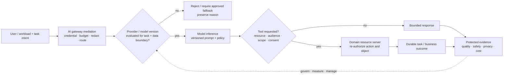

**Figure interpretation:** Provider normalization and a token-valid tool call are intermediate mechanisms. The domain still decides whether a specific action is authorized and records its durable outcome; model-risk evidence, not routing success, determines whether fallback remains acceptable.

**Figure limitation:** The diagram cannot prove human intent, model safety, tool-description trust, evaluation coverage, privacy, or transaction atomicity. Rapid protocol/model/provider change requires version-specific reassessment.

## Public engineering examples translated into practices

The five primary incidents in [document 42](42-public-failure-casebook.md) already turn real Cloudflare, Fastly, GitHub, and Let's Encrypt mechanisms into symmetric challenge tests. Three additional primary accounts sharpen operating practices without claiming that an API platform caused, would prevent, or is uniquely vulnerable to them.

| Primary account | Source-bounded mechanism | API-management practice implication | What must not be inferred |
|---|---|---|---|
| AWS Kinesis, November 2020 | AWS reported that capacity addition triggered a latent all-to-all thread-limit issue; a best-effort telemetry buffer problem affected Cognito, and CloudWatch/alarms were impaired during recovery ([AWS service event summary](https://aws.amazon.com/message/11201/)) | Test structural/cardinality limits, make critical identity dependencies explicit, bound buffers, and retain an evidence/alert path that does not share the failed dependency | That an API gateway shares this implementation or that adding capacity is generally unsafe |
| Meta backbone/DNS, October 2021 | Meta reported that a maintenance command disconnected backbone links, an audit-control issue failed to stop it, DNS withdrew BGP advertisements, and normal tools plus remote access were impaired ([Meta engineering account](https://engineering.fb.com/2021/10/05/networking-traffic/outage-details/)) | Separate configuration validation and blast radius; prove out-of-band status, communication, authorization, rollback, and physical/remote recovery access | That one gateway or multicloud topology removes correlated control dependencies |
| Atlassian deletion/restore, April 2022 | Atlassian reported that a valid maintenance workflow used app and site identifiers in a way that deleted customer sites; the path escaped expected monitoring and restoration at that scale was not rehearsed ([Atlassian incident review](https://www.atlassian.com/blog/how-we-build/post-incident-review-april-2022-outage)) | Type and scope destructive APIs, preview affected objects, use staged/soft-delete controls where feasible, preserve independent contact/control records, and rehearse restore throughput plus reconciliation | That every bulk API needs the same approval flow or that soft delete replaces tested recovery |

These accounts are engineering anecdotes and primary disclosures, not independent audits or frequency data. Their value is mechanism diversity: capacity structure, hidden critical dependency, buffer failure, correlated management access, typed destructive intent, monitoring coverage, and restore scale. A program adopts the corresponding test only when the mechanism can apply to its exact option and records a reason when it cannot.

## Failure-pattern synthesis: anti-patterns and replacements

| Anti-pattern | Hidden failure | Replace with | First proof |
|---|---|---|---|
| Gateway uptime is the API SLO | Identity, backend, data, DNS, and business outcome can fail while proxy is up | Consumer-visible good event and end-to-end error budget | Correlate request to business outcome during one dependency fault |
| One global policy everywhere | Speed creates correlated blast radius and ignores journey context | Versioned minimum policy plus bounded profile/exception and canary cells | Expensive valid policy stopped inside first cell |
| Valid token equals authorized action | Object, transaction, consent, resource, and risk context are absent | Explicit gateway/domain authorization boundary with negative corpus | Cross-tenant/object and wrong-audience attempts rejected and attributable |
| Autoscaling is capacity engineering | Cold starts, dependencies, quotas, retries, and queues can worsen a cascade | Measured resource envelope, warm margin, admission and recovery hysteresis | Zone-loss burst recovers without retry amplification |
| Git is automatically source of truth | UI/API/controllers/emergency paths can still mutate active state | One authority per object plus desired/active attestation and reconciliation | Out-of-band mutation detected, contained, and reconciled |
| Catalog count is governance | Unknown runtime assets and stale owners disappear from denominator | Multisource estate reconciliation with provenance, freshness, owner and expiry | Observed endpoint has one registered/excluded/incident disposition |
| OpenTelemetry export equals observability | Queue overflow, privacy, semantic instability, sampling, and sink coupling remain | Minimum evidence contract, bounded failure mode, loss accounting, cost and privacy guardrails | Sink stop/restart preserves request SLI and reports every evidence gap |
| Portal equals developer experience | Contract, access, credentials, runtime entitlement and support drift | End-to-end consumer task and access-state reconciliation | New partner first success plus rotation/revoke completed from retained evidence |
| Route parity equals migration | Identity, semantics, consumers, telemetry, business side effects and support differ | Compatibility corpus, authority map, reversible slices, reconciliation and dependency-zero exit | Small slice proves semantic and outcome parity or rolls back within bound |
| More gateway plugins means more integration capability | Durable state, ordering, replay, compensation and extension security become orphaned | Boundary based on state/side effect/recovery ownership | Duplicate, poison, timeout-after-commit and rollback tests preserve invariant |
| “Multicloud” is a resilience result | State, skills, identity, support, cost, and recovery can remain correlated | Field-level flow/responsibility ledger and failure-state matrix | Existing/restart/new-node/revoke/reconcile behaviors each pass or stop |
| AI provider normalization means portability | Model behavior, data boundary, tools, safety, quality and cost differ | Versioned evaluation, scoped tools, data controls, bounded fallback and outcome evidence | Fallback and injection suite meets domain/model-risk thresholds |

## Capability maturity and adoption sequence

This maturity model measures **assurance and operating evidence**, not organization type, runtime custody, vendor, or chronological prestige. `OA-A` through `OA-D` and `RC-1` through `RC-3` can each operate at any stage. A simpler pattern with reproducible evidence is more decision-grade than a complex “advanced” topology supported only by claims. Stages may differ by journey; a program must not average a critical payment at `IPM-1` with low-risk APIs at `IPM-4`. The `IPM` prefix prevents collision with the repository's separate `M0`–`M5` Mule migration-wave identifiers.

| Stage | Operating outcome | Required evidence | Exit gate |
|---|---|---|---|
| `IPM-0` — claimed | A capability or policy is named, but boundary, owner, active state, and failure behavior are unresolved | Inventory of claims and unknowns; no decision use beyond research backlog | Exit when the journey, owner, topology/custody, state, and material unknowns are bounded |
| `IPM-1` — documented and attributable | Intended contract, responsibility, configuration authority, dependencies, and evidence plan are reviewable | Outcome/trust contract, option record, flow/state ledger, source/approval/provenance, thresholds and test design | Gate 1 accepts scope and symmetric procedure; no production-fit conclusion |
| `IPM-2` — reproducibly proven | Normal, degraded, recovery, and rollback behavior meets approved thresholds in a representative E3 boundary | Raw run bundle, versions/configs/digests, load/fault inputs, measures, negative results, reviewer and limitations | Gate 2 accepts bounded fit or records redesign/rejection |
| `IPM-3` — production-calibrated | A limited production pilot demonstrates service, ownership, support, cost, consumer, and recovery behavior with real dependencies | E4 pilot observations, incident/change/on-call records, consumer task results, SLO/cost, reconciliation and rollback | Gate 4 accepts expansion only for the proven boundary; Gate 3 admits the pilot but cannot confer this stage |
| `IPM-4` — adaptive and exit-ready | Evidence routinely changes policy, capacity, backlog, exceptions, economics, migration, and retirement; recovery and exit are rehearsed | Trend and decision records, game days, active-state coverage, exception expiry, unit economics, dependency-zero/decommission and exit exercise | Sustain only while outcome, risk, cost and exit guardrails remain within appetite; regress stage after material unproven change |

The adoption sequence is risk-first, not technology-first:

1. **Bound the service and decision.** Select three to five representative journeys, name outcome owners, accept `P1`–`P10`, record the OA×RC responsibility seam, and freeze scenario assumptions at Gate 0.
2. **Close trust, correctness, and change hazards.** Establish BP-1 through BP-4 and BP-6 for the highest-consequence journey: identity/authorization boundary, retry/idempotency, capacity/degraded mode, state/flow ledger, configuration authority, active-state attestation, and minimum evidence.
3. **Prove one thin vertical path.** Use a real contract, consumer, identity, runtime, backend, telemetry, on-call, cost record, injected fault, rollback and reconciliation. Do not start with a feature tour or broad inventory migration.
4. **Productize the paved road.** Turn accepted controls into templates, APIs, delegated scopes, support, runbooks, dashboards, and retained evidence. Measure consumer task success and domain/platform load before federation.
5. **Add estate and coexistence control.** Reconcile catalogs with runtime/identity/DNS/cert/owner truth; move reversible migration cells; expire exceptions; prove old-platform dependency removal.
6. **Expand topology or protocol only for a documented force.** Add a cloud, edge, Kubernetes pattern, event/bulk path, or AI mediation when residency, latency, autonomy, risk, or economics justifies its extra responsibility and proof burden.
7. **Institutionalize recovery and exit.** Repeat regional, identity, telemetry, configuration, consumer, migration, and provider-exit exercises; tie funding and roadmap to evidence and unit outcomes.

**Figure AIP-11 — Adoption should move from bounded outcome to proof, productization, controlled scale, and rehearsed exit.**

- **Depicted scope:** Gate-0 boundary, highest-consequence controls, thin vertical proof, paved-road productization, estate/coexistence control, justified topology/protocol expansion, and recurring recovery/exit feedback.
- **Excluded scope:** calendar duration, team count, a mandatory topology, vendor selection, simultaneous work, automatic stage advancement, and proof that later steps are always more valuable.
- **Diagram source, evidence state and as-of:** inline sequence derived from the adoption steps and `IPM-0`–`IPM-4` assurance states above; interpretation and governance model, 2026-08-18.
- **Accessible equivalent:** approve a bounded journey and responsibility; close its trust/correctness/change/evidence hazards; prove one complete vertical slice; productize accepted controls; reconcile the estate and time-bounded coexistence; expand topology/protocol only for an explicit force; continually rehearse recovery and exit. Negative evidence loops to the prior accepted boundary.

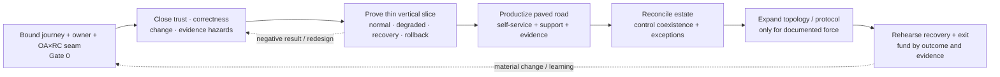

**Figure interpretation:** A successful installation is not an adoption milestone. The first useful proof crosses consumer, identity, gateway, service, business state, telemetry, operator, rollback, and cost; later scale packages that evidence rather than widening an unproven failure domain.

**Figure limitation:** Workstreams can overlap and low-risk journeys may use lighter controls. The figure does not justify delaying urgent risk remediation or require every API to traverse the same calendar sequence.

## Decision-grade practice review checklist

Use this checklist when adding a study, scenario, guide, pattern, or recommendation. It is a quality gate, not a new taxonomy or numeric score.

| Review question | Pass evidence |
|---|---|
| Is the business or consumer outcome named? | Good event, consequence of error, service/degraded promise, and domain journey owner are explicit |
| Is the evaluated object bounded? | Product/version/edition, OA ownership, RC custody, configuration authority, topology, dependencies, support, and migration role are resolved or marked blockers |
| Is the mechanism visible? | Request, control, identity, data, telemetry, state, recovery, and operator paths identify what initiates connections, stores state, and fails first |
| Are accountable roles unambiguous? | Platform service, domain correctness, IAM/PKI, SRE, consumer/support, risk, finance, and exception responsibilities have decision and escalation clocks |
| Does proof cover the lifecycle? | Normal, degraded, failure, recovery/reconciliation, rollback/forward-fix, and exit/decommission states are exercised where applicable |
| Are measure and threshold approved? | Consumer/business measure, SLI, safety invariant, RTO/RPO, stale/loss bound, cost and stop rule are scenario-specific and owner-approved |
| Are artifact and reviewer named? | Raw versioned configs, hashes, inputs, outputs, timelines, reconciliation, limitations, and independent reviewer can reproduce the conclusion |
| Is counter-evidence first-class? | Strongest counter-hypothesis, credible non-fit, falsifier, and negative-result decision impact are prominent |
| Are sources primary and point-of-use? | Standards and product claims link at the exact claim with as-of/version/edition/topology limitations; observed results are not inferred |
| Are prohibited inferences absent? | No market prevalence, benchmark, maturity, portability, multicloud resilience, semantic equivalence, or vendor selection is inferred from feature documentation |

## Decision implications

- Keep `P1`–`P10` as the only canonical problem taxonomy; use BP-1 through BP-10 as implementation and evidence contracts, not a second ranking.
- Select organization ownership and runtime custody independently. Document the shared-responsibility seam for every zone and journey before scoring a product topology.
- Fund a platform **product**, not only gateway infrastructure: consumer journeys, delegated delivery, support, active-state evidence, recovery, economics, and retirement are part of the service.
- Give domains permanent accountability for contract semantics, business authorization, data correctness, durable side effects, consumer outcome, and reconciliation. A central factory can deliver on their behalf but must not absorb that accountability.
- Treat policy, schema, generated configuration, certificate, model/prompt, and controller state as executable production artifacts with provenance, resource/semantic checks, canary isolation, an independent kill path, and reconciliation.
- Measure resilience by useful business work and recovery consistency under fault—not process uptime, maximum RPS, or DNS failover alone.
- Make coexistence explicit and reversible. Every old/new cell needs one authority per object, owner, expiry, rollback/forward-fix rule, cost, and dependency-zero exit.
- Do not infer event, bulk, or AI semantics from HTTP mediation. Durable acceptance, replay/order, model/tool behavior, authorization, business outcome, and risk evaluation retain their own owners.
- Preserve negative evidence. A failed scenario can reject an option, narrow a topology, or change operating design; tuning and rerun do not erase the original result.

## Falsification and proof plan

The provisional operating-system hypothesis is falsified if a simpler central or managed design produces equal or better business, risk, recovery, consumer, and economic outcomes under symmetric evidence; if federation cannot sustain ownership and mandatory controls; or if the evidence cost exceeds the decisions it improves. The individual practices are falsified or narrowed when their mechanism cannot apply to the exact topology or a lower-complexity control meets the same approved outcome.

| Proof ID | Canonical problem | Procedure | Measure and scenario threshold | Required artifact | Reviewer and decision impact |
|---|---|---|---|---|---|
| `IPR-01` | `P1` | Rotate key/cert; delay issuer/JWKS; apply wrong audience/resource, clock skew, revoke and cross-tenant/object attempts | Zero unauthorized business acceptance; degraded behavior and propagation within Gate-0 bounds | Token/cert/config timeline, decisions, domain outcome, audit, active digest | IAM/PKI, security and domain; rejects trust profile or topology on failure |
| `IPR-02` | `P2` | Apply representative cost mix, burst, slow dependency, zone loss, cold start and client retry behavior | Business invariant holds; queues/retries bounded; unaffected tier SLO and recovery threshold pass | Load seed, policies, resource/queue series, outcomes, reconciliation | Domain, performance, SRE; changes isolation/capacity/admission design |
| `IPR-03` | `P3` | Disconnect management; test existing, restart, clean node, urgent revoke/change, reconnect conflict | Each state matches approved safety rule; desired=active and probes before readmission | Flow capture, config bundles/digests, readiness, operator and reconcile log | Platform SRE, security, residency/risk; rejects custody option if critical state fails |
| `IPR-04` | `P4` | Submit invalid, valid-expensive, oversized/cardinality, incompatible and data-derived artifacts | Rejected or stopped in canary; independent kill/restore works; no unexplained drift | Source/provenance, validation, canary metrics, kill/rollback, fleet digests | Platform/SRE/security; holds APIops and global-policy promotion |
| `IPR-05` | `P5` | Reconcile source repositories, catalogs, deployments, runtime traffic, identity clients, DNS/certificates, products and accountable owners | Every observed endpoint is registered, intentionally excluded with owner/expiry, or an incident; missing owner, stale metadata and version/deployment disagreement meet Gate-0 bounds | Timestamped source extracts, normalized identity map, reconciliation ledger, exceptions/incidents and resolved-orphan drill | API-product/governance, domain owner and independent audit reviewer; blocks migration scope and governance conclusion when denominator is unknown |
| `IPR-06` | `P6` | Slow/stop sink, fill queue/WAL, restart collector/runtime, restore and drain | Request SLI safe; all dropped/delayed evidence measured; privacy/cost guardrails pass | OTel/vendor config, queue/drop/drain, traces/logs/metrics, cost | SRE, security/privacy, audit; rejects request-path coupling |
| `IPR-07` | `P7` | Onboard, first-call, change scope, rotate, suspend, revoke and deprecate three personas | Task success and Gate-0 lead-time; zero unexplained entitlement mismatch/orphan | State transitions, calls, approvals, credential and support record | Product, consumer/partner, IAM; redesigns access product |
| `IPR-08` | `P8` | Inject duplicate/order/poison/job faults or model fallback/injection/tool-scope faults as applicable | Domain invariant, durable outcome, quality/safety/privacy/cost thresholds pass | Contracts, versions, fault/eval corpus, durable state, protected evidence | Domain, integration or AI platform, security/privacy/model risk; rejects mediation boundary |
| `IPR-09` | `P9` | Prove compatibility corpus, move a reversible slice, inject auth/semantic fault, rollback or reconcile, then scan/revoke/archive/decommission the old dependency | Approved semantic/outcome variance and rollback bound pass; zero unexplained production dependency remains before exit | Corpus/diff, consumer map, traffic/business reconcile, dependency scan, revoke and archive/destruction record | Domain/security/architecture/sourcing; expands, holds, retains bounded coexistence, or blocks exit |
| `IPR-10` | `P10` | Run change, incident, after-hours escalation, support, exception, recovery and cost/allocation exercise | Decision/escalation clocks, staffing/on-call, handoff, consumer and unit-cost guardrails pass | RACI, pages/tickets, timeline, staffing/cost, lessons and backlog action | Product council, SRE, domain and finance; changes OA choice/funding |

Every observed result bundle records procedure, exact product/version/edition/topology, infrastructure and dependency versions, configuration and hashes, workload/data, injected fault, timestamps, raw measures, business reconciliation, reviewer, limitations, and negative results. Screenshots and summary charts help review but do not replace raw artifacts.

## Risks and limitations

- The study is a structured synthesis, not a statistically representative market survey. No frequency, adoption, market-share, maturity, or vendor-quality claim is made.
- Official product documentation describes a published mechanism and can change by edition, region, entitlement, version, or support policy. Revalidate volatile claims when an exact option enters Gate 1 and before each decision.
- Standards define interoperable pieces and security expectations, not end-to-end enterprise correctness. Conformance to OAuth, OpenAPI, AsyncAPI, CloudEvents, Gateway API, OpenTelemetry, FHIR, MCP, or SLSA cannot substitute for scenario proof.
- Public incident accounts are source-bounded disclosures, not independent audits. Their architecture, scale, and recovery times cannot be copied into local probability or threshold models.
- All S1–S8 numbers and acceptance bounds are scenario assumptions. They must be replaced or approved using estate, traffic, incident, regulatory, consumer, support, staffing, and cost evidence.
- The practice framework emphasizes API access and management. It does not replace secure software development, application threat modelling, data governance, database consistency design, broker/workflow engineering, model-risk management, network architecture, or business continuity.
- Federation can reduce central bottlenecks or multiply inconsistency. Centralization can simplify ownership or create correlated failure. Neither is preferred without observed operating capacity and risk evidence.
- A passed E3 result remains bounded by topology, version, policy chain, load, dependencies, data, and fault. Material changes regress assurance until their delta is proven.
- Cost measures can be distorted by shared infrastructure allocation, unrecorded domain labor, dual-run, support, egress, telemetry, and delayed decommission. Use ranges and sensitivity, not a single synthetic TCO.
- Some evidence contains credentials, personal data, vulnerabilities, commercial terms, or attack details. Public study structure must coexist with restricted raw bundles and controlled reviewer access.

## Open evidence requests

| Request | Owner role | Due gate | Decision impact |
|---|---|---|---|
| Approve or replace every S1–S8 traffic, recovery, data, identity, staffing, and cost assumption | Domain owners with SRE, risk, finance and consumer representatives | Gate 0 | Without calibration, thresholds are test design only and cannot reject an option fairly |
| Resolve OA archetype and RC custody plus shared-responsibility fields for each representative journey/zone | Platform product owner and architecture, with vendor/support evidence where applicable | Gate 1 | Blocks exact option definition, RACI, staffing and support comparison |
| Produce field-level state/flow ledger including payload, config, credentials, telemetry/audit, backup/support data and operator access | Security/privacy, platform architecture and vendor engineering | Gate 1 | Can reject topology for residency, continuity, or support-boundary conflict |
| Establish current inventory denominator and reconcile source, runtime traffic, identity clients, DNS/certs, products and owners | API governance/product and domain owners | Gate 1 | Determines migration scope, orphan risk, licensing and ownership capacity |
| Approve business good events, degraded modes, retry/idempotency, RTO/RPO, stale windows and recovery consistency | Domain business/service owners with risk and SRE | Gate 0/1 | Defines IPR-01 through IPR-03 pass/fail rather than relying on gateway uptime |
| Resolve telemetry/audit minimum, privacy, residency, retention, loss, queue and unit-cost rules | SRE, security/privacy, audit and FinOps | Gate 1 | Can reject analytics/export architecture or require local durability |
| Capacity-load platform, domain, IAM/PKI, SRE, consumer support and migration/on-call duties | Product owner and workforce/finance authorities | Gate 1 | Can falsify federation or self-managed custody despite technical capability |
| Obtain E2 pricing, support, SLA/service-credit, region, entitlement, portability and exit evidence for exact options | Sourcing, legal, finance and platform owner | Gate 2 | Blocks economic conclusion, risk transfer claim and long-term commitment |
| Execute IPR-01 through IPR-10 symmetrically and retain raw reviewed bundles | Evidence lead and protocol-specific owners | Gate 2/3 | Required for shortlist, pilot, production expansion, or rejection |

## Next gate

Gate 0 is a joint platform-product, architecture, security, SRE, domain, developer-experience, risk, and finance review. It passes only when the forum:

1. accepts `P1`–`P10` as the canonical problem boundary and BP-1 through BP-10 as the proposed practice/evidence response;
2. accepts or amends the OA×RC separation and names accountable roles without transferring domain business correctness to the platform;
3. accepts, replaces, or removes every S1–S8 scenario assumption and measurable threshold;
4. approves the compact scenario matrix, maturity evidence states, adoption sequence, IPR-01 through IPR-10 procedures, independent reviewers, and restricted evidence locations; and
5. records the counter-hypothesis that a simpler central/managed pattern may be superior, with the evidence that will compare it symmetrically.

Gate 0 does **not** select a vendor, declare Kong preferred, approve a multicloud target, or treat documented capability as demonstrated fit. After Gate 0, Gate 1 may bind the accepted practices to exact option contracts. The [Kong multicloud roadmap](44-kong-multicloud-study-roadmap.md) can then project the same scenarios into its workstreams and KMR protocols; its results remain candidate-specific evidence inside the enterprise method, not a replacement for it.
