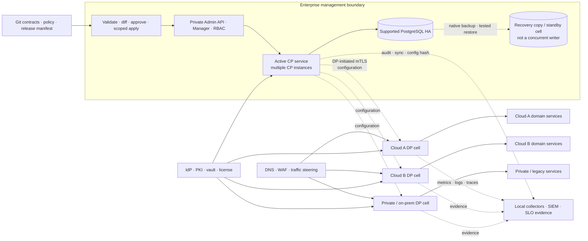
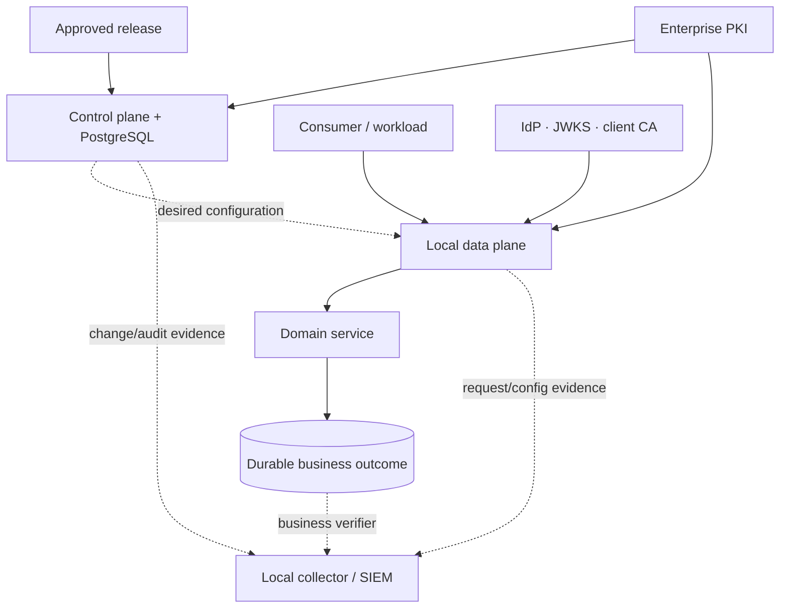
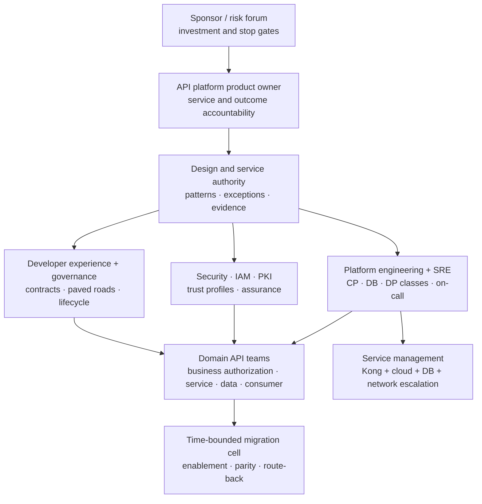
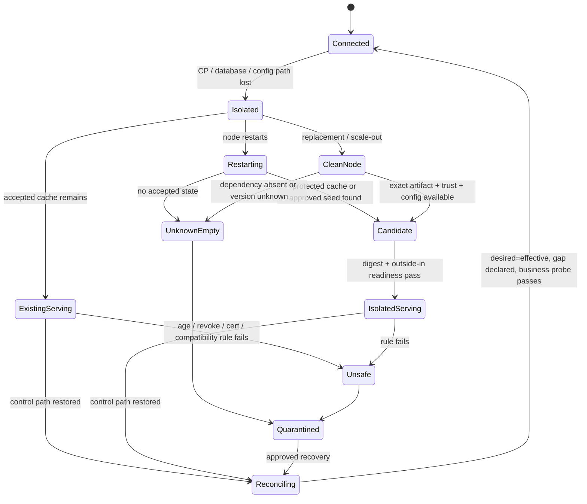
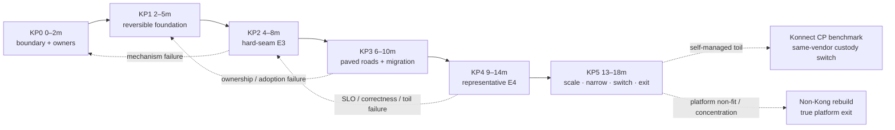
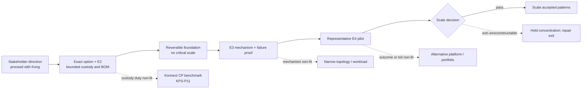

<!-- study-contract: principal -->

# Kong enterprise platform deployment strategy: self-managed control, multicloud data planes

| Field | Value |
|---|---|
| Artifact type | principal-study |
| Decision question | How should the enterprise deploy Kong as a long-term API platform, and under what outcome and evidence gates is a self-managed control plane the better strategic fit? |
| Decision owner | API-platform product owner with the enterprise architecture, security, SRE, risk, sourcing, and domain design authority |
| Primary audiences | Executives, directors, enterprise and platform architects, security, IAM/PKI, developers, DevOps, SRE, network, operations, API-product, sourcing, FinOps, and migration teams |
| Scope | Stakeholder decision posture to proceed with Kong Gateway Enterprise; conditional self-managed hybrid control-plane/data-plane target; customer-operated PostgreSQL, PKI, APIOps and multicloud data planes; bounded Kubernetes authority; RE-1 journeys; 0–18 month platform plan; Konnect operating-model benchmark and true cross-platform exit |
| Evidence state | Stakeholder planning decision plus documented `E1` mechanisms, interpretation, hypotheses, and synthetic scenario assumptions; no `E2` contract closure, `E3` reproducible target execution, `E4` representative pilot, observed customer outcome, or universal product superiority claim |
| Reference case | Synthetic [RE-1 regulated hybrid enterprise](41-enterprise-reference-case.md); all inherited counts, rates, objectives, durations, and thresholds remain scenario assumptions |
| As-of date | 2026-08-18; revalidate exact Gateway, PostgreSQL, decK, plugin, Kubernetes, KIC/Operator, entitlement, support, and hosting facts at each option freeze |
| Next gate | Gate KP0 accepts the bounded target, funds accountable self-managed operations, and authorizes reversible foundation proof—not production scale or a retroactive vendor-selection result |

## Executive answer

Proceed with a **bounded, reversible Kong platform foundation** and use **self-managed Kong Gateway Enterprise hybrid mode** as the leading production target: enterprise-operated control-plane nodes and PostgreSQL in a protected management cell, with customer-hosted data-plane groups close to APIs in each approved cloud, Kubernetes cluster, and private zone. Keep one configuration authority per entity, use enterprise PKI for control-plane/data-plane trust, preserve local evidence paths, and admit traffic by composite business readiness rather than gateway process health.

This is the better fit **for this stated strategy** because the enterprise values control-plane and configuration-database custody, multicloud runtime placement, request-path continuity during management-plane loss, and a platform it can automate without making a cloud provider the architectural center. Kong's documented hybrid mechanism separates the database-backed control plane from data planes, lets data planes initiate mTLS control connections, and lets existing or restarted data planes proxy from cached configuration during a control-plane interruption ([hybrid mode](https://developer.konghq.com/gateway/hybrid-mode/), [CP/DP communication](https://developer.konghq.com/gateway/cp-dp-communication/)). Those are strong mechanism matches; they are not achieved outcomes.

The recommendation is conditional. Self-management adds PostgreSQL HA/DR, control-plane availability, PKI, license handling, secure administration, upgrades, backups, audit export, version/plugin compatibility, and 24×7 incident ownership. Kong recommends database-native backup for database-backed hybrid, notes that migrations are not reversible, and requires control planes to be upgraded before data planes ([backup and restore](https://developer.konghq.com/gateway/upgrade/backup-and-restore/), [upgrades](https://developer.konghq.com/gateway/upgrade/)). If the enterprise cannot fund and demonstrate those duties, Konnect with customer-hosted data planes becomes the stronger **same-vendor operating-model switch**. Konnect is not a vendor exit; a true exit must rebuild contracts, routes, identities, consumers, credentials, policies, plugins, evidence, and operating procedures on another platform.

Confidence is **high** that the architecture is a coherent target to prove, **medium** that self-managed custody is worth its added obligations for the stated priorities, and **zero** that production fit, scale, support, or economics have been demonstrated. The immediate commitment is to a reversible foundation and representative pilot. Any mandatory security, correctness, recovery, support, staffing, or exit failure stops or changes the target.

## Decision posture: selection assumption versus evidence

The stakeholder planning decision is: **proceed with Kong unless an agreed proof gate fails**. That decision changes sequencing and investment focus, but it does not rewrite the evidence history.

| Decision layer | What is decided now | What remains unproved | Governance consequence |
|---|---|---|---|
| Stakeholder direction | Kong is the strategic platform assumption for bounded foundation work | Exact option fit, production outcomes, contract terms, and comparative superiority | Fund Kong-specific design and proof while retaining stop rules |
| Deployment recommendation | Self-managed hybrid is the leading custody model | PostgreSQL/CP restore, staffing, version matrix, plugin set, entitlement, cost, and critical-journey behavior | Freeze one exact option before pilot admission |
| Earlier repository studies | [Kong sequencing hypothesis](04-kong-first-hypothesis.md) and [Kong multicloud roadmap](44-kong-multicloud-study-roadmap.md) remain `E1`/hypothesis studies | They contain no observed result and no final score | Do not cite the stakeholder decision as retroactive evidence |
| Production adoption | Not decided | `E2` support/terms, `E3` faults and recovery, `E4` representative operation | No critical scale until gates close |
| Exit | Both a Konnect switch and a separate non-Kong exit are required | Rebuild effort, credential transition, semantic parity, history gaps | Rehearse before concentration grows |

The decision can be rational without being an observed comparison result. It is a business risk posture: concentrate engineering on the most likely platform, preserve a falsifier, and avoid turning sunk cost into proof. A negative test remains valuable because it changes topology, custody, workload scope, or the platform choice before scale.

## Why Kong is the better fit here

| Outcome sought | Kong mechanism that fits | Why this is better for this scenario | Counterfactual that would change the answer | Proof before commitment |
|---|---|---|---|---|
| Customer custody of management state | Self-managed hybrid keeps CP nodes and PostgreSQL enterprise-operated | Aligns configuration authority, administrative evidence, backup, and recovery with the enterprise boundary | Control-plane custody is only a preference and managed lifecycle reduction is more valuable | Field-level state/flow ledger; E2 support boundary; isolated CP/database restore |
| Multicloud runtime without a database in every zone | Hybrid DPs receive configuration from CPs and proxy without direct database access | Places request enforcement near workloads while avoiding a regional Kong database per DP group | Most workloads and dependencies consolidate in one managed cloud | Packet-path capture, regional topology, latency/failure test, fully allocated TCO |
| Request continuity through management loss | DPs cache accepted configuration locally and can restart from it | Separates existing request service from CP/database availability | Required new-node scaling, urgent mutation, or revocation cannot tolerate CP loss | Existing/restarted/clean-node/revoke/reconnect matrix with active digest |
| One portable operating pattern across Kubernetes, VM, and private zones | Gateway runs on supported platforms; KIC/Operator can be admitted for explicitly Kubernetes-owned scopes | Reduces runtime variation while keeping a cluster-native path available | Kubernetes-only routing with a simpler conformant gateway satisfies the portfolio | Exact BOM, conformance, semantic diff, lifecycle, and support proof |
| Evidence-producing APIOps | decK can validate, diff, sync, apply, and dump through the Admin API | Fits Git review and desired-versus-active reconciliation | Native cloud policy/IaC gives materially safer change with less toil | Deletion guard, collision, partial failure, canary, rollback, per-DP config hash |
| Extensible edge policy without moving business state | Supported plugins and custom extension points cover bounded transport controls | Lets the platform standardize identity, traffic, and telemetry close to requests | Mandatory logic requires durable workflow, database writes, or unsupported plugins | Plugin/topology/entitlement matrix; performance, security, upgrade, and route-back test |
| Same-vendor managed fallback | Konnect can retain customer-hosted DPs while transferring CP/database lifecycle | Preserves much of the DP investment if self-managed toil fails | Konnect field location, geo, support, or service boundary is mandatory non-fit | Equivalent KMC-1/KMC-3 outcome, support, cost, and exit comparison |

This is scenario-relative preference, not a claim that Kong is universally better than Azure API Management, Apigee, MuleSoft, a cloud-native gateway, or a simpler Gateway API implementation. A managed platform can be better when one cloud dominates, SaaS management boundaries are acceptable, and reducing infrastructure operations matters more than control-plane custody. The decision is valid only while the stated outcome priorities remain true.

The automation and Kubernetes rows describe specific mechanisms, not generic portability. decK works through the Admin API for hybrid/traditional/Konnect targets, does not write DB-less state, and exposes distinct validate/diff/sync/apply behaviors; `sync` deletes target entities absent from its declared state unless scope is deliberately constrained ([decK gateway](https://developer.konghq.com/deck/gateway/), [decK sync](https://developer.konghq.com/deck/gateway/sync/)). KIC treats Kubernetes resources as source of truth and configures rather than proxies traffic, while Kong Operator is a separate lifecycle/reconciliation product ([KIC architecture](https://developer.konghq.com/kubernetes-ingress-controller/architecture/), [Kong Operator](https://developer.konghq.com/operator/)). These mechanisms support the fit hypothesis only after authority, version, conformance, deletion, and recovery tests.

## Bounded target option and non-goals

Call the leading option **`KP-SMH1`**: Kong Gateway Enterprise **3.14 LTS line** in self-managed hybrid mode, exact patch and immutable image unresolved; enterprise-operated CP service and PostgreSQL; customer-hosted DP cells; CP/DP mTLS targeted as `cluster_mtls=pki_check_cn` with separate keys, governed certificate Common Names, and an explicit `cluster_allowed_common_names` allowlist; Git-reviewed configuration promoted through one approved decK/Admin API path; local enterprise observability; and support/entitlement closed by contract. Plain `cluster_mtls=pki` proves common-CA membership but Kong does not validate the DP certificate Common Name, so it is not a named-node authorization control. The exact 3.14 patch must prove `pki_check_cn`, allowlist update, replacement, quarantine, and rotation behavior before this target is accepted ([CP/DP communication](https://developer.konghq.com/gateway/cp-dp-communication/), [Gateway configuration reference](https://developer.konghq.com/gateway/configuration/)). Kong currently lists 3.14 as an active LTS and warns that breaking changes can occur even at patch level, so the BOM must pin and test the exact release ([version support policy](https://developer.konghq.com/gateway/version-support-policy/)).

| Dimension | Recommended boundary | Evidence state | Unresolved commitment |
|---|---|---|---|
| Product/version | Kong Gateway Enterprise 3.14 LTS line; exact patch, image digest, chart, decK, plugins, PostgreSQL and OS/Kubernetes pair frozen per release | Documented support policy; no target execution | E2 support statement and E3 upgrade/restore |
| Control plane | One active production management cell with multiple CP instances behind a customer TCP load balancer; separate non-production cell | Architecture hypothesis; Kong documents [customer load-balancing responsibility](https://developer.konghq.com/gateway/hybrid-mode/) | CP count, zones, capacity, load balancer, RTO/RPO, admin access |
| Database | Dedicated supported PostgreSQL service/topology; HA in the active cell; native backup plus isolated recovery copy; one active writer authority | Kong documents CP database dependency and native backup preference | Exact PostgreSQL product/version, replication, encryption, restore, ownership |
| Data planes | Separate DP groups by region, environment, traffic/risk class, and failure domain; no direct database connection | Documented hybrid mechanism | Group count, placement, capacity, cache persistence/encryption, license behavior |
| Configuration authority | Git-reviewed intent → pinned validation/diff → scoped decK sync/apply → private Admin API; break glass expires and reconciles | Documented decK mechanism plus operating interpretation | Entity/tag boundaries, transaction semantics, approval, rollback oracle |
| Kubernetes | Hybrid without KIC is the default; KIC/Operator/DB-less is a separate admitted pattern with non-overlapping entity ownership | Kong recommends hybrid without KIC or DB-less with KIC except limited cases ([hybrid mode](https://developer.konghq.com/gateway/hybrid-mode/)) | Exact KIC/Operator/Gateway API/Kubernetes matrix and conformance |
| Trust | Enterprise IdP and vault; `pki_check_cn` CP/DP trust with separate keys and governed CN allowlist; separate consumer, backend, and operator trust | Documented [OIDC](https://developer.konghq.com/plugins/openid-connect/), [vault](https://developer.konghq.com/gateway/secrets-management/), [CP/DP mTLS](https://developer.konghq.com/gateway/cp-dp-communication/), and [`cluster_mtls` configuration](https://developer.konghq.com/gateway/configuration/) mechanisms | Exact-patch support, CN granularity, CA hierarchy, allowlist deployment, replacement/quarantine/rotation, cached-key policy, break glass |
| Evidence | Per-node metrics, logs/traces to local collectors, CP/DP sync/config/cert signals, audit export, business outcome query | Documented [monitoring](https://developer.konghq.com/gateway/monitoring/) and [OpenTelemetry](https://developer.konghq.com/plugins/opentelemetry/) mechanisms | Signal schema, privacy/cardinality, queue/loss budget, retention, SIEM duty |
| Portal/catalog | Required consumer journeys and inventory are platform outcomes; exact self-managed/Konnect capability is unresolved | Open question | Entitlement, self-managed parity/gap, external catalog, rebuild and support |
| Support/economics | Kong software support plus enterprise ownership of infrastructure and dependencies | No E2/E3/E4 evidence | SLA/escalation, patch duty, labour, infrastructure, telemetry, migration and exit cost |

Non-goals are equally important. The gateway will not own business idempotency, ledger truth, durable workflow, file locks, message offsets, compensation, or authoritative reconciliation. The target does not require one global CP/database failure domain, force every east-west call through Kong, or make KIC a second writer. AI Gateway and Event Gateway remain separate workload decisions. A `200` from a readiness endpoint does not prove identity, backend data, regional readiness, or business correctness.

## Target architecture: self-managed control, distributed runtime

**Figure KPS-1 — The recommended platform centralizes approved intent while keeping request runtimes and failure containment local.**

- **Depicted scope:** enterprise Git/pipeline authority; active self-managed CP cell; PostgreSQL HA and recovery copy; private administration; distributed DP cells across two clouds and private zones; edge steering; identity/PKI/vault; local telemetry; domain backends; request, control, evidence, and recovery paths.
- **Excluded scope:** exact cloud products, regions, addresses, replicas, PostgreSQL replication technology, portal/catalog product, plugin set, entitlement, capacity, achieved HA, and an approved production design.
- **Diagram source, evidence state and as-of:** inline target synthesis from Kong's official hybrid, CP/DP, backup, upgrade, monitoring, and decK documentation; documented `E1` mechanisms plus architecture interpretation and scenario assumptions; 2026-08-18.
- **Accessible equivalent:** reviewed Git intent reaches a private CP service through one pipeline. CP nodes use enterprise PostgreSQL and send configuration over DP-initiated mTLS. Edge steering sends requests only to ready DP cells in cloud and private zones; DPs call local backends and export to local collectors. A recovery cell restores CP/database state but is not a simultaneous writer.

**Figure interpretation:** The target creates a common policy and evidence spine without putting the CP or PostgreSQL on the ordinary request path. Its strategic value is controlled runtime placement and management custody; its principal risk is that the enterprise now owns the entire CP/database recovery system.

**Figure limitation:** The figure does not prove a supported multi-region PostgreSQL design, automatic CP failover, safe new-node scale-out during isolation, or backend readiness. Physical views, exact flows, contracts, and E3 execution remain required.

### Control-plane cell

Use a small number of CP cells aligned to material risk boundaries, not one CP per application and not one unbounded global blast radius. The initial production cell is active in one management landing zone across local failure domains; the recovery cell is warm or cold according to approved RTO/RPO and must not accept configuration writes until restore, promotion, and reconciliation complete. Multiple CPs require an enterprise TCP load-balancing design; Kong documents [no automatic CP connection load balancing in hybrid mode](https://developer.konghq.com/gateway/hybrid-mode/).

The Admin API is full-control infrastructure. Keep it on private management networks, enforce Enterprise RBAC, use named human identity plus workload service accounts, and export audit evidence. Self-managed RBAC is off unless configured, and audit logging is also not a result merely because a feature exists ([RBAC](https://developer.konghq.com/gateway/entities/rbac/), [audit logs](https://developer.konghq.com/gateway/audit-logs/)).

### Data-plane cells

A DP cell is the unit of placement, capacity, traffic admission, upgrade, certificate rotation, and failure containment. Group by environment, jurisdiction, criticality, latency/backends, and noisy-neighbour boundary. A CP may manage DPs in several locations, but every DP group has its own local load balancer, outside-in readiness transaction, resource budget, telemetry collector, certificate inventory, and route-back plan.

Existing DPs can keep proxying from cached state during CP loss, and a restart can load its local LMDB cache. Startup without cache or declarative fallback produces empty configuration and `404` responses; clean-node creation and emergency changes therefore need explicit policies rather than an “HA” label ([CP/DP communication](https://developer.konghq.com/gateway/cp-dp-communication/)). Encrypt or otherwise protect the local configuration cache according to the exact design, and never admit a node whose effective release is absent, unknown, expired beyond policy, or incompatible.

### State, trust, and responsibility ledger

| State or path | Authority and location | Runtime copy or dependency | Continues during CP loss? | Accountable owner | Proof artifact |
|---|---|---|---|---|---|
| Gateway entities | Approved Git artifact; active truth in CP/PostgreSQL | DP memory and local LMDB cache | Existing accepted state can continue; mutation stops | Platform release engineering | Release manifest, decK result, per-DP hash/age |
| CP database | Enterprise PostgreSQL active cell | CP cache; no DP database connection | DPs may proxy; admin/change/recovery impaired | Database platform + Kong platform SRE | Native backup, WAL/replication record, isolated restore and reconciliation |
| CP/DP trust | Enterprise CA plus `pki_check_cn` and a governed `cluster_allowed_common_names` authorization set; private keys in approved secret systems | Separate certificate/key on each node; plain `pki` would admit any certificate from the trusted CA regardless of DP CN | Existing connection/cache may continue; allowlist change, rotation, quarantine, or replacement can be blocked | PKI + platform SRE | Inventory, named-node and unauthorized-same-CA handshake, allowlist propagation, overlap/removal, quarantine and compromise replacement |
| Consumer identity | Enterprise IdP/CA and versioned trust profile | OIDC discovery/JWKS or client-CA state at DP | Only within approved cache/fail rule | IAM/security + domain authorization owner | Negative corpus, key/cert epoch, forwarded identity, business decision |
| Shared quota | Plugin strategy and Redis when required | Local/worker or Redis counters | Behavior changes by [strategy and fault](https://developer.konghq.com/gateway/rate-limiting/strategies/) | Platform SRE + API product/risk | Counter ledger, partition/fallback result, contract disposition |
| License | Contract plus node [deployment mechanism](https://developer.konghq.com/gateway/entities/license/) | Exact per-node/runtime state is version/topology dependent | Contradictory/volatile documentation requires exact-patch proof | Platform product + sourcing | Entitlement, expiry/restart/scale drill, vendor statement |
| Telemetry | DP/CP emitters and enterprise schema | [In-memory plugin queues](https://developer.konghq.com/plugins/opentelemetry/), collectors, SIEM | Requests should not depend on remote sink; evidence may drop | Observability + security operations | Produced/queued/dropped/sent reconciliation and declared gap |
| Business outcome | Domain database, ledger, broker, or workflow | Never authoritative in Kong | Depends on domain system, not gateway cache | Domain service owner | Outcome query, idempotency record, reconciliation journal |

**Figure KPS-2 — Four independent trust and state paths prevent local proxy continuity from being mistaken for service correctness.**

- **Depicted scope:** configuration authority, CP/DP trust, consumer/backend trust, business outcome, and evidence paths through CP, DP, identity, backend, and telemetry systems.
- **Excluded scope:** exact token flows, CA hierarchy, vault product, authorization policy, data model, protocol semantics, and any claim that a healthy path proves the others.
- **Diagram source, evidence state and as-of:** inline state/authority synthesis from the preceding ledger, Kong OIDC, CP/DP, vault, audit, and monitoring documentation plus RE-1 responsibility boundaries; documented facts and interpretation; 2026-08-18.
- **Accessible equivalent:** Git and CP own desired gateway state; PKI authenticates CP and DPs; IdP/CA and backend jointly decide caller and business authorization; the domain owns durable outcome; local telemetry and CP audit describe but do not create correctness. Each path can fail independently.

**Figure interpretation:** Kong can continue forwarding with a cached route while identity freshness, backend data, quota accuracy, or evidence has failed. Admission and incident decisions must therefore combine all four paths.

**Figure limitation:** The diagram does not prescribe synchronous coupling or one telemetry store, and it cannot prove end-to-end authorization, exactly-once effects, or audit completeness.

## Why self-managed control—and what it costs

| Outcome or duty | Self-managed advantage | New enterprise obligation | Failure if underfunded | Exit or benchmark |
|---|---|---|---|---|
| Configuration/database custody | CP state, backups, audit access, and restore stay under enterprise control | Operate and secure PostgreSQL, CPs, backups, migrations, and private admin access | Cached DPs mask a failed or unrecoverable authority | Compare identical workload with Konnect CP; rehearse clean restore |
| Sovereignty and forensic access | Management artifacts can remain in approved enterprise systems | Prove every support, telemetry, license, registry, and backup flow | “Self-hosted” hides third-party processors or missing evidence | Field-level flow/E2 ledger; true non-Kong export |
| Change autonomy | Enterprise chooses maintenance and emergency procedures | Fund release engineering, compatibility testing, break glass, and reconciliation | Manual second writers or untested migrations corrupt truth | Konnect change/support clock and portable release manifest |
| Failure-domain control | CP, DP, evidence, and workload cells can be separated deliberately | Design traffic, capacity, cert, cache, and recovery per cell | One shared dependency recreates a large blast radius | Cell failure tests and cost per protected journey |
| Platform extensibility | Exact plugins and integrations can be selected and versioned | Own custom plugin supply chain, performance, patching, and support boundary | Custom code becomes the next integration monolith | Reject durable business logic; maintain route-back and replacement |
| Operating economics | Spend can track selected enterprise infrastructure and skills | Carry 24×7 labour, DB, Kubernetes/VM, network, telemetry, migration, and support cost | Container cost is mistaken for service cost | Five-year low/base/high model against Konnect and another platform |

The most important strategic question is not whether the enterprise *can* host the CP. It is whether custody produces enough risk reduction and operating leverage to justify permanent database/platform duty. The proof programme therefore compares self-managed hybrid and Konnect using the same workload, failures, support game day, staffing assumptions, and full cost. Preference alone is not a mandatory sovereignty requirement.

## Platform operating model

Use the [guardrailed-federation pattern](45-api-management-industry-practices.md): a platform product owns the Kong service, paved roads, shared runtime classes, mandatory controls, evidence, and support; domains own API contracts, business authorization, service/data correctness, consumer outcomes, and domain on-call. Security owns trust profiles and exception conditions. SRE co-owns service objectives, capacity, failure testing, and recovery. A time-bounded migration cell assists domains but does not inherit enduring service ownership.

Self-managed [Workspaces](https://developer.konghq.com/gateway/entities/workspace/) and [RBAC](https://developer.konghq.com/gateway/entities/rbac/) can namespace and restrict administration, but they do not create capacity isolation or remove global-object and routing considerations. Use them only inside the decision-rights model below; do not infer federation from the presence of namespaces.

| Decision object | Platform product team | Domain team | Security/SRE/other | One writer and evidence |
|---|---|---|---|---|
| CP/PostgreSQL service | Accountable for service, lifecycle, support, cost | Informed | DB platform, SRE, security co-own controls/recovery | Infrastructure Git; restore and service-review evidence |
| DP cell | Supplies supported classes, capacity model, upgrade and local evidence | Selects approved class and owns service readiness | SRE/network/cluster platform operate seams | Runtime Git/Operator only; image and readiness evidence |
| API contract and business outcome | Supplies standards/tooling | Accountable | Architecture/security review material changes | Domain Git; compatibility corpus and outcome verifier |
| Route and gateway policy | Defines guardrails/global reservation | Owns bounded API-specific intent | Security owns trust profile; SRE owns budgets | One declared config repository/tool per entity; active hash |
| Identity and authorization | Implements edge authentication/profile | Owns object/transaction authorization | IAM/PKI/security own issuer, CA, rotation, revoke | Versioned trust contract plus negative test |
| Incident | Owns gateway/CP/DP command and vendor escalation | Owns journey and business reconciliation | SRE incident command; security for trust events | One incident timeline joining config, request, and outcome |
| Exception | Owns workflow, expiry, and platform debt | Owns business justification/removal | Risk/security accept or reject | Decision log, compensating control, expiry and test |

**Figure KPS-3 — A platform product owns the paved road; domains retain the business outcome and authorization boundary.**

- **Depicted scope:** executive/risk gate, platform product owner, design authority, platform engineering/SRE, IAM/PKI/security, developer experience/governance, domain teams, migration cell, and support/escalation.
- **Excluded scope:** reporting lines, headcount, time zones, named people, vendor contract, actual staffing sufficiency, and observed operating effectiveness.
- **Diagram source, evidence state and as-of:** inline operating-model synthesis from RE-1 and the vendor-neutral OA-B guardrailed-federation practice; organization hypothesis, not a current-state fact; 2026-08-18.
- **Accessible equivalent:** the sponsor sets risk and investment gates through the product owner and design authority. Platform/SRE operate Kong; security operates trust guardrails; developer experience supplies self-service; domains own contracts and business outcomes; migration support is temporary; service management joins vendor and dependency support.

**Figure interpretation:** Self-managed control succeeds only as a funded product and service, not a shared cluster handed to application teams. Domains gain bounded autonomy without transferring business correctness to the platform.

**Figure limitation:** The model does not prove enough people, skills, authority, or after-hours coverage. A staffing model, RACI exercise, incident game day, and decision-clock observation must validate it.

## Golden paths and guardrails

| Golden path | Default Kong pattern | Mandatory guardrails | Team experience | Promotion evidence |
|---|---|---|---|---|
| GP-1 public/partner API | Regional hybrid DP cell behind enterprise edge; OIDC/mTLS; domain service | Approved issuer/audience, partner CA lifecycle, per-tenant admission, no blind retry | Scaffolded contract, policy profile, test client, dashboard, support route | Contract/negative corpus, config hash, cert/key epoch, first-success and revoke |
| GP-2 private API | Private DP cell close to backends; workload identity propagated | Network is not identity; backend authorization remains; private DNS/egress captured | Repository template, local test, ownership and SLO declaration | Packet path, identity context, outside-in transaction, owner attestation |
| GP-3 Kubernetes API | Default hybrid DP as runtime; KIC/Operator only in an admitted non-overlap subvariant | One writer, Standard-channel Gateway API, namespace attachment/RBAC, exact compatibility | `HTTPRoute`/service template where admitted; clear status and support boundary | Conformance, authorization-negative case, runtime config identity, upgrade result |
| GP-4 high-consequence POST | Kong authenticates, admits, routes, and propagates correlation/idempotency context | Domain owns durable idempotency, status lookup, compensation, and reconciliation; gateway retry disabled unless proven safe | Business outcome contract and failure harness included | Lost-response run, zero duplicate committed outcome, reconciliation journal |
| GP-5 change promotion | Git → lint/semantic/resource checks → decK validate/diff → canary cell → reconcile | Scoped deletion, signed release, one writer, stop/kill switch, no manual permanence | Pull request shows impact and cell; automated feedback | Source/build digest, diff/deletion set, native receipt, per-DP hash, outside-in probe |
| GP-6 emergency containment | Pre-approved edge/local deny or CP policy path by failure state | Time-bound lease, dual approval where required, least blast radius, reconciliation | Runbook declares what still works during CP/IdP/network loss | Actor, scope, effective deny, expiry, return-to-authority proof |

Custom plugins are exceptions, not the default path. Admission requires an owner, threat model, deterministic build, [compatible CP/DP distribution](https://developer.konghq.com/gateway/hybrid-mode/), performance budget, upgrade test, support position, and a route-back. A plugin is rejected when it owns durable workflow, data authority, file/message state, or business reconciliation.

## Industry problem traceability: P1–P10

| ID | Canonical industry problem | Kong platform response | Outcome measure | Mandatory proof / hold condition |
|---|---|---|---|---|
| P1 | Distributed policy and identity enforcement | Versioned OIDC/mTLS/trust profiles, vault references, `pki_check_cn` plus governed CP/DP Common-Name allowlist, preserved backend identity context | Unauthorized-success count, including an unlisted same-CA DP; allowlist/rotation/quarantine time; identity-context completeness | Hold on same-CA unauthorized DP admission, fail-open, stale trust beyond policy, secret leakage, or lost backend authorization context |
| P2 | Traffic resilience and backend protection | DP cells, per-tier admission, local/Redis counter choice, bounded retries/timeouts, local capacity evidence | Journey SLO/correctness; counter divergence; saturation headroom; retry amplification | Hold when shared-counter loss violates contract, critical journey is starved, or ambiguous POST is retried |
| P3 | Hybrid/multicloud placement, sovereignty, and control-plane continuity | Self-managed CP/DB; DPs close to workloads; state/flow ledger; cached-state matrix | Approved field locations; existing/restart/new-node objectives; CP/DB RTO/RPO | Hold on prohibited flow, false-ready/unknown DP, unowned restore, or unsustainable clean-node dependency |
| P4 | Safe lifecycle change and configuration truth | One-writer APIOps with decK validation/diff/scoped sync, canary cells, per-DP hash | Change failure; propagation age; destructive-surprise count; convergence | Hold on dual writer, unexplained deletion, incompatible mixed state, or untraceable active config |
| P5 | Estate discovery, product ownership, and governance at scale | Reconcile Git, CP/Admin, routes, traffic, DNS/certs, identities, products, and owners; Kong view is one source | Classified observation denominator; owner/freshness/mismatch counts | Hold when observed endpoints or identities are excluded to improve coverage |
| P6 | End-to-end observability and decision evidence | Node metrics, OTel signals, audit export, local collectors, config and business correlation | Request SLI impact; signal loss/backlog; diagnostic time; active-config attribution | Hold when telemetry harms requests, loss is unknowable, privacy fails, or business outcome cannot correlate |
| P7 | Consumer adoption and product access | Authoritative docs/catalog pattern, reconciled application/consumer/credential lifecycle, support | Time to first success; entitlement mismatch; orphan access; revoke/offboard time | Hold when portal/catalog state cannot prove runtime access/denial or owner transfer |
| P8 | Protocol expansion and the gateway/integration boundary | Bounded REST/gRPC edge controls; separate integration/event/AI decisions; extension admission | Semantic variance; resource isolation; durable-state ownership | Hold when workflow, idempotency, file/event state, or reconciliation moves into an unowned plugin |
| P9 | Portability, coexistence, migration, and exit | Contracts and release manifests outside Kong; reversible traffic cells; entity/state export and clean rebuild | Route-back time; semantic variance; residual dependencies; rebuild classification | Hold when routes move but consumers, credentials, policy, evidence, support, or business state do not |
| P10 | Sustainable federated operating model and economics | Platform product, domain ownership, RBAC/workspaces where fit, on-call/support model, full cost | Decision/support clock; toil; cost per successful outcome; exception debt | Hold when service depends on heroics, CP/DB duty is unfunded, or preference fails plausible sensitivity |

This table preserves the exact taxonomy from [the ten enduring problems](43-api-management-industry-problems.md). It does not create a Kong-only ranking or mark any problem solved. The associated operating practices and evidence contracts remain those in [industry practices](45-api-management-industry-practices.md).

Exact product surface still matters. Kong's [plugin compatibility matrix](https://developer.konghq.com/plugins/compatibility/) varies support by self-managed topology and Konnect hosting mode; the [KIC compatibility table](https://developer.konghq.com/kubernetes-ingress-controller/version-compatibility/) is version-specific; and upstream Gateway API distinguishes version/support channels rather than promising that every implementation-specific policy is portable ([Gateway API versioning](https://gateway-api.sigs.k8s.io/docs/concepts/versioning/)). Those sources define what to freeze and test, not a pass result.

### Assurance crosswalk

`KPS-P*` identifies this strategy's **orchestration gates**. It does not replace or renumber the deeper proof designs already defined by the Kong dossiers and roadmap. An orchestration gate assembles the named existing protocols into one option-specific evidence bundle, applies the KO outcome decision, and records a single independent disposition. Raw runs keep their existing `KONG`, `CPDP`, `KVS`, `AKS`, `KSEC`, `KOPS`, `KOBS`, `KPERF`, `KDR`, or `KMR` identity so negative evidence is not duplicated or silently transferred.

| Canonical problem | Detailed Kong study source | Primary KO outcome ID(s) | KPS orchestration proof ID(s) | Existing proof designs reused |
|---|---|---|---|---|
| `P1` Distributed policy and identity enforcement | [Security](14-kong-security.md); [CP/DP](11-kong-control-data-plane.md) | `KO-3` | `KPS-P5` | `KSEC-P01`–`KSEC-P04`; `CPDP-P03`; `KMR-P03` |
| `P2` Traffic resilience and backend protection | [Performance](17-kong-performance.md); [HA/DR](18-kong-ha-dr.md) | `KO-2`, `KO-6` | `KPS-P3`, `KPS-P6` | `KPERF-P01`–`KPERF-P05`; `KDR-P01`, `KDR-P05`; `KONG-P02`; `KMR-P07` |
| `P3` Hybrid/multicloud placement, sovereignty, and control-plane continuity | [CP/DP](11-kong-control-data-plane.md); [Konnect versus self-managed](12-kong-konnect-vs-self-managed.md); [AKS](13-kong-on-aks.md); [HA/DR](18-kong-ha-dr.md) | `KO-1`, `KO-4` | `KPS-P1`, `KPS-P3`, `KPS-P4` | `CPDP-P01`–`CPDP-P05`; `KVS-P01`–`KVS-P05`; `AKS-P01`, `AKS-P02`, `AKS-P05`; `KDR-P02`, `KDR-P03`, `KDR-P05`, `KDR-P06`; `KMR-P01`, `KMR-P02`, `KMR-P04`, `KMR-P06`, `KMR-P11` |
| `P4` Safe lifecycle change and configuration truth | [APIOps](15-kong-apiops.md); [AKS](13-kong-on-aks.md) | `KO-1`, `KO-5` | `KPS-P2`, `KPS-P4`, `KPS-P7` | `KOPS-P01`–`KOPS-P05`; `AKS-P03`, `AKS-P04`; `KMR-P05`, `KMR-P06` |
| `P5` Estate discovery, product ownership, and governance at scale | [Kong dossier](10-kong-deep-dive.md); [multicloud roadmap](44-kong-multicloud-study-roadmap.md) | `KO-8`, `KO-11` | `KPS-P1`, `KPS-P8` | `KONG-P01`, `KONG-P04`; `KMR-P13` |
| `P6` End-to-end observability and decision evidence | [Observability](16-kong-observability.md); [HA/DR](18-kong-ha-dr.md) | `KO-2`, `KO-7` | `KPS-P3`, `KPS-P6` | `KOBS-P01`–`KOBS-P05`; `KDR-P05`; `KMR-P08` |
| `P7` Consumer adoption and product access | [Kong dossier](10-kong-deep-dive.md); [Konnect versus self-managed](12-kong-konnect-vs-self-managed.md); [multicloud roadmap](44-kong-multicloud-study-roadmap.md) | `KO-8` | `KPS-P8`, `KPS-P9` | `KVS-P04`; `KMR-P09` |
| `P8` Protocol expansion and the gateway/integration boundary | [Kong dossier](10-kong-deep-dive.md); [security](14-kong-security.md); [performance](17-kong-performance.md); [multicloud roadmap](44-kong-multicloud-study-roadmap.md) | `KO-2`, `KO-6`, `KO-10` | `KPS-P5`, `KPS-P6`, `KPS-P9` | `KONG-P03`; `KSEC-P05`; `KPERF-P01`, `KPERF-P04`; `KMR-P10`, `KMR-P12` |
| `P9` Portability, coexistence, migration, and exit | [Kong dossier](10-kong-deep-dive.md); [Konnect versus self-managed](12-kong-konnect-vs-self-managed.md); [APIOps](15-kong-apiops.md); [multicloud roadmap](44-kong-multicloud-study-roadmap.md) | `KO-10` | `KPS-P2`, `KPS-P9`, `KPS-P11` | `KVS-P05`; `KOPS-P04`, `KOPS-P05`; `KMR-P09`, `KMR-P10` |
| `P10` Sustainable federated operating model and economics | [Konnect versus self-managed](12-kong-konnect-vs-self-managed.md); [AKS](13-kong-on-aks.md); [performance](17-kong-performance.md); [HA/DR](18-kong-ha-dr.md); [multicloud roadmap](44-kong-multicloud-study-roadmap.md) | `KO-4`, `KO-8`, `KO-9`, `KO-10` | `KPS-P1`, `KPS-P4`, `KPS-P8`, `KPS-P10`, `KPS-P11` | `KVS-P01`–`KVS-P05`; `AKS-P01`–`AKS-P05`; `KPERF-P05`; `KDR-P03`, `KDR-P06`; `KMR-P11` |

## Scenario and reference-case assumptions

The strategy uses RE-1 to preserve the hard seams of a regulated hybrid estate: high-consequence and ordinary journeys, partner identity, multicloud and private runtimes, control-plane isolation, regional loss, telemetry backpressure, coexistence, and recovery. RE-1 does not describe this customer. Its workload counts, rates, service objectives, recovery windows, topology, staffing, and cost are synthetic inputs that Gate KP0 must replace or explicitly retain for sensitivity before E3 execution.

The cases below narrow RE-1 into platform operating tests. They demonstrate how the target should be reasoned about; they do not demonstrate that Kong, the proposed topology, or the enterprise has produced the stated response.

## Realistic synthetic enterprise cases

Every case below is synthetic. Rates, timings, thresholds, topology counts, and outcomes are **scenario assumptions** for test design, not customer history, benchmark, or achieved result.

| Case | Situation and trigger | Platform response | Business outcome measure | Hold/failure signal | Owner |
|---|---|---|---|---|---|
| KPS-C1 management outage during payments | CP/database path is isolated while existing J-01/J-03 traffic continues | Existing DPs serve only accepted cache; config age visible; pre-approved containment remains available; reconcile before new change | No duplicate transfer; approved auth behavior; served release known on every DP | Unknown/stale-beyond-rule DP serves or urgent deny cannot be enforced | Platform SRE + payments/IAM |
| KPS-C2 scale-out during CP isolation | Cloud DP cell loses a node during a demand burst while CP is unavailable | Restart from protected local cache; clean-node path is quarantined unless governed seed and all dependencies pass | Critical SLO and capacity headroom within approved scenario | Empty/unknown node receives traffic or scale objective depends on unavailable artifact/license/secret | Cloud platform + SRE |
| KPS-C3 partner certificate and issuer rollover | Partner mTLS chain and issuer signing key change while long-lived connections and one DP are isolated | Dual trust window, per-DP epoch inventory, negative JWT/mTLS suite, remove old trust only after evidence | Zero unauthorized success; partner success during approved overlap; revoke within objective | Old trust unaccounted, cross-tenant acceptance, or rollback impossible | Ecosystem product + IAM/PKI |
| KPS-C4 flash sale with counter and telemetry faults | A burst, Redis latency/partition, slow upstream, and collector backpressure coincide | Per-journey cells/budgets, explicit counter degradation, shedding, no unsafe retry, bounded telemetry queue | Checkout invariant, tenant isolation, visible counter/signal loss, stable recovery | Local fallback breaches hard quota, critical pool starves, or telemetry failure cascades | Checkout owner + platform SRE |
| KPS-C5 federated configuration defect | Two domains claim one route and a global plugin change consumes CPU | Admission detects collision, release canaries one cell, automated stop, restore known-good, reconcile hashes | Unaffected journey SLO holds; defect stays inside cell; convergence within objective | Second writer, global blast radius, false-complete pipeline, or unresolved side effect | Release engineering + domains |
| KPS-C6 regional loss with stale business data | Gateway pods are healthy in secondary region but ledger/identity/config epochs differ | Traffic manager admits only composite-ready journey; critical writes stay closed until data truth passes; route back and reconcile | No write accepted against unsafe data; RTO/RPO and business truth meet policy | HTTP health alone moves money movement or outcome remains ambiguous | Incident command + data/domain/SRE |
| KPS-C7 acquisition and gateway coexistence | Acquired APIs, clients, credentials, policy, and analytics must move from another gateway | Discover consumers, map semantics/state, slice traffic, dual trust, reversible route, dependency-zero decommission | Approved semantic parity; rollback clock; no orphan credential/dependency | Route parity hides identity/retry/support difference or coexistence has no expiry | Migration owner + domain/security |
| KPS-C8 CP/PostgreSQL upgrade and site restore | LTS/patch upgrade, irreversible migration risk, then simulated management-site loss | Freeze writes, native plus declarative backup, dual-cluster/in-place choice by gate, CP-first/DP rolling, isolated restore | Management RTO/RPO, all entities/audit classified, DPs keep approved service | Restore is untested/incomplete, plugin/BOM mismatch blocks sync, or rollback assumes reversible migration | Platform/DB SRE + change authority |

Best practice in KPS-C1 is to distinguish **serving**, **safe**, and **changeable**. A successful request through a warm DP establishes only serving. Safety also requires acceptable configuration and trust age, ready backends, known counter mode, and evidence. Changeability requires the CP path or a pre-approved containment mechanism. Manual disconnected DP mutation is a last-resort break-glass action that will later be [overwritten by the latest CP configuration on reconnection](https://developer.konghq.com/gateway/cp-dp-communication/); it must be attributable and reconciled.

KPS-C4 demonstrates why Kong should remain a gateway rather than become a transaction engine. The platform can shed load and prevent an unsafe automatic retry, but the checkout or payment domain must persist idempotency and expose outcome lookup. KPS-C7 similarly treats migration as state movement: a route is the easy object; consumers, certificates, support ownership, analytics history, and business semantics determine completion.

## Failure chains and safe degraded modes

| Failure chain | First misleading signal | Business consequence | Required containment | Recovery evidence |
|---|---|---|---|---|
| CP database fails → admin stops → DPs keep cache → urgent revoke arrives | Requests still return success | Compromised consumer/route may remain accepted beyond policy | Pre-approved edge/local deny by journey; quarantine stale cell at threshold | Effective deny, DP ages/hashes, restored CP, reconciled change and outside-in test |
| CP/DP certificate expires or CA is removed → config channel breaks → cache ages | Gateway pods are ready | Policy and certificate changes stop silently | Certificate-expiry alert, overlapping rotation, isolate unknown nodes | Handshakes, chain/EKU/SNI, old-trust removal, config resync |
| Redis degrades → rate limiting falls local → aggregate allowance expands | Per-node limiter looks healthy | Contract/security quota or backend capacity breached | Explicit fail rule, load shed, tenant budget, reconciliation | Counter before/during/after, admitted requests, risk disposition |
| Telemetry sink slows → in-memory queues fill → oldest evidence drops | Request SLI remains green | Security/financial incident becomes unreconstructable | Bound queue/cardinality, prioritize mandatory audit, declare gap | Produced/queued/dropped/sent counts and post-recovery query |
| Valid but expensive plugin/config spreads → worker CPU saturates | Pipeline and schema validation pass | Cross-domain latency/error spike | Resource validation, smallest-cell canary, automated stop/restore | Load/resource trace, affected slice, restored digest, side-effect disposition |
| Region failover uses proxy health only → data/identity is stale | Secondary returns `200` | Duplicate/incorrect high-value action | Composite readiness and journey-specific traffic gate | Config/identity/data epochs, business reconciliation, client/DNS convergence |
| CP/PostgreSQL [migration finalizes irreversibly](https://developer.konghq.com/gateway/upgrade/backup-and-restore/) → defect appears → old binary cannot restore state | DPs continue proxying old cache | Management recovery stalls and changes freeze | Write freeze, validated native backup, tested dual-cluster/restore procedure | New/old compatibility evidence, database restore, entity and audit reconciliation |

**Figure KPS-4 — Control-plane disconnection is a state machine with separate serving, safety, and recovery gates.**

- **Depicted scope:** connected DP, isolation, existing service, restart from cache, clean-node candidate, empty/unknown quarantine, stale/revoke threshold, reconnection, desired/effective reconciliation, telemetry-gap declaration, and outside-in readmission.
- **Excluded scope:** automatic quarantine, cache-copy implementation, object-store fallback, exact stale/RTO values, business-data readiness, license behavior, and proof that the organization has implemented the controls.
- **Diagram source, evidence state and as-of:** inline test oracle derived from Kong's documented hybrid cache/start order and RE-1 control-plane, identity, telemetry, and regional failure cases; `E1`-informed hypothesis; 2026-08-18.
- **Accessible equivalent:** a connected DP can become isolated and keep serving. A restart may use an accepted cache; a clean or cache-less node remains quarantined. Age, urgent revocation, incompatible version, or unknown identity makes a cell unsafe. Reconnection becomes recovery only after desired/effective state, evidence gaps, and a business transaction reconcile.

**Figure interpretation:** The documented ability to proxy from cache is valuable because it reduces request dependence on the CP, but it is only one branch. The platform must prove stale limits, cold/restart behavior, containment, and reconciliation before calling the design resilient.

**Figure limitation:** The state machine is an organizational admission policy, not a claim that Kong automatically enforces every transition. Thresholds and fallback mechanisms require explicit design and E3 proof.

## 0–18 month platform roadmap

The windows are **scenario elapsed-time planning assumptions**, not delivery promises, current status, or guaranteed staffing. Gates advance on evidence, not date.

| Phase | Scenario elapsed window | Outcome unlocked | Platform work | Exit evidence | Stop/replan condition |
|---|---|---|---|---|---|
| KP0 — commit the service boundary | 0–2 months | Funded option and accountable platform product | Freeze `KP-SMH1` BOM, field flows, P1–P10 priorities, CP/DB/DP RACI, critical journeys, Konnect benchmark, non-Kong exit contract | Approved option record, capacity plan, E2 request, stop rules | No 24×7 owner, unresolved mandatory field flow, unsupported BOM, or no representative journey |
| KP1 — build the reversible foundation | 2–5 months | Non-production self-managed platform with evidence-producing delivery | CP/PG management cell, private Admin/RBAC/audit, PKI, vault, Git/decK path, first DP cells, collectors, release manifest | Clean build, scoped sync/rollback, per-DP hash, native restore, negative access result | Dual writer, unrecoverable DB, secret leakage, false-ready node, or unbounded global change |
| KP2 — prove hard failure seams | 4–8 months | Conditional technical viability for exact topology | CP/DB cut, restart/clean node, PKI/IdP/vault, Redis, telemetry, load, zone/region, upgrade and support game days | Raw E3 bundles and independent disposition for mandatory cases | Security/correctness/recovery/support gate fails or result depends on heroics |
| KP3 — launch paved roads and migration cell | 6–10 months | Safe self-service for bounded non-critical APIs and one representative hard pattern | GP-1–GP-6 templates, catalog/ownership reconciliation, domain enablement, coexistence, consumer lifecycle, cost telemetry | Persona journey, API owner, active-state evidence, route-back and support readiness | Teams bypass platform, evidence burden is manual, portal/runtime access drifts, or ownership seam is unstaffed |
| KP4 — representative production pilot | 9–14 months | E4 evidence from two materially different workload patterns | One gateway-dominant and one high-consequence/integration-adjacent slice; observe incident, peak, rotation, patch, recovery, consumer support | Journey SLO/correctness, toil, cost, support, upgrade/rotation, rollback and reconciliation | Error budget, business invariant, staffing envelope, or route-back condition fails |
| KP5 — scale, narrow, or switch custody | 13–18 months | Approved long-term pattern portfolio and investment decision | Scale accepted DP cells; retain exceptions; compare self-managed with Konnect; rehearse true non-Kong rebuild; decommission dependency-zero slices | Independent service review, five-year sensitivity, Konnect comparison, clean rebuild/exit result | Self-managed preference unstable, lock-in unclassifiable, plugin monolith grows, or exit/restore cannot be executed |

**Figure KPS-5 — The 18-month strategy earns scale through option, foundation, E3, paved-road, E4, and exit gates.**

- **Depicted scope:** KP0–KP5 sequence, overlapping scenario windows, reversible foundation, hard-seam E3, representative E4, Konnect comparison, non-Kong exit rehearsal, and recycle/stop paths.
- **Excluded scope:** approved dates, headcount, procurement lead time, probability, actual progress, workload count, and permission to bypass a failed gate.
- **Diagram source, evidence state and as-of:** inline roadmap derived from the preceding phase table, RE-1 gates, and the Kong multicloud roadmap; synthetic planning assumptions and governance interpretation; 2026-08-18.
- **Accessible equivalent:** months 0–2 freeze and fund the option; 2–5 build a reversible foundation; 4–8 execute failure proof; 6–10 open paved roads; 9–14 collect representative pilot evidence; 13–18 scale, narrow, switch to Konnect, or exit. Failed evidence returns to the responsible earlier phase or stops scale.

**Figure interpretation:** Installation is early foundation work, not the strategy outcome. Scale waits for business, recovery, operating, cost, and exit evidence; Konnect and non-Kong exit answer different risks.

**Figure limitation:** Workstreams overlap and may take longer. The diagram cannot establish resources, commercial access, or that any gate will pass.

## Outcome measures and acceptance artifacts

All numeric values supplied later are **scenario assumptions** until calibrated and observed. A normative zero or 100% target below expresses the proposed control rule, not current performance.

| Outcome ID | Measure | Scenario target form | Evidence artifact | Review cadence | Accountable owner |
|---|---|---|---|---|---|
| KO-1 trustworthy active state | Serving DPs mapped to approved release; configuration age and incompatibility | 100% classified; zero unknown/empty/stale-beyond-policy node admitted | Signed release manifest, CP receipt, per-DP hash/age, outside-in result | Every release; daily fleet reconciliation | Platform release engineering |
| KO-2 business reliability | Consumer-visible good events and correctness for each admitted journey | Approved journey SLO/RTO/RPO; zero unexplained high-consequence outcome | SLI/error budget, domain outcome query, incident/reconciliation record | Continuous; monthly service review | Domain owner + platform SRE |
| KO-3 trust integrity | Negative authorization successes; key/cert/vault rotation and revoke time | Zero unauthorized success; all old trust removed within approved objective | OAuth/mTLS corpus, cert/key epoch inventory, vault/IdP fault bundle | Every profile/version; quarterly game day | IAM/PKI/security |
| KO-4 management recoverability | CP/PostgreSQL backup success, restore RTO/RPO, entity/audit reconciliation | Meets approved management objectives with no unexplained entity/history gap | Native backup, immutable digest, isolated restore timeline, diff and approval | Backup continuous; restore at least quarterly scenario | Database + platform SRE |
| KO-5 safe change | Change-failure, detection/stop/recovery time, propagation distribution, drift | Zero dual writer/destructive surprise; fleet converges within approved objective | PR/build provenance, decK diff/result, canary trace, rollback/forward-fix, hash | Every release; weekly trend | Platform product/release engineering |
| KO-6 capacity isolation | Journey headroom, saturation signature, quota divergence, retry amplification | Critical tier holds approved envelope; degradation explicit and bounded | Load/fault run, resource/counter ledger, cost per successful outcome | Each version/topology; quarterly capacity review | Performance/SRE + API product |
| KO-7 evidence safety | Request impact, queue age, produced/queued/dropped/sent signals, privacy findings | Optional telemetry remains off critical path; loss/gap quantified; zero prohibited field | Raw collector/plugin metrics, DLP scan, incident query and gap declaration | Continuous; each failure game day | Observability + security operations |
| KO-8 platform adoption | Time to first safe success, active/elapsed time, handoffs, support, bypass rate | Improves against measured baseline without weakening control; threshold set at KP0 | Persona task record, pipeline timestamps, tickets, consumer/runtime reconciliation | Monthly product review | API product/developer experience |
| KO-9 operating sustainability | On-call load, upgrade/patch toil, decision/support clocks, exception debt, fully allocated cost | Fits funded staffing and risk-adjusted cost envelope under low/base/high sensitivity | Pager/service desk, time study, contract, infrastructure/telemetry/labour model | Monthly; quarterly steering | Platform product + service management + FinOps |
| KO-10 reversibility | Route-back time, missing/transformed entities, credential reissue, residual dependencies | Every layer classified; critical behavior equivalent or explicitly accepted; dependency-zero before retirement | Compatibility corpus, export, clean rebuild, route-back, dependency scan | Before each migration wave; semiannual exit rehearsal | Migration owner + architecture assurance |
| KO-11 estate truth | Observed endpoints/traffic/identities/DNS-certificates matched to contract, runtime, product, and owner | 100% of approved observation denominator classified as current match, owned time-bound exclusion, or incident | Immutable source extracts, normalized inventory, mismatch/orphan/freshness ledger and owner attestations | Continuous ingest; monthly governance review; each migration gate | API portfolio governance + enterprise architecture |

Acceptance uses raw, immutable run bundles and an independent reviewer. A dashboard screenshot is supporting evidence, not a replacement for exact BOM, configuration, fault timeline, raw requests/results, business verifier, recovery actions, limitations, and disposition.

## Exit strategy and Konnect benchmark

Konnect answers whether the enterprise should keep **Kong** while transferring CP/PostgreSQL lifecycle to Kong. It does not reduce vendor concentration. Compare `KP-SMH1` with Konnect plus customer-hosted hybrid DPs using the same policy, private path, failures, support incident, consumer journey, evidence, and five-year cost. Switch custody when self-managed control is not a mandatory boundary and its toil/risk exceeds its custody value.

Kong documents Konnect as a managed platform with its own compatibility policy, regional control endpoints, and customer-hosted DP connectivity ([Konnect](https://developer.konghq.com/konnect/), [Konnect compatibility](https://developer.konghq.com/konnect-platform/compatibility/), [Konnect networking](https://developer.konghq.com/konnect-platform/network/)). These are E1 mechanisms only; E2 processing, service, support, data-location, entitlement, and exit terms decide whether the switch is admissible.

### KPS-P11 self-managed-to-Konnect custody-switch benchmark

Kong's official [self-managed migration guide](https://developer.konghq.com/gateway/self-managed-migration/) documents that self-managed RBAC does not map directly to Konnect IAM, Workspaces require a Control Plane design, plugin/configuration values can need changes, custom plugin schemas and code have separate handling, configuration is commonly dumped/transformed/synchronized with decK, and Kong recommends creating new Konnect-connected DPs before retiring self-managed DPs. That guide supplies the mechanism and migration inventory; it does not prove a safe or economical switch for `KP-SMH1`.

The following is the executable benchmark. Its suggested times are **scenario assumptions** that KP0 must calibrate before execution. A tuned rerun never erases the first result.

| Benchmark step | Procedure | Measure | Scenario switch or hold threshold | Required artifact | Independent reviewer |
|---|---|---|---|---|---|
| K11-1 freeze boundary | Freeze self-managed and Konnect editions, geos, DP image/plugins, field flows, support, limits, and the representative traffic slice | Unresolved option/field/support differences | **Switch eligible:** zero unresolved mandatory field or support boundary; **hold:** prohibited/unknown processing or incomparable option | Two immutable option records, E2 references, field and responsibility diff | Privacy/security/third-party-risk reviewer |
| K11-2 map tenancy and authority | Export Workspaces/RBAC/service accounts; design Konnect Control Planes, teams, IdP mappings, API/config writers, and break glass | Unmapped role, over-privilege, conflicting writer, manual exception | **Switch eligible:** every principal and object has one least-privilege target and writer; **hold:** access or authority cannot be reconciled | Workspace→CP and RBAC→team matrix, IdP/RBAC negative test, authority map | IAM and access-governance reviewer |
| K11-3 transform configuration/plugins | Dump each Workspace; remove/transform workspace metadata; validate/diff against isolated Konnect CPs; resolve unsupported values/plugins; distribute custom plugin code to new DPs | Entities classified, warnings/manual transformations, plugin variance, destructive set | **Switch eligible:** 100% non-secret entities classified and zero unexplained critical policy/plugin variance; **hold:** mandatory plugin or transformation lacks supported equivalent | Original/transformed digests, decK warnings/diff, plugin compatibility/attestation and decision log | Release engineering and application-security reviewer |
| K11-4 build parallel DPs | Create new customer-hosted DPs connected to Konnect; pin exact image; prove mTLS/network, config hash, readiness, telemetry and support visibility | Bootstrap duration, connectivity, config age/hash, false readiness, evidence gap | **Switch eligible:** all new serving DPs match accepted release and pass outside-in transactions within the preapproved **30-day exercise timebox**; **hold:** unknown/empty/incompatible node or dependency cannot be sustained | Manifests/digests, connection/config status, packet capture, readiness/business probes | Platform SRE/resilience reviewer |
| K11-5 transition identity and consumers | Reconcile IdP applications, Kong Consumers/products, certificates, credentials, owners and runtime entitlements; reissue rather than expose secrets | Unmapped/orphan access, unauthorized success, rotation/revoke time | **Switch eligible:** 100% approved-scope identities classified, zero unauthorized success, and old access revokes inside approved window; **hold:** orphan or unsafe secret transfer | Consumer/app/cert inventory, negative corpus, issue/rotate/revoke audit | IAM/PKI and API-product security reviewer |
| K11-6 prove parity and cutover | Replay approved corpus; compare policy/error/latency/quota/telemetry/business result; shift bounded traffic, observe, then route back | Critical semantic variance, journey SLI, cutover/route-back, business reconciliation | **Switch eligible:** zero unexplained critical variance; approved non-inferiority holds; shift completes inside a **4-hour scenario window** and route-back inside **15 scenario minutes**; **hold:** business outcome, authorization, SLO, or route-back fails | Golden corpus, allocation/DNS trace, requests/signals, business verifier, route-back timeline | Domain, resilience and architecture-assurance panel |
| K11-7 compare service and economics | Run identical CP/DP/support incident; measure customer/vendor handoffs, toil, infrastructure/telemetry, support and five-year low/base/high cost | Decision/support clock, customer hours, cost, transferred duty, sensitivity | **Switch eligible:** mandatory outcomes pass and risk-adjusted preference for Konnect remains stable inside the KP0-approved staffing/cost sensitivity; **hold:** benefit depends on excluded duty or unaccepted switching variable | Joint game-day record, time study, support case, versioned cost model and sensitivity | Service management, sourcing and FinOps |
| K11-8 decide and preserve reversal | Record switch/hold, dissent, conditions and expiry; if switching, keep self-managed route-back until the agreed observation window closes | Open condition, residual dependency, history gap, decommission readiness | **Switch:** K11-1–K11-7 pass and route-back remains valid; **hold:** any mandatory condition fails; no self-managed decommission until dependency zero | Signed gate record, limitations/history-gap ledger, rollback assets, dependency-zero scan | Independent operational-readiness board |

The precommitted decision rule is conjunctive: **switch CP custody to Konnect only when every mandatory K11 control passes, the timed parity/route-back exercise passes, and the risk-adjusted operating preference remains stable; otherwise hold self-managed custody, narrow the affected workload, or reopen the platform decision.** A successful Konnect switch does not close `KPS-P9`; the non-Kong exit remains separately mandatory.

| Layer | Preserve outside Kong | Self-managed recovery requirement | Konnect switch action | True non-Kong exit proof |
|---|---|---|---|---|
| API contract | OpenAPI/AsyncAPI/protocol and semantic corpus in domain source | Rebuild CP from attributable artifact | Import/transform supported entities and retest | Run corpus on replacement; dispose every semantic difference |
| Routes/policies | Vendor-neutral intent plus explicit Kong compilation | decK/native backup and per-DP attestation | Transform to Konnect CP API/entities | Compile to replacement and compare authorization, errors, limits, transforms |
| Consumers/credentials | Logical app/product/owner map; never export private secrets casually | Restore or reissue with audit | Map Konnect applications/Consumers; reissue as needed | Reissue on replacement; prove old credential revoked and support communicated |
| PKI/identity | Enterprise issuers, CAs, identity profiles, backend authorization | Restore references and rotate compromised material | Bind same enterprise trust under Konnect boundary | Bind replacement; dual trust and revoke; preserve caller context |
| Plugins/extensions | Source, artifact, SBOM/provenance, tests, responsibility classification | Reinstall compatible plugin on CP and every DP as required | Validate Konnect/hosting compatibility | Replace with native policy/service; prohibit opaque business-state dependency |
| Evidence/history | Normalized event/metric/audit schema and controlled archive | Restore/export without overstating completeness | Export or bridge available Konnect evidence | Retain lawful archive; expose declared history gap; prove new correlation |
| Runtime/infrastructure | Traffic/DNS, backend, readiness, capacity and incident contracts | Recreate CP/DP cell and dependencies | Repoint/register DPs only after equivalent proof | Run parallel replacement, route back, reconcile, then dependency-zero decommission |

The clean-room exit test denies access to the old control plane. It must classify every non-secret entity as restored, transformed, recreated, intentionally retired, or blocked; rotate/reissue credentials rather than copying secrets by default; replay only safe synthetic or approved traffic; and show a reversible traffic slice. Declarative export is necessary but insufficient because database history, consumers, credentials, portal state, analytics, support knowledge, and plugin semantics do not all become portable YAML.

## Counter-hypotheses and non-fit conditions

| Counter-hypothesis | When it is stronger | Equivalent evidence test | Decision effect |
|---|---|---|---|
| Konnect CP is the better Kong operating model | CP sovereignty is a preference; Konnect boundary is approved; staffing, restore, patching, and database toil dominate | Same DPs/workloads, field ledger, failure/support game day, lifecycle and five-year sensitivity | Switch CP custody while retaining Kong only if mandatory outcomes hold |
| One managed cloud APIM is better | Workloads, identity, network, data, and skills concentrate in one cloud; managed accountability outweighs placement freedom | Same security, private path, SLO, portal, APIops, support, cost, migration and exit proof | Stop Kong scale and reopen exact managed option |
| Per-cloud native gateways with common governance are better | Failure independence/local integration matters more than one runtime; evidence can be normalized | Compile common controls, reconcile consumers/catalog, prove support and switching cost | Adopt federated multi-runtime portfolio |
| Simpler Gateway API runtime is sufficient | Portfolio is Kubernetes-centric and needs core routing/identity, not rich enterprise gateway/product surfaces | Exact conformance, policy/security/product lifecycle and lower-cost operation | Narrow Kong to APIs that need its differentiated mechanisms |
| Central delivery factory is safer than federation | Domain teams lack SRE/control capacity and portfolio/change rate remains modest | Lead time, recovery, decision clock, incident and cost comparison | Use central ownership temporarily with explicit scale trigger |
| Bounded integration coexistence is better than consolidation | Durable workflow, connectors, files/events, or transformations dominate a workload | Responsibility/state inventory, route-back, semantic and cost proof | Retain specialized runtime; prohibit plugin rewrite |

Self-managed hybrid is non-fit when the enterprise cannot fund 24×7 CP/PostgreSQL/PKI/platform ownership; a mandatory field or support flow is prohibited or unknowable; CP loss must allow new-node scale or urgent mutation but no safe fallback/containment can meet the objective; the exact topology lacks a mandatory plugin; a hard quota cannot tolerate local/Redis failure behavior; a clean restore or upgrade cannot meet objectives; portal/catalog/analytics outcomes require unavailable self-managed capability; configuration has overlapping writers; or a representative migration needs durable business logic in custom gateway plugins.

## Decision implications

1. Treat Kong as the planning selection and `KP-SMH1` as the leading deployment target, but authorize only a reversible foundation until exact E2/E3 gates close.
2. Make self-managed control a funded service decision. If there is no database, PKI, upgrade, restore, support, and 24×7 ownership, select Konnect custody rather than pretending containers remove the duty.
3. Use hybrid without KIC as the default DB-backed pattern. Admit KIC/Operator/DB-less only through a distinct one-writer option and exact compatibility/conformance proof.
4. Separate DP cells by material failure and traffic boundaries. Shared CP intent does not require one global runtime blast radius.
5. Make active configuration identity, trust age, backend/data readiness, and business outcome part of admission and service review; gateway uptime is not the API SLO.
6. Preserve domain correctness outside Kong. The gateway owns transport-facing cross-cutting control, not durable workflow or financial truth.
7. Compare self-managed with Konnect continuously using the same outcomes. Separately maintain and rehearse a true non-Kong exit.
8. Scale only after two representative workload patterns produce independently reviewed E4 evidence, including an upgrade/rotation, incident/support interaction, rollback, and cost/toil record.

## Falsification and proof plan

Every threshold is approved before the run and remains a **scenario assumption** until measured. A failed first run is retained; tuning creates a new run rather than overwriting evidence.

| Proof ID | Procedure | Measure | Scenario threshold | Evidence artifact | Independent reviewer |
|---|---|---|---|---|---|
| KPS-P1 exact option and custody | Freeze image/plugin/PG/decK/Kubernetes/support BOM; trace payload/config/credential/telemetry/backup/support/operator fields | Unresolved fields; prohibited/unknown flows; E2 gaps | Zero unresolved field that changes a mandatory mechanism; zero prohibited/unknown mandatory flow | Immutable option record, SBOM/digests, field ledger, contract references | Architecture/privacy/third-party-risk panel |
| KPS-P2 configuration truth | Git→validate/diff→scoped sync; omit entity; collide route; add incompatible/expensive plugin; canary, stop, restore and reconcile | Deletion/collision, affected traffic, stop/recovery, per-DP hash/age | Zero destructive surprise/dual writer/false complete; all serving DPs map to accepted release | Source/build digest, decK reports, audit, runtime inventory, request trace | Independent release engineering |
| KPS-P3 CP/DB interruption and scale | Cut CP/database/DNS/TLS under load; test existing DP, restart, clean node, urgent deny, reconnect | Journey SLI, config age, false-ready, scale success, telemetry gap, reconciliation | No empty/unknown/stale-beyond-rule service; each state meets separately approved objective | CP/DP/cache/config, requests, timeline, business verifier and gap record | Resilience/SRE review board |
| KPS-P4 restore and upgrade | Corrupt/lose management cell; native restore; dual-cluster or approved upgrade; CP first then rolling DP; inject plugin/version mismatch | RTO/RPO, entity/audit gaps, write freeze, config propagation, rollback limits | Meets approved management objective; zero unexplained entity; irreversible step controlled | Backup/digest, restore logs, database/config diff, version/plugin matrix, approvals | Database recovery + change assurance |
| KPS-P5 trust and secrets | OAuth/JOSE negative corpus; attempt a DP connection using an unlisted certificate signed by the trusted cluster CA; rotate issuer, partner, backend and CP/DP certs and the CN allowlist; quarantine a named DP; deny IdP/vault; test expiry/revoke/clock | Unauthorized success, same-CA DP admission, allowlist propagation, trust age, rotation/quarantine time, leakage, attribution | Zero unauthorized/cross-tenant success, zero unlisted same-CA DP admission, and zero prohibited secret; degraded behavior and named-DP quarantine within approved rule | Token/cert/handshake and CP connection logs, allowlist/config digest, vault/cache, config identity, audit and DLP bundle | Independent security/IAM/PKI tester |
| KPS-P6 capacity, counters and evidence | Run RE-1 ordinary/busy/burst mix; lose node/zone; add Redis and collector latency/partition; slow client/upstream | Journey SLO/correctness, saturation, quota divergence, retry amplification, signal loss, unit cost | Critical outcome holds; degradation explicit/bounded; no optional telemetry cascade | Load/fault raw data, counters, resources, collector reconciliation and cost model | Performance/resilience + business-risk panel |
| KPS-P7 Kubernetes subvariant | Freeze exact KIC/Operator/Kubernetes/Gateway API set; run conformance, unauthorized attachment, clean node, CRD/controller/runtime upgrade | Core/extended support, false status, privilege breach, recovery, semantic variance | Only admitted resources active; no unsupported mandatory behavior or uncontrolled writer | Versions/manifests, conformance, RBAC/audit, statuses, runtime transaction | Container platform/security assurance |
| KPS-P8 platform product and consumers | Three personas discover, request, receive, rotate/revoke, transfer owner, obtain support; run on-call/vendor game day | First-success time, mismatch/orphan, decision/support clock, toil and handoffs | No orphan access/unowned seam; adoption and support targets met without bypass | Persona record, IdP/consumer/runtime inventories, tickets, RACI/game-day timeline | API product/service-management reviewer |
| KPS-P9 migration and true exit | Move gateway- and integration-dominant slices; lose response; route back; clean rebuild without old CP on another platform | Semantic/business variance, missing entities/history, credential work, rollback, residual dependencies | Zero unexplained critical variance; every layer classified; safe route-back and dependency-zero exit | Compatibility corpus, state/consumer ledger, export/rebuild diff, route-back and decommission record | Domain/data/integration architecture assurance |
| KPS-P10 longitudinal choice | Operate representative pilots through peak, incident, patch, rotation, support case; compare self-managed/Konnect/exit sensitivity | Error budget, correctness, toil, support, cost, exception drift, switching variable | KP5 forum accepts stable preference or explicitly switches/narrows/stops | E4 service review, incident/support/upgrade evidence, five-year sensitivity and dissent | Independent operational-readiness board |
| KPS-P11 Konnect custody-switch benchmark | Execute K11-1–K11-8: exact options, Workspace/RBAC mapping, config/plugin transform, parallel Konnect DPs, identity/consumer reconciliation, timed traffic/route-back, support and cost | Mandatory gaps, entity/identity classification, semantic variance, bootstrap/cutover/route-back time, SLO, toil, support and sensitivity | Every K11 mandatory control passes; timed scenario passes; risk-adjusted Konnect preference stable; otherwise hold/narrow/reopen | Immutable option and mapping records, transformed config/plugin evidence, DP/identity/parity/route-back bundles, support/time/cost model and gate record | Independent operational-readiness board with IAM/security/release/domain/SRE/FinOps dispositions |

**Figure KPS-6 — Each investment gate requires a stronger evidence state and retains a route to switch, narrow, or exit.**

- **Depicted scope:** stakeholder direction, exact E1/E2 option, reversible foundation, E3 proof, E4 pilot, scale decision, and switch/narrow/exit branches.
- **Excluded scope:** a numeric score, approved production status, procurement commitment, probability of success, and a claim that elapsed effort is evidence.
- **Diagram source, evidence state and as-of:** inline decision-assurance synthesis from KPS-P1 through KPS-P11 and the repository evidence ladder; governance interpretation; 2026-08-18.
- **Accessible equivalent:** planning direction funds option resolution; E2 and exact E1 fund a reversible foundation; E3 proof admits a pilot; E4 evidence permits scale. At every gate a failed mechanism, unsupported responsibility, unstable economics, or exit failure can switch to Konnect, narrow Kong's scope, choose another platform, or stop.

**Figure interpretation:** The stakeholder's Kong direction is a legitimate input, but it sits before evidence gates. Production scale is earned by stronger artifacts, and negative evidence changes the architecture instead of being explained away.

**Figure limitation:** Evidence levels are not automatic quality labels. Poorly bounded E3/E4 evidence can still mislead, and the diagram does not guarantee an alternative passes.

## Risks and limitations

- This is a Kong-focused deployment strategy written after a stakeholder direction; anchoring and sunk-cost bias are material risks.
- Official documentation proves mechanisms, not entitlement, local configuration, service levels, support duty, capacity, availability, or operational competence.
- `KP-SMH1` is still an archetype until the exact patch, image, PostgreSQL, plugins, decK, infrastructure, network, trust, portal/catalog, evidence, support, and objectives are frozen.
- RE-1 and every case/timeline/threshold in this study are synthetic scenario assumptions, not an estate inventory, benchmark, forecast, commitment, or observed result.
- Hybrid cached service can coexist with stale trust, weak counters, unavailable backends, unsafe data, missing evidence, or an expired/unknown license state.
- Public Kong documentation around license behavior is topology/version-sensitive and can appear inconsistent. Exact-patch E2/E3 expiry, restart, scale, and recovery behavior is mandatory before relying on it.
- Workspaces/RBAC can bound administrative objects but do not automatically create runtime capacity isolation, prevent all route conflicts, or establish domain ownership.
- Kubernetes, KIC, Operator, Gateway API, Gateway, chart, and cluster versions have separate support/conformance clocks. “Kubernetes native” is not one BOM or portability result.
- Konnect may reduce CP toil but changes state, telemetry, support, geo, and product boundaries. It is a custody switch inside Kong, not a vendor exit.
- Declarative configuration does not capture all database, consumer, credential, portal, analytics, audit, support, or semantic state. Exit requires reconstruction and reissuance.
- The study does not provide legal, regulatory, security certification, commercial, capacity, or production approval.

## Open evidence requests

| Evidence request | Owner role | Due gate | Decision impact if absent |
|---|---|---|---|
| Exact Gateway/PG/OS-or-Kubernetes/image/chart/decK/plugin/license BOM and Kong support statement | Kong technical owner + platform engineering + sourcing | KP0/KP1 | Target remains unresolved; no E3 or production admission |
| E2 entitlement, support/SLA/escalation, data processing, vulnerability/patch, audit/export, portal/catalog, license expiry, and exit terms | Procurement, privacy, security, service management | KP1 | Keep capability/support claims unknown; exclude affected pattern |
| Observed estate journeys, traffic/payload/concurrency, identities, protocols, regions, data authority, SLO/RTO/RPO, and consumer inventory | Domain/product/enterprise architecture + SRE | KP0 | RE-1 cannot size or prioritize the foundation |
| Approved reason control-plane custody is mandatory or valuable and the condition that triggers Konnect | Architecture, security/privacy/risk, platform product | KP0 | Self-managed recommendation is preference, not decision condition |
| PostgreSQL HA, backup, restore, encryption, monitoring, capacity, region-loss, and on-call design | Database platform + platform SRE | KP1 | Self-managed CP is non-admissible |
| Private network/DNS/LB/proxy/egress design for CP/DP/admin, every DP cell, and recovery | Network/edge/cloud architecture | KP1 | Packet path, locality, CP HA, and recovery proof invalid |
| Enterprise IdP/PKI/vault profiles, consumer/backend authorization boundaries, certificate inventory, and urgent-containment rules | IAM/PKI/security + domain owners | KP1 | Trust tests lack auditable pass/fail criteria |
| One-writer entity map, release-manifest schema, tags/workspaces, global objects, break-glass lease, and active-state oracle | Platform release engineering + governance | KP1 | Configuration safety and federation remain blocked |
| Exact KIC/Operator/Gateway API/Kubernetes use cases, versions, conformance, and entity ownership | Container platform + Kong technical owner | KP2 admission | No cluster-native subvariant or portability claim |
| Representative gateway-dominant and high-consequence/integration-adjacent workloads with business verifier and route-back owner | Domain/migration/integration owners | KP2/KP4 | No production-fit, consolidation, or migration conclusion |
| Funded staffing, on-call, service desk, training, database/PKI/SRE capacity, and joint vendor incident process | Platform product + service management + directors | KP0/KP2 | Self-managed operating model fails regardless of product capability |
| Fully allocated low/base/high cost for self-managed, Konnect, migration/dual run, telemetry, support, and exit | FinOps/sourcing/platform product | KP4/KP5 | No long-term economic or custody conclusion |
| Replacement-platform clean-room rebuild design and controlled evidence destination | Enterprise architecture + migration/security | KP4/KP5 | Concentration cannot scale beyond the accepted exit-risk bound |

## Next gate

Gate **KP0** is chaired by the API-platform product owner with enterprise architecture, platform/DB engineering, SRE, security/privacy, IAM/PKI, network, domain/integration, developer experience, service management, sourcing, FinOps, and independent assurance. It passes only when:

- the forum records the stakeholder posture—proceed with Kong unless proof fails—without presenting it as E3/E4 evidence or changing the status of documents 04/44;
- `KP-SMH1` has an exact-option owner, version/BOM freeze plan, supported PostgreSQL boundary, licensed capability matrix, and E2 request;
- CP, database, DP, configuration, trust, evidence, support, business-outcome, Konnect-switch, and true-exit owners are funded;
- representative journeys, scenario assumptions, failure states, success/stop thresholds, raw artifact contract, and independent reviewers are approved before results are visible;
- the same outcome contract will compare self-managed and Konnect custody, while the non-Kong exit test remains separate; and
- a failed mandatory security, correctness, residency, restore, scale, support, staffing, economics, or exit result has a pre-agreed switch, narrow, hold, or stop consequence.

Passing KP0 authorizes the reversible platform foundation and evidence programme. It does **not** authorize critical production scale, prove Kong is universally better, prove self-managed operations are sustainable, or convert the stakeholder direction into an observed comparative result.
