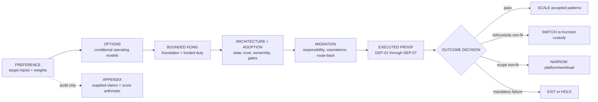

<!-- study-contract: principal -->

# Kong guided evaluation: from platform choice to production proof

| Field | Value |
|---|---|
| Artifact type | comparative-study |
| Decision question | What bounded Kong direction, architecture, adoption model, migration path, and proof programme should the enterprise approve before production scale? |
| Decision owner | API-platform product owner with enterprise architecture, security, IAM, SRE, integration-modernization, sourcing, and delivery governance |
| Primary audiences | Executives, directors, architects, developers, DevOps/SRE, platform teams, security/IAM, operations, migration, sourcing, and FinOps |
| Scope | Sanitized stakeholder evaluation inputs; Kong Gateway Enterprise 3.14 LTS-line self-managed hybrid target `KP-SMH1`; Konnect custody benchmark; Apigee, MuleSoft, and Azure API Management counterfactuals; architecture, platform adoption, Mule and Apigee migration paths, control-plane operating accountability, production proof, seven PoC priorities including a Kong-plus-Traceable feasibility line, terminology mapping, and an audit appendix |
| Evidence state | Stakeholder inputs, documented `E1` mechanisms, repository interpretation, hypotheses, and scenario assumptions; no independently validated comparative score, `E2` closure, target-option `E3` execution, `E4` representative pilot, production-fit result, or commercial conclusion |
| Reference case | Synthetic [RE-1 regulated hybrid enterprise](41-enterprise-reference-case.md); all inherited workloads, timelines, measures, and thresholds remain scenario assumptions |
| As-of date | 2026-08-21; revalidate exact editions, versions, entitlements, Traceable/plugin support, AI capabilities, deployment boundaries, support, pricing, and economics at option freeze |
| Next gate | Approve the bounded Kong foundation and seven-workstream proof programme; critical production scale remains blocked until executed evidence and reviewable artifacts close the mandatory outcome gates |

## Executive answer

Use the supplied evaluation as **decision context**, not as product proof. It states a target operating model that favors Kubernetes, GitOps, platform engineering, self-service, observability, multicloud placement, and emerging AI-traffic governance. Under those priorities, Kong is a coherent leading direction to test. The input scorecard encodes that preference, but it has no documented rubric, named scorers, evidence-confidence model, edition freeze, sensitivity analysis, workload inventory, commercial basis, or representative execution.

Proceed with the bounded, reversible Kong foundation defined in the [Kong enterprise platform deployment strategy](47-kong-enterprise-platform-strategy.md). Treat self-managed Kong Gateway Enterprise hybrid as the leading target only while the enterprise is willing to fund the permanent control-plane, PostgreSQL, PKI, upgrade, restore, audit, observability, support, and 24×7 ownership duties. Keep Konnect as the same-vendor custody benchmark and retain a true non-Kong exit. Do not turn the supplied score, documented capability, or a local functional harness into authorization for critical production scale.

The guided decision sequence is:

1. confirm the target operating model and weights;
2. compare conditional operating-model archetypes rather than brand feature counts;
3. authorize only the reversible Kong boundary and funded duties;
4. make architecture, ownership, degraded behavior, and adoption gates explicit;
5. migrate responsibilities with coexistence and route-back rather than moving Mule packages;
6. execute a target-shaped proof programme, including an explicitly separate security-adjunct feasibility track; and
7. scale, narrow, switch custody, or exit according to reviewed evidence.

Confidence is **high** that this is a coherent decision and proof narrative, **medium** that the stated target model makes Kong the best fit for this scenario, and **zero** that target-option production outcomes or total-cost superiority have been demonstrated.

## Evidence boundary: what the supplied evaluation contributes

The supplied document contributes three useful inputs:

- a stated target model;
- an illustrative weighting and rating model; and
- qualitative product-fit hypotheses.

It does not contribute an observed current-state inventory, an exact option bill of materials, symmetric execution evidence, product-version entitlement proof, representative failure results, migration effort, operating RACI, or commercial evidence. The qualitative labels and corrected arithmetic are therefore retained only in the audit appendix. They do not override the evidence ladder in the [assessment methodology](03-assessment-methodology.md) or the production gates in the [Kong platform strategy](47-kong-enterprise-platform-strategy.md).

Current official documentation supports the main mechanism distinctions used to design proof:

- Kong hybrid separates database-backed control-plane nodes from request-serving data-plane nodes; data planes cache accepted configuration and can continue proxying through control-plane loss. [Kong deployment topologies](https://developer.konghq.com/gateway/deployment-topologies/), [hybrid mode](https://developer.konghq.com/gateway/hybrid-mode/)
- Apigee hybrid uses a Google-maintained management plane and a customer-managed Kubernetes runtime plane. [Apigee hybrid 1.16](https://docs.cloud.google.com/apigee/docs/hybrid/v1.16/what-is-hybrid)
- MuleSoft Omni Gateway is Envoy-based and supports managed and self-managed deployment choices, including MCP and A2A protocols. [Omni Gateway](https://docs.mulesoft.com/gateway/latest/)
- Azure API Management self-hosted gateway is containerized, can run on Kubernetes, and remains managed from an Azure API Management instance; excluding it is a scope choice rather than proof of non-fit. [Self-hosted gateway](https://learn.microsoft.com/en-us/azure/api-management/self-hosted-gateway-overview)
- Kong documents AI-routing, semantic caching, MCP, A2A, guardrail, and observability mechanisms. These are proof inputs, not achieved customer outcomes. [Kong AI Gateway](https://developer.konghq.com/ai-gateway/)

## Guided slide official reference links

Every native and PowerPoint frame links back to its repository-prepared source material and to the relevant current official documentation below. Official documentation supports mechanism and product-boundary interpretation only; it does not convert a proposed target, not-run test, or stakeholder input into executed evidence.

| Slide IDs | Official references |
|---|---|
| KGE-01–KGE-03 | [Kong deployment topologies](https://developer.konghq.com/gateway/deployment-topologies/); [Kong hybrid mode](https://developer.konghq.com/gateway/hybrid-mode/) |
| KGE-04–KGE-05 | [Kong deployment topologies](https://developer.konghq.com/gateway/deployment-topologies/); [Apigee hybrid 1.16](https://docs.cloud.google.com/apigee/docs/hybrid/v1.16/what-is-hybrid); [MuleSoft Omni Gateway](https://docs.mulesoft.com/gateway/latest/); [Azure API Management self-hosted gateway](https://learn.microsoft.com/en-us/azure/api-management/self-hosted-gateway-overview) |
| KGE-06–KGE-08 | [Kong hybrid mode](https://developer.konghq.com/gateway/hybrid-mode/); [Kong Gateway version support policy](https://developer.konghq.com/gateway/version-support-policy/) |
| KGE-09–KGE-13 | [Kong hybrid mode](https://developer.konghq.com/gateway/hybrid-mode/); [Kong Gateway monitoring](https://developer.konghq.com/gateway/monitoring/) |
| KGE-14–KGE-16 | [MuleSoft Omni Gateway](https://docs.mulesoft.com/gateway/latest/); [Kong entities](https://developer.konghq.com/gateway/entities/); [Kong plugin entity](https://developer.konghq.com/gateway/entities/plugin/); [Kong deployment topologies](https://developer.konghq.com/gateway/deployment-topologies/); [Apigee proxy-bundle export and import](https://docs.cloud.google.com/apigee/docs/api-platform/fundamentals/download-api-proxies); [Apigee proxy configuration](https://docs.cloud.google.com/apigee/docs/api-platform/reference/api-proxy-configuration-reference) |
| KGE-17 | [Kong hybrid mode](https://developer.konghq.com/gateway/hybrid-mode/); [Kong Gateway monitoring](https://developer.konghq.com/gateway/monitoring/) |
| KGE-18 | [Kong Gateway version support policy](https://developer.konghq.com/gateway/version-support-policy/); [Kong hybrid mode](https://developer.konghq.com/gateway/hybrid-mode/); [Kong Gateway monitoring](https://developer.konghq.com/gateway/monitoring/); [Kong AI Gateway](https://developer.konghq.com/ai-gateway/); [Traceable Kong integration](https://docs.traceable.ai/docs/kong); [Harness WAAP plugin](https://developer.konghq.com/plugins/harness-waap/) |
| KGE-19–KGE-21 | [Kong hybrid mode](https://developer.konghq.com/gateway/hybrid-mode/); [Kong Gateway monitoring](https://developer.konghq.com/gateway/monitoring/); [Kong AI Gateway](https://developer.konghq.com/ai-gateway/) |
| KGE-22 | [Kong deployment topologies](https://developer.konghq.com/gateway/deployment-topologies/); [Apigee hybrid 1.16](https://docs.cloud.google.com/apigee/docs/hybrid/v1.16/what-is-hybrid); [MuleSoft Omni Gateway](https://docs.mulesoft.com/gateway/latest/); [Azure API Management self-hosted gateway](https://learn.microsoft.com/en-us/azure/api-management/self-hosted-gateway-overview) |
| KGE-23 | [Kong AI Gateway](https://developer.konghq.com/ai-gateway/); [Traceable Kong integration](https://docs.traceable.ai/docs/kong); [Harness WAAP plugin](https://developer.konghq.com/plugins/harness-waap/); [Traceable rule-evaluation matrix](https://docs.traceable.ai/docs/tracing-agents-rule-evaluation-for-protection) |
| KGE-24–KGE-25 | [Kong pricing](https://konghq.com/pricing); [Apigee pricing](https://cloud.google.com/apigee/pricing); [MuleSoft pricing](https://www.mulesoft.com/anypoint-pricing); [Kong deployment topologies](https://developer.konghq.com/gateway/deployment-topologies/) |

## Reference case and guided decision scenario

The deck exercises the synthetic [RE-1 regulated hybrid enterprise](41-enterprise-reference-case.md): Kubernetes-centered delivery spans two approved clouds and private zones; a Mule estate still carries gateway, integration, orchestration, batch/file, and connector responsibilities; APIs serve internal, partner, and customer journeys; identity, evidence, recovery, data, and audit controls cross platform boundaries; and the organization wants platform-engineering self-service without moving durable business truth into gateway policy.

The audience enters with a stated preference for Kubernetes, GitOps, platform engineering, multicloud placement, self-service, observability, and agentic traffic governance. It must decide whether to fund the bounded Kong direction and proof programme—not whether to declare a universal winner. All workload counts, traffic, topology, timing, SLO, RTO/RPO, staffing, cost, and thresholds inherited from RE-1 remain scenario assumptions until observed inputs replace them.

## Failure chains and challenge cases

| Challenge ID | Trigger | Failure chain | Decision evidence | Hold, switch, or stop signal | Accountable role |
|---|---|---|---|---|---|
| KGE-C1 | Weight or target-model challenge | Kubernetes/GitOps preference dominates an incomplete score → missing migration/labor/exit dimensions change sensitivity → apparent lead becomes unstable | Approved rubric, scorers, confidence, evidence map, sensitivity, and dissent | Plausible approved sensitivity reverses the direction without an explicit business choice | Decision owner and enterprise architecture |
| KGE-C2 | Management-cell interruption | CP/PostgreSQL or trust path fails → existing DPs proxy cached state → restart, clean scale, urgent revoke, or reconciliation behaves differently → healthy traffic hides platform risk | State-specific business probes, config/cert identity, restart/clean-node/revoke/reconnect and isolated recovery evidence | False-ready, unexplained state, missed objective, or uncontrolled admission | Platform SRE, DB, IAM/PKI, assurance |
| KGE-C3 | Migration semantic drift | Mule responsibility is assigned by package → stateful transformation/orchestration moves to the edge → side effects or reconciliation diverge → route-back is unsafe | Responsibility/state inventory, parity corpus, business verifier, cohort timeline, route-back and reconciliation record | Critical unexplained variance, unknown data authority, or irreversible cutover | Domain, data, integration, migration owners |
| KGE-C4 | Organization-wide access gap | Gateway auth succeeds → workforce/workload/consumer/service identities are not reconciled → move/leave/rotate/revoke or break glass leaves access active → audit cannot prove control | Full principal inventory, negative tests, lifecycle timelines, break-glass expiry, and review | Unauthorized success, orphan ownership, ineffective revoke, or unattributed elevation | IAM/PKI/security and platform product |
| KGE-C5 | Agentic capability optimism | Documented MCP/A2A/routing/caching/safety feature is treated as outcome → exact version, data, threat, cost, and catalog boundary is unknown → emerging scope inflates core confidence | Separate GEP-05 dossier and execution artifacts | Critical safety/policy failure, unknown data flow, unsupported entitlement, or core decision dependence | AI architecture, security, privacy, FinOps |
| KGE-C6 | Self-management economics fail | Control custody is preferred → database/PKI/upgrade/restore/support/on-call labor is omitted → toil and risk exceed benefit → sunk cost substitutes for proof | Fully allocated self-managed/Konnect/exit sensitivity plus longitudinal E4 operation | Mandatory staffing/support/cost objective fails or a custody switch is materially stronger | Platform product, service management, sourcing, FinOps |
| KGE-C7 | Security-adjunct optimism | A documented Traceable plugin path is treated as certified 3.14 production fit → protocol, payload, fail mode, privacy, overhead, support, upgrade, and agent dependencies remain unknown → a security control adds silent exposure or request-path instability | Exact Kong/plugin/TPA/EDS BOM; Mule baseline; sync/async and fail-open/closed tests; protocol/body/streaming coverage; privacy, load, failure, upgrade, rollback and support evidence | Unsupported BOM, unauthorized pass, prohibited data flow, unbounded overhead, unowned agent/support seam, or no safe uninstall/route-back | Security architecture, platform product, SRE, privacy and support owners |
| KGE-C8 | Apigee proxy-only migration | Exported proxy bundle is treated as the programme → products/apps/credentials, KVM/quota/cache, portal, analytics, environment/hostname and Hybrid runtime state are omitted → parity and route-back become false | A0–A6 object/state denominator, semantic and negative corpus, identity/state reconciliation, coexistence, timed route-back and dependency-zero evidence | Unowned active source object, critical variance, orphan access/state, irreversible cutover, or residual technical/commercial dependency | Migration architecture, API product, IAM, SRE, domains and FinOps |

## Stated target operating model

These are **stakeholder-stated target inputs to confirm**, not observed estate facts.

| Lane | Input ID | Stated target input | Decision implication |
|---|---|---|---|
| Delivery | GTM-01 | AKS and Kubernetes runtime direction | Test exact Kubernetes, Gateway API, support, and lifecycle fit rather than awarding generic cloud-native credit |
| Delivery | GTM-02 | Spring Boot modernization | Keep gateway policy separate from domain-service correctness and durable business state |
| Delivery | GTM-03 | Git-reviewed promotion | Prove an executable Terraform and decK APIOps path with one authority per entity |
| Platform | GTM-04 | Platform engineering ownership | Fund the gateway as a product with service ownership, not an installation project |
| Platform | GTM-05 | Internal developer platform integration | Prove paved-road onboarding, contract, policy, evidence, and support workflows |
| Platform | GTM-06 | Developer self-service | Test lifecycle, access, portal/catalog, and safe delegation rather than assuming a UI closes the outcome |
| Control | GTM-07 | Organization-wide security and observability | Prove identity lifecycle, evidence safety, local export, review, and failure behavior |
| Control | GTM-08 | Multicloud and private placement | Prove workload-local request paths, failure containment, sovereignty, and operating cost |
| Control | GTM-09 | AI and agentic traffic governance | Run a separate MCP, A2A, model-routing, semantic-caching, content-safety, and catalog study |

## Supplied weighting model

The eight supplied weights sum to 100%. Kubernetes and GitOps together carry 35%, which explains much of the directional Kong preference. The model does not separately weight developer experience, multicloud placement, migration effort, platform labor, support, HA/DR, or exit cost.

| Weight ID | Category | Weight | Interpretation | Evidence needed before decision use |
|---|---|---:|---|---|
| GEW-01 | Kubernetes and cloud native | 20% | Target-operating-model preference | Exact topology/version support and representative lifecycle proof |
| GEW-02 | GitOps and DevOps | 15% | Target-operating-model preference | Executable promotion, deletion guard, rollback, drift, and active-state evidence |
| GEW-03 | API management | 15% | Required capability family | Product/lifecycle use cases and exact entitlement mapping |
| GEW-04 | API governance | 10% | Required capability family | Contract, policy, exception, ownership, and enforcement evidence |
| GEW-05 | Security and compliance | 10% | Mandatory outcome family | Equivalent IAM, PKI, audit, data, and failure controls |
| GEW-06 | Observability | 10% | Mandatory evidence family | Export, custody, loss/gap accounting, privacy, and business-probe proof |
| GEW-07 | AI gateway readiness | 10% | Emerging hypothesis | Versioned agentic-gateway study kept separate from core gateway confidence |
| GEW-08 | Cost efficiency | 10% | Commercial hypothesis | Quotes, licenses, platform labor, infrastructure, HA/DR, telemetry, migration, and exit cost |

## Meeting-feedback assurance crosswalk

The meeting feedback does not create a second assessment taxonomy. It identifies dimensions that are present in the canonical 120-criterion matrix but are hidden or compressed in the supplied eight-category scorecard. The governed re-score must bind each simplified dimension back to those existing criteria and their evidence state.

| Feedback dimension | What the deck must distinguish | Canonical evidence obligation | Current disposition |
|---|---|---|---|
| Scalability | Throughput, latency, headroom, saturation, scale-to-full, dependency capacity and unit cost | Execute representative ordinary/busy/burst and clean-node scaling in the frozen topology; retain raw resources and business SLOs | Required by GEP-03; not run |
| Robustness and recovery | Existing DP service, restart, clean-node admission, urgent mutation/revocation, CP/PostgreSQL recovery, region loss and reconciliation | State-specific failover, RTO/RPO, business probes, cache/config/cert identity, clean restore and failed-first-run evidence | Required by GEP-03; not run |
| Security and IAM | Workforce, workload, consumer, API and service identities; PKI; least privilege; join/move/leave; rotation; revocation; break glass | Negative tests, lifecycle clock, configuration and audit evidence, access review, orphan and unauthorized-success checks | Required by GEP-04; not run |
| Traceability | Administrative/configuration audit, request tracing, security decision evidence, signal gap accounting and business correlation are separate outcomes | Reconcile produced/queued/dropped/delivered signals; protect prohibited fields; join release, config, request, security and business identities | KO-7 plus GEP-07; not run |
| Pricing and cost efficiency | Product meter, exact quote, infrastructure, labor, HA/DR, telemetry, security adjunct, support, migration, dual run, incident exposure and exit | Normalized three-to-five-year low/base/high scenario with exact options and negotiated terms | Evidence request; no price rank |
| Multicloud | Runtime placement, management dependency, failure independence, sovereignty, support and operating cost | Packet paths, field locations, zone/region failure, common outcome contract and per-cell operating evidence | Present in GEC-07 and GEP-03; not separately weighted in supplied model |
| Vendor lock-in and exit | Configuration/policy, identity/product state, data/analytics, plugin and operating-procedure portability plus observed rebuild effort | Rebuild one representative API on a non-source platform; measure rewrite, lost semantics/history, FTE/time and rollback | Present in GEC-16; no executed exit score |
| Control-plane accountability | CP/PostgreSQL availability and restore, PKI, licensing, Admin API, plugin lifecycle, audit, upgrade, support and 24×7 service duty | Funded RACI, support contract, failure/recovery/upgrade evidence, longitudinal toil and cost | Operating responsibility exposure, not a legal-liability determination |
| Traceable by Harness | Third-party request/security telemetry and inline/out-of-band enforcement path on Kong | Execute GEP-07 against exact Kong 3.14/plugin/agent topology and compare with the security team's Mule baseline | `GSA-01` documented feasibility only; not a gateway contender or score |

## Proposed governed re-score

The original GEW-01–08 weights and scores remain unchanged as historical stakeholder input. A more persuasive comparison must be **more auditable, not more favorable**. The following dimensions are added to the re-score specification, but their weights and product ratings remain `TBD` until the decision owner confirms the assignment, exact options, rubric, evidence floor, scorer panel, sensitivity ranges, confidence treatment and approval rule. Unknown is not zero, and it does not silently earn points.

| Re-score ID | Dimension | Proposed treatment | Required score-capable evidence | Status |
|---|---|---|---|---|
| GRS-01 | Multicloud operating fit | Separate placement freedom from management dependency, sovereignty, failure independence, support and cost | Exact option field/flow ledger plus representative multi-zone/multiregion execution | Weight/rating `TBD` |
| GRS-02 | Scalability and robustness | Score business SLO, headroom, scale-to-full, false-ready behavior, RTO/RPO, clean-node admission and reconciliation—not generic product scale claims | Equivalent target-shaped load, fault, recovery and reviewer evidence | Weight/rating `TBD` |
| GRS-03 | Security, IAM and traceability | Keep access lifecycle, configuration audit, request/security trace, evidence safety and business correlation separately observable | Equivalent negative, lifecycle, failure, signal-gap and incident-query evidence | Weight/rating `TBD` |
| GRS-04 | Reversibility and vendor dependency | Score observed rebuild, semantic loss, identity/product/data/analytics transfer and rollback effort | Clean-room representative non-source rebuild and dependency ledger | Weight/rating `TBD` |
| GRS-05 | Fully allocated TCO and unit economics | Use exact quote and meters plus labor, infrastructure, HA/DR, telemetry, adjuncts, support, migration, dual run, incident exposure and exit | Negotiated terms and normalized low/base/high three-to-five-year model | Weight/rating `TBD` |
| GRS-06 | Control-plane operating responsibility | Treat retained CP/PostgreSQL/PKI/plugin/license/audit/upgrade/on-call exposure as a cost and risk input, not an architectural slogan | Funded RACI, support game day, recovery/upgrade execution, toil and cost | Weight/rating `TBD` |

The governed recalculation must publish `Σ(weight × rating ÷ 10)`, weight total, exact rubric, evidence links, confidence, scorer and approver identities, sensitivity/rank-stability ranges, dissent and the missing-evidence ceiling. Until those controls exist, slide 5 and slide 25 retain the corrected historical arithmetic and show the expanded re-score as pending rather than manufacturing a new total.

## Conditional option archetypes

The options below are conditional operating-model hypotheses. They are not a new shortlist, a universal ranking, or authorization for parallel production builds.

| Option ID | Operating-model archetype | Strongest when | Concern to test | Presentation strongest when | Presentation concern | Decision role |
|---|---|---|---|---|---|---|
| GEO-KONG | Kong self-managed hybrid | Kubernetes, GitOps, platform engineering, management-state custody, and distributed runtime dominate | Permanent CP/PostgreSQL/PKI/upgrade/restore/24×7 duty; lifecycle/product gaps; TCO; migration | Kubernetes, GitOps, and platform ownership dominate | Fund CP, database, PKI, restore, and on-call duty | Leading target to prove as `KP-SMH1` |
| GEO-APIGEE | Apigee hybrid | External API product management, governance, analytics, and Google-aligned management services dominate | Google-managed control plane, customer-operated Kubernetes runtime, Cassandra/MART duty, support, data boundary, and economics | External API product management and governance dominate | Google control plane, Cassandra/MART, and economics | Comparative counterfactual |
| GEO-MULE | MuleSoft Anypoint plus Omni Gateway | Anypoint remains the strategic integration and API platform | Kubernetes-native operating fit, management-plane dependency, product boundary, commercial model, migration, and exit | Anypoint remains strategic | Kubernetes fit, commercials, migration, and exit | Incumbent and comparative baseline |
| GEO-APIM | Azure API Management with self-hosted gateways | Azure consolidation and unified Azure control outweigh platform neutrality | Azure management dependency, exact policy/portal parity, self-hosted lifecycle, disconnected behavior, and migration | Azure consolidation outweighs platform neutrality | Azure management, parity, and disconnected behavior | No-build sensitivity and exit benchmark |

## Supplied scoring audit

The supplied ratings use a 1–10 scale without a documented rubric. Recalculation preserves Kong at 93 but produces 85.5 for Apigee and 77 for MuleSoft, not 87 and 78. The ordering is unchanged; the confidence is not improved.

| Category | Weight | Kong input | Apigee input | MuleSoft input | Kong weighted | Apigee weighted | MuleSoft weighted |
|---|---:|---:|---:|---:|---:|---:|---:|
| Kubernetes and cloud native | 20% | 10 | 8 | 7 | 20 | 16 | 14 |
| GitOps and DevOps | 15% | 10 | 7 | 6 | 15 | 10.5 | 9 |
| API management | 15% | 8 | 10 | 10 | 12 | 15 | 15 |
| API governance | 10% | 8 | 10 | 10 | 8 | 10 | 10 |
| Security and compliance | 10% | 9 | 10 | 9 | 9 | 10 | 9 |
| Observability | 10% | 9 | 9 | 8 | 9 | 9 | 8 |
| AI gateway readiness | 10% | 10 | 8 | 7 | 10 | 8 | 7 |
| Cost efficiency | 10% | 10 | 7 | 5 | 10 | 7 | 5 |
| **Weighted total** | **100%** |  |  |  | **93** | **85.5** | **77** |

Before any scoring gate, add the exact options, rubric, scorers, evidence links, confidence, edition/version, sensitivity, platform labor, commercial basis, migration effort, and exit cost. A score without those controls remains illustrative author input.

## Supplied versus recalculated totals

| Product | Supplied displayed total | Recalculated total |
|---|---:|---:|
| Kong | 93 | 93 |
| Apigee | 87 | 85.5 |
| MuleSoft | 78 | 77 |

## Bounded authorization

| Decision | Authorize now | Do not authorize | Exit evidence |
|---|---|---|---|
| Kong platform direction | Freeze `KP-SMH1` as the leading exact-option target | Universal product superiority | Exact option contract plus equivalent counterfactual evidence |
| Foundation | One reversible self-managed hybrid foundation with named owners | Critical production scale | Target environment, supported BOM, restore, trust, change, evidence, and route-back artifacts |
| Proof | Seven funded workstreams with measures, thresholds, artifacts, reviewers, and stop rules | Treating documentation, partner integrations, or scripts as results | Executed, reviewable E2/E3/E4 evidence |
| Migration | Bounded Mule or Apigee cohorts with coexistence, business probes, identity/state reconciliation, and route-back | Big-bang or proxy-bundle-only migration factory | Per-wave entry/exit, state, dependency, recovery, and owner evidence |
| Alternatives | Konnect custody benchmark and a true non-Kong exit | Parallel production builds without a decision purpose | Equivalent outcomes, cost, effort, support, and rebuild evidence |

## Architecture, adoption, and migration chain

The detailed canonical evidence remains in the underlying studies:

- [KPS-1 through KPS-6](47-kong-enterprise-platform-strategy.md) define target architecture, state/trust paths, ownership, degraded-mode admission, evidence-gated adoption, and scale/narrow/switch/exit logic.
- [MULE-2, MULE-3, and MULE-6](35-mule-migration-strategy.md) define responsibility decomposition, bounded coexistence, and evidence-gated migration waves.
- The [Apigee A0–A6 roadmap](50-apigee-migration-strategy.md) applies the same stable-edge and route-back gates to proxy, policy, product/app/credential, KVM/quota/cache, portal, analytics, environment/hostname and Hybrid-component state.
- [KMC option records](44-kong-multicloud-study-roadmap.md) keep self-managed, Konnect, Kubernetes-authority, Operator, DB-less, and managed-hosting hypotheses separate.
- The [Kong terminology crosswalk](../research/glossary.md#kong-terminology-crosswalk) maps nearest MuleSoft and Apigee operating analogues while exposing non-equivalence.
- The [PoC register](../poc/README.md) reports functional-baseline status separately from the 28 atomic protocol cases and from target-option E3/E4 evidence.

The native deck projects those existing canonical figures and tables rather than creating parallel topology, adoption, migration, or outcome facts.

## Traceable by Harness security-adjunct feasibility

`GSA-01` is a **security and traceability adjunct hypothesis**, not a fourth gateway contender, native Kong capability verdict, or scored advantage. Traceable and Kong documentation describe a third-party plugin path in which the Kong data plane communicates with a reachable Traceable Platform Agent or extension. Traceable documents synchronous and asynchronous modes; synchronous evaluation can enter the request/response path, while asynchronous export happens after the response and can require request-body buffering. [Traceable Kong integration](https://docs.traceable.ai/docs/kong), [Harness WAAP plugin](https://developer.konghq.com/plugins/harness-waap/)

| Hypothesis ID | Documented mechanism | Critical unknowns | Required executed proof | Evidence ceiling |
|---|---|---|---|---|
| GSA-01 | Third-party Kong plugin plus local Traceable agent/extension; sync or async capture; documented inline/out-of-band protection options | Certified exact Kong 3.14/KIC/topology/plugin BOM; CP/all-DP packaging; protocol/body/streaming coverage; fail-open/closed and timeout behavior; TPA/EDS HA and scaling; latency/CPU/memory; privacy/residency/retention/RBAC; upgrade/rollback/uninstall; Kong/Harness support RACI; parity with the security team's Mule baseline | Freeze version/checksum/SBOM and support record; deploy on CP/all DPs as required; run Mule-versus-Kong endpoint and downstream discovery; p50/p95/p99/throughput/resource tests; large/max bodies, SSE, gRPC/protobuf and excluded-content cases; partition/saturate/expire/rotate TPA/EDS/token/cert; verify redaction/block/allow evidence and prohibited-field handling; rehearse upgrade, rollback and removal | `E1` documented feasibility only; no 3.14 compatibility, performance, production-security, comparative, cost or support result |

Traceable documents `allow_on_failure: true` as pass-through behavior when its decision path fails; fail-closed behavior, payload handling and buffering can materially change availability, privacy and resource use. Those are pre-approved risk decisions and test oracles, not defaults to inherit silently. A separate [third-party monitoring matrix](https://docs.traceable.ai/v1/docs/third-party-monitoring-support-matrix) also documents feature-level differences across gateways; a gap in one downstream-monitoring feature is neither proof of overall non-fit nor permission to claim parity.

## Seven-workstream target-aligned proof programme

These workstreams are **required proof activities**, not completed results.

| Workstream ID | Workstream | Presentation summary | Required scope | Executed evidence and artifact | Production implication |
|---|---|---|---|---|---|
| GEP-01 | Target-aligned hybrid | Run Kong Gateway Enterprise 3.14 LTS-line hybrid with a frozen BOM and production-like control, trust, evidence, and failure paths | Run the proposed Kong Gateway Enterprise 3.14 LTS-line hybrid topology with production-like control, trust, evidence, and failure paths; exact patch and support remain to freeze | Immutable BOM, topology/config bundle, reviewer record, active-state ledger, and target-option result ID | No target claim from a different topology |
| GEP-02 | Executable APIOps | Terraform provisions the boundary; decK validates, diffs, promotes, detects drift, and executes scoped sync/apply | Terraform provisions the declared platform boundary; decK validates, diffs, promotes, detects drift, and executes scoped sync/apply with one writer per entity | Versioned pipeline, plan/diff, approval, signed release manifest, deletion preview, active digest, rollback and reconciliation artifacts | No production change authority from documentation alone |
| GEP-03 | Regional resilience | Execute multiregion failover, isolated recovery, reconciliation, and scaling under representative load | Execute multiregion failover, existing/restarted/clean-node behavior, isolated CP/PostgreSQL recovery, reconciliation, and scaling under representative load | Fault timeline, RTO/RPO and SLO measures, config/cert digests, business probes, recovery journal, capacity curves, and reviewer decision | No HA, recovery, or scale claim before execution |
| GEP-04 | Enterprise IAM lifecycle | Cover workforce, workload, consumer, API, and service-account identity across least privilege, join/move/leave, rotation, revocation, and break glass | Cover workforce, workload, consumer, API, and service-account identity; least privilege; join/move/leave; rotation; revocation; break glass; and audit | Role/identity matrix, policy/config evidence, negative tests, rotation/revocation timeline, break-glass expiry/reconciliation, and access review | No organization-wide access claim from gateway authentication alone |
| GEP-05 | Agentic-gateway study | Run a separate versioned MCP, A2A, model-routing, semantic-caching, content-safety, and agent/MCP catalog study | Run a dedicated, versioned study for MCP, A2A, model routing, semantic caching, content safety, and agent/MCP catalogs; keep it separate from core gateway proof | Threat model, use-case contract, exact plugin/edition matrix, policy tests, latency/cost/safety evidence, observability, catalog lifecycle, and falsifier | Emerging capability cannot inflate confidence in core platform fit |
| GEP-06 | Evidence-gated recommendation | Base production recommendations on executed results, reviewable artifacts, owners, thresholds, and stop conditions | Bind every production recommendation to executed results, reviewable artifacts, owners, thresholds, and stop conditions | Gate report mapping result IDs to outcome contracts and scale/narrow/switch/exit decision | Documented capability remains a hypothesis until execution |
| GEP-07 | Security adjunct feasibility | Execute Kong plus Traceable against the Mule security baseline without awarding platform points for documented integration | Resolve and execute `GSA-01`: exact BOM/support, data path, sync/async and fail behavior, protocol/body/streaming coverage, overhead/scaling, privacy, traceability, upgrade/rollback and uninstall/route-back | Certified option record, plugin/agent manifests and SBOM, policy corpus, raw latency/resource/failure/coverage/security evidence, data-flow review, support RACI and rollback/removal record | No Traceable production recommendation, parity claim, security outcome or price advantage before execution |

## Current proof boundary

The existing public PoC is a useful functional baseline, but it is not evidence for `KP-SMH1`. Its two evidence systems must remain separate:

| Evidence system | Current state | What it can support | What it cannot support |
|---|---|---|---|
| Aggregate PoC register | 16 items: 5 automated local-baseline checks and 11 not run | Reproducibility of a small local harness and explicit unexecuted status | Target hybrid topology, representative failure, production scale, or comparative superiority |
| Atomic comparison protocols | 28 cases across request/workload, platform/failure, and operating-model/TCO protocols | A symmetric future experiment contract | Any result until candidate-by-case cells contain reviewed execution artifacts |
| Target-option evidence | 0 independently reviewed `KP-SMH1` E3 results and 0 representative E4 pilots | A precise statement of the current evidence gap | Production recommendation, long-term cost, or scale admission |

The counts are non-additive. A runnable script is not an executed result, and a documented mechanism is not a passed scenario.

## Supplied comparison input: architecture and delivery

The following rows preserve the supplied document's qualitative labels for audit. `Supplied input` means unvalidated stakeholder assessment, not a repository or vendor conclusion.

| Input ID | Criterion | Kong input | MuleSoft input | Apigee input | Evidence treatment |
|---|---|---|---|---|---|
| GEC-01 | Primary focus | API connectivity platform | API management within Anypoint Platform | Enterprise API management | Conditional operating-model hypothesis |
| GEC-02 | Architecture | NGINX/OpenResty | Envoy-based | Google-managed control plane and Kubernetes runtime | Exact edition/topology must be frozen; product ancestry is not a decision outcome |
| GEC-03 | Cloud-native fit | Excellent | Good | Good | Supplied label; test exact target topology and lifecycle |
| GEC-04 | Kubernetes fit | Excellent | Good | Very good | Supplied label; test conformance, support, authority, and operations |
| GEC-05 | GitOps support | Excellent | Moderate | Moderate | Supplied label; execute equivalent promotion, deletion, drift, rollback, and reconciliation |
| GEC-06 | Observability | Prometheus, Grafana, OpenTelemetry | Anypoint Monitoring | Analytics and monitoring | Mechanism inventory only; prove custody, loss, privacy, correlation, and business use |
| GEC-07 | Multicloud support | Excellent | Good | Good | Supplied label; prove placement, dependency, failure, support, and cost boundaries |
| GEC-08 | Hybrid deployment | Yes | Yes | Yes | Boolean is non-discriminating; compare control, runtime, state, support, and recovery responsibility |
| GEC-19 | Scalability and robustness | Not supplied | Not supplied | Not supplied | Do not infer a score from documentation; execute equivalent business-SLO, headroom, scale-to-full, zone/region failure, restart/clean-node, recovery and reconciliation cases |

## Supplied comparison input: management, experience, and AI

| Input ID | Criterion | Kong input | MuleSoft input | Apigee input | Evidence treatment |
|---|---|---|---|---|---|
| GEC-09 | Developer portal | Good | Excellent | Excellent | Supplied label; test required discover/request/approve/onboard/rotate/revoke journeys |
| GEC-10 | API lifecycle management | Good | Excellent | Excellent | Supplied label; test exact product, contract, environment, deprecation, and ownership workflows |
| GEC-11 | API governance | Good | Excellent | Excellent | Supplied label; test policy authoring, exceptions, enforcement, evidence, and decision rights |
| GEC-12 | Developer experience | Good | Very strong | Very strong | Supplied label; measure paved-road lead time, mismatch, bypass, support, and cognitive load |
| GEC-13 | AI gateway capabilities | MCP and A2A mechanisms plus AI Gateway features | MCP and A2A mechanisms | Emerging AI and policy mechanisms | Versioned hypothesis; run GEP-05 without increasing confidence in the core gateway |
| GEC-14 | Customization | Extensive plugin framework | Moderate | Strong policy framework | Supplied label; prove support, security, performance, upgrade, ownership, and exit |
| GEC-15 | Best fit | Platform engineering | Integration-centric organizations | Enterprise API programs | Conditional archetype, not a universal rank |
| GEC-20 | Traceable by Harness adjunct | Documented third-party Kong plugin path; exact 3.14 fit not proved | Documented Mule custom-policy baseline; equivalence not proved | Not assessed in this meeting input | Security-team feasibility line only; execute GEP-07 and do not score the gateway for an unproved adjunct |

## Supplied comparison input: economics and evidence ceiling

| Input ID | Criterion | Kong input | MuleSoft input | Apigee input | Evidence treatment |
|---|---|---|---|---|---|
| GEC-16 | Vendor lock-in | Low | High | Medium | Unsubstantiated label; replace with observed configuration/policy, identity/product, data/analytics, plugin and operating-procedure rebuild plus timed switching/rollback evidence |
| GEC-17 | Cost | Low | High | Medium-high | Unsubstantiated label; normalize exact pricing meters and quotes with labor, infrastructure, CP/PostgreSQL/PKI duty, HA/DR, telemetry, Traceable or other security adjuncts, migration, support, dual run, incident exposure and exit |
| GEC-18 | Overall recommendation | Preferred | Third | Second | Stakeholder direction only; no production or comparative proof |

These inputs remain visible because they influenced the decision. They are deliberately separated from the production evidence chain so the audience can see both the preference and its ceiling.

Public pricing pages expose different and incomplete meters: Kong Enterprise and fully self-hosted Enterprise pricing is custom, Google's public Apigee pay-as-you-go model applies to managed Apigee rather than Hybrid, and MuleSoft publishes product-specific meters with contact-sales pricing. Therefore the deck does not declare a cheapest platform. [Kong pricing](https://konghq.com/pricing), [Apigee pricing](https://cloud.google.com/apigee/pricing), [MuleSoft pricing](https://www.mulesoft.com/anypoint-pricing)

## Guided native deck phases

**Figure KGE-1 — The guided decision path separates stakeholder preference, bounded target design, execution, and scale authority.**

- **Depicted scope:** sanitized target inputs and weights; conditional options; bounded Kong decision; architecture and ownership; migration controls; target-shaped proof; scale, narrow, custody-switch, exit, and hold outcomes; audit appendix.
- **Excluded scope:** a completed comparison, deployed topology, achieved outcome, procurement decision, committed migration calendar, customer identity, private input, and a claim that document volume is evidence.
- **Diagram source, evidence state and as-of:** synthesis of this study's KGE-P1 through KGE-P6 phases, the docs/47 evidence gates, and the docs/35 and docs/50 migration boundaries; decision-navigation interpretation; 2026-08-21.
- **Accessible equivalent:** confirm the stated target and preference model, compare conditional operating boundaries, authorize only a reversible Kong foundation, make architecture and durable ownership explicit, migrate through bounded coexistence, execute seven target-aligned proof workstreams, then scale, narrow, switch custody, exit, or hold according to reviewed outcomes. The audit appendix preserves supplied inputs without changing their evidence state.

**Figure interpretation:** The supplied preference model legitimately explains why Kong leads under the stated target, but it appears before evidence gates. The path earns stronger commitments only through explicit ownership, representative execution, and reviewed artifacts.

**Figure limitation:** The diagram is a decision-navigation model, not a delivery schedule or probability model. It does not show every counterfactual, responsibility, state path, or evidence artifact contained in the cited studies.

| Phase ID | Phase | Slides | Audience decision |
|---|---|---:|---|
| KGE-P1 | Why now | 1–3 | Confirm the target operating model and make its weights visible |
| KGE-P2 | Options and decision | 4–8 | Compare conditional archetypes and authorize only the bounded Kong boundary |
| KGE-P3 | Architecture and adoption | 9–13 | Understand the target topology, failure paths, ownership, and evidence-gated adoption |
| KGE-P4 | Migration | 14–16 | Move Mule responsibilities or the Apigee object/state graph through coexistence, route-back, and exit evidence |
| KGE-P5 | Production proof | 17–21 | Replace documented capability—including the Traceable adjunct—with executed target-shaped evidence and outcome gates |
| KGE-P6 | Audit appendix | 22–25 | Preserve supplied inputs, expose the Traceable feasibility line, and keep the governed re-score pending without promoting them to proof |

## Native presentation contract: KGE-01–KGE-25

The PowerPoint and the native Pages deck project this same 25-frame contract. The native route is a first-class presentation context, not an embedded PowerPoint, screenshot sequence, or download wrapper. The repository PowerPoint remains a portable companion artifact; neither representation is the canonical source.

| Slide IDs | Visible evidence state | Source class | Interpretation |
|---|---|---|---|
| KGE-01 | Guided decision brief | Mixed public-safe synthesis | Orientation only; no new evidence |
| KGE-02–KGE-03 | Stakeholder input | Sanitized supplied input | Target preferences and weighting choices; not admitted candidate evidence |
| KGE-04 | Conditional hypothesis | Supplied input plus documented-mechanism interpretation | Conditional operating-model archetypes to test; not an observed product comparison |
| KGE-05 | Stakeholder input | Sanitized supplied input | Arithmetic audit of supplied ratings; not admitted candidate evidence |
| KGE-06 | Bounded direction | Stakeholder direction plus repository interpretation | Authorizes foundation and proof only |
| KGE-07–KGE-12 | Proposed target | Repository `E1` interpretation | Operating options, architecture, failure policy, and ownership to prove |
| KGE-13 | Scenario assumption | Repository adoption plan | Overlapping decision windows, not status or commitment |
| KGE-14–KGE-16 | Proposed migration model | Repository Mule and Apigee migration interpretations | No observed estate classification, coexistence result, route-back, or migration status |
| KGE-17 | Executed local baseline | Canonical PoC register as of 2026-08-20 | Exact local-baseline counts; not representative target proof |
| KGE-18 | Not run | Meeting direction canonicalized as GEP-01–GEP-07 | Required future proof work only; Traceable remains an adjunct hypothesis |
| KGE-19–KGE-21 | Proposed acceptance contract | Repository outcome and assurance design | Measures, artifacts, and decisions, not achieved outcomes |
| KGE-22 | Stakeholder input | Sanitized supplied input plus repository evidence obligations | Architecture/delivery labels remain unverified; scalability and robustness are explicitly unscored |
| KGE-23 | Mixed documented mechanism and stakeholder input | Sanitized supplied input plus current official Traceable/Kong documentation | Traceable is `E1` feasibility only; management, experience and AI labels remain unverified |
| KGE-24 | Stakeholder input with documented pricing boundaries | Sanitized supplied input plus current official pricing pages | No normalized quote, TCO, control-duty, adjunct-cost, lock-in or exit result |
| KGE-25 | Stakeholder input | Sanitized supplied input plus governed re-score specification | Original arithmetic remains audit input; expanded weights and ratings remain `TBD` |

| Slide ID | Stable key | Phase | Audience-facing title | Visible decision content | Visual contract | Canonical source |
|---|---|---|---|---|---|---|
| KGE-01 | `kong-guided-cover` | KGE-P1 | API management from platform choice to production proof | Guided evaluation, not product marketing; supplied input plus repository evidence plus target-shaped proof | Six-stage journey rail | This study / Executive answer |
| KGE-02 | `kong-guided-target-model` | KGE-P1 | The operating model—not the feature list—drives the decision | Stated target inputs remain to confirm | Three-lane target-model map using GTM-01–09 | This study / Stated target operating model |
| KGE-03 | `kong-guided-weights` | KGE-P1 | The scorecard favors cloud-native delivery | Kubernetes plus GitOps carry 35%; add multicloud, robustness, reversibility and fully allocated TCO before governed re-score | Eight supplied weights plus expanded-dimension callouts | This study / Supplied weighting model plus proposed governed re-score |
| KGE-04 | `kong-guided-options` | KGE-P2 | Each contender optimizes a different operating model | Conditional Kong, Apigee, MuleSoft, and APIM archetypes | Four option cards using GEO-KONG/APIGEE/MULE/APIM | This study / Conditional option archetypes |
| KGE-05 | `kong-guided-score` | KGE-P2 | Preserve the historical score; govern the re-score | Correct totals remain 93, 85.5, and 77; no new total until exact options, rubric, added dimensions, weights, evidence and scorer approval close | Historical score comparison plus governed-recalculation-pending note | This study / Supplied scoring audit plus proposed governed re-score |
| KGE-06 | `kong-guided-decision` | KGE-P2 | Proceed with a bounded, reversible Kong foundation | Scale only after the exact option, reviewed E2/E3/E4, route-back/exit, and economics evidence | Authorization / hold split | This study / Bounded authorization |
| KGE-07 | `kong-guided-boundary` | KGE-P2 | Choose the operating boundary before the topology | `KP-SMH1`, Konnect custody benchmark, and true exit are distinct | Three-boundary choice model | docs/44 option register plus docs/47 bounded target |
| KGE-08 | `kong-guided-duty` | KGE-P2 | Control-plane custody transfers operating accountability | Custody advantage must be weighed against CP/PostgreSQL/PKI/plugin/license/audit/upgrade/on-call exposure and fully allocated cost; this is not a legal-liability verdict | Fit-versus-operating-accountability balance | docs/47 / Why self-managed control—and what it costs |
| KGE-09 | `kong-guided-architecture` | KGE-P3 | One control boundary; distributed request runtimes | Central approved intent; request runtime and evidence close to workloads | Source-derived readable KPS-1 overview; full model available in inspection mode | docs/47 / KPS-1 |
| KGE-10 | `kong-guided-state-trust` | KGE-P3 | Healthy proxy ≠ healthy platform | Configuration, trust, request, and business paths fail independently | Source-derived KPS-2 state/trust summary | docs/47 / KPS-2 |
| KGE-11 | `kong-guided-degraded` | KGE-P3 | Control-plane loss requires explicit admission states | Continue, hold, quarantine, and reconcile are governed states | Source-derived KPS-4 decision brief | docs/47 / KPS-4 |
| KGE-12 | `kong-guided-operating-model` | KGE-P3 | Self-managed control is a funded platform service | Platform, product, security/SRE, and vendor duties stay explicit | Source-derived KPS-3 responsibility lanes | docs/47 / KPS-3 |
| KGE-13 | `kong-guided-adoption` | KGE-P3 | Foundation is work; scale is an outcome gate | Preserve overlapping 0–2, 2–5, 4–8, 6–10, 9–14, and 13–18 month scenario windows | Source-derived KP0–KP5 roadmap | docs/47 / KPS-5 and roadmap |
| KGE-14 | `kong-guided-migration-boundary` | KGE-P4 | Move responsibilities—not Mule packages | Only gateway policy is unambiguously an edge duty; facade is conditional | Source-derived MULE-2 responsibility map | docs/35 / MULE-2 plus terminology crosswalk |
| KGE-15 | `kong-guided-coexistence` | KGE-P4 | Keep the API edge stable while old and new runtimes coexist | Bounded cohorts, parity probes, business evidence, and route-back | Source-derived MULE-3 coexistence model | docs/35 / MULE-3 |
| KGE-16 | `kong-guided-waves` | KGE-P4 | Mule and Apigee migration advance on evidence—not time | Mule M0–M5 responsibility/state path and Apigee A0–A6 object/state path share stable-edge, coexistence, route-back and dependency-zero gates | Dual migration rail with source-specific artifacts and common evidence gates | docs/35 / MULE-6 plus docs/50 / A0–A6 |
| KGE-17 | `kong-guided-proof-boundary` | KGE-P5 | Current PoC is a functional baseline—not KP-SMH1 proof | 5 automated, 11 not run, 28 separate atomic cases, 0 target E3/E4 results | Non-additive evidence-system boundary | This study / Current proof boundary plus poc/README |
| KGE-18 | `kong-guided-proof-programme` | KGE-P5 | The next PoC must mirror the production target | Seven workstreams require an owner, measure, threshold, executed artifact, reviewer and stop rule; GEP-07 tests Kong plus Traceable without awarding unearned platform confidence | Seven-workstream execution map | This study / Seven-workstream target-aligned proof programme plus GSA-01 |
| KGE-19 | `kong-guided-outcomes-1` | KGE-P5 | Five reviewable outcomes anchor production proof | KO-1 state fidelity through KO-5 safe change | Source-derived KO-1–KO-5 outcome cards | docs/47 / Outcome measures and acceptance artifacts |
| KGE-20 | `kong-guided-outcomes-2` | KGE-P5 | Scale depends on the whole operating system | KO-6 capacity through KO-11 estate ownership; KO-7 is security traceability and evidence safety with correlation, quantified gaps and prohibited-field control | Source-derived KO-6–KO-11 outcome cards | docs/47 / Outcome measures and acceptance artifacts |
| KGE-21 | `kong-guided-assurance` | KGE-P5 | Negative evidence must change the decision | Pre-commit scale, narrow, switch custody, exit, and hold outcomes | Source-derived KPS-6 assurance brief | docs/47 / KPS-6 |
| KGE-22 | `kong-guided-compare-architecture` | KGE-P6 | Comparison input—architecture, multicloud and robustness | Preserve supplied labels; make GEC-19 scalability/robustness explicitly unscored and bind every claim to equivalent execution | GEC-01–08 plus GEC-19 evidence-obligation records | This study / Supplied comparison input: architecture and delivery |
| KGE-23 | `kong-guided-compare-management` | KGE-P6 | Comparison input—management, AI and security traceability | Keep capabilities versioned; show GEC-20 Kong-plus-Traceable as documented feasibility, not gateway proof or score | GEC-09–15 plus GEC-20 evidence-obligation records | This study / management and AI comparison plus GSA-01 |
| KGE-24 | `kong-guided-compare-economics` | KGE-P6 | Comparison input—pricing, lock-in and operating duty | Normalize exact meters/quotes with CP duty, labor, infrastructure, HA/DR, telemetry, adjuncts, migration, support, dual run, incident exposure and exit | GEC-16–18 evidence-obligation records plus public pricing-boundary note | This study / economics and evidence ceiling |
| KGE-25 | `kong-guided-score-audit` | KGE-P6 | Historical score audit; governed re-score pending | Preserve original weights, ratings and corrected arithmetic; publish no expanded total until GRS-01–06 inputs and controls are approved | Full GEW audit plus governed-recalculation checklist | This study / supplied scoring audit plus proposed governed re-score |

## Presenter guidance

Use the companion [Kong guided evaluation facilitator guide](49-kong-guided-evaluation-facilitator-guide.md) as the complete public-safe meeting script: it contains the 30-, 45-, 60-, and 90-minute routes; all 25 slide-level purpose, talk-track, ask, bridge, caveat, and source blocks; bounded side discussions; decision capture; and explicit stop or hold rules. The PowerPoint embeds a synchronized concise projection of the same speaker notes for offline delivery. This study remains authoritative for slide facts, evidence states, and source interpretation.

| Transition | Audience guidance |
|---|---|
| Open | This is a strategic-fit decision and proof journey, not a completed product comparison or product-marketing deck. |
| Target to options | We are comparing operating models and control boundaries, not counting features. |
| Options to decision | The historical score is not the reason for the choice; the governed re-score adds missing dimensions without changing inputs to preserve a preferred rank. |
| Decision to architecture | If the enterprise chooses self-managed control, it must understand and fund its operating accountability; legal liability remains a contract and counsel question. |
| Architecture to adoption | Technology fit matters only when ownership, paved roads, governance, and support work for delivery teams. |
| Adoption to migration | Selection does not authorize a big-bang Mule move or a proxy-only Apigee conversion; coexistence, business probes, identity/state reconciliation and route-back remain mandatory. |
| Migration to production | Every advantage and every security adjunct stays a hypothesis until representative E3/E4 evidence closes it. |
| Close | Approve the bounded direction and proof programme—not critical production scale. |

## Decision implications

1. Retain the supplied evaluation as a transparent decision input, including its corrected arithmetic and missing controls; do not cite its qualitative labels as product facts.
2. Freeze one exact `KP-SMH1` option and use the same outcome contract for the Konnect custody benchmark. Keep a separate non-Kong exit.
3. Fund self-managed control-plane, PostgreSQL, PKI, APIOps, restore, observability, plugin, license, support, and on-call duties before topology becomes commitment; record legal liability separately through counsel and contract review.
4. Make GEP-01 through GEP-07 the next PoC, with owner roles, pre-approved thresholds, raw artifacts, independent reviewers, and stop rules. Keep GEP-07 an adjunct feasibility track rather than a gateway score.
5. Do not combine the current 16-item register with the separate 28 atomic protocol cases, and do not treat either as target evidence until executed in the frozen option.
6. Keep agentic-gateway capability in a dedicated study so rapidly changing MCP, A2A, routing, caching, content-safety, and catalog mechanisms cannot inflate confidence in the core platform.
7. Use the [Kong terminology crosswalk](../research/glossary.md#kong-terminology-crosswalk) for post-meeting enablement; every row is a nearest analogue with an explicit non-equivalence.
8. Apply the [Apigee A0–A6 roadmap](50-apigee-migration-strategy.md) when Apigee is the source, rather than treating exported proxy bundles as a migration result.
9. Preserve the audit appendix for traceability while keeping the main decision sequence low-density and falsifiable. Govern the expanded re-score; do not change weights or ratings to preserve a preferred order.

## Falsification and proof plan

| Proof ID | Procedure | Measure | Scenario threshold | Evidence artifact | Independent reviewer |
|---|---|---|---|---|---|
| KGE-P01 | Freeze exact options and approve GRS-01–06 dimensions, rubric, mandatory gates, weights/ranges, score-capable evidence floor, confidence treatment, scorers and approvers; then recalculate and run sensitivity without changing inputs to protect an outcome | Rank stability, weight sensitivity, evidence coverage, bounds/regret and unresolved evidence | No decision use when inputs are unapproved, evidence is asymmetric, an unknown silently earns points, or plausible approved sensitivity changes the direction without an explicit business choice | Option register, rubric, scoring workbook, source/result links, sensitivity plots, scorer/approver record and dissent | Decision owner, enterprise architecture, independent assessment assurance and sourcing/FinOps |
| KGE-P02 | Execute GEP-01 and GEP-02 in the frozen target topology | Configuration authority, destructive surprise, drift, rollback, active identity | Zero uncontrolled writer or unexplained active state; rollback/reconciliation within approved rule | Immutable BOM, pipeline, plans/diffs, release manifest, runtime attestations | Independent release engineering and security |
| KGE-P03 | Execute GEP-03 failure, recovery, and capacity scenarios | Business SLO, false-ready, RTO/RPO, scale, reconciliation, evidence loss | All mandatory state-specific objectives pass; failed first runs retained | Fault timeline, raw metrics/traces/logs, recovery journal, capacity evidence | SRE/resilience plus business-risk panel |
| KGE-P04 | Execute GEP-04 identity lifecycle and negative tests | Unauthorized success, orphan access, revoke/rotation/break-glass time, attribution | Zero unauthorized success or unowned access; lifecycle objectives met | Identity/role matrix, config, audit, negative-test and review bundle | IAM/PKI/security assurance |
| KGE-P05 | Execute GEP-05 as a separately versioned agentic-gateway experiment | Correct routing, policy enforcement, safety, cost/latency, cache/correlation, catalog lifecycle | No critical safety/policy failure; core gateway decision unchanged by unproved emerging features | Threat model, exact plugin/edition matrix, test corpus, cost/latency/safety/evidence bundle | AI security, architecture, privacy, FinOps |
| KGE-P06 | Run representative migration, longitudinal operation, Konnect custody switch, and clean non-Kong exit | Business variance, rollback, toil, support, cost, rebuild, residual dependencies | Scale only when representative E4, support, cost, custody switch, and exit meet pre-agreed outcomes | Pilot service reviews, migration/route-back record, support timeline, cost model, switch/exit bundle | Independent operational-readiness board |
| KGE-P07 | Execute GEP-07 Kong-plus-Traceable against the security team's Mule baseline | Exact compatibility, capture/enforcement coverage, unauthorized pass, latency/throughput/resources, TPA/EDS failure, privacy, trace correlation, scaling, upgrade/rollback/uninstall and support handoff | Zero critical unauthorized pass or prohibited data flow; overhead and failure behavior inside approved envelopes; every required protocol/use case classified; supported BOM and owned support path; safe rollback/removal | Vendor-confirmed BOM, manifests/SBOM, policy corpus, raw performance/fault/security/coverage results, data-flow review, evidence correlation, support RACI and removal record | Security architecture, independent security/performance assurance, privacy and SRE |

## Risks and limitations

- The supplied document reflects an organization-specific viewpoint but is sanitized here; the raw document, customer names, logos, screenshots, commercial terms, and private posture are not part of the public source.
- Qualitative ratings such as “excellent,” “strong,” “low,” “high,” and “market-leading” are stakeholder inputs without a documented rubric or symmetric evidence.
- Official product documentation changes and proves mechanisms rather than entitlement, configured behavior, support, production outcomes, operating skill, or economics.
- Traceable is a third-party adjunct with a local agent/extension and request-path choices; current documentation does not certify the proposed exact Kong 3.14 option or prove parity with Mule, protocol/payload coverage, production overhead, data handling, support, or safe lifecycle behavior.
- Kong Gateway Enterprise 3.14 is a target line, not an immutable option; exact patch, images, plugins, decK, PostgreSQL, Kubernetes/OS, entitlements, and support must be frozen and retested.
- The reference case, timelines, thresholds, and workloads are synthetic scenario assumptions until an observed estate inventory replaces them.
- The deck is deliberately low-density. Its decision summaries link to detailed canonical models and cannot replace engineering review of the source studies.
- The PowerPoint and native Pages presentation are derived projections. If either differs from this study or a cited canonical source, the source wins.
- No legal, regulatory, security certification, procurement, production, or universal product recommendation is provided.
- “Operating accountability” describes service and risk ownership in the proposed architecture. Allocation of legal liability requires exact contracts, policy and qualified counsel and is not determined by this study.

## Open evidence requests

| Evidence request | Owner role | Due gate | Decision impact if absent |
|---|---|---|---|
| Confirmed target operating model plus approved GRS-01–06 dimensions, mandatory gates, weights/ranges, rubric, score-capable evidence floor, scorers, approvers, confidence and sensitivity method | Decision owner, enterprise architecture, independent assessment assurance and FinOps | KP0 | Historical score remains illustrative; governed re-score remains pending and cannot govern option choice |
| Observed workload, identity, protocol, region, dependency, data, traffic, SLO, RTO/RPO, consumer, and current-platform inventory | Domain, integration, SRE, security, enterprise architecture | KP0 | Target and migration scenarios remain synthetic |
| Exact `KP-SMH1` BOM, entitlement, support, vulnerability/patch, upgrade, restore, portal/catalog, AI, and license behavior | Kong technical owner, sourcing, security, platform/DB engineering | KP1 | No target E3 or production admission |
| Fully allocated self-managed, Konnect, migration, dual-run, support, telemetry, and non-Kong exit cost | FinOps, sourcing, platform product | KP4/KP5 | No TCO or custody conclusion |
| Funded control-plane, database, PKI, IAM, release, observability, SRE, service-desk, and on-call ownership | Directors, platform product, service management | KP0/KP1 | Self-managed target is non-admissible regardless of product capability |
| Exact Kong 3.14/Traceable plugin/TPA/EDS BOM and support statement; Mule baseline; protocol/payload/streaming, fail-mode, performance/scaling, data-processing, upgrade/rollback and removal test contract | Security architecture, platform product, Harness/Kong support, privacy and SRE | KP1/KP2 | GEP-07 remains E1 feasibility and cannot support a security, traceability, parity or production conclusion |
| Observed Apigee source archetype and reconciled proxy/policy, product/app/credential, KVM/quota/cache, environment/hostname, portal, analytics/audit and Hybrid-component inventory | Migration architecture, API product, IAM/security, SRE and domains | A0 | No Apigee migration wave, parity claim, route-back design or decommission decision |
| Exact representative workloads, business probes, target thresholds, raw-artifact contract, and independent reviewers for GEP-01–07 | Platform product, domains, assurance | KP1/KP2 | Documented capability cannot advance to outcome evidence |

## Next gate

Gate **KP0-GE** is chaired by the API-platform product owner with enterprise architecture, security/IAM/PKI, platform and database engineering, DevOps/SRE, integration modernization, developer experience, sourcing, FinOps, service management, and independent assurance. It passes only when:

- the target operating model, weights, exact options, scoring limitations, and decision rights are acknowledged;
- `KP-SMH1` has a BOM/entitlement/support freeze plan and permanent duty owners;
- GEP-01 through GEP-07 have funded owner roles, representative scenarios, pre-approved measures/thresholds, raw-artifact contracts, reviewers, and stop rules;
- the Konnect custody benchmark and true non-Kong exit remain separate, executable obligations; and
- the forum records that production recommendations can advance only from executed evidence, not documented capability or the supplied score.

Passing KP0-GE authorizes the bounded native-deck decision narrative, a reversible Kong foundation, and the target-aligned proof programme. It does not authorize critical production scale or convert the supplied evaluation into observed comparative evidence.
