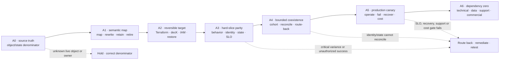

<!-- study-contract: principal -->

# Apigee migration strategy: move the object graph, runtime state, and operating responsibility

| Field | Value |
|---|---|
| Artifact type | architecture-study |
| Decision question | What evidence-gated path could move a bounded Apigee estate to the proposed Kong Enterprise 3.14 hybrid target without losing proxy semantics, products, identities, runtime state, analytics, recovery, or route-back? |
| Decision owner | Migration architecture lead with API product, IAM, security, SRE, domain, sourcing, and platform-product owners |
| Primary audiences | Executives, directors, architects, API-product teams, developers, IAM/security, DevOps/SRE, operations, sourcing, and FinOps |
| Scope | Google-managed Apigee or Apigee Hybrid source archetype; proxy revisions and shared flows; policies and callouts; products, developers, apps and credentials; KVMs, quotas, caches, targets, TLS, portal, analytics and audit; bounded coexistence and dependency-zero exit to `KP-SMH1` |
| Evidence state | `E1` documented source mechanisms plus a proposed migration and proof model; no observed source inventory, converter result, representative parity run, cutover, route-back, decommission, commercial result, or production authorization |
| Reference case | Synthetic [RE-1 regulated hybrid enterprise](41-enterprise-reference-case.md); all workloads, timing, thresholds, traffic and cost remain scenario assumptions |
| As-of date | 2026-08-21; revalidate exact Apigee source archetype, versions, organization/environment model, entitlements, data locations, support, export behavior, and target Kong BOM at option freeze |
| Next gate | Approve A0 inventory and freeze one representative proxy/product/app/state slice; do not authorize a migration factory or source decommission |

## Executive answer

Use the same stable-edge, bounded-coexistence, business-verification, route-back, and dependency-zero doctrine as the [Mule migration strategy](35-mule-migration-strategy.md), but do not reuse Mule's package taxonomy. Apigee's migration unit is a connected **object and state graph**: proxy revision bundles, shared flows, policies, callouts, products, developers, apps, credentials, KVMs, quotas, caches, target servers, certificates, environment/hostname attachments, portals, analytics, audit, and—when the source is Apigee Hybrid—customer-operated Kubernetes/Cassandra/MART dependencies.

Google documents export and import of API proxy configuration bundles. That is useful inventory and source-control evidence, but a bundle is not the whole API-management program. A production recommendation requires semantic parity, identity/product-state reconciliation, runtime-state handling, representative failure and performance evidence, bounded cutover and route-back, and verified closure of technical, operating, recovery, support, data, and commercial dependencies. [Download and upload proxy bundles](https://docs.cloud.google.com/apigee/docs/api-platform/fundamentals/download-api-proxies), [API proxy configuration reference](https://docs.cloud.google.com/apigee/docs/api-platform/reference/api-proxy-configuration-reference)

Confidence is **high** that proxy-only conversion would be incomplete, **medium** that the A0–A6 sequence below is a safe planning model, and **zero** that any organization-specific Apigee-to-Kong effort, duration, cost, or production outcome has been demonstrated.

## Scenario and reference case: Apigee source archetypes

Freeze Google-managed Apigee and Apigee Hybrid separately. Hybrid adds customer-operated runtime components and state, while Google retains management services; evidence cannot be transferred between the two without proving the exact boundary. [Apigee Hybrid 1.16 architecture](https://docs.cloud.google.com/apigee/docs/hybrid/v1.16/what-is-hybrid)

The reference case remains synthetic RE-1. No Apigee organization, proxy count, traffic volume, entitlement, region, runtime topology, migration duration, team size, price or savings is treated as observed input. Any quantitative value introduced during planning is a **scenario assumption** until the A0 denominator is reconciled and approved.

## Mechanism and operating-model analysis: move the full object graph

| Layer | Source objects and state to inventory | Target disposition question | Migration proof |
|---|---|---|---|
| Contract and proxy | OpenAPI/GraphQL contract, proxy revisions, ProxyEndpoints, TargetEndpoints, flows, fault rules, resources | Direct Kong Route/Service/plugin mapping, owned service rewrite, or retirement? | Golden request/response/error corpus and active-revision identity |
| Shared behavior | Shared flows, flow hooks, JavaScript/Java/Python callouts, extensions | Supported plugin, reusable service/policy, or prohibited custom edge logic? | Scope/precedence/error/performance/security and upgrade tests |
| Product and consumer | API products, developers, apps, keys/secrets, OAuth clients/tokens, quota/SLA relationships | Which catalog, IAM, portal, Consumer/Group, credential and approval systems become authoritative? | Join/move/leave, issue/rotate/revoke, negative access, owner and runtime reconciliation |
| Runtime state | KVMs, quota counters, caches, target servers, environment properties, certificates/keystores | Recreate, transform, externalize, rotate/reissue, archive, or intentionally retire? | State ledger, semantic parity, RPO/RTO, clean restore and rollback |
| Placement and routing | Organization, environments, groups/hostnames, instances/regions or Hybrid runtime/ingress | Which CP, Workspace, repository, DP cell, DNS/LB and failure domain replace each boundary? | Packet path, composite readiness, zone/region loss, stale-state and route-back evidence |
| Evidence and product experience | Analytics, debug, audit, portals/catalogs, reports, retention/export | Which enterprise and Kong services preserve required queries, history, evidence safety and consumer journeys? | Reconciled counters, incident query, prohibited-field test, persona journey and retention/export proof |
| Hybrid operations | Kubernetes, Cassandra, MART, Synchronizer, Connect, UDCA/telemetry, backups and upgrades | Which duties disappear, transfer, or remain as shared migration dependencies? | Dependency and responsibility ledger, recovery/upgrade game day, support and cost record |

## Proposed A0–A6 migration roadmap

Every phase is **proposed and not run**. Elapsed time and workload counts are intentionally omitted until observed inventory and capacity replace assumptions.

| Phase | Audience-facing purpose | Required work | Exit evidence | Hold or route-back signal |
|---|---|---|---|---|
| A0 — inventory and freeze | Establish the source truth | Export active and retained revisions; inventory shared flows, policies/callouts, products/apps/keys, KVM/quota/cache, targets/TLS, portal, analytics/audit, traffic, owners, support and Hybrid dependencies | Reconciled object/state/traffic/owner denominator; exact source and target options | UI or bundle export is the only inventory; active runtime or owner state is unknown |
| A1 — semantic classification | Decide direct map, configure, rewrite, retain, or retire | Map every source behavior to Kong entity/plugin, owned service, retained dependency or retirement; use the [terminology crosswalk](../research/glossary.md#kong-terminology-crosswalk) | Approved semantic map, policy precedence, state authority, target owner and unsupported list | Name matching substitutes for behavior; durable workflow or product state is pushed into opaque gateway code |
| A2 — target foundation | Build a reversible target path | Freeze Kong 3.14 patch/BOM; Terraform platform boundary; decK entity pipeline; IAM/PKI, observability, backup/restore, support, cost and optional security adjunct | Executable plans/diffs, signed release manifest, active digest, restore result and route-back design | Overlapping writers, unsupported plugin, unowned state, failed restore, or no safe route-back |
| A3 — representative parity | Prove the hard object graph | Select a proxy with authentication, product/app credentials, quota/KVM, transformation/callout, target routing, errors and evidence; run golden and negative corpora plus failure/load cases | Semantic, identity, state, performance, security and evidence disposition with retained first failures | Critical variance, unauthorized success, unbounded counter/state difference, unsupported protocol or evidence gap |
| A4 — bounded coexistence | Move cohorts behind a stable edge | Stage credentials, use DNS/LB/header/cohort routing, reconcile source/target consumer and business outcomes, rehearse timed route-back | Cohort manifest, dual-runtime identity/state ledger, SLO/business probes, reconciliation and rollback time | Route-back restores traffic but not identity/state, or source/target authorities drift |
| A5 — production canary | Collect representative operating evidence | Run low-risk then high-consequence slices through peak, incident, rotation, patch, regional loss, support interaction and cost observation | Independently reviewed `E4` service, security, recovery, support, toil and cost evidence | Error budget, correctness, IAM, recovery, staffing/support or cost gate fails |
| A6 — dependency zero | Retire only after closure | Freeze changes; archive required bundles/evidence; remove routes, credentials, keys/certs, KVM/state, portals, jobs, support/runbooks, Hybrid components, licenses and contracts | Signed technical/operating/recovery/data/commercial dependency-zero ledger and retained rollback record | Any live consumer, credential, state, route, recovery, audit, support or commercial dependency remains |

**Figure APIG-1 — Evidence-gated Apigee migration moves a connected object graph through reversible gates.**

- **Depicted scope:** source archetype freeze; object/state inventory; semantic classification; reversible Kong foundation; representative parity; bounded coexistence; production canary; dependency-zero exit; hold and route-back controls.
- **Excluded scope:** automated conversion, organization-specific inventory, elapsed schedule, workload volume, exact products or editions, target success, cost, staffing, source decommission and evidence that any gate has passed.
- **Diagram source, evidence state and as-of:** inline synthesis of the proposed A0–A6 roadmap in this study; migration hypothesis based on official Apigee export/configuration mechanisms and repository decision controls, with no observed migration result; 2026-08-21.
- **Accessible equivalent:** freeze the exact Apigee source, reconcile its connected object and state graph, classify each behavior and authority, build a reversible target, prove a hard representative slice, move bounded cohorts with route-back, collect representative operating evidence, and remove the source only after every dependency closes. Failed inventory, parity, identity/state, recovery, support or cost evidence holds or routes the programme back.

**Figure interpretation:** The migration unit is a connected object/state graph, not a proxy bundle. Every forward move requires evidence; traffic route-back and identity/state reconciliation remain separate controls.

**Figure limitation:** The sequence cannot prove that every object can map, that a representative slice covers the estate, that coexistence is affordable, or that a route-back restores irreversible business effects. A0 inventory and A3–A5 execution decide those questions.

## Coexistence and route-back contract

The API edge stays stable while bounded cohorts move. Traffic rollback and state reconciliation are separate decisions: returning DNS or routing to Apigee does not repair an app credential issued only in the target, a mutated KVM/quota state, an irreversible backend outcome, lost analytics/audit evidence, or a changed portal contract.

For every cohort, record the source and target release identities; proxy/product/app/credential mappings; state authorities and compatibility horizon; DNS/LB/cache behavior; business and security probes; telemetry produced/dropped/delivered; reconciliation procedure; timed route-back; and the owner who can stop the move.

## Failure modes and edge cases during coexistence

| Failure or edge case | Why simple traffic rollback is insufficient | Required control and evidence |
|---|---|---|
| Product/app credential divergence | A target-only client, key, secret, scope or approval can remain active after traffic returns to Apigee | One identity authority per stage; bidirectional ledger; issue/rotate/revoke negative tests; orphan scan |
| KVM, quota or cache divergence | State can advance on one runtime and change policy or business behavior when the other resumes | Declared state authority and compatibility horizon; counter/state reconciliation; bounded dual-write or explicit freeze |
| Non-idempotent backend effect | A timeout or retry can create an irreversible duplicate even when the proxy route is restored | Business idempotency key, outcome probe, ambiguity ledger and domain-approved reconciliation |
| DNS/LB and connection persistence | Cached resolution, keepalive and health checks can keep a cohort on the failed path | Measured propagation, connection-drain and cache behavior; route identity in probes; timed rollback evidence |
| Proxy/policy semantic variance | Fault handling, flow condition, header/path rewrite, callout or quota behavior can differ only on rare paths | Golden, negative and error corpus; source/target active release identity; retained first failure and disposition |
| Analytics, audit or security-evidence gap | Successful requests can be operationally invisible or lose required privacy/correlation controls | Produced/queued/dropped/delivered accounting; incident-query join; prohibited-field test; custody and retention evidence |
| Hybrid component or Cassandra dependency remains | Traffic can move while source runtime, recovery, support or data obligations still remain | Signed dependency ledger and A6 closure across runtime, backup, upgrade, support, license and contract boundaries |

## Pricing, multicloud, and exit treatment

Do not compare public managed Apigee pay-as-you-go meters with a proposed self-managed Kong Enterprise price. Google states that the public pay-as-you-go model does not apply to Apigee Hybrid, while Kong Enterprise pricing is custom. Normalize exact quotes and a three-to-five-year low/base/high model across licensing, environments/regions, calls, deployments, security/analytics add-ons, infrastructure, PostgreSQL, PKI, telemetry, support, SRE/on-call, migration, dual run, downtime exposure, and clean exit. [Apigee pricing](https://cloud.google.com/apigee/pricing), [Kong pricing](https://konghq.com/pricing)

Multicloud runtime placement is not equivalent to portability. Measure management-plane dependency, policy/configuration rewrite, product/identity/state portability, data and analytics export, support boundaries, and observed effort to rebuild one representative API on a non-source platform.

## Counter-hypotheses and non-fit conditions

| Counter-hypothesis or non-fit condition | Why it may be right | Evidence that decides it | Programme implication |
|---|---|---|---|
| Retain Apigee for the bounded estate | Product/app lifecycle, analytics, policy semantics, Google-managed accountability or commercial terms may outweigh migration benefit | Observed use-case dependency, exact operating boundary, support and normalized TCO | Narrow or stop migration; retain an explicit boundary and owner |
| Move only selected proxy classes | Stateful/custom policies, portals, monetization, identity or analytics may be uneconomic to reproduce | A0 classification plus A3 parity and cost by class | Use a mixed end state; prohibit a universal migration factory |
| A managed Kong custody model is safer than `KP-SMH1` | Self-managed CP/PostgreSQL/PKI/upgrade/on-call duty may exceed the value of custody | Equivalent Konnect benchmark, recovery/support exercise and fully allocated TCO | Switch custody before scaling the target foundation |
| Another target is stronger for the representative slice | Required lifecycle, security, latency, residency, support, reversibility or cost outcome may fail on Kong | Symmetric exact-option proof with the same corpus, failures, measures and evidence floor | Remove Kong for that scope rather than average a mandatory failure |
| Migration should not proceed yet | Source inventory, ownership, business verification or route-back may be too weak to move safely | Reconciled A0 denominator, accountable owners and approved A3 corpus | Hold at inventory/classification; do not use schedule pressure as evidence |

## Decision implications

1. Treat proxy bundles as source evidence, not as a migration result or complete inventory.
2. Freeze managed Apigee and Apigee Hybrid as different source archetypes.
3. Keep products, apps, credentials, KVM/quota/cache, portal, analytics, audit, TLS and Hybrid runtime state in the migration denominator.
4. Use the same stable-edge, cohort, business-verifier, reconciliation and route-back discipline as Mule migration while preserving Apigee-specific objects and failure seams.
5. Authorize factory scale only after representative A3–A5 evidence passes; authorize source decommission only at A6 dependency zero.

## Falsification and proof plan

| Proof ID | Procedure | Measure | Pass/hold rule | Evidence artifact | Independent reviewer |
|---|---|---|---|---|---|
| APIG-M01 | Reconcile API exports and APIs against active revisions, deployments, products, apps, KVMs, targets, certificates, traffic and owners | Inventory coverage and unexplained live objects | Hold on any unowned or unexplained active object/state/traffic | Signed source denominator and exception ledger | API product plus independent platform assurance |
| APIG-M02 | Convert one hard representative slice and run golden/negative/error/load/fault corpora | Semantic variance, unauthorized success, quota/state divergence, SLO and resource cost | Zero unexplained critical variance or unauthorized success; all degradation explicit | Source/target bundles, configs, corpus, raw results and disposition | Domain, IAM/security and performance reviewers |
| APIG-M03 | Move a bounded cohort, mutate permitted product/app/state, fail target dependencies, and execute timed route-back | Business outcome, identity/state reconciliation, evidence gaps and rollback time | Approved objective met; no orphan access/state or ambiguous outcome | Cohort timeline, ledgers, probes, reconciliation and route-back record | SRE plus business-risk reviewer |
| APIG-M04 | Close one slice through technical, operating, recovery, data, support and commercial dependency zero | Residual source dependencies and realized cost | Every dependency closed, transferred, archived or formally retained | Decommission, archive, support, contract and finance record | Operational-readiness board plus sourcing/FinOps |

## Risks and limitations

- No observed Apigee estate inventory or cross-platform converter output is present in this repository.
- Source behavior depends on managed versus Hybrid topology, edition, version, policies/callouts, environment and organization design, data residency, and support terms.
- Proxy export does not preserve all runtime history, consumer/product state, secrets, analytics, portal experience, or operator knowledge.
- Parallel runtime can create identity, quota, cache, state, telemetry and business-outcome divergence; route-back can be technically successful while reconciliation fails.
- Public pricing meters are volatile and incomparable without exact options, quotes, workloads and operating responsibilities.

## Open evidence requests

| Request | Owner role | Due gate | Decision impact if unresolved |
|---|---|---|---|
| Exact Apigee source archetype, organization/environment/region or Hybrid topology, versions and entitlements | API platform and sourcing | A0 | Do not design target mapping or price comparison |
| Reconciled proxy/shared-flow/policy/callout, product/app/credential, KVM/quota/cache, target/TLS, portal, analytics/audit and traffic inventory | API product, IAM/security, operations and domains | A0 | No migration denominator or wave plan |
| Exact `KP-SMH1` BOM, APIOps, IAM/PKI, observability, restore, support and route-back design | Kong platform product and SRE | A2 | No representative parity execution |
| Approved golden/negative/failure/load corpus and business verifier for the representative slice | Domain, security, SRE and assurance | A3 | No parity conclusion or production canary |
| Normalized commercial quotes, labor, dual-run, migration, support, downtime and exit model | Sourcing and FinOps | A5 | No cost-efficiency or decommission claim |

## Next gate

Approve A0 only when the owner roles accept the inventory contract, exact source archetype, target option fields, representative hard slice, evidence handling and stop rules. The next authorization is an A3 parity experiment—not a production migration wave.
