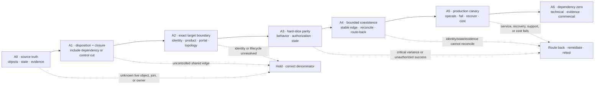

<!-- study-contract: principal -->

# Apigee migration strategy: move the object graph, runtime state, and operating responsibility

| Field | Value |
|---|---|
| Artifact type | architecture-study |
| Decision question | What evidence-gated path could move a bounded Apigee estate to the proposed Kong Enterprise 3.14 hybrid target without losing proxy semantics, product authorization, application identity, runtime state, evidence continuity, recovery, or route-back? |
| Decision owner | Migration architecture lead with Application Programming Interface (API) product, Identity and Access Management (IAM), security, Site Reliability Engineering (SRE), domain, sourcing, and platform-product owners |
| Primary audiences | Executives, directors, architects, API-product teams, developers, IAM/security, Development and Operations (DevOps), SRE, operations, sourcing, and Financial Operations (FinOps) |
| Scope | Google-managed Apigee or Apigee Hybrid source archetype; proxy revisions and shared flows; policies and callouts; products, developers, AppGroups, apps and credentials; Key Value Maps (KVMs), quotas, caches, targets, Transport Layer Security (TLS), portal, monetization, analytics and audit; bounded coexistence and dependency-zero exit to the proposed `KP-SMH1` self-managed Kong hybrid archetype |
| Evidence state | `E1` documented source mechanisms plus a proposed migration and proof model; no observed source inventory, converter result, representative parity run, cutover, route-back, decommission, commercial result, or production authorization |
| Reference case | Synthetic [RE-1 regulated hybrid enterprise](41-enterprise-reference-case.md); all workloads, timing, thresholds, traffic and cost remain scenario assumptions |
| As-of date | 2026-08-24 for the migration-control design and newly admitted mapping evidence; previously registered proxy-export evidence was reviewed 2026-08-21; all volatile mechanisms must be revalidated for the exact Apigee source and Kong bill of materials at option freeze |
| Next gate | Approve the A0 inventory schema, A1 dependency-closure rule, exact A2 identity/product/application boundary, and one representative proxy/product/app/state slice; do not authorize a migration factory or source decommission |

## Executive answer

Use the same stable-edge, bounded-coexistence, business-verification, route-back, and dependency-zero doctrine as the [Mule migration strategy](35-mule-migration-strategy.md), but do not reuse Mule's package taxonomy. Apigee's migration unit is a connected **object, dependency, and runtime-state graph**: proxy revision bundles, shared flows, policies, callouts, products and product operations, developers and AppGroups, apps and credentials, Key Value Maps (KVMs), quotas, caches, target servers, certificates, environment and hostname attachments, portal and application-lifecycle records, monetization integrations, analytics, audit, and—when the source is Apigee Hybrid—customer-operated Kubernetes, Cassandra, and Management API for Runtime data (MART) dependencies.

Google documents export and import of Application Programming Interface (API) proxy configuration bundles. That is useful inventory and source-control evidence, but a bundle is not the whole API-management program. A production recommendation requires a Kong-native semantic disposition for every behavior, dependency-closed migration cohorts, product and identity reconciliation, explicit runtime-state treatment, representative failure and performance evidence, bounded cutover and route-back, evidence continuity, and verified closure of technical, operating, recovery, support, data, portal, security, monetization, and commercial dependencies. [Download and upload proxy bundles](https://docs.cloud.google.com/apigee/docs/api-platform/fundamentals/download-api-proxies), [API proxy configuration reference](https://docs.cloud.google.com/apigee/docs/api-platform/reference/api-proxy-configuration-reference)

Confidence is **high** that proxy-only conversion would be incomplete, **medium** that the A0–A6 sequence below is a safe planning model, and **zero** that any organization-specific Apigee-to-Kong effort, duration, cost, or production outcome has been demonstrated. The [issue that requested this control expansion](https://github.com/tomqwu/apim/issues/32) is a requirements input, not capability evidence.

## Evidence boundary and source interpretation

The Kong-native mapping below is an **architecture hypothesis**, not an observed conversion result. A product noun is admitted only as a candidate implementation pattern; the exact Enterprise 3.14 patch, plugin, edition, entitlement, topology, state model, and support position still require option freeze and execution. The [finding register](../research/findings.md#findings-and-claim-register) maps every stable source ID used by this revision into `F-027` through `F-035`: external identity instead of native OAuth parity; API Product/Consumer Group non-equivalence; Workspace isolation limits; Key Value Map/Vault non-equivalence; quota/cache state limits; flow/callout/transform candidates; decK/Terraform writer controls; federated delivery as a design hypothesis; and dependency-closed cohorts. Existing finding `F-021` establishes that product families and hosting modes are not interchangeable options. Findings `F-009` and `F-010` establish only the documented Apigee Hybrid management/runtime and customer-operated component boundaries.

The issue-supplied object mapping is therefore used as a test-design hypothesis. It must not be read as evidence that Kong reproduces an Apigee API Product, Shared Flow, environment, portal, quota counter, cache entry, credential approval, monetization record, analytics history, or security investigation one-to-one. Volatile mechanisms and entitlements are revalidated at A2; a documentation change reopens the affected mapping and corpus.

## Scenario and reference case: freeze the source archetype

Freeze Google-managed Apigee and Apigee Hybrid separately. Hybrid adds customer-operated runtime components and state, while Google retains management services; evidence cannot be transferred between the two without proving the exact boundary. [Apigee Hybrid 1.16 architecture](https://docs.cloud.google.com/apigee/docs/hybrid/v1.16/what-is-hybrid)

The reference case remains the synthetic [RE-1 regulated hybrid enterprise](41-enterprise-reference-case.md). No Apigee organization, proxy count, traffic volume, entitlement, region, runtime topology, migration duration, team size, price or savings is treated as observed input. Any quantitative value introduced during planning is a **scenario assumption** until the A0 denominator is reconciled and approved.

## Kong-native semantic-disposition map

Every source object or behavior receives exactly one approved primary disposition for the cohort:

1. **Direct** — compile to a supported Kong entity or plugin only when behavior, scope, order, failure, and state semantics match.
2. **Configure** — adapt a supported Kong entity or plugin through target-specific parameters, scope, or ordering while preserving and proving the required behavior.
3. **Redesign** — preserve intent and outcome through a different Kong-plus-enterprise control model.
4. **Custom or external** — use a supported custom plugin only for bounded request-path logic, or an owned service/store for durable workflow, state, orchestration, and complex integration.
5. **Retain** — keep the Apigee or external capability behind an explicit, owned coexistence boundary.
6. **Retire** — remove behavior only with owner approval, usage evidence, consumer communication, and a negative test proving it is no longer required.

“Direct” never means text conversion. If one instance fails a semantic test, that instance moves to configure, redesign, custom or external, retain, or retire; another instance with the same Apigee object type does not inherit its disposition.

| Apigee construct | Proposed Kong-native target pattern | Primary disposition | Semantic proof before reuse | Evidence status and caution |
|---|---|---|---|---|
| Application Programming Interface (API) Proxy / ProxyEndpoint | Gateway Service plus Route | **Direct** when host, path, method, condition, rewrite, and fault behavior match | Golden and negative path/host/method/condition/error corpus; active revision identity | Proposed mapping from official [Gateway Service](https://developer.konghq.com/gateway/entities/service/), [Route](https://developer.konghq.com/gateway/entities/route/), and [Apigee proxy configuration](https://docs.cloud.google.com/apigee/docs/api-platform/reference/api-proxy-configuration-reference) documentation; not executed |
| TargetEndpoint | Gateway Service Uniform Resource Locator (URL), or Upstream plus Targets | **Direct** for simple origin; **Redesign** for target logic | Transport Layer Security (TLS), health, load balancing, retry, timeout, non-idempotent request, and error tests | Exact [Kong load-balancing](https://developer.konghq.com/gateway/traffic-control/load-balancing-reference/) semantics and plugin support remain option-specific |
| Target Server | Upstream plus Targets | **Direct** when health, weight, retry, and discovery semantics match | Backend withdrawal, partial failure, recovery, weight, and connection tests | Proposed mapping from [Apigee target load balancing](https://docs.cloud.google.com/apigee/docs/api-platform/deploy/load-balancing-across-backend-servers) and [Kong load balancing](https://developer.konghq.com/gateway/traffic-control/load-balancing-reference/); not executed |
| Policy | Supported plugin when semantics match; otherwise owned service, bounded custom plugin, retained policy, or retirement | Per behavior: **Direct**, **Configure**, **Redesign**, **Custom or external**, **Retain**, or **Retire** | Attachment scope, precedence, phase, error, performance, security, upgrade, and support corpus | A name match is not semantic parity; use the exact [plugin scope and lifecycle](https://developer.konghq.com/gateway/entities/plugin/) as test input |
| Conditional Flow | Route matches where the condition is routable; otherwise owned service or bounded custom logic | **Redesign** | Condition truth table, precedence, fall-through, error, and bypass tests | Finding `F-032`: Kong 3.14 does not admit [conditional plugin execution](https://developer.konghq.com/gateway/entities/plugin/#conditional-execution), documented for 3.15 and later; do not design against it |
| PreFlow / PostFlow | Native request/response plugin phases and static priority, with explicit failure handling; dynamic ordering only where the admitted phase supports it | **Redesign** | Ordering, short-circuit, mutation visibility, response, and fault tests in every relevant phase | Finding `F-032`: current [dynamic plugin ordering](https://developer.konghq.com/gateway/entities/plugin/#dynamic-plugin-ordering) applies only to the access phase; other phases require static-priority proof |
| Shared Flow | Compiler-owned reusable policy profile that emits reviewed plugin instances, or an owned service/custom plugin for genuine shared logic | **Redesign** or **Custom or external** | Attachment graph, shared-version propagation, precedence, bypass, failure, blast-radius, and rollback tests | Do not build a Shared Flow compatibility engine in Kong |
| Flow Hook | Global or appropriately scoped plugins only after attachment scope is explicit | **Redesign** | Every entry path, order, bypass, emergency disable, and resource-cost test | Global scope can create cross-cohort blast radius |
| Key Value Map (KVM) | Secrets become references to Kong Vault; ordinary configuration becomes reviewed Git/plugin configuration; mutable session or workflow state moves to an owned external store | **Redesign** or **Custom or external** | Classify every key by secrecy, mutability, consistency, retention, owner, recovery, and request-path latency | Finding `F-030`: [Kong Vaults](https://developer.konghq.com/gateway/entities/vault/) are not a generic replacement for [mutable Apigee KVM state](https://docs.cloud.google.com/apigee/docs/api-platform/cache/key-value-maps); no live state portability is assumed |
| Environment | Separate lifecycle Control Planes where required; Workspaces only for bounded administration inside one Control Plane; Data Plane cells for runtime placement | **Redesign** | Lifecycle, writer, network, capacity, recovery, jurisdiction, promotion, and support isolation tests | Finding `F-029`: [Workspaces](https://developer.konghq.com/gateway/entities/workspace/) are administrative namespaces; separate development/test/production Control Planes are a design recommendation, not a documented product mandate |
| Environment Group / hostname | Domain Name System (DNS), load balancer, Control Plane/Data Plane topology, and host/path Routes | **Redesign** | Host ownership, certificate, routing priority, anti-spoofing, failover, drain, and route-back tests | No one-to-one Kong entity is claimed |
| API Product and operation/resource binding | Authoritative external product/entitlement record compiled to explicit Routes, authentication, Consumer/Consumer Group membership, authorization, and rate-limit policy | **Redesign** | Positive and negative product/operation/method/path/environment/scope/quota tests for every approved credential association | Finding `F-028`: [Consumer Groups](https://developer.konghq.com/gateway/entities/consumer-group/) alone are not [Apigee API Products](https://docs.cloud.google.com/apigee/docs/api-platform/publish/create-api-products); Konnect packages/portal are not admitted to the self-managed target |
| Developer / AppGroup | Retained or external developer, organization, team, ownership, approval, and lifecycle registry | **Retain** or **Redesign** | Join/move/leave, delegated owner, orphan, approval segregation, recertification, and offboarding tests | A Kong Consumer is not a workforce/developer identity or [Apigee AppGroup](https://docs.cloud.google.com/apigee/docs/api-platform/publish/organizing-client-app-ownership) |
| Developer App | External canonical application/client record mapped to a Kong Consumer runtime principal | **Redesign** | Durable owner, product association, environment, credential, status, transfer, revoke, and audit reconciliation | [Apigee app state](https://docs.cloud.google.com/apigee/docs/api-platform/publish/creating-apps-surface-your-api) includes ownership and product-bearing credentials; Consumer identity does not by itself provide that workflow |
| App credential / API key | Reissued approved Consumer credential using Key Authentication, OpenID Connect, JSON Web Token (JWT), mutual Transport Layer Security (mTLS), or another approved profile | **Redesign** | Issue, one-time delivery, overlap, rotation, expiry, compromise, revoke, stale-runtime denial, and secret-leak tests | Reissue rather than copy private secrets by default; exact plugin entitlement/support is volatile |
| OAuth 2.0 authorization-framework client, token, and refresh state | External Identity Provider (IdP)/OpenID Connect (OIDC), or retained Apigee token authority with explicit dual-validation and drain | **Redesign** or **Retain** | Issuer, audience, scope, token type, introspection, key rotation, revocation, refresh, clock, outage, drain, and replay tests | Finding `F-027`: native Kong OAuth 2.0 plugin is incompatible with hybrid mode |
| Quota / SpikeArrest | Admitted Kong rate-limiting capability only after window, identifier, counter store, consistency, failure, and response semantics are proved | **Redesign** | Boundary/window, burst, concurrency, distributed counter, store loss, retry, reset, and route-back tests | Finding `F-031`: [Kong rate-limiting strategies](https://developer.konghq.com/gateway/rate-limiting/strategies/) do not move a live [Apigee quota](https://docs.cloud.google.com/apigee/docs/api-platform/reference/policies/quota-policy) counter or reproduce every algorithm |
| AssignMessage | Request/Response Transformer where the admitted plugin supports the exact operation; otherwise bounded custom logic or owned service | **Redesign** or **Custom or external** | Header/query/body and complete-message mutation, encoding, missing-variable, size, order, and error corpus | [Request Transformer](https://developer.konghq.com/plugins/request-transformer/) overlaps only part of [AssignMessage](https://docs.cloud.google.com/apigee/docs/api-platform/reference/policies/assign-message-policy); never classify the object type as automatically direct |
| ServiceCallout | Admitted Request Callout plugin where exact latency, authentication, body, response, and fault semantics match; otherwise owned external service or bounded custom plugin | **Redesign** or **Custom or external** | Timeout, retry, circuit, identity, body/response, privacy, dependency loss, resource budget, and upgrade tests | [Request Callout](https://developer.konghq.com/plugins/request-callout/) is a candidate for [ServiceCallout](https://docs.cloud.google.com/apigee/docs/api-platform/reference/policies/service-callout-policy), not blanket parity; durable orchestration and business state remain outside gateway plugins |
| JavaScript / Java / Python callout | Replace with native plugin only when semantic parity is proved; otherwise owned service, admitted custom plugin, retention, or retirement | **Custom or external**, **Retain**, or **Retire** | Static inventory, dependency/security scan, deterministic build, behavior corpus, performance, failure, and support proof | Custom code is an exception, not the migration default |
| MessageLogging | Admitted logging or OpenTelemetry plugin plus the enterprise observability and security-evidence pipeline | **Redesign** | Field classification, redaction, correlation, buffering, backpressure, loss accounting, retention, and incident-query tests | Event transport does not preserve historical reports or investigation joins by itself |
| Cache | Admitted Kong caching capability or owned external cache with an explicit cold-start and state-loss decision | **Redesign** | Key/variation, invalidation, freshness, privacy, purge, time-to-live, cold load, store loss, and route-back tests | Finding `F-031`: [Kong Proxy Cache](https://developer.konghq.com/plugins/proxy-cache/) and [Apigee cache](https://docs.cloud.google.com/apigee/docs/api-platform/cache/persistence-tools) mechanisms still require exact semantic proof; live entries are not portable configuration |
| Transport Layer Security (TLS) / mutual TLS (mTLS) | Certificates and Server Name Indication plus downstream/upstream TLS configuration and enterprise certificate lifecycle | **Direct** for wiring; **Redesign** for trust lifecycle | Chain, hostname, client population, overlap, rotation, revocation, pinned-client, and stale-runtime tests | Certificate material is rotated/reissued and custody is explicit |
| OpenAPI contract | Retain as the versioned API contract; compile initial Gateway Service, Route, and policy intent where safe | **Retain** | Contract-to-runtime release binding, compatibility, negative schema, and documentation checks | Generated configuration remains reviewed target-specific output |
| Portal, catalog, and application lifecycle | Retain an external authoritative system until an exact supported self-managed target is proven | **Retain** or **Redesign** | Discovery, ownership, approval, credential lifecycle, support, runtime-denial, export/rebuild, and outage tests | Do not infer Konnect Dev Portal parity for self-managed Kong |
| Monetization, billing, and commercial entitlement | Retain or build an owned external rating/billing/entitlement integration; compile only enforceable runtime controls to Kong | **Retain** or **Custom or external** | Product/rate-plan mapping, transaction evidence, adjustment/refund, dispute, privacy, financial reconciliation, and exit tests | No native one-to-one target is assumed; exact [Apigee monetization](https://docs.cloud.google.com/apigee/docs/api-platform/monetization/overview) usage must be inventoried |
| Analytics, custom reports, audit, and security investigations | Preserve required source history in a controlled archive; emit a normalized target event model into enterprise analytics/security systems | **Retain** plus **Redesign** | Dimension/query inventory, record count, retention, privacy, correlation, incident join, gap declaration, and restore/export test | Historical continuity is a governed evidence problem, not a generic log export |

## Mechanism and operating-model analysis: move the full graph

| Layer | Source objects and state to inventory | Target disposition question | Migration proof |
|---|---|---|---|
| Contract and proxy | OpenAPI or GraphQL contract, Application Programming Interface (API) proxy revisions, ProxyEndpoints, TargetEndpoints, flows, fault rules, resources | Direct Kong Route/Service/plugin mapping, owned service rewrite, retention, or retirement? | Golden request/response/error corpus and active-revision identity |
| Shared behavior | Shared Flows, Flow Hooks, JavaScript/Java/Python callouts, extensions | Supported plugin, compiled reusable policy, owned service, retained dependency, or prohibited custom edge logic? | Scope, precedence, error, performance, security, upgrade, support, and blast-radius tests |
| Product and consumer | API Products and operations, developers, AppGroups, apps, keys/secrets, OAuth 2.0 authorization-framework clients/tokens, quota and service-level relationships | Which catalog, Identity and Access Management (IAM), portal, Consumer/Group, credential, approval, and entitlement systems become authoritative? | Join/move/leave, issue/rotate/revoke, positive/negative access, owner, product, and runtime reconciliation |
| Runtime state | Key Value Maps (KVMs), quota counters, caches, target servers, environment properties, certificates/keystores | Recreate, transform, externalize, drain, reset, rotate/reissue, archive, retain, or intentionally retire? | State ledger, semantic parity, Recovery Point Objective (RPO), Recovery Time Objective (RTO), clean restore, and route-back reconciliation |
| Placement and routing | Organization, environments, groups/hostnames, instances/regions or Hybrid runtime/ingress | Which Control Plane, Workspace, repository, Data Plane cell, Domain Name System/load balancer path, and failure domain replace each boundary? | Packet path, lifecycle isolation, composite readiness, zone/region loss, stale-state, and route-back evidence |
| Portal and external integrations | Portal/catalog, developer/AppGroup ownership, approval workflow, identity provider, monetization/billing, notification, ticketing, and support | Replace, retain, or rebuild; which system is authoritative during coexistence? | Lifecycle state machine, retry/reconciliation, outage, privacy, export/rebuild, and dependency-zero proof |
| Evidence and product experience | Analytics, debug, audit, custom reports/dimensions/alerts, security findings, incident joins, retention/export | Which enterprise and Kong services preserve required queries, history, evidence safety, and consumer journeys? | Reconciled produced/delivered/retained counts, incident query, prohibited-field test, persona journey, and declared history gap |
| Hybrid operations | Kubernetes, Cassandra, Management API for Runtime data (MART), Synchronizer, Connect, telemetry, backups, and upgrades | Which duties disappear, transfer, or remain as shared migration dependencies? | Dependency and responsibility ledger, recovery/upgrade game day, support record, and fully allocated cost |

## Proposed A0–A6 migration roadmap

Every phase identifier is a stable gate label, not an acronym. Every phase is **proposed and not run**. Elapsed time and workload counts are intentionally omitted until observed inventory and capacity replace assumptions.

| Phase | Audience-facing purpose | Required work | Exit evidence | Hold or route-back signal |
|---|---|---|---|---|
| A0 — inventory and freeze | Establish the source truth | Export active and retained Application Programming Interface (API) proxy revisions; inventory Shared Flows, Flow Hooks, policies/callouts, products and operation/resource/method/path/environment/scope/quota state, developers, AppGroups, apps, credentials and product approvals/status/expiry, Key Value Maps, quota/cache, targets/Transport Layer Security, portal, monetization when enabled, external identity/billing/workflow/support integrations, analytics/custom reports/audit/security investigations, traffic, owners, entitlements, support, and Hybrid dependencies | Reconciled object/state/traffic/owner denominator; active revision and attachment graph; exact source and target options; unexplained exception ledger | User interface or bundle export is the only inventory; active runtime, shared dependency, external integration, evidence query, state, approval, expiry, or owner is unknown |
| A1 — semantic classification and dependency closure | Decide direct, configure, redesign, custom or external, retain, or retire—and form safe cohorts | Assign every source behavior one primary disposition; build the full dependency graph; identify shared-object cut sets; either include each dependency in the cohort or approve an explicit retained/frozen/adapter boundary with owner and test | Approved semantic-disposition map; dependency-closed cohort manifest; shared-object cut-set register; state authority; precedence/error semantics; unsupported list | Name matching substitutes for behavior; shared object or writer crosses the cohort without a controlled cut; durable workflow or product state is pushed into opaque gateway code |
| A2 — exact target foundation | Build a reversible target and resolve the identity/product boundary | Freeze Kong Enterprise 3.14 patch and bill of materials; Terraform platform boundary; decK Application Programming Interface (API) operations pipeline; one writer per entity; exact Control Plane/Data Plane/Workspace lifecycle; Identity and Access Management/Public Key Infrastructure; external Identity Provider (IdP)/OpenID Connect (OIDC) or retained OAuth 2.0 authorization-framework boundary; authoritative portal/catalog/application/product/approval/credential lifecycle or explicit retained boundary; observability, evidence, backup/restore, support, cost, stable edge, and optional security adjunct | Executable plans/validation/diffs; signed release manifest; active digest; exact OAuth 2.0/token-drain and portal/application state machines; credential/product authority map; restore result; stable-edge and route-back design | Overlapping writers; unresolved OAuth 2.0/IdP or portal/application authority; inferred Konnect parity; unsupported plugin; unowned state; failed restore; untrusted cohort routing; no safe route-back |
| A3 — representative parity | Prove the hard object graph and state decisions | Select a proxy with authentication, product operations, approved and prohibited credentials, quota/Key Value Map/cache, transformation/callout, target routing, errors, evidence, and external integration; run golden, positive/negative authorization, error, load, fault, identity, state, and evidence corpora; execute approved quota/cache reset/drain/reconciliation rules | Zero **unaccepted critical variance**; zero unauthorized success; every critical case executed and attributable; bounded state/evidence differences accepted by named owner; retained first failures | Any unaccepted critical variance, unauthorized product/operation/environment/scope access, unbounded counter/cache/state difference, unsupported protocol, orphan credential, or evidence gap |
| A4 — bounded coexistence | Move a dependency-closed cohort behind a stable edge | Stage/reissue credentials; use trusted Domain Name System/load balancer/cohort routing; strip untrusted markers; reconcile source/target consumer, product, state, evidence, and business outcomes; rehearse timed route-back and connection drain | Cohort manifest and cut sets; dual-runtime identity/state ledger; Service Level Objective and business probes; state/evidence reconciliation; timed route-back; no uncontrolled cross-cohort dependency | Route-back restores traffic but not identity, quota/cache, evidence, or business state; source/target authorities drift; cohort marker can be spoofed; edge parity or fallback fails |
| A5 — production canary | Collect representative operating evidence | Run low-risk then high-consequence slices through peak, incident, rotation, patch, regional loss, support interaction, analytics/security investigation, and cost observation | Independently reviewed `E4` service, security, recovery, evidence, support, toil, and cost bundle for the exact option | Error budget, correctness, Identity and Access Management, recovery, evidence, staffing/support, or cost gate fails |
| A6 — dependency zero | Retire only after closure | Freeze changes; archive required bundles/evidence; remove routes, credentials, keys/certificates, Key Value Map/state, quota/cache authority, portals, external integrations, monetization/billing jobs, analytics/security dependencies, support/runbooks, Hybrid components, licenses, and contracts | Signed technical, operating, recovery, identity, data, evidence, portal, integration, support, license, and commercial dependency-zero ledger plus retained rollback record | Any live consumer, credential, state, route, recovery, evidence, portal, integration, support, or commercial dependency remains |

## Dependency-closed cohorts and shared-object cut sets

A dependency-closed cohort is a graph slice in which every object required to authorize, route, transform, observe, support, recover, and bill the selected Application Programming Interfaces (APIs) either moves with the cohort or crosses an explicitly controlled cut. Finding `F-035` supplies the registered object classes; it does not prove an observed source graph. A cohort based only on proxy count, team ownership, or hostname is not dependency closed.

Build each cohort mechanically:

1. Seed the graph with the active proxy revisions and product operations proposed for movement.
2. Traverse outbound and inbound edges to Shared Flows, Flow Hooks, policies, Key Value Maps, target servers, certificates, environments/hostnames, products, AppGroups, apps, credentials, quota/cache state, portal, identity, monetization, analytics/security queries, and external services.
3. Mark every object referenced by an API outside the seed set as shared.
4. For each shared object, either expand the cohort until the dependency closes or create a cut-set record with source/target authority, allowed mutations, freeze or adapter rule, compatibility horizon, failure mode, reconciliation, route-back, owner, and executable test.
5. Reject the cohort when a critical edge has no controlled cut, when two systems can write the same entity without reconciliation, or when product/credential/state/evidence ownership is ambiguous.

| Shared-object cut | Unsafe shortcut | Required cut-set contract |
|---|---|---|
| Shared Flow / Flow Hook / global policy | Copy behavior into the cohort and allow both versions to evolve | Version and attachment graph; one writer; change freeze or compiler; precedence/bypass corpus; emergency disable; rollback |
| Application Programming Interface (API) Product, AppGroup, app, credential | Move a proxy while leaving entitlement joins implicit | Canonical product/app IDs; approved operation/environment/scope set; credential status/expiry; authority; positive/negative tests; orphan scan |
| Key Value Map, quota counter, cache | Treat configuration export as live-state migration | State class and owner; read/write authority; epoch; drain/reset/preserve rule; reconciliation; intentional-loss approval; route-back behavior |
| Target server, certificate, hostname | Assume shared infrastructure is unchanged | Ownership; health/trust version; overlap; capacity; consumer/API inventory; failure isolation; connection drain; rollback |
| Identity Provider (IdP), OAuth 2.0 authorization-framework token, portal/application lifecycle | Change runtime validation without changing issuance, refresh, revoke, or approval | Exact issuer/client/token and application state machines; dual-validation/drain; retry/compensation; stale-runtime revoke; retained-boundary exit |
| Monetization, billing, notification, support workflow | Move traffic and reconcile later | Transaction/correlation IDs; rating and adjustment rule; error queue; financial/support owner; replay/idempotency; closeout evidence |
| Analytics, audit, custom report, security finding | Emit logs and assume evidence continuity | Query/dimension schema; source/target join; produced/dropped/delivered counts; retention/archive; prohibited fields; declared gap and approver |

## A2 identity, product, portal, and application-lifecycle boundary

A2 cannot pass with “use OpenID Connect” or “use the portal” as a design. The target record must name the authoritative system, exact lifecycle states, allowed actors, propagation path, failure behavior, evidence, and retained exit for every identity, product, application, credential, and token transition. OAuth 2.0 authorization-framework, Identity Provider (IdP), and OpenID Connect (OIDC) fields are gate inputs, not implementation notes.

| Boundary | A2 design must resolve | Mandatory failure and reconciliation proof |
|---|---|---|
| Token validation | Issuer, audience, scopes/claims, algorithm, JSON Web Token versus opaque token, JSON Web Key Set/introspection endpoints, cache age, clock tolerance, error response, and backend identity propagation | Issuer/key rotation, expired/not-before/wrong-audience/wrong-scope, introspection or key endpoint loss, stale cache, clock skew, and prohibited-token negative corpus |
| Client and token transition | Existing client inventory and owner; refresh-token and opaque-token state; dual-validation order; token drain horizon; revocation authority; rollback compatibility | Issue, refresh, revoke, expiry, replay, dual-acceptance end, source outage, target outage, and old-token denial after drain |
| Product authorization | Canonical product/version/operation/resource/method/path/environment/scope/quota; credential-product approval, status, expiry, and exception | Positive case for every intended association; negative cross-product, operation, method, path, environment, scope, expired, revoked, and unapproved cases; zero unauthorized success |
| Portal and catalog | Authoritative Application Programming Interface (API) catalog/product record, published contract/version, audience visibility, documentation, sandbox, support, release identity, and export/rebuild path | Documentation/runtime drift, wrong-audience discovery, stale version, portal outage, export/rebuild, and support-to-runtime correlation |
| Application lifecycle | Developer/AppGroup/team and durable app owner; request, approval, registration, one-time secret handoff, rotation, recertification, transfer, suspension, revoke, offboard, and audit | Duplicate retry, approver segregation, orphan owner, partial Identity Provider (IdP) success, secret leakage, rotation overlap, stale-runtime revoke, and dependency-zero closure |
| Retained boundary | Exact Apigee or external functions that remain, owner, service objective, data/support/commercial dependency, integration contract, route-back, and retirement trigger | Retained service outage, split authority, reconciliation backlog, contract/support loss, and proof that a migration cohort remains reversible |

Consumer Groups may help compile shared runtime policy, but they do not replace the product and application state above. Konnect API packages and Dev Portal are also not evidence for the proposed self-managed target; admitting Konnect instead would change the exact target option and reopen the gate.

## Quota, cache, and mutable-state transition rules

No live quota counter, cache entry, token, mutable Key Value Map (KVM) value, or portal approval is assumed portable. Every state family receives a state-transition record before A3 with one of four modes: **preserve/recreate**, **drain then reset**, **bounded dual evaluation**, or **intentional loss**.

| State family | Required rule | Reconciliation and route-back condition |
|---|---|---|
| Quota counter | Record identifier, interval/window, source epoch, remaining allowance, target strategy/store, consistency/failure behavior, cutover timestamp, and consumer communication. If remaining allowance cannot be seeded safely, drain the source window or approve a reset; never silently grant a second full allowance. | Compare accepted/rejected counts by consumer/product/window; define which side is authoritative during coexistence; route-back cannot double allowance; any variance above the approved per-product bound holds the cohort. |
| Spike/burst protection | Record algorithm, identifier, burst/steady threshold, clock, node/distributed behavior, response, and upstream capacity dependency. | Replay boundary and burst corpus across nodes/regions; zero unaccepted capacity or authorization exposure; restore source rule without creating an uncontrolled burst. |
| Cache | Record key and variation, privacy class, payload ownership, freshness, invalidation, time to live, purge, warm/drain plan, target store, and cold-start load budget. | Prove purge, stale denial, source/target key separation, cold-cache backend protection, and route-back freshness. Live entries may be discarded only through the intentional-loss rule. |
| Mutable Key Value Map (KVM)/external store | Record schema, secrecy, read/write owners, consistency, transaction/locking, latency, retention, backup/restore, and migration transform. | Freeze or version writes; reconcile record count/hash and business outcome; reject dual-write without idempotency and conflict resolution; route-back identifies the last authoritative write. |
| Intentional loss | Name the state, affected consumers/business process, reason it cannot or should not transfer, worst consequence, containment, communication, approver, effective time, and recovery evidence. | Approval occurs before traffic movement; loss is observable and bounded; no security, legal, financial, or recovery obligation is silently discarded. |

## Workspace, Control Plane, and Data Plane isolation

Workspace, Control Plane (CP), and Data Plane (DP) solve different problems. A Workspace is an administrative configuration namespace within a self-managed Control Plane; it is not a complete lifecycle, network, capacity, runtime-placement, recovery, or jurisdiction boundary. Separate development, test, and production Control Planes are a proposed isolation choice that the A2 option record must justify and test, not a documented requirement inferred from an Apigee Environment.

| Boundary | What it may isolate | What it does not prove | Migration decision and evidence |
|---|---|---|---|
| Workspace | Configuration objects and role-based administrative scope within one self-managed Control Plane (CP) | Separate CP lifecycle, database, network, capacity, Data Plane routing, recovery, upgrade, jurisdiction, or global-object blast radius | Use only with an entity/writer map, route-collision and global-policy tests, access-negative corpus, active hash, and documented cross-Workspace risks |
| Control Plane | Configuration authority, administrative Application Programming Interface, PostgreSQL state, upgrade/restore, and lifecycle boundary for attached Data Planes | Request-path isolation, backend reachability, business outcome, or safe promotion by itself | Freeze exact CP per lifecycle/failure domain; prove backup/restore, access, writer, propagation, outage, scaling, support, and promotion/rollback |
| Data Plane cell | Request-serving placement, capacity, network path, local telemetry, and failure-domain containment | Independent desired-state authority, portal/product lifecycle, quota semantics, or source-of-truth history | Map each cohort to an admitted cell; prove readiness, active config, capacity, zone/region loss, stale state, and route-back |
| Git repository and pipeline | Intent ownership, review, compilation, provenance, and promotion workflow | Runtime truth unless reconciled to the active Control Plane/Data Plane state | Declare one writer per entity and environment; validate/diff/deletion preview; signed release manifest; active digest and outside-in probe |

## Apigee migration-factory control pack

The roadmap becomes executable only when every cohort carries the records below. These are versioned control artifacts, not status slides. A blank or unreconciled mandatory field holds the cohort at its current phase.

| Control artifact | Minimum required fields | Created or updated | Gate it supports |
|---|---|---|---|
| Source denominator | Managed or Hybrid archetype; organization/environment/region; active and retained Application Programming Interface (API) proxy revisions; Shared Flows/Flow Hooks; policies/callouts; products/operations; developers/AppGroups/apps/credentials/approvals/expiry; Key Value Map/quota/cache; targets/Transport Layer Security; portal; monetization; external integrations; analytics/custom reports/audit/security findings; traffic; owner; support; unexplained exceptions | A0 and every source change | No A1 until active objects, joins, state, traffic, integrations, evidence, and owners reconcile |
| Semantic-disposition map | Source object/behavior; direct/redesign/custom-or-external/retain/retire decision; target entity/service; state authority; precedence/error semantics; owner; unsupported condition; evidence request | A1 through A3 | No target build or factory reuse from name matching alone |
| Dependency and cut-set graph | Nodes and typed edges; shared-object detection; cohort closure; retained/frozen/adapter cut; writer; compatibility horizon; failure/reconciliation/route-back test | A1 through A5 | No cohort while any critical shared edge lacks an approved, tested cut |
| Identity/product/application authority map | Token/client authority; product operations/environments/scopes/quotas; AppGroup/app owner; credential-product approval/status/expiry; portal/catalog/approval/issue/rotate/revoke state; retained boundary | A2 through A6 | No A3 while the OAuth 2.0 authorization-framework/Identity Provider, portal, product, application, or credential authority is unresolved |
| Mutable-state transition ledger | State class; source/target authority; mode; epoch/horizon; drain/reset/dual/loss rule; approver; reconciliation; route-back; recovery | A2 through A6 | No traffic movement from silent counter/cache/state reset or unapproved loss |
| Representative parity corpus | Source/target release IDs; golden, positive/negative authorization, error, load, fault, state, identity and evidence cases; expected business outcome; oracle; first failure; disposition and reviewer | A3 and every pattern change | No cohort with unaccepted critical variance, unauthorized success, unbounded state difference, or missing critical case |
| Cohort and coexistence ledger | Cohort membership and cut sets; stable-edge route identity; source/target credentials and state authority; Domain Name System/load balancer/cache horizon; business/security probes; evidence produced/dropped/delivered; reconciliation; stop owner | A4 and A5 | No expansion without bounded routing, reconciliation, evidence continuity, and anti-spoofing proof |
| Timed route-back record | Trigger; decision authority; traffic reversal; connection drain; identity/product/state/evidence reconciliation; business ambiguity handling; recovery clock; residual divergence and reviewer | A3 rehearsal, A4 and A5 | Traffic rollback alone cannot pass the route-back gate |
| Dependency-zero register | Technical, operating, recovery, identity, data, audit/security evidence, portal, integration, support, license, contract, monetization, and commercial dependency; closure/transfer/retention decision; archive; owner; approver | A6 | No source retirement while any dependency is live, unowned, or unverifiable |

The factory reuses approved evidence patterns, not conclusions. A new source archetype, policy/callout class, identity or state authority, protocol, region, support boundary, product/app lifecycle, external integration, evidence query, or business side effect reopens classification and representative parity rather than inheriting a pass.

**Figure APIG-1 — Evidence-gated migration closes dependencies before traffic moves.**

- **Depicted scope:** source archetype freeze; complete object/state/evidence inventory; Kong-native semantic disposition; dependency closure and cut sets; exact identity/product/portal target; representative parity; bounded coexistence; production canary; dependency-zero exit; hold and route-back controls.
- **Excluded scope:** automated conversion, organization-specific inventory, elapsed schedule, workload volume, exact products or editions, target success, cost, staffing, source decommission, and evidence that any gate has passed.
- **Diagram source, evidence state and as-of:** inline synthesis of the proposed A0–A6 roadmap in this study; migration hypothesis based on official Apigee and Kong mechanisms plus repository decision controls, with no observed migration result; 2026-08-24.
- **Accessible equivalent:** freeze the exact Apigee source, reconcile its connected object/state/evidence graph, classify every behavior, close or control shared dependencies, resolve the exact identity/product/application target, build a reversible foundation, prove a hard representative slice, move bounded cohorts with route-back, collect representative operating evidence, and remove the source only after every dependency closes. Failed inventory, dependency closure, parity, authorization, state, evidence, recovery, support, or cost holds or routes the programme back.



**Figure interpretation:** The migration unit is a connected object, dependency, state, and evidence graph—not a proxy bundle. A cohort does not exist until shared dependencies are included or crossed by an owned, tested cut.

**Figure limitation:** The sequence cannot prove that every object can map, that a representative slice covers the estate, that coexistence is affordable, or that a route-back restores irreversible business effects. A0 inventory and A3–A5 execution decide those questions.

## Stable-edge, coexistence, and route-back contract

The Application Programming Interface (API) edge stays stable while dependency-closed cohorts move. Stable-edge controls include trusted cohort selection, anti-spoofing, Domain Name System (DNS) and load-balancer ownership, Transport Layer Security (TLS) hostname/certificate custody, connection draining, Web Application Firewall (WAF) and Distributed Denial of Service (DDoS) parity, route identity in probes, and an independently executable fallback. When no independent edge exists, A2 must design a temporary owned edge or prove an equally bounded source/target routing mechanism; a client-supplied header alone cannot select a cohort.

Traffic rollback and state reconciliation are separate decisions: returning DNS or routing to Apigee does not repair an app credential issued only in the target, a mutated Key Value Map/quota state, a second full quota allowance, stale cache, an irreversible backend outcome, lost analytics/audit/security evidence, a changed portal contract, or a monetization adjustment.

For every cohort, record the source and target release identities; proxy/product/app/credential mappings; state authorities and compatibility horizon; DNS/load-balancer/cache behavior; business and security probes; telemetry produced/dropped/delivered; financial/support events; reconciliation procedure; timed route-back; and the owner who can stop the move.

| Stable-edge control | Required proof | Hold condition |
|---|---|---|
| Cohort identity and anti-spoofing | Edge strips client-supplied selectors; derives a signed/internal marker only after trusted identity or allocation; route identity appears in safe probes | Client can select target/source path or escape product/tenant boundary |
| Hostname, certificate, and Domain Name System (DNS) custody | Named owner, overlapping certificate trust, measured DNS/time-to-live behavior, source/target health, and cache-busting outside-in probes | Unknown resolver horizon, certificate mismatch, or route identity cannot be established |
| Connection and protocol drain | Keepalive, streaming, long-running, retry, and non-idempotent behavior measured; explicit stop/force rule | Traffic shift leaves unbounded old connections or duplicates/abandons business work |
| Web Application Firewall (WAF) / Distributed Denial of Service (DDoS) and network parity | Equivalent admitted rule set, resource-cost test, upstream/private path, denial evidence, and emergency disable | Security/network control disappears, expands blast radius, or lacks bounded rollback |
| Independent fallback | Out-of-band actor and control path can restore the last accepted route while target control dependencies are unavailable | Route-back depends on the same failed Control Plane, identity, or network path |

## Evidence continuity contract

Evidence continuity covers more than telemetry transport. A0 inventories every analytics report, custom dimension, alert, monitoring or security finding, audit query, retention rule, legal hold, incident join, consumer report, support query, and monetization reconciliation used to operate or govern the source. A2 maps each required outcome to a normalized target event/query and identifies history that must remain in a controlled archive.

| Evidence concern | Required migration record | Acceptance rule |
|---|---|---|
| Application Programming Interface (API), product, app, and credential attribution | Source and target entity IDs, owner, route/release, environment, correlation fields, privacy class | Every critical request and decision joins to the approved product/app/credential and active release; no prohibited field |
| Produced, queued, dropped, delivered, and retained state | Per-signal counters, buffer/backpressure behavior, destination receipt, retention/archive status | Gaps are measured and dispositioned; request success is not reported as evidence success |
| Custom reports and security investigations | Query/dimension inventory, target equivalent or retained source, sample result, reviewer | Every mandatory query is reproduced, explicitly transformed, or retained with owner and expiry; no silent loss |
| Historical continuity | Source archive range, integrity/digest, access control, retention, export/restore test, declared join gap | Required history remains reviewable; any unavoidable break is named, bounded, and accepted before cutover |
| Incident and support joins | Request/config/business/security/support identifiers and clock source | One synthetic incident can be reconstructed across source/target/edge/backend without payload leakage |

## Executable engineering workflow and repository contract

Application Programming Interface operations (APIOps) turns the migration records into reviewed, reproducible artifacts. Terraform provisions the platform and lifecycle boundaries. decK validates, diffs, and applies the admitted Kong entity set through one declared writer per entity. Finding `F-033` supports the writer/deletion control; finding `F-034` marks federated application-repository delivery as a design hypothesis. Neither tool proves semantic parity by itself, and `decK sync` deletion behavior requires a reviewed deletion set and bounded ownership.

1. Export one complete representative Apigee proxy bundle and its connected organization/runtime objects through versioned inventory tooling.
2. Reconcile active revisions, traffic, owners, shared dependencies, products/operations, AppGroups/apps/credentials, mutable state, portal, monetization, external integrations, and evidence records.
3. Generate the dependency graph and proposed semantic-disposition map; require human approval for every custom/external, retained, retired, or intentional-loss decision.
4. Compile approved domain intent and central policy profiles into reviewed declarative Kong configuration. Reject overlap among Terraform, decK, controllers, and manual administration.
5. Run golden, positive/negative authorization, error, load, fault, identity, mutable-state, evidence, and business-outcome corpora against named source and target releases.
6. Move only a bounded dependency-closed cohort behind a stable edge after objective thresholds and route-back are approved.
7. Reconcile identity, product, state, business outcomes, evidence, monetization, and support independently of traffic rollback.
8. Decommission Apigee only after technical, operational, recovery, identity, data, portal, integration, evidence, support, licensing, and commercial dependencies reach zero.

Public source control stores schemas, non-secret intent, tests, safe synthetic fixtures, digests, and evidence indexes. Secret values, raw payloads, production topology, commercial terms, personal mappings, restricted security findings, and raw evidence stay in approved external systems referenced by controlled artifact IDs.

```text
api-platform/
├── schemas/
│   ├── source-inventory.schema.json
│   ├── dependency-graph.schema.json
│   ├── semantic-disposition.schema.json
│   ├── state-transition.schema.json
│   └── release-manifest.schema.json
├── platform/
│   ├── terraform/
│   ├── lifecycle-boundaries/
│   └── shared-policy-profiles/
├── environments/
│   ├── nonproduction/
│   └── production/
├── migrations/apigee/
│   └── cohorts/<public-safe-cohort-id>/
│       ├── source-denominator.yaml
│       ├── dependency-graph.json
│       ├── cut-sets.yaml
│       ├── semantic-disposition.yaml
│       ├── identity-product-boundary.yaml
│       ├── mutable-state-ledger.yaml
│       ├── deck/
│       ├── corpus/
│       ├── route-back.yaml
│       └── evidence-index.yaml
└── controls/
    ├── mandatory-policy/
    ├── stable-edge/
    └── admission/

domain-api-repository/
├── openapi.yaml
├── ownership.yaml
├── gateway-intent.yaml
├── product-intent.yaml
├── tests/
└── evidence-index.yaml
```

## APIG-M01–APIG-M04 executable proof contracts

`APIG-M01` through `APIG-M04` are stable proof identifiers, not acronyms. A threshold shown as “approved objective” is not optional: the risk or product owner must enter a numeric or categorical value before execution, and the harness must evaluate it mechanically. A tuned rerun never erases the first result.

| Proof ID and descriptor | Executable procedure and artifact | Objective measures and pass/hold threshold | Independent reviewer |
|---|---|---|---|
| APIG-M01 — source denominator and dependency closure | Run versioned exporters and graph builder; emit JavaScript Object Notation (JSON) inventory/graph plus comma-separated-values exceptions; reconcile Application Programming Interface (API)/runtime/traffic/product/app/credential/state/integration/evidence sources; sign input/output digests | **Pass:** 100% of active traffic routes map to an active revision and owner; 100% of in-scope product/app/credential and shared edges classified; zero unowned/unexplained critical object, live state, external integration, evidence query, or uncontrolled cut. **Hold:** any denominator or critical edge is unresolved. Artifact: signed source denominator, dependency graph, cut-set and exception ledger. | API product plus independent platform assurance, Identity and Access Management, and security/evidence reviewers |
| APIG-M02 — Kong-native semantic and authorization parity | Compile one hard representative slice; run versioned source/target golden, positive/negative product authorization, error, load, fault, identity, mutable-state, and evidence corpora; preserve raw results outside public Git and publish safe digests/index | **Pass:** 100% of mandatory cases executed; zero unauthorized success; zero **unaccepted critical variance**; latency/error/resource/state/evidence measures satisfy their pre-approved Service Level Objective and bounds; every accepted difference names owner/expiry. **Hold:** missing critical case, orphan access, unbounded state, or unaccepted critical variance. Artifact: release manifests, corpus, raw-result IDs, comparison, first-failure history, and dispositions. | Domain, Identity and Access Management (IAM)/security, performance/Site Reliability Engineering (SRE), and evidence-governance reviewers |
| APIG-M03 — stable-edge coexistence and timed route-back | Deploy one dependency-closed cohort; use an executable allocation schedule; mutate permitted product/app/quota/cache state; inject target/edge/identity/evidence failures; execute connection drain and route-back; run reconciliation job | **Pass:** zero spoofed cohort selection, unauthorized success, orphan credential, or ambiguous critical business outcome; 100% of moved requests attributable to source/target release; route-back, drain, state/evidence reconciliation, and backlog meet pre-approved time/count objectives; no uncontrolled cut. Artifact: edge configuration digest, cohort timeline, probes, ledgers, reconciliation, and route-back record. | Site Reliability Engineering (SRE)/resilience plus business-risk, security, API-product, and network reviewers |
| APIG-M04 — evidence continuity and dependency zero | Run automated source-dependency scan, identity/product/state/evidence joins, archive/restore query, support and commercial checklist, and clean-room target rebuild for the slice | **Pass:** 100% of dependencies closed, transferred, archived, or formally retained; zero live unowned source route, credential, state, portal, integration, evidence, support, license, or commercial dependency; every retained boundary has owner/expiry; required historical queries restore. Artifact: dependency-zero register, clean-room rebuild, archive/query results, support/finance records, and signed gate. | Operational-readiness board plus sourcing/Financial Operations (FinOps), Identity and Access Management (IAM)/security, records/evidence, and product reviewers |

## Failure modes and edge cases during coexistence

| Failure or edge case | Why simple traffic rollback is insufficient | Required control and evidence |
|---|---|---|
| Product/app credential divergence | A target-only client, key, secret, scope, approval, or expiry can remain active after traffic returns to Apigee | One Identity and Access Management authority per stage; product/app ledger; issue/rotate/revoke positive and negative tests; orphan scan |
| Key Value Map, quota, or cache divergence | State can advance on one runtime and change policy or business behavior when the other resumes | Declared state authority and epoch; preserve/drain/reset/dual/loss mode; reconciliation; approved variance; route-back rule |
| Non-idempotent backend effect | A timeout or retry can create an irreversible duplicate even when the proxy route is restored | Business idempotency key, outcome probe, ambiguity ledger, and domain-approved reconciliation |
| Domain Name System/load-balancer and connection persistence | Cached resolution, keepalive, streaming, and health checks can keep a cohort on the failed path | Measured propagation, drain, and cache behavior; route identity in probes; timed rollback evidence |
| Shared Flow, global policy, or target shared outside cohort | A local change can alter an API that did not move | Dependency graph and controlled cut; version/freeze; collision/blast-radius corpus; stop and rollback |
| Proxy/policy semantic variance | Fault handling, flow condition, header/path rewrite, callout, or quota behavior can differ only on rare paths | Golden, negative, and error corpus; source/target active release identity; retained first failure and disposition |
| Analytics, audit, or security-evidence gap | Successful requests can be operationally invisible or lose required privacy/correlation controls | Produced/queued/dropped/delivered accounting; incident-query join; prohibited-field test; custody, archive, and retention evidence |
| Portal, identity, or monetization partial success | Client/product/billing state can commit in one system while the caller retries against another | Idempotency/correlation, compensation or quarantine, reconciliation queue, one-time-secret safety, financial/support owner |
| Hybrid component or Cassandra dependency remains | Traffic can move while source runtime, recovery, support, or data obligations still remain | Signed dependency ledger and A6 closure across runtime, backup, upgrade, evidence, support, license, and contract boundaries |

## Pricing, multicloud, and exit treatment

Do not compare public managed Apigee pay-as-you-go meters with a proposed self-managed Kong Enterprise price. Google states that the public pay-as-you-go model does not apply to Apigee Hybrid, while Kong Enterprise pricing is custom. Normalize exact quotes and a three-to-five-year low/base/high model across licensing, environments/regions, calls, deployments, security/analytics add-ons, infrastructure, PostgreSQL, Public Key Infrastructure, telemetry, support, Site Reliability Engineering/on-call, migration, dual run, downtime exposure, retained portal/identity/evidence integrations, and clean exit. [Apigee pricing](https://cloud.google.com/apigee/pricing), [Kong pricing](https://konghq.com/pricing)

Multicloud runtime placement is not equivalent to portability. Measure management-plane dependency, policy/configuration rewrite, product/identity/state portability, portal and evidence export, support boundaries, external integrations, and observed effort to rebuild one representative API on a non-source platform.

## Counter-hypotheses and non-fit conditions

| Counter-hypothesis or non-fit condition | Why it may be right | Evidence that decides it | Programme implication |
|---|---|---|---|
| Retain Apigee for the bounded estate | Product/app lifecycle, analytics, monetization, policy semantics, Google-managed accountability, or commercial terms may outweigh migration benefit | Observed use-case dependency, exact operating boundary, support, and normalized Total Cost of Ownership | Narrow or stop migration; retain an explicit boundary and owner |
| Move only selected proxy classes | Stateful/custom policies, portals, monetization, identity, shared objects, or analytics may be uneconomic to reproduce | A0 graph plus A1 cut sets, A3 parity, and cost by class | Use a mixed end state; prohibit a universal migration factory |
| A managed Kong custody model is safer than the proposed `KP-SMH1` self-managed hybrid target | Self-managed Control Plane/PostgreSQL/Public Key Infrastructure/upgrade/on-call duty may exceed the value of custody | Equivalent Konnect benchmark, recovery/support exercise, and fully allocated cost | Switch custody before scaling the target foundation; reopen portal/product assumptions |
| Another target is stronger for the representative slice | Required lifecycle, security, latency, residency, support, reversibility, or cost outcome may fail on Kong | Symmetric exact-option proof with the same corpus, failures, measures, and evidence floor | Remove Kong for that scope rather than average a mandatory failure |
| Migration should not proceed yet | Source inventory, dependency closure, ownership, business verification, or route-back may be too weak to move safely | Reconciled A0 denominator, A1 controlled cuts, accountable owners, and approved A3 corpus | Hold at inventory/classification; do not use schedule pressure as evidence |

## Decision implications

1. Treat proxy bundles as source evidence, not as a migration result or complete inventory.
2. Freeze managed Apigee and Apigee Hybrid as different source archetypes.
3. Require a per-instance Kong-native disposition: direct, configure, redesign, custom or external, retain, or retire.
4. Keep products/operations, AppGroups/apps/credentials, Key Value Maps/quota/cache, portal/application lifecycle, monetization/external integrations, analytics/security evidence, Transport Layer Security, and Hybrid runtime state in the denominator.
5. Move only dependency-closed cohorts; every shared-object cut needs an owner, authority, compatibility horizon, failure/reconciliation rule, route-back, and test.
6. Do not pass A2 without an exact external Identity Provider/OpenID Connect and token-transition design plus an authoritative portal/product/application lifecycle—or an explicit retained boundary.
7. Authorize factory scale only after APIG-M01–APIG-M03 pass; authorize source decommission only after APIG-M04 and A6 dependency zero pass.

## Falsification and proof plan

The migration hypothesis is falsified for a cohort when a mandatory Apigee behavior has no supported, owned, testable target disposition; a shared dependency cannot be closed or safely cut; product/application/token authority cannot reconcile; quota/cache/state handling creates unaccepted exposure; evidence continuity cannot meet the approved requirement; or APIG-M01–APIG-M04 cannot meet precommitted thresholds. A negative result narrows, redesigns, retains, or stops the migration—it is not averaged away.

The executable APIG-M01–APIG-M04 contracts above are the controlling proof plan. They require procedures, machine-readable artifacts, objective pass/hold rules, retained first failures, and reviewers who did not author the candidate result. A design document, generated configuration, screenshot, or vendor demonstration is not an executed pass.

## Risks and limitations

- The Kong-native table is a proposed semantic-disposition catalogue, not observed cross-platform compatibility evidence.
- No observed Apigee estate inventory, dependency graph, state ledger, converter output, product-authorization corpus, or external-integration inventory is present in this repository.
- Source behavior depends on managed versus Hybrid topology, edition, version, policies/callouts, environment and organization design, data residency, monetization, portal, analytics, and support terms.
- Kong mechanisms, plugin phases, entitlements, topology limits, and support can change. Revalidate the exact Enterprise 3.14 patch and admitted bill of materials at A2; a source change reopens affected mappings.
- Konnect Control Plane Groups, API packages, and Dev Portal are Konnect mechanisms and are not evidence for the proposed self-managed target. Admitting them changes the target option.
- Workspaces are not complete lifecycle or runtime-isolation boundaries. Separate Control Planes and Data Plane cells add cost and operating responsibility that must enter the option and cost model.
- Proxy export does not preserve all runtime history, consumer/product state, secrets, quota/cache state, monetization, portal experience, evidence history, or operator knowledge.
- Parallel runtime can create identity, quota, cache, mutable-state, telemetry, financial, and business-outcome divergence; route-back can be technically successful while reconciliation fails.
- Custom plugins and external services can recreate the coupling the migration is meant to remove. Each needs ownership, supply-chain, performance, failure, support, upgrade, and exit evidence.
- Thresholds labelled “approved objective” are not observed values. The gate remains blocked until accountable owners precommit exact values before execution.
- Public pricing meters are volatile and incomparable without exact options, quotes, workloads, retained dependencies, and operating responsibilities.

## Open evidence requests

| Request | Owner role | Due gate | Decision impact if unresolved |
|---|---|---|---|
| Exact Apigee source archetype, organization/environment/region or Hybrid topology, versions, entitlements, monetization, portal, and support boundary | Application Programming Interface (API) platform and sourcing | A0 | Do not design target mapping or price comparison |
| Reconciled proxy/Shared Flow/Flow Hook/policy/callout, product-operation/AppGroup/app/credential, Key Value Map/quota/cache, target/Transport Layer Security, portal, external integration, monetization, analytics/audit/security, and traffic graph | API product, Identity and Access Management/security, operations, records/evidence, finance, and domains | A0 | No migration denominator, dependency-closed cohort, or wave plan |
| Exact proposed `KP-SMH1` self-managed hybrid bill of materials, Control Plane/Data Plane/Workspace topology, API operations writers, plugin entitlement/support, restore, stable edge, and route-back design | Kong platform product, release engineering, network, and Site Reliability Engineering (SRE) | A2 | No representative parity execution |
| Exact external Identity Provider/OpenID Connect token/client/refresh/revoke/drain design and authoritative portal/catalog/product/application/approval/credential lifecycle—or retained boundary | Identity and Access Management, API product, security, developer experience, and service management | A2 | A2 cannot pass; product authorization and offboarding remain untestable |
| Approved golden/positive/negative/failure/load/state/evidence corpus, machine-readable thresholds, and business verifier for the representative slice | Domain, security, SRE, product, evidence governance, and assurance | A3 | No parity conclusion or production canary |
| Approved quota/cache/mutable-state preserve, drain/reset, dual-evaluation, intentional-loss, reconciliation, and route-back rules | API product, domains, security/risk, and SRE | A3 | No stateful cohort movement |
| Normalized commercial quotes, labour, dual-run, retained services, migration, support, downtime, and exit model | Sourcing and Financial Operations | A5 | No cost-efficiency or decommission claim |

## Next gate

Approve A0 and A1 readiness only when the owner roles accept the inventory schema, exact source archetype, dependency-graph and cut-set rules, target option fields, representative hard slice, evidence handling, and stop rules. Before any target build, A2 must then approve the exact identity/product/portal/application boundary, mutable-state modes, lifecycle topology, Application Programming Interface operations (APIOps) authority, stable edge, route-back, and proof thresholds. The next executable authorization is APIG-M01 source-denominator and dependency-closure execution—not a production migration wave.

Related studies: [Kong Enterprise platform strategy](47-kong-enterprise-platform-strategy.md), [developer portal and API products](30-developer-portal-api-products.md), [Mule migration strategy](35-mule-migration-strategy.md), [API operations governance](29-apiops-governance.md), [security comparison](25-security-comparison.md), [observability comparison](31-observability-comparison.md), and [enterprise reference case](41-enterprise-reference-case.md).
