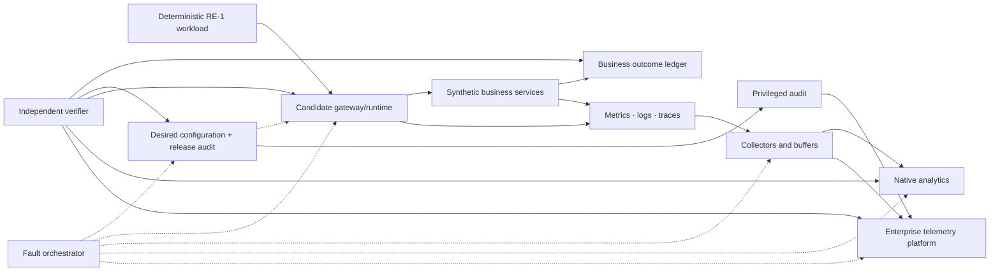
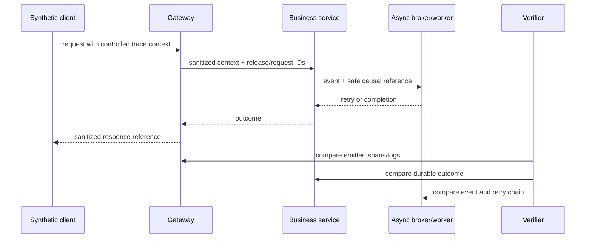

# Observability and operational-evidence proof protocol

<!-- protocol-contract: decision-grade -->

## Purpose and evidence state

This protocol determines whether an exact platform variant can produce trustworthy, safe, and operationally useful evidence during normal service, change, overload, partial failure, and recovery. It implements the proof requirements from the [observability comparison](../docs/31-observability-comparison.md) and the telemetry-backpressure case in the [real-world scenario portfolio](real-world-scenarios.md).

This is a test design, not an execution result. Every metric value, traffic rate, duration, retention period, cardinality budget, capacity, threshold, or percentage below is a **RE-1 scenario assumption** until ratified. Candidate outputs remain **not run** until an immutable evidence bundle is reviewed. Product documentation can define a mechanism; it cannot prove completeness, performance, redaction, or incident usefulness in the proposed topology.

## Decision question

Can operators reconstruct customer impact, business outcome, active configuration, platform/dependency state, and privileged change across the exact control and runtime topology—while preventing sensitive-data leakage and ensuring telemetry failure does not collapse the request path?

The decision object is a complete signal path, not a checkbox for logs, metrics, traces, or a native dashboard.

## Signal and truth model

**Figure OT-1 — Observability is decision-grade only when native and enterprise signals reconcile with workload, business, configuration and audit truth.**

- **Depicted scope:** deterministic workload, candidate gateway/runtime, synthetic services, durable business outcome, desired configuration/release audit, metrics/logs/traces, privileged audit, collectors/buffers, native analytics, enterprise telemetry, independent verification and fault injection.
- **Excluded scope:** candidate-specific exporters and schemas, retention/access policy, redaction fields, buffer sizes, audit-store implementation, acceptance thresholds and any observed completeness result.
- **Diagram source, evidence state and as-of:** inline signal/truth model derived from synthetic [RE-1](../docs/41-enterprise-reference-case.md) and this protocol's reconciliation contract; experiment design in `not run` state; 2026-08-17.
- **Accessible equivalent:** deterministic requests pass through the gateway and services into a business-outcome ledger; desired configuration and release audit are compared with effective runtime state. Metrics/logs/traces traverse collectors to native and enterprise views, while privileged audit reaches the enterprise evidence path separately. A verifier compares all views, and faults can target control, runtime, collectors and both destinations.

**Figure interpretation:** neither the native dashboard nor enterprise telemetry is authoritative by itself. The experiment reconciles both with generator intent, durable business outcome, desired configuration, effective runtime state, and privileged audit. Disagreement and absence are test results, not noise to be averaged away.

**Figure limitation:** The logical model cannot prove losslessness, semantic equivalence or request-path isolation. Candidate adapters, field policies, timing/clock quality, fault schedules and reconciled raw counts must establish those properties.

Normalize these meanings before candidate comparison:

| Signal | Required semantic definition |
|---|---|
| eligible request | request valid for the approved availability objective; policy denials and deliberate quota outcomes are reported separately |
| end-to-end latency | client-observed duration, partitioned from gateway and upstream components only where timestamps/semantics are verified |
| business outcome | durable synthetic ledger state, including committed-but-response-lost and idempotent replay |
| gateway failure | normalized listener/TLS, routing, identity dependency, policy denial/execution, rate-state, upstream connect/TLS/timeout, backend, and internal categories |
| configuration freshness | approved release/configuration identity versus the effective identity and age on every serving runtime |
| telemetry integrity | produced, accepted, sampled, queued, exported, rejected, dropped, duplicated, and unexplained counts by signal and interval |
| consumer impact | pseudonymous application/product, region, operation, request volume, outcome, and accountable owner without payload or secret |
| privileged change | actor/workload, authorization, approval, before/after reference or digest, target, outcome, and immutable audit identity |

Candidate-specific adapters may preserve native detail but must emit this common model. An unmapped value remains `unknown`; it is not placed into the nearest favorable category.

## Exact test object

For every run record:

- candidate product, edition, gateway type, runtime/control topology, region/zone placement, version and support tier;
- native analytics, logging, tracing, metric, audit and separately entitled components;
- collector/exporter versions, configurations, queues, storage, sampling, retry, timeout and memory limits;
- enterprise destinations, egress path, ingestion quotas, indexing/retention, access model and cost inputs;
- workload/configuration commit, API description/policy digest, active runtime configuration identity and test-data seed;
- gateway/runtime, service, dependency, collector, sink and clock resource allocations;
- redaction policy, field allow-list, pseudonymization key treatment, debug approval and purge procedure.

Run managed and self-hosted/hybrid gateways as separate variants. Do not infer signal parity across gateway types or versions.

## Scenario assumptions

The base run uses the following invented RE-1 values:

- 4,800 requests/s ordinary load, 13,500 requests/s busy-hour peak, a 22,000 requests/s three-minute burst, and a 60-minute steady-state window;
- six journeys, including J-01 money transfer with response-loss and idempotency evidence;
- three regions/segments, three configuration epochs, and one deliberately stale runtime;
- 240 pseudonymous applications and 120 route templates;
- a 250,000-series budget, 5% baseline trace sampling, and 100% capture of normalized critical errors through an approved mechanism;
- remote exporter latency rising to 8 seconds, then a 30-minute total rejection;
- a 256 MB in-process telemetry-buffer limit and a separately durable privileged/security audit path;
- a 30-day searchable operational-retention assumption and longer audit retention to be set by governance.

These values size and stress the experiment; they are not target-estate facts, benchmarks, commitments, or claims about any product.

## Experiment sequence

### OT-01 — deterministic signal completeness

Generate a known matrix of successful, denied, limited, malformed, timed-out, connection-reset, upstream-TLS, backend-error, and response-lost requests. Include cache hits, retries, streaming/long-running calls, and J-01 requests whose backend commits but client response is lost.

For each request the independent verifier knows:

- journey, route template, product/application, region and release cohort;
- generator send/receive times and intended fault;
- safe correlation/idempotency reference;
- backend receipt and durable business outcome;
- expected normalized request and error class; and
- which signals are permitted, sampled, or prohibited.

Reconcile raw candidate counts, normalized counts, native analytics, enterprise telemetry, and business outcomes. Report unexplained delta by interval and reason; never hide it in rounding.

**Pass condition:** all mandatory request/error classes are correctly distinguishable; every J-01 outcome is resolvable without relying on HTTP status alone; expected sampling/drop is declared; unexplained delta remains within the threshold ratified before the run.

### OT-02 — W3C context, retries, and trust boundaries

Test valid, missing, malformed, oversized, duplicated, conflicting, and attacker-controlled trace context and baggage. Cross the public edge, gateway, synthetic backend, asynchronous hop, and retry. Verify that correlation is not used as authorization, prohibited baggage is removed, size is bounded, and trust-boundary regeneration/preservation follows the approved design.

**Figure OT-2 — Trace continuity is useful only when sanitized context remains joined to durable asynchronous and business truth.**

- **Depicted scope:** client-to-gateway-to-business-service context propagation, sanitized release/request identifiers, asynchronous broker/worker reference and retry, response reference and verifier comparison of telemetry, durable outcome and event chain.
- **Excluded scope:** W3C field-level rules, candidate propagation implementation, sampling, baggage/redaction configuration, authorization policy, failure branches and any observed trace-completeness result.
- **Diagram source, evidence state and as-of:** inline OT-02 sequence informed by the protocol's W3C trace-context tests and synthetic RE-1 retry/asynchronous journeys; experiment hypothesis in `not run` state; 2026-08-17.
- **Accessible equivalent:** a synthetic client sends controlled trace context to the gateway, which forwards only approved context and release/request IDs to the business service. The service emits a safe causal reference to asynchronous work and returns an outcome. The verifier compares gateway emissions, durable business outcome and broker event/retry chain rather than trusting a complete-looking trace alone.

**Figure interpretation:** trace continuity is useful only when context is bounded and joined to durable business truth. A complete-looking trace can still be wrong if a retry, asynchronous event, or response loss is omitted.

**Figure limitation:** The sequence does not specify which context fields cross each trust boundary or prove that sampling and asynchronous retries remain linked. Negative/malformed inputs and durable event/outcome reconciliation determine the result.

### OT-03 — error taxonomy and incident diagnosis

Inject one fault at a time, then selected combinations:

| Fault | Evidence required | Dangerous ambiguity |
|---|---|---|
| DNS failure | resolver target, duration, affected cohort, safe reason | reported as generic backend 5xx |
| upstream TLS/trust failure | handshake category and certificate reference, not secret/key | confused with application timeout |
| identity issuer/JWKS slow or unavailable | dependency and policy outcome, cache age, fail mode | reported as invalid end-user token |
| rate-state store unavailable | policy mode, local/global effect, consumer impact | ordinary quota denial hides platform fault |
| backend commits then response is lost | gateway/upstream state plus durable outcome reference | treated as safe-to-retry failure |
| control-plane disconnected/stale runtime | last contact, approved/effective digest and age | old “healthy” heartbeat shown as current |
| zone/region silence | expected traffic/heartbeat and last evidence | global aggregate stays green |
| telemetry sink throttles | queue/retry/drop/resource and request impact | monitoring gap mistaken for healthy service |

Give an on-call participant the symptom, dashboards, logs, traces, audit and runbook available in the proposed service. Measure time to identify affected journey/cohort, business outcome, likely failure seam, active configuration, telemetry gap, safe mitigation and escalation. Participant role/experience and hints are recorded. No target time is invented after seeing candidate performance.

### OT-04 — sensitive-data and cardinality challenge

Send synthetic tokens, API keys, cookies, client secrets, certificate subjects, account-like identifiers, personal-like fields, large query strings, malformed headers, stack-producing payloads, and high-cardinality route/consumer values through success, denial, timeout, debug, retry and support-export paths.

Search:

- gateway/runtime logs and local files;
- traces and baggage;
- metrics labels/exemplars;
- native analytics and debug sessions;
- collectors, retry queues, dead-letter/spool storage;
- enterprise telemetry and SIEM;
- browser/support exports and diagnostic bundles;
- committed evidence artifacts.

**Pass condition:** zero prohibited-field occurrences; allowed identifiers are pseudonymous and access-controlled; debug activation is time-bound, approved, auditable, and purged; route templates prevent raw URL explosion; series count and resource use stay within the ratified budget.

The cardinality burst deliberately creates new consumer IDs, raw-like URLs, error text, certificate subjects, and user-agent combinations. Record which layer rejects, aggregates, samples, or stores them and whether a single route can exhaust shared capacity.

### OT-05 — exporter backpressure and recovery

Exercise RE-1 incident I-05:

1. establish steady state and measure request/service/collector resources;
2. drive the 13,500 requests/s busy-hour peak, then the 22,000 requests/s three-minute burst, recording producer and collector headroom;
3. add 8-second exporter latency;
4. throttle one signal destination;
5. reject all remote exports for 30 minutes while repeating ordinary, busy-hour, and short-burst phases;
6. restart one collector and one runtime while disconnected;
7. restore the sink below the offered telemetry rate;
8. raise recovery capacity gradually;
9. reconcile produced, queued, exported, sampled, rejected, dropped, duplicated and unexplained records.

Observe worker/event-loop/request latency, CPU, memory, disk, file descriptors, network, queue size/age, enqueue/export failures, sampling change, audit durability, retry storm, and drain time.

**Abort:** telemetry calls block request workers; memory/disk grows without a tested bound; critical security/privileged audit follows the general drop path; recovery load destabilizes service or destination; the platform cannot declare the evidence gap.

**Pass condition:** request impact stays within the pre-ratified degradation policy; queues and losses are bounded/observable; the separate audit sequence closes; recovery is rate-limited; the completeness report reconciles every interval or identifies an accepted unresolved delta.

### OT-06 — configuration truth and control-plane isolation

Start with approved configuration epoch N. Disconnect management connectivity while data traffic continues. Submit N+1, restart one runtime, add one replica, and later deliver N+1 to all but one cohort. Run traffic through every cohort.

The operational view must distinguish:

- N and serving as intentionally retained;
- N and serving but stale beyond policy;
- restarted with no trusted configuration;
- N+1 current and serving;
- disconnected but last observed at a known time;
- absent/unreachable rather than “zero errors”; and
- portal/control action accepted versus effective on every runtime.

Prove the view with runtime-side identity/digest and requests, not only control-plane status. Record how an operator removes a stale cohort and how reconnection/reconciliation is audited.

### OT-07 — regional failover and telemetry partitions

Run J-01/J-02 traffic across two active cohorts and one warm recovery cohort. Partition one region from enterprise telemetry while traffic remains healthy; then remove its traffic and data paths; finally expose a healthy secondary HTTP endpoint before its synthetic data is ready.

Required evidence:

- expected-traffic and heartbeat absence alerts by region/zone;
- last-known configuration and telemetry timestamps;
- routing, writer authority and data-readiness state;
- business outcome and idempotency reconciliation across failover;
- which dashboards omit the partitioned region;
- consumer impact without raw identity;
- failover/failback decisions and privileged audit.

Global availability must not hide a silent region, and HTTP health must not assert business-data readiness.

### OT-08 — release, rollback, and audit correlation

Promote a policy/configuration change carrying a release identity. Include an approved change, rejected change, automated service identity, break-glass action, partial rollout, failed validation, rollback, and out-of-band runtime mitigation.

Trace:

`source commit → build/signature → approval → desired configuration → control-plane acceptance → runtime effective digest → request cohort → telemetry → rollback/reconciliation`.

**Pass condition:** an independent reviewer can reconstruct actor, authorization, approver, target, before/after reference, result, serving cohort and affected traffic without privileged console memory. Duplicate exported audit events are deduplicated using stable identity; truncation or gaps are detected and bounded.

### OT-09 — native analytics versus enterprise evidence

Reproduce the same operational and product views in native analytics and the enterprise platform:

- eligible availability and tail latency;
- gateway versus upstream failures;
- product/application impact;
- configuration freshness;
- regional silence;
- telemetry integrity;
- privileged change; and
- J-01 committed-but-response-lost outcome.

Document purpose, lag, sampling, retention, query semantics, role visibility, data residency, export limits, and recurring cost for each. Native differentiation may remain valuable; the test is whether operators understand the differences and can execute the cross-platform incident model.

## Run matrix and repetition

| Dimension | Minimum coverage |
|---|---|
| load | idle, ordinary, burst, saturation approach and recovery |
| release | steady N, canary N+1, mixed cohort, rollback |
| location | each region/zone/runtime type plus isolated cohort |
| dependency | identity, DNS, upstream, rate state, control path, collector and sink |
| outcome | success, policy denial, quota, malformed, timeout, reset, backend failure, ambiguous commit |
| signal | metrics, logs, traces, native analytics, privileged/security audit |
| access | developer, on-call, security, auditor, support/vendor role |
| time | synchronized, controlled skew, delayed/out-of-order ingestion |

Warm up before measurement; record autoscaling and cache state; repeat runs enough to characterize variation; use the same fault schedule and workload seed. The performance/resilience owner sets repetition and statistical acceptance before candidate results are opened.

## Evidence completeness ledger

For every interval and signal type calculate:

| Quantity | Source |
|---|---|
| produced | instrumented generator/runtime/service self-count |
| intentionally not produced | documented instrumentation boundary |
| sampled | sampler decision counters/configuration |
| accepted by collector | receiver counters |
| queued/spooled | queue and durable-buffer counters |
| exported/accepted by sink | exporter and destination receipt |
| rejected/dropped | explicit failure and refusal counters |
| duplicate | stable event/span/audit identity reconciliation |
| unexplained | produced minus all explainable outcomes |

Do not claim “no loss” unless the ledger closes within the pre-ratified tolerance and the counting mechanisms are independently credible. If a product exposes no producer-side count, record that observability limitation rather than assuming the sink is complete.

## Evidence bundle

Each completed candidate run must include:

1. signed run manifest, clock state, topology and component versions;
2. committed workload/fault/configuration seed and exact commands;
3. common semantic adapter plus candidate-native mappings and unknowns;
4. raw sanitized metrics, logs, traces, analytics exports and audit;
5. generator intent, durable business-outcome ledger and configuration truth;
6. completeness reconciliation by interval/signal/region;
7. resource, latency, error, series/cardinality, queue and recovery time series;
8. redaction scan, access review and debug/purge audit;
9. on-call exercise timeline, decisions, runbook changes and unresolved ambiguity;
10. criterion mappings, limitations, reviewer decision and immutable artifact references.

Dashboards and screenshots are derived views. They do not replace raw evidence, query definitions, configuration, time range, or reconciliation.

## Comparative decision rules

A variant cannot pass the observability gate when any mandatory condition remains:

- business outcome cannot be distinguished from HTTP outcome for J-01;
- stale/absent runtime state appears healthy or current;
- critical error classes collapse into an unactionable generic category;
- prohibited sensitive data reaches any searched telemetry or evidence store;
- telemetry backpressure can exhaust or block request processing;
- privileged/security audit has no durable, reconstructable path;
- regional silence is masked by global aggregation;
- produced/exported/dropped telemetry cannot be bounded;
- cross-platform on-call diagnosis depends on unrecorded expert intuition; or
- required capability exists only in an unlicensed or different deployment variant.

Conditional acceptance requires a named control, owner, due gate, expiry, residual risk, and repeatable retest. Unknown and not-run are not converted to partial passes.

## Gate and ownership

The SRE, Security, Platform Architecture, and Data Governance review accepts the observability design only after:

- common semantics, SLO source, redaction/retention, cardinality and evidence-gap policy are ratified;
- OT-01 through OT-09 mandatory cases are executed on every shortlisted exact variant;
- independent reconciliation and sensitive-data review pass;
- operator exercises demonstrate usable diagnosis and recovery;
- full recurring cost and support ownership are recorded; and
- evidence limitations are carried into scoring and the recommendation.

Suggested accountable roles are SRE for objectives and incident use, security for sensitive data and audit, platform engineering for runtime/collector mechanics, data governance for purpose/retention/residency, FinOps for complete pipeline cost, and an independent reviewer for evidence integrity.
