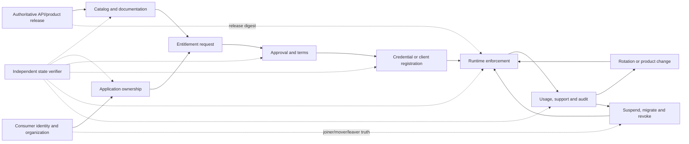
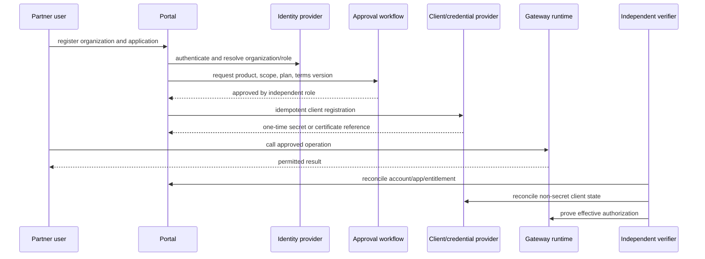

# Developer portal and API-product proof protocol

<!-- protocol-contract: decision-grade -->

## Purpose and evidence state

This protocol tests whether an exact portal/product variant can operate the complete consumer lifecycle described in the [developer portal and API-products study](../docs/30-developer-portal-api-products.md). It is a comparative experiment design, not a test result. Every candidate begins **not run**; screenshots, successful registration, or a vendor demonstration do not change that state.

The protocol uses the synthetic [RE-1 enterprise reference case](../docs/41-enterprise-reference-case.md), especially journey **J-03 partner payment initiation** and incident **I-03 certificate rollover and pinned trust**. Every count, duration, rate, threshold, workload value, or population below is a **scenario assumption**. Owners must ratify or replace these values before execution. Actual results belong in immutable run artifacts created from the [PoC result template](../templates/poc-result-template.md).

## Decision question

Can the proposed portal, catalog, product, identity, approval, credential, runtime-policy, support, and audit components keep one trustworthy consumer state from discovery through revocation across the exact gateway topology—without manual secret handling, orphaned access, or documentation/runtime drift?

The decision is not “which portal looks best.” It is whether the operating mechanism is safe, usable, automatable, observable, recoverable, and portable enough for the intended audience.

## Exact test objects

Create a separate run set for every deployable variant. Do not combine results under a vendor name.

| Variant family | Exact boundary that must be recorded |
|---|---|
| Kong | Konnect or self-managed edition; portal/catalog version; control-plane and data-plane topology; application-auth and dynamic-client-registration strategy; identity provider; licensed features |
| Azure API Management | Managed or self-hosted gateway; APIM instance/tier/region; developer portal build; product/subscription model; whether API Center participates; identity and workflow integrations |
| Apigee | X or hybrid; organization/environment topology; portal implementation; product/developer/AppGroup/app model; identity and approval integration |
| MuleSoft | Exchange/public portal or API Community Manager; API Manager instance and contract model; Runtime Fabric topology; client provider; SLA tier and entitlement |

For every run, record product, edition, version, support tier, region, topology, configuration commit, portal content commit, API description digest, identity configuration version, policy release, and all separately licensed components. If a vendor-operated dependency cannot be versioned, record its observed service version/date and the limitation.

## Lifecycle oracle

The independent verifier owns the expected lifecycle state; the portal under test is not its own oracle.

**Figure PT-1 — Portal fitness requires catalog, identity, ownership, entitlement, credential, runtime and offboarding state to reconcile.**

- **Depicted scope:** authoritative API/product release, catalog, identity/organization, application ownership, entitlement request/approval/terms, credential registration, runtime enforcement, usage/support/audit, rotation/product change, suspension/revocation and independent verification.
- **Excluded scope:** candidate-specific portal objects/UI, external legal workflow, credential secret values, detailed runtime policy, SLA thresholds and any observed lifecycle result.
- **Diagram source, evidence state and as-of:** inline lifecycle oracle derived from synthetic [RE-1](../docs/41-enterprise-reference-case.md) J-03 and this protocol's entity ledger; experiment design in `not run` state; 2026-08-17.
- **Accessible equivalent:** an authoritative release populates the catalog and runtime; identity establishes organization/application ownership; a request moves through independent approval and terms to client/credential registration and runtime enforcement. Usage/audit then feeds rotation or offboarding, while identity joiner/mover/leaver truth and a verifier reconcile catalog, ownership, approval, non-secret credential, runtime and usage state.

**Figure interpretation:** the experiment treats catalog content, identity, ownership, approval, credentials, runtime enforcement, analytics, and offboarding as separate state holders that must reconcile. A green portal screen does not prove runtime access, and a runtime denial does not prove the account, credential, audit, and consumer notification were closed correctly.

**Figure limitation:** The oracle does not prescribe one portal architecture or prove that every lifecycle transition can be automated. Manual-but-controlled steps, external systems, entitlement semantics and reconciliation timing remain candidate/organization evidence.

The verifier maintains a ledger with these minimum fields:

| Entity | Required identity and state |
|---|---|
| API release | immutable spec/content digest, product/package, environment, runtime configuration digest, owner, lifecycle state |
| consumer organization | synthetic legal entity ID, audience, eligibility, terms version, support tier, status |
| person or workload | pseudonymous subject, organization, role, identity state, last revalidation |
| application | durable application ID, at least two owners where permitted, environment, product, credential references, support contact |
| entitlement | requested product/operations/plan, requester, approver, decision, expiry, exception, audit ID |
| credential | non-secret reference, type, issuer, scope/product, issue/rotate/revoke timestamps, active state at runtime |
| journey event | correlation ID, lifecycle transition, source system, expected/actual state, retry ID, immutable evidence reference |

Never store a returned client secret, token, certificate private key, session cookie, or production-like personal data in the ledger or committed evidence.

## Scenario population

The following are **scenario assumptions**, not estate facts:

- 120 synthetic APIs: 55 internal, 35 partner, 20 public, and 10 machine-only;
- 24 synthetic partner organizations, including two with renamed domains and one merger;
- 180 synthetic users and 90 workload identities;
- 240 applications with single-owner, multi-owner, service-owned, dormant, duplicated-name, and orphan-risk cases;
- three environments with deliberately different endpoints and products;
- three terms versions, two SLA plans, two OAuth scopes, mTLS and API-key cases;
- a 30-day certificate overlap window, a 24-hour assumed planned-rotation completion objective, and a 5-minute assumed emergency compromised-credential runtime-denial objective;
- accessibility evaluation against the ratified enterprise standard; this protocol does not claim conformance.

The population generator must be deterministic from a committed seed. Candidate adapters translate the same logical entities into product-specific objects. Any unsupported object or semantic loss is recorded rather than silently simplified.

## Experiment sequence

### PT-01 — catalog fidelity and discovery

**Hypothesis:** eligible consumers discover one authoritative API release and cannot discover restricted or retired material.

1. Publish the same API description, business documentation, support metadata, ownership, lifecycle, environment, product, and deprecation state.
2. Seed deliberate collisions: duplicate display names, two major versions, one stale unmanaged entry, a private API with public-looking tags, and an API moved between owners.
3. Search as anonymous, internal, partner-A, partner-B, suspended, and administrator personas.
4. Compare visible entries and metadata with the authoritative release ledger.
5. change the runtime release without publishing docs, then publish docs without promoting runtime; verify drift detection in both directions.
6. retire one version while an application remains entitled; distinguish hidden, deprecated, blocked for new access, and runtime-revoked states.

**Required evidence:** deterministic inventory, persona visibility matrix, search results, missing/extra/duplicate report, content/spec/runtime digests, drift alert, and owner reconciliation.

**Pass condition:** zero unauthorized discoveries; zero unexplained missing authoritative entries; zero silent duplicate identity; every rendered endpoint/environment and product association matches the approved release; deliberate drift is detected within the ratified interval.

### PT-02 — partner onboarding and approval segregation

**Hypothesis:** J-03 onboarding preserves organization identity, eligibility, terms, least privilege, and dual control across retries and partial failure.

**Figure PT-2 — Correct partner onboarding crosses independently failing identity, workflow, credential and runtime boundaries.**

- **Depicted scope:** partner registration, identity/organization resolution, entitlement request, independent approval, idempotent client registration, one-time secret/certificate reference, authorized runtime call and independent reconciliation.
- **Excluded scope:** candidate UI details, actual identity/credential products, secret contents, contract/legal review, failure branches shown in prose and any observed onboarding result.
- **Diagram source, evidence state and as-of:** inline PT-02 sequence derived from RE-1 J-03 and this protocol's lifecycle oracle; synthetic experiment hypothesis in `not run` state; 2026-08-17.
- **Accessible equivalent:** the partner registers an organization/application; the portal resolves identity and role, submits product/scope/plan/terms to a separately authorized approver, then performs idempotent client registration. The partner invokes the gateway and an independent verifier reconciles account/application/entitlement, non-secret client state and effective runtime authorization.

**Figure interpretation:** a correct happy path crosses at least five independently failing components. The test injects failures after every state transition so retry cannot create duplicate organizations, applications, approvals, clients, or credentials.

**Figure limitation:** The happy-path sequence omits the injected failure branches and does not demonstrate segregation, idempotency or runtime convergence. The test record must show retries before/after each transition, unauthorized approval attempts and reconciliation results.

Test these branches:

- requester attempts self-approval and approval through an over-broad group;
- the same POST is retried before and after workflow completion;
- identity succeeds while workflow or portal response times out;
- client registration succeeds but the response carrying the secret is lost;
- terms change between request and approval;
- partner domain changes and two accounts need safe consolidation;
- application name collides across organizations;
- suspended user remains an application owner;
- approval is granted for sandbox but the credential is presented to production;
- a removed operation and scope are requested with a previously valid credential.

**Pass condition:** segregation holds; retries are idempotent or reconciled; secrets are not replayed or logged; every active runtime entitlement has an accountable organization/application/approval; denied requests produce sanitized, attributable reasons; exception access has owner and expiry.

### PT-03 — ownership, joiner/mover/leaver, and orphan control

Create applications owned by one person, a team, and an automation identity. Disable, rename, transfer, and delete identities in different orders. Remove the only human owner before and after adding a durable team. Merge two partner organizations. Delete the portal account while retaining an active application. Simulate the identity provider being unavailable during offboarding.

The verifier checks:

- whether the application has a durable accountable owner independent of a single login;
- who can view, rotate, revoke, transfer, or recover credentials;
- whether identity deprovisioning changes portal, workflow, and runtime access consistently;
- whether orphan detection is scheduled and evidence-producing;
- whether emergency runtime denial works when the portal or identity provider is unavailable; and
- whether later reconciliation explains every emergency action.

**Pass condition:** no active orphan access after the ratified reconciliation interval; ownership transfer is audited; emergency denial is independent of the failing portal path; restoring identity connectivity does not reactivate revoked access.

### PT-04 — credential rotation and I-03 trust rollover

Exercise API key pairs, OAuth client credentials/dynamic registration, and mTLS only where the proposed architecture uses them. For every method:

1. issue the original credential and prove least-privilege runtime access;
2. introduce a second credential or trust chain with bounded overlap;
3. run old and new clients, including cached tokens and reused TLS connections;
4. restart one runtime and delay configuration propagation to another;
5. revoke the old material and attempt calls at every runtime/region;
6. simulate lost secret display, duplicated rotation request, failed client-provider response, and rollback;
7. search portal, logs, traces, analytics, support exports, browser storage, and committed evidence for prohibited values.

**Pass condition:** new material is usable before old material is removed; old material is rejected everywhere within the ratified objective; stale runtime/configuration is visible and cannot receive protected traffic; no prohibited secret occurrence exists; rotation remains attributable to an approved actor and application.

### PT-05 — product mutation, notification, and runtime truth

Under steady synthetic traffic, perform these changes separately: add an operation; remove an operation; change scope; lower quota; change approval mode; replace terms; move an API between products; deprecate a version; and suspend one organization.

Record whether each change affects existing and new entitlements, when it becomes effective at every runtime, what the consumer sees, which notification is generated, whether active contracts are grandfathered, and how rollback behaves. The portal label is compared with actual runtime calls rather than accepted as truth.

**Abort:** a high-risk removal or scope expansion occurs without the required approval; a portal-only action is represented as runtime revoke; different regions enforce materially different entitlement without visible stale state.

### PT-06 — accessibility, task completion, and support

Run task-based sessions with representative internal, partner, public, and machine-consumer personas, including keyboard-only and approved assistive-technology coverage. Tasks are discover, compare versions, request access, understand denial, retrieve a credential safely, make a first call, add an owner, rotate, diagnose a quota/policy error, find support, and offboard.

Measures are defined before execution:

- task success without facilitator rescue;
- critical error and abandonment;
- time-on-task distribution, excluding identity provisioning delay where separately measured;
- accessibility defect severity and affected task;
- comprehension of environment, product, scope, quota, expiry, and secret-handling guidance;
- support case correlation from consumer-facing error to application/product/release without exposing secrets.

No universal numeric usability threshold is invented here. Product, accessibility, security, and support owners ratify thresholds and participant mix before seeing candidate results.

### PT-07 — outage, recovery, audit, and exit

Test portal outage, workflow outage, identity outage, client-provider outage, control-plane isolation, audit-export outage, and partial regional runtime staleness. Existing approved calls should follow the architecture’s declared behavior; new approvals, rotations, and revocations must fail safely or use an approved break-glass path.

Then export and rebuild in an empty test environment:

- portal navigation and content;
- API/product/package definitions;
- audience and visibility rules;
- non-secret organization, application, entitlement, and credential references;
- workflow bindings and role mappings;
- release/spec/content digests; and
- audit references and lifecycle history permitted by retention policy.

Document intentionally non-exportable state and the consumer re-enrollment plan. A proprietary secret not being exportable is expected; an unowned inventory or undocumented runtime entitlement is not.

## Fault-injection matrix

| Injection point | Required observation | Unsafe outcome |
|---|---|---|
| identity callback timeout | account/application creation and retry state | duplicate identity or authorization bypass |
| approval event duplicated or reordered | idempotent decision and immutable audit | two contradictory active decisions |
| client provider succeeds, portal response fails | reconciliation without secret replay | orphaned credential or secret in log |
| product/config delivery delayed to one runtime | effective release visible per runtime | stale runtime silently serves expanded access |
| portal unavailable during compromise | emergency runtime deny and later reconciliation | revoke impossible because UI is down |
| audit/SIEM export blocked | local durable audit and gap declaration | change proceeds with no reconstructable actor |
| region fails during rotation | old/new acceptance by cohort and recovery | permanent split credential state |
| terms or API version changes mid-request | deterministic version binding | approval to unintended terms/release |

## Evidence bundle

Each test produces:

1. signed run manifest and source/configuration digests;
2. exact variant/topology/entitlement and dependency inventory;
3. deterministic synthetic population seed and expected-state ledger;
4. sanitized event timeline with correlation and audit IDs;
5. portal/API/runtime exports and reconciliation diff;
6. runtime positive/negative call results for every entitlement transition;
7. accessibility and task findings with participant assumptions;
8. secret-scan report covering all captured stores;
9. fault schedule, observed recovery, operator actions, and unresolved gaps;
10. result record mapped to evaluation criteria, reviewer role, limitation, and disposition.

Screenshots may illustrate a finding but never replace the machine-readable state, runtime calls, audit trail, or reconciliation.

## Comparative interpretation

Score the exact variant only after the evidence bundle passes completeness review. Report:

- lifecycle stages demonstrated and stages not run;
- unsafe or manual state transitions;
- custom components required, their SLO/support owner, and failure behavior;
- portal task outcomes separately from runtime-control outcomes;
- one-time and recurring operating work;
- export/rebuild loss and consumer re-enrollment burden; and
- critical non-fit findings.

Do not aggregate unknown or not-run stages into a positive “portal capability” score. A candidate with a simpler user interface may be stronger if it preserves authoritative state and controlled automation; a richer portal may be stronger if it replaces risky custom workflow. The evidence, not surface area, decides.

## Gate and ownership

The API Product and Security Review may accept the portal/product variant only when:

- all mandatory lifecycle and runtime-truth tests are independently reviewed;
- no unmitigated critical authorization, secret, orphan, accessibility, or recovery finding remains;
- every custom component has an accountable owner, support model, SLO, capacity, and exit treatment;
- unknown/not-run coverage is explicitly below the approved decision threshold; and
- the result is linked from the evaluation record without converting scenario assumptions into observed facts.

Suggested accountable roles are API product lead for lifecycle, security for identity/credential controls, platform engineering for automation/runtime truth, accessibility lead for inclusive task coverage, support operations for incident journey, and an independent architecture/risk reviewer for gate acceptance.
