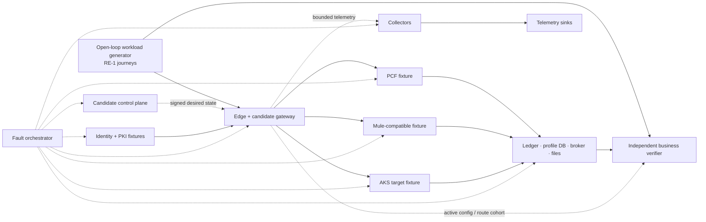
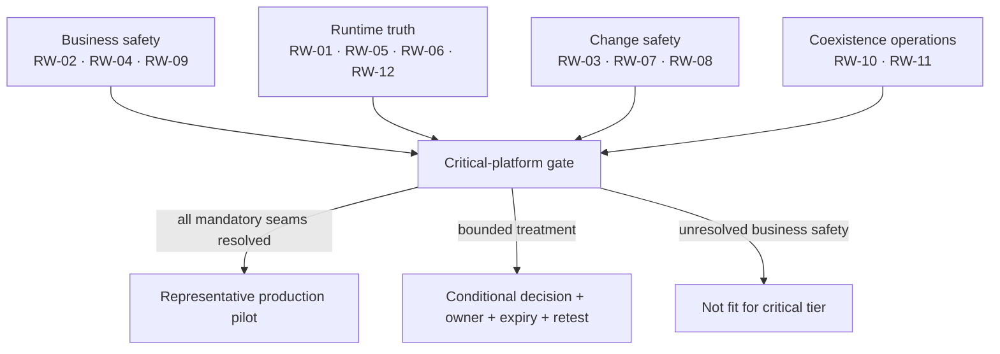
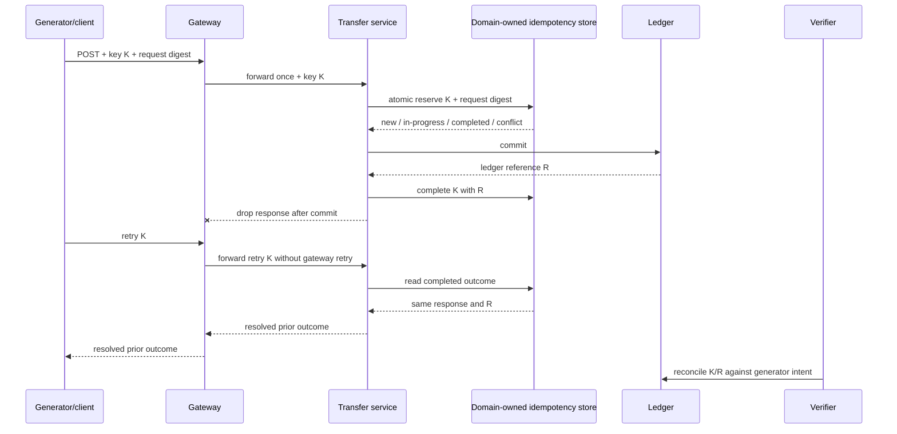

# Real-world PoC scenario portfolio

<!-- protocol-contract: decision-grade -->

## Purpose

This portfolio turns the synthetic [RE-1 enterprise reference case](../docs/41-enterprise-reference-case.md) into repeatable comparative experiments. It complements the repository’s component tests by asking whether a platform preserves business correctness and operational control when several layers fail or change together.

This is a protocol, not an observed result set. Every candidate/scenario combination begins **not run** until its immutable evidence bundle and independent review are recorded.

The scenarios support these studies:

- [performance, capacity, and resilience](../docs/32-performance-resilience.md);
- [federated operating model](../docs/33-operating-model.md);
- [PCF-to-AKS consolidation](../docs/34-pcf-aks-consolidation.md);
- [Mule migration strategy](../docs/35-mule-migration-strategy.md).

> **Quantitative convention:** every traffic rate, count, percentage, duration, threshold, payload, service objective, capacity value, and cost in this portfolio is a **RE-1 scenario assumption**. None is observed test evidence, a benchmark, a vendor claim, or a commitment. Scenario and journey IDs are identifiers rather than quantities. Store actual results in immutable run artifacts; do not rewrite scenario assumptions to look like achieved results.

## Experiment contract

Each candidate receives the same logical topology, policy chain, workload corpus, dependency behavior, failure schedule, tuning opportunity, and result schema. Product-specific implementation is allowed, but any deviation is declared before interpretation.

**Figure POC-RW-1 — Every candidate is tested inside the same faultable system with independent business and configuration truth.**

- **Depicted scope:** open-loop generator, candidate edge/gateway/control plane, PCF/Mule/AKS fixtures, authoritative systems, identity/PKI, bounded telemetry, fault orchestration and independent verification.
- **Excluded scope:** candidate-specific topology/adapters, exact versions and capacities, commercial/support boundary, data-replication design, detailed fault schedule and any executed result.
- **Diagram source, evidence state and as-of:** inline protocol topology derived from synthetic [RE-1](../docs/41-enterprise-reference-case.md) journeys and incidents; experiment design in `not run` state, not observed evidence; 2026-08-17.
- **Accessible equivalent:** the generator sends the same RE-1 journeys through each candidate gateway to PCF, Mule-compatible and AKS fixtures backed by ledger/profile/broker/file truth. The control plane supplies signed desired state; identity/PKI supplies trust; telemetry uses collectors/sinks; the fault orchestrator can isolate every major component. A verifier reconciles generator intent, authoritative outcomes and active gateway configuration.

**Figure interpretation:** POC-RW-1 makes candidate-gateway health subordinate to independently reconciled business outcome, active configuration and offered load. Equivalent topology and declared deviations are prerequisites for comparative interpretation.

**Figure limitation:** The logical harness does not guarantee equivalent product implementation or representative enterprise dependencies. Exact topology, adapter behavior, environment versions and run artifacts must be recorded for every candidate/scenario execution.

### Required run record

Every run captures:

- hypothesis, steady state, injection, blast radius, safety/abort, recovery, cleanup, and validity decision;
- immutable source, container, policy, API description, route, certificate, test-data, and infrastructure versions;
- topology, replica placement, node/instance capacity, quotas, support tier, and cost-model inputs;
- offered versus completed load, latency distribution, response class, saturation, queues, retries, and shedding by journey;
- business request, idempotency key, outcome, ledger reference, data version, event ID/offset, file checksum, and reconciliation status;
- approved desired configuration and the active epoch/digest on every serving replica;
- operator actions and elapsed decision/recovery stages;
- missing or suspect instrumentation and whether it invalidates the run;
- scenario-assumption disposition: met, conditionally met, not met, or indeterminate.

## Workload fixtures

**All fixture sizes and values are scenario assumptions.**

| Fixture | Assumed behavior | Fault controls | Business truth exposed to verifier |
|---|---|---|---|
| transfer engine | commit by business key; response can be delayed or dropped after commit | latency, error, connection reset, region role | immutable ledger reference and final status |
| profile service | optimistic version; transactional outbox | schema version, write conflict, replication lag | row version, canonical profile, outbox record |
| identity issuer | OAuth tokens and rotating signing keys | slow discovery/JWKS, unknown key, clock skew, outage | token claims, key epoch, issuance/revocation record |
| partner mTLS client set | 24 clients with mixed trust and connection reuse | pinned intermediate, old/new chain, expired cert | handshake and API result by partner |
| broker | ordered partitions, duplicates, retry and DLQ | lag, unavailable partition, out-of-order replay | event ID, partition, offset, consumer outcome |
| SFTP/file source | manifest/checksum plus partial and duplicate files | slow upload, rename failure, duplicate pickup | file journal and record totals |
| telemetry sinks | traces, metrics, logs, and separate audit fixture | slow, refusal, full queue, complete outage | accepted, dropped, spooled and reconstructed counts |

## Scenario coverage

| Scenario | Primary RE-1 journey/incident | Failure seam | Mandatory decision use |
|---|---|---|---|
| RW-01 | J-06 / I-02 | partial control-plane loss and stale config | platform resilience and configuration truth |
| RW-02 | J-01/J-03 / I-01 | non-idempotent transfer with ambiguous commit | critical-tier eligibility |
| RW-03 | J-03 / I-03 | certificate and trust rollover | partner production readiness |
| RW-04 | J-01/J-02 / I-06 | regional failover with data lag | RTO/RPO and DR architecture |
| RW-05 | J-01/J-02/J-04 / I-04 | noisy neighbour and priority inversion | tenancy and capacity model |
| RW-06 | all journeys / I-05 | telemetry backpressure | observability architecture and audit policy |
| RW-07 | J-02/J-05 / I-07 | schema and semantic drift | API/event governance gate |
| RW-08 | J-02/J-04 / I-08 | PCF-to-AKS cohort routing and data rollback | consolidation factory gate |
| RW-09 | J-05 / I-01/I-08 | Mule queue/Object Store/file state migration | Mule pattern acceptance |
| RW-10 | J-03/J-05 | mixed Mule/PCF/AKS coexistence | cross-runtime operations and ownership |
| RW-11 | J-01/J-03 | identity issuer degradation and key rollover | fail-open/fail-closed design |
| RW-12 | all journeys | zone loss plus surge and downstream slowdown | capacity and cost decision |

**Figure POC-RW-2 — Critical-platform eligibility requires business-safety, runtime-truth, change-safety and coexistence seams to be resolved.**

- **Depicted scope:** grouping of RW-01 through RW-12 into four gate inputs and the resulting pilot, conditional-treatment or critical-tier non-fit branches.
- **Excluded scope:** scenario weights/scores, detailed abort criteria, candidate outcomes, exception authority, production scope and evidence that every scenario is mandatory for every workload.
- **Diagram source, evidence state and as-of:** inline protocol-gate synthesis from the preceding scenario-coverage table and RE-1 decision contract; planned decision logic with every candidate/scenario initially `not run`; 2026-08-17.
- **Accessible equivalent:** business-safety scenarios RW-02/04/09, runtime-truth scenarios RW-01/05/06/12, change-safety scenarios RW-03/07/08 and coexistence scenarios RW-10/11 all feed the critical-platform gate. Resolved mandatory seams permit a representative pilot; a bounded treatment requires owner, expiry and retest; unresolved business safety is non-fit for the critical tier.

**Figure interpretation:** POC-RW-2 prevents a single aggregate platform score from hiding an unresolved business, runtime, change or coexistence seam; production scope is gated before preference scoring.

**Figure limitation:** The grouping is a coverage map, not the complete pass/fail rule. Applicability, scenario-level aborts, evidence validity, exception authority and criticality are governed by the detailed protocols and ratified decision contract.

## RW-01 — partial control-plane outage and stale configuration

**Hypothesis:** already-running data planes can process approved routes during management-path loss, but a restarted or newly scaled replica cannot serve traffic until it proves the current approved configuration epoch.

**Scenario assumptions:** ordinary offered load is 4,800 requests/s; the management path is unavailable for 45 min; configuration N+1 changes one route and revokes one test credential; stale detection must occur within 2 min.

**Procedure:**

- establish J-01/J-02 steady state and record approved epoch N on every replica;
- isolate only management connectivity, preserving request and backend paths;
- submit N+1 and confirm that the control operation is rejected, queued, or explicitly unresolved—never falsely reported as active;
- restart one existing replica and request an additional replica while disconnected;
- restore connectivity, publish N+1, then delay delivery to one replica;
- attempt traffic against each replica and observe readiness, route behavior, credential revocation, config digest, and reconciliation.

**Abort:** a replica with an unapproved/stale digest receives production traffic; privileged change lacks audit; J-01 writes occur with unknown policy state.

**Reconciliation:** approved changes equal control-plane history; every serving replica reports N+1; the test credential is rejected everywhere; no request was routed through a stale policy.

**Decision artifact:** a truth table for existing traffic, restart, scale-out, configuration, certificate/license, telemetry, and reconnect—not a single “works disconnected” answer.

## RW-02 — ambiguous money transfer and duplicate retry

**Hypothesis:** a lost response after ledger commit yields one durable transfer outcome, and retry/status/reconciliation can resolve it without a second transfer.

**Scenario assumptions:** J-01 load is 528 requests/s at ordinary mix; fault targets 200 requests; idempotency retention is 7 days; unresolved in-progress keys are reconciled within 5 min.

**Figure POC-RW-3 — A lost transfer response is resolved by the domain's durable outcome state, not automatic gateway retry.**

- **Depicted scope:** keyed client request, gateway forwarding, domain idempotency reservation/conflict state, ledger commitment, stored outcome, lost response, same-key client retry and verifier-to-ledger reconciliation.
- **Excluded scope:** product-specific idempotency storage, atomicity across ledger/event systems, regional replication, compensation, exact timeout/retention values and any observed pass result.
- **Diagram source, evidence state and as-of:** inline RW-02 sequence derived from RE-1 J-01/I-01 and [RFC 9110](https://www.rfc-editor.org/rfc/rfc9110.html); synthetic experiment oracle in `not run` state; 2026-08-17.
- **Accessible equivalent:** the gateway forwards key K once to the transfer service. The domain atomically reserves K and its request digest, commits the ledger and completes K with reference R. After a lost response, the gateway forwards the client's same-key retry without creating an independent retry; the domain returns the stored result, and the verifier reconciles K/R against generator intent.

**Figure interpretation:** the transfer domain—not the API-management layer—owns the atomic reservation, durable outcome, conflict decision, and ledger reconciliation. The gateway forwards the business key and a client retry but is configured not to manufacture a second domain attempt through automatic POST retry.

**Figure limitation:** The sequence is a required oracle, not proof of atomicity or exactly-once delivery. Store partitions, concurrent requests, region changes, post-ledger/pre-outcome failure and reconciliation timeout must be injected and evaluated against raw business evidence.

**Variants:** same key/same request; same key/different amount; retry in another region; store unavailable before reserve; store unavailable after ledger commit; response loss before and after commit; route rollback during in-progress state.

**Abort:** blind automatic POST retry; more than one ledger outcome per key; target accepts write without idempotency protection; reconciliation cannot distinguish uncommitted from committed-but-unanswered.

**Reconciliation:** generator intents = rejected-before-acceptance + exactly-one committed outcomes + controlled unresolved exceptions. Gateway success counts alone are not accepted.

[RFC 9110](https://www.rfc-editor.org/rfc/rfc9110.html) defines HTTP idempotence and cautions against automatic retry of non-idempotent methods without safe semantics. The business design, values, and outcome rules remain scenario assumptions.

## RW-03 — certificate rollover with mixed partner trust

**Hypothesis:** the platform can introduce a new leaf/intermediate chain without breaking clients that pin or cache prior trust, and can prove which chain each serving process presents.

**Scenario assumptions:** 24 synthetic partners; 4 pin the old intermediate; 8 reuse TLS connections for 30 min; overlap window is 30 days; canary begins with 1 partner and 1% of partner traffic.

**Procedure:** issue the new chain; update trust where required; deploy to one serving cohort; open new and reused connections; rotate backend client certificates too; restart one replica; verify actual served chain, SAN, key use, expiry, trust path, OCSP/revocation behavior where applicable, process reload, and partner API outcome; remove old trust only after the assumed overlap gate.

**Edge cases:** Secret changed but process did not reload; `subPath` mount retained old material; one replica serves old chain; intermediate omitted; regional failover serves a different chain; connection pool masks new handshake; clock skew crosses validity boundary.

**Abort:** production cohort authentication failure exceeds assumed 1%; the platform cannot identify the certificate served by replica/cohort; old trust is removed before all partners prove new trust.

Kubernetes describes eventual Secret projection and notes that `subPath` mounts do not receive automated updates ([Kubernetes Secrets](https://kubernetes.io/docs/concepts/configuration/secret/)); cert-manager describes renewal and Secret issuance behavior ([Certificate resource](https://cert-manager.io/docs/usage/certificate/)). Issuance is not treated as proof of serving.

## RW-04 — regional failover with replication outside the write gate

**Hypothesis:** routing uses data readiness and writer authority, not HTTP health alone. Critical reads can degrade explicitly while money movement remains closed if RPO cannot be honored.

**Scenario assumptions:** primary-region loss occurs at 13,500 requests/s; warm region starts with 65% busy-hour capacity and reaches full assumed capacity within 20 min; J-01 assumed RTO is 5 min and RPO is zero after commitment; one variant injects 12 min of profile-data lag.

**Procedure:** establish primary writer epoch and active config digest; create transfers with dropped responses; isolate the region; expose a healthy secondary HTTP endpoint before data is ready; evaluate automatic/manual routing; promote permitted services; resolve identity and broker roles; later restore the primary and perform controlled failback.

**Abort:** both regions accept authoritative writes; money-movement traffic shifts while data authority is unknown; idempotency outcomes diverge; optional load starves critical journeys.

**Reconciliation:** compare generator intentions, idempotency records, ledger outcomes, profile versions, event partitions/offsets, audit sequences, and active config epochs across regions. Failover ends only when totals close and authority is singular.

Microsoft documents that AKS clusters are regional and describes [multi-region deployment models](https://learn.microsoft.com/en-us/azure/aks/reliability-multi-region-deployment-models); this experiment supplies the business/data gates the infrastructure pattern alone cannot provide.

## RW-05 — noisy neighbour and priority inversion

**Hypothesis:** J-04 document processing and batch replay can saturate their allocation without violating J-01/J-02 objectives or exhausting shared gateway/backend connection pools.

**Scenario assumptions:** J-04 sends 1.5 MB p99 payloads; transform workers consume 8 vCPU each; batch replay adds 3,000 messages/s; J-01/J-02 remain at busy-hour mix; critical node/worker pools retain 30% post-zone-loss headroom.

**Procedure:** share a cluster under the candidate’s recommended tenancy; drive onboarding CPU/memory, broker replay, and telemetry volume together; remove the busiest zone; observe pod placement, throttling, eviction, gateway workers, counter store, connection pools, dependency queue, tail latency, and load shedding.

**Abort:** critical pods evict; onboarding consumes critical dependency connections; admission accepts unfinishable work; J-01/J-02 p99 breach persists for an assumed 5 min.

**Decision artifact:** capacity isolation map by node pool, namespace, priority, worker pool, connection pool, counter/idempotency store, and downstream dependency. Aggregate cluster CPU is not sufficient.

Kubernetes documents the limits of disruption budgets and the need to reason about voluntary and involuntary disruption ([Kubernetes disruptions](https://kubernetes.io/docs/concepts/workloads/pods/disruptions/)).

## RW-06 — telemetry backpressure without request-path collapse

**Hypothesis:** a slow or unavailable telemetry backend causes bounded sampling/spooling/shedding with a declared gap, while request service and durable business/security audit remain protected.

**Scenario assumptions:** ordinary traffic for 20 min, exporter latency rises to 8 s, then all sinks reject for 30 min; in-memory request-process telemetry buffer is bounded to 256 MB; security audit has a separate durable path; trace sampling can fall to 1% under pressure.

**Procedure:** slow one exporter, fill its sending queue, reject all exports, then recover with limited sink rate. Observe queue capacity/size, enqueue failures, send failures, receiver refusals, CPU/memory/disk, request latency, audit durability, sampled/dropped counts, recovery drain, and duplicate exports.

**Abort:** exporter call blocks request workers; unbounded memory growth; security audit is dropped under the general log policy; recovery flood breaks the sink or application.

**Reconciliation:** accepted telemetry = exported + deliberately sampled/dropped + spooled + declared unexplained gap. Audit sequence must close independently.

The OpenTelemetry Collector publishes queue and export failure signals in its [internal telemetry documentation](https://opentelemetry.io/docs/collector/internal-telemetry/). The sizes and loss policy here remain scenario assumptions.

## RW-07 — syntactically valid but semantically breaking schema drift

**Hypothesis:** delivery controls permit compatible evolution and stop semantic breaks before PCF, Mule, AKS, or a partner silently changes business meaning.

**Scenario assumptions:** corpus contains 2,000 API examples and 10,000 events; target comparison allows zero unexplained critical-field differences; DLQ guardrail is 0.1% for compatible unknown values and zero silent default mapping.

| Mutation | Expected mechanism | Business verifier |
|---|---|---|
| add optional field | old consumers ignore or tolerate; target preserves it if proxying | response/event semantic diff |
| add unknown enum | consumer executes explicit unknown path | no default payment/customer classification |
| absent becomes null | patch presence semantics remain unchanged | database field and version |
| decimal scale changes | contract gate rejects or approved canonical rule applies | exact business amount and ledger value |
| local time becomes UTC | explicit mapping and business-date test | settlement date/cutoff |
| error code renamed with same HTTP status | consumer contract detects change | retry and customer-message decision |
| duplicate/out-of-order event | consumer deduplicates and versions state | aggregate version and side-effect count |

**Abort:** valid OpenAPI/schema is treated as sufficient despite semantic difference; broad normalization hides a critical field; DLQ has no owner/replay rule.

The [OpenAPI Specification](https://spec.openapis.org/oas/latest.html) defines the interface-description mechanism. Compatibility and semantic gates are RE-1 controls, not claims made by the specification.

## RW-08 — PCF-to-AKS stateful cohort cutover

**Hypothesis:** a stable API route can shift a single-writer customer-profile workload from PCF to AKS by cohort, preserve database/outbox semantics, and route back without destructive schema rollback.

**Scenario assumptions:** workload is PCF-PROFILE-07; progressive cohorts are 1/5/25/50/100%; holds are 30 min, 2 h, 8 h, 24 h, and 7 days; PCF remains rollback-compatible for 45 days.

**Procedure:** baseline PCF semantics; apply expand-only schema; deploy AKS dark; shadow safe reads; route one deterministic customer cohort to AKS as sole writer; compare row versions, outbox events, CRM results, errors and latency; inject AKS node failure and database conflict; advance cohorts; then trigger rollback after new writes.

**Abort:** PCF and AKS write the same customer key concurrently; rollback code cannot read expanded schema; outbox and database commit diverge; route cohort cannot be reconstructed.

**Reconciliation:** for every accepted update, exactly one final row version and one event intent; CRM outcomes match outbox events; in-flight requests are resolved before declaring rollback complete.

Cloud Foundry documents route mapping and warns that mapping multiple apps to one route can produce undesirable random routing in some cases ([routes and domains](https://docs.cloudfoundry.org/devguide/deploy-apps/routes-domains.html)). The experiment uses explicit deterministic cohort routing; weighted backend routing is described by [Kubernetes Gateway API](https://gateway-api.sigs.k8s.io/guides/user-guides/traffic-splitting/).

## RW-09 — Mule Object Store, queue, and SFTP ownership transfer

**Hypothesis:** a settlement workload moves without resetting watermarks, losing in-flight messages, or allowing Mule and the target scheduler to process the same file.

**Scenario assumptions:** 3 input files contain 10,000 records each; one is uploaded partially, one is duplicated with the same checksum, and one contains 50 poison records; Object Store has 18,000 processed IDs and 240 in-progress entries; recovery objective is 2 h with zero accepted-record loss.

**Procedure:** classify Object Store keys as watermark/idempotency/outcome; capture broker offsets; stop/fence the Mule poller; transfer authoritative state with TTL origin and request digest; start target poller; inject target failure after claim and before archive; replay poison records under approval; roll route/scheduler ownership back once.

**Abort:** both pollers own the directory; watermark resets to “now”; completed IDs are lost; in-progress entries are blindly replayed; file is archived before record journal closes.

**Reconciliation:** source manifest/record total = committed records + deterministic rejects + controlled exceptions; file checksum maps to one journal lineage; broker offsets and idempotency state have no unexplained gaps.

MuleSoft documents shared Object Store and VM queue behavior for clustered runtimes in its [HA cluster overview](https://docs.mulesoft.com/mule-runtime/latest/mule-high-availability-ha-clusters). The actual source topology must be recorded for the run.

## RW-10 — mixed Mule/PCF/AKS incident and rollback

**Hypothesis:** operators can identify consumer impact, active route/config, runtime cohort, data authority, and safe rollback when one journey crosses all three runtimes.

**Scenario assumptions:** J-03 enters through the gateway, uses a Mule partner transform, calls an AKS orchestration service, reads a PCF profile service, then commits to the transfer fixture; dependency latency increases for 15 min while one config replica is stale.

**Procedure:** inject the dependency slowdown and stale route together; trigger a deployment of the AKS service; make the telemetry sink slow; page from journey burn rate; have the designated incident roles diagnose and choose containment; measure whether route, code, config, data, and message actions are distinguished.

**Abort:** two teams independently shift traffic; rollback creates a synchronous call cycle; incident action loses business identity or writer authority; there is no single incident commander.

**Decision artifact:** cross-runtime incident timeline, ownership handoffs, operator commands, configuration/data truth, communication decision, and reconciliation closure. A collection of component screenshots is not sufficient.

## RW-11 — identity degradation and signing-key rollover

**Hypothesis:** issuer slowness, discovery/JWKS outage, and signing-key rotation have explicit bounded behavior by journey and tenant, without global fail-open or one tenant blocking all others.

**Scenario assumptions:** 8 issuers; signing-key overlap is 15 min; gateway key-cache maximum age is 10 min for critical APIs; high-risk writes fail closed when assurance cannot be established; read-only degradation is permitted for 5 min under a documented cached-key policy.

**Variants:** unknown key ID; rotated key with stale cache; old token within validity but key removed early; issuer discovery slow; one tenant issuer unavailable; clock skew; token audience/issuer confusion; control-plane disconnect during rollover.

**Abort:** signature bypass/fail-open; a token from one issuer/tenant is accepted for another; all tenants fail because one issuer stalls; cached keys persist beyond the assumed exposure rule without alarm.

The security mechanism is informed by [OAuth security best current practice](https://www.rfc-editor.org/rfc/rfc9700.html) and [OAuth mutual-TLS client authentication](https://www.rfc-editor.org/rfc/rfc8705.html). Case policies and timings remain assumptions.

## RW-12 — surge, zone loss, slow backend, and unit economics

**Hypothesis:** the platform sustains the RE-1 busy-hour workload, then contains a short surge plus one-zone loss and backend slowdown without unsafe retry amplification or hidden cost.

**Scenario assumptions:** ordinary load is 4,800 requests/s; busy hour is 13,500 requests/s for 90 min; burst is 22,000 requests/s for 3 min; busiest zone is removed at burst start; ledger p95 rises to 1,200 ms; remaining critical capacity retains 30% headroom after recovery.

**Procedure:** run identical policy and telemetry chains; remove the zone; slow the ledger; observe offered/completed load, journey latency, queues, retries, shedding, counters, idempotency store, autoscale, new-node readiness, image/DNS/control-plane dependencies, and cost allocation; recover the backend and zone while controlling queue drain.

**Abort:** retry multiplier exceeds the assumed 1.2× guardrail; queue has no bound; J-01 duplicate protection becomes unavailable while writes continue; new replicas serve stale config; cost model omits failover capacity or support.

**Economic record:** fixed and variable runtime, support, license, telemetry, network, durable state, operator time, and reconciliation effort. Report cost per successful business outcome at ordinary, peak, and degraded states—not cost per accepted gateway request.

## Atomic scenario gates

Every candidate × scenario cell is a mandatory eligibility decision for the production scope to which that scenario applies. The independent reviewer records exactly one state:

- `pass`: the run is valid, no abort condition occurred, every stated reconciliation closed, and the required artifacts support the conclusion;
- `fail`: any abort condition occurred, a required outcome/reconciliation did not close, or the claimed mechanism was absent;
- `indeterminate`: workload validity, instrumentation, artifact integrity, environment fidelity, or repetition is insufficient to decide; this is a hold, not a partial pass;
- `not-applicable`: approved **before execution** with an architecture reason and explicit excluded production scope. Product inconvenience or missing capability is not a reason to remove a scenario.

A treatment plan does not turn `fail` or `indeterminate` into `pass`. It may narrow the claimed production scope only when the decision authority accepts the exclusion, owner, expiry, compensating control and retest. Every applicable row must pass before a preference score is calculated.

| Atomic gate | Pass condition after protocol validity | Deterministic fail/hold condition | Decision scope blocked |
|---|---|---|---|
| RW-01 configuration truth | every serving replica proves approved epoch; revoked credential is denied; restart/scale/reconnect reconcile | any stale/unknown replica serves, audit is absent, or active state cannot be established | disconnected operations and critical runtime |
| RW-02 transfer correctness | one durable outcome per key; conflict/in-progress/prior outcome and totals reconcile | any blind POST retry, duplicate, lost outcome, or unresolved commit ambiguity | J-01/J-03 and any non-idempotent write |
| RW-03 trust rollover | served chains and client outcomes prove bounded overlap, reload, canary and rollback | authentication exceeds abort threshold, served material is unknowable, or old trust is removed early | partner mTLS and certificate rotation |
| RW-04 regional authority | one writer, data readiness, RTO/RPO and ambiguous outcomes reconcile through failback | dual writers, premature route, divergent outcome store, or unresolved authority | critical multi-region service |
| RW-05 isolation | critical journeys remain inside approved objectives through contention and zone loss | critical eviction/starvation, unbounded shared dependency, or sustained J-01/J-02 breach | claimed multi-tenant/critical capacity tier |
| RW-06 telemetry containment | request path remains protected; queues/loss are bounded and declared; security audit closes | exporter blocks requests, memory is unbounded, audit is dropped, or recovery flood is unsafe | production observability and audit operation |
| RW-07 semantic compatibility | every critical semantic mutation is stopped or handled with exact business parity | syntax-only approval, silent critical normalization/default, or ownerless DLQ/replay | contract evolution and migration factory |
| RW-08 PCF/AKS reversibility | single writer, row/outbox parity, cohort identity and rollback reconciliation close | concurrent writers, incompatible rollback, commit/outbox divergence, or lost cohort | PCF-to-AKS stateful pattern |
| RW-09 Mule state transfer | one scheduler/poller authority; watermarks, IDs, offsets, file journals and totals close | dual ownership, reset/lost state, blind replay, or premature archive | Mule queue/Object Store/file pattern |
| RW-10 cross-runtime operations | one incident command resolves route/config/runtime/data/message actions and business totals | conflicting traffic actions, call cycle, lost authority/identity, or no commander | mixed-runtime production support |
| RW-11 identity degradation | tenant/issuer boundaries, cached-key exposure and high-risk fail-closed behavior remain explicit and bounded | fail-open, cross-tenant acceptance, global coupling, or cache beyond rule without alarm | OAuth/OIDC critical and multi-tenant use |
| RW-12 degraded capacity/economics | offered load, one-zone loss, slow dependency, safe shedding, recovery and full cost record satisfy approved objectives | retry amplification, unbounded queue, writes without duplicate protection, stale scale-out, or omitted failover/support cost | claimed throughput, resilience and unit economics |

## Comparative scorecard

No aggregate score can override, offset or hide a failed or indeterminate applicable scenario. The scorecard is a **secondary preference view generated only after all 12 atomic rows are pass or pre-approved not-applicable for the exact claimed scope**. A candidate with one unresolved gate is reported as `ineligible / evidence hold`, not assigned a lower weighted score.

**All weights and thresholds below are scenario assumptions.**

| Dimension | Assumed weight | Mandatory floor | Source scenarios |
|---|---:|---:|---|
| business correctness and reconciliation | 25% | 4 of 5 | RW-02, RW-04, RW-07, RW-08, RW-09 |
| runtime/control resilience | 20% | 3 of 5 | RW-01, RW-04, RW-05, RW-12 |
| identity and cryptographic operations | 15% | 4 of 5 | RW-03, RW-11 |
| migration reversibility | 15% | 4 of 5 | RW-08, RW-09, RW-10 |
| observability and operability | 15% | 3 of 5 | RW-01, RW-06, RW-10 |
| capacity and unit economics | 10% | 3 of 5 | RW-05, RW-12 |

### Deterministic secondary rubric

For an eligible candidate, reviewers map each dimension from the approved measures and repetitions—never from narrative impression:

| Score | Required interpretation |
|---:|---|
| 0 | Not used in an eligible scorecard: an applicable atomic gate failed |
| 1 | Not used in an eligible scorecard: severe defect or unsafe/manual-only recovery |
| 2 | Not used in an eligible scorecard: approved threshold missed or material condition unresolved |
| 3 | Every source scenario passes at the minimum approved threshold, with repeatable artifacts and no undisclosed deviation |
| 4 | Score 3 plus material margin under the approved worst-case repetition and no routine operator heroics |
| 5 | Score 4 plus margin across approved sensitivity cases, independent repeat and demonstrated simpler/faster/cost-lower outcome on the same test contract |

The result bundle records the scenario measures that produced each dimension score, the mapping calculation and the independent reviewer. A **conditional scope** identifies the exact excluded workload, treatment owner, funded action, expiry and retest; until the exclusion is approved, the scenario remains `fail` or `indeterminate`. An indeterminate run is never scored optimistically.

## Exit gates

| Gate | Required outcome | Automatic hold |
|---|---|---|
| POC-G0 validity | offered load, business truth, and platform signals reconcile; no material instrumentation gap | coordinated omission or unverifiable outcome |
| POC-G1 atomic eligibility | every applicable RW-01…RW-12 row is `pass`; every `not-applicable` row has prior decision authority and excluded scope | any applicable `fail` or `indeterminate` row, regardless of weighted total |
| POC-G2 critical safety | RW-02 and RW-04 close exactly-once business outcome and writer-authority questions | duplicate, lost, or unresolved money movement |
| POC-G3 runtime and trust truth | RW-01, RW-03, RW-05, RW-06, RW-11 and RW-12 pass active-state, trust, isolation, containment and degraded-capacity gates | stale/unknown state, unsafe trust, priority inversion, telemetry coupling or capacity ambiguity |
| POC-G4 change and migration safety | RW-07…RW-10 pass semantic, route/state/data/message rollback, ownership and reconciliation gates | code-only rollback, dual ownership, semantic corruption or uncommanded recovery |
| POC-G5 production pilot | atomic eligibility passes and dimension floors hold for the exact admitted scope | an unresolved mandatory seam or unapproved exclusion can enter production |

## Official mechanism references

These sources support general mechanisms only; they do not validate scenario assumptions or candidate results:

- [RFC 9110: HTTP Semantics](https://www.rfc-editor.org/rfc/rfc9110.html)
- [RFC 9700: OAuth Security Best Current Practice](https://www.rfc-editor.org/rfc/rfc9700.html)
- [RFC 8705: OAuth Mutual-TLS Client Authentication](https://www.rfc-editor.org/rfc/rfc8705.html)
- [Kubernetes: Disruptions](https://kubernetes.io/docs/concepts/workloads/pods/disruptions/)
- [Kubernetes: Secrets](https://kubernetes.io/docs/concepts/configuration/secret/)
- [Microsoft: Reliability in AKS](https://learn.microsoft.com/en-us/azure/reliability/reliability-aks)
- [Microsoft: Multi-region AKS deployment models](https://learn.microsoft.com/en-us/azure/aks/reliability-multi-region-deployment-models)
- [Cloud Foundry: Routes and domains](https://docs.cloudfoundry.org/devguide/deploy-apps/routes-domains.html)
- [Kubernetes Gateway API: Traffic splitting](https://gateway-api.sigs.k8s.io/guides/user-guides/traffic-splitting/)
- [MuleSoft: Mule runtime HA clusters](https://docs.mulesoft.com/mule-runtime/latest/mule-high-availability-ha-clusters)
- [cert-manager: Certificate resource](https://cert-manager.io/docs/usage/certificate/)
- [OpenTelemetry Collector internal telemetry](https://opentelemetry.io/docs/collector/internal-telemetry/)
- [OpenAPI Specification](https://spec.openapis.org/oas/latest.html)
