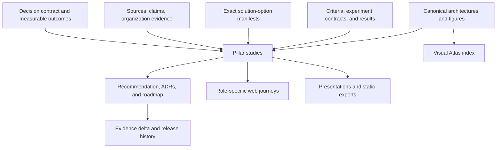

# Principal content and research review

- **Review status:** canonical remediation baseline
- **Review date:** 2026-08-17
- **Repository baseline:** `75c3459f4735f4fad152e227858bcc7012227ea6`
- **Benchmark baseline:** [`tomqwu/aml_open_framework`](https://github.com/tomqwu/aml_open_framework) at `4a7a8d573ba1369d1e8513526ee905938a29b3d3`
- **Scope:** all committed study documents, research, decision material, architecture, proofs of concept, migration material, workshops, reports, site behavior, and audience/presentation paths
- **Decision use:** govern content remediation and future independent review; this report does not select an API management platform

## How future sessions must use this report

This is the durable record of the principal-level review. Recommendations must be tracked by their stable `PCR-###` identifier rather than reconstructed from chat history. A future session may refine wording or add evidence, but it must not silently renumber, combine, or remove an identifier. Superseded findings remain in the history with a disposition and replacement ID.

The review baseline is the commit above. Work completed after that commit counts as remediation only when it is committed, validated, and linked to the relevant exit evidence. A changed file, a rendered page, or a new chart is activity—not closure by itself.

For every remediation item:

1. Assign an accountable role or anonymized owner ID.
2. Maintain `target_gate` and `target_date` in the remediation backlog; do not rely on a date that exists only in a narrative roadmap or private plan.
3. Maintain `blocker` and all declared dependencies while work is active. A blocked item stays open and states the dependency, decision, access, capacity, or evidence needed to resume.
4. Link committed, testable completion artifacts in `closure_evidence` and test the item's stated acceptance evidence.
5. Assign a `reviewer_role` independent of the author or implementation owner. Record the outcome in `review_status`; implementation self-attestation is not acceptance.
6. Record the final `disposition`. An item is done only when its dependencies have acceptable dispositions, `closure_evidence` resolves, the acceptance test passes, and the independent reviewer records an accepted `review_status`.
7. When a finding is superseded, retain it, set its disposition accordingly, and populate `replacement_id`; never reuse or silently delete its ID.
8. Preserve sensitive details in the restricted evidence store and expose only a safe reference in this public repository.

The backlog fields `target_gate`, `target_date`, `closure_evidence`, `reviewer_role`, `review_status`, `blocker`, `disposition`, and `replacement_id` are therefore part of the closure contract, not optional reporting metadata. A status such as “implemented,” a merged change, a passing technical build, or placement in a later work wave does not mean the recommendation is closed without independent reviewer acceptance.

`closure_evidence` uses semicolon-separated, machine-resolvable references: `path:<tracked-file>`, `commit:<40-character-SHA>`, `restricted:<stable-reference>`, or `external:<https-url>#sha256=<64-hex-digest>`. Local paths must remain inside the repository and be tracked; path fragments are rejected, so section-level proof belongs in a dedicated evidence artifact. Commit references must resolve to commits. Restricted references must be stable non-sensitive identifiers. External references require an HTTPS location and immutable SHA-256 digest. A superseded recommendation closes only when its replacement chain resolves to an independently accepted recommendation; a rejected dependency does not satisfy dependent work.

## Principal verdict

The repository is a polished assessment scaffold, a useful Kong functional harness, and a technically credible publication shell. It is **not yet a principal-grade comparative API management study or a decision-ready platform recommendation**.

The central problem is not merely brevity. Too many pages use titles such as “deep dive,” “assessment,” “baseline,” or “comparison” while containing only a checklist, research prompt, future test, or short assertion. The site then presents those Markdown resources uniformly as “Study note,” which makes content maturity appear higher than the evidence permits. The publication experience currently exceeds the maturity of the argument beneath it.

The correct current steering position remains: approve evidence closure, not a vendor selection. The next content objective is fewer, deeper, decision-bearing studies in which sourced analysis, inline figures, comparative evidence, executable tests, limitations, and decision implications form one traceable argument.

| Dimension | Current maturity | Principal interpretation |
|---|---|---|
| Decision framing | Developing | The gated method is strong, but three related decisions are still mixed and the alternatives are not complete end-to-end solution options. |
| Current-state evidence | Initial | The MuleSoft/PCF estate, workload characteristics, costs, dependencies, and capability destinations are not inventoried. |
| Comparative research | Initial | Product treatment and official-source coverage are asymmetric; no exact option has a complete evidence record. |
| Scoring and gates | Strong schema, unexecuted | The ledger design is useful, but all 120 criteria are unknown, acceptance prompts are not measurable thresholds, and scorecards are empty. |
| Architecture analysis | Developing | A useful vendor-neutral logical model exists, but candidate physical views and operational behavior are incomplete and asymmetric. |
| PoC evidence | Initial | Five local Kong OSS baseline scenarios are automated; nine enterprise and comparative scenarios are not run. |
| Article quality | Initial | Most numbered documents are short briefs or protocols rather than substantive studies. |
| Visual reasoning | Initial | A small Mermaid catalog exists, but product/comparison articles contain no inline figures and site-added charts sit outside the argument. |
| Audience communication | Developing | Role paths are thoughtfully defined, but the underlying evidence is too thin to support six decision-grade narratives. |
| Publication engineering | Strong scaffold | Search, routing, validation, presentation mode, and GitHub Pages are useful, but technical readiness must not be presented as editorial or decision maturity. |

## Review scope and method

### Material examined

The review covered:

- the root narrative and all 41 numbered documents in [`docs/`](../docs/README.md);
- all files in [`research/`](../research/README.md), including the source and claim registers;
- the criteria, weights, scoring method, ledger schema, findings, and scorecard placeholders in [`decision-matrix/`](../decision-matrix/README.md);
- all Markdown architecture notes and all 12 canonical Mermaid sources in [`architecture/`](../architecture/README.md);
- the runnable local baseline, manifests, scenario plans, and validation material in [`poc/`](../poc/README.md);
- all proposed records in [`adr/`](../adr/README.md);
- all workshop plans, question banks, and vendor prompts in [`workshops/`](../workshops/README.md);
- all inventory, classification, migration, wave, decommission, and risk material in [`mule-migration/`](../mule-migration/README.md);
- the methodology, evidence-state, delivery, and validation reports in `reports/`;
- the static-site content model, type labelling, document rendering, decision-context charts, Visual Atlas, audience routes, and presentation behavior in `site/` and its build inputs; and
- the public benchmark repository `tomqwu/aml_open_framework`, used as an example of connected narrative, artifacts, runnable proof, and inline visual explanation—not as a domain or branding template.

### Principal review rubric

Every item presented as a study was assessed against the following contract:

| # | Dimension | Principal question |
|---:|---|---|
| 1 | Decision question | Is the decision, audience, consequence, and requested action explicit? |
| 2 | Scope and archetype | Are exact alternatives, deployment archetypes, non-goals, and applicability clear? |
| 3 | Current-state baseline | Is the organizational starting point evidenced rather than assumed? |
| 4 | Provenance | Are material facts tied at point of use to a current source, version, topology, entitlement, and evidence state? |
| 5 | Comparative fairness | Are competing options treated through the same questions, architecture frame, evidence levels, and scenarios? |
| 6 | Analysis | Does the article explain mechanisms, causal implications, trade-offs, counterarguments, and failure conditions? |
| 7 | Visual reasoning | Are diagrams and charts embedded where they make the argument, with interpretation and provenance? |
| 8 | Observable proof | Are tests measurable, thresholded, reproducible, and tied to durable result artifacts? |
| 9 | Traceability | Can a reader follow outcome to requirement, criterion, claim, source, scenario, result, implication, and decision? |
| 10 | Decision implication | Does the content say what changes, what remains unknown, and what must happen next? |
| 11 | Limitations and freshness | Are boundaries, negative evidence, uncertainty, review date, and revalidation triggers explicit? |
| 12 | Publication integrity | Does the title, type, maturity label, navigation, site, and presentation accurately represent the artifact? |

A word count was used only as a signal. A concise artifact may be excellent, but a 60-word page cannot honestly serve as a complete cross-platform study when it contains no comparative evidence, analysis, or result.

## Quantitative inventory at the review baseline

| Measure | Observed state | Interpretation |
|---|---:|---|
| Tracked source files | 196 | Repository volume is not evidence volume. |
| Tracked Markdown files | 132 | The generated `_site/` duplicates were excluded from source counts. |
| Other tracked formats | 12 Mermaid, 8 CSV, 21 YAML/YML, 7 Python, 6 shell, 4 JavaScript, 1 HTML, 1 CSS | The repository has a credible technical publication and PoC substrate. |
| Numbered assessment documents | 41 | The sequence creates apparent breadth, but many entries are fragments. |
| Median numbered-document length | 148 words | Twenty-one of 41 are below 150 words; 32 of 41 are below 300 words. |
| Product and comparison pages, `docs/10`–`docs/32` | 23 pages | None contains an inline Mermaid figure, Markdown image, or external URL at point of claim. |
| Cross-product pages, `docs/25`–`docs/32` | 8 pages, 647 words total | These are protocols/checklists, not completed comparisons. |
| Vendor research notes | 35–39 words each | They are source-index stubs rather than research notes or studies. |
| Registered official sources | 27 | Family distribution is Kong 12, Azure APIM 5, Apigee 4, MuleSoft 3, and Kubernetes/Gateway API 3. |
| Claim-register findings | 14 | Fifteen source IDs are used in findings; 12 registered source IDs are unused there. |
| Evaluation criteria | 120 | Thirty mandatory and 90 weighted; all 120 remain `unknown`. |
| Exact deployment variants named | 7 | Zero exact-variant criterion scorecards are populated. |
| PoC scenarios | 14 | Five automated local baseline scenarios; nine not run. |
| Governance state | 10 open assumptions, 5 proposed ADRs, 12 unrated risks, 10 open questions | Control structures exist, but closure and accountability do not. |
| Numbered documents with Mermaid | 6 | The visual material is concentrated in method/roadmap pages rather than product and comparison arguments. |
| Markdown image references in the reviewed source collections | 0 | Site charts and companion diagram pages do not replace article-integrated exhibits. |

## Priority model

- **P0 — decision-integrity blocker:** permits a misleading conclusion, biased comparison, unsupported selection, or false maturity claim. Close before a down-select or platform recommendation.
- **P1 — principal-publication requirement:** required for a credible study, architecture, PoC, site, or audience decision path. Close before describing the affected material as reviewed or decision-grade.
- **P2 — scale and sustainability improvement:** improves navigation, reuse, maintenance, or continuous-study operation after core integrity is restored.

## Atomic findings and required remediation

The 68 items below are the canonical finding set and are synchronized with [the machine-readable remediation backlog](content-remediation-backlog.csv). Each item is assignable, testable, and independently reviewable. The CSV is the workflow projection; this report preserves the rationale and quality standard.

### PCR-001 — Define governed content taxonomy (P0)

- **Workstream:** Content governance
- **Scope:** Repository-wide Markdown
- **Finding:** The repository presents studies briefs protocols registers results and placeholders as one undifferentiated content class.
- **Required remediation:** Define a governed taxonomy including study brief protocol reference register result tutorial ADR and presentation source with required fields for each type.
- **Exit evidence:** A versioned taxonomy document lists each allowed type its purpose required metadata quality gate and publication behavior.
- **Dependencies:** none
- **Accountable role:** Editorial Lead
- **Baseline status:** backlog

### PCR-002 — Classify every page and assign maturity (P0)

- **Workstream:** Content governance
- **Scope:** All Markdown and generated pages
- **Finding:** Page maturity is implicit and readers cannot distinguish a hypothesis from verified evidence or an approved decision.
- **Required remediation:** Inventory every page and assign content type evidence maturity owner review date and canonical or supporting status.
- **Exit evidence:** A machine-readable inventory covers 100 percent of published pages and has no unclassified records.
- **Dependencies:** PCR-001
- **Accountable role:** Content Governance Lead
- **Baseline status:** backlog

### PCR-003 — Publish principal article contract and QA rubric (P0)

- **Workstream:** Editorial quality
- **Scope:** Substantive studies and research articles
- **Finding:** Most articles are short outlines without a complete decision argument evidence analysis or limitations.
- **Required remediation:** Publish a principal article contract and QA rubric covering decision question audience scope evidence competing options analysis inline exhibits implications limitations ownership and next gate.
- **Exit evidence:** A reusable template and scored rubric exist and one exemplar study passes every mandatory rubric item.
- **Dependencies:** PCR-001
- **Accountable role:** Editorial Lead
- **Baseline status:** backlog

### PCR-004 — Consolidate fragmented notes into pillar studies (P1)

- **Workstream:** Information architecture
- **Scope:** docs/00 through docs/40 and related research
- **Finding:** Fragmentation into many short sequential notes creates an illusion of breadth and duplicates generic guidance.
- **Required remediation:** Consolidate overlapping notes into a governed set of pillar studies and redirect or archive superseded stubs without losing evidence lineage.
- **Exit evidence:** A content map names each pillar its supporting annexes and every former page disposition with working redirects or canonical links.
- **Dependencies:** PCR-001;PCR-002;PCR-003
- **Accountable role:** Information Architect
- **Baseline status:** backlog

### PCR-005 — Rename pages that overclaim comparison or baseline status (P0)

- **Workstream:** Editorial integrity
- **Scope:** Comparison baseline and research page titles
- **Finding:** Several pages claim to be comparisons or baselines but contain only questions protocols or future inventory requirements.
- **Required remediation:** Rename each overclaiming page to its current artifact type or expand it until it contains evidence-based comparisons findings and implications.
- **Exit evidence:** A title-to-content audit finds no page whose title claims a maturity level unsupported by its body and evidence state.
- **Dependencies:** PCR-001;PCR-002
- **Accountable role:** Editorial Lead
- **Baseline status:** backlog

### PCR-006 — Add audience and decision-stage journeys (P1)

- **Workstream:** Audience design
- **Scope:** Executives architects developers DevOps and platform teams
- **Finding:** Audience guidance exists but the publication does not provide explicit decision-stage journeys through canonical content.
- **Required remediation:** Define role-based and decision-stage reading journeys that identify the required executive technical delivery and evidence views.
- **Exit evidence:** Each named audience has a tested entry path with purpose expected outcome and links to canonical studies rather than duplicate summaries.
- **Dependencies:** PCR-002;PCR-004
- **Accountable role:** Content Strategist
- **Baseline status:** backlog

### PCR-007 — Make site labels honor type and maturity (P0)

- **Workstream:** Site publishing
- **Scope:** Site cards navigation search and page chrome
- **Finding:** The site labels every Markdown document as a study note regardless of artifact type or maturity.
- **Required remediation:** Drive site labels filters badges and page chrome from governed content type and evidence-maturity metadata.
- **Exit evidence:** Rendered pages and search results show the correct type and maturity for every inventoried page with automated coverage tests.
- **Dependencies:** PCR-001;PCR-002
- **Accountable role:** Site Engineering Lead
- **Baseline status:** backlog

### PCR-008 — Replace generic site summaries with truthful outcomes (P1)

- **Workstream:** Site publishing
- **Scope:** Generated card summaries and calls to action
- **Finding:** Generic summaries and calls to action obscure what a page actually concludes and whether it is actionable.
- **Required remediation:** Replace generic generated descriptions with outcome-oriented summaries sourced from approved metadata and show the next appropriate workflow action.
- **Exit evidence:** Every published card states the page question outcome evidence state and next action with no generic placeholder copy.
- **Dependencies:** PCR-002;PCR-007
- **Accountable role:** UX Content Lead
- **Baseline status:** backlog

### PCR-009 — Correct Phase 0 maturity claims (P0)

- **Workstream:** Roadmap governance
- **Scope:** README delivery reports and repository roadmap
- **Finding:** Phase 0 is described as complete even though only the technical publication baseline is complete and the editorial decision-grade baseline is not.
- **Required remediation:** Correct status language across authoritative documents and distinguish technical publication readiness from editorial evidence and decision readiness.
- **Exit evidence:** README roadmap and delivery reporting use one reconciled maturity model and no longer imply decision-grade completion.
- **Dependencies:** PCR-001;PCR-002
- **Accountable role:** Program Governance Lead
- **Baseline status:** backlog

### PCR-010 — Automate content-contract validation (P1)

- **Workstream:** Quality automation
- **Scope:** Repository validation and CI
- **Finding:** There is no automated enforcement of required metadata article sections maturity rules source links or canonical status.
- **Required remediation:** Add deterministic validation for content metadata taxonomy required sections stale review dates broken lineage and disallowed maturity claims.
- **Exit evidence:** CI fails on representative invalid fixtures and passes the classified corpus with a published validation report.
- **Dependencies:** PCR-001;PCR-002;PCR-003
- **Accountable role:** Repository Maintainer
- **Baseline status:** backlog

### PCR-011 — Separate the three linked decisions (P0)

- **Workstream:** Decision architecture
- **Scope:** Assessment scope and decision framing
- **Finding:** API management selection integration-capability design and PCF or Mule-to-AKS migration are treated as one decision despite different owners evidence and gates.
- **Required remediation:** Define three separate linked decision records with individual questions scopes owners alternatives gates and approval forums.
- **Exit evidence:** A decision charter exists for each decision and cross-references shared dependencies without combining approval criteria.
- **Dependencies:** none
- **Accountable role:** Decision Architecture Lead
- **Baseline status:** backlog

### PCR-012 — Publish decision dependency and governance map (P0)

- **Workstream:** Decision governance
- **Scope:** Cross-decision dependencies
- **Finding:** The sequence and governance between platform selection integration target design and workload migration are not explicit.
- **Required remediation:** Publish a dependency and governance map showing inputs outputs decision rights escalation points stage gates and permissible parallel work.
- **Exit evidence:** An inline decision map and RACI are approved and each roadmap milestone resolves to one decision gate.
- **Dependencies:** PCR-011
- **Accountable role:** Program Governance Lead
- **Baseline status:** backlog

### PCR-013 — Define complete solution-option schema (P0)

- **Workstream:** Option architecture
- **Scope:** Candidate definition
- **Finding:** The seven variants mix products and deployment modes rather than representing complete deployable solution alternatives.
- **Required remediation:** Define a solution-option schema covering exact version control plane runtime locations portal catalog identity telemetry support residency integration dependencies and exit posture.
- **Exit evidence:** The schema is documented and validated against at least one complete option with no unresolved mandatory field.
- **Dependencies:** PCR-011
- **Accountable role:** Enterprise Architecture Lead
- **Baseline status:** backlog

### PCR-014 — Catalogue deployable exact-variant solution alternatives (P0)

- **Workstream:** Option architecture
- **Scope:** Platform shortlist
- **Finding:** No catalog describes complete exact-variant solution alternatives that can be scored and compared end to end.
- **Required remediation:** Catalogue each in-scope deployable solution using the approved schema and mark excluded combinations with a sourced rationale.
- **Exit evidence:** Every shortlisted alternative has an immutable solution option ID complete topology assumptions entitlements and lifecycle status.
- **Dependencies:** PCR-013;PCR-018
- **Accountable role:** Product Research Lead
- **Baseline status:** backlog

### PCR-015 — Rekey matrix evidence and tests to solution options (P0)

- **Workstream:** Decision model
- **Scope:** Criteria scorecards findings and PoC records
- **Finding:** Evidence is keyed to product variants and can become ambiguous when one product participates in multiple complete solution designs.
- **Required remediation:** Rekey criteria evidence findings scenarios results and scorecards to solution option IDs while retaining component-level lineage.
- **Exit evidence:** A traceability query returns one unambiguous evidence set and scorecard for every solution option and criterion pair.
- **Dependencies:** PCR-013;PCR-014;PCR-023
- **Accountable role:** Decision Model Lead
- **Baseline status:** backlog

### PCR-016 — Remove premature Kong-leading language (P0)

- **Workstream:** Research neutrality
- **Scope:** Product shortlist and Kong hypothesis
- **Finding:** Kong variants are labelled leading despite the stated equal-screen and low-confidence hypothesis posture.
- **Required remediation:** Remove premature leading labels and express all prioritization as test-order hypotheses with explicit confidence and falsification conditions.
- **Exit evidence:** Neutrality review finds no unsupported winner language and every prioritization statement links to a hypothesis and evidence state.
- **Dependencies:** PCR-018
- **Accountable role:** Research Director
- **Baseline status:** backlog

### PCR-017 — Remove predetermined Kong mapping from Mule decomposition (P0)

- **Workstream:** Architecture neutrality
- **Scope:** Mule capability decomposition
- **Finding:** The decomposition preassigns gateway routing to Kong before the platform decision is complete.
- **Required remediation:** Replace vendor-specific target assignments with required capabilities and map vendors only through evaluated solution options after a gate decision.
- **Exit evidence:** The canonical decomposition is vendor neutral and any product mapping references an approved solution-option decision.
- **Dependencies:** PCR-011;PCR-013
- **Accountable role:** Enterprise Architect
- **Baseline status:** backlog

### PCR-018 — Establish symmetric candidate screening (P0)

- **Workstream:** Candidate screening
- **Scope:** All primary and secondary candidates
- **Finding:** The repository gives Kong more detailed treatment and does not document an equivalent screen for alternatives.
- **Required remediation:** Establish a symmetric screening protocol with identical archetypes evidence fields time boxes exclusion rules and review authority for every candidate.
- **Exit evidence:** A completed screening matrix demonstrates identical questions and evidence expectations across all candidates and records every exclusion.
- **Dependencies:** PCR-011
- **Accountable role:** Research Director
- **Baseline status:** backlog

### PCR-019 — Make mandatory gates non-compensable (P0)

- **Workstream:** Decision model
- **Scope:** Mandatory criteria and weighted scoring
- **Finding:** The method can double-count mandatory gates and does not state clearly that a high weighted score cannot compensate for a failed gate.
- **Required remediation:** Define non-compensable gate semantics applicability exception authority and the relationship between eligibility gates and weighted differentiators.
- **Exit evidence:** Scoring rules and automated examples prove that failed mandatory gates block selection unless a documented exception is approved.
- **Dependencies:** PCR-011
- **Accountable role:** Decision Model Lead
- **Baseline status:** backlog

### PCR-020 — Upgrade acceptance-test schema (P0)

- **Workstream:** Evidence method
- **Scope:** Acceptance-test data model
- **Finding:** Acceptance tests lack observable measures thresholds conditions applicability evidence levels reviewers and stop rules.
- **Required remediation:** Extend the acceptance-test schema with metric procedure threshold scenario applicability evidence requirement reviewer exception and stop-condition fields.
- **Exit evidence:** Schema validation rejects a tautological test and accepts a fully measurable exemplar for each criterion category.
- **Dependencies:** PCR-019
- **Accountable role:** Test Strategy Lead
- **Baseline status:** backlog

### PCR-021 — Rewrite all 120 criterion acceptance tests (P0)

- **Workstream:** Evidence method
- **Scope:** All 120 criterion acceptance tests
- **Finding:** All criterion tests restate the requirement as evidence demonstrates and therefore cannot produce reproducible pass or fail decisions.
- **Required remediation:** Rewrite all 120 tests as observable procedures with exact inputs measures thresholds evidence artifacts and review roles.
- **Exit evidence:** One hundred twenty tests pass schema validation and an independent reviewer can reproduce the intended verdict from each definition.
- **Dependencies:** PCR-020
- **Accountable role:** Test Strategy Lead
- **Baseline status:** backlog

### PCR-022 — Define evidence-readiness and selection thresholds (P0)

- **Workstream:** Decision readiness
- **Scope:** Recommendation and approval gates
- **Finding:** The repository does not define the minimum evidence coverage confidence and unresolved-risk conditions required to make a selection.
- **Required remediation:** Define evidence-readiness thresholds selection rules allowed unknowns sensitivity requirements and conditions that force deferral.
- **Exit evidence:** A machine-evaluable readiness report returns select defer or reject using approved rules and identifies every blocking evidence gap.
- **Dependencies:** PCR-019;PCR-020
- **Accountable role:** Decision Governance Lead
- **Baseline status:** backlog

### PCR-023 — Build claim-to-evidence traceability ledger (P0)

- **Workstream:** Evidence governance
- **Scope:** Claims sources criteria options scenarios and decisions
- **Finding:** The repository lacks a complete claim-to-source-to-criterion-to-option-to-test-to-decision chain.
- **Required remediation:** Build a machine-readable traceability ledger with stable identifiers bidirectional links evidence state and authoritative artifact locations.
- **Exit evidence:** Automated coverage reports show lineage for every material published claim and list orphaned sources claims criteria tests and decisions.
- **Dependencies:** PCR-013
- **Accountable role:** Evidence Governance Lead
- **Baseline status:** backlog

### PCR-024 — Add point-of-use citations (P0)

- **Workstream:** Research integrity
- **Scope:** All substantive articles
- **Finding:** Product and architecture claims rarely cite source IDs at the point where the claim appears.
- **Required remediation:** Add point-of-use source and finding references for factual claims and distinguish sourced fact inference hypothesis observed result and recommendation.
- **Exit evidence:** Citation validation finds no unsupported material factual claim in approved studies and every citation resolves to registered evidence.
- **Dependencies:** PCR-023
- **Accountable role:** Research Editor
- **Baseline status:** backlog

### PCR-025 — Capture source version entitlement and topology context (P0)

- **Workstream:** Research integrity
- **Scope:** Source register and candidate evidence
- **Finding:** Sources do not consistently record effective version entitlement deployment topology region date or access conditions needed to interpret claims.
- **Required remediation:** Extend source metadata and evidence notes with product version edition entitlement topology region publication date access date and applicability limits.
- **Exit evidence:** All decision-relevant sources contain required context or an explicit unknown with an assigned closure action.
- **Dependencies:** PCR-023
- **Accountable role:** Evidence Governance Lead
- **Baseline status:** backlog

### PCR-026 — Rebalance research coverage across candidates (P0)

- **Workstream:** Research coverage
- **Scope:** Kong Azure API Management Apigee MuleSoft and secondary candidates
- **Finding:** Official-source coverage is materially deeper for Kong than for alternative candidates.
- **Required remediation:** Close source and finding coverage gaps using the symmetric protocol and publish a coverage heatmap by candidate criterion and evidence level.
- **Exit evidence:** Coverage meets the approved parity threshold or each remaining asymmetry has an accepted scope rationale and risk owner.
- **Dependencies:** PCR-018;PCR-025
- **Accountable role:** Research Director
- **Baseline status:** backlog

### PCR-027 — Produce principal Kong dossier (P1)

- **Workstream:** Product research
- **Scope:** Kong dossier
- **Finding:** Kong pages are fragmented feature outlines without a cohesive sourced assessment of exact variants tradeoffs limits and decision implications.
- **Required remediation:** Produce a principal Kong dossier using the article contract and complete solution-option context with counter-evidence and inline exhibits.
- **Exit evidence:** The dossier passes the article rubric and maps every material claim and limitation to sources criteria scenarios and candidate options.
- **Dependencies:** PCR-003;PCR-014;PCR-023;PCR-026
- **Accountable role:** Product Research Lead
- **Baseline status:** backlog

### PCR-028 — Produce principal Azure API Management dossier (P0)

- **Workstream:** Product research
- **Scope:** Azure API Management dossier
- **Finding:** Azure API Management treatment is too shallow for a symmetric decision and lacks equivalent physical architecture and evidence depth.
- **Required remediation:** Produce a principal Azure API Management dossier using the same structure archetypes evidence requirements and exhibit set as other primary candidates.
- **Exit evidence:** The dossier passes the shared rubric and parity review with complete option mappings sources limitations and decision implications.
- **Dependencies:** PCR-003;PCR-014;PCR-023;PCR-026
- **Accountable role:** Product Research Lead
- **Baseline status:** backlog

### PCR-029 — Produce principal Apigee dossier (P0)

- **Workstream:** Product research
- **Scope:** Apigee dossier
- **Finding:** Apigee treatment is too shallow for a symmetric decision and lacks equivalent physical architecture and evidence depth.
- **Required remediation:** Produce a principal Apigee dossier using the same structure archetypes evidence requirements and exhibit set as other primary candidates.
- **Exit evidence:** The dossier passes the shared rubric and parity review with complete option mappings sources limitations and decision implications.
- **Dependencies:** PCR-003;PCR-014;PCR-023;PCR-026
- **Accountable role:** Product Research Lead
- **Baseline status:** backlog

### PCR-030 — Produce principal MuleSoft dossier (P0)

- **Workstream:** Product research
- **Scope:** MuleSoft dossier
- **Finding:** MuleSoft treatment does not separate current-state integration capabilities from candidate API-management functions with comparable evidence depth.
- **Required remediation:** Produce a principal MuleSoft dossier that distinguishes incumbent baseline target capability options and migration implications under the symmetric protocol.
- **Exit evidence:** The dossier passes the shared rubric and maps incumbent and candidate claims to actual inventory sources criteria and migration decisions.
- **Dependencies:** PCR-003;PCR-014;PCR-023;PCR-026
- **Accountable role:** Product Research Lead
- **Baseline status:** backlog

### PCR-031 — Execute documented secondary-product screen (P1)

- **Workstream:** Market research
- **Scope:** Secondary candidate screen
- **Finding:** The secondary-products page states a policy but contains no actual candidate screen findings or exclusion evidence.
- **Required remediation:** Execute and document the secondary-product screen against approved archetypes and record include exclude monitor and revisit outcomes.
- **Exit evidence:** A signed screening table covers all named candidates with sources rationale confidence reviewer and review date.
- **Dependencies:** PCR-018;PCR-023
- **Accountable role:** Market Research Lead
- **Baseline status:** backlog

### PCR-032 — Maintain counter-evidence and falsification register (P0)

- **Workstream:** Research challenge
- **Scope:** All hypotheses and emerging recommendations
- **Finding:** Counter-evidence and falsification conditions are not maintained as a first-class cross-candidate artifact.
- **Required remediation:** Create a register of counter-hypotheses disconfirming evidence falsification tests result state and resulting decision impact.
- **Exit evidence:** Every material hypothesis and provisional recommendation has at least one documented disconfirmation path and assigned reviewer.
- **Dependencies:** PCR-023
- **Accountable role:** Independent Challenge Lead
- **Baseline status:** backlog

### PCR-033 — Establish evidence freshness lifecycle (P1)

- **Workstream:** Evidence lifecycle
- **Scope:** Sources findings results and recommendations
- **Finding:** Evidence can become stale without visible expiry reassessment ownership or downstream impact analysis.
- **Required remediation:** Define freshness policies and automate review dates expiry states owner notifications and impact tracing for changed evidence.
- **Exit evidence:** A freshness report identifies current due and expired evidence and traces each expired item to affected pages scores and decisions.
- **Dependencies:** PCR-023;PCR-025
- **Accountable role:** Evidence Governance Lead
- **Baseline status:** backlog

### PCR-034 — Link findings criteria scenarios and decisions (P0)

- **Workstream:** Traceability
- **Scope:** Findings criteria scenarios option scores and ADRs
- **Finding:** Existing findings do not consistently connect to evaluation criteria experiments score changes and formal decisions.
- **Required remediation:** Link every approved finding to impacted criteria solution options scenarios results recommendations and ADRs with direction and materiality.
- **Exit evidence:** A generated impact view shows complete bidirectional lineage and no approved finding remains disconnected from a decision use.
- **Dependencies:** PCR-015;PCR-023
- **Accountable role:** Decision Analyst
- **Baseline status:** backlog

### PCR-035 — Establish evidence-based current-estate baseline (P0)

- **Workstream:** Current-state research
- **Scope:** Mule PCF AKS API estate and operating constraints
- **Finding:** The current-state baseline is a future inventory checklist rather than an evidence-based description of the actual estate.
- **Required remediation:** Collect and publish the authoritative workload API integration dependency traffic identity control operational cost and migration inventory with uncertainty labels.
- **Exit evidence:** A dated baseline dataset and study cover the approved inventory scope reconcile source systems and identify quantified unknowns.
- **Dependencies:** PCR-003;PCR-023
- **Accountable role:** Current-State Assessment Lead
- **Baseline status:** backlog

### PCR-036 — Publish market landscape and decision-archetype study (P1)

- **Workstream:** Pillar studies
- **Scope:** Market landscape and decision archetypes
- **Finding:** The shortlist lacks a substantive view of market archetypes fit boundaries and the reasons different operating models favor different solutions.
- **Required remediation:** Publish a sourced market-landscape study comparing archetypes deployment models decision drivers non-fit conditions and screening implications.
- **Exit evidence:** The study passes the article rubric and includes a sourced landscape exhibit archetype decision tree and explicit shortlist implications.
- **Dependencies:** PCR-003;PCR-018;PCR-026
- **Accountable role:** Market Research Lead
- **Baseline status:** backlog

### PCR-037 — Publish hybrid and multicloud topology comparison (P0)

- **Workstream:** Pillar studies
- **Scope:** Hybrid and multicloud deployment
- **Finding:** Hybrid content is a list of tests and cautions rather than an exact-option topology comparison with evidence and tradeoffs.
- **Required remediation:** Publish a comparative hybrid and multicloud study covering control and data planes connectivity residency failure modes operations latency support and exit implications.
- **Exit evidence:** The study compares every solution option symmetrically and includes physical topology evidence results tradeoffs and criterion impacts.
- **Dependencies:** PCR-014;PCR-024;PCR-048;PCR-054
- **Accountable role:** Hybrid Architecture Lead
- **Baseline status:** backlog

### PCR-038 — Publish gateway-versus-integration transformation study (P0)

- **Workstream:** Pillar studies
- **Scope:** Gateway versus integration capability transformation
- **Finding:** The repository states a boundary but does not analyze actual capabilities dependencies target services or failure consequences.
- **Required remediation:** Publish a transformation study mapping current integration capabilities to target patterns with alternatives ownership dependencies anti-patterns and migration decisions.
- **Exit evidence:** The study maps the current inventory to target capabilities and includes a decision tree dependency flow rejected alternatives and measurable transition outcomes.
- **Dependencies:** PCR-011;PCR-017;PCR-035
- **Accountable role:** Integration Architecture Lead
- **Baseline status:** backlog

### PCR-039 — Publish security residency and network study (P0)

- **Workstream:** Pillar studies
- **Scope:** Security residency identity and networking
- **Finding:** The security and networking pages define proof requests but do not compare candidates or interpret option-specific risk.
- **Required remediation:** Publish an evidence-based study of identity secrets certificates policy isolation threat controls residency private connectivity egress and network failure behavior.
- **Exit evidence:** The study contains option-by-option evidence threat and trust-boundary diagrams gate verdicts residual risks and approved exceptions.
- **Dependencies:** PCR-014;PCR-021;PCR-024;PCR-048
- **Accountable role:** Security Architecture Lead
- **Baseline status:** backlog

### PCR-040 — Publish lifecycle developer experience and APIops study (P1)

- **Workstream:** Pillar studies
- **Scope:** API lifecycle developer experience portal and APIops
- **Finding:** Lifecycle portal and APIops pages are short checklists without workflows usability evidence governance tradeoffs or measured outcomes.
- **Required remediation:** Publish a comparative lifecycle study from design through retirement covering personas workflows automation governance portal experience and repository integration.
- **Exit evidence:** The study includes persona journeys workflow diagrams measured tasks option evidence and decision implications for each lifecycle stage.
- **Dependencies:** PCR-014;PCR-021;PCR-024
- **Accountable role:** API Product Management Lead
- **Baseline status:** backlog

### PCR-041 — Publish reliability performance observability and operations study (P0)

- **Workstream:** Pillar studies
- **Scope:** Reliability performance observability and operations
- **Finding:** Current pages contain test intentions but no service objectives operating model degraded-state analysis comparative results or capacity evidence.
- **Required remediation:** Publish an operational-quality study covering SLOs capacity latency availability scaling upgrades telemetry incident response recovery and failure injection.
- **Exit evidence:** The study reports reproducible option-level measures against thresholds with failure-mode diagrams runbooks evidence links and residual risk.
- **Dependencies:** PCR-014;PCR-021;PCR-054;PCR-057
- **Accountable role:** Site Reliability Lead
- **Baseline status:** backlog

### PCR-042 — Publish commercial TCO and exit-economics study (P0)

- **Workstream:** Pillar studies
- **Scope:** Commercial model TCO and exit economics
- **Finding:** The assessment has no decision-grade cost model that includes licensing infrastructure labor migration support risk and exit cost.
- **Required remediation:** Publish a scenario-based TCO and commercial study with transparent assumptions sensitivity ranges contract dependencies switching costs and five-year economics.
- **Exit evidence:** A reproducible model produces comparable option totals and sensitivities and the article explains assumptions uncertainty and decision impact.
- **Dependencies:** PCR-014;PCR-025;PCR-035
- **Accountable role:** FinOps Lead
- **Baseline status:** backlog

### PCR-043 — Publish operating-model skills and support study (P1)

- **Workstream:** Pillar studies
- **Scope:** Operating model skills and support
- **Finding:** The operating-model page provides role outlines but does not compare staffing skills support responsibilities or organizational feasibility by option.
- **Required remediation:** Publish an option-specific operating-model study covering RACI skill gaps team topology vendor support toil training governance and transition capacity.
- **Exit evidence:** The study includes current-to-target capacity gaps option-level staffing estimates RACI escalation model and actionable transition plan.
- **Dependencies:** PCR-014;PCR-035
- **Accountable role:** Operating Model Lead
- **Baseline status:** backlog

### PCR-044 — Publish Mule decomposition and migration study (P0)

- **Workstream:** Pillar studies
- **Scope:** Mule decomposition and migration
- **Finding:** Migration pages are generic planning notes without workload inventory wave rationale equivalence proof coexistence risks or rollback criteria.
- **Required remediation:** Publish an evidence-based decomposition and migration study with workload segmentation target patterns dependency waves coexistence controls rollback and benefit realization.
- **Exit evidence:** Every in-scope workload maps to a disposition wave target capability evidence requirement owner risk and reversible cutover gate.
- **Dependencies:** PCR-035;PCR-038;PCR-041;PCR-042
- **Accountable role:** Migration Lead
- **Baseline status:** backlog

### PCR-045 — Publish evidence-backed recommendation synthesis (P0)

- **Workstream:** Decision synthesis
- **Scope:** Final recommendation and roadmap
- **Finding:** The repository cannot yet make an evidence-backed selection and current narrative material is stronger than the underlying comparative proof.
- **Required remediation:** Publish a recommendation only after readiness gates pass and synthesize option verdicts sensitivity residual risks conditions roadmap and explicit reasons alternatives were rejected.
- **Exit evidence:** The recommendation passes readiness validation links all decisive evidence records sensitivity analysis and ADRs and records approver conditions.
- **Dependencies:** PCR-022;PCR-034;PCR-037;PCR-038;PCR-039;PCR-040;PCR-041;PCR-042;PCR-043;PCR-044
- **Accountable role:** Principal Consultant
- **Baseline status:** backlog

### PCR-046 — Establish canonical figure registry (P0)

- **Workstream:** Visual governance
- **Scope:** All diagrams charts and presentation figures
- **Finding:** Visuals lack a repository-wide canonical identity and can be duplicated or changed without traceability.
- **Required remediation:** Create a canonical figure registry with stable figure ID owning article source data generator audience status and downstream presentation uses.
- **Exit evidence:** Every published visual is registered once and automated checks report no orphaned duplicate or unresolved figure reference.
- **Dependencies:** PCR-002;PCR-023
- **Accountable role:** Visualization Lead
- **Baseline status:** backlog

### PCR-047 — Embed canonical figures at point of argument (P0)

- **Workstream:** Visual storytelling
- **Scope:** All substantive studies
- **Finding:** Most product and comparison articles contain no inline diagram or chart and generic charts are injected before the document rather than supporting its reasoning.
- **Required remediation:** Embed canonical figures at the exact point each study makes the related argument and explain the conclusion drawn from the figure.
- **Exit evidence:** Every approved study meets its rubric-defined exhibit requirement and each figure is cited and interpreted in surrounding article text.
- **Dependencies:** PCR-003;PCR-046
- **Accountable role:** Editorial Visualization Lead
- **Baseline status:** backlog

### PCR-048 — Produce symmetric physical architectures (P0)

- **Workstream:** Architecture comparison
- **Scope:** All shortlisted solution options
- **Finding:** Only some candidates have architecture coverage and the existing views are not symmetric physical deployments.
- **Required remediation:** Produce comparable physical architectures for every solution option using one legend scope and level of detail across control runtime identity network telemetry and operations.
- **Exit evidence:** A parity review confirms that each option has like-for-like deployment context trust boundaries dependencies and evidence links.
- **Dependencies:** PCR-014;PCR-046
- **Accountable role:** Enterprise Architecture Lead
- **Baseline status:** backlog

### PCR-049 — Deepen diagrams with state ownership controls and failure behavior (P1)

- **Workstream:** Architecture quality
- **Scope:** Architecture articles and diagrams
- **Finding:** Many diagrams are simplified schematics without state ownership persistence degraded behavior controls alternatives or validation implications.
- **Required remediation:** Deepen canonical diagrams and articles to show ownership state flow trust boundaries failure modes recovery paths operational controls alternatives and linked tests.
- **Exit evidence:** Architecture review confirms each required concern is represented or explicitly not applicable and every failure path maps to a validation scenario.
- **Dependencies:** PCR-046;PCR-048
- **Accountable role:** Architecture Review Lead
- **Baseline status:** backlog

### PCR-050 — Add figure interpretation provenance and limitations (P0)

- **Workstream:** Visual evidence
- **Scope:** Every canonical figure
- **Finding:** Figures do not consistently state what they prove their source date evidence level limitations or what they cannot establish.
- **Required remediation:** Require figure metadata and article captions with answer-first title interpretation sources as-of date evidence level limitations and decision relevance.
- **Exit evidence:** Registry validation finds complete metadata for every published figure and a reviewer can trace each plotted value or diagram assertion to evidence.
- **Dependencies:** PCR-023;PCR-046
- **Accountable role:** Evidence Visualization Lead
- **Baseline status:** backlog

### PCR-051 — Provide accessible visual fallbacks (P1)

- **Workstream:** Accessibility
- **Scope:** Charts diagrams and interactive visuals
- **Finding:** Visual evidence may be unusable for readers who cannot perceive color or interact with the site and lacks equivalent data views.
- **Required remediation:** Provide accessible text descriptions data tables keyboard support non-color encodings and export-safe alternatives for each visual.
- **Exit evidence:** Automated accessibility checks pass and every figure has an equivalent table or structured narrative verified against its source data.
- **Dependencies:** PCR-046;PCR-050
- **Accountable role:** Accessibility Lead
- **Baseline status:** backlog

### PCR-052 — Make Visual Atlas an index of article figures (P1)

- **Workstream:** Visual information architecture
- **Scope:** Visual Atlas and article galleries
- **Finding:** The atlas can become a separate primary home for analysis and encourage context-free duplicate visuals.
- **Required remediation:** Make the Visual Atlas an index of canonical article-owned figures and link each entry back to the argument evidence and interpretation in its source study.
- **Exit evidence:** Every atlas item resolves to one canonical figure and article anchor and no standalone atlas-only decision claim exists.
- **Dependencies:** PCR-046;PCR-047
- **Accountable role:** Information Architect
- **Baseline status:** backlog

### PCR-053 — Automate visual data provenance and drift checks (P1)

- **Workstream:** Visual automation
- **Scope:** Generated charts diagrams site and decks
- **Finding:** Generated visuals can drift from source data article claims or presentation copies without detection.
- **Required remediation:** Record input hashes generator versions and downstream uses and add automated provenance freshness and divergence checks.
- **Exit evidence:** A deterministic build report proves visual inputs and outputs and CI detects a deliberately stale or modified downstream copy.
- **Dependencies:** PCR-046;PCR-050
- **Accountable role:** Visualization Engineering Lead
- **Baseline status:** backlog

### PCR-054 — Define exact-option comparative PoC matrix (P0)

- **Workstream:** Comparative PoC
- **Scope:** PoC scenario portfolio
- **Finding:** The existing Kong smoke harness does not provide a symmetric experiment matrix across exact solution options.
- **Required remediation:** Define a comparative PoC matrix mapping each decision-critical scenario to all applicable solution options criteria owners environments and evidence outputs.
- **Exit evidence:** The matrix covers every mandatory gate and high-sensitivity differentiator and explains every option or scenario marked not applicable.
- **Dependencies:** PCR-014;PCR-020;PCR-021
- **Accountable role:** PoC Lead
- **Baseline status:** backlog

### PCR-055 — Add measurable PoC thresholds and stop conditions (P0)

- **Workstream:** Comparative PoC
- **Scope:** Scenario definitions and execution governance
- **Finding:** PoC intentions lack measurable thresholds baseline methods stop conditions repeat counts and reviewer rules.
- **Required remediation:** Add quantitative thresholds baseline and variance rules repeatability requirements failure and stop conditions evidence levels and independent review to each scenario.
- **Exit evidence:** All approved scenarios pass schema validation and dry-run review before product execution begins.
- **Dependencies:** PCR-020;PCR-054
- **Accountable role:** Test Strategy Lead
- **Baseline status:** backlog

### PCR-056 — Execute the nine decision-critical PoC scenarios (P0)

- **Workstream:** Comparative PoC
- **Scope:** Nine unexecuted decision-critical scenarios
- **Finding:** Decision-critical hybrid security resilience operability lifecycle and migration questions remain unexecuted.
- **Required remediation:** Execute the nine outstanding priority scenarios against all applicable exact options and record pass fail inconclusive and blocked outcomes without narrative substitution.
- **Exit evidence:** Nine scenario result bundles are complete reviewed immutable and linked to affected criteria findings risks and option scorecards.
- **Dependencies:** PCR-054;PCR-055
- **Accountable role:** PoC Lead
- **Baseline status:** backlog

### PCR-057 — Publish reproducible evidence bundles (P0)

- **Workstream:** Evidence operations
- **Scope:** All PoC and benchmark results
- **Finding:** Test results are not yet packaged as durable replayable decision evidence with environment and configuration context.
- **Required remediation:** Publish reproducible evidence bundles containing procedure code configuration versions topology raw output normalized measures logs hashes limitations and reviewer sign-off.
- **Exit evidence:** An independent operator reproduces a sampled result within the accepted tolerance using only the bundle and documented prerequisites.
- **Dependencies:** PCR-055;PCR-056
- **Accountable role:** Evidence Engineering Lead
- **Baseline status:** backlog

### PCR-058 — Complete ADRs and decision-record traceability (P0)

- **Workstream:** Decision records
- **Scope:** ADR 0003 through ADR 0005 and future decisions
- **Finding:** Several ADRs are one-sentence principles and do not meet the repository ADR contract or connect decisions to evidence.
- **Required remediation:** Complete each ADR with status context decision alternatives evidence consequences conditions expiry and links to solution options findings and approval records.
- **Exit evidence:** ADR validation passes for all active records and every material approved decision has complete bidirectional evidence traceability.
- **Dependencies:** PCR-011;PCR-023;PCR-034
- **Accountable role:** Architecture Governance Lead
- **Baseline status:** backlog

### PCR-059 — Rebuild site and role-specific decks from approved studies (P1)

- **Workstream:** Publishing and presentations
- **Scope:** Static site executive deck and role-specific presentations
- **Finding:** The polished site and decks can overstate maturity and reuse generic content instead of presenting audience-specific evidence-backed arguments.
- **Required remediation:** Rebuild site pathways and executive architecture developer DevOps and platform presentations from approved canonical studies figures and maturity metadata.
- **Exit evidence:** Each audience artifact has an explicit decision outcome uses only registered figures links to canonical evidence and passes role-based content review.
- **Dependencies:** PCR-006;PCR-007;PCR-045;PCR-046;PCR-052
- **Accountable role:** Presentation and Site Lead
- **Baseline status:** backlog

### PCR-060 — Run independent principal assurance review (P0)

- **Workstream:** Independent assurance
- **Scope:** Entire decision publication
- **Finding:** No final independent principal review verifies methodological coherence content depth evidence sufficiency visual integrity and decision defensibility after remediation.
- **Required remediation:** Run an independent principal assurance review against the approved rubric traceability model readiness thresholds and audience artifacts before declaring the repository decision grade.
- **Exit evidence:** A signed assurance report records pass conditional pass or fail with sampled evidence unresolved findings and explicit publication recommendation.
- **Dependencies:** PCR-010;PCR-022;PCR-045;PCR-053;PCR-057;PCR-058;PCR-059
- **Accountable role:** Independent Review Lead
- **Baseline status:** backlog

### PCR-061 — Public repository and release hygiene (P0)

- **Workstream:** Public repository governance
- **Scope:** Repository root releases and downloadable artifacts
- **Finding:** The public repository does not yet expose a complete contribution security ownership release and reusable-artifact contract.
- **Required remediation:** Add or complete the license security policy code of conduct ownership and review rules changelog semantic tags releases and versioned downloadable PDF and deck snapshots.
- **Exit evidence:** A public-readiness checklist confirms valid LICENSE SECURITY.md CODE_OF_CONDUCT.md ownership rules contribution review policy changelog tagged release release notes and downloadable PDF and deck assets.
- **Dependencies:** PCR-009;PCR-059
- **Accountable role:** Repository Governance Lead
- **Baseline status:** backlog

### PCR-062 — Figure anchors document rail and deep linking (P1)

- **Workstream:** Document navigation
- **Scope:** Canonical figures article pages and Visual Atlas
- **Finding:** Figures lack stable deep-link targets and readers cannot reliably navigate cite or return between an article argument its figures and the document rail.
- **Required remediation:** Assign stable figure anchors expose them in the document rail and add bidirectional deep links among figure citations article sections and Visual Atlas entries.
- **Exit evidence:** Every registered figure has a durable anchor copied figure links resolve after a clean build and automated navigation tests traverse article citation figure rail and atlas in both directions.
- **Dependencies:** PCR-046;PCR-047;PCR-052;PCR-059
- **Accountable role:** Site Information Architecture Lead
- **Baseline status:** backlog

### PCR-063 — Separate reusable framework from named modernization case (P0)

- **Workstream:** Study architecture
- **Scope:** Reusable framework and AKS PCF Mule modernization case
- **Finding:** Generic API management guidance is intertwined with a named modernization case and the publication does not define archetypes or the boundary between public and restricted evidence.
- **Required remediation:** Separate the reusable vendor-neutral study framework from the AKS PCF and Mule modernization case then define explicit organization archetypes and a publication model for public synthesized restricted and confidential evidence.
- **Exit evidence:** The site and repository expose distinct framework and case-study paths each claim is tagged to an archetype and every evidence item has an enforced disclosure classification with public-safe substitutions where required.
- **Dependencies:** PCR-001;PCR-003;PCR-011;PCR-035
- **Accountable role:** Research Architecture Lead
- **Baseline status:** backlog

### PCR-064 — Operationalize risks questions and actions (P0)

- **Workstream:** Decision governance
- **Scope:** Risks open questions assumptions and actions
- **Finding:** Risks questions and actions are narrative lists without consistent severity treatment timing evidence linkage or accountable closure gates and charts can imply precision not present in the records.
- **Required remediation:** Operationalize registers with likelihood impact inherent and residual rating treatment trigger due gate owner status evidence links and closure criteria then generate charts only from validated register data.
- **Exit evidence:** Schema validation covers every active record dashboards reconcile exactly to the registers overdue and triggered items are visible and no risk or action chart is maintained independently.
- **Dependencies:** PCR-012;PCR-022;PCR-023
- **Accountable role:** Risk and Action Governance Lead
- **Baseline status:** backlog

### PCR-065 — Reconcile repository and delivery roadmaps (P0)

- **Workstream:** Integrated roadmap
- **Scope:** Repository roadmap delivery roadmap and modernization plan
- **Finding:** Roadmap artifacts use unreconciled windows and do not expose capacity constraints cross-workstream dependencies critical path cost or benefit realization.
- **Required remediation:** Reconcile all roadmap views into one dependency-aware plan with common time windows workstream capacity milestones decision gates critical path cost ranges benefits owners and baseline-change control.
- **Exit evidence:** Repository and delivery views are generated from one plan all dates and gates reconcile and a reviewed critical-path report identifies capacity cost benefit and dependency assumptions.
- **Dependencies:** PCR-012;PCR-042;PCR-043;PCR-044
- **Accountable role:** Program Delivery Lead
- **Baseline status:** backlog

### PCR-066 — Make evidence ledger the sole source of truth (P0)

- **Workstream:** Evidence automation
- **Scope:** Evidence ledger scorecards findings and recommendation inputs
- **Finding:** Scorecards findings and narrative summaries can drift because they are separately maintained instead of being deterministic views of the evidence ledger.
- **Required remediation:** Make the evidence ledger the sole source of truth and generate exact-solution scorecards finding summaries coverage views and recommendation inputs from governed ledger records.
- **Exit evidence:** A clean build regenerates all scorecards and finding views for every solution option manual edits to generated outputs are rejected and deliberate ledger changes propagate consistently through dependent artifacts.
- **Dependencies:** PCR-015;PCR-023;PCR-034
- **Accountable role:** Evidence Platform Lead
- **Baseline status:** backlog

### PCR-067 — Deepen PoC workload and runtime fixtures (P0)

- **Workstream:** PoC engineering
- **Scope:** Workload fixtures runtime fault injection Kubernetes delegation and telemetry
- **Finding:** The PoC harness uses simple smoke workloads and does not represent API behavior authentication payload protocols state failure conditions Kubernetes operating boundaries or telemetry degradation needed for decision-grade proof.
- **Required remediation:** Build representative API fixtures covering authentication payload sizes protocols state and idempotency add deterministic latency fault and state controls constrain Kubernetes delegation to safe namespaces and permissions and verify complete telemetry behavior during component and export failures.
- **Exit evidence:** The fixture catalog maps to production archetypes deterministic runs reproduce expected success and failure states Kubernetes tests prove least-privilege boundaries and telemetry evidence covers trace metric log correlation loss backpressure retry and recovery behavior.
- **Dependencies:** PCR-035;PCR-054;PCR-055;PCR-057
- **Accountable role:** PoC Engineering Lead
- **Baseline status:** backlog

### PCR-068 — Replace volume counts with decision-readiness measures (P0)

- **Workstream:** Decision measurement
- **Scope:** Site dashboards delivery reporting and release gates
- **Finding:** Success is communicated through counts of resources documents and diagrams that measure repository activity rather than whether the platform decision is sufficiently evidenced and stable.
- **Required remediation:** Replace volume-based success measures with decision-readiness measures covering mandatory-gate disposition option-by-criterion coverage evidence freshness source-to-claim coverage executed and reviewed scenarios unresolved blockers and ranking stability.
- **Exit evidence:** Site and release reports are generated from governed evidence and show approved thresholds trends and blockers for every readiness measure while document and diagram counts are retained only as non-success inventory metadata.
- **Dependencies:** PCR-022;PCR-023;PCR-033;PCR-054;PCR-066
- **Accountable role:** Decision Assurance Lead
- **Baseline status:** backlog

## Full corpus coverage matrix

This matrix prevents future sessions from remediating only the visible executive pages while leaving the underlying collections unchanged.

| Corpus | Files or range | Current role and maturity | Required transformation | Governing IDs |
|---|---|---|---|---|
| Root narrative | `README.md`, `CONTRIBUTING.md` | Clear public framing and useful quick start; still describes a broad “research library” whose content types, case boundary, and maturity are not governed. | Surface the taxonomy, article contract, framework/case split, exact maturity model, public governance contract, and decision-readiness state without implying selection. | PCR-001, PCR-003, PCR-009, PCR-061, PCR-063, PCR-068 |
| Document index | `docs/README.md` | File-sequence index that calls the set assessment documents. | Replace or augment with pillar-study map, types, maturity, decision/audience journeys, and supporting-artifact lineage. | PCR-002, PCR-004, PCR-005, PCR-006, PCR-007 |
| Executive framing | `docs/00`–`docs/04` | Best-developed narrative and uncertainty discipline; incomplete decision separation, traceability, measurable readiness, and neutral candidate status. | Retain the core framing, split decisions, add the governance/dependency map, point-of-use evidence, readiness measures, and evidence-backed synthesis. | PCR-011, PCR-012, PCR-016, PCR-022–PCR-024, PCR-045, PCR-068 |
| Requirements and boundaries | `docs/05`–`docs/09` | Useful logical target, scenarios, boundary principles, decomposition template, and shortlist; mostly proposed and partly vendor-anchored. | Confirm archetypes and organizational requirements, remove predetermined mappings, define complete options, make tests measurable, and publish the transformation study. | PCR-005, PCR-011–PCR-021, PCR-035, PCR-038, PCR-063 |
| Kong material | `docs/10`–`docs/18` | Short dossier fragments with useful hypotheses and test lists; not a principal deep dive. | Consolidate into a sourced exact-option dossier with inline architectures, counterevidence, entitlements, ownership, costs, and result bundles. | PCR-016, PCR-018, PCR-023–PCR-027, PCR-032–PCR-034, PCR-046–PCR-050, PCR-054–PCR-057 |
| APIM and Apigee | `docs/19`–`docs/22` | Short factual summaries and exercise lists; no equivalent physical views or proof. | Produce symmetric APIM and Apigee dossiers, physical architectures, source coverage, comparative experiments, and limitations. | PCR-018, PCR-023–PCR-026, PCR-028, PCR-029, PCR-048–PCR-050, PCR-054–PCR-057 |
| MuleSoft and secondary screen | `docs/23`–`docs/24` | Protocols presented as baseline/screen; no organization inventory or screen results. | Establish the evidence-based baseline, principal MuleSoft dossier, and transparent executed secondary-product screen. | PCR-005, PCR-030, PCR-031, PCR-035, PCR-038, PCR-044 |
| Cross-platform topics | `docs/25`–`docs/32` | Eight concise evaluation checklists presented as comparisons. | Reclassify as protocols, then publish evidence-backed hybrid, security, lifecycle, operational, and economic pillar studies with canonical figures and results. | PCR-005, PCR-023–PCR-026, PCR-037–PCR-042, PCR-046–PCR-057 |
| Operating and delivery | `docs/33`–`docs/38` | Useful proposed operating model, migration sequence, risks, and questions; insufficient confirmed inputs, economics, capacity, and ownership. | Add current-state evidence, option-specific operating/TCO/migration studies, validated risk/action registers, and a reconciled delivery plan. | PCR-035, PCR-042–PCR-044, PCR-064, PCR-065 |
| Repository/audience roadmaps | `docs/39`–`docs/40` | Strong governance intent and audience sequencing; technical completion and evidence maturity require clearer separation. | Integrate the remediation workflow, article/figure contract, role journeys, public releases, independent assurance, and readiness measures. | PCR-003, PCR-006, PCR-009, PCR-045, PCR-059–PCR-062, PCR-068 |
| Research index and vendor notes | `research/README.md`, `kong.md`, `azure-apim.md`, `apigee.md`, `mulesoft.md` | Navigation stubs with source ranges, not research analysis. | Classify as indexes or expand into structured option research with claims, counterclaims, versions, applicability, freshness, and gaps. | PCR-001–PCR-005, PCR-023–PCR-033 |
| Source and claim registers | `research/sources.csv`, `research/findings.md` | Valuable canonical foundation: 27 official sources and 14 findings; coverage and linkage remain sparse. | Extend metadata and relationships; close option/criterion coverage; preserve counterevidence, supersession, limitations, and freshness; generate downstream views from the ledger. | PCR-023–PCR-026, PCR-032–PCR-034, PCR-066 |
| Assumptions and glossary | `research/assumptions.md`, `research/glossary.md` | Useful clarity aids; organization assumptions and disclosure classes remain unresolved elsewhere. | Link terms and assumptions to decisions, archetypes, evidence classification, criteria, owners, impact, and closure state. | PCR-023, PCR-025, PCR-035, PCR-063, PCR-064 |
| Criteria and weights | `decision-matrix/criteria.csv`, `criteria.yaml`, `weights.yaml`, `scoring-guide.md` | Broad 120-criterion schema and sound unknown discipline; tests and decision rules are not operational. | Rekey to solution options, make gates non-compensable, operationalize tests, approve readiness rules, and test calculations. | PCR-015, PCR-019–PCR-022, PCR-066 |
| Evidence ledger and scorecards | `evidence-ledger-template.csv`, family scorecards, `findings.md` | Well-designed empty schema plus placeholders; no comparative result. | Make the ledger the sole source of truth and generate exact-option scorecards, findings, coverage, readiness, sensitivity, and recommendation inputs. | PCR-015, PCR-022, PCR-023, PCR-034, PCR-045, PCR-066, PCR-068 |
| Architecture catalog | `architecture/README.md`, current/target/transition notes and `diagrams/*.mmd` | Useful logical and transition sketches with copy-drift validation. | Establish the figure registry/anchors, deepen interpretation and operational detail, and link views to evidence, tests, risks, and decisions. | PCR-046–PCR-053, PCR-058, PCR-062 |
| Candidate architecture | `kong-hybrid-architecture.md`, `kong-aks-architecture.md`, Kong Mermaid sources | Only candidate with dedicated physical views; still proposed and incomplete. | Complete exact-option views and create equivalent APIM, Apigee, and MuleSoft physical architectures before comparison. | PCR-013, PCR-014, PCR-027–PCR-030, PCR-037, PCR-048–PCR-050 |
| Cross-cutting architecture | network, security, API operations, observability, HA/DR, PCF/AKS notes | Helpful proposed patterns; mostly diagrams plus short explanations, not option-aware analyses. | Publish the option-aware pillar studies and deepen state, ownership, trust, control, failure, support, and validation implications. | PCR-037–PCR-041, PCR-046–PCR-053 |
| Executed PoC baseline | `poc/docker-compose.yaml`, APIs, services, Kong configuration, smoke/rate-limit paths | Useful repeatable Kong OSS functional baseline with honest limitations, but simple fixtures and limited runtime behaviors. | Preserve as a tutorial/baseline result, attach exact evidence bundles, prevent overgeneralization, and deepen representative fixtures. | PCR-054–PCR-057, PCR-067 |
| Planned PoC evidence | `poc/test-plan.md`, security, hybrid, API operations, performance, failure, migration plans, Kubernetes assets | Nine unexecuted scenarios and static/configured assets; no symmetric comparator harness. | Convert to measurable exact-option experiment contracts, execute all priority scenarios, archive reproducible evidence, and test deeper fixtures/telemetry. | PCR-020, PCR-021, PCR-054–PCR-057, PCR-067 |
| ADRs | `adr/README.md`, `0001`–`0005` | Useful proposed direction; later records do not satisfy the repository's own ADR contract. | Complete and validate records; connect decisions bidirectionally to options, findings, evidence, conditions, approval, and review triggers. | PCR-011, PCR-012, PCR-023, PCR-034, PCR-058 |
| Workshops | nine plans, question bank, three vendor packs | Strong discovery/facilitation inventory; no evidence of execution or synthesis. | Capture authorized results into the symmetric research/evidence workflow and operational risk/action registers. | PCR-012, PCR-018, PCR-020–PCR-026, PCR-032, PCR-064, PCR-065 |
| Mule migration | inventory template, classification, patterns, wave, factory, decommission, risks | Over-fragmented planning notes without populated estate data or worked cases. | Populate inventory, publish representative workload cases, validate landing-zone patterns, quantify economics/risk, and connect reversible waves to the integrated roadmap. | PCR-035, PCR-038, PCR-042–PCR-044, PCR-054–PCR-057, PCR-065, PCR-067 |
| Existing reports | `methodology-review.md`, `evidence-state.md`, `delivery-report.md`, `validation-report.md` | Methodology and evidence-state reports are among the strongest artifacts; delivery/validation report repository activity more than platform conclusions. | Derive quantitative claims from canonical evidence, distinguish technical validation from evidence acceptance, run independent assurance, and report decision-readiness measures. | PCR-009, PCR-022, PCR-023, PCR-033, PCR-034, PCR-045, PCR-060, PCR-066, PCR-068 |
| Site library | `site/index.html`, `site/assets/app.js`, build manifest | Strong searchable shell; all Markdown is labelled “Study note” and navigation is file/content-stream oriented. | Drive cards, summaries, facets, journeys, warnings, and navigation from validated type/maturity/decision metadata and readiness state. | PCR-001–PCR-010, PCR-059, PCR-061–PCR-063, PCR-068 |
| Site charts and Visual Atlas | `site/assets/charts.js`, generated visual data | Useful evidence-state views; generic context is prepended and the atlas risks becoming the home of analysis. | Implement article-owned registered figures, stable anchors/rail, provenance/interpretation, atlas backlinks, drift checks, and accessible fallbacks. | PCR-046–PCR-053, PCR-062 |
| Audience/presentation mode | audience data, routes, `docs/40-audience-guide.md` | Six appropriate audience frames over one fact base; not yet supported by deep decision evidence or versioned static artifacts. | Build role narratives from approved studies and figures, retain source anchors and explicit asks, then publish accessible versioned snapshots. | PCR-006, PCR-045–PCR-053, PCR-059, PCR-061, PCR-062 |
| Templates and validation | `templates/`, `scripts/`, workflows | Useful action/PoC templates and count/schema checks; no complete article, fairness, citation, figure, governance, or readiness gate. | Add schemas and tests for taxonomy, content, lineage, scoring, figures, PoCs, risks/actions, generated views, accessibility, and assurance. | PCR-001–PCR-003, PCR-010, PCR-019–PCR-026, PCR-046–PCR-057, PCR-060, PCR-064, PCR-066–PCR-068 |

## Benchmark lessons from `aml_open_framework`

The benchmark is useful because it connects narrative to artifacts and proof. At the benchmark commit it contains 855 tracked files, including 90 Markdown, 416 Python, 149 PNG, and 84 HTML files. Its root README is approximately 2,610 words with 11 inline image references; its dashboard tour contains 44 image references. These counts are context, not targets.

Representative benchmark artifacts reviewed were its [root narrative](https://github.com/tomqwu/aml_open_framework/blob/4a7a8d573ba1369d1e8513526ee905938a29b3d3/README.md), [architecture article](https://github.com/tomqwu/aml_open_framework/blob/4a7a8d573ba1369d1e8513526ee905938a29b3d3/docs/architecture.md), [getting-started journey](https://github.com/tomqwu/aml_open_framework/blob/4a7a8d573ba1369d1e8513526ee905938a29b3d3/docs/getting-started.md), [audit-evidence contract](https://github.com/tomqwu/aml_open_framework/blob/4a7a8d573ba1369d1e8513526ee905938a29b3d3/docs/audit-evidence.md), [metrics framework](https://github.com/tomqwu/aml_open_framework/blob/4a7a8d573ba1369d1e8513526ee905938a29b3d3/docs/metrics-framework.md), and [TD case study](https://github.com/tomqwu/aml_open_framework/blob/4a7a8d573ba1369d1e8513526ee905938a29b3d3/docs/case-studies/td-2024.md).

### Practices to adopt

| Benchmark pattern | Why it works | Adaptation for API Management Studies |
|---|---|---|
| Clear proposition plus “fit / not fit” boundaries in the root narrative | Readers understand the problem, product boundary, and limits before exploring details. | State the three decisions, present maturity, decision archetypes, what is not being selected, and the exact approval requested. |
| Problem → artifact → command or scenario → expected output → evidence | Claims become inspectable rather than rhetorical. | Link platform claims to option manifests, criteria, experiment contracts, result artifacts, and decision implications. |
| Layered architecture article with principles, ownership, deployment, alternatives, and “why not” reasoning | The diagram becomes part of a causal design argument. | Apply the common architecture frame to logical target and every exact solution option, including degraded behavior and support boundaries. |
| Staged getting-started journey | A reader can move from sanity check to representative execution and audit evidence. | Separate local gateway tutorial, exact-option lab, comparative scenario suite, and representative production pilot. State what each level proves. |
| Audit-evidence article enumerating exact outputs and replay properties | Evidence consumers know what will exist and how to verify it. | Define result manifests, logs/metrics/config hashes, redaction, retention, checksums, restricted references, replay, and reviewer acceptance. |
| Metrics framework linking definitions, formulas, targets, audiences, reports, and workflow | Measurements are governed and reusable across outputs. | Create outcome, SLO, performance, economic, migration, and evidence-coverage metrics with canonical definitions and owners. |
| Case studies that map external facts to findings, controls, outputs, and limitations | Research is synthesized into operational implications. | Turn vendor facts and organization evidence into option case studies with criterion impact, scenarios, counterevidence, and decisions. |
| Inline screenshots and architecture visuals placed near the explanation | Readers see the evidence or model where it advances the article. | Place canonical diagrams/charts inside the owning study and derive atlas/deck views from them. |
| Explicit status and limitation language | Readers can distinguish implemented behavior from intended direction. | Require content maturity, evidence state, exact option, effective date, and limitations in every study and figure. |

### Practices not to copy

1. **Do not copy volume as a quality target.** The benchmark implements a working framework; this repository is a decision study. Hundreds of code files and screenshots are not a substitute for balanced option evidence.
2. **Do not copy documentation sprawl.** The benchmark's `docs/progress.md` is approximately 27,044 words. APIM should use concise release notes and canonical pillar studies rather than an ever-growing activity chronicle.
3. **Do not copy promotional certainty.** Preserve this repository's stronger discipline around `unknown`, evidence levels, falsification, exact topology, and conditional recommendations.
4. **Do not copy domain assumptions.** AML control evaluation and API platform selection have different regulations, stakeholders, evidence, and operating risks.
5. **Do not overuse screenshots.** Screenshots age quickly and can expose sensitive data. Prefer generated data views, Mermaid/source-controlled diagrams, and minimal sanitized UI evidence where interaction itself matters.
6. **Do not copy branding or visual identity.** Reuse structural lessons only. API Management Studies remains a neutral public research collection.

The transferable benchmark contract is:

> Decision problem → sourced argument → named audience → concrete artifact → reproducible proof → interpreted result → limitation → decision or next gate

## Target content architecture

The target is a small core of substantial pillar studies supported by reusable evidence assets. Existing paths may be retained during migration, but their roles must map to this architecture.

### Proposed pillar studies

| Pillar | Decision purpose | Content consolidated or generated | Minimum decision-bearing exhibits |
|---:|---|---|---|
| 1. Executive decision narrative | Explain the three decisions, present evidence state, alternatives, uncertainty, economics, exposure, and approval requested. | `docs/00`–`04`, decision findings, evidence state, risks, roadmap. | Decision dependency map; evidence/readiness chart; option/gate status; investment/decision roadmap. |
| 2. Current estate and transformation baseline | Establish the cost, capability, dependency, and risk baseline to beat. | Current-state assumptions and architecture, populated Mule/PCF inventory, incidents, cost, workload cohorts. | Current estate/system context; capability and dependency map; workload portfolio chart; baseline cost/risk profile. |
| 3. Decision method and evidence model | Make gates, exact options, evidence levels, scoring, exceptions, sensitivity, and decision rights reproducible. | Methodology, scoring guide, ledger, ADR-0001, evidence handling. | Decision-assurance chain; option model; gate/coverage model; evidence lifecycle. |
| 4. Target logical architecture and deployment archetypes | Establish vendor-neutral capability boundaries and the deployment choices being evaluated. | Target/transition, hybrid needs, north-south/east-west, gateway/integration boundary. | Logical target; trust/data-flow view; archetype comparison; degraded-operation model. |
| 5. Market landscape and exact solution options | Define the rational longlist, screen, exact options, and why each advances or stops. | Shortlist, secondary screen, symmetric Kong/APIM/Apigee/MuleSoft dossiers and option manifests. | Market/archetype map; end-to-end option diagrams; symmetric comparison; evidence-gap chart. |
| 6. Security, network, privacy, and hybrid assurance | Compare identity, PKI, trust, residency, data flows, connectivity, tenant isolation, and disconnected behavior. | `docs/25`–`28`, security/network/hybrid architectures, security/hybrid results. | Threat/trust model; data-residency flow; minimum-flow matrix; comparative gate/result chart. |
| 7. API lifecycle, developer experience, and governance | Compare producer/consumer journeys, API products, federation, policy, promotion, rollback, and audit. | `docs/29`–`30`, API operations architecture/tests, portal research, workshops. | Producer lifecycle; consumer journey; responsibility/RACI model; measured journey results. |
| 8. Platform engineering, resilience, observability, and economics | Compare operations, SLOs, failure behavior, capacity, upgrades, support, staffing, and TCO. | `docs/31`–`33`, performance/HA/DR/observability, operating model, TCO and test results. | Plane-specific SLO model; failure/recovery timeline; telemetry model; risk-adjusted TCO/sensitivity. |
| 9. Integration decomposition and migration | Decide workload destinations and demonstrate reversible migration/decommission patterns. | Gateway/integration boundary, Mule decomposition, migration directory, PCF/AKS, representative pilots. | Capability decision tree; workload portfolio; coexistence/cutover sequence; wave/benefits/decommission chart. |
| 10. Conditional recommendation and delivery roadmap | Synthesize evidence into a conditional selection, alternative, trade-offs, risks, conditions, exit path, and implementation gates. | Populated scorecards, independent review, ADR, implementation and repository roadmaps. | Gate disposition; evidence-adjusted comparison; sensitivity; phased delivery and decision rights. |

### Supporting asset types

This is the proposed minimum taxonomy to be accepted under PCR-001. It remains provisional until that recommendation passes independent review, but future implementation must preserve at least the distinctions below. `architecture` may ultimately be governed as a specialized study/reference subtype; it is shown explicitly here because the present corpus publishes architecture as a first-class collection.

| Type | Purpose | Publication rule |
|---|---|---|
| `study` | Complete analysis answering a decision question | Must pass the full article definition of done. |
| `brief` | Concise framing or explanation | Cannot imply complete research; links to the canonical study/evidence. |
| `protocol` | Planned research, workshop, screen, or experiment | Shows owner, prerequisites, measures, thresholds, and result destination; never presented as a result. |
| `reference` | Source index, glossary, schema, or reusable lookup material | Supports studies but is not counted as decision evidence without a claim/result link. |
| `register` | Canonical structured state | Generated views must reconcile to it; changes are reviewable and versioned. |
| `result` | Executed observation with artifacts | States exact option/environment, procedure, outcome, limitations, reviewer, and decision impact. |
| `tutorial` | Reproducible learning or setup path | Separates instructional success from comparative or production evidence and states exactly what completion does and does not prove. |
| `adr/decision` | Proposed, accepted, rejected, or superseded ADR or gate record | Includes authority, evidence, alternatives, consequences, conditions, dissent, disposition, and review trigger. |
| `presentation_source` | Canonical, approved narrative and figure selection used to build audience briefings | Reuses accepted study evidence and registered figures; cannot create an independent fact, score, or recommendation. |
| `architecture` | Logical or physical model and its implications | Identifies level, status, assumptions, evidence, alternatives, review roles, and whether it is a study, reference, or decision input. |

## Principal-grade article definition of done

A page may be labelled `study` and `reviewed` only when every applicable item below is satisfied. “Not applicable” requires reviewer rationale.

### 1. Identity and governance

- Stable study ID, title, content type, maturity, decision ID, owner role, reviewer role, audiences, effective date, next review date, and supersession state.
- Exact scope, non-goals, organization archetype, exact solution options, versions/topologies/entitlements, and evidence cut-off date.
- The decision or action the reader owns is stated before background material.

### 2. Answer-first argument

- Executive takeaway gives the evidence-supported answer, confidence, material conditions, and what remains unknown.
- The article explains why the question matters to business outcome, risk, cost, delivery, or operating model.
- Competing explanations, alternatives, counter-hypotheses, disqualifiers, and failure conditions are treated fairly.
- Analysis explains mechanisms and causal consequences; it does not stop at feature presence or a checklist.

### 3. Evidence and comparison

- Every material product fact has a point-of-use claim/source reference; organization facts have approved evidence or safe restricted references.
- Evidence records version, topology, tier/entitlement, access/test date, evidence level, limitation, reviewer, and freshness.
- Exact options use the same questions, architecture frame, evidence levels, scenario contract, and result fields.
- Unknown, N/A, failed, contradictory, and negative evidence remain visible.
- Scores and charts are generated from canonical data and show coverage; a score below threshold cannot rank an option.

### 4. Visual reasoning

- Two to four figures are typical when topology, comparison, process, evidence distribution, result, cost, risk, or sequence benefits from visualization; no quota justifies decoration.
- Every figure is introduced, interpreted, and qualified in the article text.
- Every figure follows the inline figure contract below and provides an accessible table/text fallback.

### 5. Proof and implications

- Requirements link to measurable criteria and, where needed, an executed or planned scenario.
- Executed results include an environment manifest, procedure, measure, threshold, artifacts/checksums, limitations, and reviewer disposition.
- The study states the implications for architecture, security, operations, developers, platform team, migration, economics, risks, and exit where material.
- It closes with recommendation or decision implication, explicit conditions, responsible next action, due gate, and evidence needed to change the conclusion.

### 6. Quality and release

- Links, IDs, citations, metadata, Mermaid, tables, accessibility, and responsive rendering validate.
- A subject-matter reviewer challenges accuracy; an evidence reviewer checks traceability/comparative fairness; an editorial reviewer checks title, argument, clarity, and maturity; an accessibility reviewer checks applicable figures and interactions.
- Material dissent is recorded rather than edited away.
- The article is included in an evidence-delta release with its review date and next revalidation trigger.

## Inline figure contract

The article owns the figure. The Visual Atlas, audience briefing, and exported presentation reuse or index it.

### Required metadata

| Field | Requirement |
|---|---|
| `figure_id` | Stable ID, for example `FIG-HYB-003`; never reuse an ID for a different assertion. |
| `article_anchor` | Canonical owning article path and stable section anchor. |
| `title` | Answer-first statement of what the figure shows, not a generic label such as “Architecture.” |
| `decision_question` | The question or criterion the figure helps answer. |
| `figure_type` | Conceptual architecture, physical architecture, data flow, comparison, result chart, evidence chart, timeline, decision tree, or other governed type. |
| `source_refs` | Canonical datasets, claim/source IDs, scenario/result IDs, or approved organization references. |
| `transformation` | Reproducible generation/filter/calculation for a data-backed chart, or authorship method for a conceptual figure. |
| `as_of` and `fresh_until` | Evidence date and revalidation date or trigger. |
| `scope` | Exact options, versions, topologies, entitlements, environment, population, and filters represented. |
| `evidence_state` | Confirmed, interpretation, assumption, risk, recommendation, open question, or mixed with explicit legend. |
| `interpretation` | What the reader may conclude and why it matters. |
| `limitations` | What the figure does not prove, omitted dimensions, uncertainty, and known bias. |
| `fallback` | Accessible table or structured text conveying the same substantive information. |
| `alt_text` | Concise purpose and takeaway; not a repetition of the caption. |
| `owner` and `reviewer` | Accountable role and independent review disposition/date. |
| `presentation_eligible` | True only when evidence/maturity permits reuse; exported scenes retain source and as-of labels. |

### Figure rules

1. Put the figure immediately after the argument or question it supports, not in a detached gallery.
2. Use a chart only when the visual relationship is materially easier to understand than prose or a small table.
3. Show unknown and missing evidence; never render absent data as zero or neutral performance.
4. Use identical scales, categories, scenarios, and aggregation rules for option comparisons.
5. Separate conceptual/proposed architecture from observed/tested topology visually and textually.
6. For architecture, show trust and ownership boundaries, numbered flows, data categories, stores, planes, dependencies, and relevant degraded states.
7. For results, show sample/window, baseline, units, distribution or uncertainty, threshold, failures, and exact environment.
8. For economics and risk, show assumptions and sensitivity rather than a false single-point answer.
9. Keep captions, tables, sources, and interpretation in Markdown so GitHub and the site preserve meaning.
10. The atlas must link back to the owning article; the article must remain intelligible without opening the atlas.

## Site and presentation implications

### Site content model

The manifest must expose the governed metadata rather than infer meaning solely from extension and folder. At minimum, every page card and document header should show content type, maturity, decision ID, audience, evidence cut-off, review date, and relevant exact options. Search and filters should include these fields.

Replace the universal `markdown → Study note` mapping with declared types. A protocol should say “Protocol — planned” and a result should say “Result — executed/reviewed.” A vendor source index should not appear alongside a reviewed pillar study without a visible distinction.

### Site decision journey

Primary navigation should lead through:

1. Current decision and maturity.
2. The three decision questions.
3. Pillar studies and exact solution options.
4. Evidence, experiments, and results.
5. Architecture and canonical figures.
6. Recommendation, decisions, risks, and roadmap.

Collection and file browsing remains available as a secondary library view. Homepage metrics should emphasize accepted evidence, gate disposition, study maturity, freshness, and unresolved decision exposure—not document or diagram volume.

### Charts and article rendering

Generic repository-wide context panels may remain as clearly labelled context, but they must not be counted as article figures or placed before the article's own answer without editorial intent. The renderer should support stable inline figure directives that pull from canonical datasets or Mermaid sources, retain metadata/caption/fallback, and generate atlas backlinks.

### Visual Atlas

The atlas is a catalog and cross-study exploration tool. Each entry must show owner article, figure ID, source/as-of, evidence/maturity, interpretation, limitation, and link to the exact article anchor. It must not create recommendations or graphics that have no canonical article context.

### Presentations

Each audience presentation uses one canonical fact base but a different decision narrative:

| Audience | Required story |
|---|---|
| Executives/VPs | Decision requested, business exposure, optionality, evidence confidence, economics, conditions, and next investment gate. |
| Directors | Portfolio dependencies, ownership, staffing/capacity, funding, risks, sequence, and accepted exit evidence. |
| Architects | Decision archetypes, logical/physical alternatives, data/trust flows, constraints, failure behavior, and architecture decisions. |
| Developers | Producer and consumer journeys, contract/governance workflow, policy boundary, time-to-first-call, support, and runnable evidence. |
| DevOps/SRE | Runtime ownership, automation, observability, SLOs, capacity, failure/recovery evidence, upgrades, support, and on-call burden. |
| Platform teams | Service product, tenancy/federation, paved road, lifecycle, operating model, adoption, unit economics, migration, and exit. |

Every presentation scene containing a material claim must retain source/figure IDs, as-of date, evidence state, and a link back to the owning study. Presentations are released only after their source studies pass the quality gate. Provide accessible static HTML/PDF and, where needed, PPTX snapshots so the presentation is reviewable outside the live site.

## Provisional remediation sequencing lenses

The waves below are coordination lenses, not a dependency-ordered delivery plan and not authorization to close the listed work. They show useful clusters of work that may start together, subject to capacity and safe prerequisites. The dependency graph in [the remediation backlog](content-remediation-backlog.csv) is normative and overrides wave placement: an item may begin in one lens but cannot close until every declared dependency has an acceptable disposition, its closure evidence passes, and an independent reviewer accepts it. Cross-wave dependencies are expected, so teams may revisit an earlier lens or execute parts of several lenses in parallel.

The outcomes under each lens are provisional review outcomes. They describe what the work should make true; they are not item-level closure declarations or substitutes for the backlog closure contract.

### Wave 0 — truth in labelling and workflow control

**Purpose:** prevent the current shell from overstating study maturity while deeper remediation proceeds.

**Work:**

- Accept this report and its machine-readable backlog as the canonical baseline.
- Introduce content types and maturity states; reclassify all current assets.
- Correct “leading,” premature Kong destinations, false “comparison/deep dive/baseline” titles, and technical-completion wording.
- Make the “evidence closure, not selection” state consistent across root, site, reports, and briefings.
- Assign owner/reviewer roles, dependencies, and target gates for all P0 items.

**Provisional outcome for this lens:**

- No page title, badge, status card, or route implies research, result, or decision maturity it does not possess.
- CI validates content type and maturity metadata.
- The reusable framework and named modernization case are visibly separated, while all affected items remain open until their backlog dependencies and independent reviews are complete.

### Wave 1 — decision and option contract

**Purpose:** ensure the study is answering the right questions with complete alternatives.

**Work:**

- Split the three decisions and define measurable business outcomes.
- Approve exact end-to-end solution option schema and freeze initial option manifests.
- Confirm gateway/integration capability boundaries and commission the landing-zone study.
- Operationalize decision rights, thresholds, coverage, exceptions, dissent, and review calendar.
- Complete the critical ADRs and resolve decision-changing assumptions/questions.

**Provisional outcome for this lens:**

- Every study, criterion, option, scenario, risk, and ADR references a decision ID.
- Steering accepts the decision contract; no scoring occurs under draft rules.
- The option catalog, gate semantics, risk/action governance, and integrated roadmap are reviewable together; none is closed while a declared dependency remains unresolved.

### Wave 2 — current-state and evidence foundation

**Purpose:** create the baseline and traceability needed for fair research.

**Work:**

- Populate the MuleSoft/PCF estate and representative workload cohorts.
- Build the criterion-by-option research plan and balance decision-critical official-source coverage.
- Add point-of-use claim citations, applicability/freshness, contradiction, and supersession handling.
- Operationalize the 30 mandatory tests, clarify scoring treatment, and populate the evidence ledger plan.
- Establish restricted evidence operations and the economic/operating input model.

**Provisional outcome for this lens:**

- Every mandatory criterion has an owner, observable test, threshold, required evidence level, option applicability, and target scenario.
- Every exact option has an E1/E2 evidence plan; current-state baseline and restricted evidence controls are accepted.
- Ledger-derived findings, scorecards, coverage, and recommendation inputs are reproducible, but become closable only after their research, option, and decision dependencies are independently accepted.

### Wave 3 — anchor studies and symmetric option dossiers

**Purpose:** replace fragmented checklists with a substantive public research core.

**Work:**

- Create the pillar-study structure and consolidate duplicate fragments.
- Complete the current-estate, method, target/archetype, gateway/integration, and market/option anchor studies.
- Produce symmetric Kong, APIM, Apigee, and MuleSoft dossiers and execute the secondary screen.
- Reclassify remaining protocols and connect workshops/migration evidence to the synthesis workflow.
- Embed canonical figures in the owning articles under the figure contract.

**Provisional outcome for this lens:**

- Every finalist dossier uses the same template and has equivalent question coverage.
- Each anchor study passes the principal-grade definition of done; the atlas only indexes article-owned figures.
- Canonical figures have stable anchors, provenance, interpretation, limitations, and accessible fallbacks; study or figure review cannot close before its evidence and option dependencies do.

### Wave 4 — symmetric experiments, economics, and comparative conclusions

**Purpose:** turn protocols and hypotheses into accepted exact-option evidence.

**Work:**

- Freeze representative workload, policy, identity, network, failure, performance, observability, developer-journey, migration, and capture contracts.
- Build equivalent finalist environments and execute decision-critical scenarios.
- Capture durable sanitized result records and independently review them.
- Complete risk-adjusted TCO, staffing, support, migration, benefits, exit, and sensitivity analysis.
- Populate scorecards from the ledger and rewrite cross-platform protocols as evidence-backed comparative studies.

**Provisional outcome for this lens:**

- The exact-option experiment matrix, scenario definitions, representative fixtures, and reproducible result bundles satisfy their individual acceptance tests and independent reviews after all prerequisites are resolved.
- Comparative pillar studies are updated from reviewed results rather than test intentions.
- All mandatory gates are pass, fail, or covered by an approved time-bounded exception.
- Approved coverage threshold is met; ranking sensitivity and dissent are disclosed; no result exceeds its tested scope.

### Wave 5 — decision package, site, and role briefings

**Purpose:** publish the accepted evidence as coherent decisions for every audience.

**Work:**

- Complete the security/hybrid, lifecycle/developer, operations/economics, migration, and recommendation pillar studies.
- Update the site manifest, navigation, labels, inline-figure rendering, atlas backlinks, citations, freshness, and maturity views.
- Build six role-specific presentations from approved article exhibits and explicit decision asks.
- Produce accessible static release snapshots.
- Run independent principal, evidence, comparative-fairness, editorial, architecture, and accessibility reviews.

**Provisional outcome for this lens:**

- Site and presentations reconcile to canonical studies/data and show no unsupported score, rank, cost, risk, or maturity claim.
- Readiness views report gates, coverage, freshness, claim linkage, reviewed scenarios, blockers, and ranking stability rather than treating resource volume as success.
- The decision package is releasable only after every applicable P0 and release-critical P1 dependency is independently accepted or has an authorized exception, and the conditional recommendation is recorded in an accepted ADR.

### Wave 6 — living study and revalidation

**Purpose:** keep the research defensible after products, prices, support windows, requirements, and organizational conditions change.

**Work:**

- Version assessment releases and publish evidence deltas.
- Schedule source, entitlement, version, link, architecture, scenario, and decision revalidation.
- Archive sanitized result manifests and preserve supersession history.
- Track changed conclusions and re-run affected charts, scorecards, briefings, and ADR reviews.
- Re-run this independent content/research review before selection, production-pilot admission, and migration-at-scale approval.

**Provisional outcome for this lens:**

- Every release states evidence cut-off, expired evidence, changed claims/options/scores/figures/decisions, next review, and unresolved decision impact.
- Historical reviewers can reproduce why a conclusion changed without using chat history.
- Freshness, visual drift, generated evidence views, public release hygiene, readiness reporting, and independent principal assurance operate as recurring controls; their recurring status never waives item dependencies or reviewer acceptance.

## Release gates for this review

| Release claim | Minimum permitted state |
|---|---|
| “Technical publication baseline” | Site/build/links/validation pass; content is explicitly maturity-labelled. |
| “Reviewed study” | Article definition of done passes and P0/P1 findings affecting the article are disposed. |
| “Completed comparison” | At least two exact options have symmetric, current, reviewed evidence and explicit unknowns; results are not just planned. |
| “Evidence-led finalist” | Gate 1 decision contract and approved E1/E2 evidence support advancement under the same rules. |
| “Conditional selection” | Mandatory gates, coverage, E3 proof, economics/support, sensitivity, risk, dissent, and independent review satisfy Gate 2. |
| “Production-ready” | The selected option has representative production-pilot evidence under approved controls, load, support, SLO, recovery, cost, and rollback conditions. |
| “Living study release” | Evidence delta, freshness, revalidation, result archive, supersession, and decision-impact reports are published. |

## Final principal recommendation

Do not respond to this review by adding more short pages, generic charts, or presentation scenes. First make the decision model and content labels truthful; then establish the current-state baseline and evidence graph; then consolidate the fragmented corpus into pillar studies and symmetric option dossiers; then execute comparable proof and economics; finally derive the site and presentations from those accepted articles and figures.

The standard is not “the repository contains a page about the topic.” The standard is: a named audience can follow a material decision from outcome through sourced analysis, exact option, inline visual evidence, reproducible proof, limitation, trade-off, and accountable next gate—and an independent reviewer can reproduce that chain from committed artifacts.
