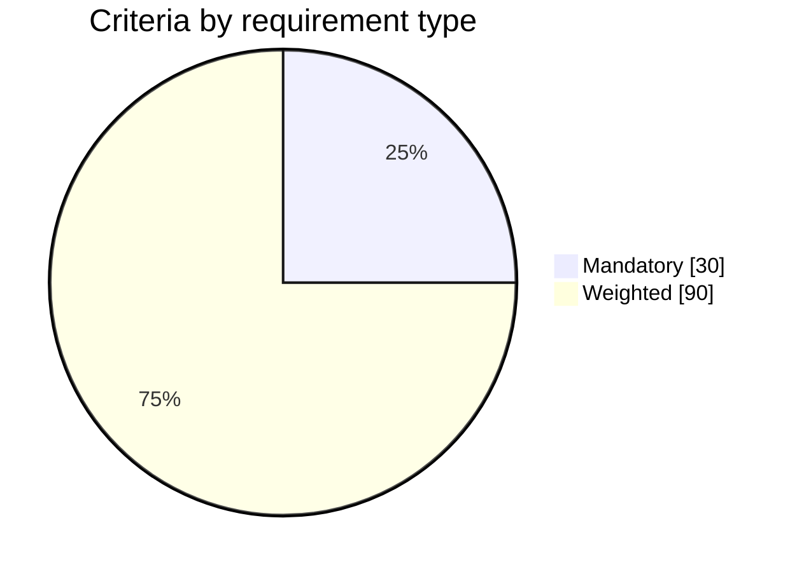
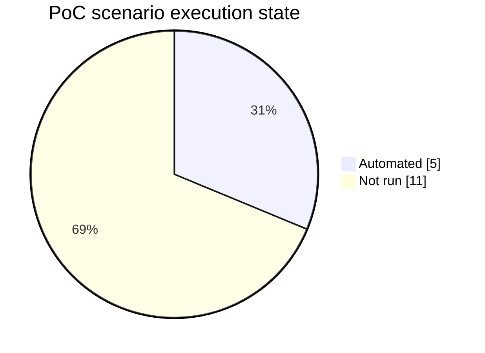
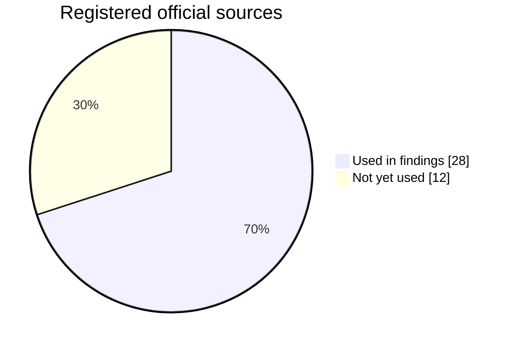

# Evidence-state snapshot

- Snapshot date: 2026-08-17
- Scope: canonical tracked repository data
- Decision use: show what can and cannot be concluded; this is not a platform score or ranking

The charts below are portable Markdown Mermaid views. Repository validation checks their values against the same CSV and Markdown sources used by the site Visual Atlas.

## Decision criteria structure

There are 120 criteria across 12 categories: 30 mandatory gates and 90 weighted criteria. All 120 evidence states remain `unknown`; the category weights are workshop defaults and are not approved.

<!-- chart-source: criteria-requirement-type -->

Source: [criteria.csv](../decision-matrix/criteria.csv) and [weights.yaml](../decision-matrix/weights.yaml).

## PoC execution state

Five of 16 aggregate status-register items have automated baseline evidence. Eleven register items are not run, including the live-cluster Gateway API acceptance/programming item and the aggregate portal/product and observability entries. Separately, the deep protocols define **28 atomic experiment cases**: 12 real-world, 7 portal and 9 observability cases. No candidate has completed a decision-grade comparative run of those atomic cases. Aggregate register rows and atomic cases overlap and are never added together as execution progress. Configuration, protocol depth or a runnable script is not counted as execution.

<!-- chart-source: poc-execution -->

Source: [PoC test plan](../poc/test-plan.md) and [validation report](validation-report.md).

| PoC inventory | Defined | Completed at decision-grade E3 | Current interpretation |
|---|---:|---:|---|
| Aggregate status-register items | 16 | 5 automated baseline items only | useful local evidence, not equivalent finalist proof |
| Atomic real-world protocol cases | 12 | 0 | all candidate × case cells begin not run |
| Atomic portal protocol cases | 7 | 0 | all candidate × case cells begin not run |
| Atomic observability protocol cases | 9 | 0 | all candidate × case cells begin not run |

## Official-source use

The source register contains 40 primary or official sources. Twenty-eight source IDs are explicitly cited in the claim register; twelve are registered but not yet decision-bearing there. Source volume is not criterion coverage.

<!-- chart-source: source-use -->

Source: [sources.csv](../research/sources.csv) and [findings.md](../research/findings.md).

## Decision-readiness register

| Indicator | Current state | Implication |
|---|---:|---|
| Bounded deployment archetypes | 7 | Every archetype requires Gate-1 edition/version/topology/entitlement/support resolution |
| Exact resolved options / populated option scorecards | 0 / 0 | No comparative ranking is supportable |
| Mandatory gates | 30 unknown | Product selection remains blocked |
| Assumptions | 10 open | Organization context is not yet confirmed |
| ADRs | 5 proposed | Evaluation and architecture decisions are not accepted |
| Risks | 20 active RE-1 scenario risks with inherent and residual targets | Organization-specific ratings and acceptance still require accountable review |
| Open questions | 36 decision-critical evidence requests | Each has an owner role, due gate, artifact, and explicit impact; none is closed by scenario assumptions |

The [principal review](methodology-review.md) converts this state into a steering recommendation. The [repository roadmap](../docs/39-repository-roadmap.md) defines the evidence-system gates, and the [delivery roadmap](../docs/36-implementation-roadmap.md) defines the organization delivery gates.
