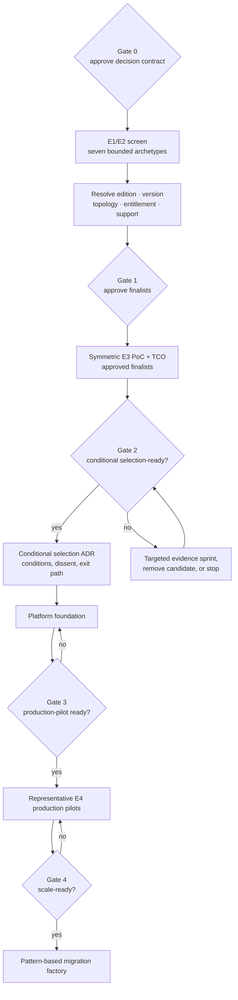

# Principal consultant methodology and decision-assurance review

- Review date: 2026-08-18
- Scope: repository structure, assessment method, evidence chain, documents, architecture, PoC material, audience briefings, charts, and presentation
- Evidence basis: committed repository content only; no stakeholder interviews, vendor briefings, commercial quotes, or organization validation were available
- Review stance: principal decision-assurance challenge of the repository evidence; the stakeholder Kong direction is an external business input, not a comparative result or production-fit approval by this report

## Executive verdict

The repository is a strong assessment scaffold and early evidence baseline. It is not yet a completed comparative platform assessment.

| Dimension | Maturity | Finding |
|---|---|---|
| Assessment framework | Strong scaffold | Strong gates, evidence levels, variant separation, unknown handling, falsification discipline, and a defined public/restricted evidence boundary |
| Evidence completion | Initial | All 120 criteria remain unknown; no bounded archetype has a resolved Gate-1 bill of materials or populated criterion-level scorecard |
| Comparative integrity | Developing | Deep symmetric dossiers and protocols now exist, but bounded archetypes are not yet resolved options and no equivalent E3 result exists |
| Governance readiness | Developing | Assumptions, risks, questions, weights, thresholds, and ADRs are visible but not operationally closed |
| Roadmap readiness | Strong scaffold | Repository and organization-delivery roadmaps now have explicit gates and decision rights; named assignments, capacity, dependencies, and dates remain to be mobilized |
| Audience communication | Strong scaffold | Six role-specific briefings sequence the same canonical evidence for executives, directors, architects, developers, DevOps/SRE, and platform teams |
| Executive decision readiness | Bounded direction only | Kong-specific option resolution and a reversible foundation can proceed; critical production scale remains premature |

The maturity labels are deliberately qualitative: **Initial** means decision evidence is largely uncollected; **Developing** means material controls exist but are not operationally complete; **Strong scaffold** means the method is well structured but not yet executed; and **Not ready** means the stated decision gates are unmet. These labels are not vendor or product scores.

Current maturity is **structured assessment / evidence collection with a stakeholder-selected planning direction**. The appropriate steering decision is to fund bounded Kong evidence closure, not to describe Kong production fit or migration scale as proven.

## Principal recommendation

| Decision | Principal recommendation | Status | Exit evidence |
|---|---|---|---|
| Evidence-closure programme | Approve the prerequisite-driven, stage-gated programme and the capacity to execute it; do not promise Gate 2 in 90 days | Approve Gate 0 only | Decision contract, accountable roles, calibrated inputs, approved environments/vendor access, capacity-loaded action register and evidence calendar |
| Kong platform direction | Proceed with one bounded, reversible Kong self-managed-hybrid foundation; do not infer production fit or authorize critical scale | Stakeholder direction; evidence conditional | Exact `KP-SMH1` BOM, E2 support/terms, E3 recovery/security/APIOps proof, E4 representative pilots, sustainable operating model and exit evidence |
| Counterfactual and custody choices | Benchmark Konnect as the same-vendor custody switch and retain a separate non-Kong exit; alternatives remain falsifiers rather than a parallel implementation programme | Required | Equivalent outcome contract, timed custody-switch/route-back proof, stable sensitivity and clean cross-platform rebuild evidence |
| Comparative benchmarks | Retain Azure APIM managed/self-hosted, Apigee X/Hybrid and the MuleSoft baseline as challenge, sensitivity and exit benchmarks rather than parallel production builds | Required | Equivalent decision-changing claims, candidate views and targeted counterfactual tests |
| Current-state baseline | Retain MuleSoft as the comparison and migration baseline, not the default target | Required | Workload inventory, capability decomposition, run-cost, migration effort, and dependency evidence |

### Steering ask

1. Record the stakeholder Kong direction and approve the reversible foundation and evidence-closure programme; do **not** approve critical production scale.
2. Assign accountable public roles or anonymized owner IDs and maintain the named-person/capacity map in restricted programme records.
3. Authorize the organization inputs, Kong access, environments, commercial work, and independent reviewers required to freeze and prove `KP-SMH1`, while retaining the documented counterfactuals.
4. Return at KP0/KP2 with the exact option and E2/E3 evidence to continue, narrow, switch custody to Konnect, choose another platform, or stop.

Explicitly excluded from this approval are unconditional vendor award, critical production scale, full migration funding, unconditioned contract commitment, and any claim that stakeholder preference or a local functional baseline proves enterprise operability.

The quantitative evidence snapshot and Markdown-renderable charts are maintained in [evidence-state.md](evidence-state.md); the same canonical datasets drive the site Visual Atlas.

## Review method

Every material conclusion should preserve this traceable chain:

> Business outcome → requirement → mandatory gate → evidence → observable test → score → implication → decision

The review applies three lenses:

1. **Repository assurance:** completeness, provenance, freshness, reproducibility, navigation, visual parity, and public-safe content.
2. **Decision assurance:** scope, alternatives, approved gates, evidence quality, comparative fairness, economics, sensitivity, risk, and decision rights.
3. **Role-specific communication:** decision requested, appropriate level of detail, trade-offs, uncertainty, risks, roadmap, and accountable next actions for each audience.

A conclusion remains provisional whenever one of those links is missing.

## What is strong

- Bounded deployment archetypes are kept separate, and the [assessment methodology](../docs/03-assessment-methodology.md) prohibits scoring until each Gate-1 option definition is exact.
- Mandatory gates cannot be averaged away, and unknown evidence is never treated as pass in the [scoring guide](../decision-matrix/scoring-guide.md).
- Evidence confidence progresses from assertion to official documentation, vendor confirmation, repeatable lab, and representative pilot in the [assessment methodology](../docs/03-assessment-methodology.md).
- The [Kong-first hypothesis](../docs/04-kong-first-hypothesis.md) preserves the historical evidence finding, while the [Kong platform strategy](../docs/47-kong-enterprise-platform-strategy.md) records the later stakeholder sequencing decision, self-managed responsibilities, outcome gates, Konnect benchmark and non-Kong exit.
- The [executive summary](../docs/00-executive-summary.md) distinguishes stakeholder direction, reversible foundation, demonstrated fit, and permission to scale.
- The [architecture catalog](../architecture/README.md) designates one vendor-neutral logical target and makes candidate-specific views visibly provisional.
- The [audience guide](../docs/40-audience-guide.md) gives six roles different decisions, reading sequences, visuals, and meeting closes without duplicating the underlying evidence.
- The PoC documentation separates 16 aggregate status-register items from 28 atomic decision-grade real-world, portal and observability cases, and does not count protocol depth as execution in [poc/README.md](../poc/README.md).
- Forty-three principal studies now enforce answer-first framing, mechanism/failure depth, counter-evidence, proof plans and inline interpreted figures; this is content maturity, not candidate evidence. The canonical P1–P10 taxonomy structures reusable proof, the industry-practices study maps it to operating patterns and synthetic cases, the Kong multicloud roadmap sequences candidate evidence, and the Kong platform strategy turns the stakeholder direction into a falsifiable deployment and operating plan.
- The [citation-coverage report](source-coverage.md) keeps contextual official links visibly outside the score-capable source/finding chain until promoted.

## Priority findings

| Priority | Finding | Required disposition |
|---|---|---|
| P0 | The 120 current `acceptance_test` cells are discovery prompts rather than measurable acceptance conditions | Refine the 30 mandatory gates first with measure, threshold, scenario, evidence level, decision owner, and exception rule before scoring |
| P0 | Seven bounded archetypes do not yet have resolved Gate-1 bills of materials or a canonical criterion-by-option evidence ledger | Resolve the option fields, populate the [ledger template](../decision-matrix/evidence-ledger-template.csv), and generate scorecards/charts from it |
| P0 | No exact option has observed E3 evidence, despite deep research and protocols | Freeze `KP-SMH1`, preserve decision-changing counterfactuals, and execute the applicable atomic E3 cases without treating stakeholder preference as proof |
| P0 | Organization-specific inputs, TCO, support, staffing, migration, and exit evidence are absent | Keep critical production scale and irreversible commitment deferred; complete the restricted Kong evidence workstream before the applicable gate |
| P1 | The roadmaps define roles and gates but not actual capacity, dependencies, dates, or accepted exit artifacts | Mobilize the [action register](../templates/assessment-action-register-template.csv) under an accountable decision owner |
| P1 | Twenty RE-1 risks have scenario ratings and 36 questions carry owner/due-gate/impact fields, but organization likelihood/impact acceptance, assumptions, ADRs and questions remain unclosed | Calibrate and approve risk scales and private named ownership; publish no organization heatmap until observed inputs exist |
| P1 | The corpus contains 235 unique contextual external citations outside the authoritative source register | Promote only decision-bearing claims into `sources.csv` plus a mapped finding; keep the generated coverage ledger current and contextual links non-scoring |

## Material gaps

### 1. Decision evidence and acceptance conditions are incomplete

All 120 criteria are currently `unknown`, including 30 mandatory gates. No bounded archetype has closed its option-resolution record or has a populated criterion-level scorecard. The existing acceptance text restates each criterion and is not yet a measurable pass/fail condition. A candidate ranking must not be published until the gates are operational and the agreed evidence/category threshold, common-evidence, bounds and maximum-regret rules are met.

### 2. The resolved-option evidence model is not populated

The method keeps seven bounded archetypes separate, but they are not exact until edition, version, topology, region, entitlement, plugin and support fields close. The current Markdown scorecards remain unscored placeholders. Use a canonical ledger keyed by `criterion_id + option_id`; preserve outcome, claim, source/version, topology, entitlement, test, artifact, reviewer role, limitation, freshness, implication, exception, and decision state.

### 3. Comparative research is deep; decision proof is still absent

The logical target is vendor-neutral, and Kong, APIM, Apigee, MuleSoft and secondary-product studies now use deep, mechanism-level dossiers, bounded archetypes, failure analysis, inline figures and Gate-1 blockers. That symmetry is E1 research design, not comparative execution. Exact physical bills of materials, organization topology, entitlement/support facts and E3 result bundles remain open.

The authoritative register contains 40 official sources: 28 source IDs are used directly by 24 findings and 12 remain unused there. The wider article corpus contains 271 unique external citations; 36 resolve to registered URLs and 235 remain explicitly contextual under the generated coverage ledger. Five of 16 aggregate PoC register items have automated baseline evidence and 11 remain not run. The 28 atomic real-world, portal and observability protocol cases are designs, not observed results; they must be executed for the exact Kong target and any decision-changing counterfactual.

### 4. Organizational facts remain assumptions

All ten entries in the [assumption register](../docs/02-current-state-assumptions.md) remain open. Each needs an accountable public role or anonymized owner ID, a restricted named owner, validation evidence, target gate/date, and explicit decision impact.

### 5. Governance controls are not operational

- Category weights remain workshop defaults rather than approved decision weights.
- The steering committee has not approved an evidence-coverage threshold.
- Five ADRs remain proposed.
- Twenty risks carry RE-1 scenario likelihood/impact/exposure and owner fields, but organization calibration, acceptance, due dates and trend remain unapproved.
- Thirty-six open questions carry functional owners, due gates and decision consequences; accountable named ownership, target dates and closure evidence remain unaccepted.

### 6. Economics and deliverability remain open

Organization-specific TCO, staffing, support boundaries, commercial terms, migration effort, exit cost, and benefits realization are not complete. These are decision criteria, not post-selection implementation details.

### 7. Public/restricted evidence handling is defined but not implemented

The method now defines what may be public. A restricted evidence store, access model, retention rules, named-person mapping, non-sensitive reference convention, and review process still need to be established before quotes, NDA responses, organization topology, security findings, or raw logs are collected.

### 8. Roadmap accountability must be mobilized

The [repository roadmap](../docs/39-repository-roadmap.md) and [delivery roadmap](../docs/36-implementation-roadmap.md) now define gates, roles, and exit evidence. They remain planning scaffolds until capacity, dependencies, target dates, accountable owner IDs, approvers, and accepted artifacts are entered in the action register.

## Required remediation

1. Approve the decision contract: sponsor, decision owner, scope, non-goals, gates, weights, coverage threshold, review calendar, public/restricted boundary, dissent, and exception process.
2. Make the 30 mandatory gates observable and testable before refining lower-priority weighted criteria.
3. Resolve Gate-1 option definitions, populate the criterion-by-option evidence ledger, and generate common-evidence/category coverage, bounds, maximum-regret and sensitivity views from it.
4. Confirm organization inputs and convert assumptions into evidenced facts or explicit constraints.
5. Complete the exact `KP-SMH1` physical bill of materials and retain equivalent decision-changing counterfactuals before critical pilot admission.
6. Run the applicable hard-gated protocol cases for `KP-SMH1` and any custody-switch or alternative option that could change the decision, using equivalent workloads, policy chains, identity/PKI controls, failure modes, validity rules and evidence capture.
7. Complete TCO, staffing, support, contract, migration, benefits, and exit analysis with organization-specific restricted inputs.
8. Rate and treat risks using approved scales; peer-review evidence and record dissent, conditions, and exceptions.
9. Populate role/owner ID, capacity, dependency, date/gate, status, exit evidence, approver, and decision impact in the action register.
10. Issue an evidence-backed production-fit ADR only after Gate 2; admit production pilots only after Gate 3; authorize migration at scale only after representative E4 evidence passes Gate 4.

## Definition of decision-ready

### Conditional production-fit decision — Gate 2

An evidence-backed production-fit recommendation is decision-ready only when:

- every mandatory gate is pass, fail, or supported by an approved time-bounded exception;
- the approved weighted-evidence and category thresholds are reached for every finalist;
- exact resolved options have independently reviewed scorecards generated from the canonical ledger;
- common-evidence comparison, full-weight bounds and maximum regret do not expose an unresolved rank reversal;
- representative E3 security, failure, performance, API operations, observability, and migration-pattern tests have execution artifacts;
- TCO and support assumptions use actual quotes and a documented resource model;
- sensitivity testing identifies any unstable ranking;
- architecture, security, operations, commercial, and program owners sign off or record dissent;
- the selection ADR records the recommendation, conditions, exceptions, exit path, and review date.

### Production scale-ready — Gate 4

Authorization to scale migrations additionally requires:

- the selected platform foundation has passed Gate 3 production-readiness review;
- at least two representative E4 production pilots cover gateway-dominant and integration-dominant workload patterns;
- measured SLO, security, operability, support demand, cost, rollback, and reconciliation evidence meets approved thresholds;
- platform, domain, security, SRE, commercial, and programme owners accept the migration patterns, capacity, residual risks, and benefits baseline.

Re-run this review at every roadmap gate, before the production-fit ADR, and before Gate 4 authorizes migration at scale.
