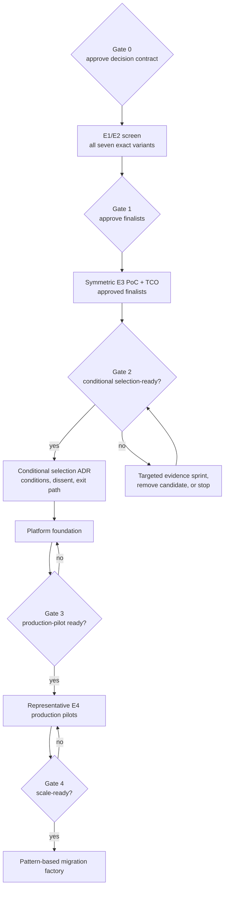

# Principal consultant methodology and decision-assurance review

- Review date: 2026-08-17
- Scope: repository structure, assessment method, evidence chain, documents, architecture, PoC material, audience briefings, charts, and presentation
- Evidence basis: committed repository content only; no stakeholder interviews, vendor briefings, commercial quotes, or organization validation were available
- Review stance: independent decision-assurance challenge; no platform selection is approved by this report

## Executive verdict

The repository is a strong assessment scaffold and early evidence baseline. It is not yet a completed comparative platform assessment.

| Dimension | Maturity | Finding |
|---|---|---|
| Assessment framework | Strong scaffold | Strong gates, evidence levels, variant separation, unknown handling, falsification discipline, and a defined public/restricted evidence boundary |
| Evidence completion | Initial | All 120 criteria remain unknown and no exact deployment variant has a populated criterion-level scorecard |
| Comparative integrity | Developing | The comparison model is sound, but research, candidate architecture, and executable proof remain asymmetric |
| Governance readiness | Developing | Assumptions, risks, questions, weights, thresholds, and ADRs are visible but not operationally closed |
| Roadmap readiness | Strong scaffold | Repository and organization-delivery roadmaps now have explicit gates and decision rights; named assignments, capacity, dependencies, and dates remain to be mobilized |
| Audience communication | Strong scaffold | Six role-specific briefings sequence the same canonical evidence for executives, directors, architects, developers, DevOps/SRE, and platform teams |
| Executive decision readiness | Not ready | The current direction is appropriately provisional; a final recommendation would be premature |

The maturity labels are deliberately qualitative: **Initial** means decision evidence is largely uncollected; **Developing** means material controls exist but are not operationally complete; **Strong scaffold** means the method is well structured but not yet executed; and **Not ready** means the stated decision gates are unmet. These labels are not vendor or product scores.

Current maturity is **structured assessment / evidence collection**. The appropriate steering decision is to approve evidence closure, not to select a product.

## Principal recommendation

| Decision | Principal recommendation | Status | Exit evidence |
|---|---|---|---|
| Evidence-closure programme | Approve the indicative 90-day, stage-gated programme and the capacity to execute it | Approve now | Decision contract, accountable roles, approved environments/vendor access, and action register |
| Conditional product/platform selection | Defer any vendor selection, purchase, or migration commitment | Not ready | Gate 2: mandatory gates disposed, approved evidence threshold met, exact-variant ledger reviewed, symmetric E3 proof, TCO/support and sensitivity complete |
| Priority validation | Treat Kong Konnect hybrid and self-managed Kong as low-confidence hypotheses, subject first to the same E1/E2 screen as every variant | Conditional | Official topology/entitlement screen supports finalist status; no disqualifying gate emerges |
| Comparative benchmarks | Retain Azure APIM managed/self-hosted and Apigee X/Hybrid through the approved down-select | Required | Equivalent claims, candidate views, vendor confirmations, and symmetric finalist tests |
| Current-state baseline | Retain MuleSoft as the comparison and migration baseline, not the default target | Required | Workload inventory, capability decomposition, run-cost, migration effort, and dependency evidence |

### Steering ask

1. Approve the evidence-closure programme through Gate 2; do **not** approve a product selection.
2. Assign accountable public roles or anonymized owner IDs and maintain the named-person/capacity map in restricted programme records.
3. Authorize the organization inputs, vendor access, environments, commercial work, and independent reviewers required for comparable evidence.
4. Return at Gate 1 after the E1/E2 screen to approve the evidence-led finalist set and symmetric E3 PoC scope.

Explicitly excluded from this approval are vendor award, production platform build, full migration funding, contract commitment, and any claim that a local functional baseline proves enterprise operability.

The quantitative evidence snapshot and Markdown-renderable charts are maintained in [evidence-state.md](evidence-state.md); the same canonical datasets drive the site Visual Atlas.

## Review method

Every material conclusion should preserve this traceable chain:

> Business outcome → requirement → mandatory gate → evidence → observable test → score → implication → decision

The review applies three lenses:

1. **Repository assurance:** completeness, provenance, freshness, reproducibility, navigation, visual parity, and public-safe content.
2. **Decision assurance:** scope, alternatives, approved gates, evidence quality, comparative fairness, economics, sensitivity, risk, and decision rights.
3. **Role-specific communication:** decision requested, appropriate level of detail, trade-offs, uncertainty, risks, roadmap, and accountable next actions for each audience.

A conclusion remains provisional whenever one of those links is missing.

## What is strong

- Exact deployment variants are evaluated separately in the [decision matrix](../decision-matrix/README.md).
- Mandatory gates cannot be averaged away, and unknown evidence is never treated as pass in the [scoring guide](../decision-matrix/scoring-guide.md).
- Evidence confidence progresses from assertion to official documentation, vendor confirmation, repeatable lab, and representative pilot in the [assessment methodology](../docs/03-assessment-methodology.md).
- The [Kong-first hypothesis](../docs/04-kong-first-hypothesis.md) is explicitly low-confidence, includes counter-hypotheses, and has falsification conditions.
- The [executive summary](../docs/00-executive-summary.md) distinguishes evidence closure, priority validation, and product selection.
- The [architecture catalog](../architecture/README.md) designates one vendor-neutral logical target and makes candidate-specific views visibly provisional.
- The [audience guide](../docs/40-audience-guide.md) gives six roles different decisions, reading sequences, visuals, and meeting closes without duplicating the underlying evidence.
- The PoC documentation separates executed Docker evidence, static/configured assets, unexecuted Kubernetes proof, and not-run enterprise scenarios in [poc/README.md](../poc/README.md).

## Priority findings

| Priority | Finding | Required disposition |
|---|---|---|
| P0 | The 120 current `acceptance_test` cells are discovery prompts rather than measurable acceptance conditions | Refine the 30 mandatory gates first with measure, threshold, scenario, evidence level, decision owner, and exception rule before scoring |
| P0 | Seven exact variants do not yet have a canonical criterion-by-variant evidence ledger | Populate the [ledger template](../decision-matrix/evidence-ledger-template.csv) and generate scorecards/charts from it |
| P0 | The Kong priority-validation inference remains supported by deeper material than its alternatives | Complete an equivalent E1/E2 screen and candidate view for every variant before approving finalists; run E3 tests symmetrically |
| P0 | Organization-specific inputs, TCO, support, staffing, migration, and exit evidence are absent | Keep selection deferred and complete the restricted evidence workstream before Gate 2 |
| P1 | The roadmaps define roles and gates but not actual capacity, dependencies, dates, or accepted exit artifacts | Mobilize the [action register](../templates/assessment-action-register-template.csv) under an accountable decision owner |
| P1 | Risks are identified but not rated; assumptions, ADRs, and open questions remain unclosed | Add approved risk scales and named private ownership; publish no heatmap until values exist |

## Material gaps

### 1. Decision evidence and acceptance conditions are incomplete

All 120 criteria are currently `unknown`, including 30 mandatory gates. No exact deployment variant has a populated criterion-level scorecard. The existing acceptance text restates each criterion and is not yet a measurable pass/fail condition. A candidate ranking must not be published until the gates are operational and the agreed evidence-coverage threshold is met.

### 2. The exact-variant evidence model is not populated

The method requires seven separately evaluated deployment variants, but the current Markdown scorecards are family-level placeholders. Use a canonical ledger keyed by `criterion_id + variant_id`; preserve outcome, claim, source/version, topology, entitlement, test, artifact, reviewer role, limitation, freshness, implication, exception, and decision state.

### 3. Comparative architecture and proof remain asymmetric

The logical target is now vendor-neutral, but only Kong has detailed candidate control/data-plane views. Equivalent APIM, Apigee, and retained-Mule physical views must use the same frame: ownership, request path, configuration, telemetry/metadata, persistence, locality, support boundary, assumptions, and required evidence.

The repository contains 27 official sources, of which 12 are Kong sources. Fifteen source IDs are cited in the claim register and twelve are not yet used there. Five of fourteen PoC scenarios have automated baseline evidence; nine remain not run. Equivalent decision-critical scenarios must be executed across the approved finalist variants.

### 4. Organizational facts remain assumptions

All ten entries in the [assumption register](../docs/02-current-state-assumptions.md) remain open. Each needs an accountable public role or anonymized owner ID, a restricted named owner, validation evidence, target gate/date, and explicit decision impact.

### 5. Governance controls are not operational

- Category weights remain workshop defaults rather than approved decision weights.
- The steering committee has not approved an evidence-coverage threshold.
- Five ADRs remain proposed.
- Risks lack approved likelihood, impact, residual exposure, due date, status, and trend.
- Open questions and assumptions identify functional owners at best, not accepted deadlines and decision consequences.

### 6. Economics and deliverability remain open

Organization-specific TCO, staffing, support boundaries, commercial terms, migration effort, exit cost, and benefits realization are not complete. These are decision criteria, not post-selection implementation details.

### 7. Public/restricted evidence handling is defined but not implemented

The method now defines what may be public. A restricted evidence store, access model, retention rules, named-person mapping, non-sensitive reference convention, and review process still need to be established before quotes, NDA responses, organization topology, security findings, or raw logs are collected.

### 8. Roadmap accountability must be mobilized

The [repository roadmap](../docs/39-repository-roadmap.md) and [delivery roadmap](../docs/36-implementation-roadmap.md) now define gates, roles, and exit evidence. They remain planning scaffolds until capacity, dependencies, target dates, accountable owner IDs, approvers, and accepted artifacts are entered in the action register.

## Required remediation

1. Approve the decision contract: sponsor, decision owner, scope, non-goals, gates, weights, coverage threshold, review calendar, public/restricted boundary, dissent, and exception process.
2. Make the 30 mandatory gates observable and testable before refining lower-priority weighted criteria.
3. Populate the criterion-by-variant evidence ledger and generate all scorecards and coverage charts from it.
4. Confirm organization inputs and convert assumptions into evidenced facts or explicit constraints.
5. Produce equivalent candidate physical views and complete the E1/E2 screen before selecting finalists.
6. Run symmetric finalist PoCs using equivalent workloads, policy chains, identity/PKI controls, failure modes, and evidence capture.
7. Complete TCO, staffing, support, contract, migration, benefits, and exit analysis with organization-specific restricted inputs.
8. Rate and treat risks using approved scales; peer-review evidence and record dissent, conditions, and exceptions.
9. Populate role/owner ID, capacity, dependency, date/gate, status, exit evidence, approver, and decision impact in the action register.
10. Issue a conditional selection only after Gate 2; admit production pilots only after Gate 3; authorize migration at scale only after representative E4 evidence passes Gate 4.

## Definition of decision-ready

### Conditional selection-ready — Gate 2

A conditional selection recommendation is decision-ready only when:

- every mandatory gate is pass, fail, or supported by an approved time-bounded exception;
- the approved weighted-evidence threshold is reached for every finalist;
- exact deployment variants have independently reviewed scorecards generated from the canonical ledger;
- representative E3 security, failure, performance, API operations, observability, and migration-pattern tests have execution artifacts;
- TCO and support assumptions use actual quotes and a documented resource model;
- sensitivity testing identifies any unstable ranking;
- architecture, security, operations, commercial, and program owners sign off or record dissent;
- the selection ADR records the recommendation, conditions, exceptions, exit path, and review date.

### Production scale-ready — Gate 4

Authorization to scale migrations additionally requires:

- the selected platform foundation has passed Gate 3 production-readiness review;
- at least two representative E4 production pilots cover gateway-dominant and integration-dominant workload patterns;
- measured SLO, security, operability, support demand, cost, rollback, and reconciliation evidence meets approved thresholds;
- platform, domain, security, SRE, commercial, and programme owners accept the migration patterns, capacity, residual risks, and benefits baseline.

Re-run this review at every roadmap gate, before conditional selection, and before Gate 4 authorizes migration at scale.
