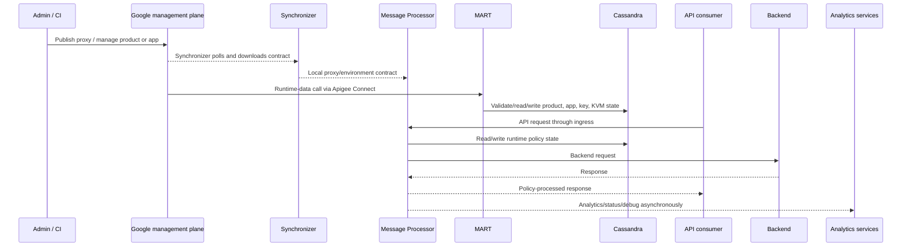

# Apigee research dossier

## Snapshot and decision boundary

- Reviewed: 2026-08-17
- Bounded archetypes: Google-managed Apigee and Apigee Hybrid must be evaluated separately
- Hybrid research anchor: 1.16; the exact supported platform combination remains a Gate-1 bill-of-materials decision and must be rechecked before execution
- Evidence present: `E1` official Google Cloud documentation
- Evidence absent: `E2` contract/vendor commitments, `E3` lab execution, `E4` representative pilot
- Decision status: no score, rank, or winner is supportable

Registered primary sources G-001 through G-004 are in [sources.csv](sources.csv). Additional official links are attached to individual claims. “Latest” links are intentionally used for volatile operational procedures; evidence artifacts must record the resolved version and retrieval date.

Decision-facing synthesis: [Apigee assessment](../docs/21-apigee-assessment.md) and [Hybrid-fit proof design](../docs/22-apigee-hybrid-fit.md).

## Evidence-state key

| Label | Meaning |
|---|---|
| `E1 confirmed` | Current Google documentation directly states the mechanism |
| `E1 conditional` | Statement depends on exact version/platform/organization/pricing model or is time-sensitive |
| `Interpretation` | Architecture consequence derived from cited mechanisms |
| `Unknown` | Organization-specific or execution evidence is absent |
| `E2/E3/E4 required` | Contract, reproducible execution, or pilot is required |

## Bounded product-archetype ledger

AP-V01 through AP-V05 prevent managed, Hybrid and commercial models from being blended. They are not yet option records: exact region/instance/environment, subscription/add-ons/support, or Hybrid patch/image/platform/dependency configuration remains unresolved.

| Research ID | Variant | State/source | Boundary |
|---|---|---|---|
| AP-V01 | Google-managed Apigee | `E1 confirmed` — [G-003 feature overview](https://cloud.google.com/apigee/docs/api-platform/get-started/apigee-feature-summary) | Google manages management and runtime infrastructure; API traffic executes in Google-managed instances |
| AP-V02 | Apigee Hybrid | `E1 confirmed` — [G-001](https://cloud.google.com/apigee/docs/hybrid/latest/what-is-hybrid) | Google manages cloud management services; customer installs/operates runtime plane on supported Kubernetes |
| AP-V03 | Managed Apigee subscription | `E1 conditional` — [organization and entitlement model](https://cloud.google.com/apigee/docs/api-platform/fundamentals/organization-structure) | Purchased environment/proxy/add-on terms are contract-specific |
| AP-V04 | Managed Apigee pay-as-you-go | `E1 conditional` — [pay-as-you-go overview](https://cloud.google.com/apigee/docs/api-platform/reference/pay-as-you-go-updated-overview) | Applies to managed Apigee, not Hybrid; environment type/region, calls and deployments are metered constructs |
| AP-V05 | Evaluation organization | `E1 confirmed non-production` — [organization types](https://cloud.google.com/apigee/docs/api-platform/fundamentals/organization-structure#organization-types) | Time-limited and lacks production scale/flexibility; not PoC evidence for a paid topology |

## Hybrid mechanisms: request, configuration, runtime data, telemetry

Google explicitly distinguishes Synchronizer configuration from MART runtime-data calls, and states that MART does not receive proxy requests, in [G-001 Hybrid architecture](https://cloud.google.com/apigee/docs/hybrid/latest/what-is-hybrid). This prevents a common but false “one control-plane link” model.

## Claim ledger

| ID | Claim and decision implication | State/source | Qualification/counter-evidence |
|---|---|---|---|
| AP-C01 | Hybrid's management plane is Google-operated; the customer operates runtime services in supported Kubernetes. | `E1 confirmed` — [G-001](https://cloud.google.com/apigee/docs/hybrid/latest/what-is-hybrid) | Local runtime does not create locally authoritative administration/analytics |
| AP-C02 | All proxy traffic passes through and is processed in the customer runtime plane. | `E1 confirmed` — [G-001](https://cloud.google.com/apigee/docs/hybrid/latest/what-is-hybrid#about-the-runtime-plane) | Analytics/debug/log/config/identity data have separate flows |
| AP-C03 | Message Processors execute proxies/policies and load deployed resources from local storage. | `E1 confirmed` — [G-001 Message Processor](https://cloud.google.com/apigee/docs/hybrid/latest/what-is-hybrid#message-processor) | Policy dependencies on Cassandra or external systems can still fail during cloud independence |
| AP-C04 | Synchronizer polls management, downloads a JSON contract to local filesystem, and message processors continue from local contract during management link loss. | `E1 confirmed` — [G-001 Synchronizer](https://cloud.google.com/apigee/docs/hybrid/latest/what-is-hybrid#synchronizer) | Fresh-pod startup, contract persistence and scale-out under partition require `E3` |
| AP-C05 | Contract contents include proxy/shared-flow deployments, hooks, environment info, resources, target servers, TLS settings, KVM names and masks. | `E1 confirmed` — [G-001](https://cloud.google.com/apigee/docs/hybrid/latest/what-is-hybrid#synchronizer) | Some sensitive configuration remains authoritative in management plane |
| AP-C06 | Cassandra stores KMS/API product/developer/app/credential/OAuth, KVM, quota, cache and monetization runtime data. | `E1 confirmed` — [G-001 Cassandra](https://cloud.google.com/apigee/docs/hybrid/latest/what-is-hybrid#cassandra-datastore) and [data location](https://cloud.google.com/apigee/docs/hybrid/latest/where-data.html) | Cassandra is business/security state and a direct runtime dependency |
| AP-C07 | MART is stateless, validates management calls, and reads/writes Cassandra; management reaches it via Apigee Connect. | `E1 confirmed` — [G-001 MART](https://cloud.google.com/apigee/docs/hybrid/latest/what-is-hybrid#management-api-for-runtime-data-mart) | MART/Connect outage affects product/app/key/KVM administration differently from proxy traffic |
| AP-C08 | Proxies, target servers, truststores and keystores are management-plane data replicated to runtime. | `E1 confirmed` — [where data is stored](https://cloud.google.com/apigee/docs/hybrid/latest/where-data.html#data-stored-in-the-management-plane) | “All data is local” is false |
| AP-C09 | Analytics, deployment status and debug are sent asynchronously from runtime to management; logs/metrics go to the customer's Google Cloud project. | `E1 confirmed` — [where data is stored](https://cloud.google.com/apigee/docs/hybrid/latest/where-data.html#data-sent-from-the-runtime-plane-to-the-management-plane) | Field classification, buffering, retention, region, support access and loss behavior require `E2/E3` |
| AP-C10 | Audit logs, RBAC and users are management-plane only. | `E1 confirmed` — [where data is stored](https://cloud.google.com/apigee/docs/hybrid/latest/where-data.html#data-stored-only-in-the-management-plane) | Local processing does not meet a fully local administration requirement |
| AP-C11 | Hybrid can use a data-residency configuration for specified management-plane data. | `E1 conditional` — [data residency link from data-location page](https://cloud.google.com/apigee/docs/hybrid/latest/where-data.html#management-plane-data-and-data-residency) | Do not generalize to all logs, analytics, support, audit or contract data; exact terms `E2 required` |
| AP-C12 | A typical runtime includes MART, controller/watcher, ingress/service mesh, runtime, Sync, UDCA, telemetry, cert-manager, Cassandra and Redis. | `E1 confirmed` — [Cassandra backup overview](https://cloud.google.com/apigee/docs/hybrid/latest/cassandra-backup-overview) | Platform footprint is larger than the four “major components” summary |
| AP-C13 | Cassandra is the component requiring persistent backup; other listed components can be reinstalled from existing configuration. | `E1 confirmed` — [backup overview](https://cloud.google.com/apigee/docs/hybrid/latest/cassandra-backup-overview) | Does not prove backup success, app-consistent RPO/RTO, or restore of all external dependencies |
| AP-C14 | Backup availability and retention depend on infrastructure the customer provides. | `E1 confirmed` — [backup overview](https://cloud.google.com/apigee/docs/hybrid/latest/cassandra-backup-overview) | Managed Google control plane does not own customer runtime DR |
| AP-C15 | Multi-region recovery redirects traffic to healthy regions, decommissions failed region and recreates/recovers it; full disaster uses backup. | `E1 confirmed` — [multi-region restore](https://cloud.google.com/apigee/docs/hybrid/latest/restore-cassandra-multi-region) | Surviving capacity, traffic steering, RPO/RTO and operator time are unproven |
| AP-C16 | In a multi-organization deployment, restore restores all organizations; restoring one organization is not supported. | `E1 confirmed` — [multi-region restore scope](https://cloud.google.com/apigee/docs/hybrid/latest/restore-cassandra-multi-region) | Consolidation changes recovery blast radius and tenant isolation |
| AP-C17 | Hybrid support is tied to a matrix of Hybrid, Kubernetes/platform, Cassandra, cert-manager and other versions. | `E1 confirmed` — [G-004](https://cloud.google.com/apigee/docs/hybrid/supported-platforms) | One supported component version does not validate an unsupported combination |
| AP-C18 | Hybrid minor versions are supported for at most 12 months from original release; dated EOLs are published. | `E1 conditional` — [G-004 support window](https://cloud.google.com/apigee/docs/hybrid/supported-platforms#supported-versions) | Snapshot is volatile; organization upgrade throughput must be proven |
| AP-C19 | Current Hybrid 1.16 documentation includes AKS as supported for a bounded Kubernetes range. | `E1 conditional` — [G-004 matrix](https://cloud.google.com/apigee/docs/hybrid/supported-platforms) | Recheck exact patch and AKS version immediately before install |
| AP-C20 | AKS installation guidance calls for runtime/data node pools and NTP synchronization because Cassandra relies on it. | `E1 confirmed` — [AKS cluster guide](https://cloud.google.com/apigee/docs/hybrid/latest/install-create-cluster) | Node/zone/storage/time design and monitoring remain customer responsibility |
| AP-C21 | Apigee organization maps one-to-one to a Google Cloud project; environments and environment groups define deployment and hostname routing. | `E1 confirmed` — [organization structure](https://cloud.google.com/apigee/docs/api-platform/fundamentals/organization-structure) and [environment groups](https://cloud.google.com/apigee/docs/api-platform/fundamentals/environments-overview) | Org/environment design affects IAM, quota, failure, entitlement and exit boundaries |
| AP-C22 | In managed Apigee, an environment must attach to a regional runtime instance and environment group to serve traffic. | `E1 confirmed` — [environment operations](https://cloud.google.com/apigee/docs/api-platform/fundamentals/environments-working-with) | Region attachment is an architecture/commercial decision, not a label |
| AP-C23 | API proxy revisions can be exported/imported as configuration bundles. | `E1 confirmed` — [proxy bundle export](https://cloud.google.com/apigee/docs/api-platform/fundamentals/download-api-proxies) | Bundle does not contain all product/app/key/runtime state or guarantee target policy parity |
| AP-C24 | Publishing data for developers/apps/products has an export path to Cloud Storage in current UI/docs. | `E1 confirmed` — [publishing-data export](https://cloud.google.com/apigee/docs/api-platform/publish/adding-developers-your-api-product#exporting-publishing-data) | Credentials/tokens, relationship fidelity, replayability and secure handling need proof |
| AP-C25 | Analytics can be exported asynchronously to Cloud Storage or BigQuery; permissions and date-range rules apply. | `E1 confirmed` — [analytics export](https://cloud.google.com/apigee/docs/api-platform/analytics/export-data) | Export feature is not proof of full history/schema/report portability |
| AP-C26 | Some features/limits differ between managed Apigee and Hybrid and by organization/commercial model. | `E1 confirmed` — [G-003](https://cloud.google.com/apigee/docs/api-platform/get-started/apigee-feature-summary) and [limits](https://cloud.google.com/apigee/docs/api-platform/reference/limits) | Do not score at family level; contract entitlements remain `E2` |

## Runtime-state and dependency matrix

| State/dependency | Request-path role | Change-path role | Failure implication to test |
|---|---|---|---|
| Local contract | Proxy/policy configuration for MPs | Synchronizer refreshes from management | stale/divergent config; restart/scale behavior |
| Cassandra | Credentials, products/apps, OAuth, KVM, quota, cache | MART changes runtime entities | auth/quota/cache/management failure, quorum/storage/time effects |
| MART/Connect | Not in proxy request path | management access to runtime state | serving can remain while revocation/onboarding/config operations fail |
| Ingress/service mesh | Direct request path | certificate/routing configuration | total ingress outage, rotation and cross-layer support seam |
| UDCA/analytics | Normally off synchronous business response | evidence export | buffer/backpressure/loss/duplicates/late evidence |
| Google IAM/service accounts | Cloud-channel authentication | install, Sync, Connect, telemetry and administration | credential revocation/expiry and workload identity recovery |
| AKS/node/storage/DNS | Hosts every runtime component | scheduling, image pull, endpoints | customer-operated SLO and coupled platform lifecycle |
| Backup target | no normal request role | Cassandra DR | target outage, corruption, credentials, selective restore and RPO/RTO |

## Enterprise reference-case mapping

Use [RE-1](../docs/41-enterprise-reference-case.md) with the shared IDs:

| Journey/failure | Apigee path/state | Evidence question |
|---|---|---|
| J-01 / I-01 money transfer and lost response | ingress → MP policy → backend; idempotency/retry/audit | can proxy/client retries duplicate a committed transaction and can one correlation ID prove outcome? |
| J-02 account summary | MP, cache/KVM, multiple backends, analytics | staleness, partial backend failure, cache invalidation and evidence locality |
| J-03 partner payment initiation | product/app/API key or OAuth in Cassandra, TLS config, quota | key/product propagation, counter consistency, revocation during MART/Connect partition |
| J-04 onboarding | proxy transformation/validation, PII, debug/analytics | policy size/performance and which sensitive fields leave runtime |
| J-05 settlement file | payload/streaming limits and asynchronous integration boundary | whether proxy is appropriate versus a separate integration runtime |
| J-06 / I-02 config propagation and stale restarted replica | management → Synchronizer → local contract → MPs | existing/new/restarted pod behavior through partition and reconcile |
| I-03 certificate rollover | management-plane TLS state replicated in contract plus ingress certs | zero-loss rotation, old/new trust and rollback |
| I-04 noisy neighbour | shared Cassandra/ingress/cluster/organization and per-environment runtime | isolation under CPU, connection, storage and quota pressure |
| I-05 telemetry backpressure | MP/UDCA → analytics and customer Google project | buffer pressure, traffic impact, loss/duplication and late arrival |
| I-06 regional failover/stale data | global steering, regional MPs, multi-region Cassandra | capacity, replication consistency, recovery and restore scope |
| I-07/I-08 schema drift/irreversible rollback | proxy bundle revision and backend/data compatibility | progressive release, contract tests, rollback limits after side effects |

## Counter-evidence ledger

| Hypothesis | Counter-evidence | Status |
|---|---|---|
| Hybrid keeps all data in the customer's network | Configuration, analytics/status/debug, audit/RBAC/users and Cloud telemetry flows | Falsified as a general claim (`E1`) |
| Hybrid request processing depends synchronously on Google management | MPs use local contract and traffic is local | Falsified for normal existing traffic (`E1`); external dependencies still matter |
| Hybrid is autonomous when management is unavailable | New config, MART operations and telemetry have distinct links; startup/scale not established | Unproven and bounded; `E3` required |
| Cassandra is vendor-internal and operationally ignorable | Customer deploys/backs up persistent runtime business/security state | Falsified (`E1`) |
| AKS support transfers runtime responsibility to Google | Customer maintains cluster and all runtime services | Falsified (`E1`) |
| Managed Apigee and Hybrid can share a family score | Runtime/data/support/commercial boundaries differ | Methodologically invalid |
| Mature portal/product features necessarily create enterprise value | Adoption and operating journeys are organization-specific | `Unknown`; requires `E4` |
| Proxy export establishes easy exit | Live product/app/credential/state/history and semantic policy behavior remain | Falsified as sufficient exit evidence |

## Validation backlog

| Test | Required output | State |
|---|---|---|
| Clean exact-version AKS install/rebuild and full resource/egress inventory | pinned repository, manifests, component/resource/flow inventory | `Not run` |
| Representative proxy/product/app journey | request/response/side-effect/audit golden evidence | `Not run` |
| Independent Sync, Connect/MART, analytics and IAM partitions | per-channel request/change/restart/reconcile timelines | `Not run` |
| New/restarted MP on clean node during Sync partition | contract fingerprint and traffic evidence | `Not run` |
| Cassandra node/zone/storage/NTP/quorum failure | business behavior, metrics, operator actions, recovery | `Not run` |
| Backup and clean-cluster restore including semantic state validation | backup metadata plus key/product/KVM/quota checks and RPO/RTO | `Not run` |
| Multi-region failover/rebuild and multi-org restore scope | traffic/data/recovery timeline with capacity | `Not run` |
| Supported minor/patch, AKS and coupled component upgrade/rollback | version matrix, request/state diff and runbook timing | `Not run` |
| Proxy, publishing data and analytics export/recreate | sanitized exported inventory, target recreation and gap report | `Not run` |
| Contract/data-residency/support review | restricted evidence references and non-sensitive conclusions | `E2 missing` |
| Representative operational pilot/TCO | staffing, change, incident, SLO and cost observations | `E4 missing` |

## Proposed source-register additions

G-001 through G-005 are registered. The following official point-of-use sources are relied on by this dossier and docs 21–22 but are absent from `sources.csv` at the as-of date. The proposed IDs preserve claim traceability without concurrently editing the shared register.

| Proposed ID | Official source | Evidence scope | Revalidation trigger |
|---|---|---|---|
| G-006 | [Organization structure](https://cloud.google.com/apigee/docs/api-platform/fundamentals/organization-structure) | Project/organization/environment structure and organization types | Organization/commercial model freeze |
| G-007 | [Pay-as-you-go overview](https://cloud.google.com/apigee/docs/api-platform/reference/pay-as-you-go-updated-overview) | Managed-service commercial model boundary and Hybrid exclusion | Quote/entitlement review |
| G-008 | [Environment and environment-group model](https://cloud.google.com/apigee/docs/api-platform/fundamentals/environments-overview) | Deployment/hostname grouping and environment scope | Managed topology freeze |
| G-009 | [Environment and instance attachment operations](https://cloud.google.com/apigee/docs/api-platform/fundamentals/environments-working-with) | Runtime instance/environment attachment and serving path | Managed region/topology freeze |
| G-010 | [Hybrid Cassandra backup overview](https://cloud.google.com/apigee/docs/hybrid/latest/cassandra-backup-overview) | Persistent-state boundary, reinstallable components and customer backup responsibility | Hybrid release/BOM or DR review |
| G-011 | [Hybrid multi-region Cassandra recovery](https://cloud.google.com/apigee/docs/hybrid/latest/restore-cassandra-multi-region) | Failed-region recreation, backup restore and multi-organization restore scope | Region/organization/DR freeze |
| G-012 | [Hybrid data-location inventory](https://cloud.google.com/apigee/docs/hybrid/latest/where-data.html) | Management/runtime data categories and cross-boundary flows | Residency/DPA review |
| G-013 | [Create an AKS cluster for Hybrid](https://cloud.google.com/apigee/docs/hybrid/latest/install-create-cluster) | AKS node-pool, version and time-synchronization design inputs | Hybrid/AKS BOM freeze |
| G-014 | [Download API proxy bundles](https://cloud.google.com/apigee/docs/api-platform/fundamentals/download-api-proxies) | Proxy revision export boundary | Migration/exit proof design |
| G-015 | [Developer and publishing-data export](https://cloud.google.com/apigee/docs/api-platform/publish/adding-developers-your-api-product) | Publishing-data export mechanism and limitations | Consumer-state migration design |
| G-016 | [Analytics export](https://cloud.google.com/apigee/docs/api-platform/analytics/export-data) | Analytics export destinations, permissions and range rules | Evidence/exit review |
| G-017 | [Apigee limits](https://cloud.google.com/apigee/docs/api-platform/reference/limits) | Variant- and organization-dependent documented limits | Capacity and option freeze |

## Research conclusion

The official record supports two serious but different variants: a Google-managed platform and a customer-operated Hybrid runtime with a Google management/analytics plane. It also establishes Hybrid's local request processing, local contract, Cassandra/MART state path, cloud-bound data categories, coupled support window, and customer recovery obligations. None of those facts is a comparative verdict. They define the evidence needed to decide whether product-program depth outweighs the runtime and cross-cloud operating surface for the actual portfolio.
