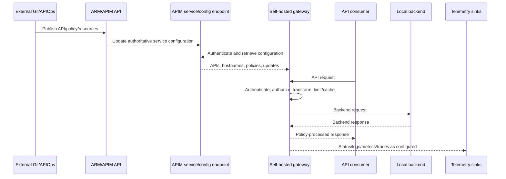

# Azure API Management research dossier

## Snapshot and use

- Reviewed: 2026-08-17
- Decision unit: exact **service tier + gateway type + region/network topology + workspace model + gateway image + configuration path**
- Evidence present: `E1` official Microsoft documentation only
- Evidence absent: `E2` contract/vendor commitments, `E3` repeatable execution, `E4` representative pilot
- Decision status: no score, rank, or product recommendation is supported

The registered primary sources are M-001 through M-005 in [sources.csv](sources.csv). This dossier adds point-of-use official sources where the original five-source note was insufficient. Volatile service facts must be rechecked at the next decision gate.

Decision-facing synthesis: [Azure API Management assessment](../docs/19-azure-apim-assessment.md) and [hybrid-fit proof design](../docs/20-azure-apim-hybrid-fit.md).

## Evidence-state key

| Label | Meaning in this dossier |
|---|---|
| `E1 confirmed` | Current official documentation directly establishes the mechanism for the named variant |
| `E1 conditional` | Official documentation establishes it only for stated tier/version/topology or is release-sensitive |
| `Interpretation` | Architecture implication derived from documented mechanisms; not a vendor claim |
| `Unknown` | Official documents do not establish organization-specific behavior or no evidence is recorded |
| `E2/E3/E4 required` | Vendor contract, reproducible test, or representative pilot is needed |

## Variant boundary ledger

| Research ID | Variant | Evidence | Qualification |
|---|---|---|---|
| AZ-V01 | Managed classic gateway in Developer, Basic, Standard, Premium | `E1 confirmed` — [M-001 gateway comparison](https://learn.microsoft.com/en-us/azure/api-management/api-management-gateways-overview) | Premium classic is the current managed multi-region tier; Developer is not production |
| AZ-V02 | Managed v2 gateway in Basic v2, Standard v2, Premium v2 | `E1 conditional` — [M-005 v2 tiers](https://learn.microsoft.com/en-us/azure/api-management/v2-service-tiers-overview) | Premium v2 has zone support but currently no multi-region, self-hosted gateway, backup/restore, or classic-to-v2 migration |
| AZ-V03 | Consumption managed gateway | `E1 confirmed` — [gateway comparison and limits](https://learn.microsoft.com/en-us/azure/api-management/api-management-gateways-overview#gateway-runtime-limits) | Serverless scaling and materially distinct limits/features; validate exact workload |
| AZ-V04 | Self-hosted gateway | `E1 confirmed` — [M-003 support policy](https://learn.microsoft.com/en-us/azure/api-management/self-hosted-gateway-support-policies) | Current support page applies to Developer and Premium classic; customer operates runtime |
| AZ-V05 | Workspace using default managed gateway | `E1 conditional` — [M-004 workspaces](https://learn.microsoft.com/en-us/azure/api-management/workspaces-overview) | Available combinations and API path are evolving; resources/capacity can be shared |
| AZ-V06 | Dedicated managed workspace gateway | `E1 conditional` — [workspace gateway](https://learn.microsoft.com/en-us/azure/api-management/workspaces-overview#workspace-gateway) | Separate resource/scale/network boundary with feature and regional constraints |
| AZ-V07 | Workspace associated with self-hosted gateway | `E1 confirmed unsupported currently` — [workspace constraints](https://learn.microsoft.com/en-us/azure/api-management/workspaces-overview#workspace-and-workspace-gateway-constraints) | Do not construct a notional variant by combining these features |

## Mechanism trace

The configuration link is gateway-initiated in normal operation. The request does not traverse the Azure configuration endpoint, but configuration freshness, status, and selected telemetry depend on outbound connectivity and DNS. This is `E1 confirmed` by [M-002 self-hosted overview](https://learn.microsoft.com/en-us/azure/api-management/self-hosted-gateway-overview) and [M-003 responsibility split](https://learn.microsoft.com/en-us/azure/api-management/self-hosted-gateway-support-policies#responsibilities).

## Claim ledger

| ID | Claim and implication | State/source | Limitation or counter-evidence |
|---|---|---|---|
| AZ-C01 | A managed gateway processes API traffic in Azure even when the backend is elsewhere. **Implication:** backend locality does not imply payload-path locality. | `E1 confirmed` — [M-001](https://learn.microsoft.com/en-us/azure/api-management/api-management-gateways-overview#managed-and-self-hosted-gateways) | Private connectivity can protect transport but does not relocate processing |
| AZ-C02 | A self-hosted gateway is a Microsoft container associated with one gateway resource in an Azure APIM service. **Implication:** it is hybrid runtime, not a locally authoritative control plane. | `E1 confirmed` — [M-001](https://learn.microsoft.com/en-us/azure/api-management/api-management-gateways-overview#managed-and-self-hosted-gateways) | No evidence of fully air-gapped configuration management |
| AZ-C03 | Running self-hosted gateways continue with in-memory configuration during temporary Azure connectivity loss. | `E1 confirmed` — [M-002 connectivity](https://learn.microsoft.com/en-us/azure/api-management/self-hosted-gateway-overview#connectivity-to-azure) | Does not establish config changes, clean scale-out, unlimited outage, or external policy dependencies |
| AZ-C04 | With persistent configuration backup, a stopped gateway can start during the partition; without backup it cannot use a persisted copy. | `E1 confirmed` — [M-002](https://learn.microsoft.com/en-us/azure/api-management/self-hosted-gateway-overview#connectivity-to-azure) and [production backup guidance](https://learn.microsoft.com/en-us/azure/api-management/how-to-self-hosted-gateway-on-kubernetes-in-production#configuration-backup) | `E3` needed for rescheduling, a clean node, stale/corrupt volume, secret/cert dependencies |
| AZ-C05 | The production backup mount is `/apim/config` and requires the documented group ownership. **Implication:** Kubernetes storage topology is part of startup resilience. | `E1 confirmed` — [production guidance](https://learn.microsoft.com/en-us/azure/api-management/how-to-self-hosted-gateway-on-kubernetes-in-production#configuration-backup) | Microsoft does not operate or validate the customer's storage class/RPO |
| AZ-C06 | Self-hosted authentication can use a 30-day access token or Microsoft Entra ID without token refresh. | `E1 confirmed` — [M-003 responsibilities](https://learn.microsoft.com/en-us/azure/api-management/self-hosted-gateway-support-policies#responsibilities) | Entra still depends on correct identity, RBAC, token acquisition, DNS/time and egress; `E3` rotation/revocation needed |
| AZ-C07 | Customer owns self-hosted hosting, network, capacity, scale, uptime, diagnostics, updates and third-party integrations. | `E1 confirmed` — [M-003](https://learn.microsoft.com/en-us/azure/api-management/self-hosted-gateway-support-policies#responsibilities) | Any managed-service-like operational assumption is false unless a separate provider is contracted |
| AZ-C08 | Microsoft does not support troubleshooting customer CNI, NetworkPolicy, firewall, service mesh or complex network circuits; support checks configuration-endpoint connectivity. | `E1 confirmed` — [M-003 support scenarios](https://learn.microsoft.com/en-us/azure/api-management/self-hosted-gateway-support-policies#self-hosted-gateway-support-scenarios) | Exact escalation/coordination outcome remains `E2 required` |
| AZ-C09 | Microsoft supports the latest self-hosted major and last three minor releases; fixes for an older supported minor can land in the latest minor. | `E1 confirmed` — [M-003 image coverage](https://learn.microsoft.com/en-us/azure/api-management/self-hosted-gateway-support-policies#self-hosted-gateway-container-image-support-coverage) | “Within support” does not remove the need for a frequent rollout capability |
| AZ-C10 | Microsoft advises a pinned image in production rather than `latest`. | `E1 confirmed` — [production image guidance](https://learn.microsoft.com/en-us/azure/api-management/how-to-self-hosted-gateway-on-kubernetes-in-production#container-image-tag) | Pinning without an upgrade SLO creates security/support lag |
| AZ-C11 | Throughput depends on connections, policies, payloads, backend behavior and, for self-hosted, host CPU/memory; Microsoft calls for anticipated-production-condition load testing. | `E1 confirmed` — [gateway throughput](https://learn.microsoft.com/en-us/azure/api-management/api-management-gateways-overview#gateway-throughput-and-scaling) | No capacity conclusion can be taken from a nominal unit or hello-world test |
| AZ-C12 | Gateway feature/runtime limits differ among classic, v2, Consumption, self-hosted and workspace gateways. | `E1 confirmed` — [M-001 comparison](https://learn.microsoft.com/en-us/azure/api-management/api-management-gateways-overview#feature-comparison-managed-versus-self-hosted-gateways) | Family-level feature checklists overstate any exact variant |
| AZ-C13 | Premium classic supports Microsoft-managed multi-region; Premium v2 currently supports zones but not multi-region. | `E1 conditional` — [reliability by tier](https://learn.microsoft.com/en-us/azure/reliability/reliability-api-management) | Recheck before architecture freeze; DNS/backend/policy recovery still customer design |
| AZ-C14 | Current v2 tiers cannot be reached by in-place migration from existing Consumption/classic instances. | `E1 conditional` — [M-005 FAQ](https://learn.microsoft.com/en-us/azure/api-management/v2-service-tiers-overview#frequently-asked-questions) | Side-by-side resource recreation, consumer/DNS/cert cutover and rollback are required today |
| AZ-C15 | The built-in APIM Git configuration repository retired; Microsoft points to external Git plus ARM-based APIs/APIOps. | `E1 confirmed` — [retirement notice](https://learn.microsoft.com/en-us/azure/api-management/breaking-changes/git-configuration-retirement-march-2025) | APIOps reference implementation/support is not evidence of the organization's promotion/rollback/drift design |
| AZ-C16 | Workspace RBAC delegates API/product/subscription resources and central policy inheritance can be audited/enforced. | `E1 conditional` — [M-004](https://learn.microsoft.com/en-us/azure/api-management/workspaces-overview) | Workspace feature gaps include managed identities and related Key Vault policy use at current snapshot; exact needs require mapping |
| AZ-C17 | Multiple workspaces on one workspace gateway share configuration and compute resources, so one API can affect others. | `E1 confirmed` — [M-004 shared gateway](https://learn.microsoft.com/en-us/azure/api-management/workspaces-overview#associate-workspaces-with-a-workspace-gateway) | Administrative isolation is not runtime fault isolation |
| AZ-C18 | A workspace cannot currently associate with a self-hosted gateway. | `E1 confirmed` — [M-004 constraints](https://learn.microsoft.com/en-us/azure/api-management/workspaces-overview#workspace-and-workspace-gateway-constraints) | Central domain federation plus local gateways may require different boundaries/service-instance topology |
| AZ-C19 | Workspace gateways have independent network settings and currently constrain when network configuration can be changed. | `E1 conditional` — [M-004 network isolation](https://learn.microsoft.com/en-us/azure/api-management/workspaces-overview#network-isolation-for-workspace-gateways) | Lifecycle/migration of a wrong network choice needs a tested procedure |
| AZ-C20 | The managed and self-hosted gateways differ on cache, domains, certificates, protocols, Defender, policies and runtime limits. | `E1 confirmed` — [M-001 comparison](https://learn.microsoft.com/en-us/azure/api-management/api-management-gateways-overview#feature-comparison-managed-versus-self-hosted-gateways) | A common policy source can still produce variant-specific behavior |

## State-and-failure research matrix

| State | Normal owner | Partition behavior supported by source | Unresolved test |
|---|---|---|---|
| API/policy/hostname configuration | Azure APIM service/config endpoint | Existing running gateway uses in-memory copy | config-version alarm, conflicting update, reconciliation and rollback |
| Persistent last-known configuration | Customer Kubernetes volume | stopped instance may start from backup | new node, stale/corrupt/read-only volume, storage zone failure |
| Gateway identity | Azure identity/RBAC or access token | no special disconnected authority documented | expiry/revocation/clock/DNS behavior and emergency recovery |
| Subscription/key/product behavior | APIM configuration and policies | existing contract may contain usable state; exact propagation not generalized | create/revoke/rotate during partition and after reconnect |
| Rate/quota/cache | policy and selected store/topology | not one universal behavior | local versus global scope; Redis latency/loss; replica and region scale |
| Runtime availability | Customer Kubernetes/network/LB/DNS | outside Azure's managed gateway SLA | node/zone/CNI/DNS/LB loss, disruption and saturation |
| Telemetry | configured local/Azure sinks | request serving can diverge from evidence delivery | buffer, loss, duplicates, masking, backpressure and recovery |

## Enterprise reference-case mapping

Use [RE-1](../docs/41-enterprise-reference-case.md) and retain its IDs in evidence artefacts:

| Journey/failure | APIM mechanism to expose | Primary uncertainty |
|---|---|---|
| J-01 confirmed money transfer; I-01 lost response/duplicate risk | policy retries, timeout, idempotency header propagation, backend response handling | whether any layer repeats a committed write or changes error contract |
| J-02 account summary | cache, fan-out/backend latency, token validation, response transformation | cache/state locality and stale-data semantics |
| J-03 partner payment initiation | mTLS/JWT, product/subscription, quota, audit correlation | credential/counter consistency across gateways/regions |
| J-04 digital onboarding | payload size/schema, long-running/async transition, PII logging | v2/classic/self-hosted limits and residency of diagnostics |
| J-05 settlement file | streaming/buffering/size limits and non-HTTP integration boundary | whether gateway is appropriate or integration runtime remains required |
| J-06 configuration propagation; I-02 stale restarted replica | APIOps → APIM → configuration endpoint → memory/backup | restart/scale/change/reconcile through partition |
| I-03 certificate rollover/pinned CA | custom hostname, per-gateway CA/cert material and trust | zero-loss rotation and consumer trust rollback |
| I-04 noisy neighbour | shared service/workspace gateway and self-hosted cluster capacity | administrative versus runtime isolation |
| I-05 telemetry backpressure | diagnostics/OTel/Azure Monitor path | request impact and evidence loss/duplication |
| I-06 regional failover/stale data | Premium classic managed multi-region or customer local gateways/state | traffic steering, policy state and backend consistency |
| I-07/I-08 schema drift and rollback | OpenAPI/policy deployment plus backend compatibility | progressive validation and irreversible backend state |

## Counter-evidence ledger

| Hypothesis | Evidence that weakens it | Current result |
|---|---|---|
| APIM cannot be hybrid | Self-hosted gateway is a documented customer-local runtime | Falsified at `E1`; organization fit remains unknown |
| Self-hosted APIM is autonomous/air-gapped | Azure association/config endpoint and Local Mode absence | Unsupported; partition envelope needs `E3` |
| Workspaces plus self-hosted gateway provide native federated locality | Current association is prohibited | Falsified for the current combination |
| v2 is a drop-in modern replacement for Premium classic | No in-place migration, no self-hosted and no multi-region today | Falsified for those requirements at snapshot |
| Microsoft owns the whole self-hosted incident | Explicit customer and unsupported network responsibilities | Falsified at `E1` |
| Common policies guarantee parity | Published gateway feature/runtime differences | Unproven; requires golden contract suite |
| Managed service means no customer reliability design | Tier/region/backend/DNS/policy/consumer dependencies remain | Falsified as a general claim |

## Validation backlog and evidence outputs

| Test | Variant(s) | Required output | Current state |
|---|---|---|---|
| Exact feature/policy contract suite | Managed classic, selected v2, self-hosted, workspace gateway as proposed | status/header/body/counter/telemetry/latency diff | `Not run` |
| Configuration partition, restart, clean scale-out and reconcile | Self-hosted | pod/config fingerprint/request/event timeline | `Not run` |
| Entra identity and certificate/CA rotation | Self-hosted and any managed gateway | sanitized identity/cert events and zero-loss evidence | `Not run` |
| Redis/counter/cache failure and replica scale | Every policy topology using external state | per-consumer counter/results timeline | `Not run` |
| Node, zone, CNI, DNS, LB and backend failure | Self-hosted | SLI, Kubernetes/network events, support-ready diagnostics | `Not run` |
| APIOps drift, rollback, delete/rename and secret reference | Every target service/workspace | repository/run logs and resource diff | `Not run` |
| Classic-to-v2 side-by-side recreation | only if v2 target is proposed | inventory fidelity, DNS/cert/consumer cutover and rollback | `Not run` |
| Workspace noisy-neighbour isolation | shared and dedicated workspace gateways | per-workspace SLI/resource evidence | `Not run` |
| Contract/support review | exact quote and topology | restricted evidence reference, non-sensitive conclusion | `E2 missing` |
| Representative pilot and TCO | approved exact variant | workload SLO/change/incident/staff/cost observations | `E4 missing` |

## Proposed source-register additions

M-001 through M-005 are registered. The following point-of-use sources are also relied on by this dossier and docs 19–20 but are absent from `sources.csv` at the as-of date. These IDs are proposed only; the shared register is intentionally not edited here.

| Proposed ID | Official source | Evidence scope | Revalidation trigger |
|---|---|---|---|
| M-006 | [API Management reliability by tier](https://learn.microsoft.com/en-us/azure/reliability/reliability-api-management) | Zone and managed multi-region behavior by exact APIM tier | Tier/region or reliability design freeze |
| M-007 | [Self-hosted gateway production guidance for Kubernetes](https://learn.microsoft.com/en-us/azure/api-management/how-to-self-hosted-gateway-on-kubernetes-in-production) | Image pinning, configuration backup mount and production Kubernetes controls | Gateway image/storage/BOM freeze |
| M-008 | [Built-in Git configuration retirement](https://learn.microsoft.com/en-us/azure/api-management/breaking-changes/git-configuration-retirement-march-2025) | Retirement of legacy APIM Git path and external APIOps implication | Migration/promotion design approval |

AKS reliability and baseline-architecture sources used by the Kong-on-AKS studies are separately proposed as `AZK-001` and `AZK-002` in [the Kong evidence ledger](kong.md#external-platform-sources-needed-by-the-aks-study); they should be registered once, not duplicated under Microsoft APIM IDs.

## Research conclusion

`E1` establishes that APIM offers both Azure-managed and legitimate customer-local gateways, with meaningful workspace and Azure-native governance capabilities. The same evidence establishes non-trivial variant gaps, an Azure configuration dependency for self-hosted runtime, a customer-owned Kubernetes/network/SLA boundary, a current workspace/self-hosted incompatibility, and v2 migration/feature constraints. Those mechanisms define the next evidence to collect; they do not establish a winner.
