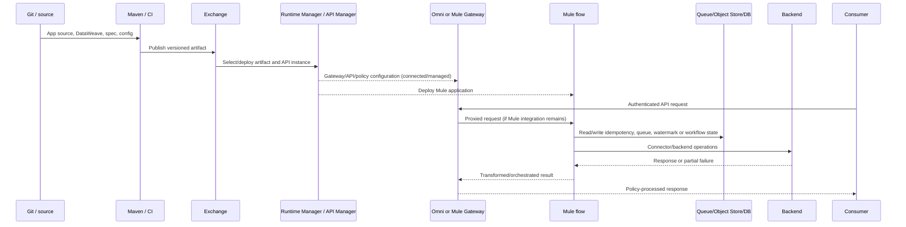

# MuleSoft research dossier

## Snapshot and decision boundary

- Reviewed: 2026-08-17
- Evidence present: `E1` official MuleSoft documentation for product mechanics
- Evidence absent: actual estate inventory, deployed variants/versions, incidents, performance, ownership, commercial/support terms, `E3` execution, and `E4` pilot
- Decision unit: each Mule/Omni deployable plus its API, integration, state, substrate and consumer dependencies
- Decision status: the current platform is an **unknown baseline**, not a scored product candidate

Registered sources MU-001 through MU-003 are in [sources.csv](sources.csv). This dossier adds official deployment, lifecycle, state and failure-mechanism sources at point of use.

Decision-facing synthesis: [MuleSoft current-state baseline](../docs/23-mulesoft-current-state-baseline.md).

## Evidence-state key

| Label | Meaning |
|---|---|
| `E1 confirmed` | Current official documentation directly establishes a product mechanism |
| `E1 conditional` | Mechanism varies by gateway, deployment target, runtime, release channel, API type, or entitlement |
| `Interpretation` | Architecture/migration implication derived from a documented mechanism |
| `Unknown estate` | No organization-specific inventory/evidence is recorded |
| `E2/E3/E4 required` | Contract, repeatable execution, or representative pilot evidence is needed |

## Bounded product/deployment-archetype ledger

MU-V01 through MU-V12 are discovery categories, not evidence that the organization runs those products and not version-pinned options. Exact runtime, substrate, configuration/state authority, entitlement and support data must come from the estate inventory.

| ID | Bounded archetype | Runtime and configuration boundary | Evidence |
|---|---|---|---|
| MU-V01 | Mule Gateway in Mule runtime | Policies applied through API Manager; gateway and Mule flows execute in Mule app/runtime | `E1 confirmed` — [MU-002 gateway policies](https://docs.mulesoft.com/api-manager/latest/manage-policies-overview) |
| MU-V02 | Managed Omni Gateway on CloudHub 2.0 | MuleSoft hosts/manages gateway replicas; configured from Anypoint | `E1 confirmed` — [Omni overview](https://docs.mulesoft.com/gateway/latest/) |
| MU-V03 | Managed Omni Gateway on Runtime Fabric | Managed gateway lifecycle through Anypoint on customer Runtime Fabric boundary | `E1 confirmed` — [managed deployment](https://docs.mulesoft.com/gateway/latest/flex-gateway-managed-set-up) |
| MU-V04 | Self-managed Omni Gateway Connected Mode | Customer runtime; Anypoint central config/observability, with supported declarative options | `E1 confirmed` — [Omni overview](https://docs.mulesoft.com/gateway/latest/#self-managed-omni-gateway-in-connected-mode) |
| MU-V05 | Self-managed Omni Gateway Local Mode | Customer runtime and local declarative config; connects for registration and usage metrics | `E1 confirmed` — [Omni overview](https://docs.mulesoft.com/gateway/latest/#self-managed-omni-gateway-in-local-mode) |
| MU-V06 | CloudHub 2.0 Mule app — shared space | MuleSoft-operated containerized replicas in multitenant shared region | `E1 confirmed` — [CloudHub 2 architecture](https://docs.mulesoft.com/cloudhub-2/ch2-architecture) |
| MU-V07 | CloudHub 2.0 Mule app — private space | MuleSoft-operated replicas in isolated logical network with customer-configured connections/TLS/firewalls | `E1 confirmed` — [private spaces](https://docs.mulesoft.com/cloudhub-2/ch2-private-space-about) |
| MU-V08 | Runtime Fabric Mule app | Runtime Fabric agent/Mule software on customer-managed AKS/EKS/GKE/OpenShift | `E1 confirmed` — [Runtime Fabric](https://docs.mulesoft.com/runtime-fabric/latest/) |
| MU-V09 | Hybrid standalone Mule runtime | Customer server/VM/runtime, registered to Runtime Manager if chosen | `E1 confirmed` — [deployment options](https://docs.mulesoft.com/runtime-manager/deployment-strategies) |
| MU-V10 | Fully standalone Mule runtime | Customer-operated without required control-plane connection | `E1 confirmed` — [hosting overview](https://docs.mulesoft.com/hosting-home/) |
| MU-V11 | Anypoint Platform Private Cloud Edition | Customer hosts management/engagement capabilities | `E1 confirmed` — [deployment options](https://docs.mulesoft.com/runtime-manager/deployment-strategies#anypoint-platform-private-cloud-edition) |
| MU-V12 | Legacy CloudHub | MuleSoft iPaaS worker model distinct from CloudHub 2.0 | `E1 confirmed` — [CloudHub overview](https://docs.mulesoft.com/runtime-manager/cloudhub) |

The estate may contain several of these simultaneously. `Unknown estate` applies to every row until inventory evidence says otherwise.

## Rename and compatibility fact

MuleSoft renamed Flex Gateway to Omni Gateway in version 1.13.0. The [release note](https://docs.mulesoft.com/release-notes/flex-gateway/flex-gateway-release-notes#_1_13_0) says the initial change is non-breaking/cosmetic and does not change APIs, CLI, environment variables, logging, documentation URLs or MCP tool names. Inventory searches must therefore include `Flex`, `Omni`, `flex-gateway`, `gateway.mulesoft.com`, and registered Runtime Manager targets.

## Request and change paths

Local-mode Omni changes the configuration path: versioned local declarative files configure the gateway rather than API Manager. Fully standalone Mule changes the deployment path. The request path alone cannot reveal which mode is in use.

## Claim ledger

| ID | Claim and implication | State/source | Qualification/counter-evidence |
|---|---|---|---|
| MU-C01 | DataWeave is a Mule runtime language for accessing/transforming data in a Mule event and is embedded in transform/set-payload components. | `E1 confirmed` — [MU-001](https://docs.mulesoft.com/mule-runtime/latest/dataweave) | A DataWeave-heavy API is application code, not merely a gateway policy migration |
| MU-C02 | API Manager policies can secure/control traffic without modifying implementation code, but availability varies by gateway and API type. | `E1 confirmed` — [MU-002](https://docs.mulesoft.com/api-manager/latest/manage-policies-overview) | Policy parity cannot be inferred among Mule, Connected Omni, Local Omni and Managed Omni |
| MU-C03 | Mule flows/connectors can implement integration, orchestration and business processing beyond API proxying. | `E1 confirmed` — [CloudHub app role](https://docs.mulesoft.com/cloudhub-2/ch2-architecture#integration-applications) | A gateway-only target does not automatically replace these functions |
| MU-C04 | Reliability for non-transactional sources can require a reliable acquisition flow; connector transactions/XA provide different guarantees. | `E1 confirmed` — [reliability patterns](https://docs.mulesoft.com/mule-runtime/latest/reliability-patterns) | Retry/queue/transaction semantics must be discovered per flow |
| MU-C05 | Omni Gateway is Envoy-based and separates MuleSoft-hosted control plane from runtime. | `E1 confirmed` — [Omni architecture](https://docs.mulesoft.com/gateway/latest/#omni-gateway-architecture) | Local Mode alters config authority; Managed versus self-managed alters operations |
| MU-C06 | Managed Omni is hosted/managed on CloudHub 2.0 or Runtime Fabric and provides automatic operational capabilities. | `E1 confirmed` — [Omni deployment types](https://docs.mulesoft.com/gateway/latest/#managed-omni-gateway) | Runtime Fabric infrastructure/ingress remains customer responsibility |
| MU-C07 | Self-managed Omni can run in Docker, Kubernetes, sidecar or Linux; customer owns infrastructure and HA. | `E1 confirmed` — [self-managed Omni](https://docs.mulesoft.com/gateway/latest/#self-managed-omni-gateway) | A laptop/single replica is not production evidence |
| MU-C08 | Connected Mode is fully connected to Anypoint for centralized management/observability/security. | `E1 confirmed` — [connected mode](https://docs.mulesoft.com/gateway/latest/#self-managed-omni-gateway-in-connected-mode) | Partition/restart/contract behavior requires `E3` |
| MU-C09 | Local Mode uses local declarative config but still connects for registration and usage metrics; documentation says it is not air-gapped. | `E1 confirmed` — [mode comparison](https://docs.mulesoft.com/gateway/latest/#summary-of-differences) | “Local” is not evidence for a zero-egress requirement |
| MU-C10 | Self-managed replicas can use external Redis for distributed rate limiting and caching. | `E1 confirmed` — [self-managed Omni](https://docs.mulesoft.com/gateway/latest/#self-managed-omni-gateway) | Redis becomes a consistency/latency/availability dependency |
| MU-C11 | Managed Omni stores API configurations locally, but not contracts; at startup it downloads contracts before accepting traffic for contract-dependent APIs. | `E1 confirmed` — [managed HA/config storage](https://docs.mulesoft.com/gateway/latest/flex-architecture-managed-dr-ha) | Control-plane partition can affect startup even when API config is local; `E3` required |
| MU-C12 | Managed Omni on CloudHub private space keeps at least two replicas across zones; Runtime Fabric ingress is customer-configured. | `E1 conditional` — [managed HA](https://docs.mulesoft.com/gateway/latest/flex-architecture-managed-dr-ha) | Do not transfer CloudHub HA statements to Runtime Fabric topology |
| MU-C13 | Managed and self-managed Omni have different lifecycle: managed auto-upgrades/patches, self-managed does not. | `E1 confirmed` — [Omni version lifecycle](https://docs.mulesoft.com/gateway/latest/flex-gateway-version-lifecycle) | Exact release channel/EOL and organization change controls remain to inventory |
| MU-C14 | CloudHub 2.0 runs apps as isolated container replicas behind platform services/load balancing in a selected region. | `E1 confirmed` — [CloudHub architecture](https://docs.mulesoft.com/cloudhub-2/ch2-architecture) | Shared versus private space and replicas materially alter networking/isolation/cost |
| MU-C15 | CloudHub 2.0 rolling update usually keeps old version serving, but long in-flight requests can be interrupted in edge cases. | `E1 confirmed` — [zero-downtime update caveat](https://docs.mulesoft.com/cloudhub-2/ch2-architecture#zero-downtime-updates) | “Zero downtime” must be tested with actual long/streaming calls |
| MU-C16 | CloudHub 2.0 load balancer maintains client and app connections with documented idle/long-request behavior. | `E1 confirmed` — [networking architecture](https://docs.mulesoft.com/cloudhub-2/ch2-networking-guide#load-balancer-connections) | Long synchronous flows may require redesign or configured timeouts |
| MU-C17 | CloudHub private spaces provide networking/TLS/firewall controls but do not include built-in WAF or L7 DDoS protection. | `E1 confirmed` — [CloudHub networking](https://docs.mulesoft.com/cloudhub-2/ch2-networking-guide) | Edge protection remains an adjacent architecture/cost |
| MU-C18 | Runtime Fabric agent creates/updates Kubernetes Deployments, Pods, ReplicaSets and ingress resources for Mule apps. | `E1 confirmed` — [Runtime Fabric provided components](https://docs.mulesoft.com/runtime-fabric/latest/#mulesoft-provided) | Kubernetes controllers are part of the change path |
| MU-C19 | Runtime Fabric customer owns Kubernetes, ingress customization, external LB, logs, monitoring, network/NAT/proxy, certificates and host runtime/network. | `E1 confirmed` — [Runtime Fabric customer responsibility](https://docs.mulesoft.com/runtime-fabric/latest/#customer-managed) | “MuleSoft-managed deployment” does not eliminate AKS/platform responsibility |
| MU-C20 | Runtime Fabric deployment is eventually consistent; CI pipelines must account for it. | `E1 confirmed` — [deployment considerations](https://docs.mulesoft.com/runtime-fabric/latest/deploy-index#deployment-considerations) | A deployment API response is not evidence that target state is serving |
| MU-C21 | Runtime Fabric component upgrades update services that communicate with control plane, load balance, and forward metrics. | `E1 confirmed` — [RTF upgrade](https://docs.mulesoft.com/runtime-fabric/latest/upgrade-self-managed) | Coupled RTF/AKS/runtime upgrades and rollback need proof |
| MU-C22 | Runtime/Java/release-channel support differs by target and must be selected explicitly. | `E1 conditional` — [deployment feature matrix](https://docs.mulesoft.com/runtime-manager/deployment-strategies#runtime-manager-features) and [runtime patches](https://docs.mulesoft.com/runtime-fabric/latest/runtime-patch-updates) | Inventory deployed full version/build/channel/Java, not “Mule 4” |
| MU-C23 | Object Store, scheduling, logs, monitoring, security updates and HA differ by deployment option. | `E1 confirmed` — [deployment option matrix](https://docs.mulesoft.com/runtime-manager/deployment-strategies#runtime-manager-features) | Migration between substrates can change behavior without application-code changes |
| MU-C24 | Runtime Fabric/standalone do not use Object Store v2 in the same way as CloudHub; hosting docs identify different persistence/cluster mechanisms. | `E1 conditional` — [hosting component support](https://docs.mulesoft.com/hosting-home/#component-support-by-runtime-option) | State location/export/consistency must be discovered per application |
| MU-C25 | Mule applications can deploy through several tools to CloudHub, CloudHub 2, Runtime Fabric or on-premises. | `E1 confirmed` — [deploy applications](https://docs.mulesoft.com/mule-runtime/latest/deploying) | Source, Exchange and running digest can drift; establish lineage |
| MU-C26 | Managed Omni requires allocated gateway resources in the target business group; resource inheritance/redistribution rules apply. | `E1 conditional` — [requirements](https://docs.mulesoft.com/gateway/latest/review-prerequisites#managed-omni-gateway-resource-requirements) | Exact entitlement and quote remain `E2 required` |
| MU-C27 | Some Runtime Fabric monitoring/autoscaling features are package/select-customer dependent in official docs. | `E1 conditional` — [deployment options matrix](https://docs.mulesoft.com/runtime-manager/deployment-strategies) | Do not infer organization entitlement from product documentation |

## Workload classification ledger

Populate with organization evidence; every current count is `Unknown estate`.

| Class | Identifying evidence | State/side effects to inspect | Migration meaning |
|---|---|---|---|
| Gateway-only proxy | HTTP listener/proxy plus API Manager policies; no orchestration/connectors beyond target | contracts, policies, keys, certificates, quota/cache | candidate for gateway behavior translation |
| Transforming proxy | DataWeave/validation before or after target | schemas, lookup tables, modules, locale/time | code transformation/rewrite decision |
| Synchronous integration | multiple connector calls/branches/scatter-gather | partial effects, timeout, retry, compensation, idempotency | integration runtime remains or is reimplemented |
| Asynchronous integration | MQ/JMS/VM queue, ack, DLQ, retry | in-flight/backlog/order/dedup/replay | stateful event migration |
| Scheduled/batch | scheduler, file/FTP, batch, watermark | enablement, time zone, overlap, catch-up, reconciliation | workload scheduler/state migration |
| Stateful API/workflow | Object Store/DB/queue/session/cache | key/value, TTL, consistency, backup/export | explicit state cutover/dual-run controls |
| Connector/custom-code led | SaaS/DB/mainframe connector, custom Java/SDK | connector/version/driver/credential/support | dependency and support migration independent of gateway |

## Baseline evidence model

| Object | Minimum inventory fields | Runtime proof |
|---|---|---|
| API instance/product/contract | org/business group, environment, spec/version, gateway type, policies, automated policy scope, applications | effective policy/config and representative auth/quota results |
| Mule application | source/repo/commit, Exchange coordinates, deployed digest, runtime target/version/Java/channel, owner | running artifact linkage and dependency/flow trace |
| Flow/subflow | trigger, steps, branches, error handlers, retries, transactions, schedules | representative event path and side effects |
| DataWeave/custom code | module, complexity, schema/fixtures, Java/dependency, tests | golden corpus result and error/edge behavior |
| Connector | name/version/operation, endpoint class, pooling, retry, credentials/cert owner | connection and failure/rotation evidence |
| State store/queue | type/location/keyspace/TTL/depth/order/backup/export | restart/failover/replay/reconciliation evidence |
| Deployment substrate | target/space/region/cluster/namespace, replicas/size, ingress/LB/DNS/TLS/network | topology and fault/upgrade behavior |
| Telemetry | logs/metrics/traces/audit fields, mask, retention, alert, export | correlated end-to-end incident evidence |
| Commercial/support | non-sensitive contract reference, metering unit, support/EOL/partner dependency | `E2` reviewed conclusion in restricted evidence store |

## Enterprise reference-case mapping

Use [RE-1](../docs/41-enterprise-reference-case.md) to trace actual Mule behavior:

| Journey/failure | Potential Mule/Omni mechanism | Baseline evidence needed |
|---|---|---|
| J-01 / I-01 confirmed money transfer and lost response | gateway policy + Mule flow + connector transaction/retry/idempotency + reconciliation | sequence/side effects, timeout/retry, idempotency store and authoritative outcome query |
| J-02 account summary | DataWeave aggregation, multiple connectors, cache/Object Store | dependency timing, partial failure, stale cache and fallback |
| J-03 partner payment initiation | API contract/app, client-ID/OAuth/mTLS, SLA policy, transform/orchestration | policy and connector credential rotation, quota scope and audit correlation |
| J-04 digital onboarding | large PII transform, connector fan-out, async handoff, Object Store | PII masks, payload/time limits, partial completion and replay |
| J-05 settlement file | scheduler/File/SFTP/batch, watermark and durable processing | file claim/archive, duplicate prevention, restart/catch-up/reconciliation |
| J-06 / I-02 config propagation and stale replica | Git/Exchange/API Manager/Runtime Manager to Mule/Omni runtime | deployed digest/config version, control partition, restart/scale and eventual consistency |
| I-03 cert rollover | TLS context, secure properties, connector/gateway certificates | all consumers, zero-loss rotation and rollback/pinned CA |
| I-04 noisy neighbour | shared CloudHub/RTF/cluster/gateway/state/connector capacity | cross-app SLI and resource isolation |
| I-05 telemetry backpressure | Anypoint logging/monitoring or local forwarding | buffer/drop/block, PII and incident visibility |
| I-06 regional failover/stale data | substrate failover plus Object Store/queue/DB/connector state | state consistency, traffic/schedule failover and reconciliation |
| I-07/I-08 schema drift/rollback | spec, DataWeave, connectors, downstream schema/side effects | consumer/provider compatibility, irreversible actions and forward recovery |

## Counter-evidence ledger

| Hypothesis | Counter-evidence | Status |
|---|---|---|
| The current estate is an API gateway and can be replaced as one | Mule runtime includes DataWeave, flows, connectors, schedules, transactions and state patterns | Falsified as a safe family-level assumption |
| Every Mule API contains complex integration logic | API Manager can apply policies without implementation changes; Omni is a lightweight gateway | Also false as a family-level assumption; inventory required |
| Local-mode Omni is air-gapped | It connects for registration and usage metrics and docs say “Air-Gapped? No” | Falsified (`E1`) |
| Managed Omni startup is independent from control plane | API config is local, but contracts are downloaded before contract-dependent traffic | Falsified for those APIs; exact outage behavior needs `E3` |
| Runtime Fabric means MuleSoft owns AKS and ingress | Customer responsibility list is explicit | Falsified (`E1`) |
| CloudHub rolling update guarantees zero interruption | Official long-inflight edge-case caveat | Falsified as absolute; workload test required |
| The same Mule app behaves identically on every deployment target | Object Store, scheduling, logging, monitoring, HA, patching and LB differ | Unproven; substrate-specific contract test required |
| Exporting source/JAR completes migration | consumer contracts, credentials, state, queues, schedules, telemetry and side effects remain | Falsified as sufficient exit evidence |
| Lower platform license necessarily lowers TCO | Rewrite, state migration, adjacent services, on-call and support can move cost | `Unknown`; needs representative financial/operational evidence |

## Failure and migration evidence backlog

| Evidence task | Output | State |
|---|---|---|
| Full control-plane/export inventory across business groups/environments/targets | sanitized normalized inventory with source references | `Not run` |
| Repository/Exchange/deployed-artifact lineage | app/API/policy version graph and drift exceptions | `Not run` |
| Static flow/DataWeave/connector/state classification plus owner review | workload archetype and complexity register | `Not run` |
| Runtime trace for RE-1 journeys | sequence, side-effect, retry/idempotency/reconciliation evidence | `Not run` |
| Connected/Managed Omni control partition, restart, clean scale and contract download | config/contract fingerprint and request timeline | `Not run` |
| Local Omni zero-egress and usage-registration trace | packet/flow inventory and vendor-confirmed offline limits | `Not run`; `E2/E3` |
| Redis/state-store/queue/connector failure | behavior, duplicates/loss/order, recovery and alarms | `Not run` |
| CloudHub rolling update with long/streaming calls | request outcome and rollback timeline | `Not run` |
| Runtime Fabric AKS/agent/ingress/node/zone and eventual-consistency faults | per-layer SLI/events/diagnostics | `Not run` |
| Mule/Java/connector/gateway/RTF upgrade and rollback | golden diff, state compatibility, time and runbook | `Not run` |
| State/queue/schedule cutover and reconciliation | pre/post counts, watermarks, in-flight handling, rollback | `Not run` |
| Entitlement/support/partner/TCO baseline | restricted references plus public non-sensitive aggregates | `E2/E4 missing` |

## Proposed source-register additions

MU-001 through MU-005 are registered. The following official point-of-use sources are relied on by this dossier and doc 23 but are absent from `sources.csv` at the as-of date. IDs are proposed for the next controlled register update; no purchase, entitlement or estate presence is inferred.

| Proposed ID | Official source | Evidence scope | Revalidation trigger |
|---|---|---|---|
| MU-006 | [MuleSoft hosting models](https://docs.mulesoft.com/hosting-home/) | CloudHub, Runtime Fabric, hybrid/standalone and component-support boundaries | Estate inventory or target freeze |
| MU-007 | [Runtime Manager deployment options](https://docs.mulesoft.com/runtime-manager/deployment-strategies) | Deployment-target feature/responsibility matrix, including PCE | Estate inventory or migration design |
| MU-008 | [Omni Gateway overview](https://docs.mulesoft.com/gateway/latest/) | Managed/self-managed, Connected/Local Mode and architecture boundaries | Gateway mode/version freeze |
| MU-009 | [Managed Omni Gateway setup](https://docs.mulesoft.com/gateway/latest/flex-gateway-managed-set-up) | Managed gateway on CloudHub 2.0/Runtime Fabric setup boundary | Managed-option proof design |
| MU-010 | [CloudHub 2.0 architecture](https://docs.mulesoft.com/cloudhub-2/ch2-architecture) | Replica, load-balancing and update behavior | CloudHub estate/target freeze |
| MU-011 | [CloudHub 2.0 private spaces](https://docs.mulesoft.com/cloudhub-2/ch2-private-space-about) | Private-space network and isolation boundary | Network/residency design |
| MU-012 | [Runtime Fabric overview and responsibilities](https://docs.mulesoft.com/runtime-fabric/latest/) | Customer/MuleSoft Kubernetes, ingress, network and operations split | RTF/AKS responsibility freeze |
| MU-013 | [CloudHub overview](https://docs.mulesoft.com/runtime-manager/cloudhub) | Legacy CloudHub deployment boundary | Current-estate normalization |
| MU-014 | [Mule reliability patterns](https://docs.mulesoft.com/mule-runtime/latest/reliability-patterns) | Reliable acquisition, transaction and retry semantics | Flow classification/migration proof |
| MU-015 | [Managed Omni HA and configuration storage](https://docs.mulesoft.com/gateway/latest/flex-architecture-managed-dr-ha) | Local configuration versus contract download and managed-runtime HA | Partition/restart proof design |
| MU-016 | [Omni Gateway version lifecycle](https://docs.mulesoft.com/gateway/latest/flex-gateway-version-lifecycle) | Managed versus self-managed update/support lifecycle | Version/support freeze |
| MU-017 | [CloudHub 2.0 networking](https://docs.mulesoft.com/cloudhub-2/ch2-networking-guide) | Load-balancer connections, private-space controls and edge caveats | Network/SLO design |
| MU-018 | [Runtime Fabric deployment considerations](https://docs.mulesoft.com/runtime-fabric/latest/deploy-index) | Deployment reconciliation and eventual-consistency considerations | CI/change-path proof design |
| MU-019 | [Upgrade self-managed Runtime Fabric](https://docs.mulesoft.com/runtime-fabric/latest/upgrade-self-managed) | RTF component upgrade surface | RTF lifecycle/rollback design |
| MU-020 | [Runtime Fabric Mule runtime patch updates](https://docs.mulesoft.com/runtime-fabric/latest/runtime-patch-updates) | Runtime patch/channel behavior on RTF | Runtime/Java/BOM freeze |
| MU-021 | [Deploy Mule applications](https://docs.mulesoft.com/mule-runtime/latest/deploying) | Application artefact deployment and runtime boundary | Source-to-deployed lineage review |
| MU-022 | [Omni Gateway prerequisites](https://docs.mulesoft.com/gateway/latest/review-prerequisites) | Deployment-mode prerequisites and platform dependencies | Gateway option freeze |
| MU-023 | [Omni/Flex Gateway release notes](https://docs.mulesoft.com/release-notes/flex-gateway/flex-gateway-release-notes) | Rename at 1.13.0 and release-specific behavior | Inventory search/version freeze |

## Research conclusion

Official product evidence confirms that MuleSoft spans lightweight gateway, embedded Mule Gateway, managed iPaaS, customer Kubernetes and standalone integration runtimes. It also confirms materially different configuration, state, networking, patching and support boundaries among those variants. The organization-specific distribution and behavior are completely unknown. The next defensible act is therefore estate reconstruction and journey-level classification—not awarding MuleSoft a family-level incumbent score or assuming every deployable requires a rewrite.
