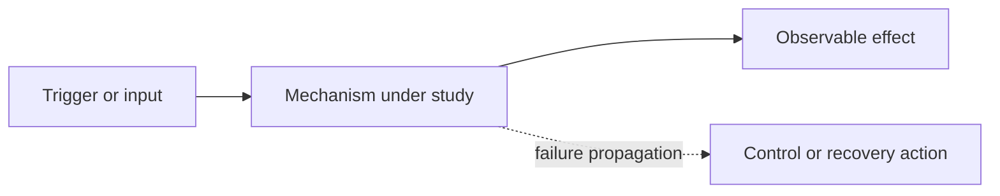

<!-- study-contract: principal -->

# Study title

| Field | Value |
|---|---|
| Artifact type | principal-study / candidate-dossier / architecture-study / comparative-study |
| Decision question | What consequential decision will this study inform? |
| Decision owner | Accountable role or forum |
| Primary audiences | Roles expected to act |
| Scope | Bounded archetypes, option-resolution state, versions/version policy, workloads, and environments; exact option fields when resolved |
| Evidence state | hypothesis / documented / observed / inconclusive / approved |
| Reference case | Scenario name and whether it is synthetic |
| As-of date | YYYY-MM-DD |
| Next gate | Forum, evidence required, and acceptance condition |

## Provisional answer

State what can be concluded, confidence, what cannot be concluded, and the consequence of error.

## Decision context and boundaries

Define the bounded archetype or mechanism, included and excluded scope, current constraints, non-goals, and the Gate-1 fields that must close before any archetype becomes an exact scoreable option.

## Scenario and assumptions

Describe the critical journeys, workload and traffic shape, identity and network dependencies, failure domains, operator model, recovery targets, and commercial assumptions. Label invented values **scenario assumptions**.

## Mechanism analysis

Explain request, control, configuration, identity, state, telemetry, and recovery paths. Identify component ownership and support boundaries.

**Figure interpretation:** Explain the decision-relevant relationship and the figure's limitations.

## Comparative evidence

| Question | Option A | Option B | Evidence state | Decision relevance |
|---|---|---|---|---|
| Mechanism or constraint | Unknown | Unknown | Open question | State what changes when answered |

Use point-of-use links for all material product, standard, and support claims.

## Failure modes and operating consequences

Cover control-plane interruption, identity degradation, partial partition, bad configuration, overload, regional loss, certificate rollover, telemetry backpressure, and mixed-platform migration where applicable.

## Counter-hypotheses and non-fit conditions

State why the provisional answer may be wrong, what would falsify it, and what a negative result changes.

## Decision implications

Translate the analysis into a criterion, option disposition, architecture control, roadmap dependency, or evidence request. Do not select a vendor when readiness gates remain open.

## Falsification and proof plan

| Proof ID | Procedure | Measure | Threshold | Evidence artifact | Independent reviewer |
|---|---|---|---|---|---|
| TEST-001 | Reproducible steps | Observable metric | Pass/fail/stop condition | Versioned result bundle | Reviewer role |

## Risks and limitations

List excluded scope, unknown facts, stale or volatile claims, scenario sensitivity, untested behavior, and evidence that may not generalize.

## Open evidence requests

| Request | Owner role | Due gate | Decision impact if unresolved |
|---|---|---|---|
| Missing fact or result | Role | Gate | Defer, exclude, or carry as risk |

## Next gate

Name the review forum, required evidence, and acceptance condition.
